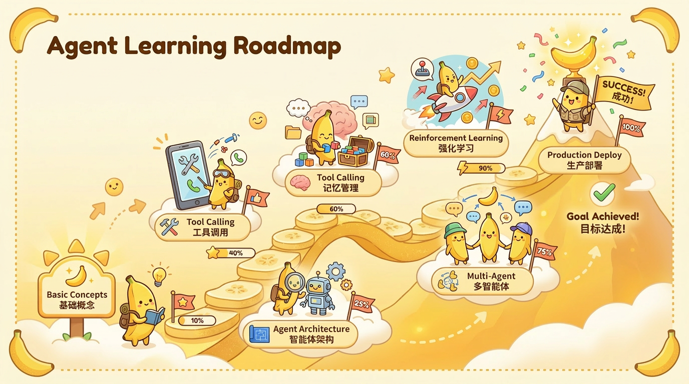

<div align="center">



<br>

# 🤖 Learn Agent Development from Scratch

**A systematic, comprehensive, and practice-oriented AI Agent development guide**

**Daily auto-tracking of arXiv frontier papers — content stays cutting-edge, always.**

<br>

[](https://opensource.org/licenses/MIT)
[](https://github.com/Haozhe-Xing/agent_learning)
[](https://github.com/Haozhe-Xing/agent_learning/pulls)
[](https://rust-lang.github.io/mdBook/)
[](https://arxiv.org)

<br>

[](https://Haozhe-Xing.github.io/agent_learning/zh/)&nbsp;&nbsp;&nbsp;[](https://Haozhe-Xing.github.io/agent_learning/en/)

<br>

[🐛 Report Issues](https://github.com/Haozhe-Xing/agent_learning/issues) · [💬 Discussions](https://github.com/Haozhe-Xing/agent_learning/discussions) · [🇨🇳 中文版 README](README_ZH.md)

</div>

---

## 🚀 Auto-Tracking Frontier: Daily arXiv Paper Updates

<div align="center">

🤖 **This repository automatically searches arXiv for the latest AI Agent-related papers every day and updates the content accordingly — ensuring you always stay at the cutting edge of research!**

</div>

- 📡 **Daily Automated Search**: A scheduled pipeline scans arXiv daily for new papers on Agent architectures, tool use, memory systems, multi-agent collaboration, reinforcement learning for agents, and more.
- 📝 **Auto-Updated Content**: Relevant findings are automatically integrated into the corresponding chapters, keeping the book's frontier sections fresh and up-to-date.
- 🔔 **Never Miss a Breakthrough**: No need to manually track dozens of research feeds — this repo does it for you, so you can focus on learning and building.

> 💡 This means the content you read here is **not static** — it evolves continuously with the latest advances in the AI Agent field.

---

## ✨ Key Features

- 🎯 **Step by Step**: From LLM fundamentals to multi-Agent systems, each chapter has a clear knowledge progression
- 💻 **Code First**: Every core concept comes with runnable Python code examples
- 🎨 **Rich Illustrations**: 120+ hand-drawn SVG architecture diagrams / flowcharts / sequence diagrams for intuitive understanding
- 🎬 **Interactive Animations**: 5 built-in interactive HTML animations (Perceive-Think-Act cycle, ReAct reasoning, Function Calling, RAG flow, GRPO sampling)
- 🔬 **Paper Reviews**: Key chapters include frontier paper deep-dives (ReAct, Reflexion, MemGPT, GRPO, etc.)
- 🏗️ **Complete Projects**: 3 comprehensive hands-on projects (AI Coding Assistant, Intelligent Data Analysis Agent, Multimodal Agent)
- 🛡️ **Production Ready**: Covers security, evaluation, deployment, and other production essentials
- 🧪 **Cutting Edge**: Covers Context Engineering, Agentic-RL (GRPO/DPO/PPO), MCP/A2A/ANP, and other 2025–2026 latest advances
- 📐 **Formula Support**: KaTeX-rendered math formulas for clear reading of policy gradient, KL divergence derivations in RL chapters
- 🔄 **Continuously Updated**: Tracking the latest changes in LangChain, LangGraph, MCP, and other frameworks

---

## 📸 Selected Content Preview

> Below are selected showcases from the book's **120+ hand-drawn SVG illustrations**, all original to this book.

### 🧠 Agent Core Architecture

<table>
<tr>
<td width="50%" align="center">

**Perceive-Think-Act Loop (Chapter 1)**


<sub>Agent's core mechanism: Perceive environment → LLM reasoning → Execute action → Loop until goal achieved</sub>

</td>
<td width="50%" align="center">

**ReAct Reasoning Framework (Chapter 6)**


<sub>Thought → Action → Observation alternating loop, enabling Agents to think while acting</sub>

</td>
</tr>
</table>

### 🛠️ Tool Calling & RAG

<table>
<tr>
<td width="50%" align="center">

**Function Calling Complete Flow (Chapter 4)**


<sub>6-step complete flow from user input to tool invocation to final response, with message structure illustration</sub>

</td>
<td width="50%" align="center">

**RAG Retrieval-Augmented Generation (Chapter 7)**


<sub>Offline indexing + Online retrieval dual-phase architecture, making LLM answers evidence-based</sub>

</td>
</tr>
</table>

### 💾 Memory System & Context Engineering

<table>
<tr>
<td width="50%" align="center">

**Three-Layer Memory Architecture (Chapter 5)**


<sub>Working memory → Short-term memory → Long-term memory, with important info sinking down and semantic retrieval pulling up</sub>

</td>
<td width="50%" align="center">

**Prompt Engineering vs Context Engineering (Chapter 8)**


<sub>From "how to say it" to "what the LLM sees" — the paradigm shift of the Agent era</sub>

</td>
</tr>
</table>

### 🤝 Multi-Agent & Communication Protocols

<table>
<tr>
<td width="50%" align="center">

**Three Multi-Agent Communication Patterns (Chapter 14)**


<sub>Message Queue (async decoupling) / Shared Blackboard (data sharing) / Direct Call (real-time collaboration)</sub>

</td>
<td width="50%" align="center">

**MCP / A2A / ANP Protocol Comparison (Chapter 15)**


<sub>Three-layer protocol stack: ANP for discovery → A2A for task collaboration → MCP for tool invocation</sub>

</td>
</tr>
</table>

### 🧪 Reinforcement Learning & Frameworks

<table>
<tr>
<td width="50%" align="center">

**GRPO Training Architecture (Chapter 10)**


<sub>No Critic model needed, computes advantage via intra-group normalization, only 1.5× model size in VRAM</sub>

</td>
<td width="50%" align="center">

**LangGraph Three Core Concepts (Chapter 12)**


<sub>State (shared state) · Node (processing unit) · Edge (execution flow control)</sub>

</td>
</tr>
</table>

<div align="center">

📖 **The above is just a selected preview** — For the full 120+ architecture diagrams + 5 interactive animations, please [**read online**](https://Haozhe-Xing.github.io/agent_learning)

</div>

---

## 🎬 Interactive Animations

This book includes **5 interactive HTML animations** to help you intuitively understand the dynamic processes of core concepts:

| Animation                      | Chapter    | Description                                                                 |
| ------------------------------ | ---------- | --------------------------------------------------------------------------- |
| 🔄 **Perceive-Think-Act Cycle** | Chapter 1  | Dynamic demonstration of Agent's core loop                                  |
| 💡 **ReAct Reasoning Process**  | Chapter 6  | Shows the alternating Thought → Action → Observation process              |
| 🔧 **Function Calling**         | Chapter 4  | Complete tool invocation flow animation                                     |
| 📚 **RAG Retrieval Flow**       | Chapter 7  | From document chunking to vector retrieval to answer generation             |
| 🎯 **GRPO Sampling Process**    | Chapter 10 | Visualization of intra-group multi-output sampling and reward normalization |

> 💡 Interactive animations are only available in the [online e-book](https://Haozhe-Xing.github.io/agent_learning). Local builds can also preview them.

---

## 🔥 Core Topics at a Glance

<table>
<tr>
<td width="50%">

**🧠 Agent Core Architecture**
- Perceive → Think → Act Loop
- ReAct Reasoning Framework
- Task Decomposition & Planning
- Reflection & Self-Correction

**🛠️ Tools & Skills**
- Function Calling Mechanism
- Custom Tool Design
- Skill System Construction
- Tool Description Best Practices

**🧪 Reinforcement Learning Training**
- SFT + LoRA Basic Training
- PPO / DPO / GRPO Algorithm Deep-Dive
- Complete Training Pipeline Hands-on
- 2025–2026 Latest Research Advances

</td>
<td width="50%">

**💾 Memory, Knowledge & Context**
- Short-term / Long-term / Working Memory
- Vector Databases (Chroma / FAISS)
- RAG Retrieval-Augmented Generation
- Context Engineering & Attention Budget

**🤝 Multi-Agent Collaboration & Communication**
- MCP / A2A / ANP Protocol Stack
- Supervisor vs Decentralized Patterns
- CrewAI / AutoGen Frameworks
- LangGraph Stateful Agents

**🛡️ Production Full Pipeline**
- Evaluation Benchmarks (GAIA / SWE-bench)
- Security Defense & Sandbox Isolation
- Containerized Deployment & Streaming
- Observability & Cost Optimization

</td>
</tr>
</table>

---

## 🚀 Quick Start

### Local Build

```bash
# Install mdBook (choose one)
cargo install mdbook
# Or macOS: brew install mdbook

# Install mdbook-katex plugin (for math formula rendering)
cargo install mdbook-katex

# Clone the repository
git clone https://github.com/Haozhe-Xing/agent_learning.git
cd agent_learning

# Build both Chinese and English versions and start unified server (default port 3000)
./serve.sh
```

After starting, visit:

- 🌐 **Language Selection Home**: `http://localhost:3000`
- 🇨🇳 **Chinese Version**: `http://localhost:3000/zh/`
- 🇺🇸 **English Version**: `http://localhost:3000/en/`

### Environment Setup (For Code Practice)

```bash
# Python 3.11+
python -m venv venv
source venv/bin/activate  # Windows: venv\Scripts\activate

# Install core dependencies
pip install langchain langchain-openai langgraph openai anthropic

# Configure API Key
export OPENAI_API_KEY="your-key-here"
```

---

## 📊 Technology Stack


-191919?style=flat)


---

## 🤝 Contributing

All forms of contribution are welcome!

- 🐛 **Found a bug**: [Submit an Issue](https://github.com/Haozhe-Xing/agent_learning/issues)
- 💡 **Content suggestions**: [Start a Discussion](https://github.com/Haozhe-Xing/agent_learning/discussions)
- 📝 **Improve content**: Fork → Edit → Submit PR
- ⭐ **Support the project**: Give this repo a Star!

### Contributing Guide

```bash
# Fork and clone
git clone https://github.com/YOUR_USERNAME/agent_learning.git

# Create a feature branch
git checkout -b feature/improve-chapter-4

# Local preview
./serve.sh

# Commit and push
git commit -m "feat: improve Chapter 4 tool calling code examples"
git push origin feature/improve-chapter-4
```

### Content Organization Conventions

- Each chapter is placed in a separate directory `src/zh/chapter_xxx/` (Chinese) or `src/en/chapter_xxx/` (English)
- Chapter overview goes in `README.md`, sections are numbered as `01_xxx.md`, `02_xxx.md`
- Chinese SVG illustrations go in `src/zh/svg/`, English versions in `src/en/svg/`, naming format: `chapter_xxx_description.svg`
- Chinese interactive animations go in `src/zh/animations/`, English versions in `src/en/animations/`

---

## 📄 License

This project is open-sourced under the [MIT License](LICENSE).

---

## ⭐ Star History

If this project helps you, please give it a Star ⭐ — it's the greatest encouragement for the author!

---

<div align="center">

**Built with ❤️, so that every developer can master AI Agent development**

[⬆ Back to Top](#-learn-agent-development-from-scratch)

</div>
