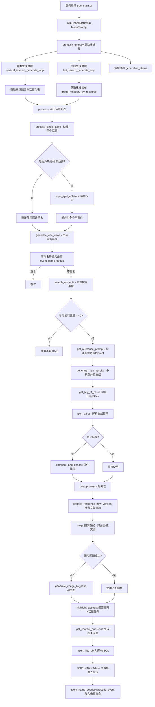

# AI 快看 - 新闻自动生成流水线服务

> **AI News Generation Pipeline Server**
>
> 基于大模型（DeepSeek）的自动化新闻资讯生成服务，支持多垂类话题的自动搜索、素材聚合、内容生成、质量审核、图文匹配及自动入库发布。
>
> 📡 **线上服务管理**：[123平台 - ai_news_generation_pipeline_server](https://123.woa.com/v2/formal#/server-manage/index?app=mtt&server=ai_news_generation_pipeline_server)
---

## 目录

- [项目概述](#项目概述)
- [系统架构](#系统架构)
- [完整生产链路](#完整生产链路)
- [目录结构与文件说明](#目录结构与文件说明)
- [核心模块详解](#核心模块详解)
- [外部依赖服务](#外部依赖服务)
- [配置与部署](#配置与部署)
- [已知问题与注意事项](#已知问题与注意事项)
- [未来规划](#未来规划)

---

## 项目概述

本项目是一个端到端的 AI 新闻内容自动生成服务，部署在 TRPC 框架上，通过多进程调度实现以下能力：

1. **垂类兴趣内容生成**：按配置的垂类（如科技前沿、国际视野、游戏资讯等）和话题词，定时自动搜索素材并生成新闻稿件
2. **热榜内容生成**：从热搜榜单获取实时热点，自动生成对应新闻
3. **手动触发接口**：支持通过 RPC 接口手动触发指定垂类的内容生成

---

## 系统架构

```
┌─────────────────────────────────────────────────────────────────┐
│                        trpc_main.py (服务入口)                    │
│  ┌──────────────┐  ┌────────────────────────┐                   │
│  │ ManualAdj    │  │ crontask_entry.py      │                   │
│  │ Servicer     │  │ (定时任务调度)           │                   │
│  │ (手动触发)    │  │                        │                   │
│  └──────┬───────┘  └───────┬────────────────┘                   │
│         │                  │                                     │
│         └──────────────────┘                                     │
│                  ▼                                               │
│              ┌────────────────────────┐                          │
│              │  demo.py (核心业务逻辑)  │                          │
│              │  process() 主流程入口    │                          │
│              └────────────┬───────────┘                          │
└───────────────────────────┼─────────────────────────────────────┘
                            │
          ┌─────────────────┼─────────────────────┐
          ▼                 ▼                      ▼
   ┌─────────────┐  ┌──────────────┐     ┌──────────────────┐
   │ 搜索与素材    │  │ LLM 内容生成  │     │ 后处理与入库      │
   │ 聚合模块      │  │ 模块          │     │ 模块             │
   └─────────────┘  └──────────────┘     └──────────────────┘
```

---

## 完整生产链路

以下是一篇新闻从话题到最终发布的完整流程：



### 链路各阶段详解

#### 1. 服务启动与初始化
- `trpc_main.py` 启动 TRPC 服务，加载 Rainbow 配置中心的配置
- 初始化数据库连接、搜索 Token、TRPC API、Nano 生图配置、所有 Prompt 模板
- `crontask_entry.py` 通过多进程启动垂类生成循环、热榜生成循环、监控进程

#### 2. 调度与话题获取
- **垂类生成**：`vertical_interest_generate_loop` 基于小时窗口调度，在配置的 `run_hours` 时段内每小时执行一次
- **热榜生成**：`hot_search_generate_loop` 持续循环，每 500 秒拉取一次热搜榜单
- 话题来源：垂类话题从数据库 `get_topic_dict_by_category` 获取；热榜从 `group_hotquery_by_resource` 获取

#### 3. 话题拆分（非热榜）
- 调用 `topic_split_enhance`（`prompt/subquery_generate.py`），通过 LLM 将一个大话题拆分为多个具体子事件
- 例如："人工智能最新进展" → ["OpenAI发布GPT-5", "中国AI芯片突破", ...]

#### 4. 事件名称语义去重
- `utils/event_name_dedup.py` 维护全局事件名称集合（MySQL持久化 + 内存缓存）
- 通过 Conan Embedding 计算语义相似度，阈值 0.93 以上判定为重复，避免同一事件重复生成

#### 5. 多源搜索与素材聚合
- `get_search_reference_prompt.py` 中的 `search_contents` 函数聚合多个搜索源：
  - **快搜（kdsou）**：腾讯内部搜索引擎
  - **天机搜索（tianji）**：`search_tool.py` 调用天机 API
  - **XSearch**：`trpc_api.py` 中通过 TRPC 调用 XSearch 媒体搜索
- 搜索结果经过以下处理：
  - 腾讯新闻 URL 转换为企鹅号（`transform_clue_dict`）
  - 文档质检过滤（`prompt/doc_inspection.py` - `get_batch_inspection_result`）
  - 参考资料清洗（`prompt/clean_reference.py`）
  - URL 图片过滤、时间归一化等

#### 6. LLM 内容生成
- `utils/call_llm.py` 封装了太极平台 LLM 调用接口：
  - `get_taiji_r1_result`：同步调用（主要使用 DeepSeek-V3.2-Online-32k）
  - `get_taiji_async_r1_result`：异步调用
- 生成流程：
  - 构建首次生成 Prompt（`prompt/prompt_template.py` - `get_first_prompt`），包含垂类规则、输出样例、参考资料
  - 多模型并行生成（`generate_multi_results`），当前使用两次 DeepSeek-V3.2
  - 稿件择优（`prompt/choose_better_one.py` - `compare_and_choose`）

#### 7. 后处理
- **参考文献追加**：`reference_process.py` - `replace_reference_new_version`，将引用标记替换为实际参考链接
- **图文匹配**：`trpc_api.py` - `get_top_1_text2img_by_ihvqa`，调用 ihvqa 图文匹配接口为文章匹配封面图和正文图
- **AI 生图兜底**：`utils/image_generation_nano.py` - `generate_image_by_nano`，当无法匹配到合适图片时，通过 Venus Nano API 生成封面图
- **摘要高亮**：`utils/highlight_service.py` - `highlight_abstract`，对摘要关键内容进行高亮标注，同时进行跨垂类话题重分类
- **相关问题生成**：`prompt/question.py` - `get_content_questions`，为文章生成延伸阅读问题

#### 8. 入库与推送
- `utils/sql_tool.py` - `insert_into_db`：将生成的新闻写入 MySQL 数据库
- `utils/bot_push.py` - `BotPushNewArticle`：通过企业微信机器人推送新文章通知

---

## 目录结构与文件说明

### 核心业务文件（有用逻辑）

| 文件 | 功能说明 |
|------|---------|
| `trpc_main.py` | **服务入口**，启动 TRPC 服务，初始化所有配置，注册 RPC 接口，启动定时任务 |
| `crontask_entry.py` | **定时任务调度**，通过多进程启动垂类生成、热榜生成、监控等子进程 |
| `demo.py` | **核心业务逻辑**，包含 `process()`、`generate_one_news()`、`post_process()` 等主流程函数 |
| `manual_adjustment.py` | **手动触发接口**，提供 `ExecuteTask` RPC 方法，支持手动触发指定垂类生成 |
| `get_search_reference_prompt.py` | **搜索与素材聚合**，多源搜索、素材过滤、参考资料 Prompt 构建 |
| `reference_process.py` | **参考文献处理**，将生成内容中的引用标记替换为实际参考链接 |
| `search_tool.py` | **天机搜索封装**，调用天机 API 进行新闻搜索 |
| `trpc_api.py` | **外部 TRPC 接口封装**，包含 XSearch、eproxy 快照、ihvqa 图文匹配、CMS ID 转换等 |
| `duplicate_check.py` | **内容重复度检测**，通过标题/摘要/正文多级检查判断是否与历史文章重复 |
| `topic_match.py` | **话题分类校正**，通过 LLM 将生成内容重新匹配到最合适的话题分类 |

### Prompt 模块（`prompt/`）

| 文件 | 功能说明 |
|------|---------|
| `prompt_template.py` | **核心生成 Prompt**，定义新闻生成的详细规则（忠实度、时间准确性、语言风格等） |
| `prompt_init.py` | Prompt 初始化，从数据库加载自定义 Prompt 配置 |
| `subquery_generate.py` | **话题拆分 Prompt**，将大话题拆分为具体子事件 |
| `doc_inspection.py` | **文档质检 Prompt**，对搜索到的参考资料进行质量评估和过滤 |
| `clean_reference.py` | **参考资料清洗 Prompt**，去除重复、低质量的参考资料 |
| `choose_better_one.py` | **稿件择优 Prompt**，比较两篇生成稿件选出更优的一篇 |
| `quality_inspection.py` | **质量审核 Prompt**，对生成内容进行多维度质量检查（当前未在主流程中启用） |
| `modify.py` | **内容修正 Prompt**，根据审核意见修改生成内容（当前未在主流程中启用） |
| `query_rewrite.py` | **查询改写 Prompt**，对搜索查询词进行改写优化 |
| `question.py` | **相关问题生成 Prompt**，为文章生成延伸阅读问题 |
| `vertical_rule_prompt.py` | 垂类规则 Prompt 字典（静态配置） |
| `vertical_sample_prompt.py` | 垂类输出样例 Prompt 字典（静态配置） |

### 工具模块（`utils/`）

| 文件 | 功能说明 |
|------|---------|
| `call_llm.py` | **LLM 调用封装**，太极平台接口（同步/异步）、混元 Embedding、Conan Embedding、ihvqa 图文匹配 |
| `sql_tool.py` | **数据库操作**，MySQL 增删改查，话题配置读取，内容入库等 |
| `json_parser.py` | **JSON 解析器**，从 LLM 返回的文本中提取 JSON 结构 |
| `common_util.py` | **通用工具函数**，Markdown 格式修复、时间归一化、URL 过滤、日志工具等 |
| `event_name_dedup.py` | **事件名称语义去重**，基于 Embedding 相似度的全局去重（MySQL 持久化） |
| `monitoring.py` | **监控统计**，收集各环节指标并通过企微机器人推送统计报表图片 |
| `bot_push.py` | **企微机器人推送**，发送新文章通知和统计报表 |
| `image_generation_nano.py` | **AI 生图（Nano）**，通过 Venus Nano API 生成封面图 |
| `image_generation.py` | **图片生成与 COS 上传**，COS 配置管理和图片上传 |
| `generate_svg_png.py` | **SVG/PNG 图片生成**，生成信息图类型的正文配图 |
| `highlight_service.py` | **摘要高亮服务**，对摘要关键内容进行高亮标注 + 跨垂类话题重分类 |
| `content_id_converter.py` | **内容 ID 转换**，CID 与 Rowkey 互转 |
| `cid_rowkey_transfer.py` | **CID/Rowkey 转换**（与 content_id_converter 功能重叠） |
| `url_check.py` | URL 有效性检查 |
| `xsearch_source.py` | XSearch 媒体源映射 |

### 配置与数据模块（`puin_dir/`）

| 文件 | 功能说明 |
|------|---------|
| `vertical_dict.py` | **垂类配置构建**，组装各垂类的话题、账号、站点、规则等配置 |
| `good_puin.py` | 优质企鹅号账号列表（静态数据，文件较大 ~345KB） |
| `vertical_site.py` | 各垂类对应的搜索站点列表 |
| `topic_list.py` | 话题列表（静态数据） |
| `query_mapping.py` | 查询映射 |

### 协议与 Stub 文件

| 目录 | 功能说明 |
|------|---------|
| `stub/` | 本服务的 TRPC Stub 定义（ManualAdjustment 接口） |
| `proto/` | XSearch 搜索代理的 Protobuf 定义 |
| `trpc_contentcenter_eproxy/` | 内容中心 eproxy 的 Protobuf 定义 |

### 可能废弃/低优先级的文件

| 文件 | 说明 |
|------|------|
| `trag_api.py` | TRAG 工具 SDK 调用，代码中已被注释掉（`# from trag_api import get_rag_result`），**当前未使用** |
| `debug_news.py` | 调试平台接口（已废弃），提供 `GetAllPrompts`、`ExecuteDebugTask` 等 RPC 方法，**当前未使用** |
| `get_subquery_ref_prompt.py` | 子查询参考资料处理的独立测试脚本，仅有 `__main__` 测试逻辑，**非生产代码** |
| `learning_resources/` | 学习资料目录（LLM 新闻幻觉检测论文整理等），**非代码逻辑** |
| `todo.md` | 优化计划文档，**非代码逻辑** |
| `fonts/` | 字体文件目录，用于 SVG/PNG 图片生成 |
| `third_party/TencentSans-W3.ttf` | 第三方字体文件，用于监控报表图片生成 |

---

## 核心模块详解

### LLM 调用（`utils/call_llm.py`）

项目通过太极平台调用大模型，主要使用以下模型：

| 模型 | 用途 | 调用方式 |
|------|------|---------|
| `DeepSeek-V3_2-Online-32k` | 主力生成模型（支持联网搜索） | 同步 `get_taiji_r1_result` |
| `deepseek-r1-32k` | 异步场景备用模型 | 异步 `get_taiji_async_r1_result` |
| `DeepSeek-R1-0528-Distilled-Qwen3-8B` | 轻量级模型（通过 Polaris） | `RequestQW8bByPolaris` |
| `hunyuan-embedding` | 文本向量化 | `get_hunyuan_text_embedding` |
| `Conan Embedding (server:261520)` | 文本向量化（用于去重） | `get_batch_conan_text_embedding` |

### 搜索素材聚合（`get_search_reference_prompt.py`）

搜索流程：
1. **快搜（kdsou）**：调用 `http://kdsou.woa.com/api/vr/v1` 获取搜索结果
2. **天机搜索**：调用 `search_tool.py` 中的 `search_tianji_sites_2`
3. **XSearch 媒体搜索**：通过 TRPC 调用 XSearch 按优质媒体账号搜索
4. **腾讯新闻转企鹅号**：将腾讯新闻 URL 转换为企鹅号内容
5. **文档质检**：通过 LLM 对搜索结果进行时效性、相关性评估
6. **参考资料清洗**：去除重复和低质量内容

### 监控与统计（`utils/monitoring.py`）

通过多进程 Queue 收集各环节指标，包括：
- 各搜索源线索数量（kd/天机/xsearch/大卡/脉络）
- 线索过滤统计（规则过滤/LLM过滤/可用量）
- 生成统计（总结次数/修改次数）
- 结果统计（线索不足/机审过滤/长度过滤/排重过滤/上传成功数）

每轮所有垂类执行完毕后，生成统计报表图片通过企微机器人推送。

---

## 外部依赖服务

| 服务 | 用途 | 接入方式 |
|------|------|---------|
| **太极平台（mtt-llm）** | LLM 推理（DeepSeek 系列） | HTTP API |
| **天机搜索** | 新闻搜索 | HTTP API（需 appid + secret） |
| **快搜（kdsou）** | 腾讯内部搜索 | HTTP API |
| **XSearch** | 媒体内容搜索 | TRPC 协议 |
| **eproxy** | 内容快照获取 | TRPC 协议 |
| **ihvqa** | 图文匹配（imatch 模型） | HTTP API |
| **Venus Nano** | AI 生图 | HTTP API |
| **混元 Embedding** | 文本向量化 | HTTP API |
| **Conan Embedding** | 文本向量化（去重用） | HTTP API（Venus） |
| **COS（腾讯云对象存储）** | 图片存储 | cos-python-sdk-v5 |
| **Rainbow 配置中心** | 服务配置管理 | trpc-rainbow |
| **MySQL** | 数据持久化 | pymysql |
| **企业微信机器人** | 消息推送 | Webhook |

---

## 配置与部署

### 配置文件

- `trpc_python.yaml` / `local_trpc_python.yaml`：TRPC 框架配置（服务端口、命名服务、日志等）
- `service.yaml`（Rainbow 配置中心）：业务配置，包含：
  - `generation.env`：运行环境（test/Production）
  - `generation.publish_puin`：发布账号
  - `generation.run_hours`：垂类生成的运行时段
  - `generation.process_queue`：多进程垂类分组
  - `generation.while_list`：线上启用的垂类白名单
  - `search.tianji`：天机搜索凭证
  - `search.xsearch`：XSearch 凭证
  - `venus`：Venus Nano 生图配置

### 启动方式

```bash
# 正式环境（通过 TRPC 框架启动）
python3 trpc_main.py --conf=trpc_python.yaml

# 本地调试（直接运行 demo.py）
python3 demo.py
```

### 构建与部署

```bash
# 构建
bash build.sh

# 清理
bash clean.sh
```

---

## 已知问题与注意事项

### Bug 与代码问题

1. **`call_llm.py` 中 `response.status` 属性错误**（已修复）
   - `get_taiji_r1_result` 函数中，错误日志使用了 `response.status`（aiohttp 属性），而 `requests.Response` 的正确属性是 `response.status_code`
   - 当 HTTP 请求返回非 200 状态码时，会触发 `AttributeError` 而非正确的错误信息

2. **`content_id_converter.py` 与 `cid_rowkey_transfer.py` 功能重叠**
   - 两个文件都实现了 CID/Rowkey 转换的 `ContentCenter` 类，存在重复代码

3. **`search_tool.py` 中 `search_images_by_query` 函数重复定义**
   - 同一个函数在文件中定义了两次，第二次定义覆盖了第一次

4. **`duplicate_check.py` 中 `normalize_release_time` 重复定义**
   - 该函数在 `common_util.py` 中已有定义，`reference_process.py` 中又重新定义了一份

### 架构注意事项

1. **Prompt 长度限制**：`MAX_PROMPT_LENGTH = 100000`，超过此长度的 Prompt 会被直接跳过
2. **LLM 调用重试**：所有 LLM 调用都配置了 3 次重试 + 指数退避策略
3. **多进程架构**：垂类生成、热榜生成、监控分别运行在独立进程中，通过 `multiprocessing.Queue` 通信
4. **质量审核与修改流程**：`quality_inspection.py` 和 `modify.py` 已实现但**当前未在主流程中启用**
5. **内容重复检测**：`duplicate_check.py` 已实现但**当前未在主流程 `generate_one_news` 中调用**
6. **敏感词过滤**：`sensitive_keyword_filter` 函数已实现但在主流程中被注释掉

### 性能相关

1. 每篇新闻生成涉及多次 LLM 调用（话题拆分、内容生成、稿件择优、摘要高亮、相关问题生成等），单篇耗时较长
2. 搜索素材阶段涉及多个外部服务调用，网络延迟是主要瓶颈
3. 事件去重使用 Embedding 计算，每次需要与历史所有事件比较

---

## 未来规划

参见 [todo.md](todo.md)，主要方向包括：

1. **搜索内容来源优化**（P0）：提升企鹅号和 XSearch 搜索的可用率
2. **多图融合功能**（P0）：引入多模态技术，实现一文多图
3. **模型训练**（P0）：针对新闻审核场景训练专用模型，降低误判率
4. **垂类拓展**：养生健康、科普教育、生活技巧、历史人文等低时效性内容
5. **视频匹配**：基于语义从视频库中匹配相关视频，丰富内容形态
