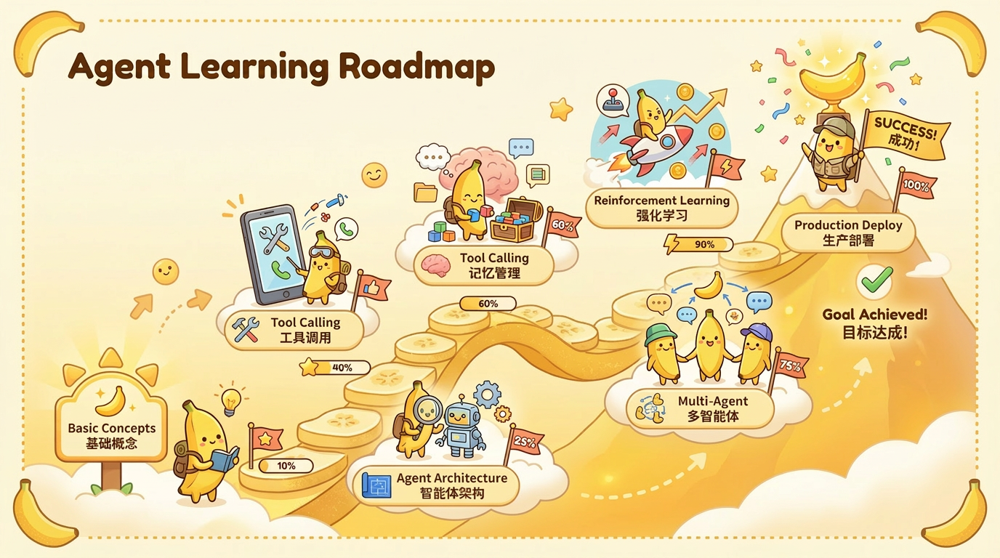

<div align="center">



# 从零开始学 AI Agent

**一本图解驱动、中英双语、面向真实工程的 AI Agent 开源书。**

从 Function Calling、记忆、规划、RAG、上下文工程，一直讲到 Agentic RL、多 Agent、评估、安全与生产部署。

<p>
<a href="https://Haozhe-Xing.github.io/agent_learning/zh/"></a>
<a href="https://Haozhe-Xing.github.io/agent_learning/en/"></a>
</p>

<p>
<a href="https://github.com/Haozhe-Xing/agent_learning/stargazers"></a>
<a href="LICENSE"></a>
<a href="https://github.com/Haozhe-Xing/agent_learning/pulls"></a>


</p>

[English README](README.md) · [完整目录](#完整目录) · [可运行参考实现](#可运行参考实现) · [参与贡献](#参与贡献)

</div>

---

## 这个仓库是什么？

`agent_learning` 是一本开源 AI Agent 教科书，也是一个结构化学习仓库。它填补的是 **「我会调用 LLM API」到「我能构建、评估、保护并部署 Agent 系统」**之间的空白。

全书不是按框架 API 堆知识点，而是沿着一条统一主线展开：

> **大模型基础 → 工具 → 记忆 → 规划 → RAG → 上下文 → Harness → 技能 → Agentic RL → 多 Agent → 评估 → 安全 → 部署**

仓库包含：

- **23 章完整内容**，覆盖基础、核心能力、框架、多 Agent、生产化和综合项目。
- **每种语言 188 个 Markdown 页面**，中文与英文同步维护。
- **330+ 张原创 SVG 图解**和 **5 个交互动画**，解释架构、状态、时序和训练流程。
- **从论文到工程的解读**，覆盖 ReAct、Reflexion、MemGPT/Letta、GraphRAG、GRPO、MCP、A2A 等主题。
- **`reference-agent/` 可运行教学底座**，包含工具、记忆、安全闸门、评估、MCP Server、FastAPI 服务和 16 个测试。

> 它不是 Awesome List，也不是某个框架的使用手册，而是一条从原理到生产工程的完整学习路径。

---

## 为什么值得看

| 你的需求 | 本项目提供什么 |
| --- | --- |
| 建立正确直觉 | 每项技术都先解释「什么工程问题逼出了它」，再讲机制和代码。 |
| 看懂复杂系统 | 原创图解覆盖 Agent Loop、消息流、记忆分层、协议边界和强化学习流程。 |
| 把论文用于工程 | 论文按工程问题组织，明确方法、贡献、落地启示和局限。 |
| 从 Demo 走向生产 | 单独讲评估、可观测性、提示注入、权限控制、部署和成本。 |
| 避免框架绑定 | 先讲机制，再把 LangChain、LangGraph、CrewAI、AutoGen 等作为具体实现。 |
| 中英双语学习 | `src/zh/` 与 `src/en/` 的正文、图解和交互内容保持对齐。 |

---

## 按你的目标开始

| 当前目标 | 推荐路线 |
| --- | --- |
| **第一次构建 Agent** | [Agent 基础](https://Haozhe-Xing.github.io/agent_learning/zh/chapter_intro/) → [大模型基础](https://Haozhe-Xing.github.io/agent_learning/zh/chapter_llm/) → [Hello Agent](https://Haozhe-Xing.github.io/agent_learning/zh/chapter_setup/04_hello_agent.html) |
| **构建 Agent 应用** | [工具](https://Haozhe-Xing.github.io/agent_learning/zh/chapter_tools/) → [记忆](https://Haozhe-Xing.github.io/agent_learning/zh/chapter_memory/) → [规划](https://Haozhe-Xing.github.io/agent_learning/zh/chapter_planning/) → [RAG](https://Haozhe-Xing.github.io/agent_learning/zh/chapter_rag/) |
| **让脆弱 Demo 变可靠** | [上下文工程](https://Haozhe-Xing.github.io/agent_learning/zh/chapter_context_engineering/) → [Harness 工程](https://Haozhe-Xing.github.io/agent_learning/zh/chapter_harness/) → [评估](https://Haozhe-Xing.github.io/agent_learning/zh/chapter_evaluation/) → [安全](https://Haozhe-Xing.github.io/agent_learning/zh/chapter_security/) |
| **训练和改进 Agent** | [Agentic RL](https://Haozhe-Xing.github.io/agent_learning/zh/chapter_agentic_rl/) → [自我进化 Agent](https://Haozhe-Xing.github.io/agent_learning/zh/chapter_self_evolving/) |
| **选择 Agent 框架** | [LangChain](https://Haozhe-Xing.github.io/agent_learning/zh/chapter_langchain/) → [LangGraph](https://Haozhe-Xing.github.io/agent_learning/zh/chapter_langgraph/) → [框架全景](https://Haozhe-Xing.github.io/agent_learning/zh/chapter_frameworks/) |
| **设计多 Agent 系统** | [多 Agent 协作](https://Haozhe-Xing.github.io/agent_learning/zh/chapter_multi_agent/) → [MCP / A2A / ANP](https://Haozhe-Xing.github.io/agent_learning/zh/chapter_protocol/) |

---

## 完整目录

| 部分 | 章节 | 核心主题 |
| --- | --- | --- |
| **第一部分：基础** | [1. 什么是 Agent？](https://Haozhe-Xing.github.io/agent_learning/zh/chapter_intro/) · [2. 大语言模型基础](https://Haozhe-Xing.github.io/agent_learning/zh/chapter_llm/) | Agent Loop、LLM 原理、BPE、Attention、KV Cache、RoPE、提示词、模型 API |
| **第二部分：核心能力** | [3. 工具](https://Haozhe-Xing.github.io/agent_learning/zh/chapter_tools/) · [4. 记忆](https://Haozhe-Xing.github.io/agent_learning/zh/chapter_memory/) · [5. 规划](https://Haozhe-Xing.github.io/agent_learning/zh/chapter_planning/) · [6. RAG](https://Haozhe-Xing.github.io/agent_learning/zh/chapter_rag/) · [7. 上下文](https://Haozhe-Xing.github.io/agent_learning/zh/chapter_context_engineering/) · [8. Harness](https://Haozhe-Xing.github.io/agent_learning/zh/chapter_harness/) · [9. 技能](https://Haozhe-Xing.github.io/agent_learning/zh/chapter_skill/) · [10. Agentic RL](https://Haozhe-Xing.github.io/agent_learning/zh/chapter_agentic_rl/) · [11. 自我进化](https://Haozhe-Xing.github.io/agent_learning/zh/chapter_self_evolving/) | Function Calling、MemGPT/Letta、ReAct、GraphRAG、上下文腐化、结构化输出、Skill System、PPO/DPO/GRPO、数据飞轮 |
| **第三部分：框架实战** | [12. LangChain](https://Haozhe-Xing.github.io/agent_learning/zh/chapter_langchain/) · [13. LangGraph](https://Haozhe-Xing.github.io/agent_learning/zh/chapter_langgraph/) · [14. 框架全景](https://Haozhe-Xing.github.io/agent_learning/zh/chapter_frameworks/) · [15. Claude Code](https://Haozhe-Xing.github.io/agent_learning/zh/chapter_claude_code/) | Chain、状态图、Human-in-the-Loop、CrewAI、AutoGen、低代码平台、Coding Agent |
| **第四部分：多 Agent** | [16. 多 Agent 协作](https://Haozhe-Xing.github.io/agent_learning/zh/chapter_multi_agent/) · [17. 通信协议](https://Haozhe-Xing.github.io/agent_learning/zh/chapter_protocol/) | Supervisor 与去中心化、角色分工、状态共享、MCP、A2A、ANP |
| **第五部分：生产化** | [18. 评估](https://Haozhe-Xing.github.io/agent_learning/zh/chapter_evaluation/) · [19. 安全](https://Haozhe-Xing.github.io/agent_learning/zh/chapter_security/) · [20. 部署](https://Haozhe-Xing.github.io/agent_learning/zh/chapter_deployment/) | Benchmark、LLM-as-Judge、可观测性、回归测试、提示注入、Guardrails、沙箱、FastAPI、Docker、Kubernetes |
| **第六部分：综合项目** | [21. 编程 Agent](https://Haozhe-Xing.github.io/agent_learning/zh/chapter_coding_agent/) · [22. 数据分析 Agent](https://Haozhe-Xing.github.io/agent_learning/zh/chapter_data_agent/) · [23. 多模态 Agent](https://Haozhe-Xing.github.io/agent_learning/zh/chapter_multimodal/) | 仓库编辑、代码执行、数据分析、报告生成、Computer Use、多模态 RAG |

**附录：**[提示词模板](https://Haozhe-Xing.github.io/agent_learning/zh/appendix/prompt_templates.html) · [常见问题](https://Haozhe-Xing.github.io/agent_learning/zh/appendix/faq.html) · [学习资源](https://Haozhe-Xing.github.io/agent_learning/zh/appendix/resources.html) · [术语表](https://Haozhe-Xing.github.io/agent_learning/zh/appendix/glossary.html) · [KL 散度](https://Haozhe-Xing.github.io/agent_learning/zh/appendix/kl_divergence.html) · [环境搭建](https://Haozhe-Xing.github.io/agent_learning/zh/chapter_setup/)

---

## 图解驱动的讲解

<table>
<tr>
<td width="50%" align="center">
<b>感知 → 思考 → 行动</b><br>

</td>
<td width="50%" align="center">
<b>Function Calling 完整链路</b><br>

</td>
</tr>
<tr>
<td width="50%" align="center">
<b>三层记忆架构</b><br>

</td>
<td width="50%" align="center">
<b>GRPO 训练架构</b><br>

</td>
</tr>
</table>

在线书还提供 Agent Loop、ReAct、Function Calling、RAG、GRPO 采样五个交互动画。

---

## 快速开始

### 在线阅读

- [中文在线书](https://Haozhe-Xing.github.io/agent_learning/zh/)
- [English Book](https://Haozhe-Xing.github.io/agent_learning/en/)

### 本地构建中英双语版本

依赖：`mdbook`、可选的 `mdbook-katex`、Python 3。

```bash
git clone https://github.com/Haozhe-Xing/agent_learning.git
cd agent_learning
./serve.sh
```

打开：

- `http://localhost:3000/` — 语言选择页
- `http://localhost:3000/zh/` — 中文版
- `http://localhost:3000/en/` — 英文版

需要监听源码变化时使用 `./serve.sh --watch`。

---

## 可运行参考实现

[`reference-agent/`](reference-agent/) 是实战章节共用的轻量教学实现，包含：

- 最小 ReAct 循环与工具注册表；
- 离线 `FakeProvider` 与可选的 OpenAI Provider；
- 记忆、提示注入防护和 fail-closed 权限检查；
- MCP Server、FastAPI 接口、流式输出、评估 Harness 和 Dockerfile；
- **16 个无需 API Key 即可运行的测试**。

```bash
cd reference-agent
python -m venv .venv
source .venv/bin/activate
pip install -e ".[dev]"
pytest -q
```

这套实现刻意保持足够小，方便读者读完源码。它是教学底座，不夸大为完整生产方案。

---

## 快速定位内容

下面的索引同时服务于读者、IDE 搜索和大模型代码检索，尽量让主题、关键词与目录直接对应。

| 想找什么 | 路径 / 关键词 |
| --- | --- |
| 中文正文 | `src/zh/` · `src/zh/SUMMARY.md` |
| 英文正文 | `src/en/` · `src/en/SUMMARY.md` |
| Function Calling 与工具 | `src/*/chapter_tools/` · 工具描述 · Tool Schema |
| Agent 记忆 | `src/*/chapter_memory/` · 短期记忆 · 长期记忆 · MemGPT · Letta |
| 规划与推理 | `src/*/chapter_planning/` · ReAct · Reflection · Plan-and-Execute |
| RAG 与检索 | `src/*/chapter_rag/` · Embedding · Rerank · GraphRAG · Agentic RAG |
| 上下文与 Harness 工程 | `src/*/chapter_context_engineering/` · `src/*/chapter_harness/` |
| Agentic RL 与自我进化 | `src/*/chapter_agentic_rl/` · `src/*/chapter_self_evolving/` · PPO · DPO · GRPO |
| 多 Agent 与协议 | `src/*/chapter_multi_agent/` · `src/*/chapter_protocol/` · MCP · A2A · ANP |
| 评估、安全、部署 | `src/*/chapter_evaluation/` · `src/*/chapter_security/` · `src/*/chapter_deployment/` |
| 可运行 Python 底座 | `reference-agent/src/reference_agent/` |
| SVG 图解与交互动画 | `src/*/svg/` · `src/*/animations/` |

仓库结构：

```text
agent_learning/
├── src/zh/                 # 中文 mdBook 源文件
├── src/en/                 # 英文 mdBook 源文件
├── reference-agent/        # 可运行教学底座与测试
├── theme/                  # 中英共用主题
├── book.toml               # 中文构建配置
├── book-en.toml            # 英文构建配置
└── serve.sh                # 构建双语版本并启动本地服务
```

---

## 项目原则

1. **先讲机制，再讲框架。** 先解释抽象为什么存在，再介绍具体 API。
2. **图必须承担信息。** 图解用于表达架构和流程，不做无意义装饰。
3. **论文必须落到工程。** 论文解读要包含贡献、机制、用途和局限。
4. **生产化表述必须诚实。** 明确可运行代码、测试、安全边界和已知限制。
5. **双语内容保持对齐。** 正文、图解、导航和交互动画同步维护。

---

## 参与贡献

欢迎纠错、优化讲解、补充可运行示例、修订翻译或新增论文解读。

- 发现错误：直接[提交 Issue](https://github.com/Haozhe-Xing/agent_learning/issues/new)。
- 修改章节：尽量同步修改 `src/zh/` 与 `src/en/` 中的对应文件。
- 新增页面：同时更新两份 `SUMMARY.md`。
- 新增图解：分别放入 `src/zh/svg/` 与 `src/en/svg/`。
- 提交 PR 前：运行 `./serve.sh`，确认中英文都能构建。

论文、协议、版本和外部项目相关事实，请优先引用一手来源，并保持可核验。

---

## 路线图

- [x] 23 章中英双语 mdBook
- [x] 本地化图解与交互动画
- [x] Agentic RL、上下文工程、Harness 工程、自我进化 Agent
- [x] 带离线测试的 `reference-agent` 可运行底座
- [ ] 更完整的端到端综合项目
- [ ] 可搜索的图解画廊与概念索引
- [ ] 评估与可观测性项目模板
- [ ] 更多练习题、面试题和回归用例

建议可以直接发到 [Issues](https://github.com/Haozhe-Xing/agent_learning/issues)。

---

## 开源协议

项目采用 [MIT License](LICENSE)。

<div align="center">

### 如果这个项目帮你节省了时间，欢迎点一个 Star。

Star 会让更多正在学习 AI Agent 的工程师找到一条结构化路线，而不是再掉进互不相连的链接清单里。

[阅读中文版](https://Haozhe-Xing.github.io/agent_learning/zh/) · [Read in English](https://Haozhe-Xing.github.io/agent_learning/en/) · [提交 Issue](https://github.com/Haozhe-Xing/agent_learning/issues)

</div>
