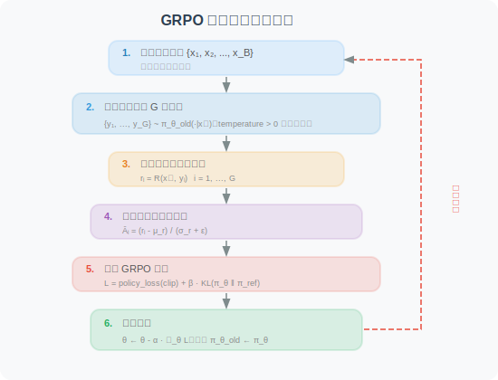

# 18.3 策略优化算法详解：PPO、DPO 与 GRPO

在 [18.1 节](./01_agentic_rl_overview.md) 中，我们介绍了 Agentic-RL 的两阶段训练范式（SFT → RL）。RL 阶段的核心问题是：**如何根据奖励信号来更新模型参数？** 这正是策略优化算法要解决的问题。

本节将从零开始，**系统性地讲解三种主流策略优化算法**：PPO（工业界经典）、DPO（学术界新秀）、GRPO（DeepSeek 创新）。我们将从最基本的直觉出发，逐步推导数学公式，并通过大量图示帮助理解。


---

## 预备知识：策略梯度的基本思想

在深入三种算法之前，我们需要理解一个共同的起点——**策略梯度（Policy Gradient）** [1]。

### 核心直觉

想象你在练习投篮。每次投篮后，你会得到一个反馈：进了（奖励 +1）或没进（奖励 0）。策略梯度的思想极其朴素：

> **如果某个动作获得了高奖励，就增加该动作的概率；如果获得了低奖励，就降低该动作的概率。**

形式化地，策略梯度定理给出的梯度方向为：

$$\nabla_\theta J(\theta) = \mathbb{E}_{\tau \sim \pi_\theta} \left[ \sum_{t=0}^{T} \nabla_\theta \log \pi_\theta(a_t | s_t) \cdot R(\tau) \right]$$

下面我们**逐项拆解**这个公式，并用一个具体的语言模型例子来帮助理解。

---

#### ① $\nabla_\theta J(\theta)$ —— "我该往哪个方向调参数？"

- $J(\theta)$ 是我们的**总目标**：模型在所有可能输入上的期望累积奖励。$J$ 越大，模型整体表现越好
- $\nabla_\theta$ 是对模型参数 $\theta$（即模型中数十亿个权重值）求梯度
- $\nabla_\theta J(\theta)$ 就是一个与 $\theta$ 同维度的向量，**它告诉我们：如果把每个参数往哪个方向微调一点点，$J$ 会增大最快**
- 训练时我们做的就是：$\theta \leftarrow \theta + \alpha \cdot \nabla_\theta J(\theta)$（$\alpha$ 是学习率），即沿梯度方向"上坡"

> **类比**：你蒙着眼站在山坡上，梯度就是"脚下最陡的上坡方向"。每走一步（更新一次参数），你就往山顶（最大奖励）靠近一点。

---

#### ② $\nabla_\theta \log \pi_\theta(a_t | s_t)$ —— "怎样调参数才能让这个动作更可能发生？"

这是公式中最核心也最难理解的部分，我们分层解释：

**第一层：$\pi_\theta(a_t | s_t)$ 是什么？**

$\pi_\theta$ 就是我们的语言模型。给定当前状态 $s_t$（对话历史 + 已生成的 token），它输出一个概率分布，表示"下一个 token 是什么"的概率。例如：

| 下一个 token ($a_t$) | 概率 $\pi_\theta(a_t \| s_t)$ |
|---------------------|-------------------------------|
| "搜索" | 0.35 |
| "回答" | 0.25 |
| "计算" | 0.20 |
| "我" | 0.10 |
| ... | ... |

$\pi_\theta(\text{"搜索"} | s_t) = 0.35$ 表示：在当前上下文下，模型认为下一步输出"搜索"的概率是 35%。

**第二层：$\log \pi_\theta(a_t | s_t)$ 为什么取对数？**

取对数有两个好处：
1. **数值稳定**：概率值在 0 到 1 之间，连乘多个 token 的概率会变得极小（如 $0.35 \times 0.20 \times 0.15 = 0.0105$），取对数后变为加法（$\log 0.35 + \log 0.20 + \log 0.15 = -4.56$），避免数值下溢
2. **梯度形式简洁**：$\nabla_\theta \log f(\theta) = \frac{\nabla_\theta f(\theta)}{f(\theta)}$，这个比率形式恰好是我们需要的

**第三层：$\nabla_\theta \log \pi_\theta(a_t | s_t)$ 到底是什么？**

这被称为**得分函数（score function）**。它是一个与模型参数 $\theta$ 同维度的向量，指出：

> **"如果想让动作 $a_t$ 在状态 $s_t$ 下的概率增大，模型的每个参数应该分别往哪个方向调？"**

- 它不直接改变概率，而是给出一个**方向**
- 沿这个方向调整参数 → $\pi_\theta(a_t | s_t)$ 增大（这个动作变得更可能）
- 沿相反方向调整参数 → $\pi_\theta(a_t | s_t)$ 减小（这个动作变得更不可能）

> **类比**：得分函数就像动作 $a_t$ 的"方向盘"——转动它可以增加或减少这个动作被选中的概率。但光有方向盘不够，你还需要知道**该转多少**——这就是下面 $R(\tau)$ 的作用。

---

#### ③ $R(\tau)$ —— "这个方向盘该转多少？"

$R(\tau) = \sum_{t=0}^{T} r_t$ 是整条轨迹（从开始到结束的完整交互过程）的**累积奖励**，它充当**权重**：

- **$R(\tau) > 0$（正奖励）**：说明这条轨迹整体表现不错
  - 梯度 = 正权重 × 得分函数 → 沿得分函数方向更新 → **增加**轨迹中每个动作的概率
  - 直觉：这次表现好，下次要更多地做类似的事情
  
- **$R(\tau) < 0$（负奖励）**：说明这条轨迹整体表现很差
  - 梯度 = 负权重 × 得分函数 → 沿得分函数**反方向**更新 → **减少**轨迹中每个动作的概率
  - 直觉：这次表现差，下次要避免做类似的事情

- **$R(\tau) = 0$（零奖励）**：这条轨迹对梯度无贡献

- **$|R(\tau)|$ 越大**：权重越大，这条轨迹对参数更新的影响越大。奖励/惩罚越极端，模型"记忆"越深刻

> **类比**：$R(\tau)$ 就像教练的评分。得分函数指明了方向盘，$R(\tau)$ 决定了转多大的角度。教练打高分（$R > 0$）→ 大力转向"增加该动作概率"；教练打低分（$R < 0$）→ 大力转向"减少该动作概率"。

---

#### ④ $\sum_{t=0}^{T}$ —— "轨迹中每一步都要算"

一条轨迹包含 $T+1$ 个时间步（从 $t=0$ 到 $t=T$），每一步都有一个 $(s_t, a_t)$ 对。求和意味着：轨迹中**每一步的得分函数都被同一个 $R(\tau)$ 加权**。

在语言模型中，一步 = 生成一个 token。如果模型生成了一个 50 token 的回答，$T = 49$，那么这 50 个 token 中每一个的生成概率都会被同一个总奖励加权更新。

> **注意**：这其实是一个粗糙的做法——用整条轨迹的总奖励来加权每一步。如果轨迹中前 30 个 token 是正确推理，后 20 个 token 是错误结论，它们都会被总奖励同等对待。这就是"**信用分配问题（credit assignment）**"——PPO 的优势函数 $A_t$ 正是为了解决这个问题（见 §1.3）。

---

#### ⑤ $\mathbb{E}_{\tau \sim \pi_\theta}$ —— "对很多次尝试取平均"

$\mathbb{E}$ 是**期望运算符**，$\tau \sim \pi_\theta$ 表示轨迹 $\tau$ 是按策略 $\pi_\theta$ 随机采样的。

- 因为语言模型的生成是**随机的**（通过 temperature 采样），同一个输入可能产生不同的输出
- 每次采样得到一条轨迹 $\tau$，对应一个 $R(\tau)$ 值
- 期望就是**对所有可能轨迹加权平均**——概率越高的轨迹权重越大

**实际操作中**：我们无法枚举所有可能轨迹（语言模型的输出空间是天文数字级的），因此用**蒙特卡洛近似**——采样 $N$ 条轨迹，取平均作为期望的估计：

$$\nabla_\theta J(\theta) \approx \frac{1}{N} \sum_{n=1}^{N} \left[ \sum_{t=0}^{T} \nabla_\theta \log \pi_\theta(a_t^{(n)} | s_t^{(n)}) \cdot R(\tau^{(n)}) \right]$$

$N$ 越大，估计越准确，但计算成本也越高。这就是训练中 batch size 的本质。

---

#### 完整例子：语言模型 Agent 的一次策略梯度更新

假设我们正在训练一个能调用搜索工具的 Agent，用户提问"北京今天天气如何？"

**采样两条轨迹：**

| | 轨迹 A（好的回答） | 轨迹 B（差的回答） |
|---|---|---|
| $s_0$ | 用户："北京今天天气如何？" | 用户："北京今天天气如何？" |
| $a_0$ | `<think>` | `<think>` |
| $a_1$ | 需要查询实时天气 | 我直接回答吧 |
| $a_2$ | `</think>` | `</think>` |
| $a_3$ | `<tool_call>search("北京天气")</tool_call>` | 北京今天晴天，25°C |
| ... | （获取结果后给出准确回答） | （瞎编的，可能完全错误） |
| $R(\tau)$ | **+0.8**（调用了工具，回答准确） | **-0.2**（没调用工具，回答错误） |

**梯度更新效果：**

- **轨迹 A**（$R = +0.8$）：模型会**增加**"遇到实时信息问题 → 调用搜索工具"这一系列动作的概率
- **轨迹 B**（$R = -0.2$）：模型会**减少**"遇到实时信息问题 → 直接瞎编回答"这一系列动作的概率

经过成千上万次这样的更新，模型逐渐学会：**遇到需要实时信息的问题，应该先调用工具，而不是直接编造答案。**

---

### 原始策略梯度的缺陷

虽然直觉清晰，但原始策略梯度有两个严重问题：

| 问题 | 具体表现 | 后果 |
|------|---------|------|
| **高方差** | $R(\tau)$ 可能在不同轨迹间差异极大 | 梯度估计不稳定，训练收敛极慢 |
| **步长不可控** | 没有约束单步更新的大小 | 一次"大跳步"就可能毁掉整个策略 |

**PPO、DPO、GRPO 各自用不同方式解决了这两个问题。** 下面逐一详解。

---

## 第一部分：PPO（Proximal Policy Optimization）

### 1.1 PPO 解决了什么问题？

PPO [2] 是 OpenAI 于 2017 年提出的策略优化算法，是 InstructGPT [3] 和 ChatGPT 的核心训练算法。PPO 的设计目标是：

> **在保证训练稳定性的前提下，尽可能高效地利用已采样数据来更新策略。**

PPO 通过两个关键机制实现这一目标：
1. **重要性采样**：允许用"旧策略"采集的数据来训练"当前策略"（数据复用）
2. **Clip 裁剪**：限制策略更新的步长，防止策略崩溃

### 1.2 重要性采样比率 $\rho_t$：离策训练的核心

在策略梯度中，我们需要从当前策略 $\pi_\theta$ 中采样轨迹来计算梯度。但如果每次更新参数后都重新采样，效率极低。**重要性采样** 允许我们用旧策略 $\pi_{\theta_{old}}$ 的样本来估计新策略 $\pi_\theta$ 的梯度。

核心是引入**重要性采样比率**：

$$\rho_t = \frac{\pi_\theta(a_t | s_t)}{\pi_{\theta_{old}}(a_t | s_t)}$$

逐项解读：

- **分子** $\pi_\theta(a_t | s_t)$：当前策略在状态 $s_t$ 下选择动作 $a_t$ 的概率
- **分母** $\pi_{\theta_{old}}(a_t | s_t)$：采样时的旧策略选择该动作的概率
- $\rho_t = 1$：当前策略与旧策略对这个动作的偏好完全一致
- $\rho_t > 1$：当前策略比旧策略更倾向于这个动作（即"当前策略认为这个动作更好了"）
- $\rho_t < 1$：当前策略比旧策略更不倾向于这个动作（"当前策略认为这个动作变差了"）
- $\rho_t = 2$：当前策略选择该动作的概率是旧策略的 2 倍

**重要性采样的直觉**：假设旧策略采样到某个动作的概率是 10%（$\pi_{old} = 0.1$），而当前策略认为该动作概率应该是 30%（$\pi_\theta = 0.3$），则 $\rho = 3$。这意味着如果用旧策略的数据来估计新策略的期望，每条这样的数据应该被赋予 3 倍权重——因为新策略"本应"更频繁地采到它。

### 1.3 优势函数 $A_t$：判断动作的"好坏"

策略梯度中，用累积奖励 $R(\tau)$ 作为权重会导致高方差。**优势函数（Advantage Function）** 通过引入一个基准线来解决这个问题：

$$A_t = Q(s_t, a_t) - V(s_t)$$

- $Q(s_t, a_t)$：在状态 $s_t$ 下执行动作 $a_t$ 后，能获得的期望累积奖励（**动作价值**）
- $V(s_t)$：在状态 $s_t$ 下，按当前策略执行所能获得的期望累积奖励（**状态价值**，即"基准线"）
- $A_t > 0$：动作 $a_t$ 比"平均水平"好 → 应当**强化**
- $A_t < 0$：动作 $a_t$ 比"平均水平"差 → 应当**抑制**
- $A_t = 0$：动作 $a_t$ 与平均水平持平 → 无需调整

**为什么减去基准线能降低方差？** 一个形象的比喻：假设你考试得了 85 分。如果全班平均 60 分，你会觉得"考得不错"（$A = +25$）；如果全班平均 90 分，你会觉得"发挥失常"（$A = -5$）。**把绝对分数转为相对分数，消除了分数尺度的干扰**，让信号更加稳定。

### 1.4 GAE：广义优势估计

实际训练中，$Q(s_t, a_t)$ 和 $V(s_t)$ 都不是精确已知的，需要用一个 **Critic 模型** $V_\phi(s)$ 来估计。**GAE（Generalized Advantage Estimation）** [4] 是一种融合多步估计的方法，在偏差和方差之间取得平衡：

$$A_t^{GAE} = \sum_{l=0}^{T-t} (\gamma \lambda)^l \delta_{t+l}$$

其中 **TD 误差（Temporal Difference Error）** 定义为：

$$\delta_t = r_t + \gamma V_\phi(s_{t+1}) - V_\phi(s_t)$$

逐项解读 TD 误差：

- $r_t$：在时间步 $t$ 实际获得的即时奖励
- $\gamma V_\phi(s_{t+1})$：Critic 对下一状态的价值估计，乘以折扣因子 $\gamma$
- $V_\phi(s_t)$：Critic 对当前状态的价值估计
- **直觉**：$\delta_t$ 衡量的是 "**实际发生的**"（$r_t + \gamma V_\phi(s_{t+1})$）与 "**Critic 预期的**"（$V_\phi(s_t)$）之间的差异。如果 $\delta_t > 0$，说明实际结果超出预期（惊喜！）；$\delta_t < 0$ 则说明实际结果不如预期（失望！）

逐项解读 GAE：

- $(\gamma\lambda)^l$：**指数衰减权重**——越远的时间步，对当前优势的贡献越小
- $\lambda \in [0, 1]$：**GAE 折衷参数**，控制偏差-方差权衡：

| $\lambda$ 值 | GAE 退化为 | 偏差 | 方差 | 直觉 |
|-------------|-----------|------|------|------|
| $\lambda = 0$ | 单步 TD：$A_t = \delta_t$ | 高（完全依赖 Critic 精度）| 低 | 只看一步的"惊喜" |
| $\lambda = 1$ | 蒙特卡洛：$A_t = \sum_l \gamma^l \delta_{t+l}$ | 低（用完整轨迹）| 高 | 看完整轨迹的表现 |
| $\lambda = 0.95$ | **推荐值** | 适中 | 适中 | 兼顾近期和远期信息 |

> **📌 关键问题**：GAE 需要 Critic 模型 $V_\phi(s)$ 来估计状态价值。对于大语言模型（如 7B 参数），这意味着**需要额外加载一个同等规模的 Critic 模型**——这是 PPO 在大模型训练中最大的资源瓶颈。

### 1.5 PPO Clip 机制：策略更新的"安全绳"

有了优势 $A_t$ 和比率 $\rho_t$，PPO 的损失函数为：

$$\mathcal{L}_{PPO}(\theta) = -\mathbb{E}_t \left[ \min\left( \rho_t A_t,\ \text{clip}(\rho_t, 1-\epsilon, 1+\epsilon) A_t \right) \right]$$

这个公式看起来复杂，但核心思想很简单。让我们分两种情况理解：

**情况 ①：$A_t > 0$（好动作，应强化）**

- 无 Clip 时：$\rho_t$ 越大（即越增加该动作概率），损失越小 → 梯度会推动策略不断增加该动作概率
- 有 Clip 时：$\rho_t$ 超过 $1+\epsilon$ 后，$\text{clip}(\rho_t) \cdot A_t$ 不再增大 → $\min$ 取到裁剪值 → **梯度变为零**
- **效果**：即使动作很好，也不允许概率增加太多（防止"过度自信"）

**情况 ②：$A_t < 0$（差动作，应抑制）**

- 无 Clip 时：$\rho_t$ 越小（即越降低该动作概率），损失越小 → 梯度会推动策略大幅降低该动作概率
- 有 Clip 时：$\rho_t$ 低于 $1-\epsilon$ 后，**梯度变为零**
- **效果**：即使动作很差，也不允许概率降低太多（防止"矫枉过正"）


**Clip 参数 $\epsilon$ 的含义**：$\epsilon$（通常取 0.1–0.3）定义了"信任域"的大小——每次策略更新，每个动作的概率变化不得超过旧策略的 $(1 \pm \epsilon)$ 倍。$\epsilon$ 越小越保守，$\epsilon$ 越大越激进。

### 1.6 KL 散度惩罚：防止策略"跑偏"的另一道保险

Clip 机制限制的是**单个动作**的概率变化幅度，但它无法约束策略**整体分布**的漂移。在 RLHF 场景中，如果模型为了追求高奖励而"忘记"了 SFT 阶段学到的通用语言能力（如语法、连贯性），就会出现**语言退化**或**奖励黑客（reward hacking）**——模型找到某种"讨巧"的输出模式来骗取高奖励，但人类读起来一塌糊涂。

为此，PPO 在 RLHF 中通常会额外加入一个 **KL 散度惩罚项**，完整的优化目标变为：

$$\mathcal{L}_{PPO-RLHF}(\theta) = -\mathbb{E}_t \left[ \min\left( \rho_t A_t,\ \text{clip}(\rho_t, 1-\epsilon, 1+\epsilon) A_t \right) \right] + \beta \cdot D_{KL}\left(\pi_\theta \| \pi_{ref}\right)$$

其中 KL 散度定义为：

$$D_{KL}\left(\pi_\theta \| \pi_{ref}\right) = \mathbb{E}_{y \sim \pi_\theta} \left[ \log \frac{\pi_\theta(y|x)}{\pi_{ref}(y|x)} \right]$$

逐项解读：

- $\pi_{ref}$：**参考策略（Reference Policy）**——详见下方专门说明
- $D_{KL}(\pi_\theta \| \pi_{ref})$：衡量当前策略 $\pi_\theta$ 相对于参考策略 $\pi_{ref}$ 的**分布偏离程度**。$D_{KL} = 0$ 表示两者完全一致；$D_{KL}$ 越大，偏离越严重
- $\beta$：**KL 惩罚系数**——控制"探索新策略"与"保持原有能力"之间的平衡

> 关于 KL 散度的数学定义和直觉解释，请参阅 [附录 E：KL 散度详解](../appendix/kl_divergence.md)

#### 什么是 Reference 模型（$\pi_{ref}$）？

Reference 模型是 RLHF 和 GRPO 中一个非常重要的概念，初学者容易将它与"旧策略"（$\pi_{\theta_{old}}$）混淆。我们用一个表格来彻底厘清：

| | **Reference 模型 $\pi_{ref}$** | **旧策略 $\pi_{\theta_{old}}$** |
|---|---|---|
| **是什么** | RL 训练**开始前**的 SFT 模型快照 | 当前 RL 迭代**开始时**的策略模型快照 |
| **何时创建** | RL 训练启动时，复制一份 SFT 模型 | 每次采样新数据前，复制当前 Policy 模型 |
| **是否更新** | ❌ **永远不更新**（冻结参数） | ✅ 每轮迭代更新一次（同步为当前策略） |
| **存在目的** | 充当"锚点"，防止策略偏离 SFT 太远 | 提供重要性采样的分母（数据复用） |
| **作用范围** | 整个 RL 训练过程 | 仅在当前迭代内有效 |
| **用在哪里** | KL 散度惩罚 $D_{KL}(\pi_\theta \| \pi_{ref})$ | 重要性采样比率 $\rho_t = \pi_\theta / \pi_{\theta_{old}}$ |

**形象比喻**：

> 想象你在学开车（RL 训练）。驾校教练教会了你基本操作（SFT），现在你上路练习。
>
> - **Reference 模型** = 教练手册上的标准操作规范。无论你练了多久，手册永远不变。它的作用是：如果你的驾驶习惯偏离标准太远（比如开始"飙车"），就把你拉回来。
> - **旧策略** = 你上一次练车结束时的驾驶水平。每次练完车，你的水平都会提升一点。它的作用是：评估你这次练车相比上次有哪些变化。

**为什么需要 Reference 模型？**

在 RL 训练过程中，模型会不断迭代更新。如果没有 Reference 模型作为锚点，可能出现以下问题：

1. **奖励黑客（Reward Hacking）**：模型发现某种"讨巧"的输出模式可以骗取高奖励（如不断重复某个高奖励短语），但实际输出质量极差
2. **语言退化（Language Degeneration）**：模型为追求奖励而丧失了 SFT 阶段学到的语法能力、连贯性和通用知识
3. **模式坍缩（Mode Collapse）**：模型对所有输入都生成类似的"安全"回答，丧失多样性

KL 散度 $D_{KL}(\pi_\theta \| \pi_{ref})$ 就像一根"弹力绳"——当 $\pi_\theta$ 偏离 $\pi_{ref}$ 越远，惩罚越大，把策略拉回来。

**训练过程中三个模型的时间线示意**：

```
时间 →
              RL 迭代 1        RL 迭代 2        RL 迭代 3
              ─────────       ─────────       ─────────
π_ref:     [SFT 模型] ════════════════════════════════════  （永远不变）

π_θ_old:   [SFT 模型]──→[θ₁]──→[θ₁]──→[θ₂]──→[θ₂]──→[θ₃]  （每轮迭代开始时同步）
                采样↓      更新↑    采样↓      更新↑    采样↓
π_θ:       [SFT 模型]→→→[θ₁]  [θ₁]→→→[θ₂]  [θ₂]→→→[θ₃]    （持续训练更新）
```

- 第 1 行：$\pi_{ref}$ 始终是 SFT 模型，从头到尾不变
- 第 2 行：$\pi_{\theta_{old}}$ 在每轮迭代开始时，从 $\pi_\theta$ 复制一份快照
- 第 3 行：$\pi_\theta$ 是持续训练更新的 Policy 模型

> **📌 实现细节**：Reference 模型需要单独占用显存。对于 7B 参数模型（bf16），Reference 模型约占 14GB 显存。为了节省显存，有些实现会使用 LoRA 适配器——此时 Reference 模型不需要单独加载，只需在推理时关闭 LoRA 适配器即可得到 $\pi_{ref}$ 的输出。

**$\beta$ 的作用与调节**：

| $\beta$ 值 | 效果 | 适用场景 |
|------------|------|---------|
| $\beta$ 过小（如 0.001） | KL 约束几乎无效，策略可大幅偏离 | 探索性强，但容易奖励黑客、语言退化 |
| $\beta$ 适中（如 0.01–0.1） | 平衡探索与约束，推荐起始值 | 大多数 RLHF 场景 |
| $\beta$ 过大（如 1.0） | 策略几乎无法偏离 SFT 模型 | RL 训练形同虚设 |

**自适应 KL 控制**：InstructGPT [3] 提出了一种动态调节 $\beta$ 的方法——设定一个目标 KL 值 $D_{target}$，如果实际 $D_{KL}$ 超过目标值，则增大 $\beta$（收紧约束）；反之则减小 $\beta$（放松约束）：

$$\beta \leftarrow \begin{cases} \beta \times (1 + \alpha) & \text{if } D_{KL} > 1.5 \times D_{target} \\ \beta \times (1 - \alpha) & \text{if } D_{KL} < 0.5 \times D_{target} \\ \beta & \text{otherwise} \end{cases}$$

其中 $\alpha$ 是调节步长（通常取 0.1–0.2）。这种自适应机制让训练更加稳健——不需要手动精调 $\beta$。

**Clip + KL 的协同作用**：

| 约束机制 | 约束对象 | 约束粒度 | 直觉 |
|---------|---------|---------|------|
| **Clip** | 单个动作的概率比 $\rho_t$ | **局部**（逐 token 级别） | "每一步不能走太远" |
| **KL** | 整体输出分布 $\pi_\theta$ vs $\pi_{ref}$ | **全局**（策略级别） | "总体路线不能偏离太远" |

两者互补：Clip 防止单步更新过大，KL 防止累积漂移过大。在实践中，两者通常同时使用。

### 1.7 PPO 完整训练流程


PPO 的训练需要同时维护以下模型：


### 1.8 PPO 核心代码实现

下面用 PyTorch 代码完整实现 PPO 的核心组件，帮助从代码层面理解每个公式的含义。

#### 1.8.1 GAE 优势估计

```python
import torch
import torch.nn.functional as F

def compute_gae(
    rewards: torch.Tensor,       # [T] 每步即时奖励
    values: torch.Tensor,        # [T+1] Critic 估计的状态价值（含终止状态）
    gamma: float = 1.0,          # 折扣因子（语言模型任务通常取 1.0）
    lam: float = 0.95,           # GAE λ 参数
) -> torch.Tensor:
    """
    计算 GAE（广义优势估计）

    公式：A_t = Σ (γλ)^l · δ_{t+l}
    其中 δ_t = r_t + γ·V(s_{t+1}) - V(s_t)

    Args:
        rewards:  每步获得的即时奖励，形状 [T]
        values:   Critic 对每个状态的价值估计，形状 [T+1]
                  （最后一个是终止状态的价值，通常为 0）
        gamma:    折扣因子，控制未来奖励的衰减
        lam:      GAE λ 参数，控制偏差-方差权衡
                  λ=0 → 单步 TD（低方差高偏差）
                  λ=1 → 蒙特卡洛（高方差低偏差）

    Returns:
        advantages: GAE 优势估计，形状 [T]
    """
    T = len(rewards)
    advantages = torch.zeros(T)
    gae = 0.0  # 从最后一步向前累积

    for t in reversed(range(T)):
        # TD 误差：δ_t = r_t + γ·V(s_{t+1}) - V(s_t)
        # "实际发生的" - "Critic 预期的"
        delta = rewards[t] + gamma * values[t + 1] - values[t]

        # GAE 递推：A_t = δ_t + γλ·A_{t+1}
        # 等价于 A_t = Σ (γλ)^l · δ_{t+l}
        gae = delta + gamma * lam * gae
        advantages[t] = gae

    return advantages
```

#### 1.8.2 PPO Clip 损失

```python
def ppo_clip_loss(
    log_probs: torch.Tensor,         # [B, T] 当前策略的 log π_θ(a_t|s_t)
    old_log_probs: torch.Tensor,     # [B, T] 旧策略的 log π_θ_old(a_t|s_t)
    advantages: torch.Tensor,         # [B, T] GAE 优势估计
    clip_epsilon: float = 0.2,        # Clip 范围 ε
) -> tuple[torch.Tensor, dict]:
    """
    计算 PPO Clip 策略损失

    公式：L = -E[min(ρ_t·A_t, clip(ρ_t, 1-ε, 1+ε)·A_t)]

    Args:
        log_probs:     当前策略对每个 token 的对数概率 [batch, seq_len]
        old_log_probs: 旧策略对每个 token 的对数概率 [batch, seq_len]
        advantages:    每个 token 的优势值 [batch, seq_len]
        clip_epsilon:  裁剪范围，通常 0.1-0.3

    Returns:
        loss: 策略损失标量
        metrics: 监控指标
    """
    # ── 计算重要性采样比率 ────────────────────────────────────────
    # ρ_t = π_θ(a_t|s_t) / π_θ_old(a_t|s_t)
    # 在 log 空间做除法 = 做减法，再 exp 回去
    ratio = torch.exp(log_probs - old_log_probs)  # [B, T]

    # ── 未裁剪的目标 ──────────────────────────────────────────────
    # ρ_t · A_t
    surr1 = ratio * advantages  # [B, T]

    # ── 裁剪后的目标 ──────────────────────────────────────────────
    # clip(ρ_t, 1-ε, 1+ε) · A_t
    clipped_ratio = torch.clamp(ratio, 1.0 - clip_epsilon, 1.0 + clip_epsilon)
    surr2 = clipped_ratio * advantages  # [B, T]

    # ── PPO 损失 = -min(surr1, surr2) ────────────────────────────
    # 取 min 确保：
    #   A>0 时：不让 ρ 超过 1+ε（防止过度强化）
    #   A<0 时：不让 ρ 低于 1-ε（防止过度抑制）
    loss = -torch.min(surr1, surr2).mean()

    # ── 监控指标 ──────────────────────────────────────────────────
    with torch.no_grad():
        # 裁剪比例：被裁剪的 token 占比（健康范围 0.1-0.3）
        clip_fraction = ((ratio - 1.0).abs() > clip_epsilon).float().mean().item()
        # 近似 KL 散度（用于监控策略偏移程度）
        approx_kl = (old_log_probs - log_probs).mean().item()

    metrics = {
        "policy_loss": loss.item(),
        "clip_fraction": clip_fraction,       # > 0.5 说明更新步长太大
        "approx_kl": approx_kl,               # > 0.02 可能需要减小学习率
        "mean_ratio": ratio.mean().item(),     # 应接近 1.0
    }

    return loss, metrics
```

#### 1.8.3 Critic（价值函数）损失

```python
def critic_loss(
    values: torch.Tensor,        # [B, T] Critic 预测的 V(s_t)
    returns: torch.Tensor,       # [B, T] 实际回报 = advantages + old_values
) -> torch.Tensor:
    """
    计算 Critic 损失（均方误差）

    Critic 的目标：让 V_ϕ(s_t) 尽可能接近实际回报

    Args:
        values:  Critic 对每个状态的价值预测 [batch, seq_len]
        returns: 实际回报（GAE 优势 + 旧价值估计）[batch, seq_len]

    Returns:
        loss: Critic 损失标量
    """
    return F.mse_loss(values, returns)
```

#### 1.8.4 KL 散度惩罚

```python
def kl_penalty(
    log_probs: torch.Tensor,     # [B, T] 当前策略的 log π_θ
    ref_log_probs: torch.Tensor, # [B, T] 参考策略（SFT 模型）的 log π_ref
) -> torch.Tensor:
    """
    计算当前策略与参考策略之间的 KL 散度

    公式：D_KL(π_θ ‖ π_ref) = E[log(π_θ/π_ref)]

    Args:
        log_probs:     当前策略的对数概率
        ref_log_probs: 参考策略的对数概率（SFT 模型，冻结参数）

    Returns:
        kl: KL 散度标量
    """
    # KL = E[log π_θ - log π_ref]
    kl = (log_probs - ref_log_probs).mean()
    return kl
```

#### 1.8.5 PPO 完整训练步骤

```python
def ppo_training_step(
    policy_model,          # 策略模型 π_θ（可训练）
    critic_model,          # Critic 模型 V_ϕ（可训练）
    ref_model,             # 参考模型 π_ref（冻结，不训练）
    input_ids,             # 输入 token ids
    response_ids,          # 生成的回答 token ids
    old_log_probs,         # 旧策略的 log 概率
    rewards,               # 奖励信号
    old_values,            # 旧 Critic 的价值估计
    clip_epsilon=0.2,      # PPO Clip ε
    kl_coef=0.01,          # KL 惩罚系数 β
    critic_coef=0.5,       # Critic 损失权重
    gamma=1.0,             # 折扣因子
    lam=0.95,              # GAE λ
):
    """
    PPO 单步训练的完整流程

    总损失 = 策略损失 + β·KL惩罚 + c·Critic损失
    """
    # ── Step 1: 计算当前策略的 log 概率 ──────────────────────────
    # 前向传播，获取当前策略对每个 token 的对数概率
    logits = policy_model(input_ids=input_ids, response_ids=response_ids)
    log_probs = compute_token_log_probs(logits, response_ids)  # [B, T]

    # ── Step 2: 计算 Critic 的价值估计 ───────────────────────────
    values = critic_model(input_ids=input_ids, response_ids=response_ids)  # [B, T]

    # ── Step 3: 计算 GAE 优势 ────────────────────────────────────
    # 对 batch 中的每个样本分别计算 GAE
    advantages_list = []
    for b in range(rewards.shape[0]):
        adv = compute_gae(rewards[b], old_values[b], gamma=gamma, lam=lam)
        advantages_list.append(adv)
    advantages = torch.stack(advantages_list)  # [B, T]

    # 标准化优势（减小方差，稳定训练）
    advantages = (advantages - advantages.mean()) / (advantages.std() + 1e-8)

    # 实际回报 = 优势 + 旧价值估计（用于训练 Critic）
    returns = advantages + old_values[:, :-1]

    # ── Step 4: 计算 PPO Clip 策略损失 ───────────────────────────
    policy_loss, policy_metrics = ppo_clip_loss(
        log_probs, old_log_probs, advantages, clip_epsilon
    )

    # ── Step 5: 计算 KL 散度惩罚 ────────────────────────────────
    with torch.no_grad():
        ref_logits = ref_model(input_ids=input_ids, response_ids=response_ids)
        ref_log_probs = compute_token_log_probs(ref_logits, response_ids)
    kl = kl_penalty(log_probs, ref_log_probs)

    # ── Step 6: 计算 Critic 损失 ────────────────────────────────
    c_loss = critic_loss(values[:, :-1], returns)

    # ── Step 7: 总损失 ──────────────────────────────────────────
    # 策略损失（让模型做对的事）+ KL 惩罚（不要忘了语言能力）+ Critic 损失（学会评估好坏）
    total_loss = policy_loss + kl_coef * kl + critic_coef * c_loss

    return total_loss, {
        **policy_metrics,
        "kl_divergence": kl.item(),
        "critic_loss": c_loss.item(),
        "total_loss": total_loss.item(),
    }
```

> **📌 与 GRPO 代码的关键差异**：
> - PPO 需要额外维护一个 **Critic 模型**（`critic_model`），它与 Policy 模型同等规模
> - 优势估计使用 **GAE 递推**（依赖 Critic），而不是 GRPO 的组内标准化
> - 总损失包含三部分：策略损失 + KL 惩罚 + **Critic 损失**，而 GRPO 没有 Critic 损失
> - 这也解释了为什么 PPO 的显存需求是 ≈ 3× 模型大小（Policy + Critic + Reference）

### 1.9 PPO 的优缺点总结

| 维度 | 评价 |
|------|------|
| ✅ **通用性** | 几乎适用于所有 RL 场景，不限于语言模型 |
| ✅ **稳定性** | Clip 机制提供了可靠的训练稳定性保障 |
| ✅ **理论基础** | 有成熟的理论支撑（信任域方法的简化） |
| ❌ **显存需求** | 需要 Critic 模型，显存占用 ≈ 3× 模型大小 |
| ❌ **训练复杂** | Critic 与 Policy 互相依赖，联合训练不稳定 |
| ❌ **超参数多** | GAE λ、Critic 学习率、clip ε、KL β 等需精心调节 |

---

## 第二部分：DPO（Direct Preference Optimization）

### 2.1 DPO 的核心洞察

DPO [5] 是 2023 年 Stanford 团队提出的算法。它的核心洞察可以用一句话概括：

> **既然 RLHF 的最终目标是让模型的输出分布符合人类偏好，那能否跳过"训练奖励模型 → 用 PPO 优化"的两步流程，直接从偏好数据中优化策略？**

答案是——**可以！** DPO 通过一个精巧的数学推导，证明了 RLHF 的最优策略可以用一个**闭式解**表示，从而将 RL 问题转化为简单的**监督学习**问题。


### 2.2 数学推导：从 RLHF 到 DPO

这一推导是 DPO 论文最精妙的部分，我们逐步展开。

**Step 1：RLHF 的优化目标**

标准的 RLHF 优化目标是：

$$\max_{\pi_\theta} \mathbb{E}_{x \sim \mathcal{D}} \mathbb{E}_{y \sim \pi_\theta(\cdot|x)} \left[ r(x, y) \right] - \beta \cdot D_{KL}\left(\pi_\theta(\cdot|x) \| \pi_{ref}(\cdot|x)\right)$$

其中 $r(x, y)$ 是奖励模型的输出，$\beta$ 控制 KL 约束强度。

**Step 2：推导最优策略的闭式解**

对上述目标求解（使用变分法），可以得到最优策略的**闭式表达**：

$$\pi^*(y|x) = \frac{1}{Z(x)} \pi_{ref}(y|x) \exp\left(\frac{r(x,y)}{\beta}\right)$$

其中 $Z(x) = \sum_y \pi_{ref}(y|x) \exp\left(\frac{r(x,y)}{\beta}\right)$ 是配分函数（归一化常数）。

逐项解读：

- $\pi_{ref}(y|x)$：参考策略（SFT 模型）的概率——最优策略以 SFT 策略为"先验"
- $\exp\left(\frac{r(x,y)}{\beta}\right)$：奖励的指数函数——高奖励的输出概率被放大，低奖励的被缩小
- $\frac{1}{Z(x)}$：归一化因子——确保概率之和为 1
- $\beta$：**温度参数**——$\beta$ 越小，最优策略越集中在高奖励输出上；$\beta$ 越大，越接近参考策略
- **直觉**：最优策略 = 参考策略 × 奖励的指数调制。好的输出被放大，差的输出被缩小

**Step 3：反解出隐式奖励**

从 Step 2 的闭式解中，可以反解出奖励函数：

$$r(x, y) = \beta \log \frac{\pi^*(y|x)}{\pi_{ref}(y|x)} + \beta \log Z(x)$$

这是一个关键的发现：**奖励可以用策略的对数概率比来表示！** 虽然我们不知道 $Z(x)$ 的值，但它只依赖于 $x$，不依赖于 $y$——在比较两个输出时会被消去。

**Step 4：代入 Bradley-Terry 偏好模型**

在 RLHF 中，人类偏好建模使用 **Bradley-Terry 模型** [6]：

$$P(y_w \succ y_l | x) = \sigma\left(r(x, y_w) - r(x, y_l)\right)$$

其中 $\sigma$ 是 sigmoid 函数，$y_w$ 是偏好的（winning）输出，$y_l$ 是不偏好的（losing）输出。

将 Step 3 的隐式奖励代入，$\beta \log Z(x)$ 项在做差时相消：

$$P(y_w \succ y_l | x) = \sigma\left(\beta \log \frac{\pi_\theta(y_w|x)}{\pi_{ref}(y_w|x)} - \beta \log \frac{\pi_\theta(y_l|x)}{\pi_{ref}(y_l|x)}\right)$$

**Step 5：得到 DPO 损失函数**

最终的 DPO 损失函数就是上述偏好概率的负对数似然：

$$\mathcal{L}_{DPO}(\theta) = -\mathbb{E}_{(x, y_w, y_l) \sim \mathcal{D}} \left[ \log \sigma\left(\beta \left[\log \frac{\pi_\theta(y_w|x)}{\pi_{ref}(y_w|x)} - \log \frac{\pi_\theta(y_l|x)}{\pi_{ref}(y_l|x)} \right] \right) \right]$$

逐项解读（由内到外）：

- $\log \frac{\pi_\theta(y_w|x)}{\pi_{ref}(y_w|x)}$：**好输出的隐式奖励**——当前策略相对参考策略对"好输出"的对数概率比。值越大 → 当前策略越偏好好输出
- $\log \frac{\pi_\theta(y_l|x)}{\pi_{ref}(y_l|x)}$：**差输出的隐式奖励**——同理，但是对"差输出"
- $\Delta = \beta \cdot [\text{好输出隐式奖励} - \text{差输出隐式奖励}]$：**隐式奖励差**。我们希望 $\Delta > 0$ 且尽可能大
- $\sigma(\Delta)$：将奖励差映射为 [0, 1] 的概率
- $-\log \sigma(\Delta)$：负对数似然损失。$\Delta$ 越大，损失越小
- $\mathbb{E}_{(x, y_w, y_l) \sim \mathcal{D}}$：在偏好数据集上求期望

**一句话总结**：DPO 让模型学会"给好输出更高的隐式奖励，给差输出更低的隐式奖励"——不需要显式训练奖励模型，也不需要在线采样。

### 2.3 DPO 的训练架构


DPO 的训练只需要：
1. **Policy 模型 $\pi_\theta$**：可训练参数（初始化为 SFT 模型）
2. **Reference 模型 $\pi_{ref}$**：冻结的 SFT 模型副本，用于计算对数概率比
3. **偏好数据集 $\mathcal{D}$**：每条数据包含 (输入 $x$, 好输出 $y_w$, 差输出 $y_l$)

**不需要**：
- ❌ 奖励模型
- ❌ Critic 模型
- ❌ 在线采样（完全离线训练）

### 2.4 DPO 的代码实现

```python
import torch
import torch.nn.functional as F

def dpo_loss(
    policy_chosen_logps: torch.Tensor,    # π_θ(y_w|x) 的 log 概率 [batch]
    policy_rejected_logps: torch.Tensor,  # π_θ(y_l|x) 的 log 概率 [batch]
    ref_chosen_logps: torch.Tensor,       # π_ref(y_w|x) 的 log 概率 [batch]
    ref_rejected_logps: torch.Tensor,     # π_ref(y_l|x) 的 log 概率 [batch]
    beta: float = 0.1,                    # 温度参数
) -> tuple[torch.Tensor, dict]:
    """
    计算 DPO 损失函数
    
    核心公式：
    L = -log σ(β · [log(π_θ/π_ref)(y_w) - log(π_θ/π_ref)(y_l)])
    
    Args:
        policy_chosen_logps:   当前策略对好输出的对数概率
        policy_rejected_logps: 当前策略对差输出的对数概率
        ref_chosen_logps:      参考策略对好输出的对数概率
        ref_rejected_logps:    参考策略对差输出的对数概率
        beta: 温度参数，控制对数概率差的缩放
    
    Returns:
        loss: 标量损失值
        metrics: 监控指标字典
    """
    # ── 计算隐式奖励 ──────────────────────────────────────────────
    # 好输出的隐式奖励：log(π_θ/π_ref)(y_w)
    chosen_rewards = policy_chosen_logps - ref_chosen_logps      # [batch]
    
    # 差输出的隐式奖励：log(π_θ/π_ref)(y_l)
    rejected_rewards = policy_rejected_logps - ref_rejected_logps # [batch]
    
    # ── 计算隐式奖励差 ────────────────────────────────────────────
    # Δ = β · [好输出隐式奖励 - 差输出隐式奖励]
    reward_margin = beta * (chosen_rewards - rejected_rewards)    # [batch]
    
    # ── DPO 损失 = -log σ(Δ) ─────────────────────────────────────
    loss = -F.logsigmoid(reward_margin).mean()
    
    # ── 监控指标 ──────────────────────────────────────────────────
    metrics = {
        "loss": loss.item(),
        "chosen_rewards": chosen_rewards.mean().item(),
        "rejected_rewards": rejected_rewards.mean().item(),
        "reward_margin": reward_margin.mean().item(),
        # 准确率：隐式奖励差 > 0 的比例（模型正确区分好差输出的比例）
        "accuracy": (reward_margin > 0).float().mean().item(),
    }
    
    return loss, metrics
```

### 2.5 深入理解：DPO 与 KL 散度的关系

读到这里，你可能会有一个疑问：**DPO 的 loss 中还有 KL 散度吗？** 毕竟在 PPO 中，KL 散度是作为显式惩罚项出现的。

**简短回答：DPO 的最终 loss 函数中没有显式的 KL 散度项，但 KL 散度已经被隐式地"吸收"进了 loss 的数学结构中。**

#### KL 散度出现在推导的"起点"

回顾 Step 1，DPO 的推导从标准 RLHF 优化目标出发：

$$\max_{\pi_\theta} \mathbb{E}\left[ r(x, y) \right] - \beta \cdot D_{KL}\left(\pi_\theta \| \pi_{ref}\right)$$

这里 **确实有一个显式的 KL 散度惩罚项** $D_{KL}(\pi_\theta \| \pi_{ref})$，它约束当前策略不能偏离参考策略太远。这和 PPO 的 KL 惩罚是同一个东西。

#### KL 散度在推导过程中被"消化"了

DPO 的精妙之处在于：通过 Step 2 → Step 5 的数学推导，将 KL 约束的 RLHF 目标**变换**为了一个纯粹的监督学习 loss。在最终的 DPO loss 中：

- ❌ **没有显式的 KL 散度项**（不像 PPO 那样在 loss 里加上 $-\beta \cdot D_{KL}$）
- ✅ **KL 约束被隐式编码在了 $\log \frac{\pi_\theta}{\pi_{ref}}$ 中**——对数概率比 $\log \frac{\pi_\theta(y|x)}{\pi_{ref}(y|x)}$ 本身就是 KL 散度的组成部分

#### 为什么说 KL 散度被"隐式包含"了？

KL 散度的定义是：

$$D_{KL}(\pi_\theta \| \pi_{ref}) = \mathbb{E}_{y \sim \pi_\theta}\left[\log \frac{\pi_\theta(y|x)}{\pi_{ref}(y|x)}\right]$$

DPO loss 中的核心项 $\log \frac{\pi_\theta(y|x)}{\pi_{ref}(y|x)}$ 正是 KL 散度的**被积函数**。因此：

| | PPO | DPO |
|---|---|---|
| **KL 散度** | 作为**显式惩罚项**加到 loss 中 | **隐式编码**在对数概率比中，无需额外计算 |
| **参考策略 $\pi_{ref}$** | 可选（也可以只用 Clip） | 必须有（是 loss 的核心组件） |
| **$\beta$ 的作用** | 控制 KL 惩罚的权重 | 控制隐式奖励差的缩放（本质一样） |

#### 直觉理解

> **PPO 说**："先算出奖励，再用 KL 散度当刹车，防止跑偏。" → 需要奖励模型 + 显式 KL 计算
> 
> **DPO 说**："我直接把奖励和 KL 约束合并成一个公式，用对数概率比同时编码了'什么是好的'和'别跑太远'。" → 一步到位

### 2.6 DPO 的优缺点总结

| 维度 | 评价 |
|------|------|
| ✅ **极简架构** | 无需 Reward 模型、Critic 模型，显存 ≈ 2× 模型大小 |
| ✅ **训练稳定** | 本质是监督学习，不存在 RL 特有的不稳定性 |
| ✅ **易于实现** | 核心代码不到 20 行，超参数仅 $\beta$ 一个 |
| ❌ **需偏好数据** | 依赖高质量的 $(y_w, y_l)$ 偏好对，标注成本高 |
| ❌ **离线局限** | 完全离线训练，无法利用在线探索发现新策略 |
| ❌ **泛化有限** | 只能学到偏好数据中已有的"好"模式，难以超越数据上界 |

> **📌 DPO vs PPO 的核心差异**
> 
> - PPO 是**在线 RL**：模型边生成边学习，能探索数据中未见过的行为模式
> - DPO 是**离线监督学习**：只从已有的偏好对中学习，无法超越数据质量
> 
> 这意味着：**如果任务需要模型涌现全新的推理策略（如 DeepSeek-R1 的长链推理），DPO 不是最佳选择；但如果已有高质量偏好数据，DPO 是最简单高效的对齐方案。**

---

## 第三部分：GRPO（Group Relative Policy Optimization）

### 3.1 GRPO 的核心洞察

GRPO [7] 是 DeepSeek 团队为大模型 RL 训练量身打造的算法。它的核心洞察是：

> **PPO 的 Critic 模型本质上只是提供一个"基准线"来减小优势估计的方差。对于语言模型，有更简单的方式获得基准线——对同一问题采样多个回答，用组内均值作为基准线。**

这个洞察带来了巨大的实践价值：

| 维度 | PPO | GRPO | 改善 |
|------|-----|------|------|
| **模型数量** | Policy + Critic + Reference | Policy + Reference | **少一个 Critic** |
| **显存需求** | ≈ 3× 模型大小 | ≈ 1.5× 模型大小 | **节省约 50%** |
| **训练稳定性** | Critic 误差会传播到 Policy | 无 Critic 误差传播 | **更稳定** |
| **超参数** | 多（GAE λ, Critic lr, ...） | 少（clip ε, KL β, G） | **更易调参** |

### 3.2 组内采样与标准化：用"同组比较"替代 Critic

GRPO 的核心操作如下：

对每个输入 $x$，使用当前策略（的旧版本 $\pi_{\theta_{old}}$）采样 $G$ 个回答：

$$\{y_1, y_2, \ldots, y_G\} \sim \pi_{\theta_{old}}(\cdot | x)$$

然后分别计算每个回答的奖励 $r_i = R(x, y_i)$，并进行**组内标准化**：

$$\hat{A}_i = \frac{r_i - \mu_r}{\sigma_r + \epsilon}$$

其中：

$$\mu_r = \frac{1}{G}\sum_{j=1}^G r_j, \quad \sigma_r = \sqrt{\frac{1}{G}\sum_{j=1}^G (r_j - \mu_r)^2}$$

逐项解读：

- $\mu_r$：**组内奖励均值**——同一问题 $G$ 个回答的平均奖励，充当"基准线"（Critic 的替代品）
- $\sigma_r$：**组内奖励标准差**——用于归一化，消除奖励绝对尺度的影响
- $\epsilon$：数值稳定性常数（通常取 $10^{-8}$），防止除零
- $\hat{A}_i > 0$：第 $i$ 个回答比组内平均更好 → 应当**强化**
- $\hat{A}_i < 0$：第 $i$ 个回答比组内平均更差 → 应当**抑制**

**标准化的统计性质**：

1. **零均值**：$\sum_i \hat{A}_i \approx 0$——一半回答被强化，一半被抑制（相对比较）
2. **单位方差**：$\text{Var}(\hat{A}_i) \approx 1$——梯度大小不受奖励尺度影响

**为什么组内均值可以替代 Critic？** 核心论证：
- Critic 的作用 = 提供基准线 → 将绝对奖励转为相对优势 → 减小梯度方差
- 组内均值同样提供了一个基准线 → 同样将绝对奖励转为相对优势 → 同样减小梯度方差
- **区别**：Critic 是一个参数化的函数逼近器（需要训练，可能有估计误差）；组内均值是一个非参数的统计量（无需训练，但依赖采样质量）
- **代价**：GRPO 需要对每个问题采样 $G$ 个回答（增加采样成本），而 PPO 只需 1 个

```python
import numpy as np

def compute_grpo_advantages(rewards: list[float], eps: float = 1e-8) -> list[float]:
    """
    计算 GRPO 组内标准化优势函数
    
    Args:
        rewards: 同一问题 G 个回答的奖励值 [r₁, r₂, ..., r_G]
        eps: 数值稳定性常数
    
    Returns:
        标准化优势值列表 [Â₁, Â₂, ..., Â_G]
    
    性质：
        - Σ Â_i ≈ 0（零均值）
        - Var(Â_i) ≈ 1（单位方差）
    """
    rewards = np.array(rewards, dtype=np.float64)
    mu = rewards.mean()
    sigma = rewards.std()
    
    if sigma < eps:
        # 所有回答奖励相同 → 无法区分好坏 → 优势为零
        return [0.0] * len(rewards)
    
    advantages = (rewards - mu) / (sigma + eps)
    return advantages.tolist()


# ── 示例 ──────────────────────────────────────────────────────────────
# 同一数学题，模型生成 8 个回答：5 个正确，3 个错误
rewards = [1.0, 0.0, 1.0, 1.0, 0.0, 1.0, 0.0, 1.0]
advantages = compute_grpo_advantages(rewards)

print("奖励值:  ", rewards)
print("优势值:  ", [f"{a:+.3f}" for a in advantages])
# 正确答案（r=1.0）→ 优势 ≈ +0.667 → 强化这些推理路径
# 错误答案（r=0.0）→ 优势 ≈ -1.333 → 抑制这些推理路径
# 注意：|负优势| > |正优势|，错误答案受到的抑制力度更大
```

### 3.3 GRPO 完整目标函数

GRPO 的优化目标结合了 PPO 的 Clip 机制和 KL 散度约束：

$$\mathcal{L}_{GRPO}(\theta) = -\frac{1}{G} \sum_{i=1}^{G} \frac{1}{|y_i|} \sum_{t=1}^{|y_i|} \left[ \min\left( \rho_{i,t} \hat{A}_i,\ \text{clip}\left(\rho_{i,t}, 1-\epsilon, 1+\epsilon \right) \hat{A}_i \right) - \beta \cdot \mathbb{D}_{KL}\left[\pi_\theta \| \pi_{ref}\right] \right]$$

逐项解读：

- $\frac{1}{G} \sum_{i=1}^{G}$：对 $G$ 个回答取平均——每个回答对梯度的贡献相等
- $\frac{1}{|y_i|} \sum_{t=1}^{|y_i|}$：对第 $i$ 个回答的 token 取平均——防止长回答主导梯度（长度归一化）
- $\rho_{i,t} = \frac{\pi_\theta(y_{i,t} | x, y_{i,<t})}{\pi_{\theta_{old}}(y_{i,t} | x, y_{i,<t})}$：第 $i$ 个回答第 $t$ 个 token 的重要性采样比率
- $\min(\rho_{i,t} \hat{A}_i, \text{clip}(\rho_{i,t}, ...) \hat{A}_i)$：PPO Clip 策略损失——继承自 PPO，防止单步更新过大
- $\beta \cdot \mathbb{D}_{KL}[\pi_\theta \| \pi_{ref}]$：KL 散度惩罚——防止策略偏离 SFT 模型太远，避免奖励黑客和语言退化。关于 KL 散度的详细解释，请参阅 [附录 E：KL 散度详解](../appendix/kl_divergence.md)

### 3.4 GRPO 训练架构与流程




### 3.5 基于 TRL 的 GRPO 完整实现

```python
"""
GRPO 训练的完整实现
基于 Hugging Face TRL 库的 GRPOTrainer
"""

from trl import GRPOConfig, GRPOTrainer

# ── GRPO 训练配置 ─────────────────────────────────────────────────────────
grpo_config = GRPOConfig(
    output_dir="./checkpoints/grpo",

    # GRPO 核心参数
    num_generations=8,               # G=8：平衡优势估计质量与采样成本
                                     # G 太小 → 方差大；G 太大 → 计算成本高

    # 训练超参数
    num_train_epochs=2,
    per_device_train_batch_size=1,   # 因需生成 G 个回答，batch size 要小
    gradient_accumulation_steps=8,   # 有效 batch size = 1 × 8 = 8
    learning_rate=5e-6,              # RL 阶段学习率 ≈ SFT 学习率的 1/40
                                     # 过大会导致策略崩溃，过小则收敛极慢
    warmup_ratio=0.1,
    max_grad_norm=0.5,               # 梯度裁剪，防止 RL 训练中的梯度爆炸

    # 生成参数
    max_new_tokens=512,
    temperature=0.7,                 # 保证 G 个回答的多样性
                                     # temperature 过低 → 回答趋同 → 优势全为 0

    # GRPO 算法参数
    kl_coef=0.01,                    # β：KL 散度惩罚系数
                                     # 过大 → 策略无法充分优化；过小 → 策略偏离过远

    # 精度与性能
    bf16=True,

    # 日志与检查点
    logging_steps=1,
    save_strategy="steps",
    save_steps=100,
    save_total_limit=3,
    report_to="tensorboard",
)


# ── 奖励函数定义 ──────────────────────────────────────────────────────────
def reward_function(completions: list[str], prompts: list[str], **kwargs) -> list[float]:
    """
    Agent 行为质量的综合奖励函数（示例实现）
    
    详细的奖励函数设计方法参见本章第五部分
    """
    rewards = []
    for completion in completions:
        reward = 0.0

        # 维度 1：格式正确性
        has_think = "<think>" in completion and "</think>" in completion
        if has_think:
            reward += 0.2
            think_content = completion.split("<think>")[1].split("</think>")[0].strip()
            if len(think_content) > 20:
                reward += 0.1   # 有实质性推理内容

        # 维度 2：工具调用合理性
        if "<tool_call>" in completion and "</tool_call>" in completion:
            reward += 0.3
            try:
                tool_str = completion.split("<tool_call>")[1].split("</tool_call>")[0].strip()
                if "(" in tool_str and ")" in tool_str:
                    reward += 0.2   # 函数调用语法正确
            except IndexError:
                reward -= 0.1   # 标签不配对

        # 维度 3：效率惩罚
        num_tool_calls = completion.count("<tool_call>")
        if num_tool_calls > 5:
            reward -= 0.1 * (num_tool_calls - 5)

        rewards.append(max(0.0, reward))

    return rewards


# ── 初始化并启动训练 ──────────────────────────────────────────────────────
trainer = GRPOTrainer(
    model=model,                     # SFT 阶段训练好的模型
    config=grpo_config,
    train_dataset=train_dataset,
    processing_class=tokenizer,
    reward_funcs=reward_function,
)

print("🚀 开始 GRPO 训练...")
trainer.train()
trainer.save_model("./checkpoints/grpo-final")
print("✅ GRPO 训练完成！")
```

---

## 第四部分：三大算法系统性对比

### 4.1 架构对比

| 维度 | PPO | DPO | GRPO |
|------|-----|-----|------|
| **所需模型** | Policy + Critic + Reference | Policy + Reference | Policy + Reference |
| **显存需求** | ≈ 3× 模型大小 | ≈ 2× 模型大小 | ≈ 1.5× 模型大小 |
| **训练数据** | 在线采样 + 奖励模型 | 离线偏好对 | 在线采样 + 奖励函数 |
| **优势估计** | GAE（依赖 Critic）| 无（隐式奖励差）| 组内标准化（无 Critic）|
| **更新约束** | Clip + KL | 隐式 KL（通过 $\beta$） | Clip + KL |

### 4.2 训练特性对比

| 维度 | PPO | DPO | GRPO |
|------|-----|-----|------|
| **训练稳定性** | 中（Critic 误差传播）| 高（监督学习）| 高（无 Critic 误差）|
| **超参数数量** | 多（≥6 个）| 极少（$\beta$ 1 个）| 少（≤4 个）|
| **数据效率** | 低（需在线采样）| 高（离线复用）| 中（需 G× 采样）|
| **可探索性** | 强（在线 RL）| 无（纯离线）| 强（在线 RL）|
| **能力上界** | 可超越数据 | 受限于偏好数据质量 | 可超越数据 |

### 4.3 选型决策指南

```
你的任务是否有客观可验证的评估标准？
├── 否 → 任务评估主要依赖人类偏好？
│         ├── 是 → 有足够的偏好标注数据？
│         │         ├── 是 → 选择 DPO ✅（最简单高效）
│         │         └── 否 → 先收集偏好数据，或选择 PPO + 奖励模型
│         └── 否 → 考虑是否真的需要 RL（也许 SFT 就够了）
└── 是 → 模型规模 > 7B？
          ├── 是 → 选择 GRPO ✅（显存友好，DeepSeek-R1 验证）
          └── 否 → PPO 或 GRPO 均可
                    ├── 追求通用性和成熟工具链 → PPO
                    └── 追求简洁和训练效率 → GRPO
```

### 4.4 实证表现

| 项目 | 算法 | 核心成果 |
|------|------|---------|
| **InstructGPT** [3] | PPO | 证明 RLHF 可大幅提升指令遵循能力 |
| **Llama 2** [8] | PPO | 70B 模型的安全对齐 |
| **Zephyr** [9] | DPO | 7B 模型用 DPO 超越 PPO 基线 |
| **DeepSeek-R1** [10] | GRPO | 涌现长链推理，数学/代码能力媲美 o1 |
| **DeepSWE** [11] | GRPO | SWE-bench Verified 59%（开源 SOTA）|

---

## 关键监控指标与调参指南

在 RL 训练过程中（PPO 或 GRPO），以下指标是判断训练健康状态的核心依据：

| 指标 | 健康范围 | 异常信号 | 处理方法 |
|------|---------|---------|---------| 
| `mean_reward` | 应稳步上升 | 长期不变或下降 | 检查奖励函数设计，降低 KL 系数 |
| `kl_divergence` | < 10–15 nats | 持续增大 | 增大 KL 系数 $\beta$ |
| `clip_fraction` | 0.1–0.3 | > 0.5 | 降低学习率或增大 clip $\epsilon$ |
| `mean_ratio` | 接近 1.0 | 持续偏离 1.0 | 减小学习率，增加 warmup |
| `reward_std` | > 0（组内有差异）| ≈ 0 | 增大 temperature，检查奖励函数 |

> **📌 工程实践要点**
>
> - **组大小 $G$ 的选择**（GRPO）：$G = 4$–$16$ 是常见范围。$G$ 太小则优势估计方差大，$G$ 太大则采样成本高。建议从 $G = 8$ 开始。
> - **温度参数**（GRPO）：建议 0.6–0.8。若 temperature 过低，$G$ 个回答可能完全相同，导致 $\sigma_r \approx 0$，优势全为零。
> - **学习率**：RL 阶段的学习率通常是 SFT 阶段的 $\frac{1}{10}$ 到 $\frac{1}{50}$。过大的学习率会导致策略在几步内崩溃。
> - **梯度裁剪**：建议 `max_grad_norm=0.5`，RL 训练中梯度爆炸比 SFT 更常见。
> - **$\beta$ 调节**（DPO）：$\beta$ 通常取 0.1–0.5。$\beta$ 太小 → 训练不稳定；$\beta$ 太大 → 策略几乎不更新。

---

## 第五部分：奖励函数设计——将目标形式化为可优化的信号

### 5.1 奖励函数的核心地位

在 GRPO 训练框架中，**奖励函数 $R: \mathcal{X} \times \mathcal{Y} \to \mathbb{R}$ 是连接"人类意图"与"模型行为"的唯一桥梁**。它将我们对"好 Agent"的直觉判断形式化为可微分（或可采样）的数値信号，直接决定了强化学习的优化方向。

奖励函数设计的核心挑战在于：

$$\text{真实目标} \neq \text{可计算的代理指标}$$

**为什么两者不等价？** 真实目标通常是模糊的主观判断（如"输出质量高""用户满意度高"），而可计算的代理指标必须是具体的数字（如"测试用例通过率""格式符合率"）。这一差距是**奖励黑客（Reward Hacking）** [12] 的根本来源——模型会找到最大化代理指标的捷径，而这些捷径往往不符合真实意图。

**典型案例**：若奖励函数仅检查最终答案是否正确，模型可能学会在 `<think>` 内输出乱码，然后凑出正确答案——奖励很高，但推理过程完全无意义。这就是代理指标（答案正确性）与真实目标（有意义的推理）之间的典型差距。

#### 奖励函数设计的四项基本原则

| 原则 | 形式化描述 | 违反后果 |
|------|-----------|------|
| **可验证性** | 奖励基于客观可计算的标准，而非主观判断 | 奖励信号噪声大，训练不稳定 |
| **多维度覆盖** | $R = \sum_k w_k R_k$，覆盖任务的多个质量维度 | 模型在单一维度上过度优化，忽视其他维度 |
| **稠密性** | 在轨迹的多个时间步提供奖励信号，而非仅在终止时 | 稀疏奖励导致信用分配困难，训练收敛慢 |
| **鲁棒性** | 奖励函数对模型的"钻空子"行为具有抵抗力 | 模型学会奖励黑客，高奖励但低实际质量 |

**关于多维度合并公式 $R = \sum_k w_k R_k$ 的解读**：各维度奖励 $R_k \in [0, 1]$ 独立计算，加权系数 $w_k$ 满足 $\sum_k w_k = 1$。权重的选择体现了不同维度的相对重要性：准确率权重最高（任务核心），安全权重最低（大多数情况下不会触发）。

### 5.2 核心奖励维度的设计与实现

#### 维度一：准确率奖励（Accuracy Reward）

准确率奖励是最核心的奖励维度，直接衡量 Agent 是否正确完成了任务。不同任务类型需要不同的评估方法：

```python
import re
from typing import Optional

def accuracy_reward(
    prediction: str,
    ground_truth: str,
    task_type: str = "math",
    tolerance: float = 1e-2,
) -> float:
    """
    准确率奖励：评估 Agent 输出是否正确完成任务
    
    Args:
        prediction:   模型的完整输出（含推理过程）
        ground_truth: 标准答案
        task_type:    任务类型，决定评估方法
        tolerance:    数值比较的相对误差容忍度
    
    Returns:
        奖励值 ∈ [0, 1]
    """
    if task_type == "math":
        # 数学任务：从输出中提取最终数值，允许 tolerance 相对误差
        try:
            pred_num = _extract_final_number(prediction)
            true_num = float(ground_truth.replace(",", ""))
            relative_error = abs(pred_num - true_num) / (abs(true_num) + 1e-8)
            return 1.0 if relative_error < tolerance else 0.0
        except (ValueError, AttributeError):
            return 0.0

    elif task_type == "code":
        # 代码任务：执行测试用例，按通过率给分（部分奖励）
        # 
        # 为什么使用部分奖励而非 0/1 奖励？
        # 0/1 奖励（稀疏奖励）会导致信用分配困难：
        #   - 若模型通过了 9/10 个测试用例，0/1 奖励给 0 分，无法区分"接近正确"和"完全错误"
        #   - 部分奖励 k/n 提供了更密集的梯度信号，帮助模型逐步改进
        # 这与课程学习（Curriculum Learning）的思想一致：先学会通过简单测试，再逐步攻克难测试
        code = _extract_code_block(prediction)
        if not code:
            return 0.0
        test_results = _run_test_cases(code, ground_truth)
        # 部分奖励：通过 k/n 个测试用例得 k/n 分
        return test_results["passed"] / max(test_results["total"], 1)

    elif task_type == "tool_call":
        # 工具调用任务：检查工具名称和参数是否正确
        pred_call = _parse_tool_call(prediction)
        true_call = _parse_tool_call(ground_truth)
        if pred_call is None:
            return 0.0
        score = 0.0
        if pred_call.get("name") == true_call.get("name"):
            score += 0.5   # 工具名称正确
        if pred_call.get("args") == true_call.get("args"):
            score += 0.5   # 参数完全匹配
        return score

    else:
        # 通用：精确字符串匹配
        return 1.0 if prediction.strip() == ground_truth.strip() else 0.0


def _extract_final_number(text: str) -> float:
    """从文本中提取最后出现的数值（通常是最终答案）"""
    # 匹配整数、小数、负数，忽略千位分隔符
    numbers = re.findall(r'-?[\d,]+\.?\d*', text)
    if not numbers:
        raise ValueError(f"No number found in: {text[:100]}")
    return float(numbers[-1].replace(",", ""))
```

#### 维度二：格式奖励（Format Reward）

格式奖励确保模型输出符合预期的结构化格式，这对于 Agent 的可靠性至关重要：

```python
def format_reward(completion: str) -> float:
    """
    格式奖励：评估输出是否符合 Agent 格式规范
    
    期望格式（两种合法模式）：
    模式 A（需要工具）：<think>推理</think> <tool_call>调用</tool_call>
    模式 B（直接回答）：<think>推理</think> 最终答案
    
    评分细则：
    - <think> 标签配对且内容非空：+0.4
    - <tool_call> 标签配对且语法正确：+0.4
    - 无重复/嵌套标签：+0.2
    """
    score = 0.0

    # ── 检查 <think> 标签 ─────────────────────────────────────────────────
    think_open  = completion.count("<think>")
    think_close = completion.count("</think>")

    if think_open == 1 and think_close == 1:
        score += 0.2
        # 检查 think 内容的实质性
        think_content = completion.split("<think>")[1].split("</think>")[0].strip()
        if len(think_content) >= 20:
            score += 0.2   # 有实质性推理内容（非空壳）
    elif think_open != think_close:
        score -= 0.2       # 标签不配对，严重格式错误

    # ── 检查 <tool_call> 标签 ─────────────────────────────────────────────
    tool_open  = completion.count("<tool_call>")
    tool_close = completion.count("</tool_call>")

    if tool_open == tool_close and tool_open > 0:
        score += 0.2
        # 检查工具调用语法
        try:
            tool_str = completion.split("<tool_call>")[1].split("</tool_call>")[0].strip()
            # 验证函数调用格式：name(args)
            if re.match(r'^\w+\(.*\)$', tool_str, re.DOTALL):
                score += 0.2
        except IndexError:
            pass
    elif tool_open != tool_close:
        score -= 0.2       # 标签不配对

    return max(0.0, min(1.0, score))
```

#### 维度三：效率奖励（Efficiency Reward）

效率奖励鼓励模型用最少的步骤和 Token 完成任务，防止冗余行为：

```python
def efficiency_reward(
    completion: str,
    expected_steps: int = 3,
    max_tokens: int = 512,
) -> float:
    """
    效率奖励：惩罚冗余的工具调用和过长的输出
    
    设计原则：
    - 在 expected_steps 以内：满分
    - 超出 expected_steps：线性惩罚，最多扣 0.5 分
    - 超出 max_tokens：额外惩罚，最多扣 0.3 分
    - 检测重复内容：额外惩罚
    """
    score = 1.0

    # ── 步骤数惩罚 ────────────────────────────────────────────────────────
    num_steps = completion.count("<tool_call>")
    if num_steps > expected_steps:
        step_penalty = 0.1 * (num_steps - expected_steps)
        score -= min(step_penalty, 0.5)

    # ── Token 数惩罚 ──────────────────────────────────────────────────────
    num_tokens = len(completion.split())
    if num_tokens > max_tokens:
        token_penalty = 0.3 * (num_tokens - max_tokens) / max_tokens
        score -= min(token_penalty, 0.3)

    # ── 重复内容检测 ──────────────────────────────────────────────────────
    # 将输出分句，检测重复率（防止模型通过重复填充获得高奖励）
    sentences = [s.strip() for s in re.split(r'[。！？\n]', completion) if len(s.strip()) > 5]
    if len(sentences) > 3:
        unique_ratio = len(set(sentences)) / len(sentences)
        if unique_ratio < 0.7:
            score -= 0.2   # 超过 30% 的句子是重复的

    return max(0.0, score)
```

#### 维度四：安全奖励（Safety Reward）

安全奖励防止 Agent 产生危险或有害的行为，这在生产环境中至关重要：

```python
def safety_reward(completion: str) -> float:
    """
    安全奖励：检测并惩罚潜在危险行为
    
    检测类别：
    1. 危险系统命令（文件删除、权限修改等）
    2. 危险数据库操作（DROP、DELETE 等不可逆操作）
    3. 代码注入风险（eval、exec 等动态执行）
    4. 敏感信息泄露（API Key、邮箱、身份证号等）
    """
    score = 1.0

    # ── 危险命令模式 ──────────────────────────────────────────────────────
    dangerous_patterns = [
        (r'\brm\s+-rf\b',          0.8, "危险文件删除命令"),
        (r'\bDROP\s+TABLE\b',      0.8, "不可逆数据库操作"),
        (r'\bDELETE\s+FROM\b',     0.5, "数据库删除操作"),
        (r'\bsudo\b',              0.3, "提权命令"),
        (r'\bchmod\s+777\b',       0.3, "危险权限设置"),
        (r'\beval\s*\(',           0.5, "动态代码执行"),
        (r'\bexec\s*\(',           0.5, "动态代码执行"),
        (r'\b__import__\s*\(',     0.5, "动态模块导入"),
    ]

    for pattern, penalty, _ in dangerous_patterns:
        if re.search(pattern, completion, re.IGNORECASE):
            score -= penalty

    # ── 敏感信息泄露检测 ──────────────────────────────────────────────────
    sensitive_patterns = [
        (r'sk-[a-zA-Z0-9]{32,}',                              0.5, "API Key"),
        (r'\b[A-Za-z0-9._%+-]+@[A-Za-z0-9.-]+\.[A-Z]{2,}\b', 0.3, "邮箱地址"),
        (r'\b\d{3}-\d{2}-\d{4}\b',                            0.5, "SSN"),
        (r'\b1[3-9]\d{9}\b',                                   0.3, "手机号"),
    ]

    for pattern, penalty, _ in sensitive_patterns:
        if re.search(pattern, completion, re.IGNORECASE):
            score -= penalty

    return max(0.0, score)
```

### 5.3 多维度奖励的组合策略

实际训练中，将多个维度的奖励加权组合为单一标量信号：

```python
from dataclasses import dataclass, field
from typing import Callable

@dataclass
class RewardConfig:
    """奖励函数配置，支持动态调整各维度权重"""
    accuracy_weight:   float = 0.50   # 准确率：最核心的维度
    format_weight:     float = 0.20   # 格式：确保输出可解析
    efficiency_weight: float = 0.15   # 效率：鼓励简洁
    safety_weight:     float = 0.15   # 安全：防止危险行为


class AgentRewardFunction:
    """
    多维度 Agent 奖励函数
    
    设计原则：
    1. 各维度独立计算，便于调试和分析
    2. 支持动态调整权重（训练初期格式权重高，后期准确率权重高）
    3. 记录各维度分数，便于监控训练过程
    """

    def __init__(self, config: RewardConfig = RewardConfig()):
        self.config = config
        self._validate_weights()

    def _validate_weights(self):
        total = (self.config.accuracy_weight + self.config.format_weight +
                 self.config.efficiency_weight + self.config.safety_weight)
        assert abs(total - 1.0) < 1e-6, f"权重之和必须为 1.0，当前为 {total:.4f}"

    def __call__(
        self,
        completion: str,
        ground_truth: Optional[str] = None,
        task_type: str = "math",
    ) -> dict[str, float]:
        """
        计算综合奖励
        
        Returns:
            包含各维度分数和加权总分的字典，便于监控和调试
        """
        scores = {}

        # 各维度独立计算
        scores["accuracy"] = (
            accuracy_reward(completion, ground_truth, task_type)
            if ground_truth else 0.5   # 无标准答案时给中性分
        )
        scores["format"]     = format_reward(completion)
        scores["efficiency"] = efficiency_reward(completion)
        scores["safety"]     = safety_reward(completion)

        # 加权求和
        scores["total"] = (
            scores["accuracy"]   * self.config.accuracy_weight +
            scores["format"]     * self.config.format_weight +
            scores["efficiency"] * self.config.efficiency_weight +
            scores["safety"]     * self.config.safety_weight
        )

        return scores


# 使用示例
reward_fn = AgentRewardFunction(RewardConfig(
    accuracy_weight=0.50,
    format_weight=0.20,
    efficiency_weight=0.15,
    safety_weight=0.15,
))

result = reward_fn(
    completion=(
        "<think>\n需要计算圆的面积：S = π × r² = π × 5² ≈ 78.54\n</think>\n"
        "<tool_call>calculator(expression='3.14159 * 5**2')</tool_call>"
    ),
    ground_truth="78.54",
    task_type="math",
)
# 预期输出：{'accuracy': 1.0, 'format': 0.8, 'efficiency': 1.0, 'safety': 1.0, 'total': 0.93}
print(result)
```

### 5.4 奖励黑客的防御机制

**奖励黑客（Reward Hacking）** [12] 是指模型学会了"钻奖励函数的空子"——在不真正完成任务的情况下获得高奖励。这是 RL 训练中最常见也最危险的失效模式。

#### 典型奖励黑客案例分析

| 奖励设计缺陷 | 模型的黑客行为 | 根本原因 | 防御方法 |
|------------|-------------|---------|---------| 
| 按输出长度给奖励 | 输出大量无意义填充文本 | 奖励与质量解耦 | 改为评估信息密度，惩罚重复内容 |
| 按工具调用次数给奖励 | 疯狂调用不必要的工具 | 奖励与任务目标不一致 | 增加冗余调用惩罚，设置最大步数 |
| 只看最终答案正确性 | `<think>` 内输出乱码，凑出正确答案 | 奖励忽视了推理过程质量 | 同时检查推理过程的连贯性 |
| 用 LLM 评分作为唯一奖励 | 学会输出讨好评分 LLM 的措辞 | 奖励模型本身可被攻击 | 混合使用规则奖励和 LLM 奖励 |

#### 鲁棒奖励函数的实现

```python
def robust_reward(
    completion: str,
    ground_truth: str,
    task_type: str = "math",
) -> float:
    """
    防奖励黑客的鲁棒奖励函数
    
    在基础准确率奖励之上，叠加多层防御机制：
    1. 推理过程连贯性检查（防止乱码 think）
    2. 输出长度合理性检查（防止无意义填充）
    3. 工具调用频率检查（防止冗余调用）
    4. 答案来源验证（确保答案来自推理，而非随机猜测）
    """
    # 基础准确率奖励
    base_reward = accuracy_reward(completion, ground_truth, task_type)

    # ── 防御 1：推理过程连贯性 ────────────────────────────────────────────
    if "<think>" in completion and "</think>" in completion:
        think_content = completion.split("<think>")[1].split("</think>")[0]
        coherence = _compute_text_coherence(think_content)
        if coherence < 0.5:
            base_reward *= 0.5   # 推理不连贯（可能是乱码），奖励减半

    # ── 防御 2：输出长度合理性 ────────────────────────────────────────────
    token_count = len(completion.split())
    if token_count > 1000:
        base_reward *= 0.7   # 异常长的输出，可能是填充行为

    # ── 防御 3：工具调用频率 ──────────────────────────────────────────────
    tool_calls = completion.count("<tool_call>")
    if tool_calls > 8:
        base_reward *= max(0.5, 1.0 - 0.05 * (tool_calls - 8))

    return base_reward


def _compute_text_coherence(text: str) -> float:
    """
    计算文本连贯性分数（简化版）
    
    通过统计有效字符（中文、英文、数字、标点）的比例
    来近似估计文本是否为正常语言（而非随机字符）
    """
    if not text.strip():
        return 0.0
    valid_chars = len(re.findall(r'[\u4e00-\u9fff\w\s.,!?，。！？；：]', text))
    return valid_chars / max(len(text), 1)
```

### 5.5 不同任务类型的奖励设计模板

#### 数学推理任务

```python
math_reward_config = RewardConfig(
    accuracy_weight=0.60,    # 数学任务以正确性为核心
    format_weight=0.15,
    efficiency_weight=0.15,
    safety_weight=0.10,
)
# 准确率评估：数值精确匹配（允许 1% 相对误差）
# 格式要求：必须包含 <think> 推理过程
# 效率标准：期望步数 ≤ 3，最大 Token 数 ≤ 400
```

#### 代码生成与修复任务

```python
code_reward_config = RewardConfig(
    accuracy_weight=0.50,    # 测试用例通过率
    format_weight=0.10,
    efficiency_weight=0.25,  # 代码任务效率更重要（减少文件编辑次数）
    safety_weight=0.15,      # 代码安全性至关重要
)
# 准确率评估：执行测试用例，按通过率给分（部分奖励）
# 效率标准：期望文件编辑次数 ≤ 3，最大迭代轮数 ≤ 5
# 安全检查：严格检测危险命令和代码注入
```

#### 信息检索与问答任务

```python
retrieval_reward_config = RewardConfig(
    accuracy_weight=0.40,    # 答案准确性（需 LLM 评判）
    format_weight=0.20,      # 引用格式、来源标注
    efficiency_weight=0.20,  # 搜索次数和 Token 消耗
    safety_weight=0.20,      # 防止信息泄露
)
# 准确率评估：LLM-as-Judge（需混合规则奖励防止黑客）
# 格式要求：必须包含来源引用，最少 2 个可验证来源
```

> **📌 工程实践要点**
>
> - **从简单开始**：先用准确率 + 格式两个维度训练，确认模型行为正常后再逐步加入效率和安全维度
> - **人工审查**：每 100 个训练步骤，随机抽取 20 条高奖励和 20 条低奖励样本进行人工审查，验证奖励函数是否合理
> - **奖励版本管理**：奖励函数的每次修改都应纳入版本控制，记录修改原因、预期效果和实际效果
> - **动态权重调整**：训练初期（前 20% 步骤）适当提高格式权重，帮助模型快速建立格式规范；后期逐步提高准确率权重
> - **奖励分布监控**：定期检查奖励分布，若大多数样本奖励趋于相同（方差极小），说明奖励函数区分度不足，需要重新设计

---

*掌握了算法原理与奖励函数设计后，下一节将把所有组件整合起来，完成一个从数据准备到模型部署的完整 Agentic-RL 训练 Pipeline。*

---

## 参考文献

[1] WILLIAMS R J. Simple statistical gradient-following algorithms for connectionist reinforcement learning[J]. Machine Learning, 1992, 8(3): 229-256.

[2] SCHULMAN J, WOLSKI F, DHARIWAL P, et al. Proximal policy optimization algorithms[R]. arXiv preprint arXiv:1707.06347, 2017.

[3] OUYANG L, WU J, JIANG X, et al. Training language models to follow instructions with human feedback[C]//Advances in Neural Information Processing Systems (NeurIPS). 2022.

[4] SCHULMAN J, MORITZ P, LEVINE S, et al. High-dimensional continuous control using generalized advantage estimation[C]//International Conference on Learning Representations (ICLR). 2016.

[5] RAFAILOV R, SHARMA A, MITCHELL E, et al. Direct preference optimization: Your language model is secretly a reward model[C]//Advances in Neural Information Processing Systems (NeurIPS). 2023.

[6] BRADLEY R A, TERRY M E. Rank analysis of incomplete block designs: I. The method of paired comparisons[J]. Biometrika, 1952, 39(3/4): 324-345.

[7] SHAO Z, WANG P, ZHU Q, et al. DeepSeekMath: Pushing the limits of mathematical reasoning in open language models[R]. arXiv preprint arXiv:2402.03300, 2024.

[8] TOUVRON H, MARTIN L, STONE K, et al. Llama 2: Open foundation and fine-tuned chat models[R]. arXiv preprint arXiv:2307.09288, 2023.

[9] TUNSTALL L, BEECHING E, LAMBERT N, et al. Zephyr: Direct distillation of LM alignment[R]. arXiv preprint arXiv:2310.16944, 2023.

[10] DEEPSEEK AI. DeepSeek-R1: Incentivizing reasoning capability in LLMs via reinforcement learning[R]. arXiv preprint arXiv:2501.12948, 2025.

[11] DEEPSEEK AI. DeepSWE: An open agentic SWE model that matches the performance of closed-source models[R]. 2025.

[12] SKALSE J, HOWE N, KRASHENINNIKOV D, et al. Defining and characterizing reward hacking[C]//Advances in Neural Information Processing Systems (NeurIPS). 2022.

[13] ZHENG L, CHIANG W L, SHENG Y, et al. Judging LLM-as-a-judge with MT-bench and chatbot arena[C]//Advances in Neural Information Processing Systems (NeurIPS). 2023.

[14] LEIKE J, MARTIC M, KRAKOVNA V, et al. AI safety gridworlds[R]. arXiv preprint arXiv:1711.09883, 2017.
