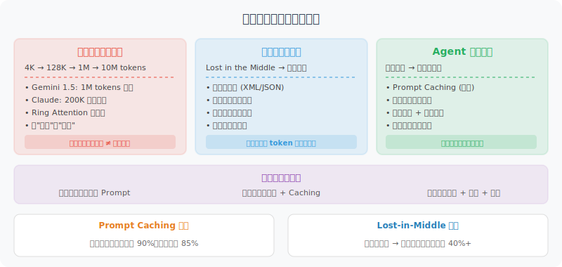

# 上下文工程前沿进展

> 🔬 *"上下文窗口的扩大不是终点，如何高效利用每一个 token 的'注意力带宽'才是真正的挑战。"*

前几节我们学习了上下文工程的理论基础——从上下文 vs 提示工程的区分、注意力预算管理、到长时程任务策略和 GSSC 实践。这些是"基本功"。而本节要讨论的是这个领域正在发生的**最新技术突破**，它们正在改变 Agent 开发者管理上下文的方式。



## 百万级上下文窗口：从噱头到实用

### 上下文窗口的军备竞赛

2024—2026 年，上下文窗口经历了指数级增长：

| 时期 | 代表模型 | 上下文窗口 | 等价文本量 |
|------|---------|-----------|-----------|
| 2023 年初 | GPT-3.5 | 4K tokens | ~3,000 字 |
| 2023 年中 | Claude 2 | 100K tokens | ~75,000 字 |
| 2024 年 | GPT-4 Turbo | 128K tokens | ~96,000 字 |
| 2025 年 | Gemini 2.5 Pro | 1M tokens | ~750,000 字（约 10 本书） |
| 2025 年 | Llama 4 Scout | 10M tokens | ~7,500,000 字（约 100 本书） |

但窗口变大 ≠ 问题解决。我们在 8.2 节讨论过的 **Lost-in-the-Middle** 问题并没有消失——事实上，当窗口从 128K 膨胀到 1M 时，这个问题反而更严重了。

### 实测：大窗口的真实能力

```python
# 一个实际测试：在 100 万 token 上下文中检索特定信息
import time

def needle_in_haystack_test(model, context_size, needle_position):
    """
    经典的"大海捞针"测试
    在大量干扰文本中的特定位置插入一条关键信息，
    然后让模型回答与该信息相关的问题
    """
    haystack = generate_padding_text(context_size)
    needle = "The secret number for project Moonlight is 42-ALPHA-7."
    
    # 在指定位置插入关键信息
    position = int(len(haystack) * needle_position)
    context = haystack[:position] + needle + haystack[position:]
    
    response = model.query(
        context=context,
        question="What is the secret number for project Moonlight?"
    )
    return response

# 2025 年各模型的实测结果（检索准确率）
results = {
    "Gemini 2.5 Pro (1M)": {
        "开头 10%": "✅ 99%",
        "中间 50%": "✅ 95%",  # 大幅改善了 Lost-in-the-Middle
        "末尾 90%": "✅ 98%",
        "满载 100%": "⚠️ 87%",  # 接近满载时仍有性能下降
    },
    "Claude 4 (200K)": {
        "开头 10%": "✅ 99%",
        "中间 50%": "✅ 97%",  # 在 200K 范围内表现最均匀
        "末尾 90%": "✅ 99%",
        "满载 100%": "✅ 95%",  # 上限更低但质量更稳定
    },
    "GPT-4o (128K)": {
        "开头 10%": "✅ 98%",
        "中间 50%": "⚠️ 89%",
        "末尾 90%": "✅ 96%",
        "满载 100%": "⚠️ 84%",
    },
}
```

> 💡 **实战建议**：不要盲目追求最大窗口。128K 够用就不要填满 1M。**上下文质量远比上下文数量重要**——这是上下文工程的第一原则。

## Context Caching：上下文复用的经济学

### 问题：重复支付"上下文税"

传统模式下，每次 API 调用都要重新发送完整的 System Prompt + 工具定义 + 历史对话。如果你的 Agent 有一个 8K token 的系统提示词，每轮对话都要为这 8K token 付费。

```python
# 传统模式：每次都要完整发送
for user_message in conversation:
    response = client.chat.completions.create(
        model="gpt-4o",
        messages=[
            {"role": "system", "content": system_prompt},  # 8K tokens，每次都重复
            *conversation_history,                          # 不断增长
            {"role": "user", "content": user_message},
        ],
        tools=tool_definitions,  # 2K tokens，每次都重复
    )
    # 如果对话 100 轮，system_prompt 就被"计费"了 100 次
```

### 解决方案：Prompt Caching

2024—2025 年，各大厂商陆续推出了 **Prompt Caching**（上下文缓存）功能：

```python
# Anthropic Prompt Caching 示例
from anthropic import Anthropic

client = Anthropic()

# 第一次调用：缓存 system prompt（缓存写入有 25% 额外费用）
response = client.messages.create(
    model="claude-4-sonnet-20260301",
    max_tokens=1024,
    system=[
        {
            "type": "text",
            "text": long_system_prompt,      # 大段系统提示词
            "cache_control": {"type": "ephemeral"}  # 标记为可缓存
        }
    ],
    messages=[{"role": "user", "content": "你好"}]
)

# 后续调用：命中缓存，输入价格降低 90%！
# 同一个 cache_control 块内容不变 → 自动命中缓存
response = client.messages.create(
    model="claude-4-sonnet-20260301",
    max_tokens=1024,
    system=[
        {
            "type": "text",
            "text": long_system_prompt,      # 内容未变 → 命中缓存
            "cache_control": {"type": "ephemeral"}
        }
    ],
    messages=[{"role": "user", "content": "帮我分析这段代码"}]
)
```

```python
# Google Gemini Context Caching 示例
import google.generativeai as genai

# 创建一个可复用的缓存（有效期可设置）
cache = genai.caching.CachedContent.create(
    model="gemini-2.5-pro",
    display_name="agent-system-context",
    system_instruction="You are an expert coding assistant...",
    contents=[
        # 可以缓存大量参考文档
        genai.upload_file("codebase_summary.txt"),
        genai.upload_file("api_documentation.pdf"),
    ],
    ttl=datetime.timedelta(hours=1),  # 缓存 1 小时
)

# 后续调用直接引用缓存
model = genai.GenerativeModel.from_cached_content(cache)
response = model.generate_content("这个 API 的限流策略是什么？")
# 缓存部分的 token 费用大幅降低
```

### 缓存的经济账

| 提供商 | 缓存写入成本 | 缓存命中成本 | 节省比例 | 缓存有效期 |
|--------|------------|------------|---------|-----------|
| Anthropic | 正常价格 ×1.25 | 正常价格 ×0.1 | 命中后省 **90%** | 5 分钟（ephemeral） |
| Google | 正常价格 ×1.0 | 正常价格 ×0.25 | 命中后省 **75%** | 可自定义（1min~1h） |
| OpenAI | 正常价格 ×1.0 | 正常价格 ×0.5 | 命中后省 **50%** | 自动管理 |

> 💡 **对 Agent 的影响**：对于长系统提示词 + 多轮对话的 Agent，Prompt Caching 可以将总成本降低 **40%~70%**。这是一个纯赚不亏的优化。

## KV-Cache 优化：模型层面的上下文提速

### 什么是 KV-Cache？

在 Transformer 推理过程中，每一层的 Key 和 Value 张量一旦计算出来，就可以被缓存复用——这就是 **KV-Cache**。它避免了对已处理 token 的重复计算，是实现高效自回归生成的核心技术。

```python
# KV-Cache 的直觉理解
class TransformerWithKVCache:
    """
    没有 KV-Cache：生成第 N 个 token 时，要重新计算前 N-1 个 token 的注意力
    有 KV-Cache：前 N-1 个 token 的 K、V 已经缓存，只需计算新 token 的注意力

    时间复杂度：O(N²) → O(N)
    """
    def generate_next_token(self, input_ids, past_kv_cache=None):
        if past_kv_cache is not None:
            # 只需处理最新的 token
            new_token_kv = self.attention(input_ids[-1:], past_kv_cache)
            updated_cache = concat(past_kv_cache, new_token_kv)
        else:
            # 首次调用，处理所有 token
            updated_cache = self.attention(input_ids)
        return next_token, updated_cache
```

### 前沿的 KV-Cache 优化技术

随着上下文窗口扩大到百万级，KV-Cache 的显存占用成为关键瓶颈。2024—2025 年涌现了多种优化方案：

**1. GQA（Grouped-Query Attention）**

```python
# 标准 MHA：每个头都有独立的 K、V
# GQA：多个 Query 头共享一组 K、V
# 效果：KV-Cache 大小减少 4~8 倍

# 已被主流模型采用
models_using_gqa = {
    "Llama 3/4": "8 KV heads (vs 64 Query heads)",
    "Mistral": "8 KV heads",
    "Gemma": "Multi-Query variant",
    "DeepSeek-V3": "Multi-head Latent Attention (MLA)",
}
```

**2. MLA（Multi-head Latent Attention）——DeepSeek 的创新**

```python
# DeepSeek-V3/R2 独创的 MLA
# 核心思想：将 KV 压缩到一个低维潜在空间
# 效果：KV-Cache 大小仅为标准 MHA 的 ~5%

class MultiHeadLatentAttention:
    """
    标准 MHA: cache_size = num_layers × num_heads × seq_len × head_dim × 2
    MLA:       cache_size = num_layers × seq_len × latent_dim × 2
    
    当 latent_dim << num_heads × head_dim 时，缓存大小大幅缩减
    """
    def compress_kv(self, keys, values):
        # 将高维 KV 投影到低维潜在空间
        latent = self.down_proj(concat(keys, values))
        return latent  # 只缓存这个压缩后的表示
    
    def restore_kv(self, latent):
        # 推理时从潜在空间恢复 KV
        keys, values = self.up_proj(latent).split(2)
        return keys, values
```

**3. 量化与稀疏化**

| 技术 | 原理 | 压缩比 | 质量损失 |
|------|------|--------|---------|
| KV-Cache 量化 (INT8/FP8) | 降低数值精度 | 2~4x | 极低 |
| H2O (Heavy-Hitter Oracle) | 只保留"重要" token 的 KV | 5~20x | 低（任务依赖） |
| StreamingLLM | 保留"注意力汇聚"token + 滑动窗口 | 动态 | 中等 |
| SnapKV | 自适应选择关键 token | 3~6x | 低 |

> 💡 **对 Agent 的影响**：这些底层优化让模型厂商能以更低成本提供更长上下文。作为 Agent 开发者，你不需要自己实现这些技术，但理解它们有助于做出更好的模型选型和架构决策。

## 生产级上下文管理模式

### 模式一：分层上下文架构

在生产级 Agent 中，上下文不是一个扁平的 messages 列表，而是**分层组织**的：

```python
class TieredContextManager:
    """
    分层上下文架构
    L0: 系统核心（始终保留）     ~2K tokens
    L1: 任务上下文（当前任务相关）  ~4K tokens  
    L2: 工作记忆（近期交互）      ~8K tokens
    L3: 参考资料（按需检索）      ~动态
    """
    
    def __init__(self, max_tokens=128000):
        self.max_tokens = max_tokens
        self.layers = {
            "L0_system": {
                "budget": 2000,
                "priority": "NEVER_DROP",
                "content": None  # 系统提示词、角色定义
            },
            "L1_task": {
                "budget": 4000,
                "priority": "HIGH",
                "content": None  # 当前任务目标、约束条件
            },
            "L2_working": {
                "budget": 8000,
                "priority": "MEDIUM",
                "content": None  # 最近的对话和中间结果
            },
            "L3_reference": {
                "budget": None,  # 动态分配剩余空间
                "priority": "LOW",
                "content": None  # RAG 检索结果、文档片段
            },
        }
    
    def build_context(self, task, history, retrieved_docs):
        """构建优先级排列的上下文"""
        context = []
        used_tokens = 0
        
        # L0: 系统核心（始终包含）
        context.append({"role": "system", "content": self.system_prompt})
        used_tokens += count_tokens(self.system_prompt)
        
        # L1: 当前任务（始终包含）
        task_context = self.format_task(task)
        context.append({"role": "system", "content": task_context})
        used_tokens += count_tokens(task_context)
        
        # L2: 工作记忆（保留最近 N 轮，必要时压缩）
        remaining = self.max_tokens - used_tokens - 4000  # 留 4K 给输出
        working_memory = self.compress_history(history, budget=min(8000, remaining // 2))
        context.extend(working_memory)
        used_tokens += count_tokens(working_memory)
        
        # L3: 参考资料（填充剩余空间）
        remaining = self.max_tokens - used_tokens - 4000
        if remaining > 500 and retrieved_docs:
            selected = self.select_references(retrieved_docs, budget=remaining)
            context.append({"role": "system", "content": f"参考资料：\n{selected}"})
        
        return context
```

### 模式二：上下文压缩（Compaction）

这是 Anthropic 在 Claude Code 中使用的实战模式——当上下文接近上限时，自动调用模型总结历史，然后用总结替代原始对话：

```python
class ContextCompactor:
    """
    上下文压缩器
    当 token 使用率超过阈值时，自动触发压缩
    """
    
    def __init__(self, model, threshold_ratio=0.8):
        self.model = model
        self.threshold_ratio = threshold_ratio
    
    def maybe_compact(self, messages, max_tokens):
        """检查是否需要压缩"""
        current_usage = count_tokens(messages)
        if current_usage < max_tokens * self.threshold_ratio:
            return messages  # 还没到阈值，不需要压缩
        
        # 触发压缩
        return self.compact(messages)
    
    def compact(self, messages):
        """执行压缩"""
        # 分离：保护区（不压缩） vs 压缩区
        system_msgs = [m for m in messages if m["role"] == "system"]
        recent_msgs = messages[-4:]  # 最近 2 轮对话保留原文
        old_msgs = messages[len(system_msgs):-4]  # 中间的历史要压缩
        
        if not old_msgs:
            return messages
        
        # 让模型生成结构化摘要
        summary = self.model.chat([
            {"role": "system", "content": """
请将以下对话历史压缩为结构化摘要。保留：
1. 用户的核心目标和需求
2. 已完成的关键操作和结果
3. 重要的决策和原因
4. 当前的工作状态和待办事项
丢弃：具体的代码细节、重复的尝试过程、寒暄内容。
"""},
            {"role": "user", "content": format_messages(old_msgs)}
        ])
        
        # 用摘要替代原始历史
        compacted = system_msgs + [
            {"role": "system", "content": f"[对话历史摘要]\n{summary}"}
        ] + recent_msgs
        
        return compacted
```

### 模式三：动态工具上下文

Agent 往往注册了大量工具，但每次任务只用到其中少数。**动态工具加载**根据当前任务智能选择需要暴露给模型的工具定义：

```python
class DynamicToolContext:
    """
    动态工具上下文管理
    不是把所有 50 个工具定义都塞进上下文，
    而是根据当前任务只暴露最相关的 5-10 个
    """
    
    def __init__(self, all_tools, embedding_model):
        self.all_tools = all_tools
        self.embedding_model = embedding_model
        # 预计算所有工具描述的嵌入向量
        self.tool_embeddings = {
            tool.name: embedding_model.embed(tool.description)
            for tool in all_tools
        }
    
    def select_tools(self, user_message, task_context, top_k=8):
        """根据当前上下文选择最相关的工具"""
        query = f"{task_context}\n{user_message}"
        query_embedding = self.embedding_model.embed(query)
        
        # 语义相似度排序
        scores = {
            name: cosine_similarity(query_embedding, emb)
            for name, emb in self.tool_embeddings.items()
        }
        
        # 总是包含核心工具
        core_tools = [t for t in self.all_tools if t.is_core]
        
        # 补充语义最相关的工具
        sorted_tools = sorted(scores.items(), key=lambda x: -x[1])
        selected_names = {t.name for t in core_tools}
        
        for name, score in sorted_tools:
            if len(selected_names) >= top_k:
                break
            if score > 0.3 and name not in selected_names:
                selected_names.add(name)
        
        return [t for t in self.all_tools if t.name in selected_names]
```

## 前沿研究方向

### 1. Retrieval-Augmented Context（检索增强上下文）

将 RAG（第7章）和上下文工程结合，**不是把所有信息塞进上下文，而是建立"按需检索"的机制**：

```python
# 传统方式：把所有可能相关的文档都放进上下文
messages = [
    {"role": "system", "content": system_prompt},
    {"role": "system", "content": f"参考文档：\n{all_documents}"},  # 可能 50K tokens
    {"role": "user", "content": user_query},
]

# 检索增强方式：只在需要时检索
messages = [
    {"role": "system", "content": system_prompt},
    {"role": "system", "content": "你有一个 search_knowledge 工具，需要信息时主动检索"},
    {"role": "user", "content": user_query},
]
# 模型会主动调用 search_knowledge → 只检索真正需要的 2K tokens
```

### 2. Structured Context Protocol

越来越多的研究在探索用结构化格式（XML、JSON Schema）来组织上下文，让模型更好地"理解"上下文的结构：

```xml
<!-- 结构化上下文示例 -->
<context>
  <system priority="critical">
    <role>你是一个代码审查助手</role>
    <constraints>
      <constraint>只审查安全和性能问题</constraint>
      <constraint>输出格式必须是标准化的审查报告</constraint>
    </constraints>
  </system>
  
  <task priority="high">
    <objective>审查 PR #1234 的代码变更</objective>
    <files changed="3" additions="45" deletions="12" />
  </task>
  
  <reference priority="medium">
    <code_diff>...</code_diff>
    <project_conventions>...</project_conventions>
  </reference>
  
  <history priority="low" compacted="true">
    <summary>用户之前要求关注 SQL 注入风险...</summary>
  </history>
</context>
```

### 3. 多 Agent 上下文共享

在多 Agent 系统（第14章）中，上下文的跨 Agent 传递和共享是一个新兴话题：

```python
class SharedContextStore:
    """
    多 Agent 共享上下文存储
    - 每个 Agent 有私有上下文
    - 通过 Blackboard 共享公共信息
    - 避免每个 Agent 都携带完整上下文
    """
    
    def __init__(self):
        self.blackboard = {}      # 公共黑板：所有 Agent 可见
        self.private = {}         # 私有上下文：仅当前 Agent 可见
    
    def publish(self, agent_id, key, value, visibility="public"):
        """Agent 发布信息到共享上下文"""
        if visibility == "public":
            self.blackboard[key] = {
                "value": value,
                "author": agent_id,
                "timestamp": time.time()
            }
        else:
            self.private.setdefault(agent_id, {})[key] = value
    
    def get_context_for(self, agent_id, task):
        """为特定 Agent 构建上下文"""
        # 公共信息 + 该 Agent 的私有信息 + 任务相关信息
        relevant_public = self.select_relevant(self.blackboard, task)
        private = self.private.get(agent_id, {})
        return {**relevant_public, **private}
```

---

## 本节小结

| 进展方向 | 核心突破 | 对 Agent 开发的实际影响 |
|---------|---------|----------------------|
| 百万级上下文窗口 | 物理上限大幅提升 | 可以处理整本书/整个代码库，但质量管理更重要 |
| Prompt Caching | 重复上下文的缓存复用 | 多轮对话 Agent 成本降低 40%~70% |
| KV-Cache 优化 | MLA/GQA/量化等底层技术 | 更长上下文 + 更低延迟成为可能 |
| 分层上下文架构 | 优先级分层管理 | 生产级 Agent 的标配模式 |
| 上下文压缩 | 自动摘要替代原始历史 | 长时程任务不再受窗口限制 |
| 动态工具上下文 | 按需加载工具定义 | 工具多的 Agent 可节省大量上下文空间 |

> ⏰ *注：上下文管理技术发展迅速，本节数据截至 2026 年 3 月。建议关注各模型厂商的技术博客和 API 更新日志获取最新信息。*

---

*下一章：[第9章 Skill System](../chapter_skill/README.md)*
