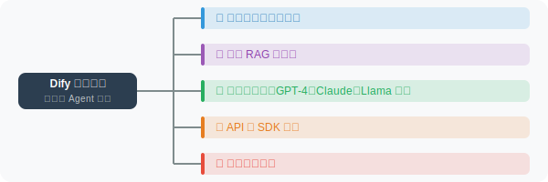
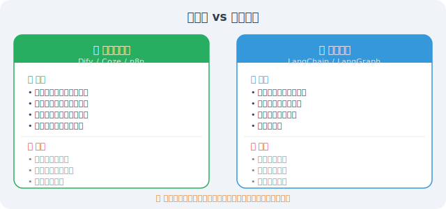

# Dify / Coze 等低代码 Agent 平台

低代码平台让非程序员也能构建 Agent 应用，降低了 AI 应用的开发门槛。2024-2025 年，这一领域涌现了大量平台，竞争日趋激烈。

## 主流低代码平台

### Dify

Dify 是目前最流行的开源 LLM 应用开发平台，截至 2026 年初已在 GitHub 获得 90K+ Star：



Dify 通过 API 接入现有应用：

```python
import requests

# Dify 应用 API 调用示例
def call_dify_app(app_token: str, user_message: str) -> str:
    """调用 Dify 应用"""
    url = "https://api.dify.ai/v1/chat-messages"
    
    response = requests.post(
        url,
        headers={
            "Authorization": f"Bearer {app_token}",
            "Content-Type": "application/json"
        },
        json={
            "inputs": {},
            "query": user_message,
            "response_mode": "blocking",
            "user": "user_001"
        }
    )
    
    result = response.json()
    return result.get("answer", "")

# 使用示例
answer = call_dify_app("your-app-token", "如何申请报销？")
print(answer)
```

### Coze（扣子）

字节跳动推出的 Agent 构建平台，是国内低代码 Agent 平台中功能最丰富的之一：

```
Coze 主要特性：
├── 图形化 Agent 构建
├── 丰富的内置插件（天气、搜索、代码、数据库等）
├── 支持发布到微信、飞书、抖音、Discord 等平台
├── Bot 市场（可分享和复用）
├── 工作流编排（可视化拖拽）
└── 知识库管理（支持 RAG）

优势：
- 不需要写代码
- 与字节系产品生态深度集成
- 免费额度慷慨
- 工作流功能强大（支持条件分支、循环）
```

### n8n：工作流自动化平台

```python
# n8n 通过 Webhook 与外部系统集成
# 在 n8n 中可以构建：
# 接收消息 → 调用 LLM → 处理结果 → 发送通知

# n8n 的 AI Agent 节点可以调用 OpenAI / Anthropic / 本地模型
# 通过简单的拖拽配置实现复杂工作流

# 典型工作流示例：
workflow = """
触发器：每天早上9点
  ↓
读取 Google Sheets 中的任务列表
  ↓
调用 GPT-4o 分析优先级
  ↓
发送日报到 Slack 频道
"""
```

### 其他值得关注的平台

| 平台 | 特点 | 适合场景 |
|------|------|---------|
| **FastGPT** | 开源，知识库 RAG 优秀 | 企业知识库问答 |
| **Langflow** | LangChain 可视化编排 | 开发者快速原型 |
| **Flowise** | 低代码 LangChain 编排 | 简单 Agent 搭建 |
| **百度 AppBuilder** | 百度生态，文心模型 | 国内企业应用 |
| **阿里百炼** | 阿里云生态，通义模型 | 国内企业应用 |

## 低代码 vs 代码开发



### 如何选择？

```python
decision_guide = {
    "选低代码平台": [
        "快速验证 MVP（1-3 天内出原型）",
        "非技术团队主导的项目",
        "标准化的客服/问答/文档处理场景",
        "对定制化要求不高的内部工具",
    ],
    "选代码开发": [
        "需要深度定制 Agent 行为逻辑",
        "对延迟/成本/安全有严格要求",
        "需要与已有系统深度集成",
        "多 Agent 协作等复杂架构",
    ],
    "混合方案": [
        "用 Dify 快速搭建原型，验证产品方向",
        "验证可行后用 LangChain/LangGraph 重写核心逻辑",
        "保留 Dify 作为非核心模块的编排工具",
    ],
}
```

---

## 小结

低代码平台降低了 Agent 开发门槛，但代码开发提供了更大的灵活性。最佳实践是：用低代码快速验证想法，用代码做精细实现和生产部署。随着 Dify、Coze 等平台的持续迭代，低代码平台的能力边界正在不断扩大。

---

*下一节：[10.5 如何选择合适的框架？](./05_how_to_choose.md)*
