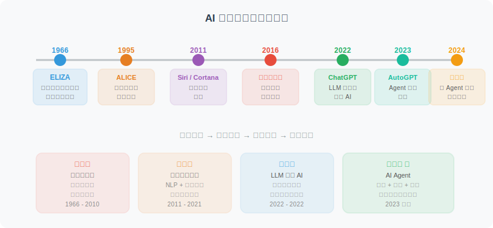
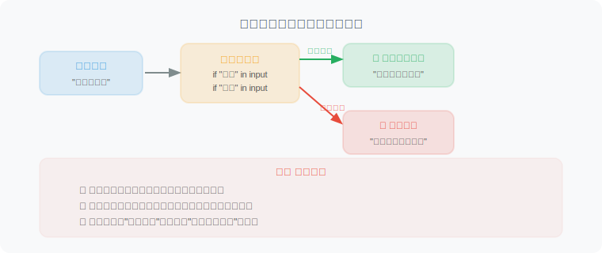
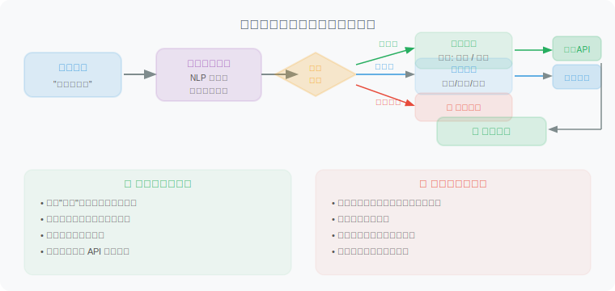
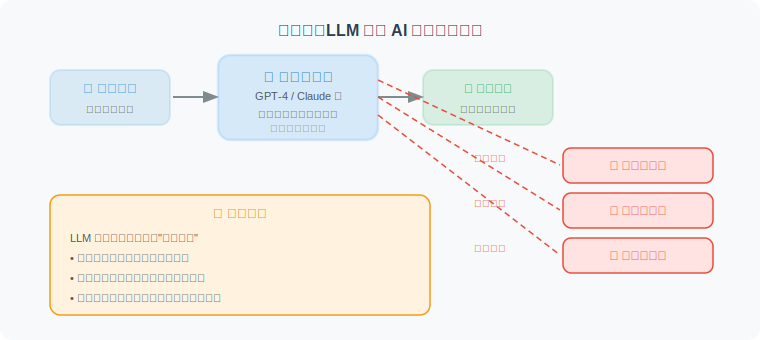
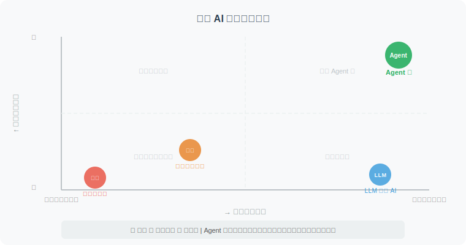
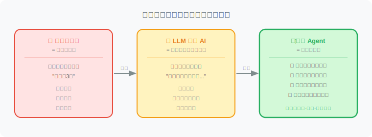

# 从聊天机器人到智能体的演进

> 📖 *"要理解 Agent 是什么，最好的方式是看看它是从哪里来的。AI 与人类的交互史，本质上是一部从「被动响应」到「主动思考」、从「无状态的模式匹配」到「具备记忆与规划能力的具身实践」的进化史。"*

## 一段简短的历史

AI 与人类的交互方式经历了一段漫长而精彩的演进旅程。让我们坐上时光机，快速回顾这段历史：



## 第一代：基于规则的聊天机器人

最早的聊天机器人完全依赖**预设规则**。1966 年 MIT 的 ELIZA 就是一个经典例子——它通过简单的模式匹配来"伪装"成一个心理咨询师。

```python
# 第一代：基于规则的聊天机器人（模拟 ELIZA 的思路）
# 核心原理：模式匹配 + 模板回复

def rule_based_chatbot(user_input: str) -> str:
    """
    最原始的聊天机器人：基于关键词匹配规则
    - 没有理解能力
    - 只能处理预设的场景
    - 遇到未知输入就"抓瞎"
    """
    user_input = user_input.lower()  # 统一转小写
    
    # 规则1：问候语
    if any(word in user_input for word in ["你好", "hi", "hello"]):
        return "你好！有什么我可以帮你的吗？"
    
    # 规则2：关于天气
    if "天气" in user_input:
        return "今天天气不错，适合出门哦！"
    
    # 规则3：关于时间
    if "时间" in user_input or "几点" in user_input:
        return "现在是工作时间，请问有什么需要？"
    
    # 兜底回复（遇到不认识的输入）
    return "抱歉，我不太理解你的意思。能换个方式说吗？"

# 测试
print(rule_based_chatbot("你好"))        # ✅ 能处理
print(rule_based_chatbot("今天天气怎样")) # ✅ 能处理
print(rule_based_chatbot("帮我订机票"))   # ❌ 无法处理 → 兜底回复
```

**这种方式的问题显而易见：**



| 问题 | 说明 |
|------|------|
| 🔴 理解能力为零 | 只是匹配关键词，不理解语义 |
| 🔴 规则爆炸 | 场景越多，规则越多，维护成本指数增长 |
| 🔴 无法泛化 | "天气好吗"能回答，"出门要带伞吗"就不行 |
| 🔴 无状态 | 不记得之前说过什么，每轮对话都是独立的 |

> 💡 **架构深潜：无状态的马尔可夫系统 (Stateless Markov System)**
> 从底层架构来看，第一代系统本质上是一个巨大的离散映射表。它的致命弱点不仅在于“规则爆炸”（Rule Explosion），更在于它是**无状态（Stateless）**的。当前的输出仅仅依赖于当前的输入，没有任何上下文记忆机制。这种基于正则表达式的硬编码逻辑，注定了它只能停留在“玩具”阶段。

## 第二代：基于意图识别的对话系统

2010 年代左右，传统 NLP 技术（如 SVM、CRF，以及后来的早期深度学习模型）的发展催生了一批更智能的对话系统（如早期的 Siri、智能客服）。它们的核心思路是：**先识别用户的意图，再做出相应的处理**。

```python
# 第二代：基于意图识别的对话系统（简化演示）
# 核心原理：意图分类 + 槽位填充 + 对话管理

from dataclasses import dataclass
from typing import Optional

@dataclass
class Intent:
    """用户意图"""
    name: str           # 意图名称，如 "查天气"、"订机票"
    confidence: float   # 置信度 0~1
    slots: dict         # 槽位信息，如 {"城市": "北京", "日期": "明天"}

def classify_intent(user_input: str) -> Intent:
    """
    意图识别（这里用规则模拟，实际中使用 NLP 模型）
    进步：能识别用户"想做什么"
    不足：意图是预定义的，无法处理开放域问题
    """
    if "天气" in user_input:
        # 尝试从输入中提取城市信息（槽位填充）
        city = "北京"  # 实际中会用 NER 模型提取
        return Intent(name="查天气", confidence=0.95, slots={"城市": city})
    elif "机票" in user_input or "航班" in user_input:
        return Intent(name="订机票", confidence=0.88, slots={})
    else:
        return Intent(name="闲聊", confidence=0.5, slots={})

def handle_intent(intent: Intent) -> str:
    """
    根据识别到的意图，执行对应的处理逻辑
    """
    handlers = {
        "查天气": lambda: f"正在查询{intent.slots.get('城市', '你所在城市')}的天气...",
        "订机票": lambda: "请告诉我出发城市、到达城市和日期。",
        "闲聊": lambda: "哈哈，你说得很有趣！",
    }
    handler = handlers.get(intent.name, lambda: "抱歉，我暂时无法处理这个请求。")
    return handler()

# 使用流程
user_input = "帮我查一下北京明天的天气"
intent = classify_intent(user_input)
print(f"识别意图: {intent.name} (置信度: {intent.confidence})")
print(f"回复: {handle_intent(intent)}")
```

**第二代系统的处理流程：**



**比第一代好在哪？**
- ✅ 有了"理解"的雏形（意图识别 Intent Classification）
- ✅ 能提取关键信息（槽位填充 Slot Filling）
- ✅ 更结构化的对话管理，引入了短期的对话状态追踪（DST）

**但依然存在的问题：**
- 🔴 意图是预定义且封闭的，无法处理"意料之外"的长尾请求
- 🔴 多轮对话能力有限
- 🔴 不能执行复杂的、需要多步骤的任务

> 💡 **架构深潜：流水线架构 (Pipeline Architecture)**
> 这一代系统在学术界被称为**任务导向型对话系统 (Task-Oriented Dialog Systems)**。它确立了经典的流水线架构：**NLU (自然语言理解) -> DST (对话状态追踪) -> DPL (对话策略学习) -> NLG (自然语言生成)**。引入 DST 意味着系统终于有了“短期记忆”，能记住前几轮抽取的槽位。但流水线架构的致命伤是**误差级联 (Error Cascading)**——如果 NLU 意图识别错了，后续的所有步骤都会全盘崩溃。

## 第三代：LLM 驱动的对话 AI

2022 年底，ChatGPT 横空出世，带来了划时代的变革。大语言模型（LLM）不再需要预定义意图，它能理解**任何**自然语言输入。

```python
# 第三代：LLM 驱动的对话 AI（以 OpenAI API 为例）
# 核心原理：大语言模型生成式回答

from openai import OpenAI

client = OpenAI()  # 需要配置 OPENAI_API_KEY

def llm_chatbot(user_input: str) -> str:
    """
    基于大语言模型的聊天机器人
    巨大进步：
    - 理解任何自然语言输入
    - 能进行推理和分析
    - 具有广泛的知识储备
    
    但仍然只是"嘴强"：
    - 只能生成文本回复
    - 无法执行实际操作（不能真的查天气、订机票）
    - 知识有截止日期
    """
    response = client.chat.completions.create(
        model="gpt-4o",
        messages=[
            {"role": "system", "content": "你是一个有用的助手。"},
            {"role": "user", "content": user_input}
        ]
    )
    return response.choices[0].message.content

# LLM 可以理解各种表达方式
print(llm_chatbot("北京明天出门需要带伞吗？"))
# → "关于北京明天是否需要带伞，我建议你查看最新的天气预报..."
# 注意：它能理解问题，但无法真的去查天气！
```

**LLM 对话 AI 的特点：**



> 💡 **架构深潜：端到端与涌现能力 (End-to-End & Emergence)**
> LLM 彻底暴力摧毁了上一代的 Pipeline 架构。它将意图识别、状态追踪、文本生成全部统一到了**自回归的 Next-Token Prediction** 任务中：$P(w_i | w_1, ..., w_{i-1})$。
> 借助 Transformer 强大的特征提取能力和 In-context Learning（上下文学习），模型涌现出了强大的泛化和推理能力。但它的阿喀琉斯之踵在于：**它被困在了文本的赛博空间里。** 它知识渊博却容易产生幻觉，能听懂指令却无法对外部物理或数字世界产生实质性的干预。

## 第四代：Agent —— 能说更能做

终于，我们来到了 **Agent（智能体）** 时代。Agent 在 LLM 强大的理解和推理能力基础上，增加了**行动能力**。它不仅能理解你的需求，还能真正去执行：

```python
# 第四代：Agent —— 不仅能理解，还能行动！
# 核心原理：LLM（大脑）+ 工具（手脚）+ 规划（策略）

import json
from openai import OpenAI

client = OpenAI()

# ========== 定义 Agent 可以使用的工具 ==========

def search_weather(city: str) -> str:
    """真正去查询天气的工具"""
    # 实际中会调用天气 API
    return json.dumps({
        "city": city,
        "temperature": "18°C",
        "condition": "多云转晴",
        "suggestion": "不需要带伞"
    }, ensure_ascii=False)

def book_flight(from_city: str, to_city: str, date: str) -> str:
    """真正去订机票的工具"""
    # 实际中会调用航空公司 API
    return json.dumps({
        "status": "已找到航班",
        "flight": "CA1234",
        "price": "¥1,280",
        "departure": f"{date} 08:00"
    }, ensure_ascii=False)

# ========== 工具描述（告诉 LLM 有哪些工具可用）==========

tools = [
    {
        "type": "function",
        "function": {
            "name": "search_weather",
            "description": "查询指定城市的天气信息",
            "parameters": {
                "type": "object",
                "properties": {
                    "city": {"type": "string", "description": "城市名称"}
                },
                "required": ["city"]
            }
        }
    },
    # ... 省略 book_flight 的描述 ...
]

# ========== Agent 的核心逻辑 ==========

def agent(user_input: str) -> str:
    """
    一个简单的 Agent：
    1. 理解用户需求（LLM）
    2. 决定使用什么工具（推理）
    3. 调用工具执行操作（行动）
    4. 基于工具返回结果生成回复（总结）
    """
    print(f"🧑 用户: {user_input}")
    
    # 第一步：让 LLM 理解用户需求并决定是否需要调用工具
    response = client.chat.completions.create(
        model="gpt-4o",
        messages=[
            {"role": "system", "content": "你是一个能干的 AI 助手，可以查天气和订机票。"},
            {"role": "user", "content": user_input}
        ],
        tools=tools
    )
    
    message = response.choices[0].message
    
    # 第二步：如果 LLM 决定调用工具
    if message.tool_calls:
        tool_call = message.tool_calls[0]
        func_name = tool_call.function.name
        func_args = json.loads(tool_call.function.arguments)
        
        print(f"🤖 思考: 我需要调用 {func_name} 工具")
        print(f"🔧 工具参数: {func_args}")
        
        # 第三步：执行工具
        available_tools = {
            "search_weather": search_weather,
            "book_flight": book_flight
        }
        tool_result = available_tools[func_name](**func_args)
        
        print(f"📊 工具返回: {tool_result}")
        
        # 第四步：将工具结果交给 LLM，生成最终回复
        final_response = client.chat.completions.create(
            model="gpt-4o",
            messages=[
                {"role": "system", "content": "你是一个能干的 AI 助手。"},
                {"role": "user", "content": user_input},
                message,
                {"role": "tool", "content": tool_result, "tool_call_id": tool_call.id}
            ]
        )
        result = final_response.choices[0].message.content
    else:
        # LLM 认为不需要工具，直接回答
        result = message.content
    
    print(f"🤖 回复: {result}")
    return result

# 使用 Agent
agent("北京明天需要带伞吗？")
# 🧑 用户: 北京明天需要带伞吗？
# 🤖 思考: 我需要调用 search_weather 工具
# 🔧 工具参数: {"city": "北京"}
# 📊 工具返回: {"city": "北京", "temperature": "18°C", "condition": "多云转晴", ...}
# 🤖 回复: 根据查询结果，北京明天天气多云转晴，温度18°C，不需要带伞。可以放心出门！
```

> 💡 **架构深潜：规划与行动的闭环 (Reasoning & Acting)**
> 上面的代码演示了最基础的 Tool Calling。而在学术界，Agent 范式的奠基之作是 **ReAct 框架**。ReAct 要求大模型在执行动作前，必须显式地输出“思考过程”（Thought -> Action -> Observation 的循环）。这种将内隐的推理逻辑外显化的设计，使得 Agent 具备了复杂任务拆解、多步规划（Planning）以及根据环境反馈进行自我纠错（Self-Reflection）的能力。Agent 不再是一个单一的文本生成函数，而是一个**自治的计算系统**。

## 四代演进对比总结

下面这张表结合了工程实践与底层架构，清晰地展示了四代 AI 交互方式的核心区别：



| 能力维度 | 规则机器人 (Gen 1) | 意图识别 (Gen 2) | LLM 对话 AI (Gen 3) | Agent (Gen 4) |
|------|:--------:|:-------:|:-----------:|:-----:|
| **语言理解** | ❌ 字符匹配 | 🟡 封闭域实体抽取 | ✅ 开放域语义理解 | ✅ 开放域语义理解 |
| **状态与记忆** | ❌ 无状态 (Markovian) | 🟡 显式槽位追踪 | 🟡 上下文窗口限制 | ✅ 工作记忆 + 长期向量记忆库 |
| **路由决策方式**| ❌ IF-ELSE 规则树 | 🟡 监督分类 / POMDP | ❌ 仅生成文本 | ✅ 动态规划与自我反思 |
| **环境交互** | ❌ 隔离 | 🟡 固定 API 绑定 | ❌ 隔离 | ✅ 动态工具调用与具身执行 |
| **任务上限** | 简单问候 | 定制化标准流程 | 知识问答与文本创作 | **开放域复杂多步任务** |

> 图例：✅ 支持  🟡 部分支持  ❌ 不支持

## 关键洞察

> 💡 **Agent 的本质飞跃在于：从“只会说”的静态文本生成器，进化为了“能做事”的动态计算中心。**
>
> - **聊天机器人** = 嘴（只能对话）
> - **Agent** = 大脑 + 嘴 + 手脚 + 记忆（能思考、能说话、能行动、能复盘）

用一个生活类比来理解：


- **第一代**就像是医院墙上的指示牌，只有死规定。
- **第二代**就像是导诊台护士，能识别你需要看什么科，但无法治病。
- **第三代**就像是一位学识渊博但没有行医执照的医学生，能给你讲一堆医学理论，但不能开药。
- **第四代 Agent** 就是真正的主治医生，能听懂你的症状（理解），能开出检查单（调用工具），根据化验结果诊断（反思与推理），最后为你开药治疗（执行行动）。

## 本节小结

- AI 交互方式经历了 **规则 → 意图识别 → LLM → Agent** 四个阶段。
- 每一代都在前一代的基础上打破了架构的桎梏：从无状态到有状态，从流水线级联到端到端生成。
- Agent 的核心突破是：**在 LLM 的理解和涌现推理能力上，闭环了“规划-行动-反馈”机制**。

---

### 📚 延伸阅读与参考文献
1. Weizenbaum, J. (1966). *ELIZA—a computer program for the study of natural language communication between man and machine*. (第一代规则系统鼻祖)
2. Young, S., et al. (2013). *POMDP-based statistical spoken dialog systems: A review*. (第二代经典 Pipeline 与状态追踪)
3. Ouyang, L., et al. (2022). *Training language models to follow instructions with human feedback*. (第三代 LLM 端到端范式)
4. Yao, S., et al. (2022). *ReAct: Synergizing Reasoning and Acting in Language Models*. (第四代 Agent 核心奠基之作)

## 🤔 思考练习

1. 从软件工程的角度看，Pipeline 架构（第二代）和 End-to-End 架构（第三/四代）在模型迭代和错误排查时，各有什么优劣势？
2. 想一想，如果给 ChatGPT 配上"手脚"（工具），它能帮你完成哪些目前做不到的事？
3. ReAct 范式有效提升了 Agent 的执行能力，但它在调用外部 API 或操作系统级工具时，可能存在什么潜在风险？你认为该如何建立护栏（Guardrails）？

---

*在下一节中，我们将正式剖析 Agent 的内部大脑，深入了解它的核心控制流和记忆机制。*