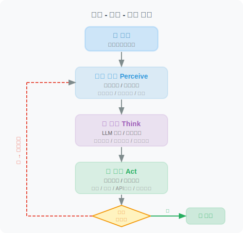
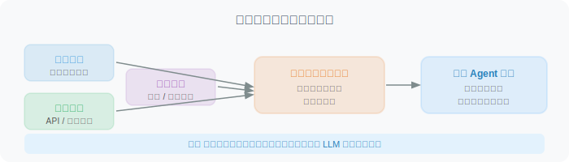
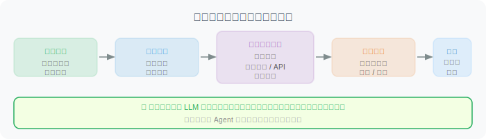
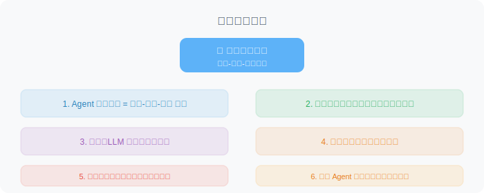

# Agent 的典型架构：感知-思考-行动循环

> 📖 *"所有 Agent 的行为，都可以归结为一个不断重复的循环：感知 → 思考 → 行动。"*

## 核心循环：Perceive → Think → Act

Agent 的运行机制可以用一个核心循环来描述。就像人类处理事务一样——观察情况、思考对策、采取行动，然后再观察结果：



让我们用一个具体的例子来感受这个循环：

```python
"""
场景：用户说 "帮我调研一下 Python 和 Rust 哪个更适合做 Web 开发"

Agent 的 感知-思考-行动 循环：
"""

# ═══ 第1轮循环 ═══
# 👁️ 感知：接收到用户请求 "对比 Python 和 Rust 的 Web 开发能力"
# 🧠 思考：这是一个对比分析任务，我需要从多个维度收集信息
#         → 先搜索 Python Web 开发的最新情况
# 🦾 行动：调用 web_search("Python Web development 2024 frameworks ecosystem")
# 📊 结果：获得 Python Web 框架（Django, FastAPI, Flask）的相关信息

# ═══ 第2轮循环 ═══
# 👁️ 感知：已获得 Python 的信息，还缺 Rust 的
# 🧠 思考：现在需要获取 Rust Web 开发的对应信息
# 🦾 行动：调用 web_search("Rust Web development 2024 frameworks ecosystem")
# 📊 结果：获得 Rust Web 框架（Actix, Axum, Rocket）的相关信息

# ═══ 第3轮循环 ═══
# 👁️ 感知：两种语言的信息都有了
# 🧠 思考：信息充分了，可以进行对比分析并生成报告
# 🦾 行动：生成包含多个维度（性能、生态、学习曲线等）的对比分析报告
# ✅ 目标达成，结束循环
```

## 用 Python 实现感知-思考-行动循环

下面是一个极简但完整的 Agent 循环实现：

```python
"""
最小可运行的 Agent 循环实现
展示了 Perceive-Think-Act 的核心逻辑
"""

from dataclasses import dataclass
from typing import Optional
from openai import OpenAI
import json

@dataclass
class AgentState:
    """Agent 在每个循环中的状态"""
    goal: str                          # 用户的目标
    observations: list[str]            # 感知到的信息
    thoughts: list[str]                # 思考过程
    actions_taken: list[str]           # 已执行的行动
    is_complete: bool = False          # 是否已完成目标

class SimpleAgent:
    """
    最简单的 Agent 实现，展示核心循环
    """
    
    def __init__(self, tools: dict):
        self.client = OpenAI()
        self.tools = tools       # 可用的工具集
        self.max_loops = 5       # 最大循环次数（防止死循环）
    
    def run(self, user_goal: str) -> str:
        """运行 Agent 的核心循环"""
        
        state = AgentState(
            goal=user_goal,
            observations=[],
            thoughts=[],
            actions_taken=[]
        )
        
        print(f"🎯 目标: {user_goal}\n")
        
        for loop_num in range(self.max_loops):
            print(f"═══ 第 {loop_num + 1} 轮循环 ═══")
            
            # ---- 步骤1：感知（Perceive）----
            perception = self._perceive(state)
            state.observations.append(perception)
            print(f"👁️ 感知: {perception}")
            
            # ---- 步骤2：思考（Think）----
            thought, action_plan = self._think(state)
            state.thoughts.append(thought)
            print(f"🧠 思考: {thought}")
            
            # 判断是否完成
            if action_plan.get("type") == "finish":
                state.is_complete = True
                print(f"✅ 目标达成！\n")
                return action_plan.get("answer", "任务完成")
            
            # ---- 步骤3：行动（Act）----
            result = self._act(action_plan)
            state.actions_taken.append(f"{action_plan} → {result}")
            print(f"🦾 行动: {action_plan.get('tool')}({action_plan.get('args')})")
            print(f"📊 结果: {result}\n")
        
        return "达到最大循环次数，任务未能完成。"
    
    def _perceive(self, state: AgentState) -> str:
        """感知阶段：收集当前可用的信息"""
        if not state.actions_taken:
            return f"收到新任务: {state.goal}"
        else:
            return f"上一步行动结果: {state.actions_taken[-1]}"
    
    def _think(self, state: AgentState) -> tuple[str, dict]:
        """思考阶段：基于当前状态进行推理和决策"""
        # 构造给 LLM 的提示
        prompt = f"""
当前任务: {state.goal}
已有信息: {state.observations}
已执行操作: {state.actions_taken}

请决定下一步行动。返回 JSON 格式:
- 如果需要使用工具: {{"type": "tool", "tool": "工具名", "args": {{...}}}}
- 如果任务已完成: {{"type": "finish", "answer": "最终回答"}}

可用工具: {list(self.tools.keys())}
"""
        response = self.client.chat.completions.create(
            model="gpt-4o",
            messages=[
                {"role": "system", "content": "你是一个善于分析和规划的 Agent。"},
                {"role": "user", "content": prompt}
            ],
            response_format={"type": "json_object"}
        )
        
        result = json.loads(response.choices[0].message.content)
        thought = f"决定{'完成任务' if result['type'] == 'finish' else f'使用工具 {result.get(\"tool\")}'}"
        return thought, result
    
    def _act(self, action_plan: dict) -> str:
        """行动阶段：执行决定的操作"""
        tool_name = action_plan.get("tool")
        tool_args = action_plan.get("args", {})
        
        if tool_name in self.tools:
            return self.tools[tool_name](**tool_args)
        else:
            return f"错误: 工具 {tool_name} 不存在"
```

## Agent 循环的内部细节

让我们更深入地看看每个阶段内部发生了什么：

### 感知阶段（Perceive）



### 思考阶段（Think）

这是 Agent 最核心的阶段，LLM 在此发挥作用：

```python
"""
思考阶段的核心工作：

1. 情境理解 — "现在是什么情况？"
2. 目标评估 — "距离目标还差什么？"
3. 方案生成 — "有哪些可行的下一步？"
4. 方案选择 — "哪个方案最好？"
5. 行动规划 — "具体怎么执行？"
"""

# 思考阶段常见的 Prompt 模板
THINK_PROMPT = """
你是一个善于分析和规划的 AI Agent。

## 当前状态
- 用户目标: {goal}
- 已收集的信息: {observations}
- 已完成的步骤: {completed_steps}

## 可用工具
{available_tools}

## 请你思考
1. 当前进展如何？还缺少什么信息？
2. 下一步应该做什么？为什么？
3. 需要使用哪个工具？参数是什么？

请按以下格式回答:
Thought: <你的思考过程>
Action: <要执行的工具名>
Action Input: <工具的参数（JSON格式）>
"""
```

### 行动阶段（Act）



## 完整示例：一个简单的研究 Agent

让我们把所有概念串起来，实现一个能做简单研究的 Agent：

```python
"""
完整示例：一个能回答研究问题的 Agent
演示完整的 感知-思考-行动 循环
"""

def mock_web_search(query: str) -> str:
    """模拟搜索引擎（实际中会调用真正的搜索 API）"""
    mock_results = {
        "Python web framework": "Django(全功能)、FastAPI(高性能异步)、Flask(轻量级)是最流行的三大 Python Web 框架",
        "Rust web framework": "Actix-web和Axum是Rust最流行的Web框架，性能极高但生态还在发展中",
    }
    for key, value in mock_results.items():
        if key.lower() in query.lower():
            return value
    return "未找到相关结果"

def mock_calculator(expression: str) -> str:
    """模拟计算器"""
    try:
        return str(eval(expression))  # 注意：生产中不要用 eval
    except:
        return "计算错误"

# 定义工具集
tools = {
    "web_search": mock_web_search,
    "calculator": mock_calculator
}

# 创建并运行 Agent
agent = SimpleAgent(tools=tools)
result = agent.run("对比 Python 和 Rust 的 Web 开发框架")
print(f"\n📝 最终结果: {result}")
```

运行后的输出类似：

```
🎯 目标: 对比 Python 和 Rust 的 Web 开发框架

═══ 第 1 轮循环 ═══
👁️ 感知: 收到新任务: 对比 Python 和 Rust 的 Web 开发框架
🧠 思考: 决定使用工具 web_search
🦾 行动: web_search({"query": "Python web framework"})
📊 结果: Django(全功能)、FastAPI(高性能异步)、Flask(轻量级)...

═══ 第 2 轮循环 ═══
👁️ 感知: 上一步行动结果: 获取了 Python 框架信息
🧠 思考: 决定使用工具 web_search
🦾 行动: web_search({"query": "Rust web framework"})
📊 结果: Actix-web和Axum是Rust最流行的Web框架...

═══ 第 3 轮循环 ═══
👁️ 感知: 已获取两种语言的框架信息
🧠 思考: 决定完成任务
✅ 目标达成！

📝 最终结果: Python 拥有更成熟的 Web 生态（Django/FastAPI/Flask），
适合快速开发；Rust 框架（Actix/Axum）性能更高，但生态还在发展中。
```

## 循环终止条件

一个设计良好的 Agent 需要知道**什么时候停下来**：

```python
# Agent 循环的终止条件

def should_stop(state: AgentState, loop_count: int) -> tuple[bool, str]:
    """判断 Agent 是否应该停止循环"""
    
    # 条件1：目标已达成
    if state.is_complete:
        return True, "目标已达成 ✅"
    
    # 条件2：达到最大循环次数（防止无限循环）
    if loop_count >= MAX_LOOPS:
        return True, "达到最大循环次数 ⚠️"
    
    # 条件3：遇到无法恢复的错误
    if state.has_fatal_error:
        return True, "遇到致命错误 ❌"
    
    # 条件4：陷入重复行动（检测死循环）
    if is_repeating(state.actions_taken, window=3):
        return True, "检测到重复行动，可能陷入死循环 🔄"
    
    # 继续循环
    return False, "继续执行 🔄"
```

## 本节小结



## 🤔 思考练习

1. 如果 Agent 的思考阶段做出了错误的决策，循环会怎样？Agent 能自我纠正吗？
2. 为什么需要设置最大循环次数？如果不设置会有什么风险？
3. 你能想到哪些现实世界中的"感知-思考-行动"循环的例子？

---

*下一节，我们将对比 Agent 和传统程序的区别，帮你更深入地理解 Agent 的本质。*
