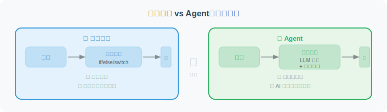
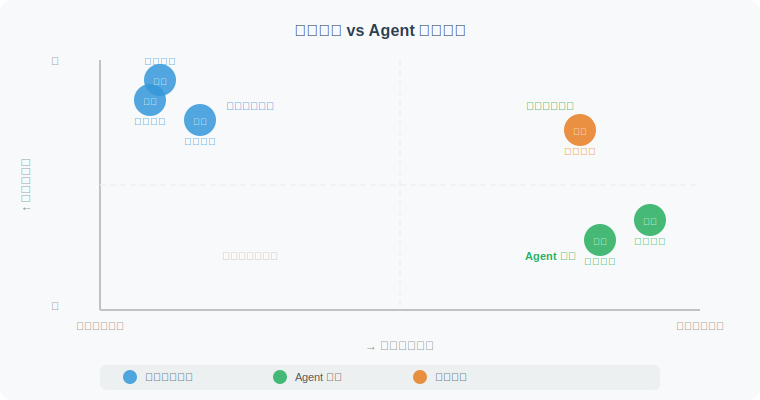

# Agent 与传统程序的区别

> 📖 *"理解 Agent 最好的方式之一，就是搞清楚它和你以前写的程序有什么不同。"*

## 根本区别：确定性 vs 自主性

传统程序和 Agent 之间最根本的区别在于**决策方式**：



## 全方位对比

让我们通过一个具体的任务来对比两者的差异——**"分析一份 CSV 销售数据，找出销量最高的产品"**：

### 传统程序的做法

```python
"""
传统程序方式：分析 CSV 销售数据
特点：每一步都是程序员预先写好的
"""
import pandas as pd

def analyze_sales_traditional(file_path: str) -> dict:
    """
    传统方式：程序员预先定义了所有步骤
    - 步骤固定，不能根据数据特点调整
    - 如果数据格式变了，程序就挂了
    - 不能回答"为什么这个产品卖得好？"这类开放性问题
    """
    # 步骤1：读取数据（写死了 CSV 格式）
    df = pd.read_csv(file_path)
    
    # 步骤2：数据清洗（写死了列名）
    df = df.dropna(subset=["product_name", "sales_amount"])
    
    # 步骤3：按产品分组求和（写死了分析方式）
    product_sales = df.groupby("product_name")["sales_amount"].sum()
    
    # 步骤4：找出最高的（写死了排序方式）
    top_product = product_sales.idxmax()
    top_sales = product_sales.max()
    
    # 步骤5：返回结果（写死了输出格式）
    return {
        "top_product": top_product,
        "total_sales": top_sales
    }

# 问题：
# ❌ 如果文件是 Excel 而不是 CSV？ → 挂了
# ❌ 如果列名是 "商品名称" 而不是 "product_name"？ → 挂了
# ❌ 用户想看趋势而不是总量？ → 做不到
# ❌ 用户想知道"为什么"？ → 完全做不到
```

### Agent 的做法

```python
"""
Agent 方式：分析销售数据
特点：理解目标后自主决定分析方式
"""

def analyze_sales_agent(user_request: str):
    """
    Agent 方式：根据用户需求自主分析
    
    用户可能说：
    - "帮我分析这份销售数据"（模糊目标，Agent 自行决定分析什么）
    - "哪个产品卖得最好？为什么？"（需要深入分析）
    - "做一个销售趋势图"（需要数据可视化）
    
    Agent 的处理过程：
    """
    
    # 🧠 思考1: 需要先看看数据长什么样
    # 🦾 行动1: read_file("sales_data.csv") → 读取前几行
    # 👁️ 感知1: 看到了列名是中文"商品名称, 销售额, 日期..."
    
    # 🧠 思考2: 列名是中文的，我需要用正确的列名来分析
    #           用户想知道"哪个卖得最好"，我应该按产品汇总
    # 🦾 行动2: run_python("""
    #     import pandas as pd
    #     df = pd.read_csv('sales_data.csv')
    #     top = df.groupby('商品名称')['销售额'].sum().sort_values(ascending=False)
    #     print(top.head(10))
    # """)
    # 👁️ 感知2: 得到了 Top 10 产品的销售排名
    
    # 🧠 思考3: 用户还问了"为什么"，我应该进一步分析
    #           看看时间趋势、价格因素等
    # 🦾 行动3: run_python("""
    #     # 分析销售趋势和价格关联
    #     ...生成分析代码...
    # """)
    
    # 🧠 思考4: 数据分析完成，可以给出完整回答了
    # ✅ 最终回答: 包含数据分析结果 + 原因解释 + 可视化图表
    pass
```

## 六大维度对比



| 对比维度 | 传统程序 | Agent |
|------|:---:|:---:|
| 执行方式 | 按预设代码逐行执行 | 根据目标自主决定步骤 |
| 输入要求 | 需要严格格式化的输入 | 接受自然语言的模糊描述 |
| 容错能力 | 遇到异常通常直接报错 | 能自主分析错误并调整 |
| 确定性 | 相同输入 → 相同输出 | 相同输入可能有不同路径 |
| 扩展性 | 新功能需要写新代码 | 给新工具即可拥有新能力 |
| 适用场景 | 规则明确、重复性高的任务 | 复杂、模糊、需推理的任务 |

### 维度1：执行方式

```python
# 传统程序：流程是固定的
def traditional_process_order(order):
    validate(order)        # 永远先验证
    check_inventory(order) # 永远再检查库存
    process_payment(order) # 永远再处理支付
    ship(order)            # 永远最后发货
    # 顺序不会变，步骤不会变

# Agent：流程是动态的
def agent_process_order(order_description: str):
    # Agent 可能的决策：
    # - 如果是 VIP 客户 → 先处理支付再检查库存（优先保证下单）
    # - 如果库存不足 → 自动搜索替代商品并询问用户
    # - 如果支付失败 → 尝试其他支付方式
    # - 如果用户描述模糊 → 先提问确认再处理
    pass
```

### 维度2：容错能力

这是 Agent 最令人兴奋的特性之一——**遇到问题能自己想办法解决**：

```python
# 传统程序的错误处理：人类预先定义的
def traditional_fetch_data(url: str):
    try:
        response = requests.get(url)
        return response.json()
    except ConnectionError:
        return "连接失败"       # 只能返回预设的错误信息
    except JSONDecodeError:
        return "数据格式错误"   # 无法自主解决问题

# Agent 的错误处理：自主分析和解决
"""
Agent 遇到错误时的行为：

🦾 行动: 访问 API_A 获取数据
❌ 结果: 连接超时

🧠 思考: API_A 超时了，可能是服务故障。
         我可以：
         1. 重试一次（可能是临时网络问题）
         2. 尝试 API_B（备用数据源）
         3. 从缓存获取旧数据
         让我先重试一次...

🦾 行动: 重试访问 API_A
❌ 结果: 仍然超时

🧠 思考: 确认 API_A 不可用，切换到备用方案 API_B

🦾 行动: 访问 API_B 获取数据
✅ 结果: 成功获取数据

🤖 回复: "数据已获取。注意：主数据源暂时不可用，
         本次数据来自备用源，可能有约1小时的延迟。"
"""
```

### 维度3：确定性 vs 非确定性

```python
# 传统程序：确定性 —— 可预测、可测试
def add(a: int, b: int) -> int:
    return a + b
# add(2, 3) 永远返回 5

# Agent：非确定性 —— 灵活、但不完全可预测
"""
用户: "帮我写一个欢迎邮件"

第一次运行：
🤖 "亲爱的用户，欢迎加入我们的大家庭！..."

第二次运行（相同的输入）：
🤖 "Hi！很高兴你成为我们的一员！..."

→ 结果不同，但都是合理的
→ 这是 LLM 的特性：创造性带来了不确定性
"""
```

## 什么时候用传统程序？什么时候用 Agent？


> 💡 **最佳实践：Agent + 传统程序混合使用**
>
> 实际项目中，最好的做法是让 **Agent 负责决策和协调**，让**传统程序负责执行确定性操作**。
> 
> 比如：Agent 决定“需要给用户发一封邮件”（决策），然后调用传统的邮件发送函数来执行（确定性操作）。

## 一张图总结


## 本节小结

| 要点 | 说明 |
|------|------|
| **根本区别** | 传统程序是确定性的，Agent 是自主性的 |
| **执行方式** | 传统程序按代码执行，Agent 自主决定步骤 |
| **容错能力** | Agent 能自主分析错误并调整策略 |
| **适用场景** | 复杂、模糊、需要推理的任务适合 Agent |
| **最佳实践** | Agent（决策）+ 传统程序（执行）混合使用 |

## 🤔 思考练习

1. 你目前工作中的哪些任务适合用 Agent 来完成？哪些适合用传统程序？
2. Agent 的"非确定性"在什么场景下是优点？什么场景下是缺点？
3. 如果让你设计一个电商系统，哪些模块用 Agent，哪些用传统程序？

---

*了解了 Agent 的本质后，让我们在最后一节看看 Agent 在各行各业中的精彩应用。*
