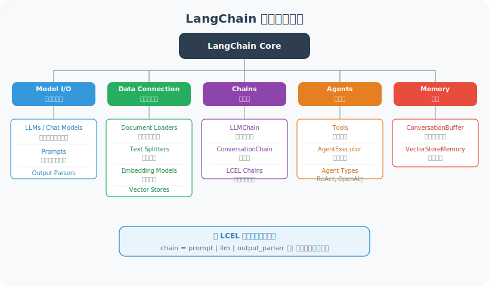

# LangChain 架构全景

LangChain 是一个模块化的 LLM 应用开发框架，核心设计思想是**通过标准化接口组合各类组件**，让开发者专注于业务逻辑。

## 核心组件体系



## 快速上手

```python
# pip install langchain langchain-openai langchain-community

from langchain_openai import ChatOpenAI
from langchain_core.messages import HumanMessage, SystemMessage
from langchain_core.prompts import ChatPromptTemplate
from langchain_core.output_parsers import StrOutputParser

# ============================
# 1. 基础模型调用
# ============================

llm = ChatOpenAI(model="gpt-4o-mini", temperature=0.7)

# 直接调用
response = llm.invoke([HumanMessage(content="你好！")])
print(response.content)

# ============================
# 2. 提示词模板
# ============================

# ChatPromptTemplate：推荐方式
prompt = ChatPromptTemplate.from_messages([
    ("system", "你是一个{role}，专注于{domain}领域。"),
    ("user", "{question}")
])

# 格式化
formatted = prompt.format_messages(
    role="Python 专家",
    domain="机器学习",
    question="如何用 sklearn 训练一个分类器？"
)

response = llm.invoke(formatted)
print(response.content)

# ============================
# 3. 输出解析器
# ============================

from langchain_core.output_parsers import JsonOutputParser
from pydantic import BaseModel, Field

class ProductInfo(BaseModel):
    name: str = Field(description="产品名称")
    price: float = Field(description="价格")
    category: str = Field(description="类别")

parser = JsonOutputParser(pydantic_object=ProductInfo)

product_prompt = ChatPromptTemplate.from_messages([
    ("system", "从用户描述中提取产品信息，以JSON格式返回。\n{format_instructions}"),
    ("user", "{description}")
])

# 注入格式说明
formatted = product_prompt.format_messages(
    format_instructions=parser.get_format_instructions(),
    description="一款售价299元的蓝牙耳机"
)

response = llm.invoke(formatted)
product = parser.parse(response.content)
print(f"产品：{product.name}, 价格：{product.price}")

# ============================
# 4. 对话管理
# ============================

from langchain_core.chat_history import InMemoryChatMessageHistory
from langchain_core.runnables.history import RunnableWithMessageHistory

# 存储聊天历史
store = {}

def get_session_history(session_id: str):
    if session_id not in store:
        store[session_id] = InMemoryChatMessageHistory()
    return store[session_id]

chat_prompt = ChatPromptTemplate.from_messages([
    ("system", "你是一个有帮助的助手。"),
    ("placeholder", "{chat_history}"),
    ("human", "{input}")
])

chain = chat_prompt | llm | StrOutputParser()

# 带历史的链
with_history = RunnableWithMessageHistory(
    chain,
    get_session_history,
    input_messages_key="input",
    history_messages_key="chat_history"
)

# 多轮对话
session = {"configurable": {"session_id": "user_001"}}

reply1 = with_history.invoke({"input": "我叫张伟"}, config=session)
reply2 = with_history.invoke({"input": "我叫什么名字？"}, config=session)

print(reply1)
print(reply2)  # 应该记得"张伟"
```

## 版本说明

LangChain 发展迅速，目前已进入 **0.3.x** 稳定版本。关键版本差异：

```python
# 老式写法（langchain 0.1 之前，已废弃）
# from langchain.llms import OpenAI
# from langchain.chains import LLMChain

# 新式写法（推荐，langchain >= 0.3）
from langchain_openai import ChatOpenAI       # 从子包导入
from langchain_core.prompts import ChatPromptTemplate  # core 是稳定基础

# LCEL（LangChain Expression Language）是标准的链构建方式
chain = prompt | llm | StrOutputParser()  # 管道语法

# LangChain 0.3 重要变化：
# - 完全移除了 langchain 0.1 的废弃 API
# - langchain-community 中的集成逐步迁移到独立包
# - 推荐配合 LangGraph 处理复杂 Agent 工作流
# - 内置 Pydantic V2 支持

# 检查版本
import langchain
print(langchain.__version__)  # 应为 0.3.x
```

---

## 小结

LangChain 的五大核心：模型、提示、输出解析、链、Agent。
推荐使用 LCEL 管道语法（`|` 符号连接），这是 LangChain 的未来方向。

---

*下一节：[8.2 Chain：构建处理管道](./02_chains.md)*
