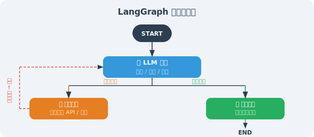

# 为什么需要图结构？

> **本节目标**：理解线性链的局限，掌握图结构解决复杂 Agent 场景的核心优势。

LangChain 的 LCEL 链非常适合线性处理流程，但现实中的 Agent 需要处理更复杂的场景：循环执行、条件分支、回溯重试。图结构正是为此而生。

---

## 线性链的局限

```python
# LCEL 链：线性的，A → B → C
chain = step_a | step_b | step_c

# 无法处理：
# 1. 循环："步骤B的结果不满意，重新执行步骤B"
# 2. 条件分支："根据步骤A的结果，走B路或C路"  
# 3. 并行后汇合："同时执行B和C，然后在D步骤合并"
# 4. 持久状态："步骤B需要访问步骤A很久之前保存的数据"
```

**一个具体的例子**：假设你在构建一个代码审查 Agent：

```python
# LCEL 方式：线性执行，无法应对复杂情况
review_chain = analyze_code | find_issues | suggest_fix

# 问题场景：
# 1. 如果 analyze_code 发现代码文件太大 → 需要先拆分，然后分段分析
#    LCEL 无法回到之前的步骤
# 2. 如果 find_issues 发现了安全漏洞 → 需要额外的安全分析步骤
#    LCEL 无法动态插入步骤
# 3. 如果 suggest_fix 的修复建议引入了新问题 → 需要重新审查
#    LCEL 无法实现循环
```

---

## 图结构的优势



图结构从根本上改变了 Agent 的执行模型：

| 特性 | 线性链（LCEL） | 图结构（LangGraph） |
|------|:---:|:---:|
| 执行流程 | A → B → C（固定） | 任意拓扑（动态） |
| 循环支持 | ❌ 不支持 | ✅ 节点可回指 |
| 条件分支 | ⚠️ 有限支持 | ✅ 条件边 |
| 状态管理 | ❌ 无持久状态 | ✅ 全局 State |
| 人机交互 | ❌ 不支持 | ✅ Human-in-the-Loop |
| 断点恢复 | ❌ 不支持 | ✅ Checkpoint 持久化 |
| 并行执行 | ⚠️ 简单并行 | ✅ 复杂并行+汇合 |

---

## LangGraph 的核心设计

LangGraph 的设计围绕三个核心概念：**State（状态）**、**Node（节点）**、**Edge（边）**。

```python
# pip install langgraph

from langgraph.graph import StateGraph, END, START
from typing import TypedDict, Annotated
import operator

# 1. 定义状态（State）：图中所有节点共享的数据
class AgentState(TypedDict):
    messages: list        # 消息历史
    current_task: str     # 当前任务
    iterations: int       # 循环次数（防无限循环）
    final_answer: str     # 最终答案

# 2. 定义节点（Node）：每个节点是一个函数，接收状态，返回更新
def process_input(state: AgentState) -> AgentState:
    """节点函数：处理输入"""
    print(f"处理：{state['current_task']}")
    return {"iterations": state.get("iterations", 0) + 1}

# 3. 定义边（Edge）：节点间的连接（可以是条件边）
def should_continue(state: AgentState) -> str:
    """条件边：返回下一个节点的名称"""
    if state.get("final_answer"):
        return "end"
    elif state.get("iterations", 0) >= 5:
        return "end"  # 防止无限循环
    else:
        return "continue"

# 4. 构建图
graph = StateGraph(AgentState)
graph.add_node("process", process_input)
graph.add_edge(START, "process")
graph.add_conditional_edges(
    "process",
    should_continue,
    {"end": END, "continue": "process"}  # 可以循环回自己！
)

app = graph.compile()
```

### 什么场景应该选择 LangGraph？

```python
# ✅ 选择 LangGraph 的信号：
should_use_langgraph = [
    "Agent 需要多步循环（如 ReAct 循环）",
    "需要条件路由（如根据用户意图走不同分支）",
    "需要 Human-in-the-Loop（审批/确认节点）",
    "需要长时间运行的任务（带 checkpoint 恢复）",
    "多个 Agent 协作（Supervisor 模式）",
]

# ❌ 不需要 LangGraph 的场景：
use_lcel_instead = [
    "简单的 Prompt → LLM → 输出",
    "固定步骤的处理管道",
    "不需要循环和条件分支的工作流",
]
```

---

## 小结

图结构的核心价值：
- **循环支持**：节点可以指向自身或之前的节点
- **持久状态**：State 在所有节点间共享，贯穿整个执行
- **条件路由**：根据状态动态决定下一步
- **可视化**：图结构可以直观地展示 Agent 的执行逻辑
- **断点恢复**：通过 Checkpoint 机制，支持任务中断后恢复执行
- **人机协作**：内置 Human-in-the-Loop 支持，适合需要人类审批的场景

---

*下一节：[9.2 LangGraph 核心概念：节点、边、状态](./02_core_concepts.md)*
