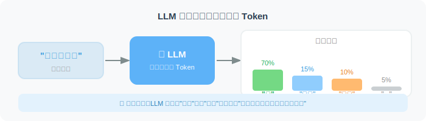
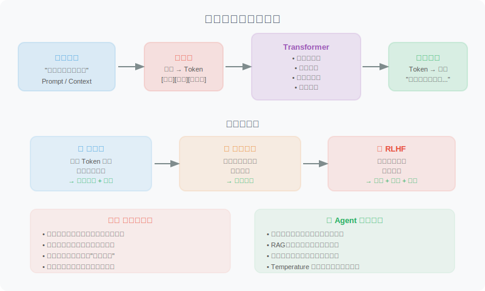
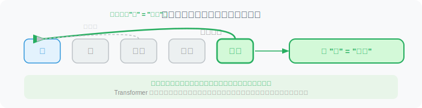
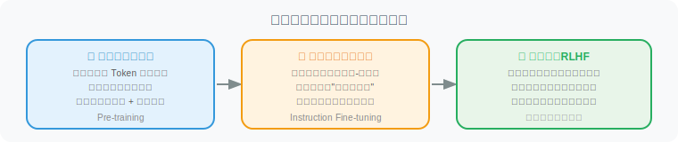
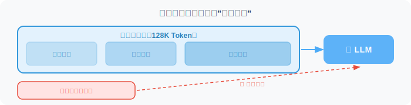

# LLM 是如何工作的？（直觉理解）

> 🧠 *"你不需要成为引擎工程师才能开好车——但理解引擎原理，能让你在关键时刻做出更好的判断。"*

大语言模型（Large Language Model，简称 LLM）是当代 AI 技术的核心突破之一。本节不会给你推导数学公式，而是通过直觉和类比，帮你真正理解它的工作原理——这对 Agent 开发至关重要。

## 一个简单的起点：预测下一个词

LLM 的本质，出乎意料地简单：**它在预测"下一个词最可能是什么"**。

想象你在玩文字接龙游戏：

```
"今天天气很___"  →  "好"
"我想吃一碗___"  →  "面条" / "米饭" / "饺子"
"人工智能将会___"  →  "改变世界" / "取代工作" / ...
```

LLM 做的正是这件事，只不过它在海量文本上训练，学会了极其精准地预测。当你输入一段文字，它一个词一个词地生成回复——每次预测都基于之前所有的内容。



> **关键直觉**：LLM 不是在"理解"然后"回答"，它是在"根据上下文预测最可能的续写"。这个预测过程如此精妙，以至于产生了我们认为是"理解"的效果。

## Transformer：注意力就是一切



现代 LLM 的核心架构是 **Transformer**，其核心机制是**注意力机制（Attention）**。

用一个比喻来理解注意力机制：

想象你在读这句话——"她把苹果放进篮子，然后拿走了**它**"。

"它"指的是什么？你的大脑会自动"关注"前文中的"篮子"（而不是"苹果"），知道"它"指的是篮子。这就是注意力——**在处理每个词时，决定上文中哪些词最重要**。

Transformer 的多头注意力机制正是模拟了这一过程，让模型在生成每个词时，都能关注到输入序列中最相关的位置。



## 从预训练到对话：三个阶段

现代对话型 LLM（如 GPT-4、Claude、通义千问）的训练通常分为三个阶段：



这三个阶段解释了为什么现代 LLM 既有广博的知识，又能遵循指令，还能产生友好、有用的回复。

## 涌现能力：1+1 > 2 的神奇现象

当模型参数量达到某个临界点时，会突然涌现出之前小模型完全不具备的能力。这被称为**涌现能力（Emergent Abilities）**。


典型的涌现能力包括：

- **思维链推理**：能够一步步推理解决复杂问题
- **少样本学习**：看几个例子就能理解新任务
- **代码生成**：从自然语言描述生成可运行代码
- **跨语言迁移**：在一种语言上学到的能力迁移到另一种语言

```python
# 涌现能力的一个典型例子：复杂推理
prompt = """
Q: 如果所有的 Bloops 都是 Razzies，所有的 Razzies 都是 Lazzies，
   那么所有的 Bloops 都是 Lazzies 吗？
A: 让我一步步思考...
"""
# 小模型会直接猜测，大模型能够进行逻辑推导
```

## 上下文窗口：模型的"工作记忆"

LLM 有一个关键限制：**上下文窗口（Context Window）**。

模型在每次生成时，只能"看到"有限数量的 Token（后面会详细讲解 Token）。超出上下文窗口的内容，模型完全"遗忘"。



| 模型 | 上下文窗口大小 |
|------|---------------|
| GPT-4o | 128K Token |
| GPT-5 | 1M+ Token |
| Claude 4 Opus/Sonnet | 200K Token |
| Gemini 2.5 Pro | 1M Token |
| DeepSeek-R2 | 128K Token |
| Llama 4 | 128K Token |
| Qwen 3 | 128K Token |

上下文窗口的大小直接影响 Agent 的设计——多长的对话历史可以保留？文档有多长可以直接塞入？这些都是 Agent 开发中需要权衡的关键问题。

## 知识截止日期与幻觉

LLM 存在两个重要局限性，Agent 开发者必须牢记：


理解这两个局限性，是设计可靠 Agent 的基础。Agent 架构中的工具调用、RAG（检索增强生成）等技术，很大程度上就是为了克服这些限制。

## 对 Agent 开发的启示

理解了 LLM 的工作原理，我们可以得出几个重要启示：

1. **LLM 是概率性的**：相同的输入不一定产生相同的输出（Temperature > 0 时）
2. **上下文决定一切**：越好的上下文（Prompt），越好的输出
3. **模型不是全知的**：需要工具来获取实时信息或专业知识
4. **Token 是计费单位**：优化 Prompt 既是成本优化，也是性能优化
5. **幻觉不可完全避免**：需要验证机制（如工具调用结果验证）

---

## 小结

| 概念 | 核心要点 |
|------|---------|
| 工作原理 | 预测下一个 Token，通过注意力机制理解上下文 |
| 训练过程 | 预训练 → 指令微调 → RLHF |
| 涌现能力 | 大规模带来质变，如推理、代码生成 |
| 上下文窗口 | 模型的"工作记忆"，影响 Agent 设计 |
| 核心局限 | 知识截止日期 + 幻觉，需要工具和验证 |

下一节，我们将学习如何通过 **Prompt Engineering** 充分发挥 LLM 的能力。

---

*下一节：[2.2 Prompt Engineering：与模型对话的艺术](./02_prompt_engineering.md)*
