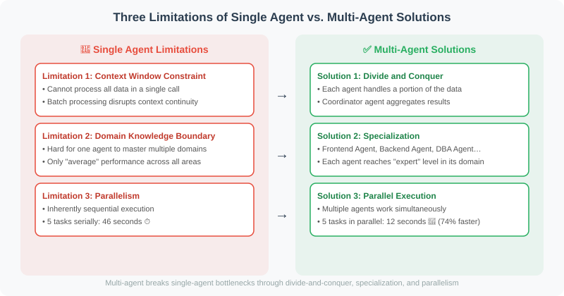

# 18.1 Limitations of Single Agents

> **Section Goal**: Understand the three core limitations of a single Agent on complex tasks, and learn how to decide when to introduce a multi-Agent architecture.

---



## Three Core Limitations

```python
# Limitation 1: Context Window Constraint
# A single Agent's context window is limited (even 128K tokens can be exhausted on complex tasks)

# Example: Analyzing an entire codebase
problem = """
Task: Analyze 50,000 lines of code and find all security vulnerabilities

The single Agent's dilemma:
- Cannot process all the code in a single call
- Must process in batches, but how to maintain context coherence?
- How to integrate analysis results from different batches?
"""

# Limitation 2: Domain Knowledge Boundaries
# A single Agent struggles to be an expert in multiple domains simultaneously

# Example: Full-stack project development
fullstack_task = """
Task: Build a complete web application

Required expertise:
- Frontend React/Vue development
- Backend Python/Node.js development
- Database design (SQL/NoSQL)
- DevOps/CI-CD configuration
- Security auditing

Single Agent's problem: one Agent can only be "average" across all domains
"""

# Limitation 3: Parallelism
# A single Agent is inherently sequential and cannot truly execute in parallel

sequential_time = sum([10, 8, 12, 9, 7])  # Single Agent: 46 seconds
parallel_time = max([10, 8, 12, 9, 7])    # Multi-Agent parallel: 12 seconds
print(f"Time saved: {sequential_time - parallel_time} seconds ({(sequential_time-parallel_time)/sequential_time*100:.0f}%)")
```

## Advantages of Multi-Agent Systems

```python
# Demonstrating advantages: parallel processing of different modules

import concurrent.futures
import time
from openai import OpenAI

client = OpenAI()

def single_agent_approach(tasks: list[str]) -> list[str]:
    """Single Agent: sequential processing"""
    results = []
    for task in tasks:
        # Each call must wait
        response = client.chat.completions.create(
            model="gpt-4.1-mini",
            messages=[{"role": "user", "content": task}],
            max_tokens=100
        )
        results.append(response.choices[0].message.content)
    return results

def multi_agent_approach(tasks: list[str]) -> list[str]:
    """Multi-Agent: parallel processing (one independent Agent per task)"""
    def process_task(task: str) -> str:
        response = client.chat.completions.create(
            model="gpt-4.1-mini",
            messages=[{"role": "user", "content": task}],
            max_tokens=100
        )
        return response.choices[0].message.content
    
    with concurrent.futures.ThreadPoolExecutor(max_workers=5) as executor:
        results = list(executor.map(process_task, tasks))
    
    return results

# Comparison test
tasks = [
    "Describe Python's characteristics in one sentence",
    "Describe JavaScript's characteristics in one sentence", 
    "Describe Go's characteristics in one sentence",
    "Describe Rust's characteristics in one sentence",
    "Describe Java's characteristics in one sentence",
]

start = time.time()
single_results = single_agent_approach(tasks)
single_time = time.time() - start

start = time.time()
multi_results = multi_agent_approach(tasks)
multi_time = time.time() - start

print(f"Single Agent time: {single_time:.2f}s")
print(f"Multi-Agent time: {multi_time:.2f}s")
print(f"Speedup: {single_time/multi_time:.1f}x")
```

## When to Use Multi-Agent?

```python
# Decision function
def should_use_multi_agent(task: dict) -> bool:
    """Determine whether multi-Agent is needed"""
    
    criteria = {
        "Requires parallel processing": task.get("parallelizable", False),
        "Requires multiple domains": len(task.get("domains", [])) > 2,
        "High task complexity": task.get("complexity", 0) > 7,
        "Time-sensitive": task.get("time_sensitive", False),
        "Requires mutual verification": task.get("requires_verification", False),
    }
    
    # Consider multi-Agent if 2 or more criteria are met
    met_criteria = sum(criteria.values())
    
    print("Evaluation results:")
    for criterion, met in criteria.items():
        print(f"  {'✅' if met else '❌'} {criterion}")
    print(f"Met {met_criteria} criteria")
    
    return met_criteria >= 2

# Test
print(should_use_multi_agent({
    "name": "Full-stack application development",
    "parallelizable": True,
    "domains": ["frontend", "backend", "database", "security"],
    "complexity": 9,
    "time_sensitive": True,
    "requires_verification": True
}))
```

---

## Multi-Agent Is Not a Silver Bullet

> ⚠️ **Important**: The multi-Agent architecture introduces new complexity, and is not suitable for every scenario.

### The Cost of Multi-Agent

```python
"""
Hidden cost analysis of multi-Agent systems
Helps teams make rational decisions instead of blindly chasing multi-Agent
"""

@dataclass
class MultiAgentCost:
    """Cost analysis of a multi-Agent system"""
    # Communication overhead
    communication_rounds: int  # Number of communication rounds between Agents
    tokens_per_round: int      # Tokens consumed per communication round
    token_cost_per_1k: float   # Cost per 1K tokens

    # Coordination overhead
    coordination_latency_ms: float  # Extra latency from coordination decisions

    # Quality risk
    information_loss_rate: float    # Information loss rate in communication (0-1)
    conflict_probability: float    # Probability of conflicting opinions among Agents (0-1)

    @property
    def communication_cost(self) -> float:
        """Communication cost estimate"""
        total_tokens = self.communication_rounds * self.tokens_per_round
        return total_tokens / 1000 * self.token_cost_per_1k

    @property
    def quality_risk(self) -> float:
        """Quality risk score (0-1, lower is better)"""
        return self.information_loss_rate * 0.5 + self.conflict_probability * 0.5

    def is_worthwhile(self, single_agent_time_s: float,
                      multi_agent_time_s: float,
                      single_agent_quality: float,
                      multi_agent_quality: float) -> dict:
        """Determine whether multi-Agent is worthwhile"""
        time_saving = single_agent_time_s - multi_agent_time_s
        time_saving_pct = time_saving / single_agent_time_s * 100
        quality_gain = multi_agent_quality - single_agent_quality

        worthwhile = (
            time_saving_pct > 30  # Time saving > 30%
            or quality_gain > 0.15  # Quality gain > 15%
        ) and self.quality_risk < 0.3  # Quality risk under control

        return {
            "time_saving_pct": round(time_saving_pct, 1),
            "quality_gain": round(quality_gain, 3),
            "communication_cost_usd": round(self.communication_cost, 4),
            "quality_risk": round(self.quality_risk, 3),
            "recommendation": "Multi-Agent" if worthwhile else "Single Agent",
            "reason": (
                f"Saved {time_saving_pct:.0f}% time, "
                f"quality {'improved' if quality_gain > 0 else 'declined'} {abs(quality_gain)*100:.1f}%, "
                f"communication cost ${self.communication_cost:.4f}"
            ),
        }
```

### Single-Agent vs. Multi-Agent Decision Matrix

| Dimension | Single Agent better | Multi-Agent better |
|-----------|---------------------|--------------------|
| **Task complexity** | Simple tasks (< 3 steps) | Complex tasks (> 5 steps, decomposable) |
| **Domain expertise** | Single domain | 3+ different domains |
| **Latency requirement** | No special requirement | Needs parallel speedup |
| **Accuracy requirement** | Ordinary requirement | Needs multiple verification (medical / legal / financial) |
| **Cost sensitivity** | Limited budget | Ample budget (can absorb communication overhead) |
| **Debugging complexity** | Simple and direct | Needs to trace interactions of multiple Agents |
| **Context need** | A single context suffices | Exceeds the context window |

### Gradual Adoption Strategy

```python
"""
Gradual migration from single Agent to multi-Agent
Do not jump straight to the most complex multi-Agent architecture at once
"""

class AgentEvolution:
    """Gradual evolution path of the Agent architecture"""

    @staticmethod
    def stage_1_single_enhanced():
        """Stage 1: Enhanced single Agent
        Simulate multiple roles within a single Agent via Prompt Engineering"""
        system_prompt = """You are a multi-function assistant that can switch between the following roles:

        📋 Product Analyst: analyze requirements, write user stories
        🏗️ Architect: design system architecture, choose the tech stack
        💻 Developer: write code to implement features
        🧪 Test Engineer: design test cases

        When the user gives a task, process it role by role, clearly labeling each role's output.
        """
        # Pros: simplest, no coordination needed
        # Cons: large context usage, role-switching is not specialized enough

    @staticmethod
    def stage_2_sequential_pipeline():
        """Stage 2: Sequential pipeline
        Multiple Agents process in turn; the previous one's output is the next one's input"""
        # Pros: each Agent focuses on one stage, improving quality
        # Cons: no parallelism, latency is the sum of all stages

    @staticmethod
    def stage_3_parallel_with_supervisor():
        """Stage 3: Parallel + Supervisor
        The Supervisor distributes tasks to parallel Agents and aggregates the results"""
        # Pros: parallel speedup, Supervisor guarantees consistency
        # Cons: the Supervisor becomes a bottleneck

    @staticmethod
    def stage_4_collaborative():
        """Stage 4: Collaborative multi-Agent
        Agents can communicate, negotiate, and collaborate freely with each other"""
        # Pros: most flexible, suited to complex tasks
        # Cons: high communication overhead, hard to debug
```

> 💡 **Practical advice**: Start from Stage 1. Only upgrade to Stage 2 when the limitations of a single Agent clearly hurt the results — and so on. Each stage you advance roughly multiplies complexity by 2–3×.

---

## Summary

Scenarios for using multi-Agent:
- Tasks can be parallelized (significant time savings)
- Multiple domains of expertise are required (role specialization)
- Task exceeds a single context window
- Mutual verification is needed (improved accuracy)

The cost of multi-Agent:
- Communication overhead (token cost, latency)
- Coordination complexity (conflict resolution, consistency guarantees)
- Difficult debugging (locating distributed problems)
- Information loss (context truncation when passing between Agents)

> 📖 **Want to dive deeper into the academic frontier of multi-Agent systems?** Read [18.6 Paper Readings: Frontier Research in Multi-Agent Systems](./06_paper_readings.md), covering in-depth analyses of core papers including MetaGPT, ChatDev, AutoGen, and AgentVerse.

> 💡 **Further reading**: For specialized evaluation methods for multi-Agent systems (Agent-as-Judge, τ-bench, SWE-bench), see [18.6 Agent-Specific Evaluation Framework](../chapter_20_evaluation/06_agent_evaluation.md).

---

*Next section: [18.2 Multi-Agent Communication Patterns](./02_communication_patterns.md)*
