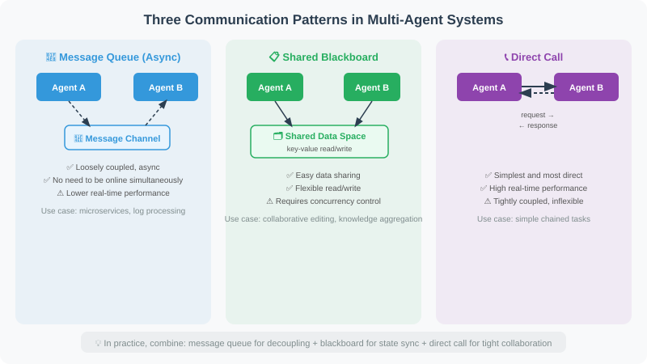
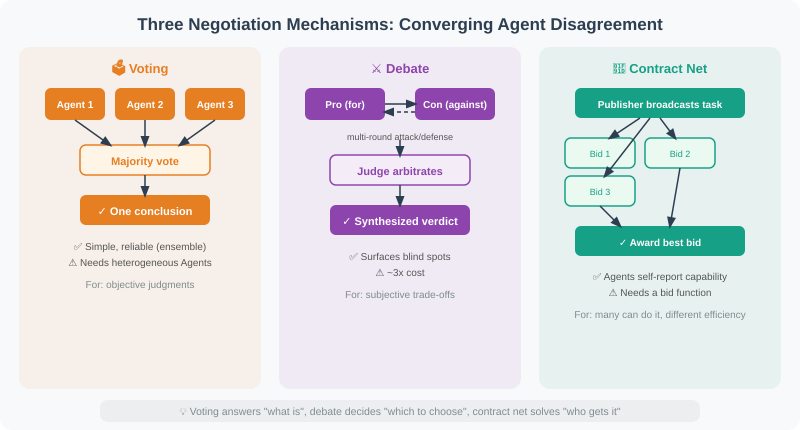

# 18.2 Multi-Agent Communication Patterns

In a multi-Agent system, how Agents exchange information is a core design decision. Different communication patterns suit different scenarios; choosing the wrong one can make the system difficult to maintain or cause performance issues.

This section introduces the three most common communication patterns and demonstrates their implementation with code. After reading this section, you should be able to choose the appropriate pattern based on your project's needs.



## Three Communication Patterns

### Pattern 1: Message Queue (Asynchronous Communication)

A message queue is a loosely coupled communication method: the sender places a message into a "channel," and the receiver retrieves it from the channel. The two Agents don't need to be online simultaneously, nor do they need to know each other's implementation details. This pattern is very common in microservice architectures.

```python
from typing import TypedDict, Optional
from queue import Queue
import threading

# ============================
# Pattern 1: Message Queue (Asynchronous Communication)
# ============================

class MessageBus:
    """Simple message bus supporting asynchronous communication between Agents"""
    
    def __init__(self):
        self.channels: dict[str, Queue] = {}
    
    def create_channel(self, name: str):
        """Create a channel"""
        self.channels[name] = Queue()
    
    def publish(self, channel: str, message: dict):
        """Publish a message"""
        if channel not in self.channels:
            self.create_channel(channel)
        self.channels[channel].put(message)
    
    def subscribe(self, channel: str, timeout: float = 5.0) -> Optional[dict]:
        """Subscribe to messages (wait)"""
        if channel not in self.channels:
            return None
        try:
            return self.channels[channel].get(timeout=timeout)
        except:
            return None

# Usage example
bus = MessageBus()

def researcher_agent(bus: MessageBus, topic: str):
    """Researcher Agent"""
    # Conduct research
    research_result = f"Research results on '{topic}'..."
    
    # Publish results
    bus.publish("research_results", {
        "from": "researcher",
        "topic": topic,
        "result": research_result
    })

def writer_agent(bus: MessageBus):
    """Writer Agent: waits for research results"""
    # Wait for research results
    message = bus.subscribe("research_results", timeout=10)
    
    if message:
        content = f"Based on research: {message['result'][:50]}..., writing article..."
        bus.publish("articles", {
            "from": "writer",
            "content": content
        })

# Run concurrently
def run_pipeline(topic: str):
    import threading
    
    t1 = threading.Thread(target=researcher_agent, args=(bus, topic))
    t2 = threading.Thread(target=writer_agent, args=(bus,))
    
    t1.start()
    t2.start()
    t1.join()
    t2.join()
    
    article = bus.subscribe("articles", timeout=15)
    return article

# ============================
# Pattern 2: Shared State (LangGraph approach)
# ============================

# Shared state is LangGraph's core communication method.
# Each node "communicates" by modifying the shared State,
# just like team members collaborating on a shared document.
# Advantage: state is fully transparent and can be inspected at any time.

from typing import TypedDict, Annotated
from langgraph.graph import StateGraph, END, START
import operator

class TeamState(TypedDict):
    """Team shared state"""
    task: str
    research_notes: Annotated[list, operator.add]  # Appendable
    drafts: Annotated[list, operator.add]          # Appendable
    feedback: Annotated[list, operator.add]        # Appendable
    final_output: Optional[str]

# Each node "communicates" by modifying the shared State
def researcher(state: TeamState) -> dict:
    """Research node: reads task, writes research results"""
    from openai import OpenAI
    client = OpenAI()
    
    response = client.chat.completions.create(
        model="gpt-4o-mini",
        messages=[{"role": "user", "content": f"Please research: {state['task']}, provide 3 key points"}],
        max_tokens=200
    )
    
    notes = response.choices[0].message.content
    return {"research_notes": [notes]}

def writer(state: TeamState) -> dict:
    """Writing node: reads research results, writes draft"""
    from openai import OpenAI
    client = OpenAI()
    
    context = "\n".join(state.get("research_notes", []))
    response = client.chat.completions.create(
        model="gpt-4o-mini",
        messages=[{"role": "user", "content": f"Based on research: {context}, write a 200-word article"}],
        max_tokens=300
    )
    
    draft = response.choices[0].message.content
    return {"drafts": [draft]}

def editor(state: TeamState) -> dict:
    """Editor node: reviews draft, produces final output"""
    latest_draft = state.get("drafts", [""])[-1]
    final = f"[Reviewed] {latest_draft}"
    return {"final_output": final}

# Build team workflow
team_graph = StateGraph(TeamState)
team_graph.add_node("researcher", researcher)
team_graph.add_node("writer", writer)
team_graph.add_node("editor", editor)
team_graph.add_edge(START, "researcher")
team_graph.add_edge("researcher", "writer")
team_graph.add_edge("writer", "editor")
team_graph.add_edge("editor", END)

team_app = team_graph.compile()

result = team_app.invoke({
    "task": "Applications of Python decorators",
    "research_notes": [],
    "drafts": [],
    "feedback": [],
    "final_output": None
})
print(result["final_output"][:200])

# ============================
# Pattern 3: Direct Call (Synchronous)
# ============================

# The simplest pattern: one Agent directly calls another Agent like a function.
# Suitable for simple dependencies, but because it's synchronously blocking,
# long call chains can affect response speed.

class AgentNetwork:
    """Agent network: Agents can directly call other Agents"""
    
    def __init__(self):
        self.agents = {}
    
    def register(self, name: str, agent_func):
        """Register an Agent"""
        self.agents[name] = agent_func
    
    def call(self, agent_name: str, message: str) -> str:
        """Call an Agent"""
        agent = self.agents.get(agent_name)
        if not agent:
            return f"Agent '{agent_name}' does not exist"
        return agent(message)

network = AgentNetwork()

def translate_agent(text: str) -> str:
    from openai import OpenAI
    client = OpenAI()
    response = client.chat.completions.create(
        model="gpt-4o-mini",
        messages=[{"role": "user", "content": f"Translate to English: {text}"}],
        max_tokens=100
    )
    return response.choices[0].message.content

network.register("translator", translate_agent)

# One Agent can call another
result = network.call("translator", "Artificial intelligence is changing the world")
print(result)
```

### Pattern 4: Negotiation-Based Communication (Converging on Disagreement)

The first three patterns solve "**how to pass messages**," but not "**what happens when Agents disagree**." When multiple Agents give different answers to the same task, you need a **negotiation mechanism** to converge on a single conclusion. The three most common in production:



#### 4.1 Voting

The simplest form of negotiation: N Agents answer independently, majority wins. Suitable for tasks with a single objective answer ("does this code have a bug"), not for open-ended questions (the majority is not necessarily correct).

```python
def majority_vote(answers: list[str]) -> str:
    """Majority voting: return the most frequent answer.

    Why vote instead of taking the first answer: a single Agent can err
    (hallucination/bias), and the majority opinion of several independent
    Agents is statistically more reliable (ensemble effect).
    Precondition: Agents must be independent — same prompt + same model is
    just redundant computation, adding no information.
    """
    from collections import Counter
    return Counter(answers).most_common(1)[0][0]

# Usage: three code-review Agents each judge "pass or fail"
verdicts = ["pass", "pass", "fail"]
print(majority_vote(verdicts))  # -> "pass"
```

> ⚠️ **Limits of voting**: if three Agents share the same model and prompt, their errors are highly correlated — voting cannot eliminate systematic bias. Effective voting requires **heterogeneity** — different models, different perspectives, even different toolchains.

#### 4.2 Debate

Two Agents hold opposing positions and refute each other, then a **judge Agent** arbitrates or synthesizes. Suitable for decisions with genuine trade-offs and no standard answer (tech stack selection, scope trade-offs); it surfaces counter-arguments a single Agent would miss.

```python
def debate(question: str, llm, rounds: int = 2) -> str:
    """Two-Agent debate + judge arbitration.

    Flow: pro argues -> con rebuts -> ... alternate `rounds` times -> judge
    synthesizes a verdict. Why a judge: both sides grow more entrenched as the
    debate continues, so a neutral third party must close it out.
    """
    pro, con = "Argue strongly in favor of this proposal; list all its merits.", \
               "Argue strongly against this proposal; list all its risks and flaws."

    pro_msg = f"{pro}\nTopic: {question}"
    con_msg = f"{con}\nTopic: {question}"

    for _ in range(rounds):
        pro_arg = llm.invoke(pro_msg).content
        con_arg = llm.invoke(f"{con}\nTopic: {question}\nLatest pro argument: {pro_arg}").content
        # Feed the opponent's argument back so both sides attack/defend
        # specifically rather than talking past each other
        pro_msg = f"{pro}\nTopic: {question}\nLatest con argument: {con_arg}"
        con_msg = f"{con}\nTopic: {question}\nLatest pro argument: {pro_arg}"

    # Judge takes no side, synthesizes both arguments into a final decision
    verdict = llm.invoke(
        f"You are an impartial arbiter. Topic: {question}\n\nPro: {pro_arg}\nCon: {con_arg}\n"
        f"Synthesize both sides and give a final decision with reasoning."
    ).content
    return verdict
```

> 💡 **Debate vs voting**: voting answers "**what is**" (objective judgment), debate answers "**which to choose**" (subjective trade-off). They are not alternatives — many systems first vote to filter obviously wrong candidates, then debate over the survivors.

#### 4.3 Contract Net Protocol

Originating from classic distributed-systems protocols (Smith, 1980), this is a **task-bidding** mechanism: a task publisher broadcasts a task → each Agent bids (reporting its capability/cost for the task) → the publisher awards the best bid. Suitable when "**multiple Agents can all do a task, but with different efficiency**."

```python
class ContractNet:
    """Contract Net Protocol: broadcast task -> collect bids -> award to best"""

    def __init__(self):
        self.agents: dict[str, dict] = {}  # name -> {capability, bid_fn}

    def register(self, name: str, capability: str, bid_fn):
        """Register a bidding Agent. bid_fn returns (cost, confidence); lower cost wins."""
        self.agents[name] = {"capability": capability, "bid": bid_fn}

    def award(self, task: str) -> str:
        """Broadcast the task and pick the best bidder to execute.

        Why bid instead of fixed assignment: Agents know their own capability
        and load best; letting them self-report "can I do it, at what cost" is
        more accurate than a Supervisor assigning blindly.
        """
        bids = []
        for name, meta in self.agents.items():
            cost, confidence = meta["bid"](task)
            if confidence > 0.5:              # low-confidence Agents do not bid
                bids.append((cost, name))
        if not bids:
            return "No Agent is willing to take this task"
        # Pick the lowest bid (in production, weight cost and confidence)
        _, winner = min(bids)
        return f"Task awarded to {winner}"

# Usage: three translation Agents bid on "translate this technical doc"
cn = ContractNet()
cn.register("en_translator", "English", lambda t: (10, 0.9))   # specialized, low cost
cn.register("multi_translator", "Multilingual", lambda t: (30, 0.7))
cn.register("casual_translator", "General", lambda t: (5, 0.4)) # low cost but low confidence, filtered out
print(cn.award("Translate a 5000-word deep-learning paper"))  # -> Task awarded to en_translator
```

## Conflict Resolution for Shared State

Pattern 2 (shared state) hits an engineering problem under **concurrent writes**: two Agents write the same key simultaneously — whose write wins? This is the classic "**write conflict**" from distributed systems, and multi-Agent shared state cannot dodge it. Three solutions:

| Solution | Idea | Best for | Implementation |
|------|------|------|---------|
| **Reducer merge** | Writes "merge" rather than "overwrite", decided by a merge function | Append-style state (lists, message streams) | LangGraph's `Annotated[list, operator.add]` |
| **Single writer** | Only one Agent can write a key at a time; others queue or read stale values | Critical state (current phase, final conclusion) | Lock / Supervisor writes exclusively |
| **Versioned optimistic concurrency** | Writes carry a version; on conflict, retry or merge by rule | High-concurrency writes, infrequent conflicts | CRDT-like / optimistic lock |

```python
# The essence of reducer merge: in LangGraph, Annotated[list, operator.add]
# means "on concurrent writes to the same list, merge with operator.add
# instead of last-write-wins" — this ensures every Agent's output lands in
# state without loss.
from typing import Annotated, TypedDict
import operator

class ConflictFreeState(TypedDict):
    # Key: fields declared with a reducer accumulate on concurrent writes
    # rather than overwriting
    findings: Annotated[list, operator.add]

# Two Agents concurrently write findings, each returning a list [A], [B]
# Final state["findings"] == [A, B] — nothing is lost.
# Conversely, if written as findings: list (no reducer), the later writer
# overwrites the earlier -> data loss.
```

> 🔑 **Core judgment**: the first iron rule of multi-Agent shared state is — **think through "what happens on concurrent writes to the same field" first**. Accumulable → reducer; must be single source of truth → single writer; infrequent conflicts → optimistic concurrency. This matters more than the choice of graph framework: the framework is just a tool, conflict semantics are the design.

## Choosing a Communication Pattern

| Pattern | Best for | Pros | Cons |
|------|------|------|------|
| **Message Queue** | Loose coupling, independent scaling | Decoupled, true async | Hard to debug, complex state tracking |
| **Shared State** | Collaboration with a clear workflow | Transparent, easy to debug | Tightly coupled, requires pre-defined State |
| **Direct Call** | Simple Agent dependencies | Simple and intuitive | Synchronous blocking, high coupling |
| **Voting** | Objective judgments (pass/fail, approve/reject) | Simple, ensemble reliability | Homogeneous Agents don't remove systematic bias |
| **Debate** | Decisions with genuine trade-offs | Surfaces blind spots, more thorough | ~3x cost (both sides + judge) |
| **Contract Net** | Multiple Agents can do it, different efficiency | Agents self-report capability | Needs a bid function, may have no bidders |

> 💡 **Combination is the norm**: real systems rarely use one. "Code review" first **votes** to filter obvious problems, then **debates** disputed points; "task dispatch" first runs **contract-net** bidding, then executes via **shared state** for progress sync.

## Summary

Multi-Agent communication has two layers: the **transport layer** solves "how to pass messages," the **negotiation layer** solves "how to converge on disagreement."

**Transport layer** (three core patterns):
- **Message Queue**: `MessageBus` loose-coupling async, scales independently, harder to debug
- **Shared State**: LangGraph `StateGraph`, nodes modify a shared `TypedDict`, transparent and easy to debug
- **Direct Call**: `AgentNetwork` synchronous calls, simple but tightly coupled

**Negotiation layer** (converging disagreement):
- **Voting**: objective judgments, majority wins (needs heterogeneous Agents to be effective)
- **Debate**: subjective trade-offs, two-sided attack/defense + judge to close out
- **Contract Net**: task broadcast + best-bid award, Agents self-report capability

**The iron rule of shared state**: concurrent writes to the same field must define conflict semantics up front — accumulable → **reducer**, needs single source of truth → **single writer**, infrequent conflicts → **optimistic concurrency**. The framework is just a tool; conflict semantics are the design.

When choosing a communication pattern, the core considerations are **coupling**, **observability**, and **whether disagreement must be converged**. In production, shared state (LangGraph) is the most popular for its transparency and debuggability, combined with voting/debate to resolve key disagreements.

> 📖 **Want to dive deeper into communication pattern designs across frameworks?** Read [18.6 Paper Readings: Frontier Research in Multi-Agent Systems](./06_paper_readings.md), covering comparative analysis of communication patterns in MetaGPT, ChatDev, AutoGen, and other frameworks.
>
> 💡 **Design insight**: An important finding in the MetaGPT paper is that **unstructured free-form conversation leads to information loss and accumulated misunderstandings.** Having Agents pass structured intermediate artifacts (such as JSON, code, documents) between each other is more reliable than passing natural language messages.

---

*Next section: [18.3 Role Division and Task Allocation](./03_role_assignment.md)*