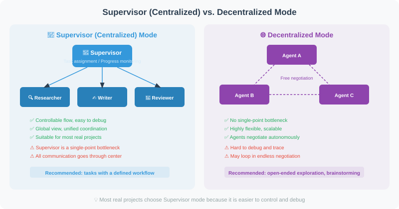
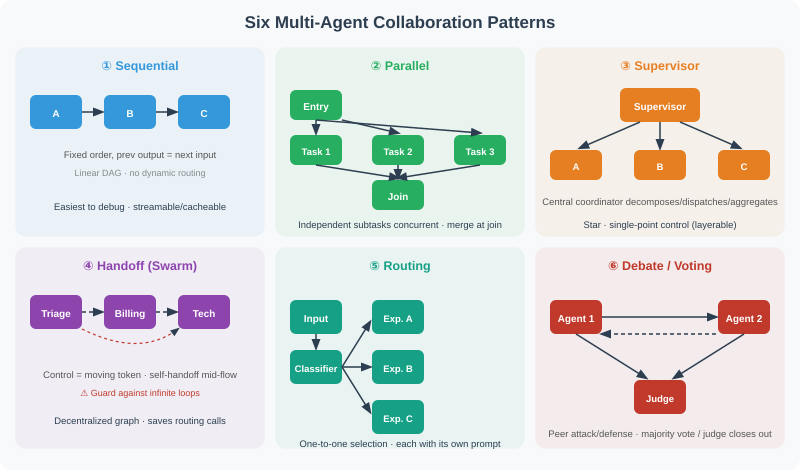

# 18.4 Supervisor Mode vs. Decentralized Mode

Multi-Agent systems face a fundamental architectural decision: **who coordinates?** Should you set up a "project manager" to centrally schedule all Agents (Supervisor mode), or let Agents negotiate freely with each other (decentralized mode)?

Both modes have their pros and cons. Most real-world projects choose Supervisor mode because it's easier to control and debug. This section compares the two approaches with complete code examples.



## The Big Picture First: Six Collaboration Patterns

Supervisor vs decentralized is really only **two** of the six multi-Agent collaboration patterns. The six that have settled out of production practice by 2026 are below; this section focuses on two of them, with the rest covered elsewhere in the book:



| Pattern | Topology | Who coordinates | One-line scenario | Book location |
|------|------|---------|-----------|---------|
| **Sequential pipeline** | Linear DAG | None (fixed order) | Fixed stages, previous output feeds next input | 18.5 Practice |
| **Parallel** | Fan-out / fan-in | A join point merges results | N independent subtasks run at once | 18.1 |
| **Supervisor hierarchy** | Star | Central coordinator | Decomposable tasks needing unified scheduling | **This section** |
| **Handoff (Swarm)** | Decentralized graph | Moving token (whoever holds the conversation decides) | Experts dynamically decide "switch to someone else" mid-flow | **This section** |
| **Routing** | One-to-one | Classifier (rules / small model) | Inputs fall into distinct categories, each with its own prompt | 18.3 Dynamic assignment |
| **Debate / Voting** | Peer-to-peer | Judge / majority | Decisions needing disagreement convergence | 18.2 |

> 💡 **Core mental model**: these six patterns are not mutually exclusive — they are **nestable, composable** building blocks. A Supervisor can fan out in Parallel internally; a link in a Handoff chain can hang another Supervisor. The architect's job is "pick the building block by the task's true structure," not "pick one pattern and use it everywhere."

## Supervisor (Centralized) Mode

The Supervisor mode works like project management: a Supervisor Agent is responsible for analyzing tasks, assigning subtasks, monitoring progress, and aggregating results. All decisions are coordinated through the Supervisor.

The following example builds a "content creation team" — the Supervisor coordinates three sub-Agents: a researcher, a writer, and a reviewer:

```python
from langgraph.graph import StateGraph, END, START
from langgraph.prebuilt import create_react_agent
from langchain_openai import ChatOpenAI
from langchain_core.tools import tool
from typing import TypedDict, Annotated, Literal
import operator

llm = ChatOpenAI(model="gpt-4o")

# ============================
# Define tools for each sub-Agent
# ============================

@tool
def do_research(topic: str) -> str:
    """Research specialist: in-depth research on a specified topic"""
    from openai import OpenAI
    client = OpenAI()
    response = client.chat.completions.create(
        model="gpt-4o-mini",
        messages=[{"role": "user", "content": f"Research {topic} and provide 3 core insights"}],
        max_tokens=200
    )
    return response.choices[0].message.content

@tool
def write_content(outline: str) -> str:
    """Writing specialist: write content based on an outline"""
    from openai import OpenAI
    client = OpenAI()
    response = client.chat.completions.create(
        model="gpt-4o-mini",
        messages=[{"role": "user", "content": f"Write a 300-word article based on this outline: {outline}"}],
        max_tokens=400
    )
    return response.choices[0].message.content

@tool
def review_content(content: str) -> str:
    """Review specialist: check content quality"""
    from openai import OpenAI
    client = OpenAI()
    response = client.chat.completions.create(
        model="gpt-4o-mini",
        messages=[{"role": "user", "content": f"Review the following content (score + suggestions): {content[:200]}"}],
        max_tokens=150
    )
    return response.choices[0].message.content

# Supervisor Agent has access to all tools
supervisor_tools = [do_research, write_content, review_content]
supervisor_agent = create_react_agent(llm, supervisor_tools)

# ============================
# Supervisor decision logic
# ============================

class SupervisorState(TypedDict):
    messages: Annotated[list, operator.add]
    task: str
    research_done: bool
    content_written: bool
    review_done: bool

def supervisor(state: SupervisorState) -> dict:
    """Supervisor: centrally coordinates all subtasks"""
    from langchain_core.messages import HumanMessage, SystemMessage
    
    context = f"""
You are a task coordinator managing a content creation team.
Available tools: do_research, write_content, review_content

Task: {state['task']}
Research complete: {state.get('research_done', False)}
Writing complete: {state.get('content_written', False)}
Review complete: {state.get('review_done', False)}

Analyze the current progress and decide the next step:
1. If research is not done → use do_research
2. If research is done but writing is not → use write_content
3. If writing is done but review is not → use review_content
4. If everything is done → summarize and finish

Current message history (to get previous outputs):
{[m.content if hasattr(m, 'content') else str(m) for m in state.get('messages', [])[-3:]]}
"""
    
    result = supervisor_agent.invoke({
        "messages": [HumanMessage(content=context)]
    })
    
    last_msg = result["messages"][-1]
    content = last_msg.content if hasattr(last_msg, 'content') else ""
    
    # Update state
    updates = {"messages": [last_msg]}
    if "research" in content.lower():
        updates["research_done"] = True
    if "write" in content.lower() or "article" in content.lower():
        updates["content_written"] = True
    if "review" in content.lower():
        updates["review_done"] = True
    
    return updates

def should_continue(state: SupervisorState) -> str:
    if state.get("review_done"):
        return "end"
    return "continue"

# Build Supervisor graph
graph = StateGraph(SupervisorState)
graph.add_node("supervisor", supervisor)
graph.add_edge(START, "supervisor")
graph.add_conditional_edges(
    "supervisor",
    should_continue,
    {"end": END, "continue": "supervisor"}
)

supervisor_app = graph.compile()

# Run
result = supervisor_app.invoke({
    "messages": [],
    "task": "Write a technical article about Python asynchronous programming",
    "research_done": False,
    "content_written": False,
    "review_done": False
})

print("Final state:")
print(f"  Research complete: {result['research_done']}")
print(f"  Writing complete: {result['content_written']}")
print(f"  Review complete: {result['review_done']}")
```

## Decentralized Mode

Unlike Supervisor mode, decentralized mode has no central coordinator. Each Agent has its own inbox and communicates directly with other Agents via broadcast or point-to-point messages. This mode is more like a self-organizing team — members discuss freely and decide among themselves who does what.

The advantage is no single point of failure and high flexibility; the disadvantage is high coordination costs and the potential for conflicts or deadlocks.

```python
# Decentralized: Agents negotiate directly with each other, no central coordinator

class PeerToPeerNetwork:
    """Peer-to-peer Agent network"""
    
    def __init__(self):
        self.agents = {}
        self.message_board = {}  # Shared message board
    
    def add_agent(self, name: str, specialization: str):
        self.agents[name] = {
            "name": name,
            "specialization": specialization,
            "inbox": [],
        }
    
    def broadcast(self, sender: str, message: str, target: str = "all"):
        """Broadcast a message"""
        if target == "all":
            for name, agent in self.agents.items():
                if name != sender:
                    agent["inbox"].append({
                        "from": sender,
                        "message": message
                    })
        else:
            if target in self.agents:
                self.agents[target]["inbox"].append({
                    "from": sender,
                    "message": message
                })
    
    def process_inbox(self, agent_name: str) -> list[str]:
        """Process inbox"""
        agent = self.agents[agent_name]
        messages = agent["inbox"].copy()
        agent["inbox"].clear()
        return [m["message"] for m in messages]

# Usage example
network = PeerToPeerNetwork()
network.add_agent("research", "Information research")
network.add_agent("writing", "Content writing")
network.add_agent("editing", "Article editing")

# Agents communicate directly with each other, self-organizing to complete tasks
# This mode is more flexible but also harder to control
```

## Handoff Mode: The Modern Practice of Decentralization

Pure "broadcast + inbox" decentralization has a fatal flaw: **who decides the next step?** After a broadcast, every Agent receives the message, but no one leads the closure — easy to fall into "everyone watching, no one acting." OpenAI's Swarm experiment (late 2024, later upgraded to the production-grade **OpenAI Agents SDK**) introduced a more practical decentralized form — **Handoff**: treat "control" as a **moving token**; the Agent currently holding the conversation decides "time to switch," and hands the whole conversation (with accumulated context) to the next Agent via a **tool call**.

```python
def handoff(target_agent):
    """Handoff tool: the current Agent calls it to transfer control and context.

    Why make handoff a tool rather than framework scheduling: letting the Agent
    decide when to hand off avoids the Supervisor's per-step routing call, and
    allows an Agent to self-correct mid-task when it realizes it's the wrong
    specialist — something a Supervisor can't do (a Supervisor only decides at
    node boundaries).
    """
    def transfer(context: str) -> str:
        # Key: pass accumulated context along so the conversation stays coherent
        return target_agent(context)
    transfer.__name__ = f"handoff_to_{target_agent}"
    transfer.__doc__ = f"Hand the current conversation over to {target_agent}"
    return transfer

# Customer-service scenario: triage Agent -> billing / technical / refunds
def triage_agent(context):
    """Triage: judge which category the question falls into, then hand off"""
    if "billing" in context or "refund" in context:
        return handoff(billing_agent)(context)
    elif "technical" in context or "error" in context:
        return handoff(tech_agent)(context)
    return "Please describe whether your issue is billing, technical, or other."
```

The essential difference between Handoff and Supervisor:

| Dimension | Supervisor | Handoff |
|------|-----------|---------|
| Decision point | Central coordinator decides at **node boundaries** | Current Agent self-decides **mid-conversation** |
| Routing cost | Pays a supervisor routing call every step | Handoff is one tool call in the active loop, cheaper |
| Traceability | Single thread, easy to trace | Becomes a directed handoff graph, harder to trace |
| Typical risk | Supervisor misroutes -> global failure | **Infinite handoff loop** (A→B→A→B) or ambiguous ownership of the final answer |

> ⚠️ **Handoff's #1 trap: infinite handoff loops.** A hands to B, B hands back to A, looping and burning tokens. In engineering you must set a **handoff count cap** (e.g. `max_handoffs=5`) and force closure beyond it. This echoes the "bounded retry" idea from 18.3: **every loop needs an upper bound**.

## Hierarchical Supervision (Supervisor-of-Supervisors)

When specialist Agents exceed roughly 10, a single Supervisor's tool list becomes too bloated to route well. At that point you need **layering**: the top-level Supervisor only routes to "sub-supervisors" (billing, technical, engineering sub-domains), each managing its own specialist pool.

```text
Top-level Supervisor (ops)
├── Billing Supervisor ── refund / invoice / ...
├── Technical Supervisor ── triage / consult / ...
└── Engineering Supervisor ── review / deploy / ...
```

> 💡 **Use sparingly**: hierarchical supervision is **rarely the right starting point** — every layer doubles the "routing-overhead tax" and makes failure attribution harder. Only consider it when specialists truly exceed 10, or different sub-domains need different routing policies. Otherwise a flat Supervisor with router-style tool selection is simpler.

## Split-Brain and Consistency: The Hidden Cost of Decentralization

The subtlest problem of decentralized mode is **split-brain** — two Agents write the same shared state (a shared document, a shared task queue, a shared scratchpad) simultaneously, each believing it is the "single source of truth," overwriting each other's results. This is the same disease as split-brain in distributed databases.

```python
# Split-brain example: two Agents update "current progress" simultaneously,
# later write overwrites earlier write
# Agent A writes progress="step 1 done"  ->  overwritten by Agent B's
# progress="step 2 done"
# Result: step 1's work is lost, and nobody notices (no conflict detection)
```

Three solutions (a continuation of 18.2's shared-state conflict resolution):

| Solution | Idea | Cost |
|------|------|------|
| **Single writer** | Only one Agent can write a field at a time (Supervisor mode has this naturally) | Sacrifices parallelism |
| **CRDT** | Conflict-free replicated data types (counters, OR-Sets) auto-merge concurrent writes | Only for commutative operations |
| **Explicit conflict rules** | Writes carry versions; on conflict, adjudicate by predefined rule (e.g. "newest timestamp wins") | Must design the adjudication logic |

> 🔑 **Core conclusion**: decentralization's "flexibility" has a price — it pushes "who has the final say" from the architecture layer down to the **state-consistency layer**. If shared state is designed poorly, decentralization loses data silently more easily than Supervisor. **Production advice**: unless you have explicit CRDTs or conflict rules, critical shared-state fields should fall back to single-writer (Supervisor or locking).

## Comparison of the Two Modes

```
Supervisor (Centralized):
✅ Easy to coordinate and control
✅ Global view, avoids duplicate work
✅ Easy to debug and monitor
❌ Supervisor becomes a bottleneck
❌ If Supervisor fails, everything fails

Decentralized:
✅ No single point of failure
✅ Highly flexible, adaptive
✅ Closer to real team collaboration
❌ High coordination costs
❌ May produce conflicts or deadlocks
❌ Difficult to debug

Recommendations:
- Most production scenarios → Supervisor mode
- High fault tolerance required → Decentralized
- Clear task boundaries → Supervisor is more suitable
```

## Summary

In the global view of the six collaboration patterns (Sequential / Parallel / Supervisor / Handoff / Routing / Debate), this section compared two orchestration paradigms in depth:

- **Supervisor (Centralized) Mode**: a central coordinator schedules everything, with a global view, easy to coordinate and monitor, suited to clear task boundaries and strict control. The cost: the Supervisor becomes a single-point bottleneck, and too many specialists require **hierarchical supervision** (use sparingly — routing tax doubles).
- **Handoff (Decentralized, modern form)**: control as a moving token; the current Agent self-decides mid-conversation, avoiding per-step routing calls. The cost: control flow becomes a hard-to-trace directed graph, prone to **infinite handoff loops** — a handoff cap is mandatory.

**Two engineering iron rules**:
1. **Every loop needs an upper bound** — Supervisor state checks, Handoff counts, decentralized message rounds, all need caps.
2. **Decentralization pushes "who has the final say" to the state-consistency layer** — critical shared-state fields need single-writer, CRDT, or explicit conflict rules; otherwise you silently lose data (split-brain).

**Practical recommendation**: most production projects prefer Supervisor (controllable, debuggable); only introduce Handoff/decentralization when you need high fault tolerance, a very large Agent count, or specialists that must switch mid-task.

---

*Next section: [18.5 Practice: Multi-Agent Software Development Team](./05_practice_dev_team.md)*
