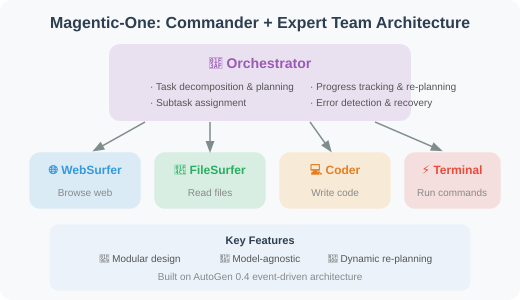
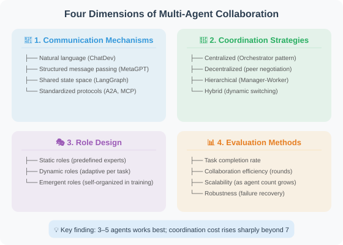
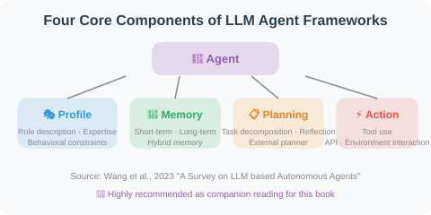
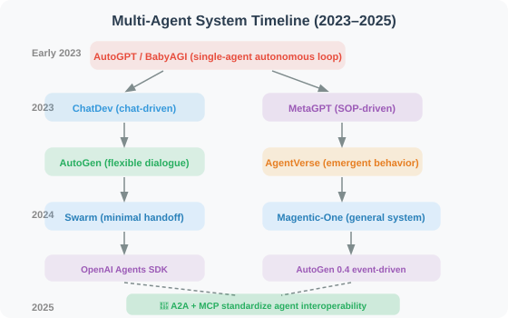
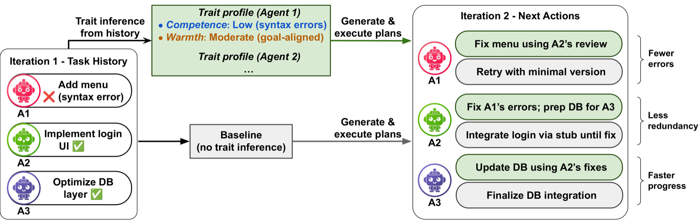
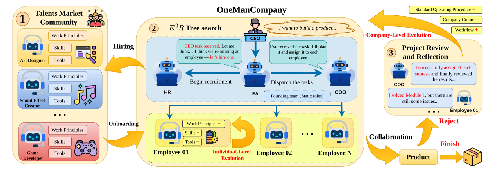
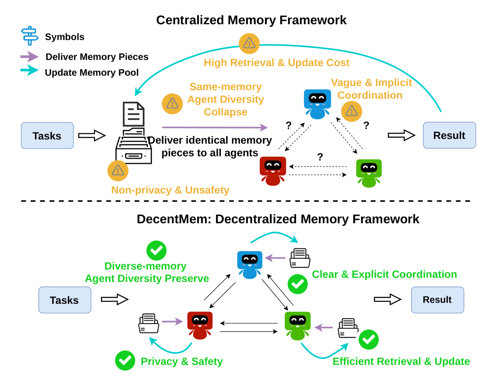
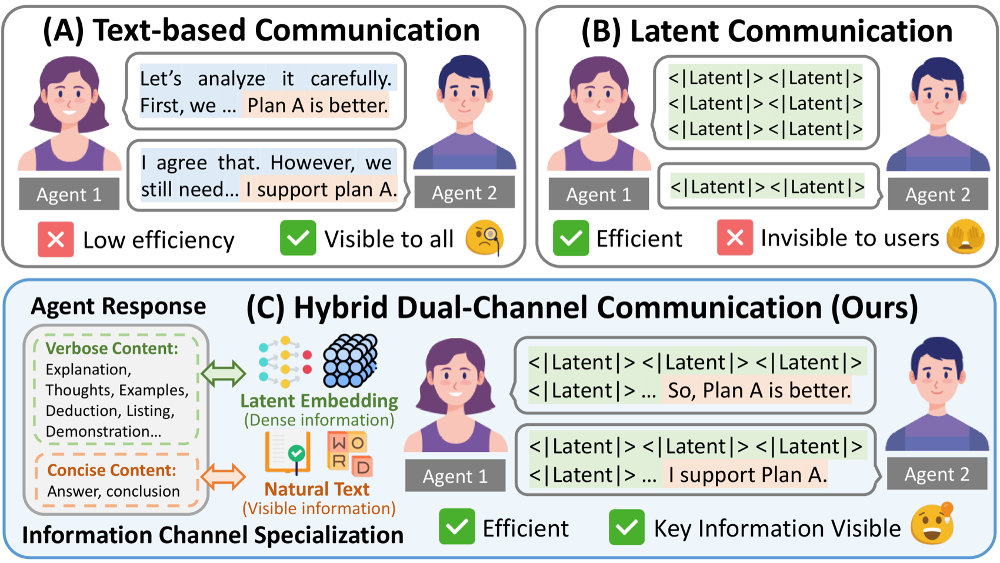
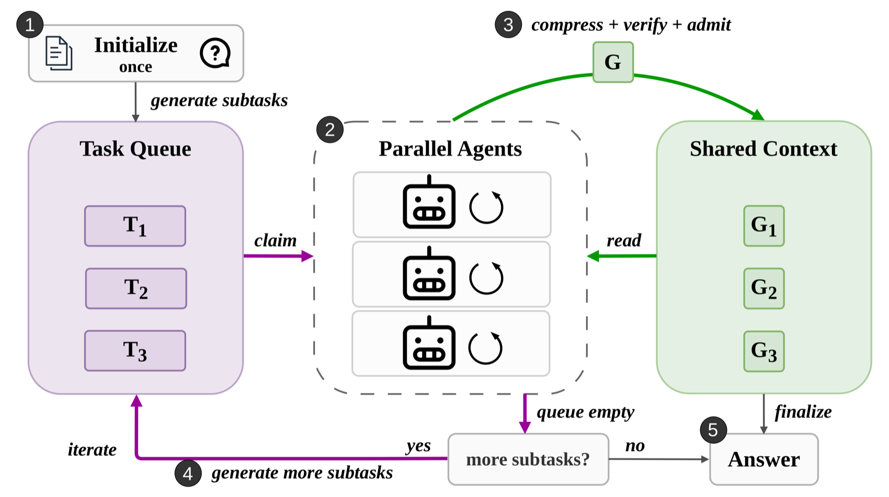

# 18.6 Paper Reading: Frontiers in Multi-Agent Systems

> 📖 *"One person walks fast; a group of people walks far. Multi-Agent systems are the most active direction in Agent research."*  
> *This section provides an in-depth reading of core papers in the field of multi-Agent collaboration.*

---

## MetaGPT: Multi-Agent Collaboration Constrained by SOPs

**Paper**: *MetaGPT: Meta Programming for A Multi-Agent Collaborative Framework*  
**Authors**: Hong et al.  
**Published**: 2023 | ICLR 2024 Oral | [arXiv:2308.00352](https://arxiv.org/abs/2308.00352)

### Core Problem

What problems arise in information transfer when multiple Agents communicate freely in natural language?
- **Information loss**: Details are dropped when Agent A's requirements are relayed from B to C
- **Misunderstanding**: Each Agent may interpret the same sentence differently
- **Inefficiency**: A lot of "small talk" between Agents produces no useful information

### Core Insight

**Multi-Agent systems need SOPs (Standard Operating Procedures) to constrain collaborative behavior.**

MetaGPT simulates a real software company, defining clear roles and workflows:

| Role | Output Artifact |
|------|---------|
| 📋 Product Manager | PRD document (Product Requirements Document) |
| 🏗️ Architect | System design document + interface definitions |
| 📅 Project Manager | Task assignment + development plan |
| 💻 Engineer | Code files |
| 🧪 QA Engineer | Test cases + test report |

> 📌 Each role hands off in sequence; the upstream output is the downstream input — **structured artifact transfer** is MetaGPT's core innovation.

### Key Innovation: Structured Artifact Transfer

MetaGPT's Agents don't pass loose natural language messages — they pass **structured artifacts (Artifacts)**:

```
❌ Loose chat messages:
  Product Manager: "We need a weather query feature — it should be able to check
                    Beijing's weather, make the UI look nice, add a chart..."

✅ Structured PRD document:
  {
    "product_name": "Weather Query System",
    "feature_list": [
      {"name": "City weather query", "priority": "P0", "description": "..."},
      {"name": "Weather trend chart", "priority": "P1", "description": "..."}
    ],
    "technical_requirements": ["Python 3.10+", "FastAPI", "..."],
    "api_interfaces": [{...}]
  }
```

### Experimental Results

On the SoftwareDev benchmark:
- **MetaGPT code execution success rate: 87%**
- ChatDev code execution success rate: 44%
- The large gap in success rates is mainly attributed to structured communication reducing information loss

### Lessons for Agent Development

1. **Structured communication > natural language communication**: Passing structured data between Agents is more reliable than natural language
2. **The value of SOPs**: Defining clear workflows prevents chaotic collaboration between Agents
3. **Role-based prompts**: Each Agent's System Prompt should clearly define role responsibilities and output format

---

## ChatDev: Software Development Driven by Chat Chains

**Paper**: *Communicative Agents for Software Development*  
**Authors**: Qian et al.  
**Published**: 2023 | [arXiv:2307.07924](https://arxiv.org/abs/2307.07924)

### Core Idea

ChatDev simulates the organizational structure of a software company, but uses a different communication method from MetaGPT — **Chat Chains**:

> The development process is broken into multiple phases: Design phase → Coding phase → Testing phase → Documentation phase
>
> Each phase involves only two Agents in dialogue: Design phase CEO ↔ CTO; Coding phase CTO ↔ Programmer; Testing phase Programmer ↔ Tester; Documentation phase CEO ↔ Programmer

### Inception Prompting

ChatDev uses a technique called **"Inception Prompting"** to guide the conversation in each phase:

> At the start of each chat phase, both Agents receive:
> 1. Role description: "You are the CTO, responsible for selecting the technical solution..."
> 2. Phase goal: "The goal of this phase is to determine the programming language and framework to use"
> 3. Output format: "At the end of the conversation, please summarize the technology selection"
> 4. Prior information: The output from the previous phase

### Comparison with MetaGPT

| Dimension | MetaGPT | ChatDev |
|-----------|---------|---------|
| Communication method | Structured artifacts (shared message pool) | Two-person chat chain |
| Collaboration pattern | Publish-subscribe | Pairwise dialogue |
| Advantage | More precise information transfer | Simpler and more intuitive design |
| Code success rate | 87% | 44% |
| Design philosophy | Engineering, process-oriented | Social, conversation-oriented |

### Lessons for Agent Development

ChatDev's design of **"only two Agents dialogue per phase"** reduces the complexity of multi-Agent coordination — the communication complexity of N fully connected Agents is O(N²), while pairwise dialogue reduces it to O(N). In practice, if the number of Agents is small (< 5), pairwise dialogue may be easier to debug than a complex shared state.

---

## AutoGen: Conversable Agent Framework

**Paper**: *AutoGen: Enabling Next-Gen LLM Applications via Multi-Agent Conversation*  
**Authors**: Wu et al., Microsoft Research  
**Published**: 2023 | [arXiv:2308.08155](https://arxiv.org/abs/2308.08155)

### Core Abstraction: Conversable Agent

AutoGen proposes the abstraction of "Conversable Agent" — each Agent is an independent conversation participant:

```python
# AutoGen's core abstraction (conceptual illustration)
class ConversableAgent:
    """Each Agent can converse with other Agents or humans"""
    
    def __init__(self, name, system_message, llm_config):
        self.name = name
        self.system_message = system_message
    
    def generate_reply(self, messages):
        """Generate a reply based on received messages"""
        ...
    
    def receive(self, message, sender):
        """Receive a message from another Agent or human"""
        ...
    
    def initiate_chat(self, recipient, message):
        """Initiate a conversation with another Agent"""
        ...
```

### Three Predefined Agent Types

```
1. AssistantAgent (AI assistant)
   - Driven by LLM
   - Generates replies based on conversation history

2. UserProxyAgent (user proxy)
   - Represents a human user
   - Can execute code, request human input
   - Key to Human-in-the-Loop

3. GroupChatManager (group chat manager)
   - Manages group conversations among multiple Agents
   - Decides which Agent speaks next
```

### Human-in-the-Loop

AutoGen particularly emphasizes human participation — humans can join multi-Agent conversations at any time to provide feedback or correct direction:

```
Agent A: "I think we should use React to build the frontend..."
Agent B: "Agreed, React's ecosystem is more mature..."
Human:   "Wait, our project requires Vue.js. Please reconsider."
Agent A: "Understood, then let's use Vue 3 + Composition API..."
```

### Lessons for Agent Development

1. **Flexible conversation patterns**: Agents can communicate one-on-one, one-to-many, in group chats, and more
2. **Code execution capability**: UserProxyAgent can execute code locally, which is very important for programming tasks
3. **The importance of human participation**: Fully autonomous multi-Agent systems may go off track; timely human intervention is crucial

---

## AgentVerse: Emergent Behaviors in Multi-Agent Systems

**Paper**: *AgentVerse: Facilitating Multi-Agent Collaboration and Exploring Emergent Behaviors*  
**Authors**: Chen et al.  
**Published**: 2023 | [arXiv:2308.10848](https://arxiv.org/abs/2308.10848)

### Core Problem

When multiple Agents interact freely, what **emergent behaviors** appear? Are these behaviors good or bad?

### Discovered Emergent Behaviors

```
Positive emergence:
✅ Complementary enhancement: different Agents fill each other's knowledge gaps
✅ Quality improvement: solutions after multi-Agent discussion are better than any single Agent's
✅ Creative combination: collision of different perspectives generates new solutions

Negative emergence:
❌ Group polarization: majority opinions are amplified; minority views are ignored
❌ Social loafing: some Agents "free-ride" in groups without contributing valuable content
❌ Information cascade: the first Agent's opinion excessively influences subsequent Agents
```

### Dynamic Role Adjustment

AgentVerse proposes a **dynamic role adjustment mechanism**: dynamically adding or removing Agent roles during collaboration based on task needs, rather than using a fixed predefined team configuration.

### Lessons for Agent Development

1. **Pay attention to group dynamics**: Multi-Agent system design must consider not just individual Agents but also group behavior
2. **Speaking order matters**: The first Agent to speak may excessively influence the outcome — consider introducing randomness
3. **Independent thinking → discussion → voting**: Have each Agent think independently first, then discuss, then vote to decide

---

## Magentic-One: A General-Purpose Multi-Agent System

**Paper/Technical Report**: *Magentic-One: A Generalist Multi-Agent System for Solving Complex Tasks*  
**Authors**: Fourney et al., Microsoft Research  
**Published**: November 2024 | [arXiv:2411.04468](https://arxiv.org/abs/2411.04468)

### Core Problem

Previous multi-Agent systems (MetaGPT, ChatDev) mostly focused on the specific domain of **software development**. Can we build a **general-purpose** multi-Agent system that handles various complex tasks like a team of human experts?

### Architecture Design

Magentic-One uses a **"Commander + Expert Team"** architecture:



### Experimental Results

| Benchmark | Task Type | Magentic-One Performance |
|-----------|----------|------------------------|
| GAIA | General AI assistant | Near human level |
| AssistantBench | Complex web tasks | State-of-the-art at the time |
| WebArena | Web interaction | Competitive performance |

### Lessons for Agent Development

1. **Effectiveness of the Orchestrator pattern**: A dedicated coordinator Agent is more reliable than "Agents discussing freely"
2. **Error recovery is key**: Approximately 30% of Magentic-One's successes come from dynamic re-planning during execution
3. **Built on AutoGen**: Demonstrates the engineering capability of AutoGen 0.4's event-driven architecture

---

## OpenAI Swarm: Lightweight Multi-Agent Orchestration

**Project**: *Swarm: Educational Framework for Ergonomic, Lightweight Multi-Agent Orchestration*  
**Authors**: OpenAI Solutions Team  
**Released**: October 2024 | [github.com/openai/swarm](https://github.com/openai/swarm)

### Core Philosophy

Unlike heavyweight frameworks like MetaGPT and AutoGen, Swarm pursues **minimalism** — using only two core concepts:

```python
# Concept 1: Agent = instructions + tools
agent_a = Agent(
    name="Sales Advisor",
    instructions="You are a friendly sales advisor...",
    functions=[check_inventory, get_price]
)

# Concept 2: Handoff = transfer between Agents
def transfer_to_support():
    """Hand off to the technical support Agent when the user needs technical support"""
    return agent_b  # Returning another Agent completes the handoff

agent_a = Agent(
    name="Sales Advisor",
    functions=[check_inventory, transfer_to_support]  # handoff is a regular function
)
```

### Design Philosophy

```
Heavyweight frameworks (AutoGen, CrewAI):
  - Rich abstractions (roles, tasks, processes)
  - Built-in state management and memory
  - Suitable for complex multi-Agent workflows
  
Swarm's minimalist philosophy:
  - Agent = instructions + functions
  - Handoff = return another Agent
  - No state management (stateless, each call is independent)
  - Suitable for simple routing and handoff scenarios
```

### Relationship with OpenAI Agents SDK

Swarm is an **educational experimental framework** (not recommended for production use), but its core concepts — **Handoff (Agent transfer) and Routines** — were inherited by the **OpenAI Agents SDK** released in 2025, which is the official framework for production environments.

### Lessons for Agent Development

1. **Simple is better than complex**: Not every scenario needs AutoGen or CrewAI; simple routing and handoffs can be handled with the Swarm pattern
2. **Handoff is the primitive of multi-Agent collaboration**: Transfers between Agents can be implemented with regular function calls
3. **OpenAI's Agent direction**: From Swarm to Agents SDK, reflecting the design philosophy of "minimal + composable"

---

## Multi-Agent Collaboration Survey (2025)

**Paper**: *Multi-Agent Collaboration Mechanisms: A Survey of LLMs*  
**Authors**: Nguyen et al., University College Cork & Pusan National University  
**Published**: January 2025 | [arXiv:2501.06322](https://arxiv.org/abs/2501.06322)

### Core Contribution

This is the most comprehensive survey of multi-Agent collaboration mechanisms as of early 2025, systematically organizing four dimensions of collaboration:



### Key Findings

1. **Structured communication significantly outperforms natural language communication**: MetaGPT's success validates this
2. **Orchestrator mode is most reliable in most scenarios**: But for creative tasks, decentralized discussion may produce better results
3. **There is a "sweet spot" for Agent count**: Usually 3–5 Agents works best; coordination costs rise sharply beyond 7
4. **Standardized protocols are the trend**: A2A and MCP are changing how Agents interoperate

---

## Comprehensive Survey

**Paper**: *A Survey on Large Language Model based Autonomous Agents*  
**Authors**: Wang et al., Gaoling School of Artificial Intelligence, Renmin University of China  
**Published**: 2023 | [arXiv:2308.11432](https://arxiv.org/abs/2308.11432)

This is currently the most comprehensive survey paper on LLM Agents, systematically organizing the four major components of Agents:



> 💡 **Strongly recommended as companion reading for this book**, especially when reading chapters related to multi-Agent systems.

---

## Paper Comparison and Development Timeline

| Paper | Year | Communication Mode | Agent Count | Core Contribution |
|-------|------|-------------------|------------|------------------|
| MetaGPT | 2023 | Structured artifacts | 5 | SOP + structured communication |
| ChatDev | 2023 | Two-person chat chain | 4–6 | Chat chain phased collaboration |
| AutoGen | 2023 | Free conversation | 2+ | Conversable Agent abstraction |
| AgentVerse | 2023 | Group discussion | 3+ | Emergent behavior research |
| **Swarm** | **2024** | **Handoff transfer** | **2+** | **Minimal multi-Agent orchestration** |
| **Magentic-One** | **2024** | **Orchestrator command** | **5** | **General-purpose multi-Agent system** |
| **Collaboration Survey** | **2025** | **Systematic classification** | **—** | **Four-dimension collaboration mechanism analysis** |

**Development timeline**:



> 💡 **Frontier trends (2025–2026)**: Multi-Agent systems are shifting from "framework competition" to "protocol standardization." Three major trends: ① **Orchestrator mode dominates**: Both Magentic-One and OpenAI Agents SDK adopt the "one coordinator + multiple experts" architecture; ② **Interoperability standardization**: Google's A2A and Anthropic's MCP protocols allow Agents built with different frameworks to collaborate with each other (see Chapter 16); ③ **Expanding from software development to general scenarios**: Broader multi-Agent applications in scientific research, business analysis, educational simulation, and more are emerging.

---

## 📰 Latest Paper Updates

> 🗓️ This section is maintained by a daily automated update task. Last updated: **August 5, 2026**

### [AgentGate: A Lightweight Structured Routing Engine for the Agent Internet (2026)](https://arxiv.org/abs/2604.06696)

> 🧬 **One-liner**: Reframe Agent routing from "unconstrained text generation" into a "constrained decision problem," split into action-decision + structured instantiation in two stages; even 3B–7B small models rival large models.

**Core Problem**: AI Agent systems are moving toward an "Agent Internet" — specialized Agents operating across local devices, edge nodes, private services, and cloud platforms. Although improvements have been made to Agent naming, discovery, and interaction, efficient request dispatch under latency, privacy, and cost constraints remains an open systems problem.

**Method**: AgentGate is a candidate-aware Agent dispatch routing engine that formalizes routing as a **constrained decision problem** rather than unconstrained text generation, decomposed into two stages: **action decision** (single-Agent invocation / multi-Agent planning / direct response / safety escalation) + **structured instantiation**. The framework architecture is shown below:


> Source: AgentGate paper (source: 2026, arXiv:2604.06696)

**Key Results**: On routing benchmarks, 3B–7B open-source models achieve performance competitive with large models, greatly reducing the orchestration cost of multi-Agent systems.

**Relevance to This Chapter**: Directly corresponds to the Orchestrator Pattern in Section 18.3 ("task dispatch and routing for Agents"), providing a candidate-aware alternative smarter than hand-written rule-based routing.

---

### [ETI: A Multi-Agent Coordination Method Based on Explicit Trait Inference along Psychological Dimensions (2026)](https://arxiv.org/abs/2604.19278)

> 🧬 **One-liner**: Let Agents infer partners' two-dimensional psychological traits — warmth (trust) and competence (skill) — from interaction history, and use them to guide decisions, cutting 45–77% of payoff loss.

**Core Problem**: LLM multi-Agent systems easily suffer coordination failures such as goal drift, error cascades, and behavior misalignment on complex tasks, lacking modeling of partner characteristics.

**Method**: ETI (Explicit Trait Inference) is a psychology-driven coordination improvement method that lets Agents infer and track partners' traits along two psychological dimensions — **warmth (e.g., trust)** and **competence (e.g., skill)** — from interaction history, and uses them to guide decisions. An illustration of how ETI improves coordination is shown below:



> Source: ETI paper (source: 2026, arXiv:2604.19278)

**Key Results**: Reduces **45–77%** of payoff loss in economic games, and improves **3–29%** over CoT baselines on the MultiAgentBench complex multi-Agent benchmark; the first work to systematically verify that LLM Agents can reliably infer others' traits from interaction history.

**Relevance to This Chapter**: Corresponds to the "multi-Agent coordination" topic of this chapter, providing a lightweight solution to improve coordination robustness through partner modeling without a central scheduler.

---

### [Predicting Scientific-Team Performance of Multi-Agent LLMs from Cooperative Traits (2026)](https://arxiv.org/abs/2604.20658)

> 🧬 **One-liner**: Use 6 behavioral-economics games to measure the cooperation propensity of 35 LLMs, finding that "game cooperation score" reliably predicts downstream performance of AI-for-Science multi-Agent teams.

**Core Problem**: LLM teams are increasingly used for collaborative scientific reasoning, requiring coordination under shared constraints (GPU, credit limits). Behavioral economics provides game tools that isolate different cooperation mechanisms, but whether models' behavior in these stylized scenarios predicts real collaborative task performance remains unknown.

**Method**: This paper benchmarks 35 open-source LLMs on 6 behavioral-economics games, extracts cooperation trait profiles, then examines whether these profiles predict downstream performance on AI-for-Science multi-Agent tasks (data analysis, modeling, scientific reporting). The behavioral profiles from the six games are shown below:


> Source: that paper (source: 2026, arXiv:2604.20658)

**Key Results**: Game-derived cooperation profiles robustly predict AI-for-Science downstream performance — under shared budget constraints, models that invest in team multiplicative effects (rather than greedy strategies) produce higher-quality scientific reports, with better accuracy, quality, and completion rates; and this cooperation propensity is an independently measurable attribute separate from general capability.

**Relevance to This Chapter**: Provides empirical evidence from a behavioral-economics perspective for the "multi-Agent collaboration mechanisms" of this chapter — when selecting LLMs to form a team, cooperation propensity is an independent dimension as important as intelligence level, and can serve as a low-cost pre-deployment diagnostic tool.

---

### [DiffMAS: End-to-End Multi-Agent Optimization Treating Inter-Agent Communication as a Learnable Component (2026)](https://arxiv.org/abs/2604.21794)

> 🧬 **One-liner**: Treat inter-Agent latent communication (internal representations in the KV Cache) as a learnable component; parameter-efficient supervised training lets Agents jointly learn how to encode/decode cross-interaction information.

**Core Problem**: Existing multi-Agent systems usually fix the text communication interface between Agents, only optimizing roles and orchestration logic; the communication itself is not learnable or optimizable.

**Method**: DiffMAS treats **latent communication** (passing information through internal representations such as the KV Cache) as a learnable component, applying parameter-efficient supervised training on multi-Agent latent trajectories so Agents jointly learn how to encode and decode cross-interaction information.

**Key Results**: Achieves **26.7%** and **20.2%** improvements on AIME24 and GPQA-Diamond respectively, outperforming single-Agent reasoning and text-based multi-Agent approaches.

**Relevance to This Chapter**: Directly corresponds to the "Agent communication protocol" knowledge point of this chapter; it is a frontier exploration of upgrading multi-Agent communication from "engineering convention" to "end-to-end learnable," offering important reference value for designing next-generation efficient Agent collaboration frameworks.

---

### [OneManCompany: A Scalable Framework Organizing Multi-Agent Systems as a Real Company (2026)](https://arxiv.org/abs/2604.22446)

> 🧬 **One-liner**: Add an "organization layer" to multi-Agent systems — skills/tools wrapped as portable Talent identities, a talent market recruits on demand, and E²R tree search unifies planning/execution/evaluation.

**Core Problem**: Single-Agent capability has advanced rapidly through modular skills and tool integration, but multi-Agent systems remain limited by fixed team structures, tightly coupled coordination logic, and in-session learning — lacking a principled "organization layer" to govern the formation, governance, and continuous improvement of Agent labor.

**Method**: OMC elevates multi-Agent systems to the organizational level — wrapping skills, tools, and runtime configuration as portable **Talent identities**, abstracting heterogeneous backends through typed organizational interfaces; a "talent market" supports on-demand recruitment, allowing dynamic filling of capability gaps during execution; the core decision mechanism **E²R (Explore-Execute-Review) tree search** integrates task planning, execution, and evaluation into a single hierarchical loop, with formal guarantees of termination and deadlock-freedom. The organization overview is shown below:



> Source: OneManCompany paper (source: 2026, arXiv:2604.22446)

**Key Results**: On PRDBench, surpasses the current best solution by **15.48 percentage points** with an **84.67%** success rate.

**Relevance to This Chapter**: Highly corresponds to the two core topics of "role assignment" and "supervisor vs. decentralized collaboration" in this chapter; OMC's "talent market + E²R decision loop" offers a new architectural paradigm for building sustainable, self-adaptive multi-Agent workflows.

---

### [RouteMoA: Dynamic Routing Without Pre-Inference, Efficiently Driving Multi-Model Mixture Collaboration (2026)](https://arxiv.org/abs/2601.18130)

> 🧬 **One-liner**: A lightweight scorer predicts coarse-grained scores before inference for initial filtering; a hybrid judge panel (self + peer evaluation) posterior-corrects; ranks by performance/cost/latency, cutting 89.8% cost.

**Core Problem**: Mixture-of-Agents (MoA) improves LLM performance through layered collaboration, but the dense topology raises cost and latency. Existing methods use an LLM judge to filter responses, yet still require all models to reason first and then judge — failing to truly cut cost; they also lack a model-selection criterion, and full inference over a large model pool is expensive and may exceed context.

**Method**: RouteMoA uses a lightweight **scorer** to predict each model's coarse-grained score before inference for initial filtering, shrinking candidates to a high-potential subset without reasoning; then uses a **hybrid judge panel** (self + peer evaluation) for posterior correction; finally ranks by the three factors of performance, cost, and latency. The architecture is shown below:


> Source: RouteMoA paper (source: 2026, arXiv:2601.18130)

**Key Results**: In large-scale model-pool scenarios, reduces cost by **89.8%** and latency by **63.6%** compared to standard MoA, while maintaining task performance gains.

**Relevance to This Chapter**: Directly corresponds to the core question of "how to route and select models efficiently" in this chapter's Mixture-of-Agents collaboration mode; it is a practical improvement over existing MoA frameworks.

---

*Back to: [Chapter 18: Multi-Agent Collaboration](./README.md)*

### [Reinforcement Learning for LLM Multi-Agent Systems Based on Orchestration Trajectories (2026)](https://arxiv.org/abs/2605.02801)

> 🧬 **One-liner**: A temporal interaction graph "trace view" unifies auditing of multi-Agent RL — expanding the optimization target from single-Agent actions to orchestration behaviors such as spawn/delegate/communicate/aggregate/terminate.

**Core Problem**: LLM Agents are evolving from isolated tool users into collaborative teams; RL must optimize not only individual actions but also how work is spawned, delegated, communicated, aggregated, and terminated — yet existing RL paradigms only track single-Agent action sequences, ignoring "orchestration behaviors."

**Method**: This paper studies multi-Agent system RL via a temporal interaction graph (trace view): events include sub-Agent spawn, delegation, communication, tool use, return, aggregation, and stop decisions. The trace view provides a common unit for auditing reward design, credit and signal assignment, and orchestration learning, and identifies three technical axes: reward design (eight families, with orchestration rewards targeting system-level properties like parallel speedup and decomposition correctness), credit assignment, and orchestration learning. Using orchestration trajectories as training signals, RL jointly optimizes single-Agent behavior and cross-Agent collaboration structure.

**Key Results**: Significantly outperforms rule-based orchestration on hierarchical multi-Agent tasks; the system learns when to dispatch subtasks and how to aggregate results.

**Relevance to This Chapter**: Corresponds to the multi-Agent collaboration patterns and task allocation of this chapter; it is an important new direction for bringing RL into the multi-Agent orchestration layer.

---

### [MASPO: Joint Prompt Optimization for LLM Multi-Agent Systems (2026)](https://arxiv.org/abs/2605.06623)

> 🧬 **One-liner**: Joint prompt optimization — evaluate each Agent's prompt not only by local performance but also by whether it enables downstream Agent success, navigating the high-dimensional prompt space with evolutionary beam search.

**Core Problem**: In LLM multi-Agent systems, each Agent is driven by role-specific prompts; prompt quality is critical. But optimizing a single Agent's prompt in isolation leads to misalignment between local objectives and the system's overall goal; jointly optimizing prompts across interacting Agents is a non-trivial challenge.

**Method**: MASPO automatically and iteratively refines system-wide prompts; its core innovation is the **joint evaluation mechanism** — evaluating a prompt not only by local effectiveness but also by its ability to enable downstream success; through data-driven **evolutionary beam search** it efficiently navigates the high-dimensional prompt space without manual annotation.

**Key Results**: Average accuracy improves by **2.9%** across 6 categories of multi-Agent tasks; accepted at ICML 2026.

**Relevance to This Chapter**: Corresponds to the prompt engineering and Agent role-assignment topics in this chapter's "multi-Agent collaboration design"; it is a frontier direction for end-to-end prompt optimization treating the multi-Agent system as a whole.

---

### [Byzantine-Tolerant Robust Multi-Agent LLM Systems (2026)](https://arxiv.org/abs/2605.09076)

> 🧬 **One-liner**: Self-Anchoring Consensus (SAC) protocol — Agents iteratively exchange responses, locally filter unreliable information, and refine output, resisting Byzantine faults without a central coordinator.

**Core Problem**: Decentralized multi-Agent LLM systems in peer-to-peer networks lack robustness guarantees under Byzantine faults (malicious nodes); existing methods rely on a central coordinator, making it hard to resist interference in decentralized scenarios.

**Method**: Proposes the **Self-Anchoring Consensus (SAC) protocol** — Agents iteratively exchange responses, locally filter unreliable information, and refine output, resisting malicious-node interference without a central coordinator; graph-theoretic conditions guarantee that honest Agents can still reach reliable consensus even when a majority of nodes are attacked. The SAC mechanism is shown below:


> Source: that paper (source: 2026, arXiv:2605.09076)

**Key Results**: Significantly outperforms existing methods on mathematical and commonsense reasoning tasks, maintaining reliable consensus even when a majority of nodes are attacked.

**Relevance to This Chapter**: Corresponds to the reliability and fault-tolerance design knowledge point of this chapter's multi-Agent systems; it is a secure coordination mechanism for decentralized Agent networks facing malicious or faulty nodes, providing theoretical and practical foundations for building production-grade robust multi-Agent systems.

---

### [MetaAgent-X: End-to-End Reinforcement Learning Breaking the Execution Ceiling of Automatic Multi-Agent Systems (2026)](https://arxiv.org/abs/2605.14212)

> 🧬 **One-liner**: End-to-end RL jointly trains Designer (generates MAS structure) and Executor (executes tasks), using GRPO for separate credit assignment + staged co-evolution, breaking the "frozen executor ceiling."

**Core Problem**: Automatic multi-Agent systems aim to instantiate workflows without manual orchestration, but existing methods are only partially adaptive — either test-time search without training, or optimizing a meta-level designer while freezing downstream execution Agents, creating a "frozen executor ceiling"; end-to-end training of self-designing, self-executing agentic models remains unexplored.

**Method**: MetaAgent-X is an end-to-end RL framework that jointly optimizes automatic MAS design and execution — supporting script-based MAS generation, execution rollout collection, and using GRPO to assign credit separately to design and execution trajectories; introduces a **staged co-evolution** strategy to ensure training stability. The end-to-end pipeline is shown below:


> Source: MetaAgent-X paper (source: 2026, arXiv:2605.14212)

**Key Results**: Achieves up to **21.7%** performance improvement on multiple benchmarks.

**Relevance to This Chapter**: Directly corresponds to Section 18.3, "Optimization and Learning of Multi-Agent Systems," showing the latest paradigm of using end-to-end RL to jointly optimize Agent architecture design and execution.

---

### [DecentMem: A Self-Evolving Multi-Agent System Driven by Decentralized Dual-Pool Memory (2026)](https://arxiv.org/abs/2605.22721)

> 🧬 **One-liner**: Each Agent independently maintains a dual-pool local memory (exploitation pool + exploration pool), with staged LLM-as-judge dynamic reweighting; theory guarantees global reachability and O(log T) regret.

**Core Problem**: Self-evolving multi-Agent systems are rooted in persistent memory, but nearly all existing designs use a cross-Agent shared centralized memory store, bringing communication and coordination overhead, privacy risks, and causing Agents to converge and lose diversity.

**Method**: DecentMem lets each Agent maintain its own **dual-pool memory** — an **exploitation pool** (stores solidified historical trajectories) and an **exploration pool** (LLM-generated candidates for unseen situations); the two pools are reweighted online based on staged LLM-as-judge feedback. Theoretically, it is proven that this design guarantees global reachability and cumulative regret of O(log T). The centralized vs. decentralized dual-pool comparison is shown below:



> Source: DecentMem paper (source: 2026, arXiv:2605.22721)

**Key Results**: Across three MAS frameworks (AutoGen, DyLAN, AgentNet) and multiple backbones (Qwen3/Gemma4), accuracy improves by up to **23.8%** and token usage drops by up to **49%**.

**Relevance to This Chapter**: Corresponds to the "multi-Agent memory and self-evolution" knowledge point of this chapter; it is the latest theoretical and empirical solution replacing centralized shared memory with a decentralized memory architecture, offering new ideas for privacy protection and efficiency in production-grade MAS.

---

### [HyLaT: Hybrid Latent-Text Communication Protocol — A Communication Efficiency Innovation for Multi-Agent Systems (2026)](https://arxiv.org/abs/2605.25421)

> 🧬 **One-liner**: A latent-space channel transmits fine-grained cognitive signals for efficiency; a natural-language channel transmits concise key signals for interpretability; two-stage training coordinates them, breaking the communication trilemma.

**Core Problem**: Multi-Agent communication protocol design is a core challenge. Single-channel approaches face the **communication trilemma**: text is interpretable but verbose, latent space is efficient but opaque and only supports one-way workflows.

**Method**: Inspired by multi-channel communication theory, HyLaT proposes a hybrid latent-text protocol — transmitting fine-grained cognitive signals through a **latent-space channel** (efficient) and expressing concise key signals in **natural language** (preserving interpretability and precision). It includes two-stage training: single-Agent hybrid generation learning + multi-Agent interactive co-training. The comparison with existing protocols is shown below:



> Source: HyLaT paper (source: 2026, arXiv:2605.25421)

**Key Results**: Significantly reduces communication overhead while maintaining task performance, showing strong generalization across diverse settings.

**Relevance to This Chapter**: Corresponds to this chapter's multi-Agent communication mechanism design; it is the latest fusion solution to the core contradiction of "language communication vs. latent-space communication," filling the gap of dual-channel communication theory in LLM multi-Agent systems.

---

### [Unified Temporal and Structural Credit Assignment — A New Paradigm for LLM Multi-Agent Prompt Optimization (2026)](https://arxiv.org/abs/2605.30227)

> 🧬 **One-liner**: Decompose multi-Agent trajectory attribution along the temporal axis (round-level credit) + structural axis (role-level credit) in two axes, using "verbalized block coordinate descent" to alternately optimize role prompts and aggregation protocols.

**Core Problem**: LLM multi-Agent systems can combine multi-role perspectives for complex reasoning, but are hard to debug and optimize — contributions vary across rounds and roles, and a few weak components dominate overall failure.

**Method**: This paper attributes completed multi-Agent trajectories: **temporally** assigning round-level credit to identify decision-critical stages and performance bottlenecks; **structurally** assigning role-level credit to quantify which Agents provide decisive information and which are redundant or misleading. Based on these credit signals, it introduces a credit-guided prompt optimization process that selectively refines weak links. The process overview is shown below:


> Source: that paper (source: 2026, arXiv:2605.30227)

**Key Results**: Significantly reduces query complexity while improving overall performance on multiple reasoning benchmarks.

**Relevance to This Chapter**: Directly corresponds to the multi-Agent system optimization and collaboration design knowledge points of this chapter; it is the first work to introduce temporal + structural two-axis credit decomposition into LLM-MAS prompt optimization, providing a principled, interpretable optimization path for self-improving multi-Agent systems.

---

### [MOC: Multi-Order Communication Mechanism for LLM-Based Multi-Agent Systems (2026)](https://arxiv.org/abs/2606.02359)

> 🧬 **One-liner**: Reframe inter-Agent communication from "first-order neighbor direct concatenation" into a structured multi-order evidence flow that captures multi-hop dependencies, with a semantic-topological merging algorithm to control tokens.

**Core Problem**: MAS research focuses on topology optimization, with insufficient study of "how messages are effectively transmitted between Agents." Existing solutions directly concatenate first-order neighbor responses, leading to a limited evidence reception field and dilution of key insights along multi-hop paths.

**Method**: MOC (Multi-Order Communication) reframes inter-Agent communication to capture multi-hop dependencies, and introduces a structured message-merging strategy for efficiency — formalizing communication as a multi-order evidence flow, using the **Semantic-Topological Merging** algorithm to optimize semantic fidelity under token constraints. The multi-order communication overview is shown below:


> Source: MOC paper (source: 2026, arXiv:2606.02359)

**Key Results**: Continuously improves task performance and reduces communication cost across six datasets and multiple LLM backbones of varying scales.

**Relevance to This Chapter**: Corresponds to the "multi-Agent communication and information transfer" knowledge point of this chapter; it is the latest empirical breakthrough on the core challenge of "how information propagates effectively across multiple hops in an Agent graph," directly revealing the importance of communication protocol design beyond topology design.

---

### [CCKS: A Consensus-Based Multi-Agent Communication and Knowledge Sharing Framework (2026)](https://arxiv.org/abs/2606.12281)

> 🧬 **One-liner**: Use contrastive learning to build a consensus model from local observations, letting Agents assess the applicability of teacher suggestions rather than accepting them unconditionally; plug-and-play integration of DTDE.

**Core Problem**: In decentralized training-decentralized execution (DTDE) collaborative MARL, action-suggestion-based knowledge sharing promotes interpretable, scalable cooperation, but existing methods over-follow teacher guidance without assessing teacher-student compatibility, leading to over-suggestion, suboptimal stability, and performance degradation.

**Method**: CCKS (Consensus-based Communication and Knowledge Sharing) introduces consensus constraints — Agents adopt suggestions based on consensus-derived constraints, following teacher instructions more intelligently: building a consensus model from local observations via contrastive learning, then assessing suggestion applicability rather than accepting unconditionally, absorbing useful experience while retaining exploration. Designed as a plug-and-play module that seamlessly integrates any DTDE algorithm.

**Key Results**: Significantly improves collaboration efficiency and learning speed in Google Research Football and the StarCraft II Multi-Agent Challenge (SMAC).

**Relevance to This Chapter**: Corresponds to the "multi-Agent collaboration mechanism" and "knowledge sharing" knowledge points of this chapter; it is the latest systematic answer to the key design problem of "consensus filtering" in teacher-student knowledge transfer, providing a scalable foundation for autonomous collaboration in decentralized multi-Agent systems.

---

### [DeLM: Decentralized Language Model — A Centralization-Free Multi-Agent Framework with Shared Context (2026)](https://arxiv.org/abs/2606.10662)

> 🧬 **One-liner**: Parallel Agents asynchronously pull from a task queue, use shared verified context as the communication substrate, and write back compact verified updates; three elements decentralized, cutting 50% cost.

**Core Problem**: MAS can scale LLM inference at test time by decomposing complex problems into parallel subtasks, but most rely on centralized orchestration — a master Agent allocates, collects, and merges, becoming a communication and integration bottleneck as subtasks grow.

**Method**: DeLM (Stanford, Azalia Mirhoseini's team) decentralizes through three elements: **parallel Agents** asynchronously pull subtasks from a task queue; **Shared Verified Context** serves as the communication substrate; after completing local inference, Agents write back **compact verified updates** to the shared context without going through a central controller. The shared context acts as a public communication substrate. The framework overview is shown below:



> Source: DeLM paper (source: 2026, arXiv:2606.10662, Stanford)

**Key Results**: Achieves the best Pass@1/Pass@2/Pass@4 on SWE-bench Verified, saving about **50%** in cost; on LongBench-v2 multi-document QA, surpasses the strongest baseline by up to **5.7 percentage points**.

**Relevance to This Chapter**: Corresponds to the "multi-Agent orchestration patterns" and "decentralized collaboration" knowledge points of this chapter; it is the latest empirical result of bringing the "blackboard architecture" idea into LLM multi-Agent systems, directly challenging the mainstream orchestration paradigm centered on a central controller.

---

### [Skill-MAS: An Evolutionary Meta-Skill-Driven Automatic Multi-Agent System (2026)](https://arxiv.org/abs/2606.18837)

> 🧬 **One-liner**: A third path — conceptualizing high-level orchestration capability as evolvable "meta-skills," decoupling experience retention from parameter updates, letting MAS self-improve continuously without changing LLM weights.

**Core Problem**: Automatic MAS generation faces a "capability-experience" dilemma: at inference time, MAS fully utilizes frozen frontier LLMs, but repeating the same search doesn't learn; at training time, MAS internalizes experience via gradient updates, yet is limited by small-model capability ceilings and hard to scale to large models.

**Method**: Skill-MAS proposes a third path — conceptualizing high-level orchestration capability as evolvable **meta-skills (Meta-Skill)**, decoupling experience retention from parameter updates. A closed optimization loop: ① multi-trajectory rollouts sample a behavior distribution per task; ② selective reflection adaptively picks priority tasks, performs hierarchical contrastive analysis, and distills systematic experience into generalizable policy-level principles. The MAS paradigm comparison is shown below:


> Source: Skill-MAS paper (source: 2026, arXiv:2606.18837)

**Key Results**: Achieves significant performance gains on four complex benchmarks and four LLMs; evolved meta-skills show strong transfer across unseen tasks and different LLMs.

**Relevance to This Chapter**: Corresponds to the "multi-Agent learning and self-optimization" knowledge point of this chapter; it is the latest result combining Skill Learning with MAS orchestration — meta-skills enable MAS to continuously self-improve without modifying LLM parameters, forming a complete picture of the current multi-Agent collaboration evolution together with DeLM (decentralized communication) and CCKS (knowledge sharing).

---

### [WebSwarm: A Recursive Multi-Agent Orchestration Framework for Deep-and-Broad Web Search (2026)](https://arxiv.org/abs/2607.08662)

**Published**: July 9, 2026 | [arXiv:2607.08662](https://arxiv.org/abs/2607.08662)

**Core Contribution**: A single ReAct-style search Agent is limited by a single long trajectory and limited context, making it hard to handle both search depth and coverage breadth simultaneously. WebSwarm proposes a **progressive recursive delegation framework**: jointly constructing task decomposition, recursive expansion, and Agent collaboration at inference time. Each search node couples a local goal with a search pattern, and can either solve the goal itself or delegate further sub-nodes; after solving, it returns evidence and results upward, enabling the parent node to further expand, revise, or aggregate. WebSwarm first probes how task-related information is organized on the web to guide subsequent node expansion, and reuses process-level experience among homogeneous sibling nodes. It consistently surpasses single-Agent and multi-Agent baselines on four benchmarks: BrowseComp-Plus, WideSearch, DeepWideSearch, and GISA.

**Relevance to This Chapter**: Corresponds to the "multi-Agent collaboration architecture" and "task decomposition and delegation" knowledge points of this chapter; WebSwarm's recursive delegation mechanism upgrades multi-Agent search from "parallel execution + aggregation" to "recursive depth expansion + evidence-driven collaboration," and is the latest framework evolving ReAct single-Agent into recursive multi-Agent search systems.

---

## 📝 Exercises

After reading this chapter, close the book and answer the questions in your own words first, then expand the reference answers to check.

**Exercise 1 (Concept)**: The chapter opening states that single Agents have three core limitations, hence the need to introduce multi-Agents; but the chapter also emphasizes that "multi-Agents are not a silver bullet." State what the three core limitations of single Agents are, and explain what costs the multi-Agent architecture pays in return. Finally give a judgment: "under what circumstances would you insist on using a single Agent rather than going multi-Agent?"

<details>
<summary>Reference Answer</summary>

**The three core limitations of single Agents:**
1. **Context window limit**: A single Agent's Context Window is limited (even 128K Tokens can be exhausted when analyzing something like 50,000 lines of code), so it can't fit all information in one call; batching hurts coherence.
2. **Professional knowledge boundary**: One Agent can hardly be an expert in multiple domains. A full-stack project needs frontend, backend, database, DevOps, and security expertise — a single Agent is only "average" in each.
3. **Lack of parallelism**: A single Agent is essentially serial. Five subtasks serially take 46 seconds; five Agents in parallel take only 12 seconds (bounded by the slowest).

**Costs paid by multi-Agents:**
- **Communication overhead**: Messages passed back and forth between Agents consume a lot of Tokens, directly raising cost and latency.
- **Coordination complexity**: Must handle conflicting opinions, ensure consistency, and may deadlock.
- **Debugging difficulty**: Becomes a distributed problem; you must trace multiple Agents' interactions to locate errors.
- **Information loss**: Context passed between Agents may be truncated or misunderstood, and errors accumulate layer by layer.

**When to insist on a single Agent?**
When a task is **simple (< 3 steps), involves a single domain, has sufficient context, and has no strong "multiple-verification" accuracy need**, you should stick with a single Agent. The chapter's decision criterion is: "only consider multi-Agent when 2+ multi-Agent conditions are met (parallelizable / multi-domain / high complexity / time-sensitive / needs mutual verification)." If only 0–1 are met, the communication, coordination, and debugging costs of multi-Agent outweigh the benefits — in that case multi-Agent is a burden. In one sentence: **multi-Agent complexity roughly doubles or triples per level; don't use it if you don't have to.**

</details>

**Exercise 2 (Analysis)**: MetaGPT has a counterintuitive finding — it achieves 87% code execution success on the SoftwareDev benchmark, while ChatDev only 44%. The chapter attributes this to "structured communication." A student says: "Free natural-language chat between Agents is the most flexible and most complete in information, so it should work best." Use MetaGPT's insight to refute this claim, and explain why "structured artifact transfer" is more reliable.

<details>
<summary>Reference Answer</summary>

**This claim gets it exactly backwards — "free chat is most flexible" is often the root of disaster in multi-Agent collaboration.**

MetaGPT's core insight is: **when multiple Agents communicate freely in natural language, three types of problems appear**:
1. **Information loss**: A tells B the requirements, B relays to C, and details leak out layer by layer.
2. **Misunderstanding**: The same natural-language sentence may be interpreted differently by each Agent.
3. **Inefficiency**: Lots of "small talk" produces no useful information and pollutes the context.

Natural language seems "most complete in information," but it is actually **vague, ambiguous, and unverifiable**. For example, the Product Manager says "build a weather query, make the UI nice, add a chart" — what exactly do "nice" and "chart" mean? The downstream Engineer can only guess, and a wrong guess means rework.

**Why is "structured artifact transfer" more reliable?**
MetaGPT has Agents pass **structured artifacts** instead of loose chat messages: the Product Manager produces a standard PRD document (JSON: feature list, priority, technical requirements, API interfaces), the Architect produces a system design document and interface definitions, the Engineer produces code files... Each role's output has a **fixed schema**, so the downstream Agent receives definite, verifiable fields rather than a paragraph to "understand." This way:
- Information isn't lost in relaying (fields are structured, not relayed);
- No ambiguity (priority "P0" means P0, not "pretty important");
- Verifiable (a missing field is obvious at a glance).

This is why the 87% vs. 44% gap mainly comes from "structured communication reducing information loss." The design insights in Section 18.2 of this chapter echo this: **passing structured intermediate artifacts (JSON, code, documents) between Agents is more reliable than passing natural-language messages.** Flexibility must yield to reliability.

</details>

**Exercise 3 (Hands-on)**: Using LangGraph's "shared state" communication pattern, design a three-Agent collaboration pipeline: Researcher → Writer → Editor, where each Agent passes information by modifying a shared State. Write the State definition and the graph-building code, and explain: (1) Why use `Annotated[list, operator.add]` for fields like `research_notes` / `drafts`? (2) Compared with "message queue" and "direct call," what is the biggest advantage of the shared-state pattern in production?

<details>
<summary>Reference Answer</summary>

Core: use a `TypedDict` as the "team's shared document"; each node reads it, modifies it, and the three nodes are chained into a pipeline with directed edges.

```python
from typing import TypedDict, Annotated, Optional
from langgraph.graph import StateGraph, START, END
import operator

# ── Shared state definition ───────────────────────────────────────
class TeamState(TypedDict):
    task: str
    research_notes: Annotated[list, operator.add]  # appendable
    drafts: Annotated[list, operator.add]          # appendable
    final_output: Optional[str]

# ── Three nodes: each "reads State, modifies State" ───────────────
def researcher(state: TeamState) -> dict:
    # read task, produce research notes
    notes = f"3 research points about '{state['task']}': ..."
    return {"research_notes": [notes]}

def writer(state: TeamState) -> dict:
    # read research notes, produce draft
    context = "\n".join(state.get("research_notes", []))
    draft = f"Article written from research: {context[:50]}..."
    return {"drafts": [draft]}

def editor(state: TeamState) -> dict:
    # read the latest draft, produce final version
    latest = state.get("drafts", [""])[-1]
    return {"final_output": f"[Reviewed] {latest}"}

# ── Build the pipeline graph ───────────────────────────────────────
g = StateGraph(TeamState)
g.add_node("researcher", researcher)
g.add_node("writer", writer)
g.add_node("editor", editor)
g.add_edge(START, "researcher")
g.add_edge("researcher", "writer")
g.add_edge("writer", "editor")
g.add_edge("editor", END)

app = g.compile()

result = app.invoke({
    "task": "Applications of Python decorators",
    "research_notes": [],
    "drafts": [],
    "final_output": None,
})
print(result["final_output"])
```

**(1) Why `Annotated[list, operator.add]`?**
This is LangGraph's **reducer** mechanism. A normal field is "overwritten" when a node returns it — the later write clobbers the earlier one. But for fields like `research_notes` and `drafts`, we want "**append**," not "overwrite": content produced by multiple nodes (or even the same node running multiple times) should accumulate rather than overwrite and lose each other. `Annotated[list, operator.add]` tells LangGraph: when a new value is written to this field, use `operator.add` (list concatenation) to **add** the new value **after** the old one, instead of replacing it. This way research notes and drafts are fully accumulated, and later nodes can see the whole history.

**(2) The biggest advantage of the shared-state pattern in production?**
**Transparent state and easy debugging (strong observability).** Comparison of the three patterns:
- **Direct call**: synchronous blocking, high coupling; a long call chain becomes hard to maintain.
- **Message queue**: loose coupling, true asynchrony, but messages are scattered across channels, making state tracking hard and debugging painful.
- **Shared state (LangGraph)**: all Agents' intermediate artifacts are centralized in one transparent State, so **at any moment you can inspect "how far we've progressed and what each node produced."** When something goes wrong, you can dump the State to locate it, just like a team collaborating on one shared document where every change is visible.

This is exactly the chapter's conclusion: in production, the shared-state pattern becomes the most popular choice because of its transparency and debuggability. The cost is that it is fairly "tightly coupled" — you must predefine the complete State structure.

</details>

---

### [Before an Agent Speaks: Pre-Hoc Failure Risk Inference for Multi-Agent Systems (2026)](https://arxiv.org/abs/2607.26836)

**Published**: July 30, 2026 | [arXiv:2607.26836](https://arxiv.org/abs/2607.26836)

**Core Contribution**: In multi-Agent systems, a single Agent's hallucination affects not only its own output but also propagates down the Agent collaboration chain, amplifying and solidifying errors — this is the core reliability challenge that distinguishes multi-Agent from single-Agent systems. This paper proposes a **pre-hoc failure risk inference framework**: before an Agent starts generating a reply, based on the current task context, the Agent's role, and the collaboration graph structure, it predicts the risk that the Agent will hallucinate at the current step, and triggers extra verification or task reassignment in high-risk cases. The framework distinguishes two types of risk: the single-Agent endogenous hallucination risk (based on query type and model confidence) and the cross-Agent propagation risk (based on upstream output quality and dependency depth). In a multi-Agent simulation environment, pre-hoc intervention reduces the final task error rate by 23% compared with post-hoc correction, while reducing unnecessary re-verification calls.

**Relevance to This Chapter**: Directly corresponds to the "multi-Agent system reliability" and "multi-Agent collaboration mechanisms" knowledge points of this chapter; it upgrades multi-Agent system quality assurance from "post-hoc error detection" to "pre-hoc prediction," and is the latest research direction providing active assurance on the reliability dimension after SafeFlow (information-flow safety), offering direct architectural reference value for building production-grade highly reliable multi-Agent systems.

---

### [MANTA: A Network-Topology-Adaptive Framework for Self-Evolving Multi-Agent Systems (2026)](https://arxiv.org/abs/2607.28527)

**Published**: July 30, 2026 | [arXiv:2607.28527](https://arxiv.org/abs/2607.28527)

**Core Contribution**: Existing multi-Agent systems usually treat the communication topology as a fixed design or an offline optimization target, unable to dynamically adapt to task needs during inference. MANTA proposes an **inference-time multi-Agent network topology adaptation** framework: before execution, initialize a task-conditioned topology based on historical topology experience; during deployment, monitor the collaboration trajectory, and when the current organizational structure is insufficient, apply bounded structural updates — modifying Agent roles, communication links, execution order, information visibility, and verification paths, while keeping task interfaces and Agent count unchanged. Across five benchmark categories (information retrieval, tool use, planning, workflow execution, and mathematical reasoning), MANTA scores an average of 74.0, surpassing the strongest baseline by **5.8 percentage points**, and achieves the best result on PlanCraft, showing that in-inference self-improvement can extend to the collaboration architecture itself.

**Relevance to This Chapter**: Directly corresponds to the "multi-Agent coordination mechanism" and "dynamic multi-Agent system" knowledge points of this chapter; MANTA upgrades multi-Agent topology from "fixed at design time" to "adaptive at runtime," and is the latest breakthrough advancing multi-Agent self-organization capability after Skill-MAS (meta-skill evolution), offering direct architectural reference value for building adaptive production-grade multi-Agent systems.

---

### [Training Small LLMs as Spatial Multi-Agent Policies (PA-MAGRPO, 2026)](https://arxiv.org/abs/2608.01425)

**Published**: August 2, 2026 | [arXiv:2608.01425](https://arxiv.org/abs/2608.01425)

**Core Contribution**: Frozen LLMs prompted with low-level actions completely fail (zero reward) in spatial cooperation games, because small backbones lack the ability to directly generate feasible low-level actions. Guided by the **options/semi-MDP framework**, this paper automatically generates a symbolic option library for each game (high-level feasible behaviors, drafted from game source code by a frontier coding model, with feasibility guards mechanically synthesized from random-policy burn-in trajectories, no manual annotation needed); each Agent's LLM is trained on the options as a policy via a multi-Agent GRPO variant **PA-MAGRPO** (per-agent multi-agent GRPO) with a private LoRA adapter, lifting the frozen base from zero reward to qualified performance across three game types and four small backbones. More importantly, the **behavioral audit finds: reward decoupled from cooperation** — a rising reward curve may only mean one Agent monopolizes all the work while another idles; cooperation only emerges when the task forcibly requires it, so **behavioral evaluation must proceed in parallel with reward evaluation**.

**Relevance to This Chapter**: Directly corresponds to the "multi-Agent reinforcement learning training" and "multi-Agent system evaluation" knowledge points of this chapter; PA-MAGRPO extends GRPO to multi-Agent scenarios, and the options framework solves small LLMs' capability bottleneck on low-level actions; the behavioral audit finding is especially important — it reveals the fundamental limitation of evaluating multi-Agent systems with a single reward metric, and is the latest progress in multi-Agent training and evaluation methodology after MANTA (topology adaptation).

---

*Back to: [Chapter 18: Multi-Agent Collaboration](./README.md)*
