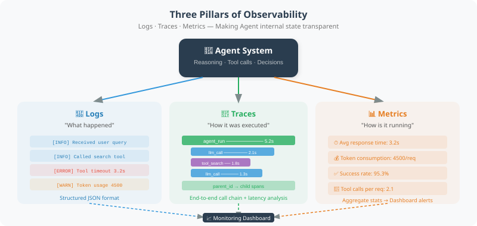
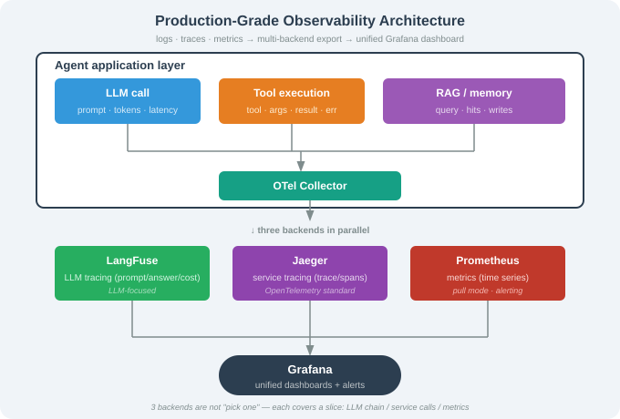

# 20.5 Observability: Logging, Tracing, and Monitoring

> **Section Goal**: Learn how to build a comprehensive observability system for Agents, so that "problems can be detected when they occur, and located once detected."

---

## What Is Observability?

Observability refers to the ability to understand a system's internal state through its external outputs, without modifying the system's code. For an Agent, this means being able to answer questions like:

- What decisions did the Agent make? Why?
- Which tools were called? How long did each tool take?
- What intermediate steps occurred between the user's question and the final answer?
- When an error happened, at which step did it occur?

The three pillars of observability: **Logs**, **Traces**, and **Metrics**.



---

## Pillar 1: Structured Logging

```python
import logging
import json
from datetime import datetime

class AgentLogger:
    """Structured logger dedicated to Agents"""
    
    def __init__(self, agent_name: str, log_file: str = None):
        self.agent_name = agent_name
        self.logger = logging.getLogger(agent_name)
        self.logger.setLevel(logging.DEBUG)
        
        # Console output
        console_handler = logging.StreamHandler()
        console_handler.setFormatter(
            logging.Formatter("%(asctime)s [%(levelname)s] %(message)s")
        )
        self.logger.addHandler(console_handler)
        
        # File output (JSON format)
        if log_file:
            file_handler = logging.FileHandler(log_file)
            file_handler.setFormatter(logging.Formatter("%(message)s"))
            self.logger.addHandler(file_handler)
    
    def log_event(self, event_type: str, **kwargs):
        """Log a structured event"""
        event = {
            "timestamp": datetime.now().isoformat(),
            "agent": self.agent_name,
            "event": event_type,
            **kwargs
        }
        self.logger.info(json.dumps(event, ensure_ascii=False))
    
    def log_llm_call(
        self,
        model: str,
        prompt: str,
        response: str,
        tokens: dict,
        latency: float
    ):
        """Log an LLM call"""
        self.log_event(
            "llm_call",
            model=model,
            prompt_preview=prompt[:200] + "..." if len(prompt) > 200 else prompt,
            response_preview=response[:200] + "..." if len(response) > 200 else response,
            input_tokens=tokens.get("input", 0),
            output_tokens=tokens.get("output", 0),
            latency_ms=round(latency * 1000)
        )
    
    def log_tool_call(
        self,
        tool_name: str,
        args: dict,
        result: str,
        success: bool,
        latency: float
    ):
        """Log a tool call"""
        self.log_event(
            "tool_call",
            tool=tool_name,
            arguments=args,
            result_preview=str(result)[:200],
            success=success,
            latency_ms=round(latency * 1000)
        )
    
    def log_error(self, error: Exception, context: dict = None):
        """Log an error"""
        self.log_event(
            "error",
            error_type=type(error).__name__,
            error_message=str(error),
            context=context or {}
        )

# Usage example
logger = AgentLogger("customer_service", log_file="agent.log")

logger.log_llm_call(
    model="gpt-4.1",
    prompt="User asked: Where is my order?",
    response="Let me check your order status...",
    tokens={"input": 150, "output": 80},
    latency=1.2
)
```

---

## Pillar 2: Distributed Tracing

Trace every step a request goes through from start to finish:

```python
import uuid
import time
from dataclasses import dataclass, field

@dataclass
class Span:
    """A single node in a trace chain"""
    name: str
    trace_id: str
    span_id: str = field(default_factory=lambda: str(uuid.uuid4())[:8])
    parent_id: str = None
    start_time: float = 0.0
    end_time: float = 0.0
    attributes: dict = field(default_factory=dict)
    events: list = field(default_factory=list)
    status: str = "ok"
    
    @property
    def duration_ms(self) -> float:
        return (self.end_time - self.start_time) * 1000


class AgentTracer:
    """Agent distributed tracer"""
    
    def __init__(self):
        self.traces = {}  # trace_id -> list[Span]
    
    def start_trace(self, name: str) -> Span:
        """Start a new trace chain"""
        trace_id = str(uuid.uuid4())[:12]
        span = Span(name=name, trace_id=trace_id)
        span.start_time = time.time()
        self.traces[trace_id] = [span]
        return span
    
    def start_span(self, name: str, parent: Span) -> Span:
        """Create a child node in an existing trace chain"""
        span = Span(
            name=name,
            trace_id=parent.trace_id,
            parent_id=parent.span_id
        )
        span.start_time = time.time()
        self.traces[parent.trace_id].append(span)
        return span
    
    def end_span(self, span: Span, status: str = "ok", **attributes):
        """End a node"""
        span.end_time = time.time()
        span.status = status
        span.attributes.update(attributes)
    
    def print_trace(self, trace_id: str):
        """Visually print a complete trace chain"""
        spans = self.traces.get(trace_id, [])
        if not spans:
            print("Trace not found")
            return
        
        print(f"\n{'='*60}")
        print(f"🔍 Trace: {trace_id}")
        print(f"{'='*60}")
        
        # Build the tree structure
        root_spans = [s for s in spans if s.parent_id is None]
        
        for root in root_spans:
            self._print_span_tree(root, spans, indent=0)
    
    def _print_span_tree(self, span: Span, all_spans: list, indent: int):
        """Recursively print the Span tree"""
        prefix = "  " * indent
        status_icon = "✅" if span.status == "ok" else "❌"
        
        print(f"{prefix}{status_icon} {span.name} "
              f"({span.duration_ms:.0f}ms)")
        
        for key, value in span.attributes.items():
            print(f"{prefix}   {key}: {value}")
        
        # Print child nodes
        children = [s for s in all_spans if s.parent_id == span.span_id]
        for child in children:
            self._print_span_tree(child, all_spans, indent + 1)


# Usage example
tracer = AgentTracer()

# Simulate a complete Agent request trace
root = tracer.start_trace("handle_user_query")

# Step 1: Understand user intent
intent_span = tracer.start_span("classify_intent", root)
# ... execute intent classification ...
tracer.end_span(intent_span, intent="order_query")

# Step 2: Call a tool
tool_span = tracer.start_span("call_tool:query_order", root)
# ... query the order ...
tracer.end_span(tool_span, order_id="12345", status="shipped")

# Step 3: Generate a reply
reply_span = tracer.start_span("generate_reply", root)
# ... generate the final reply ...
tracer.end_span(reply_span, tokens=150)

tracer.end_span(root)
tracer.print_trace(root.trace_id)
```

Example output:
```
============================================================
🔍 Trace: a1b2c3d4e5f6
============================================================
✅ handle_user_query (1523ms)
  ✅ classify_intent (245ms)
     intent: order_query
  ✅ call_tool:query_order (1050ms)
     order_id: 12345
     status: shipped
  ✅ generate_reply (228ms)
     tokens: 150
```

---

## Pillar 3: Monitoring Metrics

```python
import time
from collections import defaultdict, deque
from dataclasses import dataclass

class AgentMonitor:
    """Agent runtime monitor"""
    
    def __init__(self, window_size: int = 100):
        self.window_size = window_size
        self.latencies = deque(maxlen=window_size)
        self.error_count = 0
        self.total_count = 0
        self.tool_stats = defaultdict(
            lambda: {"calls": 0, "errors": 0, "total_ms": 0}
        )
    
    def record_request(self, latency: float, success: bool):
        """Record a request"""
        self.total_count += 1
        self.latencies.append(latency)
        if not success:
            self.error_count += 1
    
    def record_tool_usage(
        self,
        tool_name: str,
        latency: float,
        success: bool
    ):
        """Record tool usage"""
        stats = self.tool_stats[tool_name]
        stats["calls"] += 1
        stats["total_ms"] += latency * 1000
        if not success:
            stats["errors"] += 1
    
    def get_dashboard(self) -> str:
        """Get monitoring dashboard data"""
        avg_latency = (
            sum(self.latencies) / len(self.latencies)
            if self.latencies else 0
        )
        error_rate = (
            self.error_count / self.total_count
            if self.total_count else 0
        )
        p95_latency = (
            sorted(self.latencies)[int(len(self.latencies) * 0.95)]
            if len(self.latencies) > 20 else avg_latency
        )
        
        dashboard = f"""
┌──────────────────────────────────────┐
│        🖥️  Agent Monitor Dashboard    │
├──────────────────────────────────────┤
│ Total requests: {self.total_count:<20} │
│ Error rate:     {error_rate:<20.2%} │
│ Avg latency:    {avg_latency:<18.0f}ms │
│ P95 latency:    {p95_latency:<18.0f}ms │
├──────────────────────────────────────┤
│ 🔧 Tool Usage Statistics              │
"""
        for name, stats in self.tool_stats.items():
            avg_tool_ms = (
                stats["total_ms"] / stats["calls"]
                if stats["calls"] else 0
            )
            dashboard += (
                f"│ {name:<15} "
                f"calls:{stats['calls']:<5} "
                f"avg:{avg_tool_ms:.0f}ms │\n"
            )
        
        dashboard += "└──────────────────────────────────────┘"
        return dashboard
```

---

## Using LangSmith for Tracing (Recommended)

[LangSmith](https://smith.langchain.com/) is LangChain's official observability platform. It can automatically trace every step of LangChain/LangGraph applications:

```python
import os

# Just set environment variables to enable LangSmith tracing
os.environ["LANGCHAIN_TRACING_V2"] = "true"
os.environ["LANGCHAIN_API_KEY"] = os.getenv("LANGSMITH_API_KEY")
os.environ["LANGCHAIN_PROJECT"] = "my-agent-project"

# All subsequent LangChain calls will be automatically traced
from langchain_openai import ChatOpenAI

llm = ChatOpenAI(model="gpt-4.1")
response = llm.invoke("Hello")
# Detailed information about this call (input, output, latency, tokens)
# will automatically appear in the LangSmith web interface
```

Core features provided by LangSmith:

| Feature | Description |
|---------|-------------|
| Automatic tracing | Complete chain for every LLM/tool call |
| Visualization | View input/output of each step in the web interface |
| Dataset management | Create test datasets for batch evaluation |
| Run comparison | Compare performance differences between versions |
| Alerting | Set alert rules for error rate, latency, etc. |

---

## Observability Platform Comparison and Selection

By 2026, the Agent observability ecosystem has matured into several established solutions, each with its own focus:

| Platform | Open Source | Core Strength | Best For | Pricing |
|----------|-------------|---------------|----------|---------|
| LangSmith | ❌ | Native LangChain ecosystem integration | LangChain/LangGraph projects | Free 5K traces/month |
| LangFuse | ✅ | Open source, framework-agnostic, full-featured | Mixed frameworks, self-hosted deployment | Free self-hosted open source |
| OpenTelemetry | ✅ | Industry standard, vendor-neutral | Microservices architecture, existing OTel infrastructure | Free (requires backend storage) |
| Arize Phoenix | ✅ | Local-first, embedded visualization | Development debugging, Jupyter integration | Free locally |
| Braintrust | ❌ | Evaluation-first, automatic scoring | Model evaluation and comparison | Free 1K evaluations/month |
| Traceloop | ✅ | Based on OTel, lightweight | Teams with existing OTel | Free open source |

> 💡 **Selection Advice**: If you only use the LangChain ecosystem, LangSmith is the most hassle-free choice; if you need self-hosted deployment or use multiple frameworks, LangFuse is the best open-source option right now; if your company already has OpenTelemetry infrastructure, Traceloop integrates seamlessly.

---

## LangFuse: Hands-on with the Open-Source Observability Platform

[LangFuse](https://langfuse.com/) is currently the most active open-source LLM observability project. It supports tracing, evaluation, and Prompt management for any framework.

### Core Concepts

LangFuse's data model revolves around three core entities:

- **Trace**: the complete lifecycle of a single user request
- **Span**: a step within a Trace (LLM call, tool execution, etc.)
- **Generation**: an LLM generation within a Span (records the Prompt, Completion, and Token usage)

### Quick Integration

```python
# pip install langfuse
from langfuse import LangFuse

# Initialize (supports self-hosted deployment)
langfuse = LangFuse(
    public_key=os.getenv("LANGFUSE_PUBLIC_KEY"),
    secret_key=os.getenv("LANGFUSE_SECRET_KEY"),
    host=os.getenv("LANGFUSE_HOST", "https://cloud.langfuse.com"),  # or self-hosted address
)

# Create a trace
trace = langfuse.trace(
    name="customer_service_agent",
    user_id="user_123",
    metadata={"version": "2.1.0", "environment": "production"},
)

# Record an LLM call
generation = trace.generation(
    name="intent_classification",
    model="gpt-4.1",
    input=[{"role": "user", "content": "Where is my order?"}],
    output={"intent": "order_query", "confidence": 0.95},
    usage={"prompt_tokens": 45, "completion_tokens": 12, "total_tokens": 57},
    metadata={"latency_ms": 320},
)

# Record a tool call
tool_span = trace.span(
    name="query_order",
    input={"order_id": "12345"},
    output={"status": "shipped", "eta": "tomorrow afternoon"},
    metadata={"tool": "order_api", "latency_ms": 850},
)

# Record the final reply
final_generation = trace.generation(
    name="generate_reply",
    model="gpt-4.1",
    input=[{"role": "system", "content": "Generate a friendly reply based on the query results"}],
    output="Your order has shipped and is expected to arrive tomorrow afternoon.",
    usage={"prompt_tokens": 120, "completion_tokens": 35, "total_tokens": 155},
)
```

### Integration with LangChain/LangGraph

```python
# pip install langfuse-langchain
from langfuse.callback import CallbackHandler

# Create the LangFuse callback handler
langfuse_handler = CallbackHandler(
    public_key=os.getenv("LANGFUSE_PUBLIC_KEY"),
    secret_key=os.getenv("LANGFUSE_SECRET_KEY"),
    host=os.getenv("LANGFUSE_HOST", "https://cloud.langfuse.com"),
)

# Method 1: Pass it into a single chain/Agent call
result = agent.invoke(
    {"input": "Help me check my recent orders"},
    config={"callbacks": [langfuse_handler]},
)

# Method 2: Enable globally (all LangChain calls are traced automatically)
from langchain_core.callbacks import set_handler
set_handler(langfuse_handler)
```

### Scoring and Evaluation

```python
# Add a human score to a trace
langfuse.score(
    trace_id=trace.id,
    name="user-feedback",
    value=5,  # 1-5 rating
)

# Add an automatic score to a trace (e.g., using LLM-as-Judge)
langfuse.score(
    trace_id=trace.id,
    name="answer-quality",
    value=0.85,
    comment="Accurate and helpful answer",
)
```

### Prompt Version Management

```python
# Pull the production Prompt from LangFuse
prompt = langfuse.get_prompt("customer_service_system_prompt")

# Prompts are version-controlled, enabling A/B testing
production_prompt = langfuse.get_prompt("system_prompt", version=3)

# Compile the Prompt template
compiled = production_prompt.compile(language="Chinese", tone="friendly")
```

---

## OpenTelemetry: Standardized Distributed Tracing

[OpenTelemetry](https://opentelemetry.io/) is the CNCF observability standard, suitable for teams that already have microservices infrastructure. Through OTel, Agent tracing data can be viewed alongside your existing microservices traces (e.g., Jaeger, Zipkin).

### OTel Semantic Conventions for Agent Tracing

```python
# pip install opentelemetry-api opentelemetry-sdk
from opentelemetry import trace
from opentelemetry.sdk.trace import TracerProvider
from opentelemetry.sdk.trace.export import BatchSpanProcessor
from opentelemetry.sdk.resources import Resource

# Initialize the Tracer
resource = Resource.create({
    "service.name": "agent-service",
    "service.version": "2.1.0",
    "deployment.environment": "production",
})

provider = TracerProvider(resource=resource)
trace.set_tracer_provider(provider)

# Configure the exporter (Jaeger / OTLP / Console)
from opentelemetry.exporter.otlp.proto.grpc.trace_exporter import OTLPSpanExporter
exporter = OTLPSpanExporter(endpoint="http://otel-collector:4317")
provider.add_span_processor(BatchSpanProcessor(exporter))

tracer = trace.get_tracer("agent-service")
```

### Agent Request Tracing Implementation

```python
"""
OpenTelemetry-based Agent tracing implementation
Follows OTel semantic conventions for seamless integration with microservices tracing
"""
from opentelemetry import trace
from opentelemetry.trace import Status, StatusCode

class OTelAgentTracer:
    """Agent tracer using the OpenTelemetry standard"""

    def __init__(self, service_name: str = "agent-service"):
        self.tracer = trace.get_tracer(service_name)

    def trace_agent_request(self, user_query: str, agent_name: str):
        """Trace a complete Agent request"""
        with self.tracer.start_as_current_span(
            f"agent.{agent_name}.request",
            attributes={
                "agent.name": agent_name,
                "user.query": user_query[:200],
                "agent.request_type": "chat",
            },
        ) as request_span:
            return request_span

    def trace_llm_call(self, parent_span, model: str, prompt_tokens: int,
                       completion_tokens: int, latency_ms: float):
        """Trace an LLM call"""
        with self.tracer.start_as_current_span(
            f"llm.{model}.completion",
            attributes={
                "llm.request.type": "completion",
                "llm.model": model,
                "llm.usage.prompt_tokens": prompt_tokens,
                "llm.usage.completion_tokens": completion_tokens,
                "llm.usage.total_tokens": prompt_tokens + completion_tokens,
                "llm.latency_ms": latency_ms,
            },
        ) as llm_span:
            return llm_span

    def trace_tool_call(self, parent_span, tool_name: str,
                        args: dict, result: str, success: bool,
                        latency_ms: float):
        """Trace a tool call"""
        with self.tracer.start_as_current_span(
            f"tool.{tool_name}.call",
            attributes={
                "tool.name": tool_name,
                "tool.args": str(args)[:500],
                "tool.result_preview": str(result)[:200],
                "tool.success": success,
                "tool.latency_ms": latency_ms,
            },
        ) as tool_span:
            if not success:
                tool_span.set_status(Status(StatusCode.ERROR))
            return tool_span

    def trace_retrieval(self, parent_span, query: str, num_results: int,
                        latency_ms: float):
        """Trace RAG retrieval"""
        with self.tracer.start_as_current_span(
            "retrieval.search",
            attributes={
                "retrieval.query": query[:200],
                "retrieval.num_results": num_results,
                "retrieval.latency_ms": latency_ms,
            },
        ) as retrieval_span:
            return retrieval_span
```

### Complete Integration Example

```python
# Combine OTel tracing with Agent execution
otel_tracer = OTelAgentTracer("customer-service-agent")

def handle_user_query(query: str) -> str:
    """Agent request handling with tracing"""
    with otel_tracer.trace_agent_request(query, "customer_service") as req_span:
        # Step 1: Intent classification
        with otel_tracer.trace_llm_call(
            req_span, "gpt-4.1-mini", 45, 12, 320
        ):
            intent = classify_intent(query)

        # Step 2: Tool call (if needed)
        if intent == "order_query":
            with otel_tracer.trace_tool_call(
                req_span, "query_order",
                {"query": query}, "Order has shipped", True, 850
            ):
                order_info = query_order(query)

        # Step 3: Generate reply
        with otel_tracer.trace_llm_call(
            req_span, "gpt-4.1", 120, 35, 480
        ):
            reply = generate_reply(query, order_info)

        req_span.set_attribute("agent.result_preview", reply[:200])
        return reply
```

> 💡 **OTel vs. Custom Tracing**: If your Agent runs in a microservices environment (e.g., calling other APIs, databases), OTel can correlate the Agent trace with downstream service traces, giving you a complete request chain in Jaeger/Zipkin. For pure Agent projects, LangFuse is more convenient.

---

## Arize Phoenix: A Local Development and Debugging Tool

[Arize Phoenix](https://github.com/Arize-ai/phoenix) is an embedded observability tool, especially well-suited for development and debugging:

```python
# pip install arize-phoenix openinference-instrumentation-langchain
import phoenix as px

# Launch the local Phoenix server (opens the browser automatically)
session = px.launch_app()

# Automatically trace LangChain calls
from openinference.instrumentation.langchain import LangChainInstrumentor
LangChainInstrumentor().instrument()

# All LangChain calls will automatically appear in the Phoenix UI
from langchain_openai import ChatOpenAI
llm = ChatOpenAI(model="gpt-4.1")
result = llm.invoke("Hello")

# View the Phoenix UI
print(f"Phoenix UI: {session.url}")
```

Arize Phoenix's core strengths:

| Feature | Description |
|---------|-------------|
| Zero-config | Launches locally, no account registration required |
| Embedded | View directly inside Jupyter Notebook |
| Automatic tracing | Supports LangChain/LlamaIndex/OpenAI |
| Token visualization | Real-time view of Token usage and cost |
| Evaluation integration | Built-in LLM-as-Judge evaluation |

---

## Production-Grade Observability Architecture

Unify logs, traces, and metrics into one system:



```python
"""
Production-grade observability manager
Unifies logging, tracing, and metrics with support for multiple backends
"""
import os
import time
import logging
from dataclasses import dataclass
from typing import Optional

from langfuse import LangFuse
from opentelemetry import trace


@dataclass
class ObservabilityConfig:
    """Observability configuration"""
    # LangFuse
    langfuse_public_key: str = ""
    langfuse_secret_key: str = ""
    langfuse_host: str = "https://cloud.langfuse.com"
    langfuse_enabled: bool = False

    # OpenTelemetry
    otlp_endpoint: str = "http://otel-collector:4317"
    otel_enabled: bool = False

    # Logging
    log_level: str = "INFO"
    log_file: str = "agent.log"


class ProductionObservability:
    """Production-grade observability manager"""

    def __init__(self, config: ObservabilityConfig):
        self.config = config
        self.logger = self._setup_logger()

        # LangFuse
        self.langfuse = None
        if config.langfuse_enabled:
            self.langfuse = LangFuse(
                public_key=config.langfuse_public_key,
                secret_key=config.langfuse_secret_key,
                host=config.langfuse_host,
            )

        # OpenTelemetry
        self.tracer = None
        if config.otel_enabled:
            self.tracer = trace.get_tracer("agent-service")

    def _setup_logger(self) -> logging.Logger:
        """Configure structured logging"""
        logger = logging.getLogger("agent")
        logger.setLevel(getattr(logging, self.config.log_level))
        return logger

    def create_trace(self, name: str, **kwargs):
        """Create a trace (written to both LangFuse and OTel)"""
        langfuse_trace = None
        otel_span = None

        if self.langfuse:
            langfuse_trace = self.langfuse.trace(name=name, **kwargs)

        if self.tracer:
            otel_span = self.tracer.start_as_current_span(
                f"agent.{name}",
                attributes={f"agent.{k}": str(v) for k, v in kwargs.items()},
            )

        return {
            "langfuse": langfuse_trace,
            "otel": otel_span,
            "logger": self.logger,
        }

    def record_llm_call(self, trace_ctx: dict, model: str,
                        input_text: str, output_text: str,
                        usage: dict, latency_ms: float):
        """Record an LLM call to all backends"""
        self.logger.info(
            f"LLM call model={model} tokens={usage.get('total_tokens', 0)} "
            f"latency={latency_ms:.0f}ms"
        )

        if trace_ctx.get("langfuse"):
            trace_ctx["langfuse"].generation(
                name=f"llm_{model}",
                model=model,
                input=input_text,
                output=output_text,
                usage=usage,
                metadata={"latency_ms": latency_ms},
            )

        if trace_ctx.get("otel"):
            trace_ctx["otel"].set_attributes({
                f"llm.{model}.tokens": usage.get("total_tokens", 0),
                f"llm.{model}.latency_ms": latency_ms,
            })

    def record_tool_call(self, trace_ctx: dict, tool_name: str,
                         args: dict, result: str, success: bool,
                         latency_ms: float):
        """Record a tool call to all backends"""
        self.logger.info(
            f"Tool call tool={tool_name} success={success} latency={latency_ms:.0f}ms"
        )

        if trace_ctx.get("langfuse"):
            trace_ctx["langfuse"].span(
                name=f"tool_{tool_name}",
                input=args,
                output=result,
                metadata={"success": success, "latency_ms": latency_ms},
            )

        if trace_ctx.get("otel"):
            trace_ctx["otel"].set_attributes({
                f"tool.{tool_name}.success": success,
                f"tool.{tool_name}.latency_ms": latency_ms,
            })
```

> ⚠️ **Note**: In production, the volume of tracing data can be large (each request generates 5–20 Spans). Recommendations:
> 1. Set a sampling rate (e.g., trace only 10% of requests, or trace all error requests + 10% of normal requests).
> 2. Write tracing data asynchronously so it does not block the main request path.
> 3. Set a data retention policy (e.g., LangFuse retains 30 days, OTel retains 7 days).

---

## Summary

| Pillar | Problem Solved | Tools |
|--------|---------------|-------|
| Logs | "What happened?" | Structured logging, JSON format |
| Traces | "What steps were taken?" | Span chains, LangFuse/LangSmith/OTel |
| Metrics | "How is overall performance?" | Counters, histograms, Prometheus/Grafana |

| Scenario | Recommended Solution |
|----------|----------------------|
| LangChain projects | LangSmith (most hassle-free) |
| Multi-framework / self-hosted | LangFuse (open source + full-featured) |
| Microservices architecture | OpenTelemetry + Jaeger/Prometheus |
| Development & debugging | Arize Phoenix (zero-config) |
| Production-grade unified | OTel Collector → LangFuse + Prometheus → Grafana |

> 💡 **Further Reading**: For model routing evaluation and A/B testing of the Agent runtime, see [20.7 A/B Testing and Regression Test Automation](./07_ab_testing.md) and [20.8 Model Routing Evaluation](./08_model_routing.md).

> 🎓 **Chapter Summary**: Evaluation and optimization is a continuous, iterative process. First establish an evaluation system, then continuously improve the Agent through prompt tuning, cost control, and observability.

---

[Chapter 19: Security and Reliability](../chapter_21_security/README.md)
