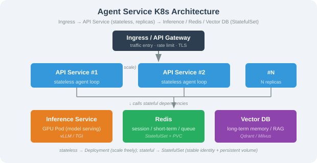

# 22.7 Kubernetes Orchestration and Serverless GPU

> **Goal**: Learn to orchestrate a complete Agent service stack with Kubernetes, master the use of Serverless GPU platforms (Modal / RunPod), and understand autoscaling strategies for GPU workloads.

---

## Why Kubernetes Orchestration?

When an Agent application moves from single-machine deployment to a production-grade service, the question is no longer "can it run?" but:

1. **Multi-component coordination**: the inference service, API gateway, Redis, and vector database need unified orchestration.
2. **GPU resource scheduling**: GPUs are scarce resources that require precise scheduling and sharing.
3. **Elastic scaling**: traffic fluctuates heavily, requiring automatic scaling based on load.
4. **Failure recovery**: a single point of failure should not affect overall service availability.

Docker Compose is fine for single-machine development, but production environments need Kubernetes.

---

## Agent Service K8s Architecture



---

## Complete K8s Deployment Manifest

### Namespace and GPU Resources

```yaml
# namespace.yaml
apiVersion: v1
kind: Namespace
metadata:
  name: agent-prod
  labels:
    env: production
```

```yaml
# gpu-resource-quota.yaml
apiVersion: v1
kind: ResourceQuota
metadata:
  name: gpu-quota
  namespace: agent-prod
spec:
  hard:
    requests.nvidia.com/gpu: "8"    # at most 8 GPUs
    limits.nvidia.com/gpu: "8"
    requests.cpu: "32"
    requests.memory: 64Gi
```

### API Service Deployment

```yaml
# api-deployment.yaml
apiVersion: apps/v1
kind: Deployment
metadata:
  name: agent-api
  namespace: agent-prod
spec:
  replicas: 3
  selector:
    matchLabels:
      app: agent-api
  template:
    metadata:
      labels:
        app: agent-api
    spec:
      containers:
        - name: agent-api
          image: your-registry/agent-api:v1.2.0  # pin the version
          ports:
            - containerPort: 8000
          resources:
            requests:
              cpu: "1"
              memory: "1Gi"
            limits:
              cpu: "2"
              memory: "2Gi"
          env:
            - name: AGENT_OPENAI_API_KEY
              valueFrom:
                secretKeyRef:
                  name: agent-secrets
                  key: openai-api-key
            - name: AGENT_MODEL_NAME
              value: "gpt-4.1"
            - name: AGENT_REDIS_URL
              value: "redis://redis:6379"
          livenessProbe:
            httpGet:
              path: /health
              port: 8000
            initialDelaySeconds: 10
            periodSeconds: 15
          readinessProbe:
            httpGet:
              path: /health
              port: 8000
            initialDelaySeconds: 5
            periodSeconds: 5
      topologySpreadConstraints:   # spread across availability zones
        - maxSkew: 1
          topologyKey: topology.kubernetes.io/zone
          whenUnsatisfiable: DoNotSchedule
          labelSelector:
            matchLabels:
              app: agent-api
```

### API Service and HPA

```yaml
# api-service.yaml
apiVersion: v1
kind: Service
metadata:
  name: agent-api
  namespace: agent-prod
spec:
  selector:
    app: agent-api
  ports:
    - port: 80
      targetPort: 8000
  type: ClusterIP
```

```yaml
# api-hpa.yaml — API-layer autoscaling
apiVersion: autoscaling/v2
kind: HorizontalPodAutoscaler
metadata:
  name: agent-api-hpa
  namespace: agent-prod
spec:
  scaleTargetRef:
    apiVersion: apps/v1
    kind: Deployment
    name: agent-api
  minReplicas: 2
  maxReplicas: 20
  metrics:
    - type: Resource
      resource:
        name: cpu
        target:
          type: Utilization
          averageUtilization: 60
    - type: Pods
      pods:
        metric:
          name: http_requests_per_second
        target:
          type: AverageValue
          averageValue: "100"
  behavior:
    scaleUp:
      stabilizationWindowSeconds: 30
      policies:
        - type: Percent
          value: 100
          periodSeconds: 60
    scaleDown:
      stabilizationWindowSeconds: 300  # require 5 minutes stable before scaling down
      policies:
        - type: Percent
          value: 25
          periodSeconds: 120
```

### Redis StatefulSet

```yaml
# redis-statefulset.yaml
apiVersion: apps/v1
kind: StatefulSet
metadata:
  name: redis
  namespace: agent-prod
spec:
  serviceName: redis
  replicas: 1
  selector:
    matchLabels:
      app: redis
  template:
    metadata:
      labels:
        app: redis
    spec:
      containers:
        - name: redis
          image: redis:7-alpine
          ports:
            - containerPort: 6379
          resources:
            requests:
              cpu: "0.5"
              memory: "512Mi"
            limits:
              cpu: "1"
              memory: "1Gi"
          volumeMounts:
            - name: redis-data
              mountPath: /data
  volumeClaimTemplates:
    - metadata:
        name: redis-data
      spec:
        accessModes: ["ReadWriteOnce"]
        resources:
          requests:
            storage: 10Gi
```

### Ingress Configuration

```yaml
# ingress.yaml
apiVersion: networking.k8s.io/v1
kind: Ingress
metadata:
  name: agent-ingress
  namespace: agent-prod
  annotations:
    nginx.ingress.kubernetes.io/proxy-read-timeout: "300"
    nginx.ingress.kubernetes.io/proxy-buffering: "off"
    nginx.ingress.kubernetes.io/configuration-snippet: |
      more_set_headers "X-Content-Type-Options: nosniff";
spec:
  tls:
    - hosts:
        - agent.your-domain.com
      secretName: agent-tls
  rules:
    - host: agent.your-domain.com
      http:
        paths:
          - path: /
            pathType: Prefix
            backend:
              service:
                name: agent-api
                port:
                  number: 80
```

### Secret Management

```yaml
# secrets.yaml — use an external secret management tool (e.g., Sealed Secrets / External Secrets Operator)
# the following is only illustrative; in practice use an encryption scheme
apiVersion: v1
kind: Secret
metadata:
  name: agent-secrets
  namespace: agent-prod
type: Opaque
stringData:
  openai-api-key: "sk-your-key-here"  # in practice inject from Vault / Sealed Secrets
```

---

## Autoscaling GPU Workloads

Scaling GPU Pods is far more complex than scaling CPU Pods — GPU devices usually cannot be shared across Pods, cold starts are long (model loading takes 30–120 seconds), and they are expensive. Therefore GPU scaling requires a more cautious strategy.

### Queue-Length-Based GPU Scaling

```python
"""
Custom autoscaling metric for a GPU inference service.
Decides whether to scale GPU Pods up or down based on the request queue length.
"""
import time
from prometheus_client import Gauge
from kubernetes import client, config

# Custom metric: number of pending requests
PENDING_REQUESTS = Gauge(
    "inference_pending_requests",
    "Number of pending inference requests"
)

class GPUAutoscaler:
    """Custom autoscaler for GPU inference service"""

    def __init__(self, namespace: str = "agent-prod",
                 deployment: str = "vllm-qwen72b"):
        config.load_incluster_config()
        self.apps_api = client.AppsV1Api()
        self.namespace = namespace
        self.deployment = deployment

        # Scaling thresholds
        self.scale_up_threshold = 10     # scale up when pending requests > 10
        self.scale_down_threshold = 2    # scale down when pending requests < 2
        self.min_replicas = 1
        self.max_replicas = 4
        self.cooldown_seconds = 120      # scaling cooldown period

        self.last_scale_time = 0

    def get_current_replicas(self) -> int:
        """Get the current replica count"""
        deploy = self.apps_api.read_namespaced_deployment(
            name=self.deployment, namespace=self.namespace
        )
        return deploy.spec.replicas

    def scale(self, target_replicas: int):
        """Adjust the replica count"""
        target_replicas = max(self.min_replicas,
                              min(self.max_replicas, target_replicas))
        current = self.get_current_replicas()

        if target_replicas == current:
            return

        # Cooldown check
        now = time.time()
        if now - self.last_scale_time < self.cooldown_seconds:
            return

        self.apps_api.patch_namespaced_deployment(
            name=self.deployment,
            namespace=self.namespace,
            body={"spec": {"replicas": target_replicas}}
        )
        self.last_scale_time = now
        print(f"GPU scaling: {current} -> {target_replicas} replicas")

    def reconcile(self, pending_count: int):
        """Decide scaling based on queue length"""
        current = self.get_current_replicas()

        if pending_count > self.scale_up_threshold:
            self.scale(current + 1)
        elif pending_count < self.scale_down_threshold and current > self.min_replicas:
            self.scale(current - 1)
```

### Key Considerations for GPU Scaling

| Consideration | Description | Recommendation |
|--------|------|------|
| Cold start time | Model loading takes 30–120s | Keep minReplicas ≥ 1, avoid scaling down to 0 |
| GPU cannot be shared | One Pod exclusively owns a GPU | Use time-slicing (MPS) or Multi-Instance GPU (MIG) |
| Scale-down cooldown | Frequent scaling wastes resources | Set scale-down cooldown to 5–10 minutes |
| Predictive scaling | Traffic follows predictable patterns | Pre-set replica counts by time window (CronHPA) |
| Cost control | Per-hour GPU billing is expensive | Switch to CPU inference or Serverless during off-peak |

---

## Serverless GPU Solutions

If your GPU usage is not continuous (for example, you only need inference during the daytime peak), Serverless GPU can drastically cut costs — you only occupy the GPU while inferring, billed by actual usage time.

### Solution Comparison

| Dimension | Modal | RunPod Serverless | AWS SageMaker Async |
|------|-------|-------------------|---------------------|
| Billing granularity | millisecond | per second | per second |
| Cold start | ~1s (container cache) | 5–30s | 30–120s |
| GPU types | A10G / A100 / H100 | A100 / A6000 / RTX 4090 | various |
| Max runtime | unlimited | 10 minutes | 1 hour |
| Python-native | ✅ (decorator syntax) | ❌ (must build an image) | ❌ |
| Best for | low-latency inference, batch processing | general GPU compute | long training / inference |
| Lowest cost (A100) | ~$1.94/h | ~$1.64/h | ~$3.51/h |

### Modal in Practice

Modal's core idea is "write cloud functions like local code" — deploy functions to cloud GPUs via decorators:

```python
# modal_app.py
import modal

# Define the Modal app and GPU image
app = modal.App("agent-inference")

image = (
    modal.Image.from_registry("nvidia/cuda:12.1.0-runtime-ubuntu22.04")
    .pip_install(
        "vllm==0.6.3",
        "transformers==4.46.3",
    )
)

# Create a persistent model instance (avoid repeated cold-start loading)
@app.cls(
    image=image,
    gpu=modal.gpu.A100(size="80GB"),
    container_idle_timeout=300,   # release after 5 minutes idle
    timeout=600,                  # max 10 minutes per request
    allow_concurrent_inputs=50,   # allowed number of concurrent requests
)
class InferenceService:
    """Inference service deployed on Modal"""

    @modal.enter()
    def load_model(self):
        """Load the model when the container starts"""
        from vllm import LLM, SamplingParams
        self.llm = LLM(
            model="Qwen/Qwen2.5-72B-Instruct-AWQ",
            quantization="awq",
            tensor_parallel_size=1,
            gpu_memory_utilization=0.9,
            max_model_len=32768,
        )
        self.sampling_params = SamplingParams(
            temperature=0.7,
            max_tokens=2048,
        )
        print("Model loaded")

    @modal.method()
    def generate(self, prompt: str) -> str:
        """Generate an inference result"""
        outputs = self.llm.generate([prompt], self.sampling_params)
        return outputs[0].outputs[0].text

    @modal.method()
    async def chat(self, messages: list[dict]) -> str:
        """Chat-format inference"""
        from vllm import SamplingParams
        from transformers import AutoTokenizer

        tokenizer = AutoTokenizer.from_pretrained(
            "Qwen/Qwen2.5-72B-Instruct-AWQ"
        )
        prompt = tokenizer.apply_chat_template(
            messages, tokenize=False, add_generation_prompt=True
        )
        outputs = self.llm.generate([prompt], self.sampling_params)
        return outputs[0].outputs[0].text


# Local invocation entry point
@app.local_entrypoint()
def main():
    service = InferenceService()
    result = service.generate.remote("Please explain what PagedAttention is")
    print(result)
```

### RunPod Serverless in Practice

RunPod Serverless requires building a Docker image first, then deploying it as a Serverless Endpoint:

```dockerfile
# Dockerfile.runpod
FROM runpod/pytorch:2.1.0-py3.10-cuda12.1.1-devel-ubuntu22.04

WORKDIR /app

# Install dependencies
RUN pip install --no-cache-dir \
    vllm==0.6.3 \
    transformers==4.46.3

# Copy Handler code
COPY handler.py .

# RunPod Serverless entry point
CMD ["python", "-u", "handler.py"]
```

```python
# handler.py — RunPod Serverless Handler
import runpod
from vllm import LLM, SamplingParams

# Load model globally (executed once during cold start)
llm = LLM(
    model="Qwen/Qwen2.5-7B-Instruct-AWQ",
    quantization="awq",
    gpu_memory_utilization=0.9,
    max_model_len=16384,
)

sampling_params = SamplingParams(
    temperature=0.7,
    max_tokens=2048,
)


def handler(event: dict) -> dict:
    """RunPod Serverless request handler"""
    input_data = event["input"]
    prompt = input_data.get("prompt", "")
    messages = input_data.get("messages")

    if messages:
        from transformers import AutoTokenizer
        tokenizer = AutoTokenizer.from_pretrained(
            "Qwen/Qwen2.5-7B-Instruct-AWQ"
        )
        prompt = tokenizer.apply_chat_template(
            messages, tokenize=False, add_generation_prompt=True
        )

    outputs = llm.generate([prompt], sampling_params)
    generated_text = outputs[0].outputs[0].text

    return {"output": generated_text}


# Start the Serverless Worker
runpod.serverless.start({"handler": handler})
```

### RunPod Serverless Configuration

```yaml
# runpod-config.yaml — RunPod Serverless Endpoint configuration
# created via the RunPod console or API
endpoint:
  name: agent-inference
  image: your-registry/agent-inference:latest
  gpu_type: "NVIDIA A100 80GB"
  gpu_count: 1

  # Autoscaling configuration
  autoscaling:
    min_workers: 0          # scale down to 0 when there are no requests
    max_workers: 4          # at most 4 Workers
    idle_timeout: 300       # release after 5 minutes idle
    scale_up_threshold: 5   # scale up when queue > 5
    scale_down_threshold: 1

  # Resource configuration
  resources:
    memory: 32Gi
    container_disk: 50Gi

  # Environment variables
  env:
    - name: MODEL_NAME
      value: "Qwen/Qwen2.5-7B-Instruct-AWQ"
    - name: MAX_MODEL_LEN
      value: "16384"
```

---

## Hybrid Deployment Strategy: Self-Hosted + Serverless

The most economical approach is hybrid deployment: baseline traffic goes to self-hosted GPU servers (lowest cost), and peak traffic spills over to Serverless GPU (most elastic).

```python
"""
Hybrid router: self-hosted inference service + Serverless overflow.
Baseline traffic goes to the self-hosted service (low cost); when capacity is exceeded,
it spills over to Modal / RunPod.
"""
import httpx
import asyncio
from dataclasses import dataclass
from enum import Enum

class BackendType(Enum):
    SELF_HOSTED = "self_hosted"
    MODAL = "modal"
    RUNPOD = "runpod"

@dataclass
class Backend:
    type: BackendType
    base_url: str
    max_concurrent: int
    current_load: int = 0
    cost_per_1k_tokens: float = 0.0

class HybridRouter:
    """Hybrid routing: prefer self-hosted, spill over to Serverless"""

    def __init__(self):
        self.backends = [
            Backend(
                type=BackendType.SELF_HOSTED,
                base_url="http://vllm-service:8000",
                max_concurrent=50,
                cost_per_1k_tokens=0.0008,  # self-hosted cost (amortized)
            ),
            Backend(
                type=BackendType.MODAL,
                base_url="https://modal-endpoint.example.com",
                max_concurrent=100,
                cost_per_1k_tokens=0.002,  # Serverless cost (pay-per-use)
            ),
        ]

    async def route_request(self, messages: list[dict],
                            model: str = "qwen2.5-72b") -> dict:
        """Route the request to an available backend"""
        # Check availability by priority (self-hosted first)
        for backend in self.backends:
            if backend.current_load < backend.max_concurrent:
                backend.current_load += 1
                try:
                    result = await self._call_backend(backend, messages, model)
                    return {
                        "result": result,
                        "backend": backend.type.value,
                        "cost_estimate": backend.cost_per_1k_tokens,
                    }
                finally:
                    backend.current_load -= 1

        # All backends are saturated; queue and wait
        raise RuntimeError("All inference backends are saturated, please retry later")

    async def _call_backend(self, backend: Backend,
                            messages: list[dict], model: str) -> dict:
        """Call the specified backend"""
        async with httpx.AsyncClient(timeout=120) as client:
            response = await client.post(
                f"{backend.base_url}/v1/chat/completions",
                json={
                    "model": model,
                    "messages": messages,
                    "temperature": 0.7,
                    "max_tokens": 2048,
                },
            )
            response.raise_for_status()
            return response.json()
```

### Hybrid Deployment Cost Estimate

| Scenario | Self-hosted only | Serverless only | Hybrid |
|------|--------|--------------|---------|
| Monthly requests | 1 million | 1 million | 1 million |
| Baseline QPS | 5 | — | 5 (covered by self-hosted) |
| Peak QPS | 20 | 20 | 5 self-hosted + 15 Serverless |
| Monthly GPU cost | ~$2,400 (2×A100 monthly) | ~$1,800 (pay-per-use) | ~$1,400 (1×A100 + peak overflow) |
| Availability | May overload at peak | High (elastic) | High |
| Cost efficiency | Low (idle waste) | Medium | **High** |

> 💡 **Key to hybrid deployment**: accurately predict baseline traffic, ensuring self-hosted GPUs cover 60%–80% of daily traffic, and spill only the peak to Serverless.

---

## Common K8s Deployment Configurations

### Managing Application Config with ConfigMap

```yaml
# configmap.yaml
apiVersion: v1
kind: ConfigMap
metadata:
  name: agent-config
  namespace: agent-prod
data:
  AGENT_MODEL_NAME: "gpt-4.1"
  AGENT_MAX_STEPS: "10"
  AGENT_MAX_TOKENS: "4096"
  AGENT_RATE_LIMIT_PER_MINUTE: "60"
  AGENT_LOG_LEVEL: "INFO"
```

### PodDisruptionBudget for Availability

```yaml
# pdb.yaml — ensure enough replicas stay online during rolling updates
apiVersion: policy/v1
kind: PodDisruptionBudget
metadata:
  name: agent-api-pdb
  namespace: agent-prod
spec:
  minAvailable: 2
  selector:
    matchLabels:
      app: agent-api
```

### NetworkPolicy for Network Isolation

```yaml
# networkpolicy.yaml — only allow API Pods to access Redis and the inference service
apiVersion: networking.k8s.io/v1
kind: NetworkPolicy
metadata:
  name: agent-network-policy
  namespace: agent-prod
spec:
  podSelector:
    matchLabels:
      app: agent-api
  policyTypes:
    - Ingress
    - Egress
  ingress:
    - from:
        - namespaceSelector:
            matchLabels:
              name: ingress-nginx
      ports:
        - port: 8000
  egress:
    - to:
        - podSelector:
            matchLabels:
              app: redis
      ports:
        - port: 6379
    - to:
        - podSelector:
            matchLabels:
              app: vllm
      ports:
        - port: 8000
    - to:
        - namespaceSelector: {}
          podSelector:
            matchLabels:
              k8s-app: kube-dns
      ports:
        - port: 53
          protocol: UDP
```

---

## Deployment Process and Verification

### Deploying with kubectl

```bash
# 1. Create the namespace
kubectl apply -f namespace.yaml

# 2. Create the secret (inject from an external secret management system)
kubectl create secret generic agent-secrets \
    --from-literal=openai-api-key='sk-your-key' \
    -n agent-prod

# 3. Deploy each component in order
kubectl apply -f configmap.yaml
kubectl apply -f redis-statefulset.yaml
kubectl apply -f api-deployment.yaml
kubectl apply -f api-service.yaml
kubectl apply -f api-hpa.yaml
kubectl apply -f ingress.yaml
kubectl apply -f pdb.yaml
kubectl apply -f networkpolicy.yaml

# 4. Verify deployment status
kubectl get pods -n agent-prod
kubectl get svc -n agent-prod
kubectl get hpa -n agent-prod

# 5. Check Pod logs
kubectl logs -f deployment/agent-api -n agent-prod

# 6. Test the service
curl -X POST https://agent.your-domain.com/chat \
  -H "Content-Type: application/json" \
  -H "X-API-Key: your-api-key" \
  -d '{"message": "hello"}'
```

### Rolling Updates

```bash
# Update the image version
kubectl set image deployment/agent-api \
    agent-api=your-registry/agent-api:v1.3.0 \
    -n agent-prod

# Check the rolling update status
kubectl rollout status deployment/agent-api -n agent-prod

# If something goes wrong, roll back quickly
kubectl rollout undo deployment/agent-api -n agent-prod
```

---

## Notes and Best Practices

1. **GPU node taints and tolerations**: GPU nodes usually have a taint set to prevent non-GPU workloads from being scheduled on them. Inference service Pods need the corresponding toleration:

```yaml
spec:
  tolerations:
    - key: "nvidia.com/gpu"
      operator: "Exists"
      effect: "NoSchedule"
```

2. **Cache models with a PVC**: avoid re-downloading the model (tens of GB) every time a Pod is scheduled. Use a PersistentVolumeClaim to cache model files:

```yaml
volumeMounts:
  - name: model-cache
    mountPath: /root/.cache/huggingface
volumes:
  - name: model-cache
    persistentVolumeClaim:
      claimName: model-cache-pvc
```

3. **Importance of readiness probes**: inference services need time to load the model, so you must set a reasonable `initialDelaySeconds`; otherwise traffic will be routed to Pods that are not ready yet.

4. **Serverless cold-start optimization**: Modal supports the `container_idle_timeout` parameter; extending the idle timeout (e.g., 5 minutes) appropriately can significantly reduce cold starts.

5. **Do not scale GPU services down to 0**: unless you use a Serverless solution, self-hosted K8s GPU services should keep minReplicas ≥ 1. Model loading takes too long, and scaling down to 0 causes the first request to time out.

6. **Multi-availability-zone deployment**: in production, deploy across at least 2 availability zones to prevent a single-zone failure from taking the service down.

---

## Summary

| Concept | Description |
|------|------|
| K8s orchestration | Unified management of API, inference, storage, and other components |
| GPU scaling | Custom scaling based on queue length; watch out for cold starts |
| Modal | Python-native Serverless GPU, millisecond-level billing |
| RunPod Serverless | Docker image deployment, high flexibility |
| Hybrid deployment | Self-hosted covers baseline + Serverless handles peaks; lowest cost |
| PDB / NetworkPolicy | Ensure availability and security isolation |

> **Next section preview**: The service is deployed, but how do you manage the Agent's long-running tasks? How do you control Token costs? Let's look at task queues and cost governance.

---

[22.8 Long-Running Task Queues and Cost Governance](./08_task_queue_cost.md)
