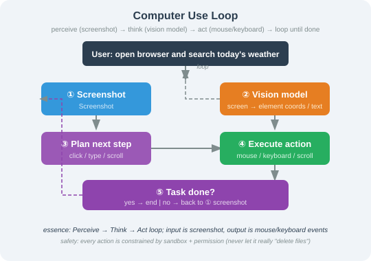

# 25.5 Computer Use and GUI Agents

> **Goal of this section**: Master the core architecture and implementation of Computer Use Agents, and understand the latest progress in GUI automation in 2025–2026.

---

## From "Conversation" to "Operation": The Final Form of Agents

The multimodal Agents we have built so far are still fundamentally "conversational" — the user asks, the Agent answers. In real work, however, we frequently need an Agent to **operate software directly**: open a browser and search for information, fill data into Excel, modify code in an IDE, install software in an operating system.

The **Computer Use Agent** was created precisely to solve this problem. The Agent no longer just "talks"; it "does the work with its hands" — it understands screenshots, computes click coordinates, and sends keyboard input, operating a computer's graphical user interface (GUI) the same way a human does.

> 📄 **Milestones**:
> - **October 2024**: Anthropic released the Computer Use beta for Claude 3.5 Sonnet, the first time a mainstream large model could directly operate a desktop computer.
> - **January 2025**: OpenAI released Operator, built on the CUA (Computer Using Agent) model for browser automation.
> - **March 2025**: Google released Mariner, letting Gemini 2.0 operate the Chrome browser.
> - **2025–2026**: The open-source community produced frameworks such as SWE-Agent, OpenHands, and OSAtlas.

---

## The Core Computer Use Loop

A Computer Use Agent works almost exactly the way a person operates a computer:



This is fundamentally a **Perceive-Think-Act** loop — only here the perceptual input is a screenshot and the action output is a mouse/keyboard event.

---

## Anthropic Computer Use in Practice

### Basic Usage

Anthropic exposes Computer Use through a Beta API, centered on the `computer_20241022` tool:

```python
import anthropic

client = anthropic.Anthropic()

# Define the Computer Use tool
computer_tool = {
    "type": "computer_20241022",
    "name": "computer",
    "display_width_px": 1920,
    "display_height_px": 1080,
    "display_number": 1,
}

# Additional helper tools
bash_tool = {
    "type": "bash_20241022",
    "name": "bash",
}

text_editor_tool = {
    "type": "text_editor_20241022",
    "name": "str_replace_based_editor",
}


def run_computer_use(task: str, max_steps: int = 20) -> list[dict]:
    """Run a Computer Use Agent to execute a task

    Args:
        task: the user's natural-language instruction
        max_steps: maximum number of steps (guards against infinite loops)
    """
    messages = [{"role": "user", "content": task}]
    steps = []
    
    for step in range(max_steps):
        response = client.beta.messages.create(
            model="claude-sonnet-4-20250514",
            max_tokens=1024,
            tools=[computer_tool, bash_tool, text_editor_tool],
            messages=messages,
            betas=["computer-use-2025-01-24"],
        )
        
        # Collect all tool calls
        tool_calls = []
        for block in response.content:
            if block.type == "text":
                print(f"🤖 Agent: {block.text}")
            elif block.type == "tool_use":
                tool_calls.append(block)
                steps.append({
                    "step": step + 1,
                    "tool": block.name,
                    "input": block.input
                })
        
        if not tool_calls:
            # The Agent believes the task is finished
            break
        
        # Execute the tool calls and return the results
        tool_results = []
        for tool_call in tool_calls:
            result = execute_tool_action(tool_call)
            tool_results.append({
                "type": "tool_result",
                "tool_use_id": tool_call.id,
                "content": result,
            })
        
        # Update the conversation history
        messages.append({"role": "assistant", "content": response.content})
        messages.append({"role": "user", "content": tool_results})
    
    return steps


def execute_tool_action(tool_call) -> list[dict]:
    """Execute a Computer Use tool call

    In a real deployment you need to wire in actual screen control here:
    - pyautogui / pynput to control the mouse and keyboard
    - Pillow to capture the screen
    - a sandboxed environment to run bash commands

    What follows is the core logic of a simulated implementation.
    """
    action = tool_call.input
    
    if tool_call.name == "computer":
        action_type = action.get("action")
        
        if action_type == "screenshot":
            # Take a screenshot and return a base64-encoded image
            import pyautogui
            from PIL import Image
            import io, base64
            
            screenshot = pyautogui.screenshot()
            buffer = io.BytesIO()
            screenshot.save(buffer, format="PNG")
            img_b64 = base64.b64encode(buffer.getvalue()).decode()
            
            return [{
                "type": "image",
                "source": {
                    "type": "base64",
                    "media_type": "image/png",
                    "data": img_b64,
                }
            }]
        
        elif action_type == "mouse_move":
            x, y = action["coordinate"]
            import pyautogui
            pyautogui.moveTo(x, y)
            return [{"type": "text", "text": f"Mouse moved to ({x}, {y})"}]
        
        elif action_type == "left_click":
            x, y = action["coordinate"]
            import pyautogui
            pyautogui.click(x, y)
            return [{"type": "text", "text": f"Left click at ({x}, {y})"}]
        
        elif action_type == "type":
            text = action["text"]
            import pyautogui
            pyautogui.typewrite(text, interval=0.05)
            return [{"type": "text", "text": f"Typed text: {text}"}]
        
        elif action_type == "key":
            keys = action["key"]
            import pyautogui
            pyautogui.hotkey(*keys.split("+"))
            return [{"type": "text", "text": f"Key press: {keys}"}]
        
        elif action_type == "scroll":
            x, y = action.get("coordinate", (0, 0))
            delta = action.get("delta", 1)
            import pyautogui
            pyautogui.scroll(delta, x, y)
            return [{"type": "text", "text": f"Scrolled: delta={delta}"}]
    
    elif tool_call.name == "bash":
        # Run a bash command inside the sandbox
        import subprocess
        cmd = action.get("command", "")
        try:
            result = subprocess.run(
                cmd, shell=True, capture_output=True, 
                text=True, timeout=30
            )
            output = result.stdout + result.stderr
        except subprocess.TimeoutExpired:
            output = "Command timed out after 30 seconds"
        return [{"type": "text", "text": output}]
    
    return [{"type": "text", "text": "Unknown action"}]


# Usage example
steps = run_computer_use(
    "Open a browser, search for 'latest AI papers April 2026', "
    "and save the top 3 results to a file"
)
print(f"\nExecuted {len(steps)} actions in total")
```

### Designing Safety Boundaries

A Computer Use Agent carries far more risk than an ordinary text Agent — it can operate your computer directly. When deploying to production you **must** set strict safety boundaries:

```python
class SafeComputerUseAgent:
    """A Computer Use Agent with safety boundaries"""
    
    # Blacklist of dangerous operations
    FORBIDDEN_COMMANDS = [
        "rm -rf", "del /s", "format", "mkfs",
        "shutdown", "reboot", "passwd",
        "curl *| *sh", "wget *| *sh",  # piping into a shell
    ]
    
    # Protected sensitive paths
    PROTECTED_PATHS = [
        "/etc/passwd", "/etc/shadow",
        "/.ssh/", "/.gnupg/",
        "C:\\Windows\\System32",
    ]
    
    # Allowlist of applications the Agent may operate (optional)
    ALLOWED_APPS = [
        "chrome", "firefox", "safari",       # browsers
        "code", "cursor", "vim",             # editors
        "excel", "numbers",                  # spreadsheets
        "terminal", "iterm", "cmd",          # terminals
    ]
    
    def __init__(self):
        self.screenshot_count = 0
        self.total_actions = 0
        self.max_actions_per_task = 50  # max actions for a single task
    
    def validate_bash_command(self, command: str) -> tuple[bool, str]:
        """Check whether a bash command is safe"""
        cmd_lower = command.lower().strip()
        
        # Check the blacklist
        for forbidden in self.FORBIDDEN_COMMANDS:
            if forbidden.replace("*", "") in cmd_lower:
                return False, f"Dangerous command blocked: {forbidden}"
        
        # Check sensitive paths
        for path in self.PROTECTED_PATHS:
            if path.lower() in cmd_lower:
                return False, f"Protected sensitive path: {path}"
        
        return True, "OK"
    
    def validate_click_target(self, x: int, y: int, 
                               screenshot_description: str) -> tuple[bool, str]:
        """Check whether a click target is safe
        
        Uses the screenshot description to judge whether the click region
        is reasonable.
        """
        # Check the action count
        self.total_actions += 1
        if self.total_actions > self.max_actions_per_task:
            return False, "Exceeded the max actions for a single task; forced stop"
        
        # Check whether a dangerous region was clicked (e.g. a delete confirmation dialog)
        dangerous_keywords = ["delete all", "format disk", "clear everything", "erase all"]
        if any(kw in screenshot_description for kw in dangerous_keywords):
            return False, "Dangerous UI detected; human confirmation required"
        
        return True, "OK"
    
    def get_confirmation(self, action: str, detail: str) -> bool:
        """Ask for human confirmation on high-risk operations"""
        print(f"\n⚠️  High-risk operation requested: {action}")
        print(f"   Details: {detail}")
        confirm = input("   Allow it? (y/N): ").strip().lower()
        return confirm == "y"
```

---

## OpenAI Operator / CUA Model

In January 2025 OpenAI launched the **CUA (Computer Using Agent)** model, competing with Anthropic's Computer Use. CUA's defining characteristic is that it is **specifically optimized for browser operation**:

```python
from openai import OpenAI

client = OpenAI()

def run_cua_agent(task: str) -> str:
    """Use the OpenAI CUA model to operate a browser
    
    The core API of the CUA model is response.action:
    it returns structured operation instructions rather than free text.
    """
    response = client.responses.create(
        model="computer-use-preview",
        tools=[{
            "type": "computer_use_preview",
            "display_width": 1280,
            "display_height": 720,
            "environment": "browser",  # CUA focuses on browser scenarios
        }],
        input=[{
            "role": "user",
            "content": task
        }]
    )
    
    return response


# Browser automation scenarios CUA is suited for
CUA_BROWSER_TASKS = {
    "form filling": "Fill out a Google Form: name 'John Smith', email 'john@example.com'",
    "information extraction": "Open JD.com, search for 'mechanical keyboard', and extract the price and name of the top 5 products",
    "web operation": "Create a new repository named 'my-agent' on GitHub",
    "form submission": "Search Trip.com for flights from Beijing to Shanghai, departing next Saturday",
}
```

---

## Browser Use / Web Agent: The First Computer Use Scenario to Reach Production

Among all Computer Use scenarios, **browser automation (Browser Use / Web Agent)** was the first to be commercialized and is the easiest to scale. The reason is simple: a huge share of everyday work happens inside a browser — searching for information, filling in forms, operating SaaS back-offices, booking tickets, shopping, CRM data entry, and web data extraction.

The relationship between a Web Agent and a general GUI Agent can be understood like this:

| Dimension | Web Agent / Browser Use | General Computer Use Agent |
|------|-------------------------|--------------------------|
| **Operating environment** | Browser pages | The entire operating system and any application |
| **Perceptual input** | DOM, accessibility tree, screenshots, network requests | Screenshots, accessibility tree, system state |
| **Action space** | Click, type, scroll, select, navigate, download | Mouse, keyboard, command line, file system, app switching |
| **Verifiability** | URL, DOM state, page text, and form values are relatively easy to verify | Depends on screenshots and system state; much harder to verify |
| **Security risks** | Phishing pages, indirect prompt injection, unauthorized submissions | File destruction, system commands, cross-application mistakes |
| **Representative products** | OpenAI Operator, Google Mariner, Browser Use | Claude Computer Use, OpenHands, OSWorld Agent |

### The Core Web Agent Loop

> User goal → open/search a page → read DOM + screenshot → locate interactive elements → click/type/scroll → verify page state → continue to the next step or submit the result

Unlike a traditional crawler, a Web Agent does not merely "read web pages" — it can **operate** them. Unlike RPA, a Web Agent does not depend on a fixed script; it can make decisions dynamically as the page changes.

### Why Is Browser Use a Frontier Priority?

1. **Web pages are the shell around real-world APIs**: many business systems have no open API, but they do have a web interface.
2. **The execution environment is relatively standardized**: a browser is far easier to sandbox, record trajectories in, and replay for testing than a desktop OS.
3. **Evaluation benchmarks are more mature**: WebArena, VisualWebArena, and Mind2Web provide comparable tasks.
4. **The security challenges are representative**: page content is untrusted external input and easily triggers indirect prompt injection.

### Engineering Recommendations

A production-grade Web Agent should not rely on screenshot coordinates alone; a hybrid perception strategy is recommended:

```text
DOM / Accessibility Tree: locate buttons, input fields, and links
Screenshots: understand visual layout, ad overlays, CAPTCHAs, complex widgets
Network state: judge whether the page finished loading and whether requests failed
Browser context: track URL, cookies, downloaded files, and tab state
```

This kind of Agent must be paired with the security material later in the book: page content must never be treated as a high-priority instruction, and high-risk actions such as placing an order, sending a message, or changing a configuration must go through permission checks and human confirmation.

---

## Three Architectures for GUI Agents

From an implementation standpoint, GUI Agents fall into three architectures:

### Architecture 1: Screenshot + Coordinate

Anthropic Computer Use and OpenAI CUA both use this architecture. The Agent looks at a screenshot and outputs coordinates.

```python
# Pseudocode for the core loop
class ScreenshotCoordinateAgent:
    """Screenshot + coordinate architecture: the most general GUI Agent"""
    
    def run(self, task: str):
        while not self.is_done(task):
            # 1. Take a screenshot
            screenshot = self.take_screenshot()
            
            # 2. The LLM analyzes the screenshot and outputs an action
            action = self.llm.decide(
                task=task,
                screenshot=screenshot,
                history=self.action_history
            )
            
            # 3. Execute the action
            if action.type == "click":
                self.mouse.click(action.x, action.y)
            elif action.type == "type":
                self.keyboard.type(action.text)
            elif action.type == "scroll":
                self.mouse.scroll(action.delta)
            
            self.action_history.append(action)
```

**Pros**: Highly general — it can operate any GUI  
**Cons**: Coordinate precision depends on screen resolution, and small elements are easy to mis-click

### Architecture 2: Accessibility Tree

Use the operating system's Accessibility API to obtain a tree structure of interface elements, and match elements exactly instead of using coordinates.

```python
import subprocess
import json

class AccessibilityTreeAgent:
    """Accessibility tree architecture: precise, but requires platform support"""
    
    def get_accessibility_tree(self) -> dict:
        """Get the accessibility tree of the current window
        
        macOS: use the Accessibility API
        Windows: use UI Automation
        Linux: use ATK/AT-SPI
        """
        # macOS example: obtained via Swift/Python
        script = '''
        import ApplicationServices
        let app = AXUIElementCreateApplication(pid)
        var value: AnyObject?
        AXUIElementCopyAttributeValue(app, kAXChildrenAttribute as CFString, &value)
        '''
        # A real implementation needs the platform-specific Accessibility framework
        pass
    
    def click_element(self, element_description: str):
        """Locate an element precisely by description and click it
        
        For example: click the "Submit button" instead of "coordinate (520, 340)"
        """
        tree = self.get_accessibility_tree()
        element = self._find_element(tree, element_description)
        
        if element:
            # Perform the action directly through the Accessibility API
            # No coordinate math and no dependence on screen resolution
            self._perform_action(element, "click")
        else:
            # Fall back to the screenshot + coordinate approach
            self._fallback_screenshot_click(element_description)
```

**Pros**: Exact element matching, unaffected by resolution  
**Cons**: Requires platform support, and some applications do not expose accessibility information

### Architecture 3: Hybrid Architecture

Combine screenshot understanding with the accessibility tree: locate the element precisely first, and use screenshots to help understand context.

```python
class HybridGUIAgent:
    """Hybrid architecture: match precisely first, then verify with a screenshot"""
    
    def execute_action(self, task: str, action_plan: dict):
        """Execute a single action step"""
        
        # 1. First try precise location via the accessibility tree
        element = self.acc_tree.find(action_plan["target"])
        
        if element and element.is_visible():
            # Precise location succeeded; perform the action
            result = element.perform(action_plan["action"])
        else:
            # Precise location failed; fall back to screenshot + coordinate
            screenshot = self.take_screenshot()
            coords = self.llm.locate_element(
                screenshot=screenshot,
                element_description=action_plan["target"]
            )
            self.mouse.click(coords.x, coords.y)
            result = "clicked_via_screenshot"
        
        # 2. Verify the result with a screenshot
        verification = self.take_screenshot()
        success = self.llm.verify_action(
            before=self.last_screenshot,
            after=verification,
            expected=action_plan["expected_result"]
        )
        
        return {"action": action_plan, "success": success}
```

### Comparing the Three Architectures

| Architecture | Precision | Generality | Platform dependency | Examples |
|------|--------|--------|---------|------|
| Screenshot + coordinate | Medium | High | Low | Claude Computer Use, OpenAI CUA |
| Accessibility Tree | High | Medium | High | UFO (Microsoft), OSAtlas |
| Hybrid architecture | High | High | Medium | OpenHands, SWE-Agent |

---

## Open-Source GUI Agent Frameworks

### OpenHands (formerly OpenDevin)

OpenHands is one of the most popular open-source coding Agent frameworks of 2025, supporting several interaction modes:

```python
# Overview of the OpenHands architecture (pseudocode illustrating the core design)
# For real usage see: https://github.com/All-Hands-AI/OpenHands

"""
The core design of OpenHands:
1. Sandboxed environment: every task runs in its own Docker container
2. Multimodal interaction: supports bash, file editing, and browser operation
3. Agent loop: observe -> reason -> act -> verify

Action types:
- CmdRunAction: run a bash command
- FileWriteAction: write a file
- FileEditAction: edit a file (SED format)
- BrowseInteractiveAction: interact with the browser
- MessageAction: talk to the user
"""

# The OpenHands file-editing strategy (Search-Replace Pattern)
SEARCH_REPLACE_EXAMPLE = """
<<< SEARCH
 def calculate_sum(numbers):
     total = 0
     for n in numbers:
         total += n
     return total
=======
 def calculate_sum(numbers):
     """Return the sum of all numbers in the list"""
     return sum(numbers)
>>> REPLACE
"""
# This Search-Replace editing pattern is more robust than line-number editing
# Claude Code adopts a similar editing strategy
```

### SWE-Agent

Developed at Princeton, SWE-Agent focuses on resolving GitHub issues and performs strongly on SWE-bench:

```python
# The core innovation of SWE-Agent: the Agent-Computer Interface (ACI)
# It provides the LLM with a purpose-built set of command-line tools

SWE_AGENT_COMMANDS = {
    "find_file": "search the repository for a file name",
    "open": "open a file and show line numbers",
    "search_dir": "search for a string within a directory",
    "search_file": "search for a string within a file",
    "edit": "replace content in a file (by line range)",
    "insert": "insert content after a given line number",
    "goto": "jump to a specific line of a file",
    "submit": "submit the changes",
}

# The design philosophy behind SWE-Agent's ACI:
# instead of making the LLM adapt to a computer interface, build an interface for the LLM.
# This complements Computer Use, which teaches the LLM to operate human interfaces.
```

---

## Evaluation Benchmarks

Evaluating GUI Agents is an active research direction today:

| Benchmark | Scenario | Core metric | Notes |
|------|---------|---------|------|
| **OSWorld** | Desktop operating systems | Task completion rate | 369 real desktop tasks spanning Ubuntu/Windows/macOS |
| **VisualWebArena** | Web applications | End-to-end accuracy | Operations across three site types: e-commerce, forums, CMS |
| **WebArena** | Web applications | End-to-end accuracy | The text-only version of VisualWebArena |
| **SWE-bench** | Code repositories | Issue resolution rate | Resolving real GitHub issues |
| **Mind2Web** | Web operations | Element-grounding accuracy | 2000+ real web operation tasks |
| **AndroidWorld** | Android phones | Task completion rate | 116 Android operation tasks |

> 💡 **Frontier progress**: As of July 2026, the best Agent on OSWorld scores about 12.5% (humans score about 72%), and about 38% on VisualWebArena (humans about 88%). GUI Agents are still at an early stage, but progress is remarkably fast — in mid-2024 the best OSWorld score was only about 5%.

---

## Best Practices for Computer Use Agents

### 1. Task Decomposition

Complex GUI operations should be broken down into small steps:

```python
# Good practice: decompose the complex task
GOOD_PROMPT = """
Please complete the following steps in Excel (take a screenshot to confirm after each step):
1. Open the file 'sales_2026.xlsx'
2. Select the range A1:D20
3. Click "Insert" -> "Chart" -> "Column chart"
4. Change the chart title to "2026 Sales Data"
5. Save the file
"""

# Bad practice: asking for too much at once
BAD_PROMPT = "Help me deal with that sales spreadsheet in Excel"
```

### 2. Error Recovery

GUI operations fail easily (popups, loading delays, elements moving), so robust error recovery is required:

```python
class RobustGUIAgent:
    """A GUI Agent with error recovery"""
    
    MAX_RETRIES = 3
    WAIT_AFTER_ACTION = 1.0  # wait time after an action (seconds)
    
    async def execute_with_retry(self, action: dict) -> bool:
        """Execute an action with retries"""
        for attempt in range(self.MAX_RETRIES):
            try:
                # Perform the action
                self._perform_action(action)
                
                # Wait for the UI to update
                await asyncio.sleep(self.WAIT_AFTER_ACTION)
                
                # Verify that the action took effect
                screenshot = self.take_screenshot()
                success = await self.llm_verify(
                    screenshot=screenshot,
                    expected_state=action.get("expected_result")
                )
                
                if success:
                    return True
                
                print(f"⚠️ Action had no effect, retrying {attempt + 1}/{self.MAX_RETRIES}")
                
            except Exception as e:
                print(f"❌ Action failed: {e}")
                # Screenshot for diagnostics
                self.take_screenshot("error_debug.png")
        
        return False
```

### 3. Sandbox Isolation

**Never run a Computer Use Agent directly on a production machine.** A sandboxed environment is mandatory:

```python
# Recommended sandbox options
SANDBOX_OPTIONS = {
    "Docker": {
        "pros": "Mature, well isolated, easy to reproduce",
        "best_for": "Linux servers, CI/CD environments",
        "tools": "Docker Compose + VNC (for visualization)",
    },
    "E2B": {
        "pros": "Purpose-built for AI Agents, starts in seconds, secure",
        "best_for": "Cloud code execution, coding Agents",
        "tools": "E2B Code Interpreter SDK",
    },
    "VM (QEMU/VirtualBox)": {
        "pros": "Full OS isolation, supports GUI rendering",
        "best_for": "Automated testing of desktop applications",
        "tools": "Vagrant + VirtualBox",
    },
    "Modal/RunPod": {
        "pros": "GPU support, serverless, pay-as-you-go",
        "best_for": "Vision-reasoning scenarios that need a GPU",
        "tools": "Modal SDK / RunPod Serverless",
    },
}
```

---

## Summary

| Concept | Description |
|------|------|
| Computer Use Agent | An Agent that controls a computer through screenshot understanding and mouse/keyboard operation |
| Browser Use / Web Agent | An Agent focused on the browser environment, able to read and operate web pages |
| Core loop | Screenshot/DOM → understand → plan the action → execute → verify → repeat |
| Mainstream products | Anthropic Computer Use, OpenAI Operator/CUA, Google Mariner |
| Three architectures | Screenshot + coordinate (general), Accessibility Tree (precise), hybrid |
| Open-source frameworks | OpenHands, SWE-Agent, OSAtlas, Browser Use |
| Evaluation benchmarks | OSWorld, VisualWebArena, WebArena, Mind2Web, SWE-bench |
| Safety red lines | Sandbox isolation, action allowlists, and human confirmation for high-risk operations are mandatory |

> 📄 **Further reading**:
> - Anthropic. "Developing Computer Use." Claude Documentation, 2024.
> - OpenAI. "Operator & CUA." OpenAI Blog, 2025.
> - Xue et al. "OSWorld: Benchmarking Multimodal Agents for Open-Ended Tasks in Real Computer Environments." ICLR, 2025.
> - Wang et al. "OpenHands: An Open Platform for AI Software Developers." arXiv:2407.16741, 2024.

---

[25.6 Video Understanding and Multimodal RAG](./06_video_and_multimodal_rag.md)
