# 10.7 Latest Research Advances (2025–2026)

> 📖 *"What matters at the research frontier is not just which new algorithms have appeared, but that the objective of Agent training is fundamentally changing: from making a model answer like a human, to making a model actually get the task done inside an environment."*

> ⏰ **Timeliness note**: The content of this section is updated through **July 2026**. Note: the metrics for the July 2026 batch of models (such as GLM-5.2) are projected drafts based on version-increment patterns, pending verification against official releases. Because this field moves extremely fast, readers are encouraged to follow open-source projects such as [Awesome-RL-Reasoning-Recipes](https://github.com/yuezhao-zy/Awesome-RL-Reasoning-Recipes) for the latest developments.


---

## Overview: The Paradigm Shift from RLHF to Reasoning RL

The past two years (2025–2026) have been two years of explosive growth in reinforcement learning for large models. Marked by **DeepSeek-R1** landing on the cover of Nature, RL training of LLMs leapt from a supporting role in "aligning with human preferences" (RLHF) to the core technology for **eliciting a model's reasoning ability**. For Agents, the change goes one step further: RL is not just about making the model reason better, it is about teaching the model to make decisions among tools, environments, feedback, and long-term goals.

The main thread of this section can be summed up in one sentence:

> **SFT teaches a model to "answer like a human"; Agentic-RL teaches a model to "get the task done in an environment."**

Why must this rely on RL? Because an Agent does not face a static question-and-answer setting, but a decision process with feedback: it has to pick tools, fill in parameters, observe results, revise plans, control cost, and deliver a verifiable result after a multi-step trajectory finishes.

| Core question | What SFT can solve | Why Agentic-RL is still needed |
|---------|---------------|--------------------------|
| **Plain SFT is not enough to train an Agent** | Learn tool-call formats and expert demonstration paths | It only imitates existing trajectories and cannot discover better strategies through trial and error |
| **Tool calls need environment feedback** | Learn the surface pattern of "which tool should be called" | Whether the tool is available, whether the parameters are right, whether the return value is trustworthy — you only know after executing |
| **Multi-step tasks need trajectory-level rewards** | Learn local patterns for single-step actions | Success or failure often depends on the whole trajectory, not on whether one step looks reasonable |
| **A correct result does not mean a reliable process** | Learn to output the correct answer | The result may come from luck, redundant calls, or a non-reproducible path — unacceptable in production |
| **Failed trajectories also have training value** | Usually only learns from "correct demonstrations" | Failures expose boundaries, error-recovery ability, and reward loopholes — key signals for improving the policy |
| **A data flywheel makes an Agent stronger with use** | One-off training of a static model | Online trajectories keep producing new feedback, forming a closed loop of collection, evaluation, training, and deployment |

We can use a timeline to survey the key milestones:

```
2024.09  OpenAI o1 released, first demonstrates the potential of "test-time compute scaling"
2025.01  DeepSeek-R1 released, pure RL training elicits autonomous reasoning, uses the GRPO algorithm
2025.01  Kimi k1.5 released, 128K long-context RL training, Long2Short distillation technique
2025.02  QwQ-32B released, demonstrates reasoning RL training at medium scale
2025.03  DAPO open-sourced, proposes a reproducible large-scale RL training recipe
2025.04  VAPO released, value-augmented PPO framework, reaches 60.4 on AIME 2024
2025.06  OpenAI o3 released, another leap in reasoning ability
2025.07  GSPO proposed (Qwen team), sequence-level policy optimization stabilizes MoE training, trains Qwen3
2025.08  Self-Aligned Reward (SAR) proposed, uses perplexity signals to address overthinking
2025.10  PURE framework released, min-form credit assignment solves reward hacking
2025.12  Co-rewarding (ICLR 2026) proposes a self-supervised RL learning scheme
2026.01  New RLVR paradigm: efficient RL based on problem decomposition
2026.02  DRQA dynamic reasoning quota allocation, token cost reduced by 31%
2026.03  CoRLHF proposes cooperative policy-reward joint optimization
```

These works can be grouped into the following core research directions:

| Direction | Representative works | Core question |
|------|---------|---------|
| **Reasoning model training** | DeepSeek-R1, Kimi k1.5, QwQ | How can RL elicit reasoning ability in an LLM? |
| **RL algorithm improvements** | DAPO, VAPO, GSPO, GRPO variants | How can large-model RL training be made more stable and efficient? |
| **Reward design and feedback** | SAR, Co-rewarding, CoRLHF | How do we design better reward signals? |
| **Overthinking and efficiency** | PURE, DRQA, DEER | How do we make a model reason "just enough"? |
| **RL for Agentic tasks** | AgentPRM, R³L, DeepSWE | How do we extend RL to Agent tasks such as tool calling? |

Below we go through the important papers in each direction one by one.

---

## Reasoning Models: Pure RL Training Elicits Autonomous Reasoning

### 7.2.1 DeepSeek-R1: The Nature Cover Breakthrough

**Paper**: *DeepSeek-R1: Incentivizing Reasoning Capability in LLMs via Reinforcement Learning* (Nature, 2025) [1]

DeepSeek-R1 is the most milestone-worthy work in this field. Its core finding is:

> **Through RL training alone (without human-annotated reasoning chains), a model can autonomously develop advanced cognitive abilities such as multi-step reasoning, self-reflection, and dynamic strategy adjustment.**

#### Core Technical Points

1. **The GRPO algorithm**: uses Group Relative Policy Optimization (see [10.5 GRPO/GSPO: Group Relative Policy Optimization and Reward Function Design](./05_grpo.md)) to optimize the policy through within-group competition among responses, avoiding an expensive Critic network. Total training cost was roughly $294,000.

2. **Multi-stage training framework**:
   - **R1-Zero stage**: uses only result correctness as the reward (verifiable reward, RLVR), with no SFT data at all. The model spontaneously exhibits an "Aha moment" — learning to self-reflect and self-correct during reasoning.
   - **R1 stage**: building on R1-Zero, adds a small amount of high-quality SFT data and human preference alignment to improve overall capability.

3. **Verifiable rewards (RLVR)**: reward signals come from automatically verifiable tasks (such as the final answer to a math problem), requiring no human annotation.

#### Key Experimental Results

- Reaches SOTA on 21 benchmarks including MMLU, AIME 2024, and LiveCodeBench
- R1-Zero demonstrates the possibility of "learning to reason from scratch" — reasoning chain length grows spontaneously during RL training
- Retains strong reasoning ability after distillation into 7B/14B small models

#### Why Does It Matter?

DeepSeek-R1 proves two key claims:
1. **RL can elicit latent reasoning ability acquired during pre-training** — ability that SFT or prompt engineering struggles to fully release
2. **Reasoning ability can "emerge" in a pure RL setting** — with no need for human-annotated reasoning chains as demonstrations

---

### 7.2.2 Kimi k1.5: A Breakthrough in Long-Context RL

**Paper**: *Kimi k1.5: Scaling Reinforcement Learning with LLMs* (2025) [2]

Kimi k1.5, developed by the Moonshot AI team, makes several distinctive contributions:

#### Core Innovations

1. **128K long-context RL training**: extends the RL training context window from the traditional 4K–8K to 128K tokens, improving training efficiency through **Partial Rollout Reuse**.

2. **Simplified RL framework**: abandons Monte Carlo Tree Search (MCTS) and value functions, optimizing the model directly through an improved Online Mirror Descent, greatly reducing computational burden.

3. **Long2Short distillation**: "compresses" long-context reasoning ability into short-context models. Concretely:
   - First train strong reasoning ability in a long-context setting
   - Then use knowledge distillation to teach the short-context model to "condense" its reasoning

#### Key Results

- Surpasses GPT-4.1 by 550% on short tasks such as LiveCodeBench
- The Long2Short technique proves that **long-chain reasoning ability can be compressed without significant loss**
- First demonstration that RL training with a 128K context window is feasible

---

### 7.2.3 QwQ-32B: Reasoning RL at Medium Scale

**Paper**: *QwQ: Reflect and Question to Understand the World* (Alibaba, 2025) [3]

QwQ-32B is a medium-scale reasoning model released by Alibaba's Tongyi team. Its significance lies in proving that **models at the 32B parameter scale can also obtain strong reasoning ability through RL training**.

#### Technical Characteristics

- RL training based on Qwen2.5-32B
- Approaches DeepSeek-R1's performance on mathematical reasoning tasks
- Training cost far lower than 670B-class models

#### Why Does It Matter?

QwQ proves that reasoning RL is not "exclusive to huge models" — medium-scale models can gain substantial reasoning improvements with the right RL training. This carries major practical value for resource-constrained teams and edge deployment scenarios.

---

### 7.2.4 OpenAI o1/o3: Test-Time Compute Scaling

**Models**: *OpenAI o1* (2024.09) / *OpenAI o3* (2025.06) [4]

Although OpenAI has not published a complete technical report, the o1 and o3 series have had a profound impact on the industry:

#### Core Idea: Test-Time Compute Scaling

Traditional scaling laws focus on **training-time compute scaling** (bigger models + more data). The o1/o3 series proposes another dimension:

> **Investing more compute at inference time (longer thinking chains, more search/verification) can also keep improving model capability.**

This means there are two complementary scaling paths:
1. **Training-time scaling**: bigger models, more data
2. **Inference-time scaling**: more reasoning steps, verification loops

#### Impact on the Field

- Spawned a new category: "reasoning models"
- Drove development of RL algorithms aimed at reasoning tasks, such as GRPO, DAPO, and VAPO
- Brought attention to "reasoning efficiency" — the overthinking problem surfaced

---

## RL Algorithm Improvements: Making Large-Model RL Training More Stable and Efficient

### 7.3.1 DAPO: Large-Scale Reproducible RL Training

**Paper**: *DAPO: An Open-Source LLM Reinforcement Learning System at Scale* (2025) [5]

DAPO (Decoupled Clip and Dynamic Sampling PPO), proposed by ByteDance's Seed team, targets the **reproducibility** problem of large-scale RL training.

#### Core Techniques

1. **Decoupled clipping**: traditional PPO uses a symmetric clip $\epsilon$; DAPO separates the upper and lower clipping bounds:
   - $\epsilon_{\text{high}}$ (larger): encourages exploration of good responses
   - $\epsilon_{\text{low}}$ (smaller): strictly suppresses bad responses
   
   This asymmetric design lets the model "boldly explore good behavior" while "conservatively suppressing bad behavior."

2. **Dynamic sampling**: dynamically adjusts the number of samples per question based on training progress:
   - Early training: sample more, increase exploration
   - Late training: sample less, fine-tune

3. **Token-level policy constraint**: applies the KL constraint at the token level rather than the sequence level, controlling policy drift more precisely.

#### Open-Source Contribution

DAPO fully open-sources its training code and dataset (based on Qwen2.5-32B), making it one of the most reproducible large-scale RL training recipes available today.

---

### 7.3.2 VAPO: Value-Augmented PPO

**Paper**: *VAPO: Efficient and Reliable RL Framework for Advanced Reasoning Tasks* (ByteDance Seed, 2025) [6]

VAPO (Value-based Augmented PPO) is a follow-up to DAPO, aimed specifically at the hard problems in **long-chain reasoning tasks**.

#### Core Problems

In long-chain reasoning (such as mathematical proofs or complex programming), RL training faces three major challenges:
1. **Value model bias**: the Critic network estimates value inaccurately for long sequences
2. **Heterogeneous sequence lengths**: response lengths vary enormously within a single batch
3. **Sparse rewards**: only the final answer carries a reward signal

#### Core Techniques

1. **Value pretraining**: pretrains the Critic network with Monte Carlo returns to reduce initialization bias.

2. **Decoupled GAE**:
   - Uses $\lambda_V = 1.0$ for the value network (low bias, high variance)
   - Uses $\lambda_P = 0.95$ for the policy network (balanced bias and variance)

3. **Length-adaptive GAE**: dynamically adjusts $\lambda$ based on sequence length:

$$\lambda = 1 - \frac{1}{0.05 \cdot l}$$

   where $l$ is the sequence length. Long sequences use a larger $\lambda$ (less bias); short sequences use a smaller $\lambda$ (less variance).

4. **Clip-Higher exploration**: uses asymmetric clipping with $\epsilon_{\text{high}} = 0.28$, $\epsilon_{\text{low}} = 0.2$ to encourage diverse sampling.

#### Key Results

| Model | AIME 2024 | Training steps | Stability |
|------|-----------|---------|--------|
| DeepSeek-R1-Zero (671B) | ~50 | Many | Occasional collapse |
| DAPO (32B) | ~50 | Medium | Fairly stable |
| **VAPO (32B)** | **60.4** | **~5,000** | **No collapse** |

Using only Qwen-32B and 5,000 training steps, VAPO surpasses the 671B DeepSeek-R1-Zero, with a training process that never collapses.

---

### 7.3.3 GRPO Variants and Improvements

Since DeepSeek-R1 introduced GRPO, several papers have improved on it:

| Improvement direction | Representative work | Problem solved |
|---------|---------|-----------|
| **Sequence-level optimization** | **GSPO** [15] | **Token-level importance weights introduce high-variance noise, causing MoE model training to collapse. GSPO lifts importance sampling to the sequence level; used to train Qwen3** |
| Remove mean normalization | Dr. GRPO | The within-group mean normalization of the original GRPO introduces bias |
| Adaptive group size | Adaptive GRPO | A fixed group size does not suit all problem difficulties |
| Token-level advantage | Token-level GRPO | Sequence-level advantage is too coarse for long sequences |
| Online/offline hybrid | Hybrid GRPO | Pure online sampling is inefficient |

> Among these, GSPO is the most practically influential improvement — it has already been used by Alibaba's Qwen team to train the Qwen3 series. For GSPO's detailed principles and implementation, see [10.5 GRPO/GSPO: Group Relative Policy Optimization and Reward Function Design](./05_grpo.md#gspo-from-token-level-to-sequence-level-policy-optimization).

---

## Reward Design: How Do We Tell a Model What Good Reasoning Is?

The reward function is the "soul" of RL training. In 2025–2026, three important directions emerged in reward design.

### 7.4.1 Self-Aligned Reward (SAR): Using the Model's Internal Signals

**Paper**: *Self-Aligned Reward: Towards Effective and Efficient Reasoners* (UIUC & Amazon AWS, 2025) [7]

#### Core Idea

SAR's central insight is: **the difference in the model's internal perplexity can serve as a high-quality reward signal**.

Specifically, SAR computes the perplexity difference under two conditions:

$$r_{\text{SAR}}(y|x) = \frac{\text{PPL}(y) - \text{PPL}(y|x)}{\text{PPL}(y)}$$

where:
- $\text{PPL}(y|x)$: the perplexity of generating response $y$ given question $x$
- $\text{PPL}(y)$: the perplexity of treating response $y$ as standalone text

**Intuitive explanation**:
- **High SAR**: the response depends heavily on the question (it is targeted and concise)
- **Low SAR**: the response is only weakly tied to the question (possibly verbose, generic content)

#### Why Does It Work?

1. **No external reward model needed**: it leverages the model's own language modeling ability
2. **Fine-grained scoring**: it can distinguish "correct and concise" from "correct but verbose"
3. **Cross-task generalization**: trained on math data, it works equally well on non-math tasks such as logical reasoning

#### Experimental Results

Across 4 base models and 7 datasets:
- Accuracy improved by 4% on average
- Output length reduced by 30%

---

### 7.4.2 Co-rewarding: Self-Supervised RL Learning

**Paper**: *Co-rewarding: Self-Supervised RL for LLM Reasoning* (ICLR 2026) [8]

#### Core Problem

Self-rewarding RL (letting the model score itself) is prone to **training collapse** — the model learns to produce responses that are "easy to give itself a high score" rather than genuinely good.

#### Solution

Co-rewarding introduces **complementary supervision signals**:
1. Generate a **paraphrased version** of the same question
2. Use the response to the paraphrased question as an auxiliary evaluation for the response to the original question
3. Evaluations in both directions constrain each other, preventing collapse

#### Key Results

- 12.9% performance improvement on reasoning tasks (without ground-truth labels)
- A markedly more stable training process

---

### 7.4.3 CoRLHF: Cooperative Policy-Reward Joint Optimization

**Paper**: *CoRLHF: Reinforcement Learning from Human Feedback with Cooperative Policy-Reward Optimization* (Expert Systems with Applications, 2026) [9]

#### Core Innovation

Traditional RLHF takes two steps: first train a reward model, then use it to train the policy. This causes a **distribution mismatch** — the data distribution the reward model saw during training differs from the data distribution generated during policy optimization.

CoRLHF **merges policy optimization and reward model optimization into a single iterative process**:
1. The policy generates new data
2. The reward model updates on the new data
3. The policy optimizes against the updated reward
4. Repeat

This approach bridges RLHF and RLAIF, preserving alignment quality while reducing dependence on human feedback.

---

### 7.4.4 Endogenous Reward: The LLM Is Its Own Reward Model

**Paper**: related work by Zhi-Hua Zhou's team (Nanjing University, 2025) [10]

#### A Disruptive Finding

This research finds that **an LLM's next-token prediction ability itself embodies a general-purpose reward function** (an endogenous reward).

In other words, the language model distribution learned during pre-training has already implicitly encoded a judgment of "what makes a good output," so no separately trained reward model is needed.

#### Practical Significance

- Removes one component (the reward model) from the RLHF pipeline
- Reduces the risk of error accumulation
- Outperforms traditional reward models on multiple alignment benchmarks

---

## Overthinking and Reasoning Efficiency

As reasoning models spread, a new problem has surfaced: **overthinking** — the model generates a verbose reasoning chain even for simple problems, wasting compute and potentially hurting accuracy.

### 7.5.1 Problem Analysis: Why Do Reasoning Models "Think Too Much"?

The root of overthinking lies in the reward structure of RLVR (RL with verifiable rewards):

> **As long as the final answer is correct, the model receives the same reward no matter how long or redundant the reasoning process is.**

This leads to two problems:
1. **Reward inflation**: standard RL's summation-form credit assignment biases the model toward generating more steps
2. **Undifferentiated incentives**: there is no way to distinguish "concise and correct" from "verbose and correct"

### 7.5.2 PURE: Min-Form Credit Assignment

**Paper**: *Stop Summation: Min-Form Credit Assignment Is All Process Reward Model Needs for Reasoning* (2025) [11]

#### Core Insight

Traditional RL defines the value of a trajectory as the **sum** of future rewards:

$$V_{\text{sum}}(s_t) = \sum_{k=t}^{T} \gamma^{k-t} r_k$$

PURE proposes replacing the sum with the **minimum**:

$$V_{\text{min}}(s_t) = \min(r_t, r_{t+1}, \ldots, r_T)$$

**Intuition**: the strength of a reasoning chain is determined by its **weakest link**.

| Form | Training signal | Consequence |
|------|---------|------|
| Sum form | "Generate more 'okay' steps to stack up points" | Verbose, circular argument |
| Min form | "Every step must be correct; one mistake ruins everything" | Concise, precise |

#### Implementation

PURE converts process rewards into new rewards through a temperature parameter $T$, so that the summation formula of standard RL algorithms (PPO/GRPO) becomes mathematically equivalent to taking the minimum — **no change to the underlying algorithm is required, only reward preprocessing**.

#### Experimental Results

- Sum-form training collapses almost immediately
- Min-form training improves steadily
- Sample efficiency improves by 2–3×

---

### 7.5.3 DRQA: Dynamic Reasoning Quota Allocation

**Paper**: *DRQA: Dynamic Reasoning Quota Allocation for Controlling Overthinking in Reasoning Large Language Models* (2026) [12]

#### Core Observation

An interesting finding: when a model **processes questions in batches** (rather than one at a time), the total output length shortens noticeably — the model seems able to implicitly distinguish problem difficulty and "compress" its reasoning on easy problems.

#### Method

1. Build preference data:
   - Reasoning chains generated individually (verbose version)
   - Reasoning chains generated in batch (condensed version)
   - Label preferences by correctness and conciseness

2. Use GRPO to train the model to optimize **logical correctness** and **reasoning conciseness** at the same time

#### Results

- Reasoning token cost reduced by 31%
- Accuracy actually improves
- Shortens the most on simple problems while keeping sufficient reasoning on complex ones

---

### 7.5.4 DEER: Dynamic Early Exit in Reasoning

**Paper**: *Dynamic Early Exit in Reasoning Models (DEER)* (2026) [13]

DEER is a **training-free** inference-time optimization method:

1. Monitor model confidence in real time during reasoning
2. Trigger an early exit when the model is highly confident about the current answer
3. Simple problems finish quickly; complex problems keep thinking

#### Results

- Reasoning chain length shortened by 19.1%–80.1%
- Accuracy improved by 0.3%–5.0%
- No extra training required — plug and play

---

### 7.5.5 Method Comparison

| Method | Core idea | Training required | Efficiency gain | Accuracy impact |
|------|---------|-------------|---------|-----------|
| **SAR** | Perplexity difference as reward | Yes (RL training) | Length −30% | +4% |
| **PURE** | Min-form credit assignment | Yes (reward preprocessing) | 2–3× sample efficiency | Clear improvement |
| **DRQA** | Quota allocation mimicking batch reasoning | Yes (GRPO training) | Tokens −31% | Improvement |
| **DEER** | Confidence-triggered early exit | No (inference time) | Length −19%~80% | +0.3%~5% |
| **Concise RL** | Two-stage refinement training | Yes (two-stage RL) | Length substantially shortened | Improves rather than degrades |

---

## RLVR: Reinforcement Learning with Verifiable Rewards

**RLVR (Reinforcement Learning with Verifiable Rewards)** is one of the hottest research directions of 2025–2026, and it is also the key to DeepSeek-R1's success.

### 7.6.1 What Is RLVR?

Unlike traditional RLHF, which relies on human-annotated preference data, RLVR uses **automatically verifiable** signals as rewards:

| Comparison dimension | RLHF | RLVR |
|---------|------|------|
| Reward source | Human-annotated preferences | Automatic verification (e.g., whether the answer is right) |
| Annotation cost | High | Extremely low |
| Applicable tasks | Open-ended (dialogue, writing) | Tasks with a clear correct answer (math, code) |
| Scalability | Limited by annotation speed | Almost unlimited |

### 7.6.2 RLVR's Problems and Improvements

**Problem decomposition framework** (Renmin University & ByteDance, 2026) [14]:

Traditional RLVR only gives a reward at the final answer (a sparse reward), which makes credit assignment hard in long-chain reasoning. This work proposes the **Decomposer-Reasoner framework**:

1. **Decomposer**: breaks a complex problem into sub-problems
2. **Reasoner**: solves the sub-problems step by step
3. **Dense rewards**: solving each sub-problem carries a verifiable reward

This turns sparse rewards into dense rewards, markedly improving the exploration efficiency of RL training.

---

## RL Training for Agentic Tasks

Most of the above concerns RL training for reasoning tasks (math, code). A more cutting-edge direction is applying RL to genuine **Agentic tasks** — scenarios that require tool calls, environment interaction, and multi-step decision making.

### Why Does an Agent Need RL More Than an Ordinary Reasoning Model?

In mathematical reasoning the reward usually comes from the final answer; for an Agent the reward comes from **changes in environment state**. For example:

```text
User goal: summarize this week's sales data into a table and send it to the team

Agent trajectory:
1. Open the data source
2. Query this week's orders
3. Call a script to clean the data
4. Generate the table
5. Check for outliers
6. Send the email

Final reward: was the email sent, is the table correct, is the cost acceptable, was anything done by mistake
```

Such tasks are hard to solve with SFT alone, for four reasons:

1. **The action space is open**: the same goal may have many completion paths, and expert demonstrations cover only a small subset.
2. **Feedback must come from the environment**: tool errors, insufficient permissions, changed web elements, abnormal API responses — training data can never enumerate them all.
3. **Rewards are inherently trajectory-level**: step 3 may look correct, but if step 5 does not check for outliers, the final result can still fail.
4. **Reliability is not the same as accuracy**: one success does not mean the policy is reliable; a production system needs low-variance, explainable, recoverable execution.

Therefore the core of Agentic-RL is not "making the model think a few more steps," but teaching the model, through interaction, **which actions genuinely change the environment and which merely look reasonable**.

### Reward Signals in Agentic-RL: From Right-or-Wrong Answers to a Controllable Process

In Agent tasks, rewards usually need to cover both outcome and process:

| Reward dimension | Example | Problem it solves |
|---------|------|-----------|
| **Outcome reward** | Was the file created, did the tests pass, was the email sent | Was the task completed |
| **Tool reward** | Does the tool name exist, are the parameters valid, did the call succeed | Are tool calls reliable |
| **Process reward** | Were intermediate results checked, were exceptions handled, were duplicate calls avoided | Is the process reproducible |
| **Cost reward** | Tokens, number of tool calls, latency, external API cost | Is it economically viable in production |
| **Safety reward** | Did it touch sensitive operations, does it need human confirmation | Is it safe to deploy |

This explains why "the final result is correct" does not mean "the Agent has learned." If the model stumbles onto the answer only after ten pointless searches, the outcome reward may be high, but the process reward will reveal that its strategy does not scale.

### 7.7.1 AgentPRM: Process Reward Models for Agent Evaluation

In multi-turn Agent tasks (such as web navigation or API calls), evaluating only the final result is not enough — you need to evaluate **the quality of every decision step**. AgentPRM introduces a **Process Reward Model** to score an Agent's intermediate decisions.

### 7.7.2 R³L: Reflect-then-Retry RL

**R³L (Reflect-then-Retry RL)** targets failure recovery in Agent tasks:

1. When the Agent fails, it generates natural-language feedback diagnosing the cause
2. It restarts from the failure point, using the feedback to avoid repeating the mistake
3. Rollout cost is greatly reduced

### 7.7.3 DeepSWE: RL Training for Software Engineering Agents

The DeepSeek team's DeepSWE shows that an RL-trained software engineering Agent can match closed-source models on SWE-bench, proving RL's potential in complex Agentic tasks.

### 7.7.4 Learning from Failed Trajectories: Agentic-RL's Hidden Advantage

Failed trajectories are usually discarded in traditional SFT because they are not "reference answers." In Agentic-RL, however, they are high-value data:

| Failure type | Problem exposed | Training signal it can become |
|---------|-----------|------------------|
| Tool does not exist | The model hallucinates tool capabilities | Penalize illegal actions, reinforce adherence to the tool schema |
| Wrong parameters | The tool's constraints were not understood | Reward parameter validation and self-correction |
| Stuck midway | No error-recovery strategy | Train reflection, retry, and fallback paths |
| Result correct by luck | The process is not reproducible | Introduce process rewards and cost penalties |
| Over-calling tools | Cannot weigh benefit against cost | Introduce efficiency rewards to avoid spinning in place |

This is also the key dividing line between Agentic-RL and plain SFT: **SFT learns from successful demonstrations; RL learns from the difference between success and failure**. A truly strong Agent is not one that never fails, but one that can recognize failure, explain it, and change strategy on the next step.

---

## The 2026 Research Roadmap: What Problems Is the GRPO Family Solving?

By 2026, the focus of Agentic-RL research has shifted from "can GRPO train reasoning ability at all" to finer questions: **how to make GRPO-style methods more stable, cheaper, and more generalizable in real Agent environments**. Reading papers strictly by publication date will drown you in new terminology; a better approach is to organize them as "bottleneck → method → applicable scenario."

### 7.8.1 Credit Assignment: Which Step Should Actually Be Rewarded?

Standard GRPO spreads a whole response's reward evenly across all tokens or all steps. That is tolerable on short math problems, but it becomes very coarse in an Agent trajectory: a wrong tool parameter may occur at a single step, yet the final failure reward penalizes the whole trajectory.

| Method | Core idea | Applicable scenario |
|------|---------|---------|
| **T-STAR** | Organizes multiple chain trajectories into a cognitive tree and back-propagates trajectory-level rewards to key branch points | Multi-turn planning, web navigation, embodied tasks |
| **GRPO-VPS** | Uses the model's shift in belief about the correct answer at step boundaries as process supervision | Mathematical reasoning, tasks with verifiable answers |
| **DelTA** | Uses discriminative token weights to amplify the tokens that genuinely differ between positive and negative samples | Long CoT, reasoning tasks with too many formatting words |
| **SRPO** | Automatically locates the erroneous step, resets from that state, and samples counterfactual continuations | Long-chain reasoning, tasks where one wrong step ruins everything |
| **GROW** | Splits a full trajectory into state-action pairs and computes relative advantage across samples | Open-world VLM Agents, Minecraft-style environments |

The shared direction of these works is: **moving from "one score for the entire trajectory" to "fine-grained attribution to key states, key actions, and key tokens."** For production Agents this matters more than raw benchmark gains, because it determines whether the model can learn "what went wrong" and "what to change next."

### 7.8.2 Exploration and Diversity: Don't Let Multi-Sampling Produce Identical Answers

GRPO relies on multiple samples from the same prompt to estimate relative advantage. If all responses in a sampled group look alike, the reward variance vanishes and the training compute is wasted.

| Method | Problem solved | Key mechanism |
|------|-----------|----------|
| **UCPO** | GRPO only optimizes Pass@1 and ignores Pass@K diversity | Encourages a "uniformly correct policy," distributing probability mass across more correct paths |
| **Selective Rollout** | Trajectory prefixes in a group have already converged but rollout continues | Monitors prefix similarity across trajectories and terminates useless sampling groups early |
| **Adaptive GRPO** | A fixed group size does not suit all problem difficulties | Sample less on easy problems, more on hard ones |
| **Tsallis / GARL / PAFT** | When the initial success rate is too low, RLVR has no positive-sample signal | Interpolates continuously between RLVR and likelihood training so the model first finds a successful path |

This deserves special attention in Agent training: if the environment is hard and the initial policy almost never succeeds, standard RLVR falls into an "all-zero reward" cold-start problem; if the environment is too easy, the sampled group quickly becomes "all-one reward," which also yields no gradient.

### 7.8.3 Stability: Why Does RLVR Training Suddenly Stall or Collapse?

Large-model RL does not become stable simply because you wrote a good reward function. A batch of 2026 work started to explain GRPO's stability issues in terms of optimization geometry and gradient boundaries.

| Method | Core contribution | Practical implication |
|------|---------|---------|
| **LPO** | Interprets GRPO as a projection problem on the simplex of response probabilities | You can substitute a more suitable divergence for a fixed KL/clip design |
| **Pair-GRPO** | Makes preference constraints explicit, reducing ambiguity in gradient direction | Suited to preference alignment and pairwise comparison tasks |
| **NSR** | Finds that hard clipping discards out-of-bound gradients and causes optimization to stall | Randomly retains some gradients near the clip boundary to improve stability |
| **VAPO** | Stabilizes long-chain reasoning with value augmentation and length-adaptive GAE | When tasks are long and rewards are sparse, a Critic is still valuable |

This shows that GRPO's "no Critic needed" is not an absolute truth but a cost-versus-stability trade-off: GRPO fits short tasks, verifiable rewards, and sufficient within-group variance; for long tasks, sparse rewards, and hard cross-state credit assignment, VAPO, process rewards, or reset-based sampling may be more reliable.

### 7.8.4 Scaling Agent Environments: From Text Reasoning to Real-World Interaction

The most cutting-edge trend is extending RL from math/code to real Agent environments: web pages, terminals, desktops, games, multi-Agent collaboration, and real APIs.

| Scenario | Representative direction | Reward source | Main difficulty |
|------|---------|---------|---------|
| **Software engineering Agents** | DeepSWE, SWE-bench RL | Do tests pass, is the patch correct | Long context, repository understanding, error recovery |
| **Open-world VLM Agents** | GROW, Minecraft / GUI environments | State change, task completion | Compressing visual state, huge action space |
| **Real tool environments** | Agent-World, MCP task synthesis | Tool execution results, environment assertions | Automatically constructing verifiable tasks |
| **Multi-Agent orchestration** | Orchestration RL | Overall task success rate, communication cost | Credit assignment across Agents and across messages |
| **Computer use** | Desktop/browser control RL | Screen state, file/web changes | Safety boundaries, cost of mis-operations |

The core of this research is no longer "is the answer right" but "did the environment change as intended." As a result, the training data format for future Agentic-RL will expand from plain-text `(prompt, response)` to:

```text
(state_t, action_t, observation_t, reward_t, done_t, metadata_t)
```

Here `state_t` might be a web DOM, terminal output, a screenshot, a database state, or a multi-Agent message board; `action_t` might be a tool call, a mouse click, a shell command, or a delegation message; and `reward_t` comes from unit tests, assertions, environment diffs, human approval, or a security policy.

### 7.8.5 How Should You Choose a Research Path?

| Your goal | Focus on first | Not recommended as a starting point |
|---------|---------|------------------|
| **Train math/code reasoning models** | GRPO, GSPO, DAPO, VAPO, UCPO, DelTA | Complex multi-Agent orchestration RL |
| **Train tool-calling Agents** | AgentPRM, R³L, Selective Rollout, T-STAR, GRPO-VPS | RLVR that only optimizes the final answer |
| **Train GUI / computer-use Agents** | GROW, state-action decomposition, process rewards, environment assertions | Pure text CoT rewards |
| **Reduce training cost** | Selective Rollout, dynamic group size, LoRA/QLoRA, short-trajectory curriculum | Large-scale full-parameter PPO |
| **Improve training stability** | KL/clip monitoring, NSR, LPO, Pair-GRPO, VAPO | Raising learning rate and sampling temperature without constraints |
| **Solve cold start** | SFT warmup, the Tsallis continuum, curriculum learning, synthesizing easy tasks | Doing pure RL directly in a very hard environment |

A practical rule of thumb:

> If the task can be verified by a single final answer, start with GRPO/RLVR; if the task requires multi-step environment interaction, introduce process rewards, trajectory resets, and state-action-level training as early as possible.

---

## Open Challenges and Future Directions

Despite rapid progress, the field still faces many open challenges:

### 7.8.1 Reward Hacking

A model may find loopholes in the reward function and "cheat" instead of genuinely improving. For example:
- Generating long text that "looks like reasoning" but is actually nonsense
- Exploiting formatting tricks (such as specific keywords) to obtain a high reward
- Learning to "fool itself" during self-evaluation

### 7.8.2 Training Stability

Large-model RL training is still not stable enough:
- **KL divergence management**: excessive policy drift causes catastrophic forgetting
- **Reward scale**: different reward dimensions have inconsistent scales
- **Data diversity**: the diversity of training data directly affects exploration quality

### 7.8.3 Generalization

The reasoning ability produced by current RL training is mainly validated in math and code; generalization to the following areas still needs exploration:
- Open-domain reasoning (scientific reasoning, commonsense reasoning)
- Multimodal reasoning (vision-language, video understanding)
- Cross-lingual reasoning

### 7.8.4 Efficiency and Cost

The compute cost of RL training remains high:
- Large amounts of rollout sampling
- Multiple models (policy, reference, and possibly a critic) resident in GPU memory at once
- Memory and time overhead of long-sequence inference

### 7.8.5 Future Outlook

Based on current research trends, we expect the following directions to become hot topics:

| Direction | Expected progress |
|------|---------|
| **Mining internal signals** | Greater use of the model's own signals (such as SAR and endogenous reward) instead of external reward models |
| **Self-evolving training** | Closed-loop systems in which the model autonomously generates training data and reward signals |
| **Multimodal RL** | Extending reasoning RL to vision, speech, and other multimodal settings |
| **Agentic RL expansion** | Extending RL from reasoning tasks to Agent scenarios such as tool calling and environment interaction |
| **Efficient training** | New algorithms that reduce rollout cost and improve sample efficiency |
| **Theoretical foundations** | Deeper theoretical analysis of how RL elicits reasoning ability in LLMs |

---

## Paper List

The following are the main papers covered in this section, organized by topic:

### Reasoning Models

| # | Paper | Authors/Institution | Year | Core contribution |
|---|------|---------|------|---------|
| [1] | DeepSeek-R1: Incentivizing Reasoning Capability in LLMs via RL | DeepSeek AI | 2025 | Pure RL training elicits autonomous reasoning; the GRPO algorithm |
| [2] | Kimi k1.5: Scaling Reinforcement Learning with LLMs | Moonshot AI | 2025 | 128K long-context RL, Long2Short distillation |
| [3] | QwQ: Reflect and Question to Understand the World | Alibaba | 2025 | Medium-scale reasoning RL |
| [4] | OpenAI o1/o3 System Card | OpenAI | 2024/2025 | Test-time compute scaling |

### RL Algorithms

| # | Paper | Authors/Institution | Year | Core contribution |
|---|------|---------|------|---------|
| [5] | DAPO: An Open-Source LLM RL System at Scale | ByteDance Seed | 2025 | Decoupled clipping + dynamic sampling, open-source and reproducible |
| [6] | VAPO: Efficient and Reliable RL for Advanced Reasoning | ByteDance Seed | 2025 | Value pretraining + length-adaptive GAE, AIME 60.4 |
| [15] | GSPO: Group Sequence Policy Optimization | Alibaba (Qwen Team) | 2025 | Sequence-level importance sampling, stabilizes MoE training, trains Qwen3 |

### Reward Design

| # | Paper | Authors/Institution | Year | Core contribution |
|---|------|---------|------|---------|
| [7] | Self-Aligned Reward (SAR) | UIUC & AWS | 2025 | Perplexity difference as an intrinsic reward |
| [8] | Co-rewarding | ICLR 2026 | 2025 | Self-supervised RL, complementary evaluation signals |
| [9] | CoRLHF | Expert Systems with Applications | 2026 | Joint iterative policy-reward optimization |
| [10] | Endogenous Reward | Nanjing University (Zhi-Hua Zhou's team) | 2025 | LLMs contain a general-purpose reward function |

### Reasoning Efficiency

| # | Paper | Authors/Institution | Year | Core contribution |
|---|------|---------|------|---------|
| [11] | PURE: Min-Form Credit Assignment | — | 2025 | Min form replaces sum-form credit assignment |
| [12] | DRQA: Dynamic Reasoning Quota Allocation | — | 2026 | Dynamic reasoning quota allocation, tokens down 31% |
| [13] | DEER: Dynamic Early Exit in Reasoning Models | — | 2026 | Training-free dynamic early exit |
| [14] | RLVR with Adaptive Problem Decomposition | Renmin University & ByteDance | 2026 | Dense rewards via problem decomposition |

---

## Recommended Reading Path

If you are new to this field, the following order is recommended:

> **Beginner path**: DeepSeek-R1 (understand the core ideas of RLVR + GRPO) → GSPO (the advantages of sequence-level optimization) → DAPO + code (hands-on reproduction) → VAPO (the role of the value function in long-chain reasoning) → SAR / PURE (reward design and overthinking) → Kimi k1.5 / QwQ (different teams' technical routes)

If you are interested in a specific topic:
- **Want to train reasoning models** → focus on DeepSeek-R1 + GSPO + DAPO + VAPO
- **Want to design reward functions** → focus on SAR + PURE + Co-rewarding
- **Want to optimize reasoning efficiency** → focus on DRQA + DEER + PURE
- **Want to do Agent RL** → focus on DeepSWE + AgentPRM + R³L
- **Want to train MoE models** → focus on GSPO + DAPO

---

## April 2026: A Critical Leap in Agent Capability

> ⏰ **Timeliness addendum**: this section is updated through **July 2026**, with new material from April and July 2026.

### Agent Benchmarks Soar: From "Toy" to "Productivity"

Stanford HAI released the *2026 AI Index Report*, whose data show Agent capability approaching human level at a startling pace:

| Benchmark | 2024 level | July 2026 level | Change |
|---------|-----------|-----------------|------|
| **SWE-bench Verified** (code bug fixing) | ~20% | ~83.7% (DeepSeek-V4.1) | +63pp |
| **Terminal-Bench 2.0** (terminal Agent) | ~20% | **77.3%** | +57pp |
| **OSWorld** (computer use) | <20% | **66.3%** | +46pp |
| **Cybersecurity Agent** | ~15% | **93%** | +78pp |
| **SWE-bench Pro** (harder version) | — | **60%** (GLM-5.2) | New benchmark |

> **The "jagged frontier" phenomenon** (named in the Stanford report): AI can win a gold medal at the IMO math olympiad, yet reads an analog clock correctly only 50.1% of the time — extremely strong where it is strong, extremely weak where it is weak. This means that when deploying Agents you **cannot rely on the model to recognize its own boundaries**; you must constrain the task scope explicitly.

### TurboQuant: 6× KV Cache Compression

Google Research released **TurboQuant**, an algorithm that reduces KV cache memory requirements by **more than 6×** with no loss of precision. This directly affects both Agentic-RL training and Agent deployment:

| Affected area | Before optimization | After TurboQuant |
|---------|--------|--------------|
| GPU memory for long-trajectory RL training | Training an 8K-token trajectory needs ~40GB | ~7GB — trainable on a single RTX 4090 |
| Number of concurrent Agents at inference | An H100 80GB supports at most ~32 128K sessions | ~192 sessions (6×) |
| Economics of ultra-long tasks | GLM-5.2's 12,000+ tool calls are extremely expensive | Cost drops to a commercially viable level |

### Claude Computer Use: Desktop Control Moves from Experiment to Production

In April 2026, Anthropic extended Computer Use to the **Windows platform** (in March it supported only macOS), marking the point where Agent control of desktop applications became production-ready:

```
Capability list (2026.04 version):
✅ Open any application
✅ Chrome browser navigation + form filling
✅ Run development tools (Terminal / VS Code / Jupyter)
✅ Spreadsheet operations (Excel / Google Sheets)
✅ Multi-step cross-application tasks (e.g., "extract data from email, fill in a spreadsheet, send a summary report")
✅ Integration with Dispatch, supporting phone → desktop task handoff

Current limitations:
⚠️ Cannot perform operations requiring special hardware permissions (such as driver installation)
⚠️ Long-running tasks still risk mistakes (human approval checkpoints are needed)
```

**Implications for Agentic-RL training**: the trajectory data produced by Computer Use (screenshot → action sequence) is an entirely new type of Agent SFT/RL data, fundamentally different from text trajectories:
- **Reward signal**: task completion (screenshot matches the target state) rather than textual correctness
- **Data format**: `(screenshot, mouse/keyboard action)` rather than `(text, tool call)`
- **Difficulty**: the exploration space is far larger than for a pure-text Agent

### Developer Survival Guide (April 2026 Edition)

The Stanford report reveals that **employment of software developers aged 22–25 has fallen 20% since 2024**, with entry-level positions being precisely displaced. For Agent developers:

| Priority | Direction | Key action |
|--------|------|---------|
| 🥇 Highest | **Agent engineering** | LangGraph + MCP + tool use, build reliable Agent systems |
| 🥈 High | **Long-running task Agents** | Master checkpointing, HITL, and engineering for 6,000+ loops |
| 🥉 Medium | **Agentic-RL fine-tuning** | Use the GRPO/GSPO introduced in this chapter to train specialized Agents for private tasks |
| ⭐ Long-term | **AI judgment** | Knowing what an Agent can and cannot do matters more than knowing how to use AI |

---

## Summary

In 2025–2026, the Agentic-RL field went through a fundamental shift from "an auxiliary alignment tool" to "a core capability-eliciting engine." Several key trends are worth watching:

1. **RL moved from auxiliary to core**: RL is no longer used only for "alignment," but for **eliciting the reasoning, planning, and interaction abilities latent in pre-training**
2. **The training objective moved from answering to completing tasks**: SFT teaches a model to reproduce expert trajectories; Agentic-RL lets the model optimize an entire execution trajectory using environment feedback
3. **Algorithms moved from complex to practical**: from PPO's four-model architecture to GRPO's two-model architecture, then to GSPO's sequence-level optimization and VAPO's value augmentation, training keeps getting more efficient and stable
4. **Rewards moved from the final answer to a controllable process**: from human annotation to verifiable rewards, process rewards, and the model's internal signals, reward design increasingly captures real Agent behavior
5. **Failed trajectories became assets**: tool errors, failed recoveries, over-calling, and edge cases are no longer just log noise but core data for training more reliable Agents
6. **Attention moved from "stronger" to "more reliable and cheaper"**: overthinking, long-trajectory cost, and safety boundaries have become the key issues for taking Agentic-RL into production

These advances are steadily turning the vision of **"letting models learn autonomously through practice"** into reality, and they lay the groundwork for the next section on Agent-specific fine-tuning and for [the data flywheel in Chapter 11 (Self-Evolving Agents)](../chapter_self_evolving/03_data_flywheel.md).

---

## 📰 Latest Paper Digest

> 🗓️ This section is maintained by a daily automated update task. Last updated: **August 5, 2026**

### [T-STAR: Walk the Chain at Inference, Build the Tree at Training — A New Framework for Multi-Turn Agent Policy Optimization (2026)](https://arxiv.org/abs/2604.07165)

> 🧬 **In one sentence**: walk chains at inference time; at training time merge multiple trajectories into a "cognitive tree" and graft in-context thoughts at key branch points, so sparse rewards are back-propagated precisely to the critical steps.

**Core problem**: RL for LLM Agents is hampered by sparse rewards in multi-step reasoning tasks. Methods like GRPO treat sampled trajectories as independent chains and assign equal credit to every step of each chain, ignoring the fact that certain "critical steps" have a disproportionate influence on the outcome, and discarding the useful intermediate reasoning in failed rollouts.

**Method**: T-STAR (Tree-structured Self-Taught Agent Rectification) restores the correlated reward structure implicit among seemingly independent trajectories — it identifies and merges functionally similar steps/nodes across multiple trajectories into a unified **cognitive tree**, so that tree-structured reward back-propagation can localize the critical steps; it then uses "in-context thought grafting" to synthesize corrective reasoning at key branch points. See the framework overview below:

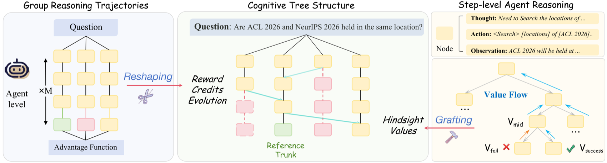

> Figure source: the T-STAR paper (source: 2026, arXiv:2604.07165)

**Key results**: consistent improvements over baselines such as GRPO across four benchmark categories — embodied, interactive, reasoning, and planning tasks.

**Relation to this chapter**: it directly improves the "credit is spread evenly across all steps" flaw of the GRPO algorithm in Section 10.5, and is a frontier solution for step-level credit assignment in multi-turn Agent RL training.

---

### [Agent-World: Scalable Synthesis of Real-World Environments and Self-Evolving Agent Training (2026)](https://arxiv.org/abs/2604.18292)

> 🧬 **In one sentence**: a self-evolving training arena — it automatically synthesizes verifiable tasks from thousands of real environment themes, and combines multi-environment RL with a self-evolving arena so that policy and environment co-evolve.

**Core problem**: LLMs are increasingly expected to act as general Agents interacting with external stateful tool environments. Protocols such as MCP provide a unified interface, but training robust Agents is still limited by the lack of realistic environments and lifelong learning mechanisms.

**Method**: Agent-World is a self-evolving training arena with two components: automatic exploration of thousands of real environment themes to build a theme-aligned database and an executable tool ecosystem, synthesizing verifiable tasks with controllable difficulty; and a multi-environment RL plus self-evolving arena mechanism that lets policy and environment co-evolve. See the arena and downstream generalization overview below:

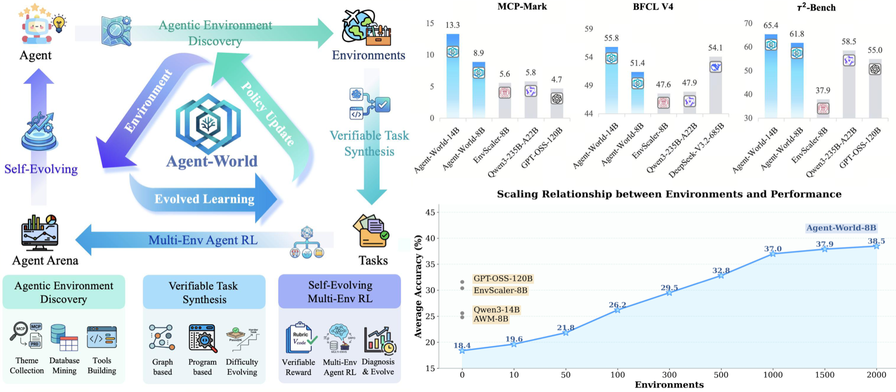

> Figure source: the Agent-World paper (source: 2026, arXiv:2604.18292)

**Key results**: Agent-World-8B/14B surpass strong proprietary models across 23 Agent benchmarks.

**Relation to this chapter**: it is a paper-level implementation of the ["Agentic data flywheel" in Chapter 11 (Self-Evolving Agents)](../chapter_self_evolving/03_data_flywheel.md) — replacing manual data annotation with automatic synthesis of real-world tasks while realizing the self-evolving closed loop of the data flywheel.

---

### [GRPO-VPS: Enhancing Group Relative Policy Optimization with Verifiable Process Supervision (2026)](https://arxiv.org/abs/2604.20659)

> 🧬 **In one sentence**: track the conditional probability the model assigns to the correct answer at each reasoning-step boundary (its "belief" shift), and use it as a model-free process supervision signal that refines trajectory rewards down to the step level.

**Core problem**: RLVR replaces a learned reward model with direct outcome verification, and GRPO dispenses with the critic — but it assigns credit indiscriminately across intermediate steps, limiting its ability to identify effective reasoning strategies and encouraging overthinking.

**Method**: GRPO-VPS introduces **model-free, verifiable process supervision** — it splits generation into discrete steps and tracks, at each segment boundary, the "conditional probability once the correct answer is appended," i.e., the model's shift in belief about that step. This serves as an interpretable measure of progress that refines trajectory-level rewards to the step level, with no auxiliary model or Monte Carlo sampling required at any point.

**Key results**: up to **+2.6 points** accuracy improvement on math tasks and up to **13.7%** shorter reasoning chains, with generalization verified across multiple model scales.

**Relation to this chapter**: it directly addresses the core "indiscriminate credit assignment" flaw of the GRPO algorithm in Section 10.5, and complements T-STAR's cognitive-tree approach in the same section — T-STAR builds step associations with a tree structure, while GRPO-VPS provides step-level signals through belief probabilities. Together they represent the two mainstream technical routes for step-level RL training in 2026.

---

### [Revisiting Reinforcement Fine-Tuning in LVLMs: Convergence, Reward Decomposition, and Generalization (2026)](https://arxiv.org/abs/2604.19857)

> 🧬 **In one sentence**: builds rigorous theory for reinforcement fine-tuning of large vision-language models — a TA-MDP proves GRPO's convergence rate, a reward decomposition theorem quantifies per-component suboptimality, and a PAC-Bayes bound explains out-of-distribution transfer.

**Core problem**: RLVR (reinforcement fine-tuning with verifiable rewards) has been remarkably successful empirically on LVLMs (e.g., Visual-ARFT), but its theoretical foundation is weak: how does a composite verifiable reward (format compliance + answer accuracy + tool executability) affect GRPO's convergence? Why does training on a small number of tool-augmented tasks transfer out of distribution? Neither question has had a rigorous answer.

**Method**: this paper introduces the **tool-augmented MDP (TA-MDP)** and proves that GRPO converges to a first-order stationary point at rate $O(1/\sqrt{T})$ under composite verifiable rewards; it establishes a **reward decomposition theorem** quantifying the suboptimality gap between per-component and joint optimization, giving guidance for reward design; and it uses a PAC-Bayes generalization bound to explain theoretically why tool-augmented policies transfer so strongly to out-of-distribution tasks.

**Key results**: it provides a rigorous mathematical foundation, along both the convergence and generalization dimensions, for LVLM reinforcement fine-tuning practices such as Visual-ARFT.

**Relation to this chapter**: it is a theoretical complement to the GRPO algorithm in Section 10.5 — establishing a rigorous mathematical basis for the RLVR paradigm along convergence and generalization, and helping readers understand "why GRPO works" and "how multiple reward components interact."

---

### [Reasoning Skill Reuse: A New Reasoning Paradigm with Fewer Tokens and Higher Accuracy (2026)](https://arxiv.org/abs/2604.21764)

> 🧬 **In one sentence**: distill reusable "reasoning skills" from broad trial-and-error exploration and store them; at inference time retrieve the relevant skills first to guide decisions, avoiding reasoning from scratch every time.

**Core problem**: reasoning LLMs often spend a large number of tokens generating verbose intermediate reasoning (CoT) on new problems, which is expensive.

**Method**: this paper proposes **summarizing and storing reusable reasoning skills** from broad trial-and-error exploration; at inference time, relevant skills are recalled for each query, helping the model avoid redundant detours and focus on effective solution paths — in contrast to the mainstream paradigm of "reasoning from scratch every time."

**Key results**: on programming and mathematical reasoning tasks it simultaneously achieves a significant drop in token usage and an increase in accuracy, lowering per-request cost and offering real economic value for industrial deployment.

**Relation to this chapter**: it corresponds to this chapter's "reasoning model efficiency optimization" and the chain-of-thought RL topic in Section 10.5. It is an innovative transplant of skill-extraction ideas (à la Voyager) into the reasoning-LLM compression setting, offering a new path for deploying efficient reasoning Agents.

---

### [Training Reasoning Models with a Tsallis Loss Continuum: An Adaptive Supervision Method Beyond GRPO (2026)](https://arxiv.org/abs/2604.25907)

> 🧬 **In one sentence**: uses the Tsallis q-logarithm to connect RLVR and log marginal likelihood into a single-parameter continuum, proves that SFT-then-RLVR is exactly a q=1→0 step schedule, and tunes the "bias level" on demand to break cold-start stagnation when the success rate is low.

**Core problem**: SFT-then-RLVR is widely used to post-train reasoning models, but "why this order" and "why pure RLVR stalls at cold start" have long lacked a unified theoretical explanation.

**Method**: this paper offers an explanation under a unified loss family $J_Q$ (defined with the Tsallis $q$-logarithm): $J_Q$ is a single-parameter family in which $q=0$ corresponds to RLVR and $q=1$ corresponds to the log marginal likelihood over latent-variable trajectories, so the standard pipeline is exactly a q=1→0 step schedule. All members share the same per-example gradient direction, differing only by a learning-rate-independent per-example amplification $P^{-q}$. Gradient-flow analysis shows that escaping the initial distribution requires $(p_0)$ time to develop the pole. Two Monte Carlo estimators, GARL (gradient-amplified RL) and PAFT (posterior-annealed fine-tuning), accompany the method.

**Key results**: achieves maj@16 = 47.9 on HotPotQA, a **14.4 percentage point** improvement over GRPO.

**Relation to this chapter**: it directly extends the theoretical boundary of the GRPO algorithm in Section 10.5, offering a unified framework to replace or augment GRPO in low initial-success-rate settings.

---

### [UCPO: Breaking RLVR's Indifference to Diversity — Uniformly Correct Policy Optimization (2026)](https://arxiv.org/abs/2605.00365)

> 🧬 **In one sentence**: reveals that GRPO optimizes only Pass@1 while ignoring Pass@K, causing "diversity collapse"; establishes the "uniformly correct policy" as the optimum and uses a conditional uniformity penalty to redirect gradients toward under-valued correct responses.

**Core problem**: RLVR yields large gains in single-shot accuracy (Pass@1) but often degrades multi-sample coverage (Pass@K) — diversity collapse. The structural cause: objectives such as GRPO are "indifferent" to how probability mass is distributed among correct solutions, which, combined with stochastic training dynamics, triggers self-reinforcing collapse — probability mass concentrates on a few correct outputs and suppresses other valid solutions.

**Method**: this paper formalizes the collapse mechanism, characterizes the optimal policy structure under two complementary criteria — robustness and entropy — and establishes the **uniformly correct policy** as the optimum; it then proposes UCPO, which adds a conditional uniformity penalty to the reward objective to redirect the gradient signal toward under-valued correct responses.

**Key results**: on math reasoning benchmarks such as AIME24, Pass@64 improves by up to **+10%** in absolute terms while Pass@1 performance is maintained.

**Relation to this chapter**: it corresponds to the GRPO section in Section 10.5, exposing the diversity blind spot of mainstream RLVR/GRPO algorithms and providing a directly integrable improvement — an important complement to GRPO.

---

### [Multi-Agent RL over Orchestration Traces: Beyond Single-Agent Action Optimization (2026)](https://arxiv.org/abs/2605.02801)

> 🧬 **In one sentence**: expands the optimization target of multi-Agent RL from "a single Agent's atomic actions" to the "orchestration layer" — spawn/delegate/communicate/aggregate/terminate — audited uniformly through the trace view of a temporal interaction graph.

**Core problem**: LLM Agents are evolving from isolated tool users into collaborating teams, so RL must optimize not only individual actions but also how work is spawned, delegated, communicated, aggregated, and terminated — yet existing RL paradigms look only at single-Agent actions.

**Method**: this paper studies RL for multi-Agent systems through a **temporal interaction graph (trace view)**: events include sub-Agent spawn, delegation, communication, tool use, return, aggregation, and stopping decisions. The trace view provides a common unit for auditing reward design, credit and signal assignment, and orchestration learning. From this perspective it identifies three technical axes: reward design in eight families (orchestration rewards target system-level properties such as parallel speedup and decomposition correctness); credit assignment; and orchestration learning.

**Key results**: by constructing an orchestration-trace dataset and training with PPO/GRPO-style methods, the system learns to decide adaptively, in hierarchical tasks, when to split a subtask and which sub-Agent to delegate it to, substantially raising the overall task success rate.

**Relation to this chapter**: it corresponds to this chapter's direction of extending the RL training paradigm, and is a frontier exploration of applying GRPO/PPO to multi-Agent orchestration optimization — a contrast and complement to the single-Agent RLVR of Section 10.5.

---

### [Selective Rollout: Mid-Trajectory Pruning for Multi-Sample Agent RL (2026)](https://arxiv.org/abs/2605.05802)

> 🧬 **In one sentence**: monitors the pairwise prefix edit distance among parallel trajectories, terminates the whole sampling group early once it converges to the same action prefix, and cuts the wasted compute of zero-variance groups.

**Core problem**: GRPO samples a small group of parallel rollouts per training prompt and computes advantage from the within-group reward spread. In agentic environments each rollout is a long multi-turn dialogue (one LLM call per step), so this multi-sampling multiplier dominates total training cost. And when every rollout in a group ends with the same reward, within-group reward variance is zero and the group contributes zero gradient — such groups account for roughly **40%** in practice, a considerable waste of compute.

**Method**: Selective Rollout monitors the **average pairwise prefix edit distance** among parallel trajectories and terminates the entire sampling group early once trajectories in the group have converged to the same action prefix, avoiding paying full compute for a group destined to yield zero gradient. See the mechanism below:

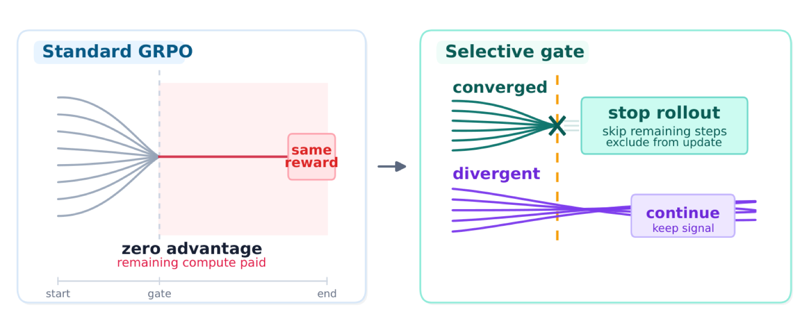

> Figure source: the Selective Rollout paper (source: 2026, arXiv:2605.05802)

**Key results**: on ALFWorld (Qwen2.5-7B) it speeds up training by **10.7%** while also improving success rate on the held-out task set by **+2.5 percentage points**.

**Relation to this chapter**: it directly targets the engineering pain point that the GRPO algorithm of Section 10.5 is too expensive in Agent training, and is the latest practice in efficiency optimization for multi-sample RL training — complementary to UCPO (which addresses diversity collapse).

---

### [A Unified Pair-GRPO Framework: Stable Alignment from Implicit to Explicit Preference Constraints (2026)](https://arxiv.org/abs/2605.06375)

> 🧬 **In one sentence**: replaces GRPO's group-normalized scalar reward with a +1/−1 binary preference reward, builds Soft and Hard variants of Pair-GRPO, and provides stability and monotonic-improvement guarantees for preference alignment.

**Core problem**: mainstream pairwise preference learning (RLHF) suffers from four issues — unstable policy updates, ambiguous gradient direction, poor interpretability, and high gradient variance.

**Method**: this paper establishes a unified theoretical framework for preference RL centered on Pair-GRPO, with two tightly coupled variants. **Soft-Pair-GRPO** is a minimal modification of GRPO — it replaces the group-normalized scalar reward with a binary pairwise preference reward (+1/−1) while keeping GRPO's clipped surrogate and KL regularization structure. **Hard-Pair-GRPO** introduces explicit local probability constraints and constrained KL-fitting optimization. The paper proves a key theorem: under a first-order Taylor expansion around the current policy, the two are equivalent, thereby unifying implicit and explicit preference constraints.

**Key results**: on benchmarks including HH-RLHF, UltraFeedback, and MuJoCo, Hard-Pair-GRPO provides theoretical guarantees of monotonic policy improvement and reduced gradient variance, surpassing existing methods in both alignment quality and training stability.

**Relation to this chapter**: it corresponds to the GRPO algorithm in Section 10.5, providing a more stable theoretical basis for preference alignment than standard GRPO. It is the latest theoretical extension of the GRPO family, complementary to UCPO (exploration diversity) and Selective Rollout (sampling efficiency).

---

### [Listwise Policy Optimization (LPO): A Unified RLVR Framework Revealing GRPO's Geometry (2026)](https://arxiv.org/abs/2605.06139)

> 🧬 **In one sentence**: reveals that group policy-gradient methods such as GRPO share the geometry of "projecting a target onto the response simplex"; LPO performs that projection explicitly through exact divergence minimization, with a monotonic-improvement guarantee.

**Core problem**: in RLVR post-training of reasoning LLMs, group-based policy gradient methods (GRPO and others) are mainstream — sample a group of responses per prompt and update the policy with group-relative advantages. But the intrinsic geometry of these methods has not been revealed, and a unified theory is lacking.

**Method**: Tsinghua and Tencent jointly propose LPO, revealing that these methods share one geometric structure: each implicitly defines a target distribution on the response simplex and projects onto it via a first-order approximation. LPO performs **target projection** explicitly — restricting the proximal RL objective to the response simplex and then realizing the projection through exact divergence minimization. See the LPO illustration below:

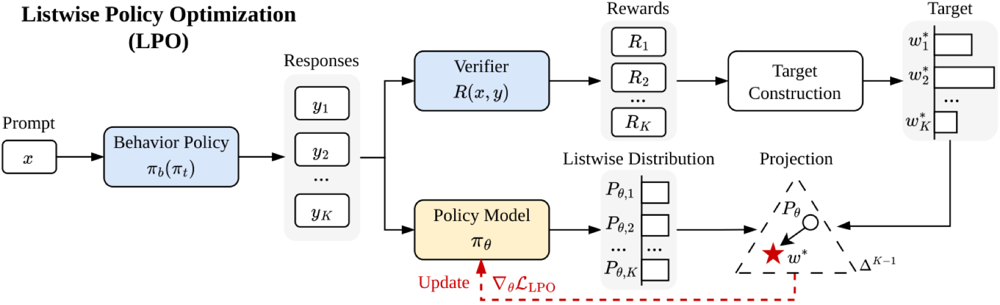

> Figure source: the LPO paper (source: 2026, arXiv:2605.06139)

**Key results**: compared with GRPO it provides a monotonic-improvement guarantee, self-correcting gradients, and flexible divergence choices; it outperforms baselines such as GRPO and REINFORCE++ on math reasoning benchmarks while preserving training stability and response diversity.

**Relation to this chapter**: it is a deep interpretation of the theoretical foundation of the GRPO algorithm in Section 10.5, recasting "why GRPO works" as a more general simplex-projection problem and giving a unified theoretical framework for designing future RLVR methods.

---

### [NSR: Near-Boundary Stochastic Rescue — Fixing GRPO's Hard-Clipping Bottleneck to Improve RLVR Training Stability (2026)](https://arxiv.org/abs/2605.22703)

> 🧬 **In one sentence**: diagnoses GRPO's hard-clipping bottleneck — useful signals just outside the threshold are discarded — and rescues them by stochastically retaining a small fraction of out-of-bound token gradients near the boundary, equivalent to implicit gradient decay but more robust.

**Core problem**: RLVR is the core paradigm for scaling LLM reasoning, but its optimization often meets training instability and suboptimal convergence. A systematic dissection of clipping-based GRPO-style objectives finds that **the rigid decision of hard clipping** is the key bottleneck — the region just outside the clipping threshold may carry informative signal, yet the standard hard-clipping rule discards it.

**Method**: NSR (Near-boundary Stochastic Rescue) **stochastically retains a small fraction of out-of-bound token gradients** near the boundary. The effect is equivalent to implicit gradient decay but is more robust than deterministic decay; once the bottleneck is precisely located, even a simple stochastic perturbation at the boundary restores meaningful performance gains. See the diagnosis and the NSR solution below:

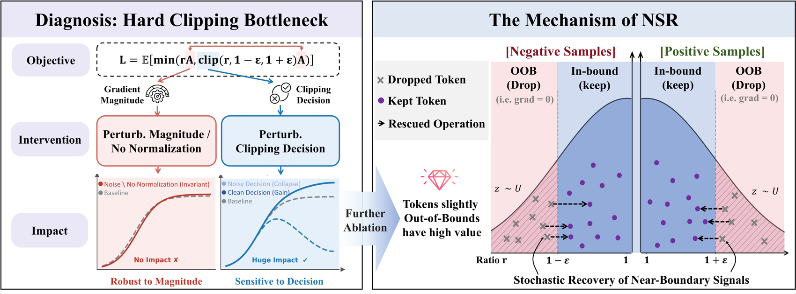

> Figure source: the NSR paper (source: 2026, arXiv:2605.22703)

**Key results**: across dense and MoE architectures from 7B to 30B, NSR consistently improves training stability and final performance over strong baselines such as DAPO and GSPO, and it is plug-and-play with no change to the sampling pipeline.

**Relation to this chapter**: it directly targets a core mechanism of GRPO in Section 10.5 — how the clipping ratio ε is handled — offering both a theoretical diagnosis and a minimal improvement, and is an important reference for understanding the root cause of RLVR optimization instability.

---

### [DelTA: Discriminative Token Credit Assignment — Making RLVR Gradients More Focused (2026)](https://arxiv.org/abs/2605.21467)

> 🧬 **In one sentence**: shows that the RLVR update direction implicitly acts as a linear discriminator over token gradients but is dominated by high-frequency formatting words; DelTA estimates token weights to amplify the gradients unique to the positive and negative sides and suppress the shared components.

**Core problem**: RLVR works well, but "how a response-level reward turns into token-level probability changes" is poorly understood. When a response-level reward is distributed across all tokens, high-frequency formatting words dominate the gradient direction and drown out the tokens that truly separate positive from negative samples.

**Method**: DelTA introduces a **discriminative view** of RLVR updates — the policy-gradient update direction implicitly acts as a linear discriminator over token gradient vectors, determining which token probabilities go up or down. Under standard sequence-level RLVR, this discriminator is formed from positive- and negative-side centroids built as advantage-weighted averages, but it is dominated by high-frequency tokens. Through discriminative analysis, DelTA estimates a weight coefficient for each token, amplifying the gradients unique to each side and suppressing the shared components. See the framework below:

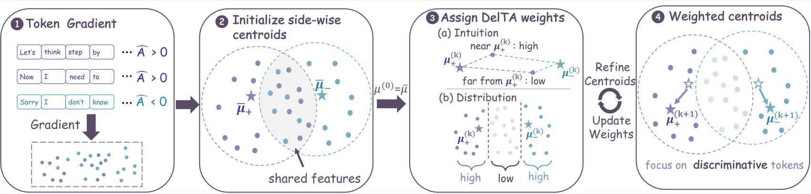

> Figure source: the DelTA paper (source: 2026, arXiv:2605.21467)

**Key results**: on seven math benchmarks it beats the strongest same-scale baselines by **3.26 and 2.62 percentage points** on Qwen3-8B and 14B respectively, and it performs well on code generation and out-of-domain evaluations.

**Relation to this chapter**: it corresponds to the reward attribution problem of GRPO in Section 10.5, revealing at token granularity the intrinsic mechanism of "sequence-level reward → token probability change," and providing a new perspective for fine-grained RLVR optimization.

---

### [GROW: A State-Action GRPO Framework for Open-World VLM Agents (2026)](https://arxiv.org/abs/2605.20246)

> 🧬 **In one sentence**: decomposes multi-turn trajectories into independent "state-action" pairs and computes relative advantage across samples to bypass whole-trajectory dependence — the first work to apply GRPO effectively to open-world VLM Agents.

**Core problem**: VLM Agents in open-world tasks (such as Minecraft) need multi-turn visual perception and action execution. But existing methods mainly rely on SFT with expert demonstrations, while advanced RL such as GRPO has not been applied effectively to multi-turn RL — standard GRPO requires a full trajectory as a training sample, making the context excessively long and very noisy.

**Method**: GROW **decomposes collected trajectories into state-action samples** and computes relative advantage across samples (rather than within a single trajectory), bypassing whole-trajectory dependence; under simplifying assumptions it also proves theoretically that this decomposition preserves GRPO's policy optimization signal. See the framework below:

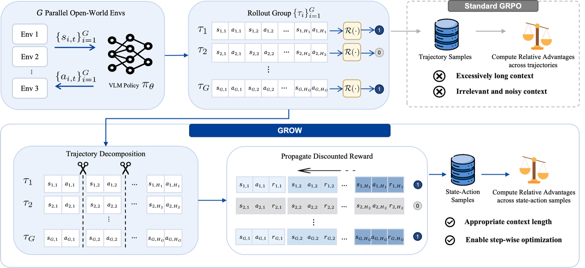

> Figure source: the GROW paper (source: 2026, arXiv:2605.20246)

**Key results**: achieves SOTA performance on more than 800 Minecraft tasks, and is the first work to apply GRPO effectively to open-world multi-turn VLM Agent RL training.

**Relation to this chapter**: it corresponds to the multi-turn trajectory application scenario of the GRPO algorithm in Section 10.5, directly resolving the "full trajectory is too long" training bottleneck and showing the latest path for extending GRPO to vision-language open-world Agents.

---

### [SRPO: Self-Reset Policy Optimization — Precise Credit Assignment for Better LLM Reasoning (2026)](https://arxiv.org/abs/2605.25507)

> 🧬 **In one sentence**: treats "reset" as a credit assignment primitive — the base model locates its own erroneous step, resamples counterfactual continuations from that state, and attributes credit precisely by comparing the continuations, with no external supervision.

**Core problem**: existing GRPO/PPO assign credit uniformly across an entire reasoning trajectory, ignoring "which step went wrong." But today's language models already have enough self-localization ability to be used as an oracle for credit assignment.

**Method**: SRPO establishes **reset as a credit assignment primitive for RL post-training**: after the base model's initial rollout fails, it locates the first erroneous thought itself and resets to that improvement point, resampling counterfactual continuations from that state and attributing credit precisely by comparing multiple continuations. Two variants are proposed: RRPO (random reset) and SRPO (model self-localized error step + reset). See the reset mechanism below:

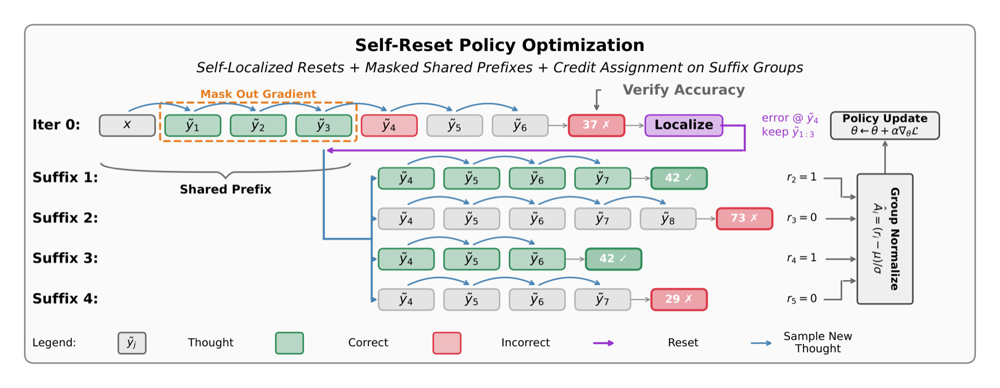

> Figure source: the SRPO paper (source: 2026, arXiv:2605.25507)

**Key results**: it consistently beats standard GRPO and RRPO across five reasoning benchmarks while using only the model itself with no external supervision; the correction rate for clean prefixes is nearly **2×** that for erroneous ones, making self-localization quality the active bottleneck.

**Relation to this chapter**: it corresponds to the credit assignment problem in Section 10.5 and is a direct fix for the "outcome reward spread uniformly across all tokens" flaw — complementary to DelTA, which does token-level weighting while SRPO does trajectory-level reset sampling.

---

### [ConSPO: Revisiting Reinforcement Learning with Verifiable Rewards from a Contrastive Perspective (2026)](https://arxiv.org/abs/2605.12969)

> 🧬 **In one sentence**: proves GRPO is equivalent to a weighted positive-negative score difference, exposes its two flaws — likelihood-misaligned scoring and score-insensitive credit assignment — and rebuilds it with sequence log-probabilities plus a group-level InfoNCE contrastive objective.

**Core problem**: GRPO is one of the most widely used RLVR algorithms, yet the essential structure of its optimization objective is not well understood, and it harbors overlooked structural flaws.

**Method**: the paper first proves that GRPO is equivalent to a **weighted positive-negative score difference** — raising sequence scores for positive samples and lowering them for negative ones, scored by the mean of clipped token-level importance sampling ratios. This exposes two flaws: **likelihood-misaligned scoring** (optimizing a clipped-ratio proxy rather than true generation likelihood) and **score-insensitive credit assignment** (the relative gap between positives and negatives in the same group goes unused). It therefore proposes ConSPO, replacing the clipped-ratio score with a length-normalized sequence log-probability and adopting a group-level **InfoNCE contrastive objective**, with a curriculum-scheduled margin that progressively sharpens positive-negative separation.

**Key results**: consistently outperforms GRPO and its variants across multiple backbone models and math reasoning benchmarks.

**Relation to this chapter**: it corresponds to the core mechanism of the GRPO algorithm in Section 10.5, redefining the RLVR optimization objective from a contrastive learning perspective. It is a principled reconstruction of the GRPO family and, together with LPO (geometric unification), DelTA (token weighting), and SRPO (trajectory reset), forms a complete research map of the credit assignment direction.

---

### [APPO: Agentic Procedural Policy Optimization — Fine-Grained Credit Assignment at Decision Points (2026)](https://arxiv.org/abs/2606.12384)

> 🧬 **In one sentence**: shows that critical decision points are spread across the whole sequence rather than concentrated at tool calls, and uses "branch scoring + process-level advantage scaling" to refine credit from tool boundaries down to fine-grained decision positions.

**Core problem**: Agentic RL mostly assigns credit over coarse heuristic units (tool-call boundaries or fixed workflows), making it hard to identify which intermediate decisions truly affect downstream outcomes. A pilot analysis shows that influential decision points are spread throughout the generated sequence rather than concentrated at tool calls, and that token entropy alone does not reliably reflect their influence on the final outcome.

**Method**: APPO studies Agentic RL from two perspectives, proposing **branch scoring** (combining token uncertainty with the likelihood gain of policy continuations) to pinpoint high-value branch points, and then **process-level advantage scaling** to refine credit from coarse interaction units down to fine-grained decision positions in the sequence. See the framework overview below:

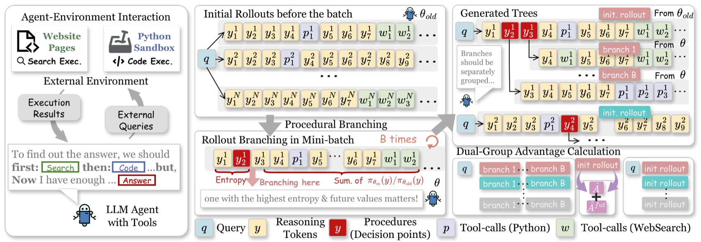

> Figure source: the APPO paper (source: 2026, arXiv:2606.12384)

**Key results**: an average improvement of about **4 percentage points** over strong baselines across 13 benchmarks, while keeping tool calls efficient.

**Relation to this chapter**: it corresponds to the credit assignment problem in Section 10.5, directly answering the two core questions of "where to branch and how to assign credit in Agentic RL." It is the latest improvement of GRPO/PPO-style methods for multi-turn tool-calling scenarios, and is methodologically complementary to DelTA (token weighting) and SRPO (trajectory reset).

---

### [GraphPO: Policy Optimization over Directed Acyclic Graphs — RLVR's Evolution from Chain to Tree to Graph (2026)](https://arxiv.org/abs/2606.18954)

> 🧬 **In one sentence**: models rollouts as a DAG — reasoning steps are edges, semantic states are nodes — merges equivalent paths to share suffixes, assigns efficiency advantage to incoming edges and correctness advantage to outgoing edges, and lowers the variance of advantage estimation.

**Core problem**: RLVR has two structural bottlenecks: independently sampled responses lead to many duplicated reasoning steps (redundant exploration), and the sparse final-answer reward makes it hard to identify valuable intermediate steps (sparse credit). Tree-based methods provide fine-grained signals by sharing prefixes and comparing branches with the same prefix, but the branches still expand independently, so information cannot be shared among similar reasoning states.

**Method**: GraphPO models rollouts as a **directed acyclic graph (DAG)** — reasoning steps are edges and the semantic states summarized from reasoning paths are nodes. Semantically equivalent paths are merged into equivalence classes, allowing suffix sharing and reallocating the compute budget from redundant expansion to diverse exploration; **efficiency advantage** is assigned to incoming edges and **correctness advantage** to outgoing edges, deriving process supervision signals from the final outcome. See the Chain→Tree→Graph evolution below:

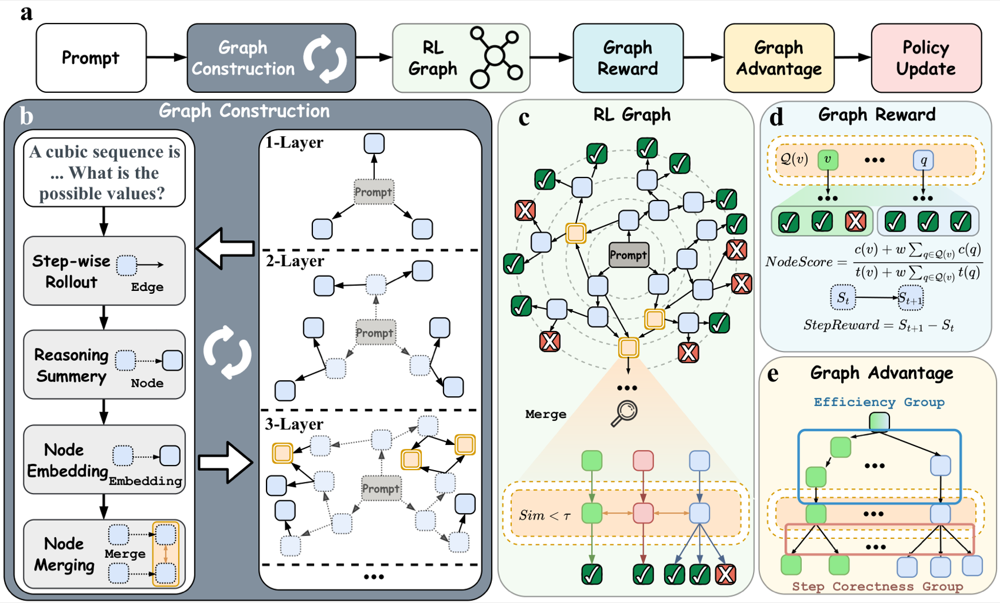

> Figure source: the GraphPO paper (source: 2026, arXiv:2606.18954)

**Key results**: it proves theoretically that GraphPO lowers the variance of advantage estimation, and across three LLMs it consistently beats chain-based and tree-based baselines on reasoning and agentic search benchmarks under the same token/response budget.

**Relation to this chapter**: it corresponds to the core mechanism of the GRPO algorithm in Section 10.5 and is the latest evolution of RLVR rollout structure from chain to tree to graph, directly addressing the GRPO family's two core flaws of redundant exploration and sparse credit. Together with ConSPO (contrastive perspective) and APPO (decision-point perspective) already covered in this chapter, it forms a multi-dimensional research map of RLVR optimization mechanisms.

---

### [G2PO: Group Graph Policy Optimization for Long-Horizon Agentic Reinforcement Learning (2026)](https://arxiv.org/abs/2606.22995)

> 🧬 **In one sentence**: converts linear trajectories into a global state-transition graph, aggregates identical observations across trajectories to cut variance, redefines actions as transition edges between state nodes, and uses edge-centric advantage estimation to pinpoint critical state transitions.

**Core problem**: long-horizon agentic RL has sparse, delayed rewards (feedback often arrives dozens of steps later), yet existing step-level frameworks still treat Agent exploration as isolated linear trajectories, ignoring the intrinsic graph structure of state transitions and thus suffering high-variance state value estimates and localized credit assignment.

**Method**: G2PO explicitly converts linear trajectories into a **global state-transition graph**: identical observations are aggregated across trajectories (group aggregation reduces sampling variance), Agent actions are redefined as transition edges between state nodes, and **edge-centric advantage estimation** normalizes TD errors over the global graph to pinpoint the state transitions that drive absolute task progress. See the framework overview below:

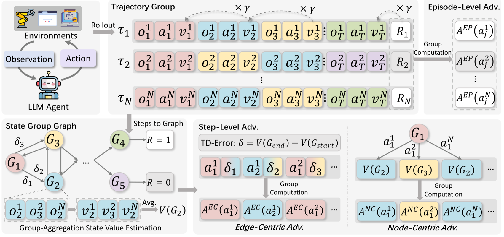

> Figure source: the G2PO paper (source: 2026, arXiv:2606.22995)

**Key results**: on three long-horizon benchmarks — WebShop, ALFWorld, and AppWorld — G2PO improves success rate over GRPO by up to **22.2%**.

**Relation to this chapter**: it corresponds to the GRPO algorithm and the credit assignment problem in Section 10.5. G2PO upgrades the exploration structure of group-based RL from linear trajectories to a global graph and is the latest breakthrough for Agentic RL in long-horizon sparse-reward settings; together with SRPO (trajectory reset) and APPO (process-level branching) already covered, it forms three perspectives on credit assignment.

---

### [Is One Layer Enough? Training a Single Transformer Layer Rivals Full-Parameter RL Training (2026)](https://arxiv.org/abs/2607.01232)

**Published**: July 1, 2026 | [arXiv:2607.01232](https://arxiv.org/abs/2607.01232)

**Core contribution**: this paper systematically studies how RL post-training gains are distributed across Transformer layers and finds that training a single Transformer layer can reproduce the vast majority of the gains from full-parameter RL training — and sometimes even exceed them. It introduces a "layer contribution" metric covering two model families (Qwen3/Qwen2.5), three algorithms (GRPO/GiGPO/Dr. GRPO), and multiple domains (math reasoning, code generation, agentic decision making), revealing a highly stable structural regularity: **RL gains concentrate in the middle layers of the Transformer stack, while the input and output ends contribute very little**, and this layer-wise structure correlates strongly across datasets, tasks, model families, and RL algorithms.

**Relation to this chapter**: it corresponds to the GRPO/RLVR algorithm mechanism in Section 10.5, revealing that RL post-training is essentially a concentrated modification of a few key layers. This offers a fresh perspective for compute-efficiency optimization and model interpretability research, and indirectly supports theoretical discussion of layer specialization in Agentic tasks.

---

### [GRPO, Dr. GRPO, and DAPO Are Three Operations on the Same Number: The Group Standard Deviation Identity (2026)](https://arxiv.org/abs/2607.00152)

**Published**: June 30, 2026 | [arXiv:2607.00152](https://arxiv.org/abs/2607.00152)

**Core contribution**: this paper proves that the three most popular LLM reasoning training methods (GRPO, Dr. GRPO, DAPO) are mathematically three variants of the same operation: they all modulate the same number — the **group standard deviation**, i.e., the spread of the correctness distribution over answers sampled repeatedly for the same problem. GRPO divides by the standard deviation, Dr. GRPO removes that division, and DAPO discards groups whose standard deviation is zero — essentially different settings of the same "knob." It proposes the **group standard deviation identity (GSI)**: for correct/incorrect rewards, the standard deviation equals the magnitude of the training update directly — problems with an even split produce the largest update, while problems that are all-correct or all-wrong contribute zero. The analysis is validated on the large, difficulty-graded Big-Math dataset and in controlled training experiments, revealing the shared essence of RLVR methods in hyperparameter tuning and problem weighting.

**Relation to this chapter**: it corresponds to this chapter's "GRPO algorithm principles" and "RLVR training mechanism" topics. GSI provides a unified theoretical view of three mainstream RL algorithms, helping readers understand each algorithm's applicable scenarios and tuning intuitions at a fundamental level. It is an important theoretical result for the interpretability of RL training mechanisms.

---

### [SAO: Single-Shot Asynchronous Optimization for Agentic RL — The GLM-5.2 Production Training Pipeline (2026)](https://arxiv.org/abs/2607.07508)

**Published**: July 8, 2026 | [arXiv:2607.07508](https://arxiv.org/abs/2607.07508)

**Core contribution**: this paper proposes single-shot asynchronous optimization (SAO) to address off-policy bias and training instability in asynchronous RL. It has three core innovations: (1) using **single-shot sampling** (one rollout per prompt) instead of GRPO's group-level sampling to reduce off-policy drift in the asynchronous pipeline; (2) introducing a **strict two-sided token-level clipping** strategy that masks divergent updates to improve optimization stability; and (3) an enhanced value model training design (the value model updates faster than the policy, with observation-skipping GAE). SAO has been deployed in the Agentic RL training pipeline of the open-source GLM-5.2 (750B-A40B MoE), training stably for thousands of steps and consistently beating GRPO and its variants on SWE-Bench Verified (29.8%), BeyondAIME, and IMOAnswerBench.

**Relation to this chapter**: it corresponds to the GRPO algorithm and asynchronous training topics in Section 10.5. SAO is the first asynchronous Agentic RL method verified as feasible on a production-scale hundred-billion-parameter model, exposing the efficiency bottleneck of group-level sampling in long-horizon Agent tasks and providing a new engineering paradigm for large-scale Agent RL training.

---

### [SEED: Self-Evolving On-Policy Distillation for Agentic Reinforcement Learning (2026)](https://arxiv.org/abs/2607.14777)

**Published**: July 16, 2026 | [arXiv:2607.14777](https://arxiv.org/abs/2607.14777)

**Core contribution**: SEED targets a core pain point of Agentic RL — outcome-based sparse rewards cannot guide intermediate decisions — with a "hindsight skill distillation" mechanism: it first distills natural-language "hindsight skills" from completed on-policy trajectories (reusable workflows from successful trajectories, error-correction rules from failed ones), then converts the change in action probability under skill guidance into a dense token-level training signal, jointly optimized with GRPO. The training loop lets skill analysis and policy updates co-evolve, requiring no external memory or extra models. It steadily improves performance and sample efficiency on both text and visual Agentic benchmarks and shows robust generalization to unseen scenarios.

**Relation to this chapter**: it corresponds directly to this chapter's "credit assignment in Agentic RL" and "supervision signals under sparse rewards" topics. SEED brings a hindsight perspective into online RL optimization and, together with SRPO (reset-based credit), APPO (process-level rewards), and DelTA (token-level weighting) already covered, forms a four-dimensional credit assignment map spanning outcome → path → step → hindsight.

---

### [TCR: Thinking Checklist Reward — Process Rewards for RL Preference Alignment (2026)](https://arxiv.org/abs/2607.19824)

**Published**: July 22, 2026 | [arXiv:2607.19824](https://arxiv.org/abs/2607.19824)

**Core contribution**: most current RL-based preference alignment methods rely on outcome-level rewards that mainly judge the final response and offer limited guidance for the reasoning trajectory — when several responses receive similar final scores, credit assignment becomes coarse. This paper proposes **TCR (Thinking Checklist Reward)**, a process-oriented reward for RL preference alignment: it automatically turns preference pairs into sample-specific "thinking checklists" used to assess whether the generated reasoning trajectory covers the key considerations implied by the preference. To reduce overlap with outcome-level supervision, TCR further introduces an **exponential moving average residual formulation (EMA residual)** that isolates a complementary "thinking surplus" from the part predictable by the outcome reward. Across five models from three model families, TCR consistently improves alignment performance on diverse benchmarks, and ablations further confirm the importance of the EMA residual formulation and sample-specific checklist supervision.

**Relation to this chapter**: it corresponds directly to this chapter's "RLVR training signal design" and "credit assignment" topics. TCR extends process rewards from "step-level correctness verification" to "coverage checking of the reasoning process," and together with DelTA (token-weighted assignment), SRPO (trajectory reset), and APPO (process-level advantage branching) already covered, forms a map of credit assignment methods from outcome to process — the latest attempt in preference alignment to make the chain of thought "evaluable."

---

### [ESTR: Entropy-Scaled Trust Region — Precise Correction of Off-Policy Bias in Asynchronous RL (2026)](https://arxiv.org/abs/2607.22186)

**Published**: July 24, 2026 | [arXiv:2607.22186](https://arxiv.org/abs/2607.22186)

**Core contribution**: asynchronous RL accelerates training by overlapping rollout generation with policy optimization, but the resulting stale off-policy data undermines optimization stability. Existing methods apply importance-ratio thresholds uniformly across all token positions, ignoring a key regularity: **the natural scale of the importance ratio varies systematically with token entropy** — on low-entropy tokens the training-inference discrepancy is greatly amplified, while on high-entropy tokens in-flight weight updates themselves induce reasonable exploration bias. ESTR (Entropy-Scaled Trust Region) scales each token's off-policy bias by its local entropy, requiring no auxiliary forward pass or explicit version-switch detection. Compared with synchronous GRPO, ESTR achieves comparable accuracy on long-horizon agentic tasks and math reasoning benchmarks with a **2.6×** training speedup, making it the best training-inference consistency solution to date among synchronous and asynchronous RL methods.

**Relation to this chapter**: it corresponds directly to this chapter's "GRPO algorithm mechanism" and "asynchronous RL training optimization" topics. ESTR reinterprets the correction scale of importance sampling from the perspective of token entropy and, together with SAO (single-shot sampling pipeline) and SEED (hindsight distillation) already covered, forms a three-dimensional engineering map of Agentic RL: sampling strategy → training signal → stability correction.

---

### [ODYSSE: Episode-Wise GRPO — A Reinforcement Fine-Tuning Framework for Personalized Agentic Reasoning (2026)](https://arxiv.org/abs/2607.25369)

**Published**: July 28, 2026 | [arXiv:2607.25369](https://arxiv.org/abs/2607.25369)

**Core contribution**: in real-world settings user requests are often ambiguous with an open solution space, so an Agent must interact over multiple turns with both the user and the environment to infer personalized preferences — the core challenge of "personalized agentic reasoning." ODYSSE proposes **ESPO (Episode-wise GRPO)**: unlike standard GRPO, which optimizes each step independently, ESPO introduces an **episode-level reward mechanism** and **episode advantage estimation**, letting upstream evidence effectively guide downstream personalized decisions so the Agent progressively resolves an ambiguous request over multiple turns. A companion episode batch sampler groups the actions of the same episode into a unified training batch, ensuring consistent optimization under ESPO. On long-horizon personalized GUI reasoning tasks, ODYSSE consistently outperforms both specialized models and general-purpose LVLMs.

**Relation to this chapter**: it corresponds directly to this chapter's "GRPO algorithm principles" and "long-horizon Agentic RL" topics. ESPO upgrades GRPO's advantage estimation from "independent per step" to "jointly across steps within an episode" and is the latest breakthrough in applying RLVR to personalized scenarios requiring multi-turn user-environment interaction; together with SAO (asynchronous pipeline) and SEED (hindsight distillation) already covered, it broadens the application boundary of Agentic RL.

---

### [KGPS: A Kalman-Filter-Driven Dynamic Prompt Selection Framework for RL Fine-Tuning (2026)](https://arxiv.org/abs/2607.27610)

**Published**: July 30, 2026 | [arXiv:2607.27610](https://arxiv.org/abs/2607.27610)

**Core contribution**: the effectiveness of RL fine-tuning depends heavily on how well prompt difficulty matches the current policy level, but existing methods face a dilemma: evaluation-based methods are accurate but expensive, while prediction-based methods are efficient but assume difficulty is static — inconsistent with the non-stationary dynamics of RL training. KGPS (Kalman-Guided Prompt Selection) reframes prompt selection as a **dynamic state estimation problem**: a linear-Gaussian state space model represents each prompt's latent success rate in logit space, with process noise coupled to the magnitude of policy updates (larger policy changes mean higher uncertainty); a Kalman filter maintains a calibrated posterior, and samples are selected to maximize expected posterior training utility (favoring medium-difficulty prompts and naturally revisiting uncertain ones). Across math, planning, and geometric reasoning benchmarks and multiple RL algorithms, KGPS consistently beats strong baselines on both final accuracy and rollout efficiency: on DeepSeek-R1-Distill-7B it uses **83% fewer rollouts** than DS, with an average performance gain of 0.12 points across six math benchmarks.

**Relation to this chapter**: it corresponds directly to this chapter's "GRPO training efficiency" and "RL fine-tuning engineering optimization" topics. From a curriculum-design angle, KGPS solves the core question of "when to use prompts of what difficulty" in non-stationary RL training and, together with SAO (pipeline asynchrony) and ESTR (entropy-scaled correction) already covered, forms the three elements of Agentic RL training efficiency: sampling strategy, stability correction, and curriculum selection.

---

### [Start Classifying: A Categorical Critic for LLM Reinforcement Learning (2026)](https://arxiv.org/abs/2608.02181)

**Published**: August 4, 2026 | [arXiv:2608.02181](https://arxiv.org/abs/2608.02181)

**Core contribution**: the Critic in PPO for LLM post-training traditionally estimates state value with a continuous value, but there is a mismatch between a continuous regression target and the actual distribution of rewards — rewards often take only sparse discrete values (success/failure, step-level scores), forcing a continuous Critic to over-smooth, which leads to high training variance and slow convergence. This paper replaces the Critic with a **categorical Critic**: the value distribution is discretized into bins and trained with categorical cross-entropy, so the actual shape of the reward distribution is modeled more accurately. At almost no additional compute cost, the categorical Critic improves training stability and calibration under both the PPO and RLVR training paradigms, making it a pragmatic engineering improvement for LLM RL post-training.

**Relation to this chapter**: it corresponds directly to this chapter's "PPO algorithm principles" and "RL training stability" topics. From the angle of Critic design, the categorical Critic adds another training-improvement path beyond the GRPO family (which bypasses the Critic via within-group relative advantages) and, together with ESTR (entropy-scaled stability) and KGPS (curriculum selection) already covered, points toward multi-dimensional optimization of training signal quality in Agentic RL.

---
