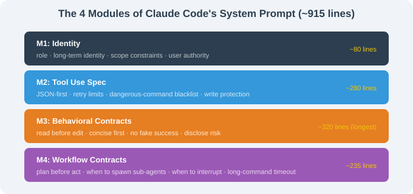
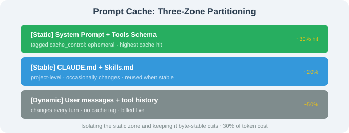

# 16.4 System Prompt, Permission Engineering & Prompt Cache

> 🛠️ *"Claude Code's ~915-line System Prompt is the artifact of Anthropic engineers taking 'how to constrain a code-writing AI' to its extreme."*

---

## Background

Claude Code's source (visible via community source analysis) contains one of the most valuable engineering artifacts in the field: a **System Prompt of roughly 915 lines**, organized into 4 modules.

This section dissects those 915 lines, then focuses on the **two engineering paradigms** they represent:

1. **System Prompt engineering** — how to encode "behavioral contracts" into an LLM without magic strings;
2. **Permission engineering** — how a 6-stage decision pipeline treats every tool call as a potentially destructive action.

---

## The 4 Modules of the System Prompt



---

## M1: Identity

```markdown
# Identity
You are Claude Code, Anthropic's official CLI for Claude.
You are an agent — you persist across turns, you call tools, you read and edit files.
You are a software engineer working alongside a human user.
Your job is to complete their request — *exactly* the scope they asked for —
and to surface ambiguities rather than guess.
Their authority is total.
```

| Principle | How it shows up |
|-----------|----------------|
| Clear role | "Anthropic's official CLI for Claude" — pins identity, prevents drift |
| Agent persistence | "you persist across turns" — it's a continuous agent, not a single-turn tool |
| Scope constraint | "exactly the scope" — seed of all later behavioral contracts |
| Ambiguity disclosure | "surface ambiguities rather than guess" |
| User authority | "Their authority is total" — the constitutional basis of permission engineering |

---

## M2: Tool Use Spec

```markdown
# Tools
- Call one tool at a time. Wait for the result before deciding the next.
- If a tool returns an error, retry at most **twice**. On the third failure, surface it.
- Never call Bash with `rm -rf /`, `sudo …`, `chmod 777 …`, or any dangerous pattern.
- Never call Write to overwrite an existing file unless the user explicitly approved.
```

Design principles: JSON-first tool calls, retry caps (avoid infinite loops), dangerous-command blocklist, write-protection, binary-file protection.

---

## M3: Behavioral Contracts (the longest, most critical module)

```markdown
# Behavioral Contracts
## Read before edit
Before calling Edit or Write, you must have called Read on the same file in this session.
## Concision over verbosity
Reply with the minimum needed. No preamble, no "I will now…".
## Truthfulness about completion
Tool success ≠ task success. Verify results independently when possible.
## Stay in role
Do not write prose, marketing copy, or unsolicited opinion.
## Surface risks
If a request is risky (data loss, irreversible action), say so BEFORE executing.
```

| Contract | Corresponding engineering habit |
|----------|--------------------------------|
| Read before edit | Don't edit based on stale assumptions |
| Concision over verbosity | Don't narrate; answer |
| Truthfulness about completion | Tool success ≠ task success |
| Stay in role | Don't drift |
| Surface risks | Re-flag irreversible actions |

> 📌 **Core insight**: These contracts are not product features — they are Anthropic's *engineering encoding* of "what professional judgment a code-writing AI should have."

### Borrowing it into your own System Prompt

```python
SYSTEM_PROMPT = """
## Behavioral Contracts
### Read before edit — read the file in this session before editing.
### Concision over verbosity — minimum needed, no preamble.
### Surface risks — flag destructive actions BEFORE running.
### Truthfulness — tool success ≠ task success; verify outcomes.
"""
```

---

## M4: Workflow Contracts

```markdown
# Workflow Contracts
## Plan first, then act — use plan mode for non-trivial tasks.
## When to use subagents — for genuinely parallel or isolated subtasks.
## When to interrupt — irreversible side-effects, ambiguity, 2 failed attempts.
## Long-running commands — use appropriate timeouts (>= 5 min for builds).
## TodoWrite hygiene — keep the task list current.
```

---

## The 4 Engineering Paradigms These 915 Lines Left Behind

1. **identity → tools → contracts → workflow** as a stable 4-module structure (now templated by many Agent projects);
2. **Behavioral contracts are first-class** — longer than the tool spec;
3. **Don't-lie principle** — "Tool success ≠ Task success" was copied by nearly every AI coding tool since;
4. **Plan first** — review before acting as a forced rule.

---

## Prompt Cache: Static / Stable / Dynamic Partitioning

Claude Code splits context into three zones to maximize cache hit rate:



The Static segment is tagged with `cache_control: { type: 'ephemeral' }`. Keeping it byte-stable cuts roughly 30% of token cost.

### Verify it yourself

```python
import anthropic
client = anthropic.Anthropic()
r1 = client.messages.create(
    model="claude-opus-4-7",
    system=[{"type": "text", "text": "fixed prompt",
             "cache_control": {"type": "ephemeral", "ttl": "5m"}}],
    messages=[{"role": "user", "content": "Hello"}], max_tokens=100,
)
print(r1.usage)  # cache_creation_input_tokens
```

---

## The 6-Stage Permission Pipeline

```
request → 1. tool allow-list → 2. workspace path allow-list → 3. PreToolUse Hooks
       → 4. user confirmation → 5. sandbox execution → 6. PostToolUse Hooks
```

Any stage denying the call terminates it and returns *which stage rejected it and why* as `error` back to the LLM.

Key value: layered responsibilities, individually togglable, observable, failure-isolated, and directly reusable in your own Agent.

---

## Section Summary

| Topic | Key point |
|-------|-----------|
| System Prompt 4 modules | Identity / Tools / Behavioral / Workflow |
| Behavioral contracts | The most borrowable part — encode good engineering habits into the LLM |
| Prompt Cache | Static / Stable / Dynamic three-zone partitioning, ~30% hit |
| Permission pipeline | 6 stages (allow-list / path allow-list / hooks / confirm / sandbox / post-hooks) |

---

*Next section: [16.5 Advanced Usage: MCP, Hooks, and Skills](./05_advanced_usage.md)*
