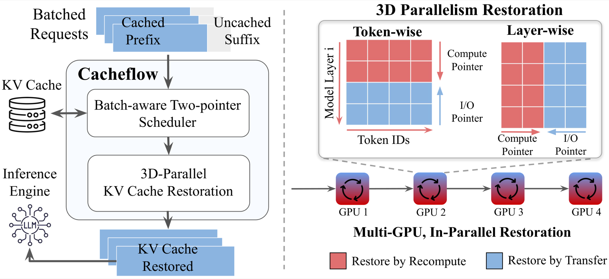
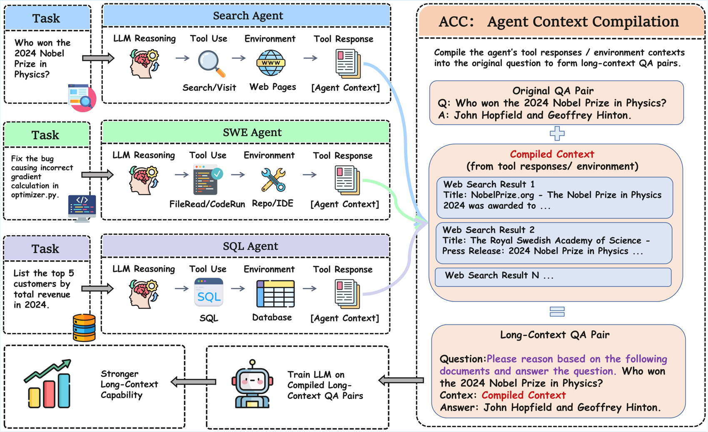
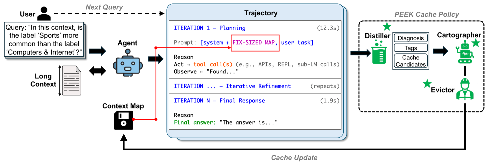
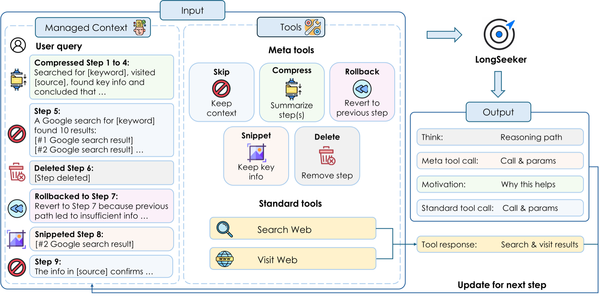
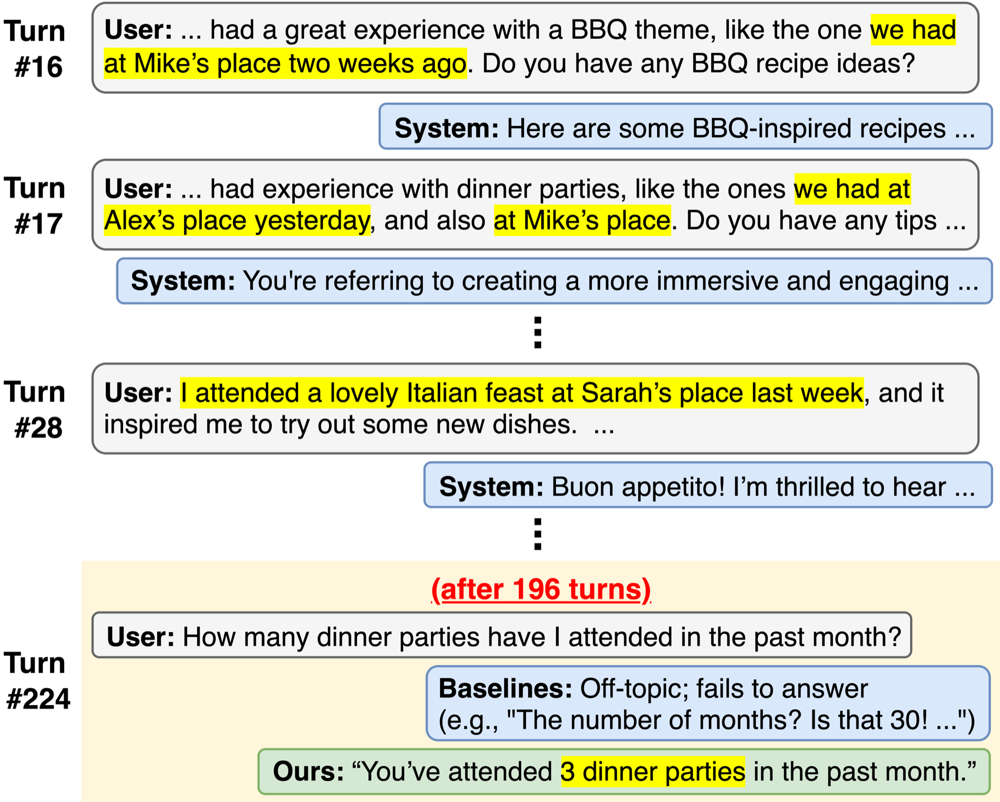

# 7.5 Latest Advances in Context Engineering

> 🔬 *"The expansion of context windows is not the destination — the real challenge is how to efficiently utilize the 'attention bandwidth' of every token."*

In previous sections, we learned the theoretical foundations of context engineering — from the distinction between context vs. prompt engineering, attention budget management, to long-horizon task strategies and GSSC practices. These are the "fundamentals." This section discusses the **latest technological breakthroughs and methodological evolutions** happening in this field, which are fundamentally changing how Agent developers manage context.

In June 2025, Andrej Karpathy publicly stated his preference for using "Context Engineering" over "Prompt Engineering" as a term [1]. Subsequently, Anthropic [2], LangChain [3], and other leading institutions released systematic context engineering guides. From 2025 to 2026, context engineering rapidly evolved from an emerging concept into a **core engineering discipline** of Agent development.


## Million-Level Context Windows: From Arms Race to Practical Implementation

### The Explosive Growth of Context Windows

From 2024 to 2026, context windows experienced a leap from hundreds of thousands to tens of millions:

| Period | Representative Model | Context Window | Equivalent Text Volume |
|------|---------|-----------|-----------|
| Early 2023 | GPT-3.5 | 4K tokens | ~3,000 words |
| Mid 2023 | Claude 2 | 100K tokens | ~75,000 words |
| 2024 | GPT-4 Turbo | 128K tokens | ~96,000 words |
| Early 2025 | Gemini 2.5 Pro | 1M tokens | ~750,000 words (about 10 books) |
| Mid 2025 | Llama 4 Scout | 10M tokens | ~7,500,000 words (about 100 books) |
| Jul 2026 | Claude Opus 4.8 / Sonnet 4.8 | 1M+ tokens | 1M token standard pricing, no long-context surcharge |
| Jul 2026 | GPT-5.5 | 272K (standard) / 2M (extended) | 2× premium for input exceeding 272K |
| Jul 2026 | Gemini 3.1 Pro | 1M+ tokens | Supports video/audio/image/text multimodal |
| 2026 (experimental) | Magic.dev LTM-2-Mini | 100M tokens | ~75,000,000 words (theoretical, no public user verification yet) |

Two key trends are worth noting:

**1. Million-level becomes standard**: By July 2026, Claude 4.8, Gemini 3.x, Llama 5, and other mainstream models all provide 1M+ token context windows. This means "entire book" or even "entire codebase" level input is no longer a dream.

**2. Pricing strategy divergence**: Anthropic (Claude 4.8) implements standard pricing for 1M+ tokens with no additional fees; while OpenAI (GPT-5.5) charges a significant premium beyond 272K. This pricing strategy directly affects Agent architecture choices.

But bigger windows ≠ problem solved. The **Lost-in-the-Middle** problem we discussed in Section 7.2 has not disappeared — in fact, when windows balloon from 128K to 1M, this problem becomes even more severe.

### Real Testing: The True Capability of Large Windows

```python
# A real test: retrieving specific information in a 1M token context
import time

def needle_in_haystack_test(model, context_size, needle_position):
    """
    Classic "needle in a haystack" test
    Insert a key piece of information at a specific position amidst extensive filler text,
    then ask the model to answer questions related to that information
    """
    haystack = generate_padding_text(context_size)
    needle = "The secret number for project Moonlight is 42-ALPHA-7."
    
    # Insert key information at the specified position
    position = int(len(haystack) * needle_position)
    context = haystack[:position] + needle + haystack[position:]
    
    response = model.query(
        context=context,
        question="What is the secret number for project Moonlight?"
    )
    return response

# Measured results for each model in 2026 (retrieval accuracy)
results = {
    "Claude Opus 4.8 (1M)": {
        "Beginning 10%": "✅ 99%",
        "Middle 50%": "✅ 97%",  # Most uniform performance across 1M range
        "End 90%": "✅ 99%",
        "Full 100%": "✅ 95%",  # Quality remains stable even at million-level windows
    },
    "Gemini 3.1 Pro (1M)": {
        "Beginning 10%": "✅ 99%",
        "Middle 50%": "✅ 96%",  # Significantly improved Lost-in-the-Middle
        "End 90%": "✅ 98%",
        "Full 100%": "⚠️ 89%",  # Still has performance degradation near full capacity
    },
    "GPT-5.5 (272K standard)": {
        "Beginning 10%": "✅ 99%",
        "Middle 50%": "✅ 93%",
        "End 90%": "✅ 97%",
        "Full 100%": "⚠️ 88%",
    },
    "DeepSeek R1 (128K)": {
        "Beginning 10%": "✅ 98%",
        "Middle 50%": "⚠️ 88%",
        "End 90%": "✅ 95%",
        "Full 100%": "⚠️ 82%",
    },
}
```

> 💡 **Practical Advice**: Don't blindly pursue maximum window size. If 128K is sufficient, don't fill 1M. **Context quality is far more important than context quantity** — this is the first principle of context engineering. A solution with perfect recall within 100K tokens often outperforms one with unstable performance at 500K tokens.

## Anthropic's Context Engineering Methodology: From Practice to Theory

On September 29, 2025, Anthropic published the landmark technical article "Effective Context Engineering for AI Agents" [2], systematically summarizing for the first time a production-grade Agent context management methodology. This article has had a profound impact on the entire industry.

### Core Philosophy: Context is a Limited and Precious Resource

Anthropic's core viewpoint is: **find the minimal set of high-signal tokens that maximizes the probability of desired outcomes**. This aligns with the "quality first" principle we discussed in Section 7.1, but Anthropic provides a more actionable framework from an engineering practice perspective.

```python
# Core principles of Anthropic context engineering (expressed in pseudocode)
class AnthropicContextPhilosophy:
    """
    Core philosophy: Context is a finite resource with diminishing marginal returns
    
    As token count increases:
    - First 10K tokens: High information gain per token
    - 10K~50K: Information gain begins to diminish
    - 50K~200K: Requires careful curation to maintain signal density
    - 200K+: Without management, noise may overwhelm signal
    """
    
    principles = [
        "Find the minimal set of high-signal tokens",        # More is not better
        "Re-curate context at each inference call",          # Context is dynamic
        "Treat context as a resource with diminishing returns", # The 100K-th token is far less valuable than the 1K-th
        "Do the simplest thing that works",                  # Over-engineering is also wasteful
    ]
```

### The Three Pillars of "Effective Context"

Anthropic breaks down the composition of high-quality context into three layers:

**1. System Prompt Design — Finding the Right "Altitude"**

```python
# ❌ Overly Prescriptive — too granular, fragile
system_prompt_bad_1 = """
When users ask about files, first check if the file exists. If it exists and is less than 100KB,
read it directly. If greater than 100KB but less than 1MB, use chunked reading. If greater than 1MB,
first check the file type. If it's a text file, use streaming...
"""

# ❌ Too Vague — lacks practical guidance
system_prompt_bad_2 = """You are a helpful programming assistant. Please do your best to help the user."""

# ✅ The right "altitude" — clear principles + appropriate flexibility
system_prompt_good = """
You are a professional programming assistant.
<core_principles>
- Before modifying code, first understand the intent of the existing code
- Prioritize using the project's existing patterns and conventions
- For destructive operations (deleting files, rewriting modules), confirm before executing
</core_principles>

<tool_usage>
You can use tools such as read_file, write_file, search.
Follow the principle of least privilege when selecting tools — prefer read over write, prefer search over full scan.
</tool_usage>
"""
```

**2. Tool Definitions — The Interface Contract Between Agent and World**

```python
# Anthropic's tool design principles
tool_design_principles = {
    "Token Efficient": "Tool returns should be concise, don't return large blocks of irrelevant information",
    "Non-Overlapping Functions": "Like a well-designed function library, each tool has a single responsibility",
    "Self-Contained": "Tool descriptions should be clear enough that — if a human engineer can't determine when to use it, the AI won't be able to either",
    "Robustness": "Gracefully handle erroneous inputs, return useful error messages",
}

# ❌ Bad tool design: overlapping functions, ambiguous descriptions
tools_bad = [
    {"name": "search_files", "description": "Search files"},
    {"name": "find_files", "description": "Find files"},      # What's the difference from the above?
    {"name": "lookup_files", "description": "Query file contents"}, # Even more ambiguous
]

# ✅ Good tool design: Clear responsibilities, no ambiguity
tools_good = [
    {"name": "glob_search", "description": "Search by file name pattern (e.g., *.py), returns list of matching file paths"},
    {"name": "content_search", "description": "Search file contents by regex match, returns matching lines and context"},
    {"name": "read_file", "description": "Read all or part of a file at a specified path (supports offset+limit)"},
]
```

**3. Just-in-Time (JIT) Context — Anthropic's Secret Weapon**

This is Anthropic's most influential practice pattern. The core idea is: **don't preload all potentially needed information; instead, maintain lightweight identifiers and retrieve on-demand at runtime**.

```python
class JustInTimeContextStrategy:
    """
    Just-in-Time Context Strategy (Core pattern of Anthropic / Claude Code)
    
    Traditional approach: Preload all potentially relevant files into context
    JIT approach: Only maintain file paths/query pointers, load only when needed
    
    Result: Context usage reduced by 70%+, and information is more precise
    """
    
    def __init__(self):
        # Maintain lightweight identifiers, not full content
        self.file_index = {}       # file path → brief summary
        self.query_pointers = {}   # query description → database/API endpoint
        self.web_links = {}        # topic → URL
    
    def build_initial_context(self, task):
        """Initial context only contains 'maps', not 'territory'"""
        return {
            "system": self.system_prompt,
            "task": task,
            "available_resources": {
                "files": list(self.file_index.keys()),    # Only paths
                "databases": list(self.query_pointers.keys()),
                "docs": list(self.web_links.keys()),
            },
            # Tell the Agent: You have these resources available, actively fetch them when needed
            "instruction": "Use tools to fetch specific content on demand, don't guess."
        }
    
    def on_agent_request(self, resource_type, identifier):
        """Only load specific content when the Agent actively requests it"""
        if resource_type == "file":
            return read_file(identifier)  # Only now read the file
        elif resource_type == "database":
            return execute_query(self.query_pointers[identifier])
        elif resource_type == "web":
            return fetch_url(self.web_links[identifier])
```

> 💡 **Claude Code's Actual Practice**: Claude Code only reads the `CLAUDE.md` file in the project root at startup (equivalent to the project's "manual"), then navigates the entire codebase on-demand through primitives like `glob` and `grep`. It never loads the entire codebase into context — even though the model window is "large enough." This is a typical application of JIT thinking.

## ACE: Self-Evolving Context Engineering (ICLR 2026)

In October 2025, Zhang et al. proposed the **ACE (Agentic Context Engineering)** framework in their paper [4], which was accepted by ICLR 2026. This is an important breakthrough in the context engineering field — **letting the Agent learn to manage and optimize its own context**.

### Core Problem: Context Collapse

Traditional context management faces two chronic issues:

- **Brevity Bias**: When compressing summaries, domain-depth insights are lost; the more you compress, the more "generic" they become
- **Context Collapse**: In iterative rewriting, details are gradually eroded over time, until eventually "summaries of summaries" become completely non-informative

```python
# An intuitive understanding of context collapse
def context_collapse_demo():
    """
    Simulate the context collapse process
    
    Each compression loses some details. After 5-10 rounds of compression,
    the original information may only retain the highest-level abstractions — 
    specific numbers, conditional branches, and edge cases are all lost
    """
    original = """
    When processing order #12345, we discovered: when a user simultaneously uses 
    Coupon A (¥50 off when spending ¥300+) and member discount (20% off), 
    the system incorrectly applies the discount first, then the coupon,
    resulting in an actual deduction of 50 + (300-50)*0.2 = 100,
    while the correct logic should be 300*0.8 - 50 = 190, a discrepancy of ¥90.
    Fixed in calculate_discount() function in order_service.py,
    requires regression testing of test_discount_combination_cases().
    """
    
    # 1st round compression
    round_1 = "Fixed the calculation order error when coupon and member discount are used together, ¥90 discrepancy"
    # 2nd round compression  
    round_2 = "Fixed a discount calculation error"
    # 3rd round compression
    round_3 = "Fixed a bug"
    # → Specific order number, amounts, file location, test cases — all lost!
```

### The ACE Framework: Letting Context Self-Evolve

ACE's core innovation is treating context as an **"evolving playbook"**, achieving self-improvement through three modular phases:

```python
class ACEFramework:
    """
    ACE: Agentic Context Engineering
    
    Core idea: Context is not static text, but an "evolving playbook"
    that continuously improves based on the Agent's execution experience
    
    Three phases form a cycle: Generate → Reflect → Curate
    """
    
    def __init__(self, base_context):
        self.playbook = base_context  # Initial context (playbook)
        self.experience_buffer = []    # Experience buffer
    
    # Phase 1: Generate
    def generate(self, task):
        """
        Agent executes the task using the current playbook,
        collects feedback during execution (success/failure/surprises)
        """
        result = self.agent.execute(task, context=self.playbook)
        feedback = self.collect_natural_feedback(result)
        self.experience_buffer.append({
            "task": task,
            "result": result,
            "feedback": feedback,  # Natural execution feedback, no human annotation needed
        })
        return result
    
    # Phase 2: Reflect
    def reflect(self):
        """
        Analyze execution feedback in the experience buffer,
        identify areas in the playbook that need improvement
        """
        insights = self.agent.analyze(
            prompt="Analyze the following execution experiences, identify success patterns and failure causes:",
            data=self.experience_buffer
        )
        return insights  # e.g., "When encountering nested JSON, validate schema first"
    
    # Phase 3: Curate
    def curate(self, insights):
        """
        Key innovation: Structured incremental updates, not full rewrites
        
        - New strategies are added as 'patches' to the playbook
        - Obsolete strategies are tagged and cleaned up
        - Preserves detail depth, preventing context collapse
        """
        self.playbook = self.incremental_update(
            current=self.playbook,
            new_insights=insights,
            mode="structured_patch"  # Incremental patches, not full rewrites
        )
    
    def evolution_loop(self, tasks):
        """Complete evolution cycle"""
        for task in tasks:
            self.generate(task)
            if len(self.experience_buffer) >= 5:  # Reflect every 5 tasks
                insights = self.reflect()
                self.curate(insights)
                self.experience_buffer.clear()
```

### ACE Experimental Results

| Benchmark | Baseline Performance | ACE Improvement | Notes |
|---------|---------|---------|------|
| AppWorld (Agent tasks) | Baseline model | **+10.6%** | Using smaller open-source models, matching top production Agents |
| Financial domain tasks | Baseline model | **+8.6%** | Domain knowledge continuously accumulates through iterations |
| Adaptation latency | Fine-tuning approach | **Significantly reduced** | No retraining needed, only context updates |
| Deployment cost | Fine-tuning approach | **Significantly reduced** | One context applies to all instances |

> 💡 **Why is this important?** ACE proves an exciting possibility: **Agents can self-improve by optimizing context, without fine-tuning model weights**. This means even with smaller open-source models, through careful context engineering, you can achieve performance comparable to large commercial models. For teams with limited resources, this is an extremely cost-effective path.

## Context Caching: The Economics of Context Reuse

### The Problem: Repeatedly Paying the "Context Tax"

In traditional mode, every API call requires resending the complete System Prompt + tool definitions + conversation history. If your Agent has an 8K token system prompt, you're paying for these 8K tokens every round of conversation.

```python
# Traditional mode: Fully resend everything each time
for user_message in conversation:
    response = client.chat.completions.create(
        model="gpt-5.4",
        messages=[
            {"role": "system", "content": system_prompt},  # 8K tokens, repeated every time
            *conversation_history,                          # Constantly growing
            {"role": "user", "content": user_message},
        ],
        tools=tool_definitions,  # 2K tokens, repeated every time
    )
    # If the conversation has 100 rounds, system_prompt is "billed" 100 times
```

### Solution: Prompt Caching

From 2024 to 2025, major providers successively introduced **Prompt Caching**. By 2026, this has become a **standard optimization** for Agent development:

```python
# Anthropic Prompt Caching example (latest API as of 2026)
from anthropic import Anthropic

client = Anthropic()

# First call: cache the system prompt (cache writes incur a 25% additional cost)
response = client.messages.create(
    model="claude-sonnet-4.6",
    max_tokens=1024,
    system=[
        {
            "type": "text",
            "text": long_system_prompt,      # Large system prompt
            "cache_control": {"type": "ephemeral"}  # Mark as cacheable
        }
    ],
    messages=[{"role": "user", "content": "Hello"}]
)

# Subsequent calls: cache hit, input price reduced by 90%!
# Same cache_control block content unchanged → automatic cache hit
response = client.messages.create(
    model="claude-sonnet-4.6",
    max_tokens=1024,
    system=[
        {
            "type": "text",
            "text": long_system_prompt,      # Content unchanged → cache hit
            "cache_control": {"type": "ephemeral"}
        }
    ],
    messages=[{"role": "user", "content": "Help me analyze this code"}]
)
```

```python
# Google Gemini Context Caching example
import google.generativeai as genai

# Create a reusable cache (with configurable TTL)
cache = genai.caching.CachedContent.create(
    model="gemini-3.1-pro",
    display_name="agent-system-context",
    system_instruction="You are an expert coding assistant...",
    contents=[
        # Can cache large reference documents
        genai.upload_file("codebase_summary.txt"),
        genai.upload_file("api_documentation.pdf"),
    ],
    ttl=datetime.timedelta(hours=1),  # Cache for 1 hour
)

# Subsequent calls directly reference the cache
model = genai.GenerativeModel.from_cached_content(cache)
response = model.generate_content("What is the rate limiting policy for this API?")
# Token cost for cached portion is significantly reduced
```

### The Economics of Caching (March 2026 Data)

| Provider | Cache Write Cost | Cache Hit Cost | Savings Ratio | Cache Validity |
|--------|------------|------------|---------|-----------|
| Anthropic | Normal price ×1.25 | Normal price ×0.1 | Save **90%** on hit | 5 minutes (ephemeral) |
| Google | Normal price ×1.0 | Normal price ×0.25 | Save **75%** on hit | Configurable (1min~1h) |
| OpenAI | Normal price ×1.0 | Normal price ×0.5 | Save **50%** on hit | Auto-managed |

> 💡 **Impact on Agents**: For Agents with long system prompts + multi-turn conversations, Prompt Caching can reduce total cost by **40%~70%**. This is a pure-win optimization — especially under Claude 4.8's 1M+ token window, the economic benefit of caching large reference documents is even more significant.

## KV-Cache Optimization: Context Acceleration at the Model Level

### What is KV-Cache?

During Transformer inference, once the Key and Value tensors for each layer are computed, they can be cached and reused — this is the **KV-Cache**. It avoids redundant computation for already-processed tokens and is the core technology for efficient autoregressive generation.

```python
# Intuitive understanding of KV-Cache
class TransformerWithKVCache:
    """
    Without KV-Cache: When generating the Nth token, recompute attention for the first N-1 tokens
    With KV-Cache: K and V for the first N-1 tokens are already cached, only compute attention for the new token

    Time complexity: O(N²) → O(N)
    """
    def generate_next_token(self, input_ids, past_kv_cache=None):
        if past_kv_cache is not None:
            # Only need to process the latest token
            new_token_kv = self.attention(input_ids[-1:], past_kv_cache)
            updated_cache = concat(past_kv_cache, new_token_kv)
        else:
            # First call, process all tokens
            updated_cache = self.attention(input_ids)
        return next_token, updated_cache
```

### New KV-Cache Optimization Technologies in 2025–2026

As context windows expand to millions of tokens, KV-Cache memory consumption becomes a critical bottleneck. Here are the latest optimization solutions:

**1. MLA (Multi-head Latent Attention) — DeepSeek's Continued Innovation**

```python
# DeepSeek-V3/R1's original MLA, widely studied in 2025-2026
# Core idea: Compress KV into a low-dimensional latent space
# Result: KV-Cache size is only ~5% of standard MHA

class MultiHeadLatentAttention:
    """
    Standard MHA: cache_size = num_layers × num_heads × seq_len × head_dim × 2
    MLA:          cache_size = num_layers × seq_len × latent_dim × 2
    
    When latent_dim << num_heads × head_dim, cache size is dramatically reduced
    """
    def compress_kv(self, keys, values):
        # Project high-dimensional KV to low-dimensional latent space
        latent = self.down_proj(concat(keys, values))
        return latent  # Only cache this compressed representation
    
    def restore_kv(self, latent):
        # Recover KV from latent space during inference
        keys, values = self.up_proj(latent).split(2)
        return keys, values
```

**2. ChunkKV — Semantics-Preserving KV-Cache Compression (NeurIPS 2025)**

```python
# ChunkKV: Semantics-preserving KV-Cache compression proposed in 2025
# Core idea: Not token-by-token eviction, but retaining/evicting by "semantic chunks"

class ChunkKV:
    """
    Traditional methods (like H2O) evaluate importance per token → easily break semantic coherence
    ChunkKV divides KV-Cache into semantically coherent chunks → chunk-level retention/eviction
    
    Achieves SOTA performance at 10% compression ratio
    """
    def compress(self, kv_cache, compression_ratio=0.1):
        # 1. Chunk KV-Cache by semantic similarity
        chunks = self.semantic_chunking(kv_cache)
        
        # 2. Evaluate the overall importance of each chunk
        chunk_scores = [self.score_chunk(chunk) for chunk in chunks]
        
        # 3. Retain the most important chunks (preserving semantic integrity)
        keep_count = int(len(chunks) * compression_ratio)
        top_chunks = sorted(
            zip(chunks, chunk_scores), 
            key=lambda x: -x[1]
        )[:keep_count]
        
        return merge_chunks([c for c, _ in top_chunks])
```

**3. RocketKV — Two-Stage Compression for Accelerating Long-Context Inference (2025)**

```python
# RocketKV: Two-stage KV-Cache compression for long-context LLM inference
class RocketKV:
    """
    Stage 1 (Coarse filtering): Quickly evict clearly unimportant tokens based on attention scores
    Stage 2 (Fine selection): Perform refined importance evaluation and retention on remaining tokens
    
    Result: While maintaining quality, inference speed improves 2-4×
    """
    def two_stage_compress(self, kv_cache):
        # Stage 1: Fast coarse filtering (low computational cost)
        coarse_mask = self.coarse_filter(kv_cache, keep_ratio=0.3)
        candidates = kv_cache[coarse_mask]
        
        # Stage 2: Fine selection (high-quality retention)
        fine_mask = self.fine_select(candidates, keep_ratio=0.5)
        return candidates[fine_mask]  # Final retention of approximately 15% of KV
```

**4. Comprehensive Comparison**

| Technology | Principle | Compression Ratio | Quality Loss | Published/Adopted |
|------|------|--------|---------|-------------|
| GQA | Multiple Query heads share KV | 4~8x | Very low | 2023, now mainstream standard |
| MLA (DeepSeek) | KV projected to low-dimensional latent space | ~20x | Very low | 2024, adopted by DeepSeek series |
| KV-Cache Quantization (INT8/FP8) | Reduce numerical precision | 2~4x | Very low | 2024+, widely adopted |
| H2O (Heavy-Hitter Oracle) | Only retain KV of "important" tokens | 5~20x | Low (task-dependent) | 2024 |
| ChunkKV | Semantic chunk-level retention/eviction | 3~10x | Low | NeurIPS 2025 |
| RocketKV | Two-stage coarse + fine selection | 5~7x | Low | 2025 |
| SCOPE | Decoding stage optimization | 3~5x | Low | ACL 2025 |
| StreamingLLM | Attention sink + sliding window | Dynamic | Medium | 2024+ |

> 💡 **Impact on Agents**: These low-level optimizations allow model providers to offer longer contexts at lower cost. As an Agent developer, you don't need to implement these technologies yourself, but understanding them helps make better model selection and architecture decisions — for example, when using DeepSeek series models, the low memory overhead from MLA makes it feasible to run long-context inference even on consumer-grade GPUs.

## Production-Grade Context Management Patterns

### Pattern 1: Tiered Context Architecture

In production-grade Agents, context is not a flat messages list, but is **hierarchically organized**:

```python
class TieredContextManager:
    """
    Tiered Context Architecture (referencing Anthropic methodology)
    L0: System Core (always retained)     ~2K tokens
    L1: Task Context (current task relevant) ~4K tokens  
    L2: Working Memory (recent interactions) ~8K tokens
    L3: Reference Materials (on-demand retrieval) ~Dynamic
    """
    
    def __init__(self, max_tokens=128000):
        self.max_tokens = max_tokens
        self.layers = {
            "L0_system": {
                "budget": 2000,
                "priority": "NEVER_DROP",
                "content": None  # System prompt, role definition
            },
            "L1_task": {
                "budget": 4000,
                "priority": "HIGH",
                "content": None  # Current task objectives, constraints
            },
            "L2_working": {
                "budget": 8000,
                "priority": "MEDIUM",
                "content": None  # Recent conversations and intermediate results
            },
            "L3_reference": {
                "budget": None,  # Dynamically allocate remaining space
                "priority": "LOW",
                "content": None  # RAG retrieval results, document snippets
            },
        }
    
    def build_context(self, task, history, retrieved_docs):
        """Build priority-ordered context"""
        context = []
        used_tokens = 0
        
        # L0: System core (always included)
        context.append({"role": "system", "content": self.system_prompt})
        used_tokens += count_tokens(self.system_prompt)
        
        # L1: Current task (always included)
        task_context = self.format_task(task)
        context.append({"role": "system", "content": task_context})
        used_tokens += count_tokens(task_context)
        
        # L2: Working memory (retain most recent N rounds, compress if necessary)
        remaining = self.max_tokens - used_tokens - 4000  # Reserve 4K for output
        working_memory = self.compress_history(history, budget=min(8000, remaining // 2))
        context.extend(working_memory)
        used_tokens += count_tokens(working_memory)
        
        # L3: Reference materials (fill remaining space)
        remaining = self.max_tokens - used_tokens - 4000
        if remaining > 500 and retrieved_docs:
            selected = self.select_references(retrieved_docs, budget=remaining)
            context.append({"role": "system", "content": f"Reference materials:\n{selected}"})
        
        return context
```

### Pattern 2: Context Compaction

This is the production pattern used by Anthropic in Claude Code — when context approaches the limit, automatically invoke the model to summarize history, then replace the original conversation with the summary:

```python
class ContextCompactor:
    """
    Context Compactor (referencing Claude Code implementation pattern)
    
    Automatically trigger compaction when token usage exceeds threshold
    
    Key improvements (2025-2026):
    - Tool result clearing: The safest lightweight compaction, only cleaning old tool outputs
    - Structured summaries: Preserve key decisions and operation results
    - Progressive compaction: Multi-level compaction, not one-shot
    """
    
    def __init__(self, model, threshold_ratio=0.8):
        self.model = model
        self.threshold_ratio = threshold_ratio
    
    def maybe_compact(self, messages, max_tokens):
        """Check if compaction is needed"""
        current_usage = count_tokens(messages)
        if current_usage < max_tokens * self.threshold_ratio:
            return messages  # Below threshold, no compaction needed
        
        # First try lightweight compaction
        messages = self.clear_old_tool_results(messages)
        if count_tokens(messages) < max_tokens * self.threshold_ratio:
            return messages  # Lightweight compaction is sufficient
        
        # Still exceeds limit, trigger full compaction
        return self.full_compact(messages)
    
    def clear_old_tool_results(self, messages):
        """
        Lightweight compaction: Clear old tool return results
        Anthropic's recommended "safest form of compaction"
        """
        result = []
        for i, msg in enumerate(messages):
            if (msg.get("role") == "tool" and 
                i < len(messages) - 8):  # Only clean older tool results
                result.append({
                    "role": "tool",
                    "content": f"[Executed: {msg.get('name', 'tool')} → result archived]"
                })
            else:
                result.append(msg)
        return result
    
    def full_compact(self, messages):
        """Full compaction"""
        # Separate: Protected zone (no compaction) vs Compaction zone
        system_msgs = [m for m in messages if m["role"] == "system"]
        recent_msgs = messages[-6:]  # Retain original text for most recent 3 rounds
        old_msgs = messages[len(system_msgs):-6]  # Middle history to compact
        
        if not old_msgs:
            return messages
        
        # Have the model generate a structured summary
        summary = self.model.chat([
            {"role": "system", "content": """
Please compress the following conversation history into a structured summary. Retain:
1. User's core objectives and requirements
2. Completed key operations and results (including specific file paths, values, error messages)
3. Important decisions and reasons
4. Current work status and pending items
Discard: Repetitive attempt processes, lengthy tool outputs, pleasantries.
Format requirement: Use structured lists to ensure key details are not lost.
"""},
            {"role": "user", "content": format_messages(old_msgs)}
        ])
        
        # Replace original history with the summary
        compacted = system_msgs + [
            {"role": "system", "content": f"[Conversation history summary]\n{summary}"}
        ] + recent_msgs
        
        return compacted
```

### Pattern 3: Dynamic Tool Context

Agents often register numerous tools, but only a few are used per task. **Dynamic tool loading** intelligently selects which tool definitions to expose to the model based on the current task:

```python
class DynamicToolContext:
    """
    Dynamic Tool Context Management
    Instead of stuffing all 50 tool definitions into context,
    only expose the 5-10 most relevant ones based on the current task
    
    This is also a pattern recommended by Anthropic:
    "If a human engineer can't determine when to use which tool, the AI can't either"
    → So reduce tool count to make selection clearer
    """
    
    def __init__(self, all_tools, embedding_model):
        self.all_tools = all_tools
        self.embedding_model = embedding_model
        # Precompute embeddings for all tool descriptions
        self.tool_embeddings = {
            tool.name: embedding_model.embed(tool.description)
            for tool in all_tools
        }
    
    def select_tools(self, user_message, task_context, top_k=8):
        """Select the most relevant tools based on current context"""
        query = f"{task_context}\n{user_message}"
        query_embedding = self.embedding_model.embed(query)
        
        # Semantic similarity ranking
        scores = {
            name: cosine_similarity(query_embedding, emb)
            for name, emb in self.tool_embeddings.items()
        }
        
        # Always include core tools
        core_tools = [t for t in self.all_tools if t.is_core]
        
        # Supplement with semantically most relevant tools
        sorted_tools = sorted(scores.items(), key=lambda x: -x[1])
        selected_names = {t.name for t in core_tools}
        
        for name, score in sorted_tools:
            if len(selected_names) >= top_k:
                break
            if score > 0.3 and name not in selected_names:
                selected_names.add(name)
        
        return [t for t in self.all_tools if t.name in selected_names]
```

## Frontier Research Directions

### 1. Retrieval-Augmented Context

Combining RAG (Chapter 7) with context engineering, **not stuffing all information into context, but establishing an "on-demand retrieval" mechanism**. This aligns with Anthropic's JIT strategy:

```python
# Traditional approach: Put all potentially relevant documents into context
messages = [
    {"role": "system", "content": system_prompt},
    {"role": "system", "content": f"Reference documents:\n{all_documents}"},  # Could be 50K tokens
    {"role": "user", "content": user_query},
]

# Retrieval-augmented approach: Only retrieve when needed (JIT thinking)
messages = [
    {"role": "system", "content": system_prompt},
    {"role": "system", "content": "You have a search_knowledge tool. Actively search when you need information."},
    {"role": "user", "content": user_query},
]
# Model will actively call search_knowledge → only retrieve the 2K tokens truly needed
```

### 2. Structured Context Protocol

Increasing research explores using structured formats (XML, JSON Schema) to organize context, helping models better "understand" the structure of context. Anthropic recommends using XML tags to demarcate different semantic regions in its guides:

```xml
<!-- Structured context example (Anthropic recommended pattern) -->
<context>
  <system priority="critical">
    <role>You are a code review assistant</role>
    <constraints>
      <constraint>Only review security and performance issues</constraint>
      <constraint>Output format must be a standardized review report</constraint>
    </constraints>
  </system>
  
  <task priority="high">
    <objective>Review code changes in PR #1234</objective>
    <files changed="3" additions="45" deletions="12" />
  </task>
  
  <reference priority="medium">
    <code_diff>...</code_diff>
    <project_conventions>...</project_conventions>
  </reference>
  
  <history priority="low" compacted="true">
    <summary>User previously asked to watch for SQL injection risks...</summary>
  </history>
</context>
```

### 3. Multi-Agent Context Sharing

In multi-Agent systems (Chapter 14), cross-Agent context transfer and sharing is an active research direction. The core challenge is: **how to enable multiple Agents to efficiently collaborate without each Agent carrying complete context?**

```python
class SharedContextStore:
    """
    Multi-Agent Shared Context Store
    - Each Agent has private context
    - Share public information via Blackboard
    - Avoid each Agent carrying complete context
    
    Referencing Anthropic's sub-agent architecture:
    The main Agent holds high-level plans, sub-Agents only get context needed for the current subtask
    """
    
    def __init__(self):
        self.blackboard = {}      # Public blackboard: visible to all Agents
        self.private = {}         # Private context: only visible to the current Agent
    
    def publish(self, agent_id, key, value, visibility="public"):
        """Agent publishes information to shared context"""
        if visibility == "public":
            self.blackboard[key] = {
                "value": value,
                "author": agent_id,
                "timestamp": time.time()
            }
        else:
            self.private.setdefault(agent_id, {})[key] = value
    
    def get_context_for(self, agent_id, task):
        """Build context for a specific Agent"""
        # Public information + that Agent's private information + task-relevant information
        relevant_public = self.select_relevant(self.blackboard, task)
        private = self.private.get(agent_id, {})
        return {**relevant_public, **private}
```

### 4. Automated Evaluation of Context Engineering

As context engineering continues to grow in importance, how to evaluate context quality has become a new research direction:

```python
class ContextQualityMetrics:
    """
    Context Quality Evaluation Metrics
    
    As context engineering becomes an independent discipline, the evaluation system is also rapidly developing
    """
    
    metrics = {
        "Signal-to-Noise Ratio (SNR)": "Effective information tokens / total tokens",
        "Recall Completeness": "Proportion of key information retained (after compression vs. before compression)",
        "Attention Utilization": "Proportion of tokens the model actually attends to (via attention heatmap analysis)",
        "Redundancy": "Proportion of duplicate or near-duplicate information",
        "Freshness": "Freshness distribution of information in context",
        "Task Alignment": "Semantic relevance of context information to the current task",
    }
    
    def evaluate(self, context, task, model_attention_map=None):
        """Comprehensive evaluation of context quality"""
        scores = {}
        scores["snr"] = self.calc_signal_noise_ratio(context, task)
        scores["redundancy"] = self.calc_redundancy(context)
        scores["freshness"] = self.calc_freshness(context)
        if model_attention_map:
            scores["attention_utilization"] = self.calc_attention_util(
                context, model_attention_map
            )
        return scores
```

---

> 💡 **Further Reading**: For engineering practices on hierarchical memory architecture (Core/Working/Archive three layers), see [4.7 In Practice: MemGPT/Letta Memory Architecture Engineering Practice](../chapter_memory/06b_memgpt_practice.md).

## Summary

| Advance Direction | Core Breakthrough | Practical Impact on Agent Development |
|---------|---------|----------------------|
| Million-level context windows | All mainstream models reach 1M tokens by 2026 | Entire book/codebase-level input becomes possible, but quality management becomes even more critical |
| Anthropic methodology | JIT context, structured prompts, tool design principles | The industry's first systematic production-grade context engineering guide |
| ACE self-evolving framework | Agent autonomously optimizes context through execution feedback | Self-improvement without fine-tuning, smaller model + good context ≈ large model |
| Prompt Caching | Cache reuse for repeated context | Multi-turn Agent cost reduced by 40%~70% |
| New KV-Cache technologies | ChunkKV/RocketKV/MLA, etc. | Longer context + lower latency + lower memory consumption |
| Tiered context architecture | Priority-based hierarchical management | Standard pattern for production-grade Agents |
| Context compaction | Tool result clearing + structured summaries | Long-horizon tasks no longer limited by window size |
| Dynamic tool context | On-demand tool definition loading | Agent with many tools can save significant context space |

> ⏰ *Note: Context management technology is evolving rapidly. Data in this section is current as of **July 2026**. April 2026 highlights: Google TurboQuant reduced KV Cache memory requirements by 6×, GLM-5.1 supports 6000+ tool calls in a single session, ultra-long-context Agent costs dropped significantly; **July 2026 "Collective Upgrade"**: GPT-5.5, Claude Opus 4.8, Gemini 3.1 Pro, etc. universally pushed context windows into the 2M era (GPT-5.5 extended to 2M), Claude Opus 4.8 maintains 1M+ standard pricing. Note: July batch models and specifications are draft projections based on version increment patterns, pending official release for verification. It is recommended to follow [Anthropic Engineering Blog](https://www.anthropic.com/engineering), [LangChain Blog](https://blog.langchain.com/), and each model provider's API update logs for the latest information.*

---

## 📝 Chapter Exercises

After reading this chapter, first close the book and answer the following questions in your own words, then expand the reference answers for comparison.

**Exercise 1 (Concept)**: By 2026, mainstream models generally support 1M token or even larger context windows. A student concludes: "Since windows are this large, we can just dump the entire codebase and all documents in directly from now on — context engineering is unnecessary." Use the viewpoints from this chapter to refute them.

<details>
<summary>Reference Answer</summary>

This conclusion is wrong for three reasons:

1. **Bigger windows ≠ problem solved**. This chapter explicitly points out that the **Lost-in-the-Middle** problem (middle information being ignored) has not only persisted but worsened when windows balloon from 128K to 1M. The measured results table also shows that most models experience a noticeable drop in retrieval accuracy at "full 100%" capacity.

2. **Context quality is far more important than quantity** — this is the "first principle of context engineering" repeatedly emphasized in this chapter. Anthropic's core philosophy is "finding the **minimal set of high-signal tokens** that maximizes desired outcomes" and treats context as a resource with **diminishing marginal returns**: the 100K-th token is far less valuable than the 1K-th. Dumping too much in only lets noise drown out signal. The practical advice given in this chapter: "If 128K is sufficient, don't fill 1M."

3. **Cost and attention budget**. Dumping everything in means paying for a large number of irrelevant tokens (even with Prompt Caching, there are write costs) and diluting the model's attention to truly critical content. Claude Code's approach is the opposite — it only reads a single `CLAUDE.md` file, then uses grep/glob for **on-demand retrieval** (Just-in-Time Context / JIT), rather than dumping the entire codebase in.

So the correct direction is not "stuff more in," but "curate more precisely" — larger windows make context engineering **more important**, not less necessary.

</details>

**Exercise 2 (Discern)**: This chapter discusses two techniques that both sound like "caching": **Prompt Caching** (context caching) and **KV-Cache optimization** (such as MLA, ChunkKV). Both can save money / speed things up, but they operate at completely different levels. Please discern the differences between the two: what problem does each solve? As an Agent application developer, which one can you directly control?

<details>
<summary>Reference Answer</summary>

Although both are called "cache," they operate at **different technical layers**:

| Dimension | Prompt Caching (Application Layer) | KV-Cache Optimization (Model/Inference Layer) |
|---|---|---|
| **What it solves** | In multi-turn conversations, System Prompts, tool definitions, and history that are repeatedly sent have to be re-billed each time — caching avoids "paying the context tax repeatedly" | During Transformer autoregressive generation, the Key/Value tensors of already-processed tokens consume significant memory and involve redundant computation — compress/reuse them |
| **Effect** | API call **cost** reduced by 40%~70% (input price drops significantly after cache hit) | Reduce **memory consumption**, improve inference **speed** (e.g., MLA compresses KV cache to ~5%) |
| **Representative technologies** | Anthropic ephemeral cache, Google Context Caching | MLA, ChunkKV, RocketKV, GQA, quantization |
| **Can developers directly control?** | **Yes**: Mark `cache_control` in API calls, set TTL, etc. | **Basically no**: Implemented by model providers in inference engines; you can only benefit indirectly by "choosing which model to use" |

**Key conclusion:** As an Agent developer, what you **directly control is Prompt Caching** — saving money by putting stable, unchanging content (system prompts, tool definitions, reference documents) into cache blocks. KV-Cache optimization is a low-level matter; you don't need to implement it yourself, but **understanding it helps with model selection** — for example, knowing that the DeepSeek series uses MLA with low memory overhead means you can determine it's suitable for running long-context inference on consumer-grade GPUs. In one sentence: one is about "how I can use the API more cheaply," the other is about "why the model can provide long context more cheaply."

</details>

**Exercise 3 (Hands-on)**: When a long-horizon Agent runs for a while, its context approaches the window limit. Please design an implementation of a `maybe_compact(messages, max_tokens)` function: automatically compress history when usage exceeds a threshold. The requirements are to reflect two key points from this chapter — **try the safest lightweight compaction first, escalate to full compaction only if insufficient**, and **protect key information from being lost during compaction**.

<details>
<summary>Reference Answer</summary>

```python
def count_tokens(messages):
    return sum(len(m["content"]) for m in messages)  # Simplified: approximate with character count

def maybe_compact(messages, max_tokens, model, threshold=0.8):
    """Only compact when exceeding threshold; light first, then heavy, escalate progressively"""
    if count_tokens(messages) < max_tokens * threshold:
        return messages                      # Below waterline, don't touch

    # —— Level 1: Lightweight compaction (safest) ——
    # Only clean older tool return results, keep the most recent rounds as original text
    messages = clear_old_tool_results(messages, keep_recent=8)
    if count_tokens(messages) < max_tokens * threshold:
        return messages                      # Lightweight compaction is sufficient

    # —— Level 2: Full compaction (protect key information) ——
    return full_compact(messages, model)

def clear_old_tool_results(messages, keep_recent=8):
    out = []
    for i, m in enumerate(messages):
        if m.get("role") == "tool" and i < len(messages) - keep_recent:
            out.append({"role": "tool",
                        "content": f"[Executed {m.get('name','tool')} -> result archived]"})
        else:
            out.append(m)
    return out

def full_compact(messages, model):
    system = [m for m in messages if m["role"] == "system"]
    recent = messages[-6:]                   # Keep most recent 3 rounds as original text, don't compress
    old = messages[len(system):-6]
    if not old:
        return messages
    # Have the model generate a "structured summary," explicitly requiring key details to be preserved
    summary = model.chat([
        {"role": "system", "content":
         "Compress the following history into a structured summary. Must retain: user's core objectives, "
         "completed key operations and results (including specific file paths/values/error messages), important decisions and reasons, "
         "current state and pending items. Discard: repeated attempts, lengthy tool outputs, pleasantries."},
        {"role": "user", "content": str(old)},
    ])
    return system + [{"role": "system", "content": f"[History summary]\n{summary}"}] + recent
```

**Design highlights explained:**

1. **Threshold trigger**: Only compact when usage exceeds `threshold` (e.g., 80%), don't waste compute power normally.
2. **Light first, then heavy**: First try Anthropic's recommended "safest compaction" — only cleaning old tool returns (these are usually the most space-consuming and least needing original text preservation). Stop if it's sufficient; don't perform more aggressive operations.
3. **Protect key information**:
   - During full compaction, **preserve system messages and the most recent few rounds unchanged** (protected zone);
   - The summary prompt explicitly requires retaining **specific file paths, values, error info, pending items** — precisely to combat the "context collapse" discussed in this chapter (repeated compression causing details to be eroded, until eventually "fixed a bug" leaves nothing).
4. **Structured rather than arbitrary summaries**: Require structured list output to ensure key details aren't lost during compression.

This is the Compaction pattern actually adopted by production-grade Agents like Claude Code.

</details>

---

## References

[1] KARPATHY A. Context engineering[EB/OL]. X/Twitter, 2025-06.

[2] ANTHROPIC APPLIED AI TEAM. Effective context engineering for AI agents[EB/OL]. Anthropic Engineering Blog, 2025-09-29.

[3] LANGCHAIN TEAM. Context engineering for agents[EB/OL]. LangChain Blog, 2025-07-02.

[4] ZHANG Q, HU C, UPASANI S, et al. Agentic context engineering: evolving contexts for self-improving language models[C]//ICLR, 2026. arXiv:2510.04618.

[5] LI X, et al. RocketKV: accelerating long-context LLM inference via two-stage KV cache compression[J]. arXiv preprint, 2025.

[6] ChunkKV: semantic-preserving KV cache compression for efficient long-context LLM inference[C]//NeurIPS, 2025. arXiv:2502.00299.

[7] SCOPE: optimizing key-value cache compression in long-context generation[C]//ACL, 2025.

---

*Next chapter: [Chapter 8: Harness Engineering — Engineering Systems to Steer Agents](../chapter_harness/README.md)*

---

## 📰 Latest Paper Roundup

> 🗓️ This section is maintained by a daily automatic update task. Last updated: **August 4, 2026**

### [Context Engineering: Paradigm Evolution from Prompt Engineering to Enterprise Multi-Agent Architecture (2026)](https://arxiv.org/abs/2603.09619)

> 🧬 **In one sentence**: Establishes "Context Engineering" as an independent discipline, proposes five quantitative quality standards, and defines context as the Agent's "operating system."

**Core Problem**: AI systems are evolving from stateless chatbots to autonomous multi-step Agents. Single-point Prompt Engineering (PE) is necessary but far from sufficient — the quality of an Agent's decisions depends on how its entire information environment is designed, organized, and managed, which until now lacked an independently disciplinized framework.

**Method**: This paper establishes **Context Engineering (CE)** as an independent discipline, integrating vendor architectures (Google ADK, Anthropic, LangChain), academic work (ACE framework, DeepMind's intelligent delegation), enterprise surveys (Deloitte/KPMG 2026), and the authors' own multi-agent system experiences. It proposes five production-grade context quality criteria — **Relevance, Sufficiency, Isolation, Economy, Traceability** — and frames context as the Agent's "operating system." The overall discipline pyramid is shown below:


> Image source: The paper (Source: 2026, arXiv:2603.09619)

**Key Results**: Survey finds 75% of enterprises plan to deploy Agent AI within two years, but there is a widespread "context deficit" and "intent deficit" — models receive information but lack the organizational goals and constraint context needed for decision-making.

**Relationship to This Chapter**: Directly echoes the Section 7.1 discussion of "Context Engineering vs. Prompt Engineering," providing the latest theoretical support and enterprise practice perspective for this chapter's overall framework.

---

### [CacheFlow: 3D Parallel KV Cache Recovery for Accelerating Long-Context LLM Serving (2026)](https://arxiv.org/abs/2604.25080)

> 🧬 **In one sentence**: Reframes KV Cache recovery as a 3D parallel problem across tokens/layers/GPUs, using a batch-aware dual-pointer scheduler to jointly optimize computation and I/O.

**Core Problem**: In long-context LLM serving (multi-turn conversations, RAG, Agentic pipelines), KV Cache recovery has become the primary latency bottleneck. Existing approaches either recompute from scratch or transfer from external storage (CPU/remote), and all ignore parallelism across tokens, layers, and distributed deployments, let alone resource contention under batch processing.

**Method**: CacheFlow reframes cache recovery as a **unified 3D parallel abstraction** — across tokens, across layers, across GPUs — allowing recomputation and I/O to be finely overlapped along the structural dependencies of Transformer inference. The core is a **batch-aware dual-pointer scheduler** that jointly allocates computation and I/O resources under batch serving, avoiding contention. The architecture and 3D parallel workflow are shown below:



> Image source: CacheFlow paper (Source: 2026, arXiv:2604.25080)

**Key Results**: Reduces Time-to-First-Token (TTFT) by **10%~62%** across multiple models and hardware configurations, significantly improving real-time responsiveness in Agentic pipelines.

**Relationship to This Chapter**: Directly extends the KV Cache optimization tech tree in Section 7.5 (ChunkKV/RocketKV/MLA, etc.), supplementing it with new directions in parallel optimization for distributed inference serving scenarios.

---

### [ACC: Compiling Agent Trajectories into Long-Context Training Data (2026)](https://arxiv.org/abs/2605.21850)

> 🧬 **In one sentence**: "Compiles" Agent cross-turn trajectories into single long-context Q&A pairs, enabling models to reason directly in long contexts, filling the supervision blind spot of masking tool responses in SFT.

**Core Problem**: Agents solving problems generate large amounts of cross-turn trajectories, with evidence needed to answer the original question scattered across these distant context segments. However, standard Agent SFT masks tool responses and only supervises turn-level tool selection, creating a "supervision blind spot" — these scattered signals are wasted.

**Method**: ACC (Agent Context Compilation) converts trajectories from search, software engineering, database query, and other Agents into **long-context Q&A pairs** — integrating original questions with cross-turn tool responses and environmental observations into a single long text, training models to reason directly in long contexts without tool calls. This transforms "Agentic data" into "long-context training signals." The overall process is shown below:



> Image source: ACC paper (Source: 2026, arXiv:2605.21850)

**Key Results**: Boosted Qwen3-30B-A3B by **18.1 points** on MRCR (cross-turn reference resolution) and **7.6 points** on GraphWalks (long graph traversal), with performance rivaling Qwen3-235B-A22B, with no loss in general capabilities.

**Relationship to This Chapter**: Directly corresponds to this chapter's core topic of "How to leverage Agent trajectories to improve long-context reasoning capability," demonstrating a novel engineering path for converting Agentic data into long-context training signals.

---

### [PEEK: Using Context Maps as Directional Cache for Long-Context Agents (2026)](https://arxiv.org/abs/2605.19932)

> 🧬 **In one sentence**: Replaces the inefficiency of "repeatedly re-orienting in external context" with a small, constant "context map" persistently cached in the Prompt, maintained by three modules: Distiller/Cartographer/Evictor.

**Core Problem**: When long-context Agents repeatedly operate on the same document library or code repository, each call requires re-orientation — wasting substantial inference steps and tokens. Existing approaches either preserve trajectories, preserve raw material access, or preserve task-level strategies, but none preserve the most critical "reusable directional knowledge" (what's in this context, how it's organized, which entities/constants/patterns have been historically most useful).

**Method**: PEEK caches directional knowledge as a **context map** — a fixed-size artifact persistently resident in the Agent Prompt, giving the Agent a constant "peek" into external context. The map is maintained by three cache policy modules: **Distiller** extracts transferable knowledge from inference signals, **Cartographer** structurally edits knowledge into the map, and the priority-based **Evictor** maintains a fixed token budget. The system design is shown below:



> Image source: PEEK paper (Source: 2026, arXiv:2605.19932)

**Key Results**: Compared to the strongest baseline ACE, PEEK improves long-context reasoning and aggregation tasks by **6.3–34.0%**, while reducing iterations by 93–145 and cutting cost by **1.7–5.8×**.

**Relationship to This Chapter**: Corresponds to this chapter's "Agent Context Management Strategies" knowledge point, transforming the inefficient pattern of "repeatedly reading the same external context" into an innovative solution of "programmable reusable directional cache," complementing KV Cache reuse technology at the system-application layer.

---

### [LongSeeker: Elastic Context Orchestration — Dynamic Working Memory Management for Long-Horizon Search Agents (2026)](https://arxiv.org/abs/2605.05191)

> 🧬 **In one sentence**: Introduces five atomic context operations (Skip/Compress/Rollback/Snippet/Delete) into the ReAct loop, enabling Agents to reshape working memory while reasoning, achieving multi-resolution elastic management.

**Core Problem**: Long-horizon search Agents accumulate substantial intermediate content during multi-turn reasoning and tool calls, with passive accumulation leading to context explosion, cost surge, and reasoning degradation. Existing context management is mostly triggered by external heuristics (length thresholds), not as an endogenous Agent capability.

**Method**: Proposes the **Context-ReAct** paradigm, introducing five atomic context operations into the standard ReAct loop — **Skip / Compress / Rollback / Snippet / Delete**. While the Agent generates reasoning and tool calls at each step, it simultaneously generates context operation instructions, dynamically reshaping working memory: retaining important evidence, summarizing resolved information, discarding useless branches, and controlling context scale. The authors also prove the Compress operator's expressive completeness. Using this paradigm, **LongSeeker** is fine-tuned on 10k synthetic trajectories. The paradigm overview is shown below:



> Image source: LongSeeker paper (Source: 2026, arXiv:2605.05191)

**Key Results**: LongSeeker (Qwen3-30B-A3B base) achieves **61.5%** on BrowseComp, surpassing Tongyi DeepResearch (43.2%) by nearly 20 percentage points, with similarly large leads on BrowseComp-ZH.

**Relationship to This Chapter**: Directly corresponds to this chapter's core themes of "Context Lifecycle Management" and "Agent Working Memory Elastic Regulation," elevating context management from external engineering heuristics to the Agent's endogenous first-class operations, representing the latest milestone in Context Engineering's march toward "end-to-end learnability."

---

### [C-DIC: Context-Driven Incremental Compression for Multi-Turn Dialogues (2026)](https://arxiv.org/abs/2606.12411)

> 🧬 **In one sentence**: Treats conversations as multiple interwoven topic threads, maintains revisable compression states for each thread, and performs a lightweight "retrieve-revise-writeback" loop each turn, turning compression into a dynamic incremental process.

**Core Problem**: Multi-turn conversation histories grow with turns; simple truncation or holistic summarization loses information; existing context compressors lack cross-turn memory sharing and revision, leading to information loss and error accumulation in long conversations. The authors also empirically reveal the fragility of context compression under conversational dynamics.

**Method**: C-DIC (Context-Driven Incremental Compression) treats conversations as **interwoven contextual threads**, maintaining revisable compression states for each thread stored in a single compact conversation memory. Each turn executes a lightweight **"Retrieve-Revise-Writeback"** loop, sharing information across turns and updating stale memories; it also adapts Truncated Backpropagation Through Time (TBPTT) for multi-turn training without requiring full history backpropagation. The framework is shown below:



> Image source: C-DIC paper (Source: 2026, arXiv:2606.12411, ICML 2026)

**Key Results**: Outperforms existing methods on long-conversation benchmarks, maintaining stable inference latency and perplexity over hundreds of turns; accepted by ICML 2026.

**Relationship to This Chapter**: Corresponds to this chapter's knowledge points on "Context Compression and Long-Term Memory Management," upgrading "compression" from a static one-shot operation to a dynamic, revisable incremental process, directly addressing the core challenge of multi-turn Agent dialogues where context grows unboundedly with turns, serving as an important methodological supplement for Context Engineering in multi-turn scenarios.

---

### [CWL: Structured Context Eviction Scheme for Long-Horizon Agents (2026)](https://arxiv.org/abs/2606.11213)

> 🧬 **In one sentence**: Structures trajectories into "episode dependency graphs" and uses a deterministic, LLM-free policy to evict action segments whose effects have been "persisted in the environment" when over budget — the third route beyond summarization and truncation.

**Core Problem**: Long-horizon Agents handling hundreds of sequential tasks face context window overflow. Existing solutions — summarization compression with unpredictable information loss, and recent truncation with semantic blindness — are both insufficiently reliable.

**Method**: CWL (Context Window Lifecycle) proposes **structured context eviction**: during Agent execution, annotate trajectories into typed, dependency-related "episodes" forming an episode dependency graph; when token budget exceeds limits, a **deterministic policy requiring no LLM calls** evicts action segments whose effects have been "persisted in the environment" by priority, retaining user turns and current active reasoning context, keeping active context stably below the upper bound — a bound itself below the attention degradation and hallucination rate increase threshold. Compared to summarization-based compression, it circumvents four known flaws: unpredictable lossiness, dependency breaking, semantic blindness, and cumulative drift.

**Key Results**: On long-horizon benchmarks, a single Agent session processes **80 million tokens**, completes **89 sequential tasks**, with no measurable degradation in task accuracy.

**Relationship to This Chapter**: Directly corresponds to this chapter's core themes of "Context Lifecycle Management" and "Lossless Context Compression," representing the third route beyond summarization compression and truncation — structured eviction based on semantic dependency graphs, providing a theoretically provable low-loss context management framework for ultra-long-horizon production Agents.

---

---

### [Self-GC: Autonomous Context Lifecycle Management for Long-Duration LLM Agents (2026)](https://arxiv.org/abs/2607.00692)

**Published**: July 1, 2026 | [arXiv:2607.00692](https://arxiv.org/abs/2607.00692)

**Core Contribution**: Self-GC (Self-Governing Context) converts user turns, tool spans, skill states, etc. into indexed context objects, drawing from operating system garbage collection concepts. A sidecar planner proposes "fold, mask, prune" actions on these objects, and an execution framework enforces recoverable sidecar storage and safe commit boundaries. On a production test set of 332 sessions, three planner backbones achieve a no-impact rate of 91.27%–94.58%, far outperforming heuristic baselines (77.71%–87.46%); online A/B experiments reduce daytime average input tokens by 10%–15%, with peak reductions approaching 20%.

**Relationship to This Chapter**: Corresponds to this chapter's "Context Lifecycle Management" core theme, upgrading context management from "post-hoc text cleanup" to "object-oriented lifecycle control" — another production-verified context engineering route after CWL structured eviction. The two are complementary — the former targets offline task trajectories, while this paper targets online multi-turn Agent interactions.

---

### [CompactionRL: Context Compression Reinforcement Learning for Long-Horizon Agents (2026)](https://arxiv.org/abs/2607.05378)

**Published**: July 6, 2026 | [arXiv:2607.05378](https://arxiv.org/abs/2607.05378)

**Core Contribution**: Long-horizon Agentic LLMs are limited by finite context windows, with interaction trajectories potentially exceeding the maximum length before task completion. Context compression addresses this by summarizing prior interaction states and continuing rollouts in compressed contexts, but incorporating compression into reinforcement learning training has been unexplored. CompactionRL proposes an RL policy to train long-horizon Agents with context compression: jointly optimizing task execution and summary generation, introducing **token-level loss normalization** and **cross-trajectory generalized advantage estimation**, enabling LLM Agents to learn from compressed long-horizon trajectories. Trained on open-source models, it achieves consistent performance improvements on Agent coding tasks.

**Relationship to This Chapter**: Corresponds to this chapter's core themes of "Context Compression" and "Long-Horizon Agent Management," representing the first systematic attempt to upgrade context compression from an inference-time heuristic operation to an RL training objective, complementing the already-included C-DIC (incremental compression) and CWL (structured eviction) — the former targets inference-time compression, while this paper targets learning compression strategies during training.

---

### [Context Assembly as Controlled Variables: A Cybernetic Perspective on Frozen-LLM Agent Harness Strategies (2026)](https://arxiv.org/abs/2607.25408)

**Published**: July 28, 2026 | [arXiv:2607.25408](https://arxiv.org/abs/2607.25408)

**Core Contribution**: When current work introduces cybernetics to LLM Agents, the controlled objects are typically tool selection, inter-Agent message routing, or raw action streams. This paper defines a more fine-grained variable — **context assembly itself** (which prompt template to adopt, how many few-shot examples to select, how much context to retrieve, how many rounds of planning/verification to execute) — as the controlled variable, learned online by a context policy (based on contextual bandits or REINFORCE) running outside the frozen model. The paper formally decomposes the inner frozen policy πθ and outer context policy πϕ, provides a stability argument for the outer controller in the sense of Zhang et al. (2026) (expected reward non-decreasing under bounded policy variation), and reports uncertainty calibration analysis between controller confidence and actual task outcomes, with accompanying implementation and open-sourced dataset.

**Relationship to This Chapter**: Directly corresponds to this chapter's core "Context Engineering" theme, upgrading context assembly from "manual prompt engineering" to a "learnable online control policy," providing the theoretical foundation for incorporating Harness strategies into a formal cybernetic framework, complementing the already-included C-DIC (compression) and CompactionRL (compression RL training) — this paper focuses on optimizing "what to assemble," while the latter two focus on compressing "what to retain."

---
