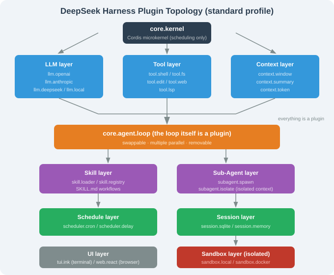

# 17.3 Architecture: Cordis Microkernel & Plugin Topology

> 🐋 *"No privileged components — this is the fundamental difference from every other Agent framework."*

---

## What Cordis Is

Cordis (by the Koishi team) is a **plugin meta-framework** that does exactly one thing: let plugins be loaded, unloaded, depended on, and communicate with each other. It carries no business logic.

```typescript
import { Context } from 'cordis';

function greetPlugin(ctx: Context, config: { greeting: string }) {
  ctx.on('ready', () => console.log(config.greeting));
}
ctx.plugin(greetPlugin, { greeting: 'Hello, DeepSeek Harness' });
```

### Key abstractions

| Abstraction | Role |
|-------------|------|
| **Context (ctx)** | plugin runtime; `ctx.plugin` / `ctx.on` / `ctx.service` |
| **Service** | callable interface exposed to other plugins |
| **Event** | async message bus |
| **Effect** | one-time side effect on load |
| **Schema** | typed plugin config + defaults |

The dependency graph is **explicit** — a plugin declares what it needs before/after.

---

## DeepSeek Harness' Plugin Topology (standard profile)



`core.agent.loop` being a plugin means you can swap it, run multiple loops, or remove it entirely — **something no other harness allows** (Claude Code / OpenClaw / Hermes all hard-code the loop in a privileged core).

---

## Communication: Services & Events

```typescript
// service
ctx.service('shell', {
  async run(command, opts = {}) { /* spawn child process */ }
});

// event
ctx.emit('tool.after', { name: 'shell', result });
ctx.on('tool.after', (e) => logger.log(...));
```

Stable context keys (`ctx.llm`, `ctx.tools`, `ctx.session`, `ctx.agentLoop`) are the contract third-party plugins rely on.

## Trajectory: git-style Replay & Fork

The event stream powers "trajectory replay": replay a whole session, fork at a step, audit what the Agent saw/did. A framework-level abstraction, more robust than hand-written logging.

## Paradigm Comparison

| Paradigm | OpenClaw | Hermes | Claude Code | DeepSeek Harness |
|----------|----------|--------|-------------|------------------|
| Event stream | internal | internal + Hooks | internal | **plugin** (`trajectory`) |
| Sandbox | built-in + Docker | 6 impls | 6-stage perms | **plugin** (`sandbox.*`) |
| State graph | implicit | implicit | explicit | **plugin** (`context.*`) |
| Tools | internal | internal | internal | **plugin** (`tool.*`) |
| Agent loop | internal | internal | internal | **plugin** (`agent.loop`) |

DeepSeek Harness is the **only** industrial harness that plugin-izes *all* of these paradigms.

---

## Section Summary

| Topic | Key point |
|-------|-----------|
| Cordis role | microkernel: load/unload/communicate only |
| Abstractions | Service / Event / Effect / Schema |
| Topology | LLM / Tool / Context / Skill / Sub-agent / Session / Sandbox / UI all plugins |
| Context keys | `ctx.llm` / `ctx.tools` / `ctx.session` stable |
| Trajectory | git-style replay / fork |
| Difference | only harness with a plugin-ized loop |

---

*Next section: [17.4 Plugin Development](./04_plugin_development.md)*
