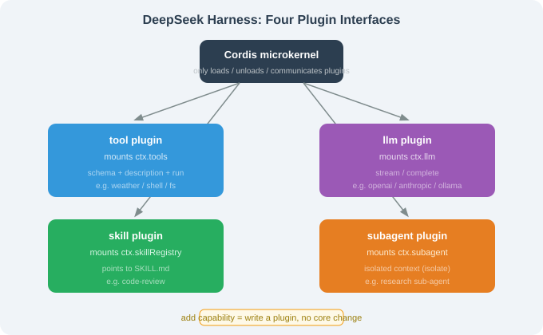

# 17.4 Plugin Development: tool / llm / skill / subagent

> 🐋 *"Add a capability = write a plugin, not touch the core."*

---

## Four Plugin Types

| Type | Mount point | Purpose |
|------|-------------|---------|
| **tool** | `ctx.tools` | add a tool |
| **llm** | `ctx.llm` | add a model |
| **skill** | `ctx.skillRegistry` | add a SKILL.md workflow |
| **subagent** | `ctx.subagent` | add a sub-agent type |



---

## Writing a Tool Plugin

```typescript
import { Context } from 'cordis';
import { z } from 'zod';

export function weatherPlugin(ctx: Context, config: { apiKey: string }) {
  ctx.tools.register('weather', {
    name: 'weather',
    description: 'Query current weather for a city.',
    schema: z.object({ city: z.string().describe('city name, e.g. "Shanghai"') }),
    async run(args: { city: string }) {
      const res = await fetch(`https://api.openweathermap.org/data/2.5/weather?q=${args.city}&appid=${config.apiKey}`);
      const data = await res.json();
      return `City ${data.name}: ${data.weather[0].description}, ${Math.round(data.main.temp - 273.15)}°C`;
    },
  });
}
```

Three essentials: `schema` (zod, strong-typed), `description` (read by the LLM), `run` (async).

## Writing an LLM Plugin

```typescript
export function myLlmPlugin(ctx: Context, config: { endpoint: string; apiKey: string }) {
  ctx.llm.register('my-llm', {
    async stream(messages, opts) { /* fetch + read SSE */ },
    async complete(messages, opts) { /* non-streaming */ },
  });
}
```

Set `llm.provider: "my-llm"` in config — the Agent loop code changes **zero**.

## Writing a Skill Plugin

```typescript
ctx.skillRegistry.register({
  name: 'code-review',
  description: 'Multi-dimensional code review',
  skillFile: './skills/code-review/SKILL.md',
});
```

Because it's Anthropic `SKILL.md`-compatible, you can reuse community skills from Claude Code / OpenClaw.

## Writing a Subagent Plugin

```typescript
ctx.subagent.register('research', {
  description: 'Research a topic independently, return a structured summary.',
  async run(prompt: string) {
    const sub = ctx.spawn({ isolate: true });
    return await sub.run(prompt);
  },
});
```

The main Agent dispatches it via the `Task` tool; the sub-agent runs in an isolated context.

## Plugin Dependencies

```typescript
ctx.plugin(weatherPlugin, { apiKey: 'xxx', before: ['core.llm'], after: ['core.kernel'] });
```

Explicit dependency graph → correct load order + early missing-dependency errors (see 17.3).

## The `create` Profile Loop

```bash
dsh --profile create dev   # watches ./plugins/**, hot-reloads in ~200ms
```

Edit → save → live, no restart.

---

## Section Summary

| Topic | Key point |
|-------|-----------|
| 4 types | tool / llm / skill / subagent |
| tool essentials | schema + description + run |
| llm plugin | `llm.provider` switch, zero loop change |
| skill plugin | reuse Anthropic SKILL.md |
| dependencies | before/after explicit ordering |

---

*Next section: [17.5 Comparison: DSH vs Claude Code / OpenClaw / Hermes](./05_comparison.md)*
