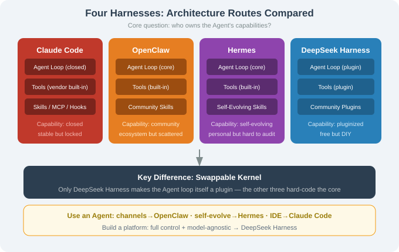
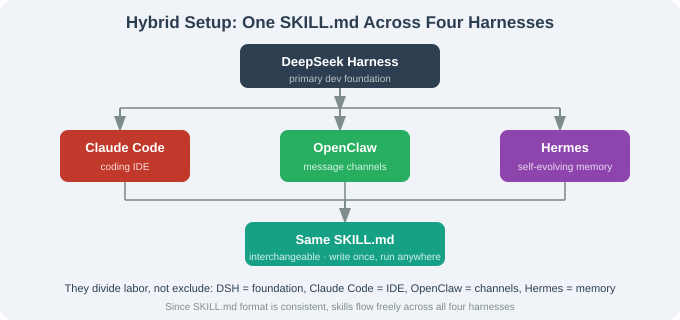

# 17.5 Comparison: DeepSeek Harness vs Claude Code / OpenClaw / Hermes

> 🐋 *"Four harnesses side by side — the differences become obvious."*

---

## Overview Table

| Dimension | DeepSeek Harness | Claude Code | OpenClaw | Hermes |
|-----------|------------------|-------------|----------|--------|
| License | MIT | source-available | MIT | MIT |
| Focus | pluginized foundation | industrial IDE | multi-channel consumer | self-evolution |
| Swappable core | ✅ even the loop | ❌ | ❌ | partial |
| Model-agnostic | ✅ | ❌ (own model) | ✅ | ✅ |
| Built-in plugins | 100+ | closed built-ins | Skills + plugins | Skills |
| Skill protocol | SKILL.md | SKILL.md | SKILL.md | SKILL.md |
| MCP | ✅ server + client | ✅ | partial | ✅ |
| UI | Web + CLI + TUI | CLI | CLI + multi-platform | CLI + 15+ platforms |
| Production-ready | preview v0.1 | high (commercial) | high (community) | high |
| Barrier | medium | low | very low | very low |

## One-Liners

| Project | One-liner |
|---------|-----------|
| Claude Code | "a furnished apartment, move-in ready — but accept the vendor lock" |
| OpenClaw | "put the Agent into every chat app on your phone" |
| Hermes | "a self-evolving assistant that grows to know you" |
| DeepSeek Harness | "a raw workshop — tools provided, furniture you assemble" |



## The Fundamental Divide: Who Owns the Capability

```
Claude Code: capability locked in the vendor → stable but locked
OpenClaw:    capability from community skills → ecosystem but scattered
Hermes:      capability from Agent self-evolution → personal but hard to audit
DeepSeek:    capability from community plugins + swappable kernel → free but DIY
```

**Swappable kernel is unique to DeepSeek** — the other three hard-code the Agent loop.

## Decision Tree

```
Q1: Are you "using" an Agent or "building" an Agent platform?
├─ using → Q2
│   ├─ want it in chat apps → OpenClaw (multi-channel)
│   ├─ want it to "grow to know me" → Hermes (self-evolving)
│   └─ want a software-engineering IDE → Claude Code (industrial)
└─ building → Q3
    ├─ full control + model-agnostic + swappable kernel → DeepSeek Harness
    └─ fast standard-service delivery → LangChain + LangGraph (Ch.12/13)
```

## Typical Combinations

| Combination | Use |
|-------------|-----|
| DSH foundation + Claude Code as IDE | build the platform with DSH, write code with Claude Code |
| OpenClaw channels + Hermes self-evolving skills | channels from OpenClaw, skills from Hermes |
| DSH + self-written plugins | fully self-built on community plugins |



---

## Section Summary

| Topic | Key point |
|-------|-----------|
| Fundamental divide | capability ownership: closed / community / self-evolving / pluginized |
| Swappable kernel | DeepSeek only |
| Decision | use (channel/self-evolve/IDE) vs build (pluginized/standard) |
| Combination | composable, not exclusive |

---

*Next section: [17.6 Borrowing the Philosophy](./06_lessons_philosophy.md)*
