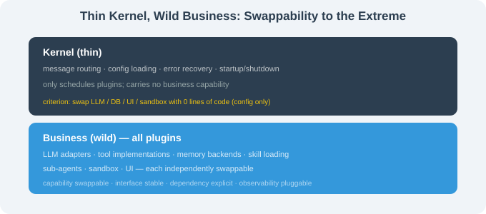

# 17.6 Borrowing the Philosophy: Swappable Kernel / Model-Agnostic

> 🐋 *"Lower the cost of 'swapping a capability' from 'change the source' to 'change the config'."*

---

## The Core Question

DeepSeek Harness' most important legacy isn't "100+ plugins" — it's this philosophy:

> **No Agent capability (model / tool / skill / sub-agent / sandbox / UI) should ever be hard-bound.**

When you push "swapability" this far, you can never be stranded by a product being discontinued, an open project losing maintenance, or a model being deprecated.

Five transferable principles:

## 1. Thin Kernel, Wild Business Logic



```python
# ❌ business logic in the core
class AgentLoop:
    def __init__(self):
        self.llm = OpenAIClient()   # hard-coded

# ✅ business logic injected via interface
class AgentLoop:
    def __init__(self, llm, store, tools):
        self.llm = llm; self.store = store; self.tools = tools
```

**Test**: ask "to swap the LLM / DB / UI / sandbox, how many lines change?" — if zero (config only), you did it right.

## 2. Degradable + Fallback Chains

```json
{
  "llm": {
    "providers": ["deepseek-v4-pro", "anthropic-claude-4-7", "ollama-qwen3"],
    "routing": { "deepseek-v4-pro": { "fallback": ["anthropic-claude-4-7", "ollama-qwen3"] } }
  }
}
```

Primary LLM down → auto-switch to fallback → local. Any external dependency should have a fallback.

## 3. Capability-Swappable + Stable Interface

Each capability hangs on a stable context key (`ctx.llm`, `ctx.tools`) — a **convention**, not an implementation. Third-party plugins call `ctx.llm.stream(...)` regardless of which model sits behind it.

```python
class AgentContext:
    llm: LLMProtocol       # .stream() / .complete()
    store: StoreProtocol   # .get() / .set() / .search()
    tools: ToolsProtocol   # .register() / .invoke()
```

Document your protocols (signatures, error conventions, perf constraints), version them, commit them.

## 4. Explicit Dependency Graphs

```typescript
ctx.plugin(SubAgentPlugin, { dependencies: ['agent.loop', 'llm.openai', 'session.sqlite'] });
```

Correct load order, early missing-dependency errors, visualizable topology — never rely on "runtime errors."

## 5. Observability at Plugin Level

```typescript
ctx.on('tool.before', e => metrics.increment(`tool.${e.name}.calls`));
ctx.on('tool.after',  e => metrics.histogram(`tool.${e.name}.latency`, e.duration));
ctx.on('plugin.error', e => sentry.report(e.error));
```

Observability as a plugin — add it without touching business code.

---

## Squeezed Into One Sentence

> **Thin kernel, wild business, stable interface, explicit dependencies, plugin-level observability.**

If only one: **Principle 1 (thin kernel)** — the precondition for everything else.

---

## Section Summary

| Principle | Key point |
|-----------|-----------|
| Thin kernel | business logic not in the core |
| Fallback chain | primary + multi-level fallback |
| Stable interface | Protocol stable, implementation swappable |
| Dependency graph | explicit, early error |
| Observability | plugin-level |

---

*Next section: [17.7 Summary: The 6-Harness Decision Matrix](./07_summary_and_decision_matrix.md)*
