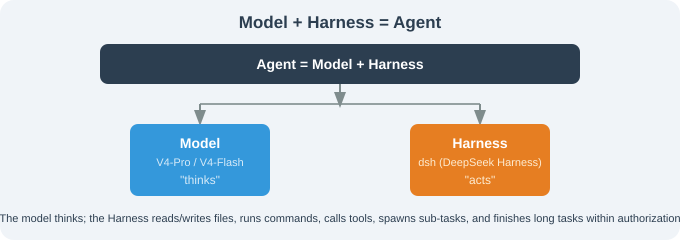

# Chapter 17: DeepSeek Harness — The Everything-Is-a-Plugin Open-Source Foundation

> 🐋 *"Model + Harness = Agent. The model thinks; the harness acts. Closed source gives users the present; open source lets users own the future."*
> — DeepSeek team, at DeepSeek Harness launch

---

## Chapter Introduction

On August 13, 2026, DeepSeek released **DeepSeek Harness (dsh / DSH)** under the MIT license — an Agent runtime framework where *all* Agent capabilities are plugins, shipping with four run modes and a full Python SDK, CLI, and MCP server. It is the "companion runtime" for the open-source DeepSeek **V4-Pro / V4-Flash** models, positioned directly against **Claude Code** and **OpenAI Codex**.

Why build an open-source harness? The answer is in their slogan — **"Model + Harness = Agent"**. The model "thinks"; the harness "does": reading/writing files, running commands, calling tools, dispatching subtasks, and finishing long tasks within authorized scope. It is an "AI operating-system shell."

Three things make DeepSeek Harness stand apart from every framework before it:

1. **"Everything is a plugin"** — built on the Cordis microkernel (by the Koishi team); model, tools, skills, sessions, sandbox, scheduler, UI are all plugins; any capability is replaceable without touching source;
2. **Model-agnostic** — not bound to DeepSeek's own models; swap in OpenAI, Anthropic, local Ollama, or any OpenAI-compatible endpoint;
3. **Four run modes** — standard / minimal / PTC / create, for daily dev, benchmarking, programmatic tool calling, and in-memory experimentation.

This chapter:

1. **Dissects the "everything-is-a-plugin" skeleton** — how Cordis coordinates plugins via services, events, and context keys;
2. **Demonstrates 4 modes + install** — `npx`, `pnpm dsh web`, Python SDK, source build;
3. **Compares against Claude Code / OpenClaw / Hermes** — building selection intuition.

---

## Chapter Content Overview

| Section | Content | What You'll Learn |
|---------|---------|-------------------|
| 17.1 What Is DeepSeek Harness | "everything is a plugin", Cordis kernel | Its place in the harness spectrum |
| 17.2 Installation & 4 Run Modes | npx / source / Docker; standard/minimal/PTC/create | Run it on macOS/Linux |
| 17.3 Architecture: Cordis Microkernel & Plugin Topology | plugin loading, services, events, context keys | Read the engineering skeleton |
| 17.4 Plugin Development | tool / llm / skill / subagent interfaces | Write your own capabilities |
| 17.5 Comparison: DSH vs Claude Code / OpenClaw / Hermes | four-harness matrix | Choose which to use |
| 17.6 Borrowing the Philosophy | swappable kernel, model-agnostic | Bring it to your system |
| 17.7 Summary: The 6-Harness Decision Matrix | one table to choose | Decide "which one" in 5 minutes |

---

## Reading Recommendations

- ✅ **Building a long-term controllable Agent platform** — read 17.1 in order
- ✅ **Claude Code users wanting to go open-source** — focus on 17.5
- ✅ **Adding custom capabilities** — focus on 17.4

**Prerequisites**: Chapter 8 (Harness Engineering), Chapter 16 (Claude Code). This chapter, with 14/15/16, forms the "action-Agent quartet."

> ⚠️ DeepSeek Harness is currently **v0.1 developer preview** (released 2026-08-13); DeepSeek warns of breaking changes. Chapter content is anchored to v0.1 + commits through 2026-08-15; version-specific details (CLI names, config paths) follow the `main` branch.

---

## Citation Convention

Verifiable facts (protocol, commands, CLI flags, Cordis origin) follow the `deepseek-ai/deepseek-harness` `main` branch README and the docs site `deepseek-harness.github.io/deepseek-harness/`.

> 💡 **Core insight**: DeepSeek Harness changed not "what an Agent can do" but "who owns the Agent's capabilities" — when swapping a model or a tool no longer requires waiting for a vendor release, the Agent platform becomes **something the user owns**.

---

*Next section: [17.1 What Is DeepSeek Harness](./01_what_is_dsh.md)*
