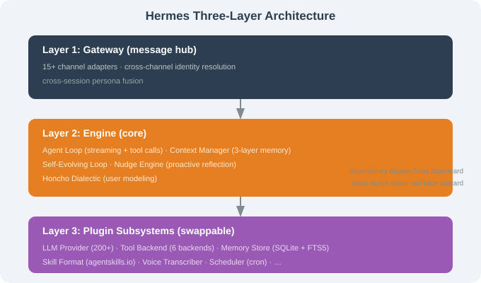

# 15.3 Three-Layer Architecture: Gateway / Engine / Plugin

> ☤ *"Three layers aren't a classification — they're three ways of looking at the same system."*

---

## Why Hermes' Architecture Matters

Hermes layers a **Plugin subsystem** on top of the traditional channel+loop+tool structure. Memory, tool-execution backend, self-evolving loop, and voice transcriber are **all plugins** — giving Hermes the same "swappable kernel" flexibility as DeepSeek Harness (Ch.17), just earlier and more Pythonic.



---

## Layer 1: Gateway

Same shape as OpenClaw but Python + more channels (15+). Cross-channel persona blending merges one human's channels into a single session, and Honcho user modeling is injected explicitly (not implicitly).

## Layer 2: Engine — 5 Subsystems

```python
async def agent_loop(session, user_message):
    context = await context_manager.assemble(session, user_message)
    for step in range(MAX_STEPS):
        parsed = parse(await llm.stream(context))
        if parsed.kind == "final_answer": return parsed.text
        if parsed.kind == "tool_call":
            decision = await permissions.check(parsed.tool_call, session)
            if not decision.allowed: ...
            result = await tools.run(parsed.tool_call)
            context.append_tool_result(parsed.tool_call.id, result)
            # ⭐ Hermes-only hook: self-evolving evaluation
            await self_evolving.on_tool_use(session, parsed.tool_call, result, context)
```

The `self_evolving.on_tool_use` hook is Hermes' **unique** addition — every completed task may trigger skill creation/update.

### Context Manager — pulls from plugin Memory Store

```python
async def assemble(session, user_message):
    long_term = await memory_store.recall_relevant(user_message.text, top_k=10)
    working   = await memory_store.get_session(session.id)
    episodic  = await memory_store.get_recent_episodes(session.id, k=5)
    persona   = await honcho.user_model(user_message.from_)
    return build_prompt(...)
```

## Layer 3: Plugin Subsystems

| Subsystem | Default | Replaceable with |
|-----------|---------|------------------|
| LLM Provider | OpenAI/Anthropic | any of 200+ models |
| Tool backend | local | Docker/SSH/Singularity/Modal/Daytona |
| Memory store | SQLite + FTS5 | Redis/Postgres/MongoDB |
| Skill format | agentskills.io | custom |
| Voice | OpenAI Whisper | Paraformer/whisper.cpp |

```bash
hermes runtime set modal    # switch execution backend
hermes runtime set local
```

## Memory: FTS5 + BM25

```sql
CREATE VIRTUAL TABLE memory USING fts5(
  content, created_at UNINDEXED, source UNINDEXED, tags,
  tokenize = 'unicode61 remove_diacritics 2'
);
-- search:
SELECT content, bm25(memory) AS score FROM memory
WHERE memory MATCH ? ORDER BY score ASC LIMIT 10;
```

**BM25** weights term frequency but down-weights common words (IDF) — precise keyword recall without a vector database.

---

## Mapping to Chapter 8's Pillars

Hermes implements all six pillars **plus two new ones**: Self-Evolution and Honcho User Modeling.

## Section Summary

| Topic | Key point |
|-------|-----------|
| 3 layers | Gateway / Engine / Plugin |
| Engine | Agent Loop + Context + Self-Evolving + Nudge + Honcho |
| Plugins | LLM / Tool backend / Memory / Skill / Voice all swappable |
| 6 backends | local/Docker/SSH/Singularity/Modal/Daytona |
| Search | SQLite FTS5 + BM25 |

---

*Next section: [15.4 Core: Self-Evolving Skills Loop](./04_self_evolving_skills.md)*
