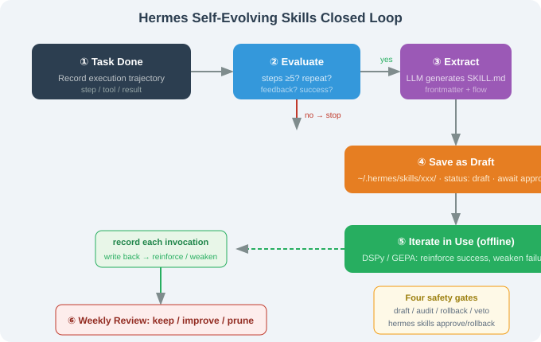

# 15.4 Core: Self-Evolving Skills Loop

> ☤ *"Hermes' sharpest knife: let the Agent write its own skills and iterate them itself."*

---

## The Problem

Traditional Agent skills are **hand-written** (OpenClaw / Claude Code's `SKILL.md`). Two ceilings: incomplete coverage (humans can't pre-write everything) and no adaptation (skills don't follow a user's workflow change).

Hermes' answer is **Self-Evolving Skills** — after a task, the Agent **itself** distills the trajectory into a skill, then improves it in use.



---

## The 5-Stage Loop

```
task done → ① evaluate → ② extract → ③ save draft → ④ iterate in use → ⑤ prune/reinforce
```

### ① Evaluate (should I extract?)

| Signal | Threshold | Meaning |
|--------|-----------|---------|
| Task steps | ≥ 5 | complex enough to persist |
| Repetition | same task ≥ 2 times | repetitive = automate |
| Explicit feedback | "remember this flow" | strong signal |
| Success | task succeeded | don't distill failures |

### ② Extract (SKILL.md)

Feed the trajectory to an LLM to produce structured `SKILL.md` (frontmatter + trigger + flow + constraints).

### ③ Save as Draft

```python
~/.hermes/skills/summarize-inbox/
├── SKILL.md      # frontmatter status: draft
└── meta.json     # source trajectory, created time, confidence
```

Drafts are **not** immediately active — user approves first.

### ④ Iterate in Use (offline self-improve)

Each invocation records results; offline, DSPy/GEPA-style tuning reinforces successful steps and weakens failing ones.

### ⑤ Prune / Reinforce

Weekly review classifies skills: healthy (keep) / needs-improvement (self-improve) / dying (prompt user).

---

## A Concrete Example

User: "organize my inbox, categorize by topic, and summarize."

1. **Execute**: Agent does it in 8 steps;
2. **Evaluate**: 8 ≥ 5 → worth distilling;
3. **Extract**: generates `summarize-inbox` skill (read→categorize→summarize→report);
4. **Save draft**;
5. **Next time**: "organize email" triggers the skill instead of re-planning;
6. **Iterate**: a mis-categorization is recorded and the rule corrected.

> 📌 A normal Agent re-plans from scratch on the 6th run; Hermes' 6th run uses its own skill, refined through 5 iterations.

---

## vs a Human-Maintained Skill Library

| Dimension | Hand-written (OpenClaw) | Self-evolving (Hermes) |
|-----------|-------------------------|------------------------|
| Source | human | human + Agent |
| Iteration | human releases | Agent offline auto |
| Coverage | human imagination | actual task trajectories |
| Personalization | generic | user-specific |
| Audit | easy | needs draft + audit |

---

## Safety Boundary (Why It's Not "Out of Control")

1. **Draft mechanism** — new skills are `status: draft` until approved;
2. **Security audit** — distilled SKILL.md passes permission checks (`tools`/`permissions`);
3. **Rollback** — skills keep versions;
4. **User veto** — `hermes skills disable <name>` anytime.

```bash
hermes skills list              # active/draft/disabled with versions
hermes skills approve summarize-inbox
hermes skills rollback summarize-inbox v2
```

---

## Section Summary

| Topic | Key point |
|-------|-----------|
| 5 stages | evaluate → extract → save draft → iterate → prune |
| Signals | steps / repetition / feedback / success |
| Iteration | DSPy/GEPA offline |
| Safety | draft + audit + rollback + veto |
| Essence | from "human writes skills" to "Agent writes + iterates" |

---

*Next section: [15.5 Three-Layer Memory](./05_memory.md)*
