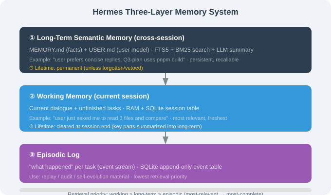

# 15.5 Three-Layer Memory

> ☤ *"Memory isn't one block — it's three layers: long-term / working / episodic."*

---

## Why Three Layers

A single memory layer hits three contradictions: size (long-term facts need to be complete, but context is limited), freshness (current task needs recency, experience needs longevity), and retrieval (exact match vs. semantic recall). Hermes resolves them with **three-layer separation**.



---

## The Three Layers

### ① Long-term semantic memory (`MEMORY.md` / `USER.md`)

Cross-session facts, preferences, project conventions. Retrieved via FTS5 + LLM summary.

```markdown
# ~/.hermes/MEMORY.md (excerpt)
## Project conventions
- Q3-plan: pnpm build, no npm
- Run lint + type-check before commit

## User preferences
- Concise replies, no emoji
- Full code for technical content
```

### ② Working memory (current session)

Current dialogue + unfinished tasks. Cleared at session end (unless summarized into long-term).

### ③ Episodic log

"what happened" per task (event stream), stored append-only in SQLite. Used for replay / audit / self-evolution material.

---

## How the Three Layers Collaborate

```python
async def recall(session, query):
    working   = session.messages[-10:]                       # most relevant
    long_term = await fts5.search(query, top_k=10)           # semantic/lexical
    episodic  = await db.query("SELECT * FROM episodes WHERE session_id=? ORDER BY ts DESC LIMIT 5")
    return combine(working, long_term, episodic)
```

Priority: **working > long-term > episodic** (most-relevant → most-complete).

---

## FTS5 + BM25: How Search Works

SQLite's FTS5 does full-text search with **BM25** ranking — term frequency boosts score, but common words ("的", "is") are down-weighted by inverse document frequency (IDF). Precise keyword recall without a vector database.

| Dimension | FTS5 + BM25 | Vector search |
|-----------|-------------|---------------|
| Dependency | zero (SQLite) | embedding model + vector store |
| Exact match | strong | weak |
| Semantic | weak | strong |
| Cost | very low | higher |

Hermes' trade-off: **FTS5 for exact recall + LLM summarization for semantic induction** — complementary, avoiding vector-database complexity.

---

## Write Strategy & Forgetting

| Write source | Target layer | Trigger |
|--------------|-------------|---------|
| user "remember X" | long-term | immediate |
| Honcho modeling | USER.md | periodic |
| task done | episodic | every time |
| skill distillation | skill library | self-evolution |
| session summary | long-term | on compression |

Forgetting: time decay, conflict resolution (keep newer/higher-confidence), user veto (`hermes memory delete`).

---

## Section Summary

| Topic | Key point |
|-------|-----------|
| 3 layers | long-term / working / episodic |
| Retrieval | FTS5 + BM25 (exact) + LLM summary (semantic) |
| Priority | working > long-term > episodic |
| Write | per-source target layer |
| Forgetting | time decay + conflict + veto |

---

*Next section: [15.6 Nudge Engine & Cross-Session Learning](./06_nudge_engine.md)*
