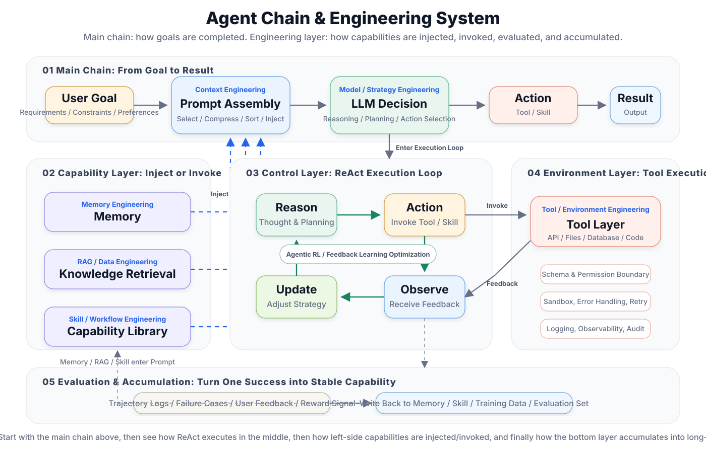

# Chapter 1: What is an Agent?

> 🎯 *"An Agent is not just a chatbot — it is an intelligent entity capable of autonomously perceiving its environment, making decisions, and taking action."*

## Chapter Overview

Welcome to the world of Agent development! In this chapter, we start from the most fundamental concepts to help you build a comprehensive understanding of AI Agents.

If you've used conversational AI like ChatGPT or Claude, you might wonder: "Aren't these Agents?" In fact, there is a fundamental difference. A true Agent doesn't just "talk" — it can "do things." It can use tools, access databases, call APIs, execute code, and even formulate plans and self-correct.

This chapter will help you understand these core differences and lay a solid conceptual foundation for the hands-on development ahead.

The diagram above helps you build a complete Agent intuition: after the user proposes a goal, the system organizes the task, context, memory, knowledge base, and available skills together into a Prompt, which is then fed to the LLM for reasoning and decision-making. The model does not generate a single answer — instead, it advances the task through a `Reason → Action → Observe → Update` loop: first think about the next step, then invoke tools or access files and APIs, then adjust the plan based on external feedback, and iterate until a final result is produced.

Within this loop, `Memory` is responsible for storing long-term preferences, historical decisions, and reusable experiences; `RAG` retrieves reliable materials from documents or knowledge bases; the `Skill Library` captures common task workflows and tool usage patterns. After understanding this diagram, you will more easily see the difference between an Agent and a regular chatbot: a chatbot mainly answers questions, while an Agent continuously completes tasks with goals, tools, and a feedback loop.

## 🎓 Learning Objectives

After completing this chapter, you will be able to:

- ✅ Clearly define what an AI Agent is
- ✅ Understand the evolution of Agents from simple chatbots to complex intelligent entities
- ✅ Master the core architecture of Agents: the Perception-Thinking-Action loop
- ✅ Distinguish the essential differences between Agents, traditional programs, and chatbots
- ✅ Understand typical application scenarios of Agents across various industries
- ✅ Understand the history of intelligent agents, from symbolic AI to the evolution driven by large models

## 📑 Chapter Structure

## ⏱️ Estimated Study Time

Approximately **45–60 minutes** (including thinking exercises)

## 💡 Prerequisites

- No background knowledge in AI or Agents required
- Basic understanding of programming concepts is helpful (but not required)

---

## 🔗 Learning Path

This book has 23 chapters across 6 parts, with clear dependencies between chapters. The overview diagram below shows the structural backbone of the book and three recommended routes — **the color strip on the left border of each node marks which route(s) it belongs to** (a chapter can belong to multiple routes simultaneously).

### Three Recommended Routes

Readers from different backgrounds can "skip around" the book along different routes — no need to read linearly from start to finish:

- 🟠 **Fast Track (5 chapters, for product managers / managers)**: `1 → 3 → 8 → 12 → 21`
  Build Agent intuition first (Chapter 1), understand tool calling (Chapter 3), master Harness engineering standards (Chapter 8), use a mainstream framework (Chapter 12 LangChain) to build your first programming assistant project (Chapter 21). Skip deep theory and see results fastest.

- 🔵 **Engineer Track (11 chapters, for developers wanting systematic mastery)**: `1 → 2 → 3 → 4 → 5 → 7 → 12 → 13 → 15 → 20 → 21`
  On top of the Fast Track, add LLM fundamentals (Chapter 2), memory and planning (Chapters 4, 5), context engineering (Chapter 7), then learn LangChain + LangGraph + Claude Code three frameworks, and finally land on deployment (Chapter 20) and a practical project (Chapter 21).

- 🟣 **Researcher Track (8 chapters, for those diving deep into theory and frontiers)**: `1 → 2 → 4 → 5 → 10 → 11 → 16 → 18`
  Focus on principles and frontiers: LLM fundamentals (Chapter 2), memory and planning theory (Chapters 4, 5), deep dive into Agentic-RL training (Chapter 10) and self-evolution (Chapter 11), then expand to multi-Agent systems (Chapter 16) and evaluation methods (Chapter 18).

> 💡 **Reading suggestion**: Solid arrows indicate "in-part sequential order," dashed arrows indicate "cross-part backbone connections." Regardless of which route you take, it is recommended to read Chapter 1 first to build a holistic view; the comprehensive project chapters (Chapters 21–23) are best left for last as an integration test of everything you've learned.

### Recommended Next Steps

> - 👉 [Chapter 2: LLM Fundamentals](../chapter_llm/README.md) — Understand the Agent's "brain"
> - 👉 [Appendix F: Development Environment Setup](../chapter_setup/README.md) — Set up tools and start building

---

*Ready? Let's start with the history and origins of Agents…*