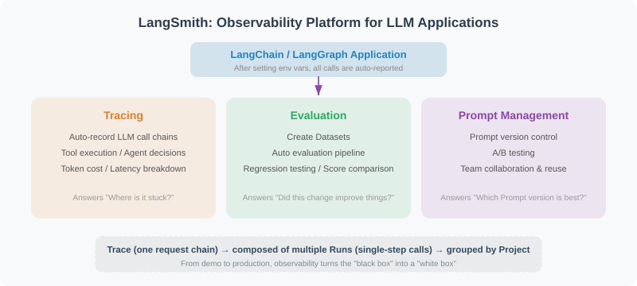

# 12.6 LangSmith Integration and Observability

> **Goal**: Master LangSmith's core capabilities, learn to integrate tracing, evaluation, and prompt management into LangChain applications, and build a production-grade observability system.

---

## Why Do We Need Observability?

When your Agent moves from demo to production, the "black box" is your worst enemy. Did the LLM call fail? What did the tool return? At which step did the Agent get stuck? Without observability, these questions can only be answered by guessing.

Traditional software has the classic trio of logs, distributed tracing, and metrics monitoring, but LLM applications bring new challenges:

| Challenge | Traditional Software | LLM Applications |
|------|---------|---------|
| Non-deterministic output | Output is fixed; assertions are enough | The same input may produce different outputs |
| Multi-step reasoning chains | A single function call | The Agent loop: LLM → tool → LLM → ... |
| Token cost | None | Every LLM call has a precise cost |
| Source of latency | Database / network | Mostly LLM inference time |
| Debugging difficulty | Stack trace | You need to inspect the full reasoning chain |

LangSmith is the observability platform the LangChain team built to solve exactly these problems.

---

## LangSmith Platform Overview

LangSmith is LangChain's official developer platform, offering three core capabilities:

1. **Tracing**: automatically records LLM call chains, tool executions, and Agent decision processes
2. **Evaluation**: create datasets, run automated evaluation pipelines, and perform regression testing
3. **Prompt Management**: version control, A/B testing, and team collaboration



### Core Concepts

| Concept | Description |
|------|------|
| **Trace** | The execution path of one complete request, containing multiple steps |
| **Run** | One step inside a trace (e.g., one LLM call or one tool execution) |
| **Project** | The grouping unit for traces, usually one application or environment |
| **Dataset** | A collection of input-output pairs used for evaluation |
| **Experiment** | One evaluation run over a dataset, with recorded scores |

---

## Tracing Integration

### Minimal Configuration

Tracing in LangSmith is almost zero-configuration — you only need to set environment variables:

```python
# .env file
LANGCHAIN_TRACING_V2=true
LANGCHAIN_API_KEY=lsv2_pt_xxxxxx  # get it from https://smith.langchain.com
LANGCHAIN_PROJECT=my-agent-project  # optional, defaults to "default"
```

```python
# Just set the environment variables and every LangChain call is traced automatically
import os
from dotenv import load_dotenv

load_dotenv()  # load the LangSmith configuration from .env

from langchain_openai import ChatOpenAI
from langchain_core.prompts import ChatPromptTemplate
from langchain_core.output_parsers import StrOutputParser

llm = ChatOpenAI(model="gpt-4.1-mini", temperature=0.7)
prompt = ChatPromptTemplate.from_messages([
    ("system", "You are a {role}."),
    ("human", "{question}")
])
chain = prompt | llm | StrOutputParser()

# This call is automatically traced to LangSmith
result = chain.invoke({"role": "Python expert", "question": "What is a decorator?"})
print(result)
```

That is all it takes. Once the environment variables are set, every call executed through a LangChain component is reported to LangSmith automatically, and you can inspect the full execution path in the web UI.

### Tracing an Agent's Complete Execution

For Agent applications tracing is even more valuable — you get to see the reasoning at every step:

```python
import os
from dotenv import load_dotenv
load_dotenv()

from langchain_openai import ChatOpenAI
from langchain_core.tools import tool
from langchain.agents import AgentExecutor, create_openai_tools_agent
from langchain_core.prompts import ChatPromptTemplate, MessagesPlaceholder

# ============================
# Tool definitions
# ============================

@tool
def search_database(query: str) -> str:
    """Search for information in the internal database."""
    # Simulate a database query
    db = {
        "sales": "Total Q4 2024 sales were 12.5 million yuan, up 18% year over year",
        "users": "Currently 520K monthly active users and 120K daily active users",
        "conversion": "Signup-to-paid conversion rate is 3.2%, up 0.3% from last month",
    }
    for keyword, value in db.items():
        if keyword in query:
            return value
    return "No matching data found"

@tool
def generate_chart(data_description: str) -> str:
    """Generate a chart from a data description. Input: the data description text."""
    return f"Chart generated: {data_description} — saved as chart_{hash(data_description) % 10000}.png"

# ============================
# Building the Agent
# ============================

tools = [search_database, generate_chart]

prompt = ChatPromptTemplate.from_messages([
    ("system", """You are a data analysis assistant.
You can use tools to query the database and generate charts.
Query the data first, then answer the user's question based on the result."""),
    MessagesPlaceholder(variable_name="chat_history"),
    ("human", "{input}"),
    MessagesPlaceholder(variable_name="agent_scratchpad"),
])

llm = ChatOpenAI(model="gpt-4.1", temperature=0)
agent = create_openai_tools_agent(llm, tools, prompt)
agent_executor = AgentExecutor(
    agent=agent,
    tools=tools,
    verbose=True,
    max_iterations=5,
)

# Execute — automatically traced to LangSmith
result = agent_executor.invoke({
    "input": "Look up the recent sales figures for me, then generate a chart",
    "chat_history": []
})
print(result["output"])
```

In the LangSmith trace view you will see something like:

```
Trace: "Look up the recent sales figures for me, then generate a chart"
├── Run: ChatPromptTemplate (format)
├── Run: ChatOpenAI (invoke)           ← first LLM call
│   ├── Input: system + user messages
│   ├── Output: tool_call(search_database, query="sales")
│   └── Tokens: 156 in / 28 out, $0.0023
├── Run: search_database (invoke)      ← tool execution
│   ├── Input: {"query": "sales"}
│   └── Output: "Total Q4 2024 sales were 12.5 million yuan..."
├── Run: ChatOpenAI (invoke)           ← second LLM call
│   ├── Input: conversation including the tool result
│   ├── Output: tool_call(generate_chart, ...)
│   └── Tokens: 234 in / 45 out, $0.0041
├── Run: generate_chart (invoke)       ← tool execution
│   └── Output: "Chart generated..."
└── Run: ChatOpenAI (invoke)           ← final LLM reply
    ├── Output: "Based on the query result..."
    └── Tokens: 189 in / 67 out, $0.0056
```

> 💡 **Key insight**: A trace shows you exactly how many steps the Agent took, how many tokens each step consumed, and the inputs and outputs of every tool — information that is essential for both debugging and cost optimization.

### Adding Custom Trace Information

Sometimes you need to attach business context to a trace so you can filter and troubleshoot later:

```python
from langchain_core.callbacks.manager import CallbackManagerForLLMRun
from langsmith import Client

# Approach 1: pass metadata through the config
result = agent_executor.invoke(
    {"input": "Look up the sales figures", "chat_history": []},
    config={
        "metadata": {
            "user_id": "user_123",
            "environment": "production",
            "version": "v2.1.0",
        },
        "tags": ["production", "data-agent"],  # filterable by tag in the UI
        "run_name": "data-query-user123",  # custom Run name
    }
)

# Approach 2: query traces with the LangSmith Client
client = Client()

# Query the traces of a given project
traces = client.list_runs(
    project_name="my-agent-project",
    filter='and(eq(metadata.user_id, "user_123"), gt(total_tokens, 1000))',
    limit=10
)

for trace in traces:
    print(f"Run: {trace.name}, Tokens: {trace.total_tokens}, "
          f"Cost: ${trace.total_cost:.4f}, Status: {trace.status}")
```

---

## Evaluation Integration

Evaluation is the critical gate before an LLM application goes live. LangSmith provides a complete evaluation pipeline: create a dataset → define evaluators → run experiments → compare results.

### Creating a Dataset

```python
from langsmith import Client

client = Client()

# Create the dataset
dataset = client.create_dataset(
    dataset_name="customer-service-qa",
    description="Evaluation dataset for the customer service Agent"
)

# Add examples (input-output pairs)
examples = [
    {
        "inputs": {"question": "What is your refund policy?"},
        "outputs": {"answer": "You can request a refund within 7 days of purchase; the original packaging must be kept."},
    },
    {
        "inputs": {"question": "Has order ORD-12345678 shipped?"},
        "outputs": {"answer": "It has shipped and is expected to arrive tomorrow."},
    },
    {
        "inputs": {"question": "Which payment methods do you support?"},
        "outputs": {"answer": "We support WeChat Pay, Alipay, and bank cards."},
    },
    {
        "inputs": {"question": "Recommend a book for learning Python"},
        "outputs": {"answer": "I recommend 'Python Crash Course', which suits complete beginners."},
    },
]

for example in examples:
    client.create_example(
        inputs=example["inputs"],
        outputs=example["outputs"],
        dataset_id=dataset.id,
    )

print(f"Dataset created with {len(examples)} examples")
```

### Running an Evaluation

```python
from langsmith.evaluation import evaluate
from langchain_openai import ChatOpenAI
from langchain_core.prompts import ChatPromptTemplate
from langchain_core.output_parsers import StrOutputParser

# Define the target function under evaluation
llm = ChatOpenAI(model="gpt-4.1-mini", temperature=0)
prompt = ChatPromptTemplate.from_messages([
    ("system", "You are a customer service assistant. Answer user questions concisely and professionally."),
    ("human", "{question}")
])
chain = prompt | llm | StrOutputParser()

def target_fn(inputs: dict) -> dict:
    """The function under evaluation: takes an input and returns an output"""
    answer = chain.invoke({"question": inputs["question"]})
    return {"answer": answer}

# Define the evaluator
from langsmith.evaluation import LangChainStringEvaluator

# Use LLM-as-Judge to evaluate answer quality
qa_evaluator = LangChainStringEvaluator(
    "qa",
    config={
        "criteria": {
            "helpfulness": "Is the answer helpful and does it solve the user's problem?",
            "correctness": "Are the facts in the answer correct?",
            "conciseness": "Is the answer concise and free of redundancy?",
        },
        "llm": ChatOpenAI(model="gpt-4.1", temperature=0),
    }
)

# Run the evaluation
results = evaluate(
    target_fn,
    data="customer-service-qa",  # dataset name
    evaluators=[qa_evaluator],
    experiment_prefix="customer-service-v1",
    max_concurrency=4,
)

# Inspect the results
for result in results:
    print(f"Input: {result.example.inputs['question']}")
    print(f"Output: {result.execution_result.output['answer'][:50]}...")
    for score in result.scores:
        print(f"  {score.name}: {score.value:.2f}")
    print()
```

### Custom Evaluators

When the built-in evaluators are not enough, you can write your own evaluation logic:

```python
from langsmith.evaluation import RunEvaluator, EvaluationResult
from langsmith.schemas import Run, Example

class ToolUsageEvaluator(RunEvaluator):
    """Evaluate whether the Agent used tools correctly"""

    def evaluate(self, run: Run, example: Example = None) -> EvaluationResult:
        # Extract tool call information from the Run
        tool_calls = []
        for child in (run.child_runs or []):
            if child.run_type == "tool":
                tool_calls.append(child.name)

        expected_tools = []
        if example and example.outputs:
            expected_tools = example.outputs.get("expected_tools", [])

        # Check whether the expected tools were called
        correct = len(tool_calls) > 0 if expected_tools else True
        score = 1.0 if correct else 0.0

        return EvaluationResult(
            key="tool_usage_correctness",
            score=score,
            comment=f"Tools called: {tool_calls}, expected: {expected_tools}"
        )

# Use the custom evaluator
results = evaluate(
    target_fn,
    data="customer-service-qa",
    evaluators=[qa_evaluator, ToolUsageEvaluator()],
    experiment_prefix="customer-service-v2",
)
```

---

## Prompt Management

LangSmith offers prompt versioning and collaboration features, so your prompts become as traceable as code.

### Pulling a Prompt from the LangSmith Hub

```python
from langsmith import Client

client = Client()

# Pull a prompt from the Hub (version numbers are supported)
prompt = client.pull_prompt("my-team/customer-service-prompt", version="latest")

# Use it directly in a chain
from langchain_openai import ChatOpenAI
from langchain_core.output_parsers import StrOutputParser

llm = ChatOpenAI(model="gpt-4.1-mini", temperature=0.7)
chain = prompt | llm | StrOutputParser()

result = chain.invoke({"question": "What is your refund policy?"})
print(result)
```

### Pushing a Prompt to the Hub

```python
from langchain_core.prompts import ChatPromptTemplate
from langsmith import Client

client = Client()

# Create the prompt
prompt = ChatPromptTemplate.from_messages([
    ("system", """You are "Xiaohui", a customer service assistant.
Responsibilities: {responsibilities}
Service guidelines: {guidelines}"""),
    ("human", "{question}"),
])

# Push it to the Hub
client.push_prompt(
    "my-team/customer-service-prompt",
    object=prompt,
    description="Customer service Agent system prompt v2",
)

print("Prompt pushed to the LangSmith Hub")
```

> 💡 **Prompt management best practices**:
> - Maintain every prompt on the Hub and fetch it in code via `pull_prompt`
> - When changing a prompt, push a new version instead of editing the code
> - Use the `version` parameter to pin the prompt version in production
> - Compare the effect of different versions on your evaluation dataset

---

## LangSmith vs LangFuse

LangFuse is the main open-source alternative to LangSmith. The two have similar features but different positioning:

| Feature | LangSmith | LangFuse |
|------|-----------|----------|
| **Deployment** | SaaS (officially hosted) | Self-hosted / SaaS |
| **Open source** | Partially (SDK open, server closed) | Fully open source (MIT license) |
| **LangChain integration** | Native, zero configuration | Requires extra callback configuration |
| **Evaluation** | Rich built-in evaluators | Built-in evaluation framework |
| **Prompt management** | Hub version control | Prompt version management |
| **Data privacy** | Data stored on LangChain servers | Full data ownership when self-hosted |
| **Pricing** | Free tier + usage-based pricing | Free when open source / usage-based in the cloud |
| **Community** | The official LangChain ecosystem | Independent community, growing fast |

### LangFuse Integration Example

If your team needs full control over its data, LangFuse is a good choice:

```python
# pip install langfuse

# .env configuration
# LANGFUSE_PUBLIC_KEY=pk-lf-xxxx
# LANGFUSE_SECRET_KEY=sk-lf-xxxx
# LANGFUSE_HOST=http://localhost:3000  # self-hosted address

from langfuse.callback import CallbackHandler

langfuse_handler = CallbackHandler()

# Use it inside LangChain
from langchain_openai import ChatOpenAI

llm = ChatOpenAI(model="gpt-4.1-mini")

result = llm.invoke(
    "Hello",
    config={"callbacks": [langfuse_handler]}
)

# Inspect the trace
print(f"Trace URL: {langfuse_handler.get_trace_url()}")
```

> ⚠️ **Choosing between them**:
> - If you already rely heavily on the LangChain ecosystem, **LangSmith is the least painful choice** — one line of environment variables and you are done
> - If your project has data compliance requirements (finance, healthcare), **self-hosted LangFuse** fits better
> - Both support OpenTelemetry, so they can integrate with your existing observability infrastructure

---

## Production Best Practices

### 1. Isolate Projects by Environment

```python
import os

# Development environment
# LANGCHAIN_PROJECT=data-agent-dev

# Staging environment
# LANGCHAIN_PROJECT=data-agent-staging

# Production environment
# LANGCHAIN_PROJECT=data-agent-prod

# You can also set it dynamically in code
os.environ["LANGCHAIN_PROJECT"] = f"data-agent-{os.getenv('DEPLOY_ENV', 'dev')}"
```

### 2. Sampling Strategy

When production traffic is high, you do not need to trace every single call. You can configure a sampling rate:

```python
from langchain_core.runnables import ConfigurableField

# Approach 1: probability-based sampling
import random

def should_trace() -> bool:
    """Trace 1% of requests"""
    return random.random() < 0.01

# Approach 2: condition-based tracing
# Only trace requests from specific users
def should_trace_user(user_id: str) -> bool:
    premium_users = {"user_vip_001", "user_vip_002"}
    return user_id in premium_users

# Control it dynamically at call time
result = chain.invoke(
    {"question": "Hello"},
    config={
        "callbacks": [] if not should_trace() else None,  # pass an empty list to skip tracing
        "tags": ["sampled"] if should_trace() else [],
    }
)
```

### 3. Cost Monitoring and Alerting

```python
from langsmith import Client

client = Client()

def check_daily_cost(project_name: str, budget_limit: float = 50.0):
    """Check whether today's cost exceeds the budget"""
    from datetime import datetime, timedelta

    today = datetime.now().replace(hour=0, minute=0, second=0)
    runs = client.list_runs(
        project_name=project_name,
        filter=f'and(gt(start_time, "{today.isoformat()}"), eq(status, "success"))',
    )

    total_cost = sum(run.total_cost or 0 for run in runs)

    if total_cost > budget_limit:
        # Send an alert (wire this to your alerting system)
        print(f"⚠️ Today's cost ${total_cost:.2f} has exceeded the budget ${budget_limit:.2f}")

    return total_cost

# Run it on a schedule
cost = check_daily_cost("data-agent-prod")
print(f"Today's cost: ${cost:.4f}")
```

### 4. Evaluation-Driven Release Process

> Code change → run the evaluation dataset → compare the scores against the baseline → ship only if the score does not regress

```python
from langsmith import Client

client = Client()

def compare_experiments(baseline: str, candidate: str) -> dict:
    """Compare the evaluation results of two experiments"""
    baseline_runs = list(client.list_runs(
        project_name=baseline, is_root=True
    ))
    candidate_runs = list(client.list_runs(
        project_name=candidate, is_root=True
    ))

    # Aggregate the comparison
    comparison = {
        "baseline": {
            "total": len(baseline_runs),
            "avg_feedback": sum(
                r.feedback_stats.get("helpfulness", 0) if r.feedback_stats else 0
                for r in baseline_runs
            ) / max(len(baseline_runs), 1),
        },
        "candidate": {
            "total": len(candidate_runs),
            "avg_feedback": sum(
                r.feedback_stats.get("helpfulness", 0) if r.feedback_stats else 0
                for r in candidate_runs
            ) / max(len(candidate_runs), 1),
        },
    }

    # Decide whether it can be shipped
    can_deploy = (
        comparison["candidate"]["avg_feedback"]
        >= comparison["baseline"]["avg_feedback"]
    )

    comparison["can_deploy"] = can_deploy
    return comparison
```

### 5. Integrating with Your Existing Monitoring Stack

LangSmith does not live in isolation; it should work together with your overall observability system:

```python
import logging
from langsmith import Client

# Record the LangSmith Trace ID in the application logs
logger = logging.getLogger("agent_service")

class TracingMiddleware:
    """FastAPI middleware: inject the LangSmith Trace ID into the request context"""

    def __init__(self, app):
        self.app = app

    async def __call__(self, scope, receive, send):
        if scope["type"] == "http":
            # Record the Trace ID while handling the request
            trace_id = scope.get("langsmith_trace_id")
            if trace_id:
                logger.info(f"langsmith_trace_id={trace_id}")
        await self.app(scope, receive, send)

# Hook into OpenTelemetry (LangSmith supports OTel export)
# LANGSMITH_OTEL_ENABLED=true
# OTEL_EXPORTER_OTLP_ENDPOINT=http://your-collector:4317
```

---

## Summary

LangSmith gives LangChain applications a complete observability solution:

| Capability | Key Points |
|------|---------|
| **Tracing** | Enabled with environment variables; automatically traces the whole LLM → tool → Agent path |
| **Evaluation** | Dataset + evaluators + automated pipeline, enabling evaluation-driven releases |
| **Prompt management** | Hub version control, decoupling code from prompts |
| **Cost monitoring** | Token-level precise costs with budget alerting |
| **Privacy compliance** | Self-hosted LangFuse is an option for data-sensitive scenarios |

> 💡 **How this relates to other chapters**:
> - The graph Agents built in Chapter 13 [LangGraph: Building Stateful Agents](../chapter_langgraph/README.md) can also be traced with LangSmith
> - Chapter 18 [Agent Evaluation and Optimization](../chapter_evaluation/README.md) digs into Agent evaluation methodology
> - Chapter 20 [Deployment and Productionization](../chapter_deployment/README.md) covers a more complete monitoring system

---

*Next: [12.7 LangChain Ecosystem 2026](./07_langchain_ecosystem_2026.md)*

---

## References

[1] LangChain Team. LangSmith Documentation. https://docs.smith.langchain.com, 2025.

[2] LangChain Team. LangSmith Evaluation. https://docs.smith.langchain.com/evaluation, 2025.

[3] LangFuse Team. LangFuse Open Source Observability. https://langfuse.com/docs, 2025.
