# 2.7 Foundation Model Architecture Explained

> 🏗️ *"Understanding how models work helps you make better judgments, and understanding the evolution of model architecture helps you understand where the entire industry is heading."*

In Section 2.1 we built an intuitive understanding of how LLMs work — Transformer, attention, Token prediction. This section goes one level deeper and shows you what the **"skeleton" of a model** actually looks like — from the Decoder-Only architecture to attention variants, normalization schemes, positional encoding, and MoE routing, all the way to the concrete architectural choices made by the major open-source models of 2024–2026.

This knowledge is not "academic decoration" — when you need to choose a deployment model for an Agent, estimate inference costs, or understand why a certain model performs better on long texts, **your understanding of architecture is your underlying judgment**.

## The Standard "Skeleton" of Modern LLMs: Decoder-Only Transformer

Since 2023, almost all mainstream LLMs have adopted the **Decoder-Only** architecture. This differs from the original Transformer's Encoder-Decoder structure — it retains only the decoder portion, using a **Causal Attention Mask** to ensure each Token can only "see" the content to its left.

```python
# Intuition behind the causal attention mask
# When generating "I like eating apples":
#
#          I   like  eating  apples
#  I      [✓]  [✗]   [✗]    [✗]     ← "I" can only see itself
#  like   [✓]  [✓]   [✗]    [✗]     ← "like" can see "I" and itself
#  eating [✓]  [✓]   [✓]    [✗]     ← "eating" can see all preceding words
#  apples [✓]  [✓]   [✓]    [✓]     ← "apples" can see the entire sequence
#
# The [✗] above the diagonal is the causal mask — preventing "peeking at the future"
```

Why Decoder-Only?

| Architecture | Representative Models | Suitable Tasks | Why LLMs Don't Use It |
|------|---------|---------|-------------|
| Encoder-Only | BERT | Understanding (classification, NER) | Cannot generate auto-regressively |
| Encoder-Decoder | T5, BART | Translation, summarization | High complexity, hard to scale to extreme sizes |
| **Decoder-Only** | **GPT, Llama, DeepSeek** | **All generation tasks** | ✅ Simple architecture, easy to scale, efficient training |

A standard Decoder-Only Transformer layer looks like this:


```python
class TransformerDecoderLayer:
    """Standard structure of one modern LLM layer (2024+ consensus version)"""
    
    def forward(self, x):
        # 1. Pre-Norm + Attention
        residual = x
        x = self.norm1(x)                  # RMSNorm (Pre-Normalization)
        x = self.attention(x)              # Causal self-attention (GQA/MLA)
        x = residual + x                   # Residual connection
        
        # 2. Pre-Norm + FFN
        residual = x
        x = self.norm2(x)                  # RMSNorm
        x = self.ffn(x)                    # SwiGLU feed-forward network
        x = residual + x                   # Residual connection
        
        return x
```

Next, let's break down the technical evolution of each component one by one.

## Tokenizer: What Happens Before Text Enters the Model

Before we look inside the Transformer, there is a preliminary step that is often overlooked but absolutely critical: the **Tokenizer**.

An LLM does not process characters or words directly — it processes **Tokens**, the basic units that text is cut into, where each Token corresponds to one integer ID in a vocabulary.

### BPE: Byte Pair Encoding

Before BPE there were two naive tokenization approaches, both with obvious flaws:

> **Character-level**: "unbelievable" → [u, n, b, e, l, i, e, v, a, b, l, e] (12 Tokens). Pros: an extremely small vocabulary (~256) and no OOV problem. Cons: sequences become very long, so the model needs many more steps to grasp the meaning.
>
> **Word-level**: "unbelievable" → ["unbelievable"] (1 Token). Pros: short sequences. Cons: an enormous vocabulary (millions of entries), "running"/"runs"/"ran" become completely unrelated Tokens, and any new word turns into [UNK].

**BPE is the compromise between the two** — it starts from characters and merges frequent subwords based on statistics, ending up with a vocabulary that is manageable in size yet broad in coverage:

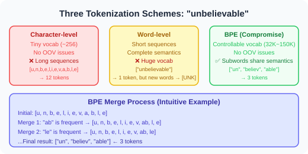

Modern LLMs almost universally use **BPE (Byte Pair Encoding)** or one of its variants (such as SentencePiece or tiktoken). The algorithm: start from all single bytes (256 of them), repeatedly count and merge the most frequent adjacent Token pair, until the vocabulary reaches the target size (e.g., 32000 or 128256).

The key advantage of BPE is **subword sharing**. "running", "runner", and "runs" all contain the subword Token "run", so the model can learn their semantic relationship; and a word it has never seen before can still be split into known subwords, so [UNK] never appears.

```python
import tiktoken  # OpenAI's BPE implementation

enc = tiktoken.get_encoding("cl100k_base")  # The tokenizer used by GPT-4

# Tokenizing a sentence
text = "Hello, 你好！Agent development is fascinating."
tokens = enc.encode(text)
print(f"Token count: {len(tokens)}")          # About 15 Tokens
print(f"Token IDs: {tokens[:8]}...")          # [9906, 11, 220, ...]

# Decoding back to text
decoded = enc.decode(tokens)
print(f"Decoded text: {decoded}")            # Exactly identical

# Token efficiency differs across languages
print(enc.encode("Hello"))          # [15339] → 1 Token
print(enc.encode("你好"))           # [57668, 53901] → 2 Tokens  ← Chinese is less efficient
print(enc.encode("مرحبا"))          # Arabic → even more Tokens
```

### Vocabulary Size Trade-offs

| Vocabulary Size | Representative Model | Token Efficiency (Chinese) | Memory Overhead |
|---------|---------|-----------------|---------|
| 32,000  | Llama 2 | Low (3–4 characters per Token) | Low |
| 65,536  | Qwen 2  | Medium (about 2 characters per Token) | Medium |
| 128,256 | Llama 3/4 | Medium-high | Fairly high |
| 150,000+ | DeepSeek V3 | High (close to 1 character per Token) | High |

> 💡 **Why does vocabulary size matter?** A larger vocabulary means non-English languages such as Chinese can express the same content with fewer Tokens, which directly lowers inference cost. The DeepSeek and Qwen families deliberately expanded their vocabularies for Chinese.

### Tokens Pass Through the Embedding Layer

Token ID → word embedding vector — this is the model's first layer:

```python
class TokenEmbedding:
    """Converts Token IDs into dense vectors"""
    def __init__(self, vocab_size=128256, d_model=4096):
        # Embedding matrix: shape [vocab_size × d_model]
        # Each Token corresponds to one row → one 4096-dimensional vector
        self.embed = nn.Embedding(vocab_size, d_model)
    
    def forward(self, token_ids):
        # Input:  integer IDs of shape [batch_size, seq_len]
        # Output: float vectors of shape [batch_size, seq_len, d_model]
        return self.embed(token_ids)

# Example
token_ids = torch.tensor([[9906, 11, 220, 57668]])  # "Hello, 你..."
embeddings = embedding(token_ids)
# shape: [1, 4, 4096] → each Token becomes a 4096-dimensional vector
```

The embedding matrix itself is a significant part of the model's parameters. For a model with a 128K vocabulary and a dimension of 4096, the embedding layer alone holds **128K × 4096 ≈ 500 million parameters**.

**What is an embedding, fundamentally?** It is a learnable lookup table — each Token ID maps to one row vector, and that vector is optimized during training so that semantically similar Tokens end up closer together in vector space:

```
Embedding space after training (intuitive sketch):

  "king" ──────────────────────────────────────────────────────────
  "queen" ─────────────────────────────────────────────────────────
  (the two are very close, because they are semantically similar)

  "king" - "man" + "woman" ≈ "queen"  ← the famous word-vector analogy

  The vectors of "Python" and "JavaScript" are closer to each other
  than "Python" is to "apple"
  (because in the training corpus they frequently appear in similar contexts)
```

> 💡 **Why dense vectors instead of one-hot?** A one-hot vector (a sparse vector the size of the vocabulary) cannot express relationships between words — the one-hot vectors of "cat" and "dog" are orthogonal, showing no similarity whatsoever. Dense embedding vectors learn semantic relationships automatically through training, and that is the first step in how an LLM understands language.

---

## Scaled Dot-Product Attention: The Core Computation of Attention

Before we discuss attention variants, let's fully unpack **the core computation**.

### Where Do Q, K, and V Come From?

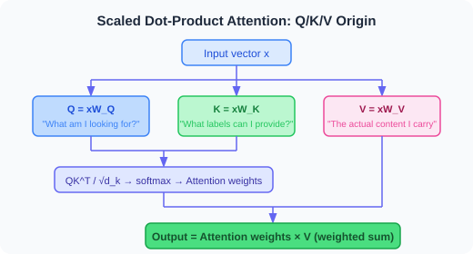

Each Token vector $x$ in the input sequence goes through three **independent linear projections** to produce Q, K, and V:

$$ Q = xW_Q, \quad K = xW_K, \quad V = xW_V$$

Intuitively:
- **Q (Query)**: "What information am I looking for?"
- **K (Key)**: "What 'label' describes the information I can offer?"
- **V (Value)**: "The actual information content I carry"

```python
class SelfAttention:
    """The simplest self-attention implementation"""
    def __init__(self, d_model=512, d_k=64):
        # Three projection matrices (learnable parameters)
        self.W_Q = nn.Linear(d_model, d_k, bias=False)
        self.W_K = nn.Linear(d_model, d_k, bias=False)
        self.W_V = nn.Linear(d_model, d_k, bias=False)
    
    def forward(self, x):
        # x shape: [batch, seq_len, d_model]
        Q = self.W_Q(x)  # [batch, seq_len, d_k]
        K = self.W_K(x)  # [batch, seq_len, d_k]
        V = self.W_V(x)  # [batch, seq_len, d_k]
        return scaled_dot_product(Q, K, V)
```

### Full Derivation of Scaled Dot-Product Attention

$$\text{Attention}(Q, K, V) = \text{softmax}\!\left(\frac{QK^T}{\sqrt{d_k}}\right) V$$

**Step by step:**


```python
import math

def scaled_dot_product_attention(Q, K, V, mask=None):
    """
    Q, K, V: [batch, heads, seq_len, d_k]
    mask:    [batch, 1, seq_len, seq_len] (causal mask)
    """
    d_k = Q.size(-1)
    
    # Steps 1+2: compute the scaled similarity scores
    scores = torch.matmul(Q, K.transpose(-2, -1)) / math.sqrt(d_k)
    # shape: [batch, heads, seq_len, seq_len]
    
    # Step 3: causal mask (set future positions to -∞ so they become 0 after softmax)
    if mask is not None:
        scores = scores.masked_fill(mask == 0, float('-inf'))
    
    # Step 4: softmax gives the attention weights
    attn_weights = torch.softmax(scores, dim=-1)
    # shape: [batch, heads, seq_len, seq_len]
    
    # Step 5: weighted sum over V
    output = torch.matmul(attn_weights, V)
    # shape: [batch, heads, seq_len, d_k]
    
    return output, attn_weights

# A concrete example:
# seq_len=4 ("I love AI deeply"), d_k=64, n_heads=8
Q = torch.randn(1, 8, 4, 64)
K = torch.randn(1, 8, 4, 64)
V = torch.randn(1, 8, 4, 64)

# Build the causal mask (lower-triangular matrix)
mask = torch.tril(torch.ones(4, 4))
output, weights = scaled_dot_product_attention(Q, K, V, mask)
# weights[0, 0] looks roughly like this:
# "I"     → [1.00, 0.00, 0.00, 0.00]  sees only itself
# "love"  → [0.55, 0.45, 0.00, 0.00]  sees "I" and itself
# "AI"    → [0.30, 0.35, 0.35, 0.00]  sees the first two words
# "deeply"→ [0.20, 0.25, 0.30, 0.25]  sees all words
```

### Why Do We Need "Multiple Heads"?

A single attention head can only focus on one kind of "relationship" (such as subject-verb agreement). Multiple heads run in parallel, and each head can learn a different relational pattern:

```python
class MultiHeadAttentionFull:
    """A complete multi-head attention implementation"""
    def __init__(self, d_model=512, n_heads=8):
        self.n_heads = n_heads
        self.d_k = d_model // n_heads  # dimension per head = 64
        
        # All heads share one large matrix, which is equivalent to n_heads independent W_Q/W_K/W_V
        self.W_Q = nn.Linear(d_model, d_model)
        self.W_K = nn.Linear(d_model, d_model)
        self.W_V = nn.Linear(d_model, d_model)
        self.W_O = nn.Linear(d_model, d_model)  # output projection
    
    def forward(self, x, mask=None):
        batch, seq, d = x.shape
        
        # 1. Project and split into multiple heads
        Q = self.W_Q(x).view(batch, seq, self.n_heads, self.d_k).transpose(1, 2)
        K = self.W_K(x).view(batch, seq, self.n_heads, self.d_k).transpose(1, 2)
        V = self.W_V(x).view(batch, seq, self.n_heads, self.d_k).transpose(1, 2)
        # shape: [batch, n_heads, seq, d_k]
        
        # 2. Each head computes attention independently
        attn_out, _ = scaled_dot_product_attention(Q, K, V, mask)
        # shape: [batch, n_heads, seq, d_k]
        
        # 3. Concatenate the outputs of all heads
        concat = attn_out.transpose(1, 2).contiguous().view(batch, seq, d)
        # shape: [batch, seq, d_model]
        
        # 4. Final linear projection
        return self.W_O(concat)
```

> 🎯 **Intuition**:  
> - Head 1 might learn: **syntactic dependencies** (subject → verb)
> - Head 2 might learn: **coreference** ("it" → which noun it refers to)
> - Head 3 might learn: **local positional relationships** (collocations of adjacent words)
> - Head 8 might learn: **long-range semantic associations**

---

## KV Cache: The Key to Fast Inference

**KV Cache is the single most important mechanism for LLM inference efficiency**, but it is also one of the biggest consumers of GPU memory. To understand KV Cache, we first need to revisit a key question: **how does an LLM generate text one Token at a time?**

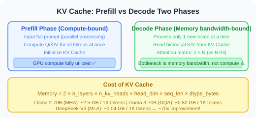

### First, Understand Autoregressive Generation: One Token at a Time

The way an LLM generates text is called **autoregressive** — it predicts only the next Token each time, appends that new Token back to the input, predicts the one after that, and repeats:

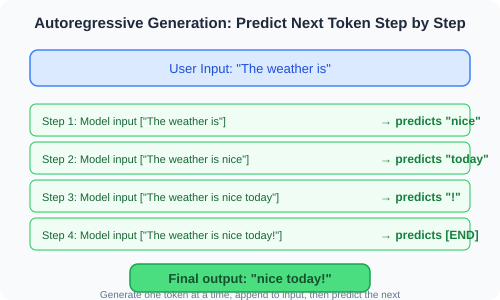

Note the key point: **at every step, the model has to run a complete attention computation over the "entire input sequence."** That means:

- Step 1: compute attention over 4 Tokens ("The weather today is")
- Step 2: compute attention over 5 Tokens ("The weather today is really")
- Step 3: compute attention over 6 Tokens ("The weather today is really nice")

At every step, the Q, K, and V of all Tokens have to be **computed from scratch** before attention can be applied.

### Without KV Cache: Massive Redundant Computation

Recall how attention is computed: each Token is first projected through the three matrices $W_Q$, $W_K$, and $W_V$ to produce its Q, K, and V vectors, then $QK^T$ gives the attention scores, and finally V is summed with those weights.

**Here is the problem**: at step 2, the K and V vectors of the four Tokens "The weather today is" were already computed at step 1! But without a cache, step 2 has to compute them all over again. Step 3 then recomputes the K and V of all five previous Tokens once more...

> The total K/V projection cost of generating N new Tokens ≈ O(N × L + N²) (L = prompt length). When N is large, this approaches O(N²)-level redundant computation!

It is like **having to recopy every textbook by hand before every exam** — you already copied them once, but because nothing was saved you have to start over.

### The Core Idea of KV Cache: Store What You Already Computed

The idea behind KV Cache is highly intuitive — **the K and V vectors of historical Tokens never change, so compute them once, cache them, and reuse them afterward**.

Why don't K and V change? Because under causal attention, a historical Token's K and V depend only on its own input vector and the fixed weight matrices $W_K$ and $W_V$ — they are unaffected by any Token generated later.


**The comparison is clear at a glance**:

| | Without KV Cache | With KV Cache |
|---|---|---|
| K/V projection per step | Recomputed for **all** Tokens | Computed for only **1 new** Token |
| Attention matrix per step | N × N (full matrix) | 1 × N (only the new Token's row) |
| Total projections to generate N Tokens | O(N²) | O(N) |
| Cost | No extra GPU memory | Must store all historical K/V |

> 🎯 **In one sentence**: KV Cache **trades memory for compute** — spend some GPU memory storing historical K/V, and save a huge amount of redundant matrix projection and attention computation.

### Code: Attention with a KV Cache

```python
class KVCacheAttention:
    """Inference attention with a KV Cache"""
    
    def __init__(self):
        self.k_cache = None  # Stores historical Keys, shape [batch, cached_len, d_k]
        self.v_cache = None  # Stores historical Values
    
    def forward(self, x_new, is_prefill=False):
        """
        is_prefill=True:  process the full prompt (computed in parallel in one pass)
        is_prefill=False: process only 1 new Token per call (step-by-step generation)
        """
        # Compute Q/K/V for the new input
        Q_new = self.W_Q(x_new)  # prefill: [batch, prompt_len, d_k]
        K_new = self.W_K(x_new)  # decode:  [batch, 1, d_k] (only 1 new Token)
        V_new = self.W_V(x_new)
        
        if is_prefill:
            # ── Prefill phase ──
            # First pass over the full prompt; initialize the cache
            self.k_cache = K_new  # Store the K of every prompt Token
            self.v_cache = V_new  # Store the V of every prompt Token
            # Q is also complete, so we do standard full-sequence attention
            K_all = K_new
            V_all = V_new
        else:
            # ── Decode phase ──
            # Append the new Token's K/V to the end of the cache
            self.k_cache = torch.cat([self.k_cache, K_new], dim=1)
            self.v_cache = torch.cat([self.v_cache, V_new], dim=1)
            # K_all/V_all are the full history plus the new Token
            K_all = self.k_cache  # [batch, cached_len+1, d_k]
            V_all = self.v_cache
        
        # Attention: Q_new × K_all^T → attention weights → weighted V_all
        # During decode: Q_new has only 1 row, so the attention matrix is [1 × (cached_len+1)]
        # instead of [(cached_len+1) × (cached_len+1)]!
        output = scaled_dot_product_attention(Q_new, K_all, V_all)
        return output
```

Let's walk through the full flow with a concrete example:

```python
# Suppose prompt = "Write a short poem" (4 Tokens) and the model must generate "Spring wind comes"

# ── Step 0: Prefill ──
# Input:  ["Write", "a", "short", "poem"] (4 Tokens processed in parallel)
# Compute: Q/K/V for 4 Tokens, then a 4×4 attention matrix
# Cache:  k_cache = [K_Write, K_a, K_short, K_poem]  ← 4 K vectors
#         v_cache = [V_Write, V_a, V_short, V_poem]  ← 4 V vectors
# Output: predict the next Token → "Spring"

# ── Step 1: Decode ──
# Input:  ["Spring"] (only 1 new Token!)
# Compute: Q/K/V for 1 Token
# Cache:  k_cache = [K_Write, K_a, K_short, K_poem, K_Spring]  ← append K_Spring
#         v_cache = [V_Write, V_a, V_short, V_poem, V_Spring]  ← append V_Spring
# Attention: Q_Spring × [K_Write, K_a, K_short, K_poem, K_Spring]^T → 1×5 attention weights
# Output: predict the next Token → "wind"

# ── Step 2: Decode ──
# Input:  ["wind"] (only 1 new Token!)
# Compute: Q/K/V for 1 Token
# Cache:  k_cache = [K_Write, K_a, K_short, K_poem, K_Spring, K_wind]  ← append K_wind
# Attention: Q_wind × [K_Write, K_a, K_short, K_poem, K_Spring, K_wind]^T → 1×6 attention weights
# Output: predict the next Token → "comes"

# Note: each step performs only 1 K/V projection (for the new Token), not a re-projection of every Token!
```

### Why Cache Only K and V, Not Q?

This is a common question. The reason:

**Key insight**:
- **Q** is only needed for the current Token → no need to cache historical Q
- **K** is needed for all Tokens (because the new Token must compute similarity against every historical Token) → must be cached
- **V** is needed for all Tokens (because we take a weighted sum over every Token's Value) → must be cached

So: cache only K and V; Q can simply be computed fresh at each step.

### Prefill vs Decode: The Two Phases of Inference

Once you understand KV Cache, LLM inference naturally splits into two very different phases:

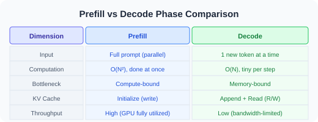

**Why is the Decode phase "memory-bandwidth bound"?** Because each step computes only 1 Token (very little arithmetic) yet has to read the **entire KV Cache** out of GPU memory (a large amount of data). The GPU's compute capability is underutilized; the bottleneck is "how fast data can be moved." This is also why the throughput of the Decode phase is far lower than that of the Prefill phase.

### KV Cache Memory Math

The memory footprint of a KV Cache can be computed precisely — which matters enormously for model deployment and cost estimation:

```python
# KV Cache memory formula:
# 
# memory(bytes) = 2 × n_layers × n_kv_heads × head_dim × seq_len × dtype_bytes
#                 ↑      ↑            ↑           ↑         ↑          ↑
#                K+V   n layers    KV heads    dim/head   seq length  bytes per value
#
# Why 2? Because K and V are each stored once.
# Why n_layers? Because every layer has its own independent KV Cache!

def kv_cache_memory_gb(n_layers, n_kv_heads, head_dim, 
                        seq_len, dtype_bytes=2):
    """Compute the GPU memory (GB) occupied by the KV Cache"""
    total_bytes = 2 * n_layers * n_kv_heads * head_dim * seq_len * dtype_bytes
    return total_bytes / (1024 ** 3)

# ── KV Cache comparison for real models (per 1K Tokens, bfloat16 precision) ──

# Llama 2-70B (MHA): 80 layers, 64 KV heads, 128 dims per head
print(kv_cache_memory_gb(80, 64, 128, 1024))  # ≈ 2.5 GB / 1K Tokens ← enormous!
# A conversation of 8K Tokens → the KV Cache alone needs 20 GB of GPU memory

# Llama 3-70B (GQA): 80 layers, only 8 KV heads, 128 dims per head  
print(kv_cache_memory_gb(80, 8, 128, 1024))   # ≈ 0.32 GB / 1K Tokens ← 8× better!
# The same 8K Tokens → only 2.5 GB

# DeepSeek-V2 (MLA): does not store full KV, only a 512-dim compressed latent vector
# Effective KV Cache ≈ 0.04 GB / 1K Tokens ← roughly 70× better!
```

**Why does KV Cache memory matter so much?** Consider a realistic scenario:

> **Example scenario**: serving 100 concurrent users with Llama 2-70B, each with a 4K-Token conversation
>
> Total KV Cache memory = 2.5 GB/1K × 4 × 100 = **1000 GB** ← that requires 12+ A100s!
>
> The model parameters themselves only need ~140 GB (bfloat16)
>
> **Conclusion**: the memory cost of the KV Cache can far exceed that of the model parameters! This is exactly why techniques that shrink the KV Cache, such as GQA and MLA, matter so much.

> 💡 **What this means for Agent development**:  
> - KV Cache grows linearly with **number of Tokens × number of layers**; long conversations = high memory = high cost  
> - This is why many Agent frameworks need **context truncation/compression** (see Chapter 8)  
> - Providers charge more for **input Tokens** partly because the Prefill phase has to compute and cache the K/V of every Token at once  
> - Choosing a GQA/MLA model can significantly reduce deployment costs in long-conversation scenarios

---

## Evolution of Attention Mechanisms: MHA → GQA → MLA


The attention mechanism is the "heart" of the Transformer. From 2017 to 2025 it went through three key generations of variants — driven by **inference efficiency**, and especially by the **memory pressure of the KV Cache**.

### MHA: Classic Multi-Head Attention

The original Transformer used Multi-Head Attention, where each head has independent Query, Key, and Value projections:

```python
class MultiHeadAttention:
    """MHA: each head has independent Q, K, V"""
    def __init__(self, d_model=4096, n_heads=32):
        self.n_heads = n_heads
        self.head_dim = d_model // n_heads  # 128
        
        # Independent Q, K, V projections for each head
        self.wq = Linear(d_model, n_heads * self.head_dim)  # 32 Q groups
        self.wk = Linear(d_model, n_heads * self.head_dim)  # 32 K groups ← that's a lot!
        self.wv = Linear(d_model, n_heads * self.head_dim)  # 32 V groups ← also a lot!
    
    # KV Cache size = n_layers × n_heads × seq_len × head_dim × 2
    # For Llama-2-70B (80 layers, 64 heads, 128 dims): 
    # KV Cache per 1K tokens ≈ 2.5 GB!
```

**The problem**: during inference you must cache the K and V of every layer and every head — as the sequence grows, memory explodes.

### GQA: Grouped-Query Attention

Llama 2 (2023) introduced **Grouped-Query Attention** — letting multiple Query heads share one set of Key-Values.

**Intuition**: in MHA every Q head has its own dedicated K/V, like 32 people each maintaining a complete copy of the same "memory." GQA's insight is that most of those 32 copies are redundant, so let 4 Q heads share 1 K/V — the queries differ (32 Q groups), but they all search the same "memory bank" (8 KV groups):

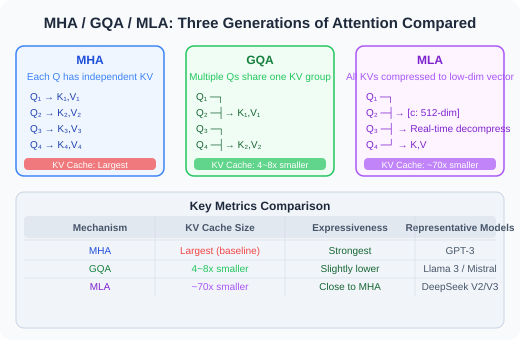

```python
class GroupedQueryAttention:
    """GQA: multiple Q heads share one KV group, greatly reducing the KV Cache"""
    def __init__(self, d_model=4096, n_q_heads=32, n_kv_heads=8):
        self.n_q_heads = n_q_heads     # 32 Query heads
        self.n_kv_heads = n_kv_heads   # 8 KV heads (every 4 Q heads share 1 KV)
        self.n_groups = n_q_heads // n_kv_heads  # 4 Q heads per group
        self.head_dim = d_model // n_q_heads
        
        self.wq = Linear(d_model, n_q_heads * self.head_dim)   # 32 Q groups
        self.wk = Linear(d_model, n_kv_heads * self.head_dim)  # only 8 K groups!
        self.wv = Linear(d_model, n_kv_heads * self.head_dim)  # only 8 V groups!
    
    def forward(self, x):
        B, S, D = x.shape
        Q = self.wq(x).view(B, S, self.n_q_heads, self.head_dim).transpose(1, 2)
        K = self.wk(x).view(B, S, self.n_kv_heads, self.head_dim).transpose(1, 2)
        V = self.wv(x).view(B, S, self.n_kv_heads, self.head_dim).transpose(1, 2)
        
        # Key step: replicate K/V n_groups times so every Q head finds its matching KV
        # [batch, n_kv_heads, seq, head_dim] → [batch, n_q_heads, seq, head_dim]
        K = K.repeat_interleave(self.n_groups, dim=1)  # each KV head is copied 4 times
        V = V.repeat_interleave(self.n_groups, dim=1)
        
        # From here on, the attention computation is exactly the same as MHA
        return scaled_dot_product_attention(Q, K, V)
    
    # KV Cache shrinks to 1/4 of MHA (32→8 heads)
    # Llama 3 70B: KV Cache goes from 2.5GB/1K → ~0.6GB/1K
```

GQA loses **almost no model quality** (verified by extensive ablation studies), yet reduces the KV Cache by 4–8×. This is why almost every mainstream model released after 2023 adopted GQA.

**Which models use GQA?**
- Llama 2/3/4, Qwen 2/2.5/3, Gemma 2/3, Mistral/Mixtral, Phi-3/4

### MLA: Multi-head Latent Attention (a DeepSeek Innovation)

DeepSeek-V2 (2024) proposed a more radical approach — **Multi-head Latent Attention**. Instead of reducing the number of KV heads, it **compresses the entire KV into a low-dimensional latent space**.

**Core idea**: GQA reduces the number of KV heads (from 32 down to 8) while keeping the dimension of each KV head unchanged. MLA takes a different route — regardless of how many heads there are, it first compresses all KV information into an extremely low-dimensional "latent vector" (512 dims) and caches that compressed vector; when attention needs to be computed, it decompresses it back into full KV on the fly:

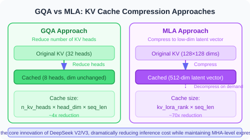

Essentially this turns the KV storage problem into a **low-rank factorization** problem — using a low-dimensional vector to approximate high-dimensional KV information:

```python
class MultiHeadLatentAttention:
    """
    MLA: DeepSeek's core innovation
    Not "sharing heads," but "compressing KV into a low-dimensional space"
    
    DeepSeek-V3 parameters:
    - d_model = 7168
    - n_heads = 128, head_dim = 128
    - Full KV dimension = 128 × 128 × 2 = 32768
    - After MLA compression = 512 dims  → a 64:1 compression ratio!
    """
    def __init__(self, d_model=7168, n_heads=128, kv_lora_rank=512, qk_rope_dim=64):
        self.n_heads = n_heads
        self.head_dim = 128
        self.kv_lora_rank = kv_lora_rank
        
        # ── KV compression path ──
        # Down-projection: compress the input into a 512-dim latent vector (this is what gets cached!)
        self.kv_down_proj = Linear(d_model, kv_lora_rank)          # 7168 → 512
        # Up-projection: decompress from 512 dims back to full KV during inference
        self.kv_up_proj = Linear(kv_lora_rank, n_heads * self.head_dim * 2)  # 512 → 32768
        
        # ── Handling Q (MLA also compresses Q, but Q never needs caching) ──
        self.q_down_proj = Linear(d_model, 1536)                    # Q is compressed first
        self.q_up_proj = Linear(1536, n_heads * self.head_dim)      # then decompressed
        
        # ── Decoupled RoPE: handle the positional part separately ──
        # A key MLA trick: split Q/K into a "content part" and a "position part"
        # Apply RoPE only to the position part; the content part is not rotated
        # This way the cached latent vector carries no positional information and can be reused at any position
        self.q_rope_proj = Linear(1536, n_heads * qk_rope_dim)      # position part of Q
        self.k_rope_proj = Linear(d_model, qk_rope_dim)             # position part of K
    
    def forward(self, x, kv_cache=None):
        # ── Step 1: compress KV and store it in the cache ──
        compressed_kv = self.kv_down_proj(x)  # [batch, seq, 512] ← this is all we cache!
        
        if kv_cache is not None:
            kv_cache.append(compressed_kv)    # only 512 dims stored per Token
            all_compressed_kv = kv_cache.get_all()  # retrieve all historical compressed KV
        else:
            all_compressed_kv = compressed_kv
        
        # ── Step 2: decompress KV on the fly (only at compute time; full KV is never stored) ──
        full_kv = self.kv_up_proj(all_compressed_kv)  # 512 → 32768
        k_content, v = full_kv.chunk(2, dim=-1)        # split into K and V
        
        # ── Step 3: handle Q ──
        q_compressed = self.q_down_proj(x)
        q_content = self.q_up_proj(q_compressed)
        
        # ── Step 4: decoupled RoPE (positional encoding is applied only to dedicated dimensions) ──
        q_rope = apply_rope(self.q_rope_proj(q_compressed))  # position part of Q
        k_rope = apply_rope(self.k_rope_proj(x))              # position part of K
        
        # Concatenate the content part + the position part
        q = torch.cat([q_content, q_rope], dim=-1)
        k = torch.cat([k_content, k_rope], dim=-1)
        
        # ── Step 5: standard attention computation ──
        return scaled_dot_product_attention(q, k, v)
```

**Why does MLA need "decoupled RoPE"?** This is a subtle but crucial design choice. If RoPE were applied directly to the compressed latent vector, the same Token would produce a different latent vector at different positions (because RoPE depends on position), and the cache would become useless. MLA's solution is to split K into two parts: a position-free "content K" (safe to cache) and a position-bearing "position K" (computed on the fly); the two are concatenated before attention is applied.

**How impressive are the results?**

| Attention Type | KV Cache / Token | vs. MHA |
|-----------|-----------------|---------|
| MHA (Llama 2 level) | ~2.5 GB / 1K tokens | Baseline |
| GQA (Llama 3 level) | ~0.6 GB / 1K tokens | 75% reduction |
| **MLA (DeepSeek-V3)** | ~0.04 GB / 1K tokens | **98.6% reduction** |

MLA is what allows DeepSeek-V3 (671B parameters) to handle extremely long contexts on relatively limited hardware — something GQA simply cannot do.

### Three Generations of Attention Mechanisms Compared


## Evolution of Normalization: LayerNorm → RMSNorm + Pre-Norm

### From Post-Norm to Pre-Norm

The original Transformer used **Post-Normalization** — compute attention/FFN first, then normalize. GPT-2 (2019) found that placing normalization **before** attention/FFN (Pre-Normalization) significantly improves training stability for deep networks:

```python
# Post-Norm (original Transformer, now obsolete)
x = x + Attention(x)
x = LayerNorm(x)        # normalization comes after

# Pre-Norm (modern standard)
x = x + Attention(RMSNorm(x))  # normalization comes before
# Gradients can flow straight back through the residual connection without being "blocked" by the norm layer
```

### From LayerNorm to RMSNorm

Standard LayerNorm requires computing the mean and the variance:

```python
# LayerNorm: subtract the mean, divide by the standard deviation
def layer_norm(x, gamma, beta):
    mean = x.mean(dim=-1, keepdim=True)
    var = x.var(dim=-1, keepdim=True)
    return gamma * (x - mean) / sqrt(var + eps) + beta

# RMSNorm: divide by RMS (root mean square) only, drop the mean centering
def rms_norm(x, gamma):
    rms = sqrt(mean(x ** 2) + eps)
    return gamma * x / rms
    # No mean computation, no beta bias → faster!
```

Advantages of RMSNorm:
- **Faster**: eliminates the mean computation and the bias parameters
- **Equivalent quality**: extensive experiments show it matches LayerNorm in LLM training
- **Hardware-friendly**: simpler computation → better GPU kernel optimization

**Why does it still work without mean centering?** That is a fair question. LayerNorm does two things: ① subtract the mean (centering) and ② divide by the standard deviation (scaling). RMSNorm only does ②.

The original LayerNorm paper argued that mean centering was necessary, but later research found that under the Transformer's Pre-Norm setup the residual connections are already doing a kind of implicit "centering" — every layer's output is added back onto the residual stream, so the mean of the activations naturally stays stable. Explicit mean centering is therefore redundant.

Put more intuitively: the core purpose of normalization is to **control the scale of the activations** (to prevent exploding/vanishing gradients), not to force the mean to zero. RMS normalization achieves that goal perfectly well, and its computation is simpler.

> 📊 **Industry consensus**: among 53 analyzed Transformer models, **77.4%** use RMSNorm. Mainstream models released after 2023 use Pre-Norm + RMSNorm at nearly 100%.

## Evolution of Positional Encoding: Absolute → Relative → RoPE

The Transformer architecture itself is "oblivious" to Token order — the attention mechanism only looks at the dot product of Q and K, and has no idea whether "apple" comes before or after "eat." Positional encoding is what tells the model "where a Token sits in the sequence."

### Three Generations of Positional Encoding

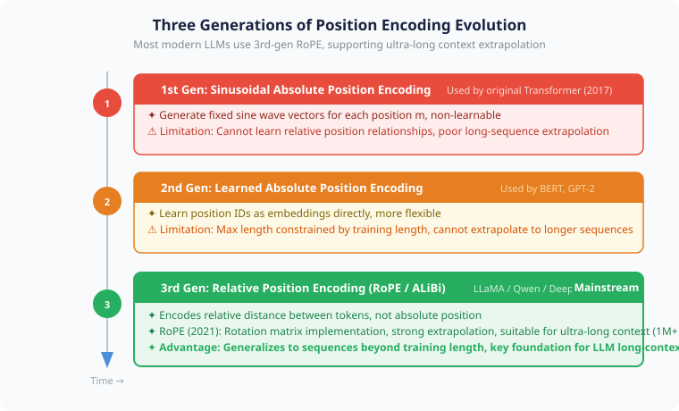

### Generation 1: Sinusoidal Encoding (Original Transformer)

For position $m$ and dimension $i$, the original paper defines:

$$PE(m, 2i) = \sin\!\left(\frac{m}{10000^{2i/d}}\right), \quad PE(m, 2i+1) = \cos\!\left(\frac{m}{10000^{2i/d}}\right)$$

```python
def sinusoidal_encoding(max_len, d_model):
    """Sinusoidal positional encoding from the original Transformer"""
    pe = torch.zeros(max_len, d_model)
    position = torch.arange(0, max_len).unsqueeze(1).float()
    
    # Frequencies: from low frequency (long wavelength) to high frequency (short wavelength)
    div_term = 10000 ** (torch.arange(0, d_model, 2).float() / d_model)
    
    pe[:, 0::2] = torch.sin(position / div_term)   # even dimensions: sin
    pe[:, 1::2] = torch.cos(position / div_term)   # odd dimensions: cos
    
    return pe  # [max_len, d_model]

# Intuition:
# Low dimensions (dims 0, 1): very long wavelength, changes slowly → distinguishes "rough position" (start, middle, end)
# High dimensions (last few):  very short wavelength, changes fast → distinguishes adjacent positions
```

**Why sine/cosine?** The position vector $PE(m+k)$ for any relative offset $k$ can be expressed as a linear transformation of $PE(m)$ — this is the geometric basis for "positional differences being perceivable."

### Generation 2: ALiBi (2021, Pioneer of Inference-Time Extrapolation)

ALiBi does not add positional vectors to Tokens at all. Instead it **subtracts a penalty that grows with distance** directly from the attention scores:

$$\text{Attention}_{ij} = \frac{q_i \cdot k_j}{\sqrt{d_k}} - m \cdot |i - j|$$

```python
# The core of ALiBi: add a "distance penalty" to the attention scores
def alibi_bias(seq_len, n_heads):
    """Generate the ALiBi bias matrix for each attention head"""
    # Each head has a different penalty slope m (geometric series)
    slopes = 2 ** (-8 * torch.arange(1, n_heads+1) / n_heads)
    
    # Build the distance matrix: [i-j] for every Token pair
    positions = torch.arange(seq_len)
    distance = positions.unsqueeze(0) - positions.unsqueeze(1)  # [seq, seq]
    
    # Each head scales the distance with its own slope
    bias = slopes.unsqueeze(-1).unsqueeze(-1) * distance.abs()
    return -bias  # added to the attention scores (negative: the farther, the harsher the penalty)
```

ALiBi's strength is **extrapolation**: it is trained on short sequences yet generalizes to longer ones at inference time. But compared with RoPE it lacks precise relative-position encoding, so it still loses accuracy on very long contexts.

### Generation 3: RoPE Rotary Position Embeddings — Full Derivation

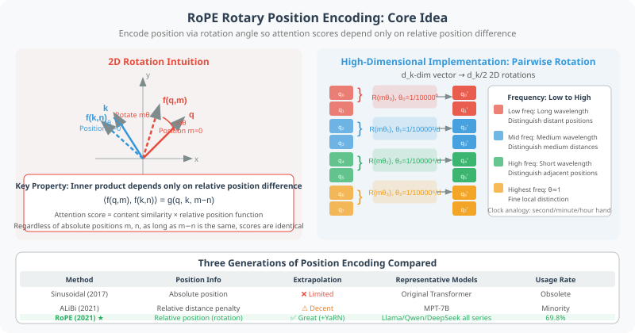

**RoPE (Rotary Position Embeddings)**, proposed by Su et al. (2021), became the de facto standard after 2023.

#### Core Idea: Encoding Relative Position with Rotation

Suppose we could design a function $f$ such that:

$$\langle f(q, m),\, f(k, n) \rangle = g(q, k, m-n)$$

That is, **the inner product of two vectors (the attention score) depends only on their relative positional difference $m-n$**. Then the model naturally acquires relative-position awareness.

#### Derivation for the 2D Case (Intuitive Foundation)

Consider the two-dimensional vector $q = (q_1, q_2)$ and apply a rotation angle $m\theta$ for position $m$:

$$f(q, m) = \begin{pmatrix} \cos(m\theta) & -\sin(m\theta) \\ \sin(m\theta) & \cos(m\theta) \end{pmatrix} \begin{pmatrix} q_1 \\ q_2 \end{pmatrix}$$

Computing the inner product of the two rotated vectors:

$$\langle f(q, m), f(k, n) \rangle = q_1 k_1 \cos\big((m-n)\theta\big) + q_2 k_2 \cos\big((m-n)\theta\big) + \ldots$$

The result contains only $(m-n)\theta$, which **perfectly satisfies the relative-position condition** ✅

#### Generalizing to Higher Dimensions (Actual Implementation)

For a $d_k$-dimensional vector (with $d_k$ even), group the dimensions in pairs, apply a 2D rotation to each pair, and set the rotation angle at a different frequency per group:

$$\theta_i = \frac{1}{10000^{2i/d_k}}, \quad i = 0, 1, \ldots, \frac{d_k}{2}-1$$

The complete RoPE transformation (for a $d_k=8$ vector split into 4 groups):

$$\begin{pmatrix} q_0 \\ q_1 \\ q_2 \\ q_3 \\ q_4 \\ q_5 \\ q_6 \\ q_7 \end{pmatrix} \xrightarrow{\text{RoPE}(m)} \begin{pmatrix} q_0 \cos(m\theta_0) - q_1 \sin(m\theta_0) \\ q_0 \sin(m\theta_0) + q_1 \cos(m\theta_0) \\ q_2 \cos(m\theta_1) - q_3 \sin(m\theta_1) \\ q_2 \sin(m\theta_1) + q_3 \cos(m\theta_1) \\ q_4 \cos(m\theta_2) - q_5 \sin(m\theta_2) \\ q_4 \sin(m\theta_2) + q_5 \cos(m\theta_2) \\ q_6 \cos(m\theta_3) - q_7 \sin(m\theta_3) \\ q_6 \sin(m\theta_3) + q_7 \cos(m\theta_3) \end{pmatrix}$$

```python
import torch

def precompute_rope_freqs(d_k: int, max_seq_len: int, base: float = 10000.0):
    """Pre-compute the cos/sin frequency matrices for RoPE"""
    # Rotation frequency of each group (from low to high frequency)
    # θ_i = 1 / 10000^(2i/d_k), i = 0, 1, ..., d_k/2-1
    theta = 1.0 / (base ** (torch.arange(0, d_k, 2).float() / d_k))
    # shape: [d_k/2], e.g., d_k=128 → 64 frequencies
    
    # The angle for each position = position × frequency
    positions = torch.arange(max_seq_len).float()       # [max_seq_len]
    freqs = torch.outer(positions, theta)               # [max_seq_len, d_k/2]
    # freqs[m, i] = m * θ_i
    
    # Pre-compute cos and sin
    cos = torch.cos(freqs)   # [max_seq_len, d_k/2]
    sin = torch.sin(freqs)   # [max_seq_len, d_k/2]
    return cos, sin


def apply_rope(x: torch.Tensor, cos: torch.Tensor, sin: torch.Tensor):
    """
    Apply RoPE to Q or K
    x:   [batch, n_heads, seq_len, d_k]
    cos: [seq_len, d_k/2]
    sin: [seq_len, d_k/2]
    """
    # Split the d_k dimension in half: [x1, x2] = [first half, second half]
    x1 = x[..., :x.shape[-1] // 2]   # even dimensions
    x2 = x[..., x.shape[-1] // 2:]   # odd dimensions
    
    # Broadcast cos/sin over the batch and head dimensions
    cos = cos[:x.shape[2], :].unsqueeze(0).unsqueeze(0)  # [1, 1, seq, d_k/2]
    sin = sin[:x.shape[2], :].unsqueeze(0).unsqueeze(0)
    
    # Rotation transform: (x1, x2) → (x1·cos - x2·sin, x1·sin + x2·cos)
    rotated = torch.cat([
        x1 * cos - x2 * sin,
        x1 * sin + x2 * cos,
    ], dim=-1)
    return rotated


# Using RoPE inside the attention computation
class RoPEAttention:
    def __init__(self, d_model=4096, n_heads=32):
        self.n_heads = n_heads
        self.d_k = d_model // n_heads
        self.W_Q = nn.Linear(d_model, d_model, bias=False)
        self.W_K = nn.Linear(d_model, d_model, bias=False)
        self.W_V = nn.Linear(d_model, d_model, bias=False)
        
        # Pre-compute the frequencies (only once)
        self.cos, self.sin = precompute_rope_freqs(
            self.d_k, max_seq_len=131072  # 128K context
        )
    
    def forward(self, x):
        B, S, D = x.shape
        Q = self.W_Q(x).view(B, S, self.n_heads, self.d_k).transpose(1, 2)
        K = self.W_K(x).view(B, S, self.n_heads, self.d_k).transpose(1, 2)
        V = self.W_V(x).view(B, S, self.n_heads, self.d_k).transpose(1, 2)
        
        # ← Key point: apply RoPE only to Q and K (never to V)
        Q = apply_rope(Q, self.cos, self.sin)
        K = apply_rope(K, self.cos, self.sin)
        
        # Then compute attention as usual
        return scaled_dot_product_attention(Q, K, V)
```

#### Why Can RoPE Extrapolate?

> - Low-frequency dimensions (i=0): θ ≈ 1/10000, wavelength ≈ 62831 → distinguishes very distant positions
> - Mid-frequency dimensions (i=32): θ ≈ 0.01, wavelength ≈ 628 → distinguishes medium distances
> - High-frequency dimensions (i=63): θ ≈ 1.0, wavelength ≈ 6 → distinguishes adjacent positions
>
> At a training length of 8192, the high-frequency dimensions have rotated ~1365 full turns while the low-frequency dimensions have rotated ~0.13 turns; extrapolating to 131072, the low-frequency dimensions have rotated ~2 turns → the model has seen similar patterns before

**High-frequency dimensions handle adjacency** (thoroughly trained), while **low-frequency dimensions encode global position** (few turns, so they need extrapolation help).

### Context Extension: YaRN and NTK-aware Scaling

A key practical issue with RoPE is **how to run a model on sequences longer than anything it saw during training**:

```python
# The model was trained with max_seq_len = 8192
# But you want to use it at 128K or even 1M context

# Method 1: NTK-aware scaling (adjust the frequency base)
def ntk_scaled_rope(dim, max_position, base=10000, scaling_factor=16):
    """NTK-aware scaling: raise the base so high-frequency components keep their precision"""
    new_base = base * (scaling_factor ** (dim / (dim - 2)))
    freqs = 1.0 / (new_base ** (torch.arange(0, dim, 2) / dim))
    return freqs

# Method 2: YaRN (Yet another RoPE extensioN)
# Combines NTK scaling + attention score temperature correction
# Llama 4 Scout used YaRN to achieve a 10M token context!
```

### Summary: Three Generations of Positional Encoding Compared

| Method | Origin | Positional Information | Extrapolation | Trainable Parameters | Representative Models |
|------|------|---------|---------|---------|---------|
| Sinusoidal | 2017 original | Absolute position | Limited | ❌ None | Original Transformer |
| Learned Abs | BERT/GPT | Absolute position | ❌ None | ✅ Yes | BERT, GPT-2 |
| ALiBi | PaLM, MPT | Relative distance penalty | ✅ Fairly good | ❌ None | MPT-7B |
| **RoPE** | **LLaMA+** | **Relative position (rotation)** | **✅ Very good** | **❌ None** | **The entire Llama/Qwen/DeepSeek families** |

> 📊 **Industry consensus**: among the 53 analyzed models, **69.8%** use RoPE. Among Decoder-Only LLMs released after 2022, RoPE is the overwhelmingly dominant choice.

## Activation Functions and FFN: The Dominance of SwiGLU

Besides attention, every Transformer layer also contains a **feed-forward network (FFN/MLP)**. Its activation function has undergone significant evolution:

```python
# Classic FFN: two linear transformations + ReLU
class ClassicFFN:
    def forward(self, x):
        return self.w2(F.relu(self.w1(x)))
        # Parameter count: 2 × d_model × d_ff (typically d_ff = 4 × d_model)

# Modern FFN: SwiGLU (Swish-Gated Linear Unit)
class SwiGLU_FFN:
    def forward(self, x):
        gate = F.silu(self.w_gate(x))    # Swish activation = x * sigmoid(x)
        up = self.w_up(x)                 # up projection
        return self.w_down(gate * up)      # gate × up projection → down projection
        # Parameter count: 3 × d_model × d_ff (one extra gate projection)
        # But d_ff is usually reduced from 4d to ~2.67d to keep the total parameter count the same
```

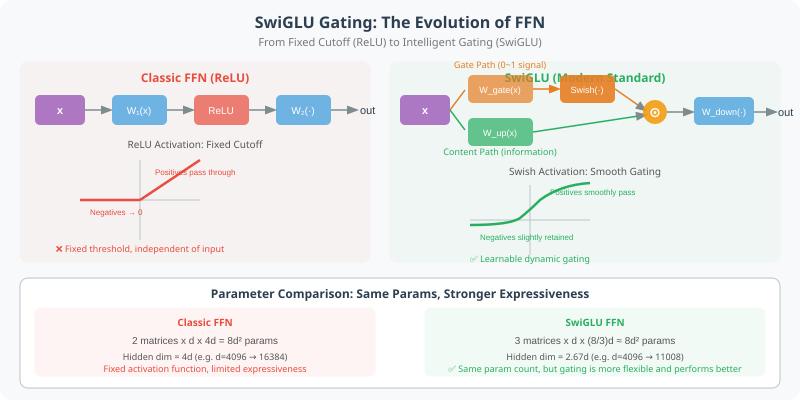

The core of SwiGLU is its **gating mechanism** — it lets the network decide for itself "which information passes through and which gets suppressed," giving it stronger expressive power than a plain ReLU.

> - **ReLU**: `max(0, x)` → simple truncation, all negatives become zero
> - **GeLU**: `x · Φ(x)` → probabilistic gating, a smooth version of ReLU
> - **SwiGLU**: `Swish(Wx) ⊙ (Vx)` → a learned gate (0~1) × the content signal

**Intuition behind SwiGLU**: project the FFN input $x$ twice to get two signal paths:
- **Gate path (gate)**: passes through a Swish activation and outputs an "on/off signal" between 0 and 1
- **Content path (up)**: a linear transformation carrying the actual information content

Multiply the two element-wise: the gate signal decides which dimensions of the content signal get "let through" and which get "suppressed." This is far more flexible than ReLU's "hard truncation" — the gate signal is **input-dependent and learnable**, not a fixed threshold.

> **ReLU FFN** = a fixed filter screen (all negatives filtered out); **SwiGLU FFN** = a smart valve (dynamically adjusting how much passes through each dimension based on the input)

**Why three projection matrices (w_gate, w_up, w_down) instead of two?** The classic FFN is `w2(relu(w1(x)))`, with only 2 matrices. SwiGLU adds a gate projection, but to keep the total parameter count unchanged the hidden dimension is usually reduced from $4d$ to $\frac{8}{3}d \approx 2.67d$:

> **Classic FFN**: 2 × d × 4d = 8d² parameters
>
> **SwiGLU**: 3 × d × (8/3)d = 8d² parameters (same parameter count, but greater expressive power)

> 📊 **Industry consensus**: **71.7%** of the analyzed models use SwiGLU or GeGLU. Since LLaMA, this has become an unwritten standard.

## MoE Architecture: The Power of Sparsity

We introduced MoE from a "trends" perspective in Section 3.6. Here we take a closer look at its **architectural details**.

### Basic Structure of MoE

MoE replaces the standard FFN layer with multiple "expert" networks plus a "router":

```python
class MoELayer:
    """Mixture-of-Experts layer: replaces the standard FFN"""
    def __init__(self, d_model, n_experts=64, n_active=8):
        # 64 experts, but only 8 are activated per token
        self.experts = [SwiGLU_FFN(d_model) for _ in range(n_experts)]
        self.router = Linear(d_model, n_experts)  # router: decides which experts to activate
    
    def forward(self, x):
        # 1. Routing decision: each token picks its experts independently
        router_logits = self.router(x)              # [batch, seq, n_experts]
        weights, indices = router_logits.topk(k=8)  # pick the top-8 experts
        weights = F.softmax(weights, dim=-1)         # normalize the weights
        
        # 2. Expert computation: only the selected experts are activated
        output = 0
        for i, (expert_idx, w) in enumerate(zip(indices, weights)):
            output += w * self.experts[expert_idx](x)
        
        return output
```

**The core challenge of MoE: router collapse**

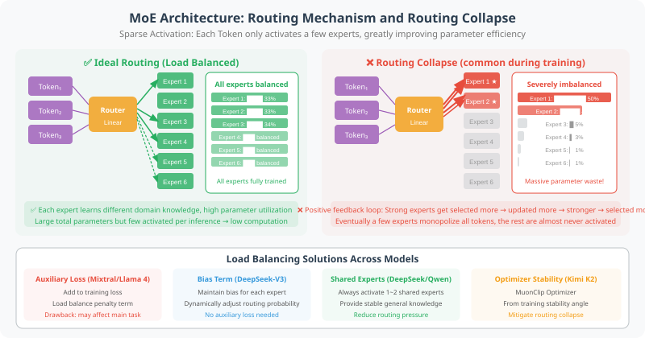

It sounds wonderful, but MoE training has a serious problem — the router very easily gets "lazy" and sends every Token to the same expert or a small handful of experts.

**Why does it collapse?** The router is a linear layer whose output (logits) determines which experts get selected. Early in training, some experts happen to be selected more often, receive more gradient updates, and become stronger; stronger experts are then more likely to be selected, forming a positive feedback loop — "the strong get stronger" — until a few experts monopolize all the Tokens.

### MoE Configurations Vary Widely Across Models

| Model | Total Experts | Active Experts | Shared Experts | Routing | Load Balancing |
|------|---------|----------|---------|---------|---------|
| **Mixtral 8×22B** | 8 | 2 | None | Top-2 softmax | Auxiliary loss |
| **DeepSeek-V3** | 256 | 8 | 1 shared | Top-8 sigmoid | **No auxiliary loss** (bias term) |
| **DeepSeek V4** | 256 | 8 | 1 shared | Top-8 sigmoid | No auxiliary loss + **mHC hyper-connections** |
| **Kimi K2** | 128+ | ~8 | Yes | Top-K | MuonClip optimizer stabilizes training |
| **Llama 4 Scout** | 16 | 1 | None | Top-1 | Auxiliary loss |
| **Llama 4 Maverick** | 128 | 1 | None | Token-choice | Auxiliary loss |
| **Qwen 3 (235B)** | 128 | 8 | Yes | Top-8 | Auxiliary loss |
| **Qwen3.5-Plus** | 128 | 8 | Yes | Top-8 | Optimized auxiliary loss |
| **MiniMax M2.5** | — | — | — | — | Lightning Attention hybrid |

### Two Key Innovations from DeepSeek

**1. Shared Expert**

DeepSeek designates a subset of experts as "always active," providing a stable base of general knowledge:

```python
class DeepSeekMoE:
    """DeepSeek's MoE: shared experts + routed experts"""
    def __init__(self):
        self.shared_expert = SwiGLU_FFN()     # always participates in computation
        self.routed_experts = [SwiGLU_FFN() for _ in range(256)]
        self.router = Linear(d_model, 256)
    
    def forward(self, x):
        # Shared expert: every token goes through it
        shared_out = self.shared_expert(x)
        
        # Routed experts: each token picks its top-8
        indices, weights = self.route(x)
        routed_out = weighted_sum(self.routed_experts, indices, weights)
        
        return shared_out + routed_out
```

**2. Load Balancing Without Auxiliary Loss**

A classic difficulty with MoE is "router collapse" — all tokens rush toward a handful of experts. The usual fix is to add an auxiliary loss function that penalizes imbalance, but this interferes with the main training objective.

DeepSeek-V3 introduced a clean alternative — **adding a learnable bias term to each expert**:

```python
# Traditional approach: auxiliary loss (interferes with the main training objective)
loss = main_loss + alpha * load_balance_loss

# DeepSeek approach: bias term (does not interfere with the main training objective)
router_logits = self.router(x) + self.expert_bias
# expert_bias does not participate in gradient updates; it is adjusted by a rule instead:
# If an expert is overloaded → lower its bias
# If an expert is underloaded → raise its bias
```

## Full Architecture Comparison of Open-Source Models

Now let's put all the technical modules together and look at the complete architectural choices of mainstream open-source models from 2024 to 2026:

| Architecture Component | Llama 3 (2024) | Llama 4 (2025) | DeepSeek-V3 | DeepSeek V4 | Qwen 3 | Qwen3.5 | Kimi K2 | Kimi K2.5 |
|---------|----------------|----------------|-------------|-------------|--------|---------|---------|-----------|
| **Base architecture** | Dense | MoE | MoE | MoE | Dense/MoE | MoE | MoE | MoE |
| **Attention** | GQA | GQA | **MLA** | **MLA** + DSA 2.0 | GQA | **Gated DeltaNet hybrid** | GQA | **Kimi Linear hybrid** |
| **Normalization** | RMSNorm | RMSNorm | RMSNorm | RMSNorm | RMSNorm | RMSNorm | RMSNorm | RMSNorm |
| **Residual connection** | Standard additive | Standard additive | Standard additive | **mHC hyper-connections** | Standard additive | Standard additive | Standard additive | **Attention Residuals** |
| **Positional encoding** | RoPE | RoPE+YaRN | RoPE | RoPE | RoPE+YaRN | RoPE+YaRN | RoPE | RoPE |
| **Activation function** | SwiGLU | SwiGLU | SwiGLU | SwiGLU | SwiGLU | SwiGLU | SwiGLU | SwiGLU |
| **Optimizer** | AdamW | AdamW | AdamW | AdamW | AdamW | AdamW | **MuonClip** | **MuonClip** |
| **MoE expert count** | — | 16/128 | 256+1 | 256+1 | 128 | 128 | 128+ | — |
| **Total/active params** | 8B~405B | 109B~400B | 671B/~37B | 671B/~37B | 0.6B~235B | 397B/17B | **1T/32B** | 48B/3B |
| **Context** | 128K | 10M | 128K | **1M+** | 32K~128K | 262K | 128K | 256K |

### A Key Observation: Architecture is "Diverging"

If the theme of 2024–2025 was architectural **convergence** (the consensus stack), then the theme of 2026 is architectural **divergence** — on top of the consensus stack, the major models are starting to explore radically different innovation paths:

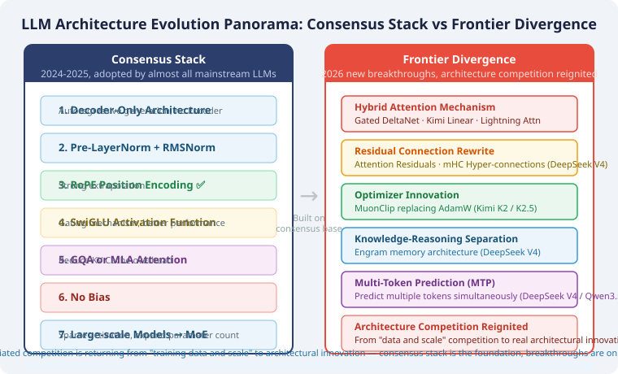

Differentiated competition is shifting from "training data and scale" back toward **architectural innovation**:
1. **Hybrid attention design** (the ratio and manner of mixing linear attention with full attention)
2. **Information flow optimization** (residual connections, hyper-connections, and other inter-layer information transfer mechanisms)
3. **Training efficiency** (optimizer innovation, multi-token prediction, and so on)
4. **Inference efficiency** (knowledge offloading, sparse attention, KV-Cache optimization)
5. **Concrete MoE design** (number of experts, routing strategy, load balancing)
6. **Long-context extension techniques** (YaRN, NTK scaling, linear attention)

## FlashAttention: The Hardware Magic That Makes Long Context Possible

Everything above is innovation at the "model architecture" level. But there is one **computational-level** breakthrough that has had an enormous impact on what LLMs can actually do — **FlashAttention**.

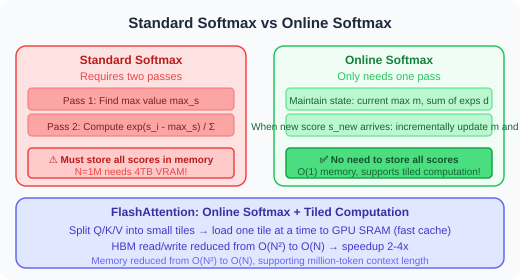

The problem with standard attention is that it has to **instantiate the entire attention matrix** (N×N); once N reaches the million scale, memory simply explodes:

```python
# Standard attention: O(N²) memory
def standard_attention(Q, K, V):
    scores = Q @ K.T / sqrt(d)  # [N, N] ← needs 4TB of memory when N=1M (fp32)!
    weights = softmax(scores)    # this matrix must live in GPU memory in its entirety
    return weights @ V
```

**FlashAttention's core insight: tiled computation + online softmax**

The key question for FlashAttention is: softmax needs to see **all** the scores in order to normalize (the denominator is the sum of every $e^{s_i}$), so how can it be computed tile by tile?

The answer is **online softmax** — a softmax algorithm that can be updated incrementally:


With online softmax, FlashAttention can split Q, K, and V into small tiles and process them one at a time, loading only one small tile into the GPU's SRAM (fast cache) at a time:

```python
# FlashAttention: tiled computation, O(N) memory
def flash_attention(Q, K, V, block_size=256):
    """
    Core idea: never instantiate the full N×N matrix
    Instead: tiled computation + online softmax updates
    
    GPU memory hierarchy:
    HBM (high-bandwidth memory, slow but large): holds the full Q/K/V
    SRAM (on-chip cache, fast but small):        loads only one small tile at a time
    """
    N = Q.shape[0]
    output = zeros_like(Q)          # final output
    m = full(N, -inf)               # online softmax: current maximum
    d = zeros(N)                    # online softmax: current sum of exponentials
    
    for i in range(0, N, block_size):           # iterate over the tiles of Q
        q_block = Q[i:i+block_size]             # load from HBM into SRAM
        
        for j in range(0, N, block_size):       # iterate over the tiles of K/V
            k_block = K[j:j+block_size]         # load from HBM into SRAM
            v_block = V[j:j+block_size]
            
            # Compute the attention scores for this tile only (done in SRAM, never written back to HBM)
            block_score = q_block @ k_block.T / sqrt(d)
            
            # Online softmax update (incrementally update m and d, no full matrix required)
            m_new = maximum(m[i:i+block_size], block_score.max(dim=-1))
            d[i:i+block_size] = d[i:i+block_size] * exp(m[i:i+block_size] - m_new) \
                                 + exp(block_score - m_new).sum(dim=-1)
            
            # Incrementally update the output (correct the old output + add this tile's contribution)
            output[i:i+block_size] = output[i:i+block_size] * exp(m[i:i+block_size] - m_new).unsqueeze(-1) \
                                     + exp(block_score - m_new.unsqueeze(-1)) @ v_block
            m[i:i+block_size] = m_new
        
        # Final normalization
        output[i:i+block_size] /= d[i:i+block_size].unsqueeze(-1)
    
    return output
    # Memory drops from O(N²) to O(N)  ← no need to store the N×N attention matrix
    # Speed improves 2~4×  ← fewer HBM reads and writes (IO-aware)
```

**Why is it faster?** Not just because it uses less memory, but more importantly because it **reduces the number of HBM reads and writes**. A GPU computes far faster than its memory bandwidth allows data to move; standard attention has to write the N×N matrix to HBM and read it back, and that IO is the bottleneck. FlashAttention performs the whole attention computation inside SRAM, dramatically cutting HBM accesses.

Three generations of FlashAttention:

| Version | Year | Key Improvement |
|------|------|---------|
| FlashAttention-1 | 2022 | IO-aware tiled computation, O(N²) → O(N) memory |
| FlashAttention-2 | 2023 | Better parallelization, another 2× speedup |
| FlashAttention-3 | 2024 | Asynchronous execution on Tensor Cores, approaching the hardware's theoretical peak |

> 💡 **Impact on Agents**: FlashAttention is the unsung hero behind million-token context windows. Without it, neither Gemini 2.5 Pro's 2M context nor Llama 4 Scout's 10M context would be possible. As an Agent developer you never need to implement it yourself (every major inference framework ships with it), but understanding it helps you understand the capability boundaries of models.

## New Architectural Breakthroughs in 2026

From late 2025 into early 2026, foundation model architecture saw a wave of important innovations — overturning the earlier judgment that "the architecture has crystallized," with multiple components being redesigned. Here are the four most noteworthy directions.

### Hybrid Attention: Linear + Full Attention

The most important architectural trend of 2026 is **hybrid attention** — replacing most full-attention layers with linear-complexity attention variants and keeping only a few full-attention layers for situations that genuinely require global information.

```python
# The core idea of hybrid attention
class HybridAttentionBlock:
    """
    The mainstream 2026 design: 3 out of every 4 layers use linear attention, 1 uses full attention
    
    Qwen3.5:  Gated DeltaNet : Gated Attention = 3:1
    Kimi K2.5: KDA (Kimi Delta Attention) : Full Attention = 3:1
    MiniMax M2.5: Lightning Attention : Full Attention = hybrid
    """
    def __init__(self, layer_idx, d_model):
        if layer_idx % 4 == 3:  # one full-attention layer every 4 layers
            self.attn = FullAttention(d_model)      # O(N²) but retains global modeling capability
        else:
            self.attn = GatedDeltaNet(d_model)       # O(N) linear complexity
    
    def forward(self, x):
        return self.attn(x)
```

**Gated DeltaNet (used by Qwen3.5)**: combines the Delta Rule (an incremental learning rule) with a gating mechanism, achieving the O(N) complexity of linear attention while using the gate to retain selective memory of important information:

```python
class GatedDeltaNet:
    """
    Gated DeltaNet: Qwen3.5's linear attention variant
    Core idea: replace the "global attention matrix" with "incremental updates"
    
    Comparison:
    - Full attention: every token computes attention against every token → O(N²)
    - Gated DeltaNet: maintains a compressed state and updates it incrementally → O(N)
    """
    def forward(self, x):
        # 1. Compute query, key, value
        q, k, v = self.qkv_proj(x).split(3)
        
        # 2. Gating: decides "how much old information to keep, how much new information to take in"
        gate = torch.sigmoid(self.gate_proj(x))  # gate signal
        
        # 3. Delta Rule incremental update of the state matrix
        # S_{t} = gate * S_{t-1} + (1 - gate) * k_t ⊗ v_t
        state = gate * prev_state + (1 - gate) * torch.outer(k, v)
        
        # 4. Extract information from the state using the query vector
        output = q @ state
        return output
    
    # Key advantages:
    # - No KV-Cache needed at inference time (the state matrix has a fixed size)
    # - At 128K~1M context, decoding speed improves 5~6×
    # - Gating preserves selective attention to important information
```

**Kimi Linear (used by Kimi K2.5)**: KDA (Kimi Delta Attention), proposed by Moonshot AI, mixes linear attention and global attention at a 3:1 ratio, delivering a 5–6× decoding speedup in the 128K~1M range.

**Performance comparison**:

| Attention Type | Complexity | 128K Decoding Speed | 1M Decoding Speed | Quality Loss |
|-----------|--------|-------------|------------|---------|
| Full attention (standard Transformer) | O(N²) | Baseline | Baseline | — |
| GQA | O(N²) (smaller KV) | ~1.2× | ~1.2× | Almost none |
| Gated DeltaNet hybrid 3:1 | O(N) (most layers) | ~4× | **~5×** | Extremely low |
| Kimi Linear hybrid 3:1 | O(N) (most layers) | ~5× | **~6×** | Extremely low |

> 💡 **Impact on Agents**: hybrid attention makes **long-context Agents economically viable**. Running an Agent at 1M context used to be extremely expensive; a 5–6× reduction in inference latency now means dramatically lower cost. This is critical for Agent scenarios that need to process entire code repositories or long documents.

### Attention Residuals: Rewriting Residual Connections

At GTC 2026, Kimi K2.5 proposed a bold architectural modification — **Attention Residuals (AttnRes)** — rewriting the standard residual connection that has been in use for 10 years since ResNet.

```python
# Standard residual connection (the default design from 2015 to today)
class StandardResidual:
    """
    x_{l+1} = x_l + F_l(x_l)
    All preceding layer outputs are accumulated with a fixed weight of 1 → the signal "dilutes" in deep networks
    """
    def forward(self, x, layer_output):
        return x + layer_output  # simple addition, weight fixed at 1

# Attention Residuals (proposed by Kimi K2.5)
class AttentionResiduals:
    """
    Replace fixed-weight residual accumulation with softmax attention
    Every layer can "actively choose" which preceding layers to draw information from
    
    Effect: equivalent to standard training with 1.25× the compute, at almost zero extra overhead
    """
    def forward(self, x, all_previous_outputs):
        # Compute the current layer's attention weights over all preceding layer outputs
        # (instead of accumulating them with a fixed weight of 1)
        scores = self.query(x) @ self.key(all_previous_outputs).T
        weights = F.softmax(scores, dim=-1)
        
        # Selectively combine the representations of the preceding layers
        aggregated = weights @ all_previous_outputs
        return aggregated

# Block AttnRes (a practical variant that reduces memory overhead)
class BlockAttentionResiduals:
    """
    Divide the layers into blocks and perform attention aggregation at the block level
    Combined with cached pipeline communication, the extra overhead is nearly zero
    """
    pass
```

**Why does it matter?** The "additive accumulation" of standard residual connections causes the hidden state of deep networks to grow uncontrollably, diluting each layer's contribution. AttnRes lets every layer selectively combine preceding information with **learned, input-dependent weights**, making training more stable and improving downstream task performance.

### MuonClip: Optimizer Innovation

The **MuonClip optimizer** introduced by Kimi K2 is the most important training-level innovation of 2025–2026. It challenges AdamW's 11-year reign:

```python
# AdamW (the industry standard from 2014 to today)
# Based on first-order gradients + momentum + adaptive learning rate

# MuonClip (proposed by Kimi K2)
# Based on Muon momentum + Newton-Schulz iteration + the QK-Clip stabilization mechanism
class MuonClipOptimizer:
    """
    Core innovations:
    1. Scales the Muon optimizer up to trillion-parameter models
    2. Newton-Schulz iteration + QK-Clip solve logit explosion
    3. Distributed Muon adapted to large-scale GPU clusters
    
    Effect: token training efficiency is 2× that of AdamW
    Meaning: double the model capability for the same compute budget
    """
    def __init__(self, params, lr, max_logit=100):
        self.max_logit = max_logit  # QK-Clip: cap the maximum logits
    
    def step(self):
        # 1. Muon momentum update
        momentum = self.compute_muon_momentum()
        
        # 2. Newton-Schulz iteration (addresses instability in large-scale training)
        update = self.newton_schulz_iterate(momentum)
        
        # 3. QK-Clip: strictly bound the logits to within 100
        # Prevents logit explosion in trillion-parameter training
        update = self.clip_qk(update, self.max_logit)
        
        # 4. Apply the update
        self.apply_update(update)
```

**Impact**: MuonClip's success means AdamW is no longer the only option. If this training efficiency gain generalizes to other architectures, it could fundamentally change the training economics of the entire industry — reaching the same model capability with half the compute.

### Engram Memory Architecture (DeepSeek V4)

DeepSeek V4 proposed an entirely new concept — **Engram memory** — which decouples knowledge storage from reasoning computation:

```python
class EngramMemory:
    """
    DeepSeek V4's Engram memory architecture
    Core idea: static knowledge should not occupy expensive GPU memory
    
    Traditional approach: all knowledge is encoded in the model parameters → everything is loaded onto the GPU
    Engram approach: static knowledge lives in CPU memory → the GPU focuses on reasoning computation
    """
    def __init__(self, vocab_size, embedding_dim):
        # N-gram embeddings stored in CPU memory
        self.ngram_embeddings = CPUStorage(vocab_size, embedding_dim)
        # O(1) hash lookup, occupies no GPU memory
        self.hash_table = HashIndex()
    
    def lookup(self, input_tokens):
        """O(1) lookup of knowledge embeddings from CPU memory"""
        hashed = self.hash_table(input_tokens)
        knowledge = self.ngram_embeddings[hashed]  # CPU → GPU transfer
        return knowledge
    
    def forward(self, x, input_tokens):
        # 1. Fetch static knowledge from Engram
        knowledge = self.lookup(input_tokens)
        
        # 2. Run the reasoning computation on the GPU
        reasoning_output = self.transformer_layers(x + knowledge)
        
        return reasoning_output
    
    # Effects:
    # - Frees GPU memory for reasoning → longer contexts, larger batches
    # - Significant gains on knowledge benchmarks
    # - Reasoning and knowledge storage can scale independently
```

**mHC (Manifold-Constrained Hyper-Connections)** is another DeepSeek V4 innovation — it uses the Sinkhorn-Knopp algorithm to constrain the residual mixing matrix, keeping the signal stable across hundreds of layers while adding only 6.7% training overhead.

> 💡 **Impact on Agents**: Engram memory's "knowledge-reasoning separation" paradigm is a particularly good fit for Agent scenarios — an Agent needs large amounts of domain knowledge (kept in CPU memory) alongside strong reasoning capability (the GPU focused on computation). This makes it possible to run knowledge-intensive Agents on constrained hardware.

---

## Summary

| Architecture Component | Evolution Direction | Modern Consensus | Frontier Breakthroughs (2026) |
|---------|---------|---------|---------|
| **Overall architecture** | Encoder-Decoder → Decoder-Only | Decoder-Only | MoE becomes standard for large models |
| **Attention mechanism** | MHA → GQA → MLA | GQA / MLA | **Hybrid attention**: Gated DeltaNet / Kimi Linear (latency down 5~6×) |
| **Normalization** | Post-Norm → Pre-Norm + RMSNorm | Pre-Norm + RMSNorm | Converged, essentially no debate left |
| **Residual connection** | Fixed additive residual | Standard residual | **Attention Residuals** (Kimi K2.5) / **mHC** (DeepSeek V4) |
| **Positional encoding** | Absolute → RoPE | RoPE | YaRN/NTK extended to 10M+ |
| **Activation function** | ReLU → GeLU → SwiGLU | SwiGLU | Gating mechanisms become standard |
| **MoE** | Dense → sparse Mixture-of-Experts | Top-K routing + shared experts | Trillion-parameter open-source MoE (Kimi K2) |
| **Optimizer** | SGD → Adam → AdamW | AdamW | **MuonClip** (doubles training efficiency) |
| **Knowledge storage** | All encoded in parameters | Parameterized storage | **Engram memory** (knowledge-reasoning separation) |
| **KV Cache** | Store everything | GQA reduces it 8× | **TurboQuant** (2026.04, 6× memory compression, no precision loss) 🆕 |
| **Inference acceleration** | Standard attention → FlashAttention | FA-2/3 | Tiling + IO optimization approaching hardware limits |

> 📖 *Understanding these architectural components is not meant to turn you into a model trainer — it is meant to give you underlying judgment when selecting models, optimizing inference, and estimating costs. When someone says "this model uses Gated DeltaNet hybrid attention," you will know its inference latency in long-text scenarios will be very low; when someone says "it uses Engram memory," you will know it can handle knowledge-intensive tasks on smaller GPUs; when someone says "it uses TurboQuant," you will know deployment costs will drop substantially. In 2026, architectural innovation is back at the front line of competition.*

---

*Previous section: [2.6 Frontier Foundation Models and Selection Guide](./06_foundation_model_landscape.md)*

*Next section: [2.8 SFT and Reinforcement Learning Training Data Preparation](./08_training_data.md)*
