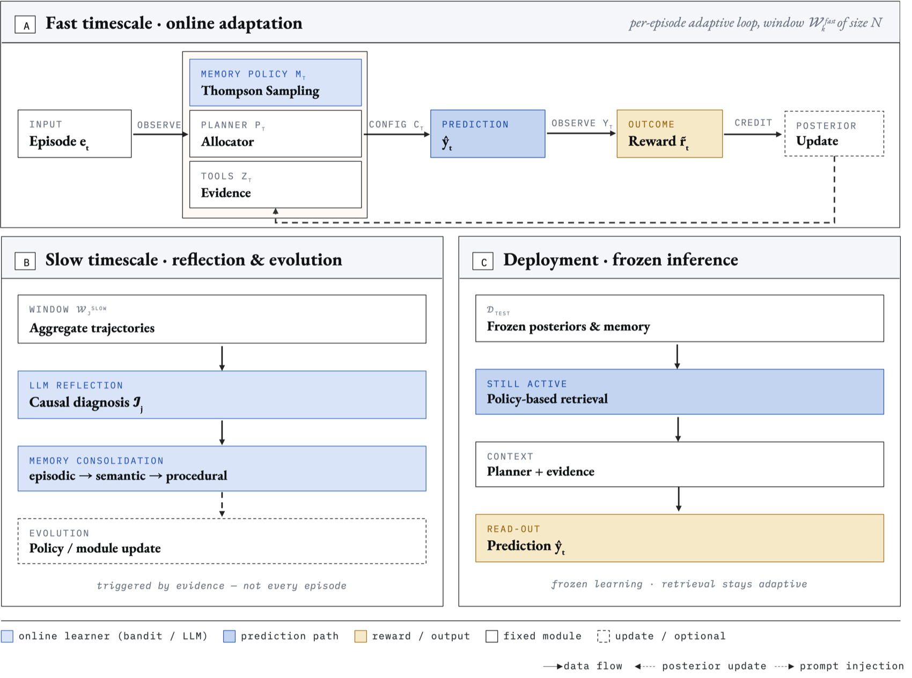
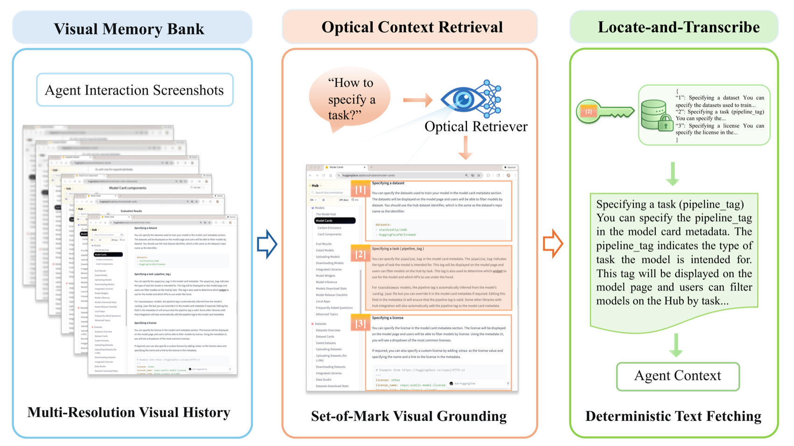
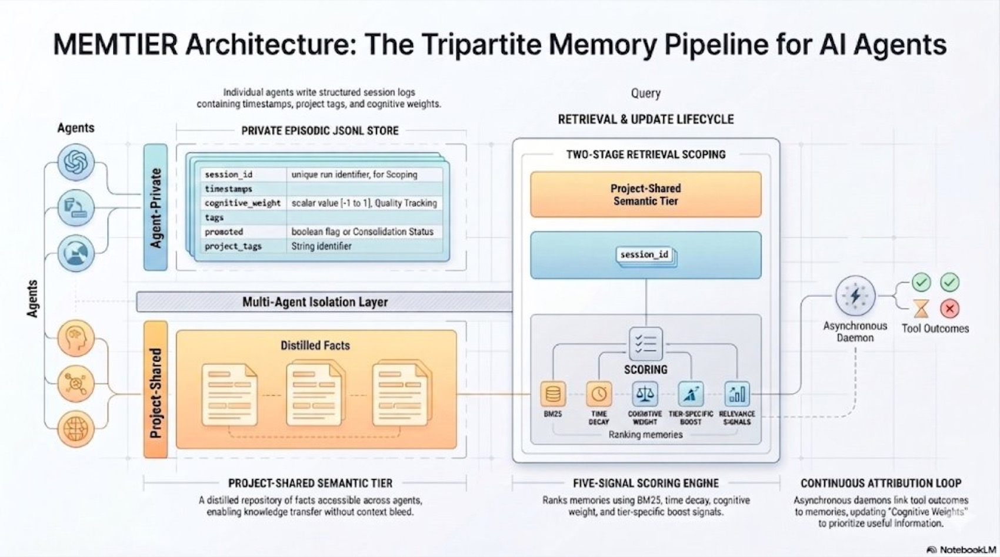
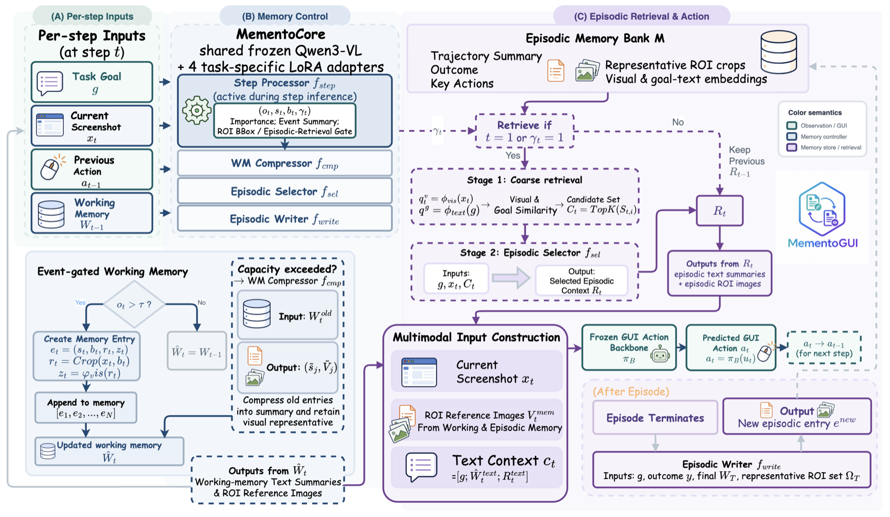
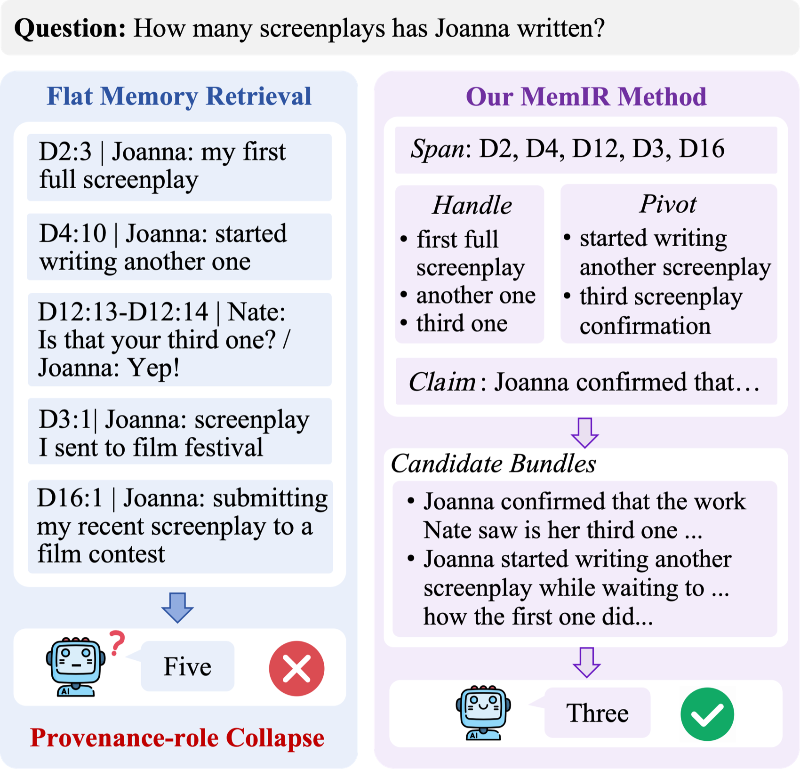
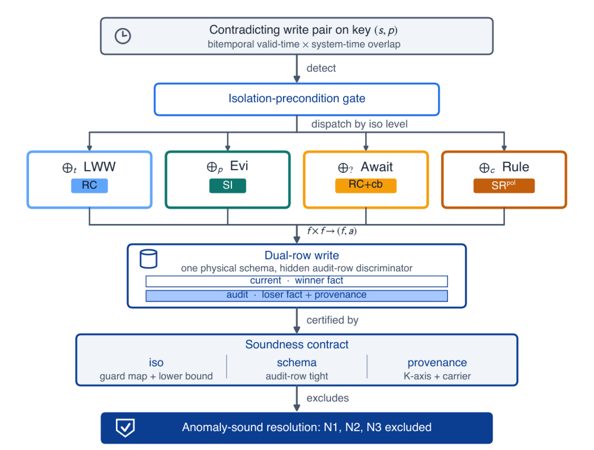
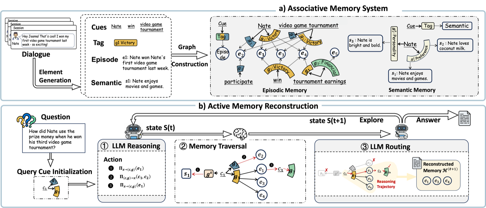
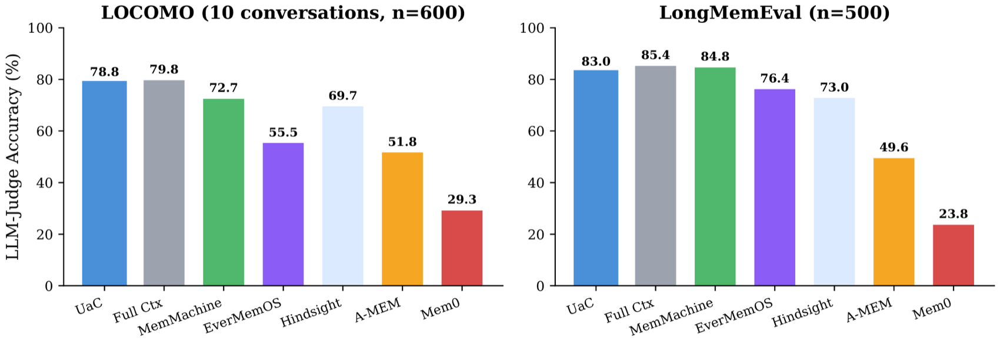
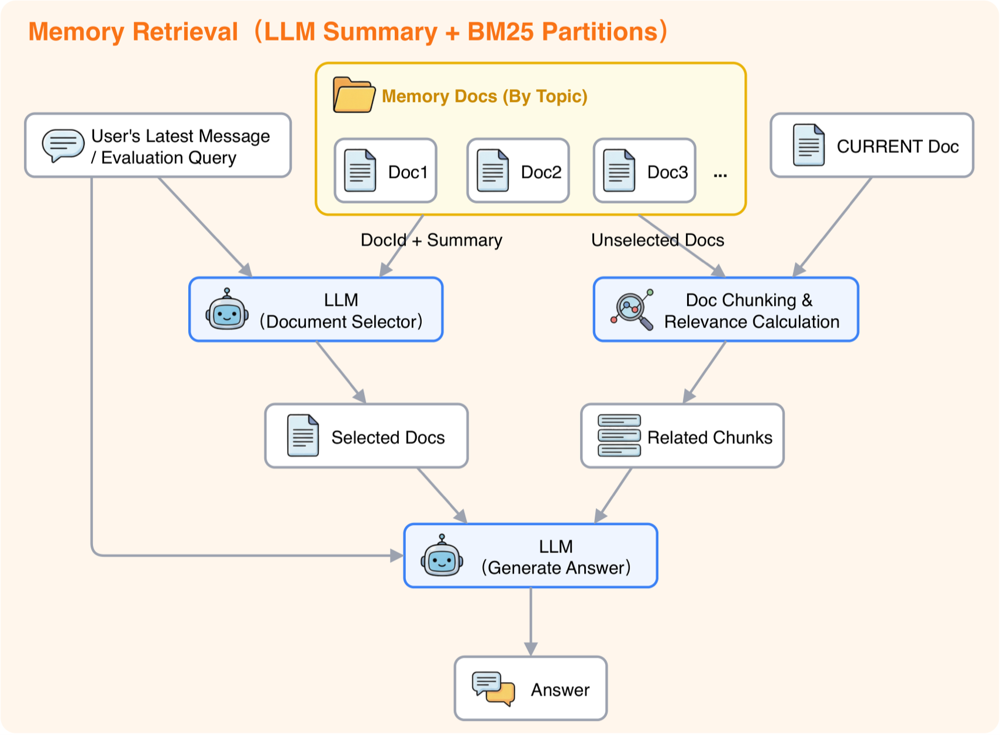

# 4.6 Paper Readings: Frontiers in Agent Memory Systems

> 📖 *"Memory is not just storage — it is the foundation of understanding and reasoning."*  
> *Research on Agent memory systems is advancing rapidly. Below are some of the most influential works.*

---

## Generative Agents: A Memory Milestone in a Virtual Town

**Paper**: *Generative Agents: Interactive Simulacra of Human Behavior*  
**Authors**: Park et al., Stanford University & Google Research  
**Published**: 2023 | [arXiv:2304.03442](https://arxiv.org/abs/2304.03442)

### Core Problem

How can AI Agents develop a rich inner world like humans — remembering past experiences, reflecting on their significance, and using them to plan future actions?

### Experiment Design

The researchers built a virtual town called **Smallville**, where 25 AI residents (Generative Agents) live autonomously. Each resident has their own background (name, occupation, relationships) and moves freely around town — visiting cafes, going to work, chatting with other residents, and attending events.

Astonishingly, these agents exhibited many **emergent behaviors**:
- One agent planned a Valentine's Day party and spontaneously invited other agents
- Agents formed friendships and social circles
- Agents adjusted their attitudes toward other agents based on past interactions

### Memory Architecture (Core Contribution)

The Generative Agents memory system is its most important technical innovation, consisting of three layers:

### Implications for Agent Development

1. The **"Observation-Reflection-Retrieval" framework** is the golden paradigm for designing Agent memory systems. Most subsequent research has drawn on this framework.
2. The idea of **importance scoring** — not all information is worth remembering; selectivity is essential.
3. **Multi-dimensional retrieval** outperforms single-dimensional retrieval (pure temporal order or pure semantic similarity alone is insufficient).
4. The **reflection mechanism** enables agents to distill abstract knowledge from concrete experiences — a key hallmark of "intelligence."

---

## MemGPT: OS-Style Memory Management

**Paper**: *MemGPT: Towards LLMs as Operating Systems*  
**Authors**: Packer et al., UC Berkeley  
**Published**: 2023 | [arXiv:2310.08560](https://arxiv.org/abs/2310.08560)

### Core Problem

LLMs have limited context windows (even 128K tokens can be exhausted). When conversations are long enough or require processing large amounts of information, how should this finite "memory" be managed?

### Core Analogy: LLM = Computer

MemGPT's most elegant insight is to draw an analogy between the LLM context window and computer memory management:

### Method

MemGPT divides the context window into two regions:

1. **Main Context**: Similar to RAM, holding the most immediately needed information (system prompts, recent conversation, working memory)
2. **External Storage**: Similar to a hard disk, holding the complete conversation history, documents, knowledge, etc.

Key mechanisms:
- **Self-editing functions**: The agent can call functions such as `core_memory_append()` and `core_memory_replace()` to actively manage its own memory
- **Automatic paging**: When the information the agent needs is not in the main context, the system automatically retrieves and "swaps in" from external storage
- **Pause and resume**: The agent can pause the current conversation, search for information in external storage, then resume

### Key Findings

1. **Theoretically unlimited memory**: Through hierarchical storage, LLMs can break through the limits of context windows
2. **Proactive memory management**: The agent itself decides what information is worth keeping in "working memory"
3. **Cross-session continuity**: Information across sessions can be persistently preserved through external storage

### Implications for Agent Development

MemGPT's architectural ideas are highly practical for today's agent development:
- **Hierarchical memory design**: Don't cram all information into the prompt; manage it in layers
- **Self-managed agent memory**: Provide agents with memory management tools (see Section 4.5's hands-on project)
- **Reference open-source solutions like mem0**: [mem0](https://github.com/mem0ai/mem0) is an open-source implementation of MemGPT's philosophy

---

## MemoryBank: Forgetting-Curve-Inspired Memory Management

**Paper**: *MemoryBank: Enhancing Large Language Models with Long-Term Memory*  
**Authors**: Zhong et al.  
**Published**: 2023 | [arXiv:2305.10250](https://arxiv.org/abs/2305.10250)

### Core Problem

Existing memory systems either "remember everything" (storage explosion) or "only remember the newest" (forgetting important information). How can we simulate genuine human memory behavior — important, frequently recalled memories are consolidated, while unimportant, infrequently recalled memories gradually fade?

### Method

MemoryBank's core innovation is the introduction of the **Ebbinghaus Forgetting Curve**:

> **Memory Strength = Initial Strength × e^(-t/S)**
>
> - t = time since last access
> - S = memory stability (depends on importance and number of recalls)
>
> Practical effect: Frequently accessed memories → S increases → slower decay → "consolidated"; Long-unaccessed memories → strength continuously decays → eventually "forgotten"

### Memory Operations

MemoryBank supports three core operations:
1. **Memory write**: New information is stored with initial strength
2. **Memory recall**: Retrieval updates the access time and increases stability
3. **Memory forgetting**: Periodic scans; memories whose strength falls below a threshold are moved to an "archive zone"

### Implications for Agent Development

- **Natural information management**: More intelligent than manually setting "keep the last N items"
- **User profiles evolve over time**: User preferences may change; old preferences naturally decay
- **Storage efficiency**: Automatically evict no-longer-needed information, controlling storage costs

---

## CoALA: A Unified Framework for Agent Cognitive Architectures

**Paper**: *Cognitive Architectures for Language Agents (CoALA)*  
**Authors**: Sumers et al.  
**Published**: 2023 | [arXiv:2309.02427](https://arxiv.org/abs/2309.02427)

### Core Problem

What is the relationship between an agent's memory system, reasoning system, and action system? Is there a unified cognitive architecture for organizing these components?

### The CoALA Framework

Drawing on cognitive architecture theories from cognitive science (such as ACT-R, SOAR), CoALA proposes a unified framework suitable for LLM agents:

### Core Contributions

1. **Unified classification**: Categorizes and compares existing agent systems by cognitive architecture components
2. **Three-part memory taxonomy**: The division into working memory / episodic memory / semantic memory is more refined than the traditional "short-term / long-term" split
3. **Design guidance**: Provides agent developers with a "checklist" — which cognitive components should be considered when designing an agent

### Implications for Agent Development

The CoALA framework helps us think more systematically about agent design:
- **Episodic memory ≠ Semantic memory**: The former stores "what I experienced," the latter stores "what I know." Their retrieval strategies differ.
- **Working memory is the foundation of reasoning**: Complex reasoning requires a Scratchpad (see Section 4.4 for details)
- **Learning loop**: Agents should not only use memory but also learn from experience and update their memory

---

## HippoRAG: Hippocampus-Inspired Long-Term Memory

**Paper**: *HippoRAG: Neurobiologically Inspired Long-Term Memory for Large Language Models*  
**Authors**: Gutiérrez et al., Ohio State University NLP Group  
**Published**: 2024 | NeurIPS 2024 | [arXiv:2405.14831](https://arxiv.org/abs/2405.14831)

### Core Problem

The human hippocampus can efficiently integrate new information and associate it with existing knowledge, whereas existing RAG systems simply "retrieve the most similar chunks" — lacking any modeling of the **relationships** between pieces of knowledge.

### Method

HippoRAG simulates the hippocampus's memory indexing theory (Complementary Learning Systems):

**Traditional RAG**: Documents → Chunking → Vectorize → Retrieve most similar chunks → Generate answer (Problem: chunks are unrelated, no cross-document reasoning is possible)

**HippoRAG**:
- Offline Indexing: Documents → LLM extracts knowledge triples → Build knowledge graph
- Online Retrieval: Query → Extract entities → Expand along the graph via Personalized PageRank → Locate most relevant document chunks → Generate answer

### Key Findings

1. **Knowledge graphs as indices**: Better at handling problems requiring cross-document relational reasoning than pure vector retrieval
2. **Continuous learning**: New knowledge can be incrementally added to the graph without re-indexing all documents
3. **Significantly outperforms standard RAG on multi-hop QA tasks**: >20% improvement on benchmarks such as MuSiQue

### Implications for Agent Development

HippoRAG provides a new paradigm for agent long-term memory — using a **knowledge graph as the memory index layer** and a vector database as the raw content storage layer, with the two collaborating to achieve high-quality memory retrieval. This aligns closely with the concept of "semantic memory" in the CoALA framework.

---

## Zep: Temporal Knowledge Graph-Driven Agent Memory

**Paper**: *Zep: A Temporal Knowledge Graph Architecture for Agent Memory*  
**Authors**: Rasmussen et al.  
**Published**: 2025 | [arXiv:2501.13956](https://arxiv.org/abs/2501.13956)

### Core Problem

Most existing agent memory systems ignore the **temporal dimension** — when information was recorded, when it expires, and how information at different points in time evolves. But in real-world applications, temporal information is crucial:

> Evolution of user preferences: January 2025 "User prefers Python" → June "User is shifting to Rust" → December "User now primarily uses Rust"
>
> Without temporal modeling → Agent doesn't know which language to recommend; With temporal modeling → Agent knows the user's latest preference is Rust

### Method

Zep organizes agent memory as a **Temporal Knowledge Graph**:

**Core data structure**: `(Entity, Relation, Entity, Timestamp, Validity Period)`

For example:
- `(User A, prefers language, Python, 2025-01, 2025-05)`
- `(User A, prefers language, Rust, 2025-06, current)`

**Retrieval simultaneously considers**: Semantic relevance (graph structure traversal) + Temporal relevance (prioritizing the newest, still-valid memories) + Episodic context (associating other memories from the same period)

### Implications for Agent Development

- **Temporal awareness is a prerequisite for long-term memory**: Especially in scenarios like personal assistants and customer service
- **Knowledge graphs are an ideal structure for memory organization**: Better at expressing complex relationships between entities than pure vector lists
- Zep is open-sourced and provides a Python SDK, which can be directly integrated into LangChain / LangGraph projects

---

## Paper Comparison and Development Trajectory

| Dimension | Generative Agents | MemGPT | MemoryBank | CoALA | HippoRAG | Zep |
|-----------|-------------------|--------|------------|-------|----------|-----|
| **Year** | 2023 | 2023 | 2023 | 2023 | 2024 | 2025 |
| **Core Innovation** | Observation-Reflection-Retrieval framework | OS-style hierarchical storage | Forgetting curve memory management | Unified cognitive architecture | Hippocampus indexing theory | Temporal knowledge graph |
| **Memory Type** | Memory stream + reflection | Main context + external storage | Forgetting curve driven | Working/Episodic/Semantic | Knowledge graph index | Temporal graph + Episodic |
| **Distinctive Feature** | Reflection mechanism | Self-editing memory | Natural memory decay | Theoretical framework | Cross-document association | Temporal awareness |
| **Application Scenario** | Social simulation | Long conversations | User profiling | System design | Knowledge-intensive tasks | Personal assistant |

**Development Trajectory**:

> Generative Agents (established the basic paradigm of memory systems) → MemGPT (solved the engineering problem of "limited context windows") → MemoryBank (introduced cognitive science forgetting mechanisms) → CoALA (provided a unified theoretical framework) → HippoRAG (used knowledge graphs as memory index layer, NeurIPS 2024) → Zep + mem0 (temporal graphs + industrial-grade memory solutions, 2025)

> 💡 **Frontier Trends (2025-2026)**: Memory systems are evolving from "passive storage" to "active organization," with two key trends: ① **Knowledge graphs becoming the core of memory**: HippoRAG, Zep, and mem0 all adopt graph structures to organize memory, which, compared to pure vector storage, better expresses entity relationships and supports multi-hop reasoning; ② **Temporally-aware memory**: Agents need to understand "when they learned what" and "which information is outdated." Zep's temporal knowledge graph and MemoryBank's forgetting curve represent two complementary temporal modeling approaches. [mem0](https://github.com/mem0ai/mem0), as an open-source memory layer solution, has gained widespread adoption, supporting automatic memory extraction, conflict detection, and graph-structured memory. [supermemory](https://github.com/supermemoryai/supermemory) represents another industrial-grade approach — it fuses RAG and Memory into a unified context engine, supporting automatic fact extraction, user profile maintenance, multimodal document processing, and ranks first across all three benchmarks (LongMemEval, LoCoMo, ConvoMem), while also providing MCP services and integration with mainstream frameworks (LangChain, LangGraph, Vercel AI SDK, etc.).

---

## 📰 Latest Paper Briefs

> 🗓️ This section is maintained by a daily automated update task. Last updated: **August 5, 2026**

### [ProactAgent: An Experienced-Driven Lifelong Agent Proactive Retrieval Framework (2026)](https://arxiv.org/abs/2604.20572)

> 🧬 **One-liner**: Upgrades memory retrieval from "passive triggering" to "active decision-making," using ProactRL to model retrieval as an explicit policy action, triggering retrieval only when it leads to better outcomes.

**Core Problem**: Online lifelong learning allows agents to accumulate experience across interactions and continuously improve on long-horizon tasks. However, existing methods treat "retrieval from past experience" as a passive operation — triggered only at task initialization or after completing a step — leaving agents unable to recognize knowledge gaps during interaction and proactively retrieve the most useful experiences.

**Method**: ProactAgent is an experience-driven lifelong learning framework that performs proactive retrieval over a structured experience repository. It first introduces Experience-Enhanced Online Evolution, modeling retrieval as an explicit policy action, and uses **ProactRL (Proactive Reinforcement Learning Retrieval)** with a paired branching process reward to learn "when to retrieve" and "what to retrieve" — triggering retrieval only when it leads to better task outcomes. The experience repository is organized by type into three stores: factual memory, episodic memory, and behavioral skills. See the overview below:

> Image source: ProactAgent paper (Source: 2026, arXiv:2604.20572)

**Key Results**: Significant improvement in lifelong agent success rate on SciWorld (**73.50%**) and AlfWorld (**71.28%**).

**Connection to This Chapter**: Highly corresponds with Section 4.2 "Memory Types" (fact/episodic/skill tripartite classification) and Section 4.4 "Memory Retrieval," representing the latest practice in the "proactive memory retrieval" direction and providing an RL-paradigm solution for retrieval timing decisions.

---

### [FSFM: A Biomimetic Selective Forgetting Framework for Agent Memory (2026)](https://arxiv.org/abs/2604.20300)

> 🧬 **One-liner**: Inspired by hippocampal indexing/consolidation theory and the Ebbinghaus Forgetting Curve, classifies forgetting into four types (passive decay/active deletion/safety-triggered/adaptive reinforcement), demonstrating that "carefully designed forgetting is as important as memory retention."

**Core Problem**: Memory management in LLM agents is a critical challenge directly affecting efficiency, quality, and safety. Extensive research focuses on memory retention and retrieval, but biological selective forgetting mechanisms and strategies are equally important yet largely unexplored.

**Method**: FSFM is a neurally inspired selective forgetting framework that directly draws on human cognitive processes — hippocampal memory indexing/consolidation theory and the Ebbinghaus Forgetting Curve. It classifies forgetting mechanisms into four types: **passive decay, active deletion, safety-triggered, and adaptive reinforcement**, arguing for resource-constrained environments that "carefully designed forgetting is as important as memory retention." See the bio-inspired overview below:

> Image source: FSFM paper (Source: 2026, arXiv:2604.20300)

**Key Results**: Access efficiency improved by **8.49%**, content quality signal-to-noise ratio improved by **29.2%**, safety risk elimination rate of **100%** (actively deleting malicious/privacy-sensitive memories).

**Connection to This Chapter**: Fills the gap in this chapter's memory management discussion regarding "when/how to delete expired memories," complements MemoryBank's forgetting curve approach, and provides a systematic classification framework for memory safety governance.

---

### [State of AI Agent Memory 2026: Benchmark Evaluation of 10 Approaches (2026)](https://mem0.ai/blog/state-of-ai-agent-memory-2026)

> 🧬 **One-liner**: The mem0 team conducted a horizontal benchmark of 10 mainstream memory solutions on LOCOMO (accuracy/latency/token three dimensions), with graph-enhanced Mem0g achieving <5pp accuracy gap plus low latency, making it the optimal production-ready solution.

**Core Problem**: Agent memory solutions are flourishing, but there is a lack of horizontal benchmarks covering accuracy, latency, and token cost simultaneously, leaving no empirical basis for solution selection.

**Method**: The mem0 team horizontally evaluated 10 mainstream agent memory solutions (Full-context, Mem0, Mem0g graph-enhanced, OpenAI Memory, RAG, MemGPT, etc.) on the LOCOMO benchmark, covering three dimensions: accuracy, latency, and token consumption.

**Key Results**: Full-context injection achieved the highest accuracy (**72.9%**) but with P95 latency of 17 seconds, making it unusable in production; Mem0 lost only 6pp in accuracy while achieving **91%** latency reduction and **90%** token savings; graph-enhanced Mem0g narrowed the accuracy gap to **<5pp** while maintaining low latency — making it the optimal production-ready solution. The report also reveals that memory systems have evolved from optional components to first-class architectural components of agents, with 21 frameworks and 19 vector databases having completed integration.

**Connection to This Chapter**: Provides the world's first horizontal benchmark data including latency and token cost for Section 4.2 "Memory Types" and Section 4.4 "Memory Retrieval," serving as empirical evidence for solution selection decisions.

---

### [Prism: Evolutionary Memory Substrate for Multi-Agent Open-Ended Discovery (2026)](https://arxiv.org/abs/2604.19795)

> 🧬 **One-liner**: Unifies four paradigms — hierarchical file persistence, vector semantics, graph relationships, and multi-agent evolutionary search — under a single decision-theoretic framework, using entropy-gated routing + replicator decay dynamics to converge to an evolutionarily stable memory set.

**Core Problem**: Multi-agent open-ended discovery requires an evolutionary memory substrate, but existing memory paradigms (hierarchical files, vector semantics, graph relationships, evolutionary search) are isolated from each other, lacking a unified decision-theoretic framework.

**Method**: PRISM (Probabilistic Retrieval and Information Stratified Memory) unifies the four paradigms under a single decision-theoretic framework. Three core mechanisms: ① **Entropy-gated hierarchical routing** — automatically allocates memories to skill/note/attempt tripartite hubs based on Shannon information entropy; ② **Causal memory graph** — tracks the agent contribution source of each memory and supports intervention tracing; ③ **Replicator decay dynamics** — models memory confidence as evolutionary fitness, converging to an Evolutionarily Stable Memory Set (ESMS).

**Key Results**: LLM-as-a-Judge score of **88.1** on the LOCOMO benchmark, **surpassing Mem0 by 31.2%**.

**Connection to This Chapter**: Directly corresponds to Section 4.2 "Memory Types" and Section 4.4 "Memory Retrieval," representing a frontier attempt to fuse vector memory, graph memory, and evolutionary search into a unified memory architecture, and provides a new competitive reference for the mem0 vs. supermemory comparison at the end of this chapter.

---

### [Omni-SimpleMem: Autonomous Research-Driven Lifelong Multimodal Agent Memory Framework (2026)](https://arxiv.org/abs/2604.01007)

> 🧬 **One-liner**: Uses a fully autonomous research pipeline with zero human intervention to run 50 experiments and automatically discover a memory framework, improving F1 from 0.117 to 0.598, with the most valuable improvements coming from bug fixes and prompt optimization rather than hyperparameters.

**Core Problem**: AI agents operate across extended time horizons, but the ability to retain, organize, and recall multimodal experiences remains a critical bottleneck. Building effective lifelong memory requires navigating a vast design space of architectures, retrieval strategies, prompts, and data pipelines — a space too large and interconnected for manual exploration or traditional AutoML to effectively cover.

**Method**: This paper deploys an autonomous research pipeline to discover Omni-SimpleMem — a unified multimodal memory framework for lifelong AI agents. Starting from a naive baseline (LoCoMo F1=0.117), the pipeline autonomously executes approximately 50 experiments, automatically diagnosing failure modes, proposing architectural improvements, and fixing data pipelines across two benchmarks. See the framework below:

> Image source: Omni-SimpleMem paper (Source: 2026, arXiv:2604.01007)

**Key Results**: Achieved LoCoMo F1=**0.598** (a **411%** improvement) and Mem-Gallery F1=**0.797** (a **214%** improvement), both SOTA. The most valuable improvements came from bug fixes (+175%) and prompt optimization (+188%), far exceeding the sum of all hyperparameter adjustments.

**Connection to This Chapter**: Directly corresponds to this chapter's "Memory System Design" topic, representing frontier work that applies autonomous research (Auto-Research) methods to multimodal memory framework discovery for the first time, providing a fully automated new path for memory system architecture exploration.

---

### [StructMem: A Hierarchical Structured Memory Framework for Long-Term Behavior (2026)](https://arxiv.org/abs/2604.21748)

> 🧬 **One-liner**: Uses event-level binding preservation + cross-event relationship induction + dual-view temporal anchoring + periodic semantic integration, balancing the efficiency of flat memory with the reasoning capability of graph memory.

**Core Problem**: LLM agent long-term conversational memory faces a dilemma — flat memory is efficient but lacks relational modeling, while graph-structured memory supports reasoning but is expensive to build.

**Method**: StructMem is a structured hierarchical memory framework that, through **event-level binding preservation, cross-event relationship induction, dual-view temporal anchoring, and periodic semantic integration**, simultaneously improves temporal reasoning and multi-hop QA performance on LoCoMo. See the comparison of three memory paradigms below:

> Image source: StructMem paper (Source: 2026, arXiv:2604.21748, ACL 2026)

**Key Results**: Significantly reduced token usage, API calls, and runtime while improving temporal reasoning and multi-hop QA performance.

**Connection to This Chapter**: Corresponds to the core knowledge points in Section 4.2 "Memory Types" and Section 4.4 "Memory Retrieval," providing a complete solution recognized by ACL 2026 for achieving agent long-term memory that balances efficiency and structured reasoning.

---

### [AEL: Learning Self-Improvement for Agents in Open Environments Through Experience Evolution (2026)](https://arxiv.org/abs/2604.21725)

> 🧬 **One-liner**: Dual timescale — fast uses Thompson Sampling bandit to learn retrieval strategy, slow uses LLM reflection to diagnose failures and inject causal insights; reveals "less is more": memory + reflection yields +58%, each additional mechanism decreases performance.

**Core Problem**: LLM agents operate across hundreds of sequential episodes in open environments but are essentially stateless — solving each task from scratch without converting past experience into better future behavior. The core bottleneck is not "what to remember" but "what has been remembered" — which retrieval strategy to use, how to interpret prior results, and when to change the current strategy.

**Method**: AEL (Agent Evolving Learning) is a dual-timescale framework. On the fast timescale, a **Thompson Sampling bandit** learns which memory retrieval strategy to use each time; on the slow timescale, LLM-driven reflection diagnoses failure patterns and injects causal insights into decision prompts. See the framework overview below:

> Image source: AEL paper (Source: 2026, arXiv:2604.21725)

**Key Results**: Ablation reveals "less is more" — memory + reflection yields a cumulative improvement of **58%**, but each additional mechanism (plan evolution, skill extraction, etc.) decreases performance.

**Connection to This Chapter**: Directly echoes Section 4.4 "Memory Retrieval Strategies," deeply revealing that the core bottleneck of memory systems lies not in what to store but in how to use it, providing clear research directions for designing agent memory utilization strategies.

---

### [Memanto: Typed Semantic Memory Layer Based on Information-Theoretic Retrieval (2026)](https://arxiv.org/abs/2604.22085)

> 🧬 **One-liner**: Overturns the assumption that "high-fidelity memory must rely on knowledge graphs," using 13 typed semantic patterns + Moorcheh information-theoretic search (zero indexing/sub-90ms/zero ingestion latency), with 250x fewer parameters surpassing hybrid graph solutions.

**Core Problem**: The transition from stateless reasoning to persistent multi-session autonomous agents reveals that memory is the main architectural bottleneck for production-grade agentic systems. Existing methods mostly rely on hybrid semantic-graph architectures — both ingestion and retrieval incur heavy computational overhead (LLM entity extraction, explicit graph schema maintenance, multi-query retrieval pipelines).

**Method**: Memanto is a general-purpose memory layer for agents that challenges the mainstream assumption that "knowledge needs graphs." It uses **typed semantic patterns** across 13 predefined memory categories, paired with automatic conflict resolution and temporal versioning, supported by the **Moorcheh information-theoretic search engine** (zero indexing, sub-90ms deterministic retrieval, zero ingestion latency, single query).

**Key Results**: Achieved optimal accuracy of **89.8%** and **87.1%** on LongMemEval and LoCoMo respectively, comprehensively surpassing hybrid graph and vector database solutions with **250x fewer** trainable parameters.

**Connection to This Chapter**: Directly corresponds to Section 4.3 "Long-Term Memory" and Section 4.4 "Memory Retrieval," representing the current optimal solution on the LongMemEval benchmark and demonstrating the feasibility of graph-free structured memory architectures.

---

### [Oblivion: Decay-Driven Activation Adaptive Agent Memory Control (2026)](https://arxiv.org/abs/2604.00131)

> 🧬 **One-liner**: Each memory carries a time-decaying activation value; only those above a threshold are retrievable, but contextual reinforcement/explicit access can reactivate — "ordered forgetting" reduces context occupancy by 40%+.

**Core Problem**: Selective forgetting, consolidation, and relearning are adaptive properties of human memory — experiences become less accessible over time but can be reactivated through reinforcement or contextual cues. In contrast, memory-augmented LLM agents rely on "always-on retrieval" and "flat storage," leading to high interference and latency as history grows.

**Method**: Oblivion, inspired by human memory forgetting and reactivation mechanisms, introduces a **dynamic decay mechanism** for agent memory — each memory has a time-decaying activation value; only those above a threshold are retrievable; but memories reinforced by context or explicitly accessed can be reactivated. This "ordered forgetting" allows agents to automatically filter stale, low-quality memories. See the architecture design below:

> Image source: Oblivion paper (Source: 2026, arXiv:2604.00131)

**Key Results**: Task relevance ranking surpasses traditional full-storage solutions, reducing context occupancy by over **40%**; code is open-sourced.

**Connection to This Chapter**: Complements Section 4.3 "Forgetting Mechanisms" and the FSFM paper, providing another biomimetic approach to memory management from an activation value modeling perspective.

---

### [OCR-Memory: Breaking the Context Bottleneck of Agent Long-Range Memory with Visual Encoding (2026)](https://arxiv.org/abs/2604.26622)

> 🧬 **One-liner**: Renders historical trajectories as images with visual identifiers, using the visual modality for high-density representation to break through the text token bottleneck; retrieval uses "localize-transcribe" to recover verbatim text.

**Core Problem**: Autonomous LLM agents in long-horizon interactions need to reuse experience accumulated over extended history. However, existing memory systems are fundamentally constrained by text context budgets — storing or revisiting raw trajectory tokens is extremely expensive, while summarization and pure text retrieval save tokens at the cost of information loss and fragmented evidence.

**Method**: OCR-Memory (Optical Context Retrieval Memory) uses the **visual modality** as a high-density representation of agent experience, preserving arbitrarily long history with minimal overhead — rendering historical trajectories as images with unique visual identifiers; retrieval uses a "localize-transcribe" paradigm, selecting relevant regions through visual anchors and directly recovering verbatim text, avoiding free-form generation to reduce hallucination. See the framework overview below:

> Image source: OCR-Memory paper (Source: 2026, arXiv:2604.26622, ACL 2026)

**Key Results**: Consistent gains on long-range agent benchmarks under strict context constraints; accepted at ACL 2026 main conference.

**Connection to This Chapter**: Directly extends the technical boundaries of Section 4.2 "External Memory Storage," providing a new visual modality pathway for high-fidelity retrieval of ultra-long historical trajectories.

---

### [MEMTIER: Hierarchical Memory Architecture and Retrieval Bottleneck Analysis for Long-Term Autonomous AI Agents (2026)](https://arxiv.org/abs/2605.03675)

> 🧬 **One-liner**: Diagnoses four types of flat memory failures causing a 14pp tool success rate drop over 72 hours in long-term agents; builds a three-layer architecture + five-signal weighted retrieval + PPO weight tuning, improving accuracy from 5% to 38.2%.

**Core Problem**: Long-running autonomous AI agents face recorded memory consistency issues — tool execution success rate degrades by 14 percentage points over a 72-hour window, rooted in four superimposed failure modes of existing flat file memory systems.

**Method**: MEMTIER is a three-layer memory architecture running on the OpenClaw agent runtime — structured **episodic JSONL storage**, a **five-signal weighted retrieval engine**, an attribution-based **cognitive weight update loop**, an **asynchronous consolidation daemon** that promotes episodic facts to the semantic layer, and a PPO-based policy framework to dynamically adjust retrieval weights. See the system architecture below:

> Image source: MEMTIER paper (Source: 2026, arXiv:2605.03675)

**Key Results**: On LongMemEval-S, accuracy improved from 5% to **38.2%** (+33 percentage points), running efficiently on consumer GPUs (6GB VRAM); diagnostics also reveal PPO failure dominated by raw BM25 and identification failures.

**Connection to This Chapter**: Directly corresponds to Section 4.3 "Long-Term Memory Architecture" and Section 4.4 "Memory Retrieval," representing a systematic solution specifically targeting memory decay in long-running agents and providing an empirical foundation for memory persistence in production deployment.

---

### [HAGE: Reinforcement Learning-Driven Weighted Graph Evolution for Agent Memory Dynamic Retrieval (2026)](https://arxiv.org/abs/2605.09942)

> 🧬 **One-liner**: Upgrades memory retrieval from static vector queries to query-conditioned weighted multi-relational graph traversal, with each edge carrying a trainable relation feature vector, RL jointly optimizing routing and edge weights.

**Core Problem**: Memory retrieval in agentic LLM systems is often treated as a static query problem — relying on flat vector search or fixed binary relation graphs. But fixed graph structures cannot capture changes in relationship strength, confidence, and query relevance between events.

**Method**: HAGE is a weighted multi-relational memory framework that reconceptualizes retrieval as **sequential, query-conditioned traversal** over a unified relational memory graph. Memories are organized as relation-specific graph views over shared memory nodes, with each edge associated with a trainable relation feature vector (encoding multiple relations), and **reinforcement learning jointly optimizes routing behavior and edge weight representations**, enabling continuous evolution of the memory graph across conversations. See the architecture overview below:

> Image source: HAGE paper (Source: 2026, arXiv:2605.09942)

**Key Results**: Significant improvement in both accuracy and retrieval efficiency over RAG baselines on long-horizon reasoning benchmarks.

**Connection to This Chapter**: Directly extends Section 4.2 "External Memory Storage" and Section 4.4 "Memory Retrieval," representing the latest advance in introducing RL into memory graph evolution, complementary to MEMTIER's hierarchical architecture — the former focuses on graph structure evolution, the latter on hierarchical organization.

---

*Back to: [Chapter 4: Memory Systems](./README.md)*

### [Mem-W: Unified Latent-Space Native Memory for GUI Agents (2026)](https://arxiv.org/abs/2605.09317)

> 🧬 **One-liner**: Projects both historical trajectories and current episode prefixes into the same continuous latent space, end-to-end training with self-distillation + outcome-aware supervision, no manual memory classification needed, up to +30.0%.

**Core Problem**: GUI agents are beginning to operate web/mobile/desktop as interactive worlds; successful control relies on carrying visual, procedural, and task-level evidence beyond the fleeting current screen. But most agents treat memory as external human-readable artifacts — history is summarized, categorized, and retrieved, then re-inserted as text/structured records, only to be re-encoded by the policy. This creates a mismatch between the representation form of stored memory and the latent embedding sequence of modern GUI policies.

**Method**: Mem-W proposes unified latent-space native memory — uses a **learnable trajectory compressor** to project both historical trajectories and current episode prefixes into the same continuous latent space, trained end-to-end via self-distillation and outcome-aware supervision, without any manual memory classification. See the framework below:

> Image source: Mem-W paper (Source: 2026, arXiv:2605.09317)

**Key Results**: Up to **+30.0%** improvement over mainstream GUI agents on four web/mobile navigation benchmarks, with good scalability as the memory bank grows.

**Connection to This Chapter**: Corresponds to Section 4.2 "Semantic Memory and Episodic Memory," demonstrating an end-to-end learning paradigm that fuses both types of memory into a single latent space, representing frontier exploration in memory system design.

---

### [MementoGUI: Multimodal Memory Control for Long-Horizon GUI Agents (2026)](https://arxiv.org/abs/2605.18652)

> 🧬 **One-liner**: Plug-in memory framework MementoCore online selects/compresses/retrieves interface events; text summaries + ROI-level visual evidence enter working memory; episodic memory retrieval enables reusable trajectories; plug-and-play without fine-tuning.

**Core Problem**: GUI agents have made significant progress in visual grounding and action prediction, but remain fragile on long-horizon tasks requiring task state maintenance across multiple interface transitions. Existing agents rely on raw history replay or pure text memory — the former overwhelms the model with redundant screenshots, the latter discards local visual evidence needed for future decisions.

**Method**: MementoGUI is a plug-in memory framework that equips MLLM GUI agents with **MementoCore** — a learned controller that online selects, compresses, and retrieves memories. Rather than treating interaction history as a fixed context, it stores text summaries with **ROI-level visual evidence** into working memory, and retrieves reusable historical trajectories through episodic memory; enhancing existing GUI agents as a plug-and-play module without fine-tuning the backbone. See the framework below:

> Image source: MementoGUI paper (Source: 2026, arXiv:2605.18652)

**Key Results**: As a plug-and-play module enhancing existing GUI agents, significantly improves state maintenance capability on long-horizon tasks.

**Connection to This Chapter**: Directly corresponds to this chapter's knowledge points on "Working Memory," "Episodic Memory," and "Multimodal Memory," demonstrating how memory systems can extend from pure text to interface visual evidence and long-term operation trajectories.

---

### [MemIR: Typed Memory Intermediate Representation — Eliminating Source-Monitoring Errors in Long-Term Agents (2026)](https://arxiv.org/abs/2605.25869)

> 🧬 **One-liner**: Long-term memory stored as flat text causes "source-monitoring collapse"; MemIR uses typed atomic units to strictly separate raw evidence/retrieval cues/assertions, with fact authorization limited to supported assertions.

**Core Problem**: Long-term memory is essential for persistent LLM agents, but mainstream architectures store historical interactions as unstructured flat text, causing **source-monitoring errors** — agents cannot distinguish between raw evidence, retrieval cues, and evidence-supported verifiable assertions.

**Method**: MemIR proposes a **typed memory intermediate representation (typed memory IR)**, operationalizing source monitoring as structural constraints — writing long-term memory as grounded atomic units, strictly separating **raw evidence atoms, retrieval cue atoms, and assertion atoms**, with fact authorization limited to supported assertion atoms; then using multi-route atomic projections and provenance domain utilization to transform heterogeneous retrieval results into assertion-centered candidate bundles. See the comparison between existing methods and MemIR below:

> Image source: MemIR paper (Source: 2026, arXiv:2605.25869)

**Key Results**: Consistently outperforms existing memory baselines on LoCoMo and BEAM-100K, especially on tasks requiring provenance tracking, temporal localization, and fragmented evidence integration.

**Connection to This Chapter**: Corresponds to Section 4.3 "Memory Organization and Retrieval," providing a deep diagnosis and fix for structured storage problems in long-term memory, revealing the cognitive failure modes caused by unstructured memory and their typed solutions.

---

### [SE-GA: Memory-Augmented Self-Evolving GUI Agent Framework (2026)](https://arxiv.org/abs/2605.16883)

> 🧬 **One-liner**: TTME dynamically retrieves episodic/semantic/experiential three types of memory at test time; MASE training pipeline feeds TTME data back to the base policy, forming a memory → training self-evolution closed loop.

**Core Problem**: Autonomous GUI agents often struggle on multi-step tasks due to restricted context windows and static policies that cannot adapt to dynamic environments.

**Method**: SE-GA (Self-Evolving GUI Agent) integrates a hierarchical memory structure with an iterative self-improvement mechanism — **TTME (Test-Time Memory Extension)** dynamically retrieves episodic, semantic, and experiential three types of memory to support long-term planning; the **MASE training pipeline** uses data collected by TTME to stabilize and enhance the base policy, forming a continuous memory → training self-evolution closed loop. See the framework overview below:

> Image source: SE-GA paper (Source: 2026, arXiv:2605.16883, Tianjin University & Shanghai Jiao Tong University, ICML 2026)

**Key Results**: ScreenSpot **89.0%**, AndroidControl-High **75.8%**, AndroidWorld surpasses all known baselines.

**Connection to This Chapter**: Directly corresponds to this chapter's knowledge points on "Episodic Memory," "Semantic Memory," and "Memory-Driven Online Learning," representing the latest ICML flagship achievement that unifies three types of memory organization and bidirectionally couples them with the training pipeline, demonstrating how memory systems can be upgraded from passive retrieval to the core driving force of active self-evolution.

---

### [TOKI: Bitemporal Operator Algebra for Conflict Resolution in LLM Agent Persistent Memory (2026)](https://arxiv.org/abs/2606.06240)

> 🧬 **One-liner**: Formalizes conflict resolution as write-time concurrency control, using a bitemporal operator family to provide strict isolation preconditions; the only solution that simultaneously eliminates replay inconsistency, belief drift, and audit erasure.

**Core Problem**: LLM agent persistent memory is a write-intensive system — each belief update produces versioned writes, and new statements may conflict with old ones. The four conflict resolution heuristics commonly used in production systems (last-write-wins, evidence-weighted merging, wait-for-confirmation, rule-based policies) all lack explicit isolation levels.

**Method**: TOKI formalizes conflict resolution as **write-time concurrency control**, providing strict isolation preconditions through a **bitemporal operator family**, and retaining failed facts in audit rows with provenance annotations. The theory proves that keyed journaling is a necessary condition for replay consistency. See the conflict resolution mechanism below:

> Image source: TOKI paper (Source: 2026, arXiv:2606.06240)

**Key Results**: Audit row defense boosts LoCoMo by **0.86 points**; TOKI is the only solution that simultaneously eliminates all three anomaly types — replay inconsistency, belief drift bias, and audit erasure.

**Connection to This Chapter**: Corresponds to the knowledge points on "Memory Organization and Retrieval" and "Long-Term Memory Consistency" in this chapter, providing the first complete formal theoretical framework for conflict resolution in persistent memory from a concurrency control perspective.

---

### [MRAgent: Memory is Reconstruction, Not Retrieval — A Graph Memory Framework for LLM Agents (2026)](https://arxiv.org/abs/2606.06036)

> 🧬 **One-liner**: Cue-Tag-Content three-layer association graph + proactive reconstruction mechanism embeds LLM reasoning into memory access, iteratively exploring and pruning retrieval paths, surpassing baselines by 23%.

**Core Problem**: LLM agents still struggle to reason over long interaction histories. Current memory-augmented agents rely on a static "retrieve-then-reason" pipeline, whose rigid pipeline design prevents dynamically adjusting memory access paths based on intermediate evidence during reasoning.

**Method**: MRAgent represents memory as a **Cue–Tag–Content graph** — associative labels serve as semantic bridges connecting fine-grained trigger points (Cue) with memory content (Content). Its **proactive reconstruction mechanism** directly embeds LLM reasoning into the memory access process; the agent iteratively explores and prunes retrieval paths, dynamically deciding which memories are relevant based on accumulated evidence, while using graph structural constraints to limit expansion scope and avoid combinatorial explosion. See the system architecture below:

> Image source: MRAgent paper (Source: 2026, arXiv:2606.06036, ICML 2026)

**Key Results**: Surpasses strong baselines by up to **23%** on LoCoMo and LongMemEval, while reducing token and runtime costs.

**Connection to This Chapter**: Corresponds to this chapter's knowledge points on "Episodic Memory" and "Memory Organization and Retrieval," challenging the existing "retrieval-reasoning" separation architecture at the paradigm level, representing the latest ICML flagship achievement deeply integrating LLM reasoning with memory access.

---

### [User as Code: An Executable Memory Architecture for Personalized Agents (2026)](https://arxiv.org/abs/2606.16707)

> 🧬 **One-liner**: Stores user memory as executable Python code (state = typed objects, rules = functions); aggregation-type questions cause retrieval-based systems to collapse at 6-43%, while UaC achieves 99%.

**Core Problem**: Personalized AI agents need user models — accumulated across multiple conversations, consulted at the start of each new conversation. Today, this memory is almost always stored as unstructured text, knowledge graphs, or flat fact bases, consulted by "fetching the most similar entries." This "bag of facts" can recall individual facts but, because "storing facts" and "using facts" are separated into two steps, struggles with resolving contradictions, aggregating multiple records, or executing logical rules.

**Method**: This paper argues that user memory should be **programmable**. It proposes the UaC (User as Code) paradigm — storing user memory as **executable Python code**: user state is represented as typed Python objects, rules are encoded as functions, thereby unifying "representing the user" and "reasoning about the user" into the same interpreter-runnable medium. Two-stage pipeline: append-only log (never loses facts) → periodic structurization into typed code. See the benchmark comparison of six memory systems below:

> Image source: UaC paper (Source: 2026, arXiv:2606.16707)

**Key Results**: On aggregation-type questions (e.g., "How many times did you travel abroad last year?"), retrieval-based memory collapses (**6–43%**), while UaC achieves near-perfect scores (**99%**) — because the answer is simply a one-line computation over typed state; it can also proactively trigger safety-critical alerts upon state changes (e.g., medication-allergy conflicts).

**Connection to This Chapter**: Corresponds to this chapter's knowledge points on "Structured Memory" and "Memory Organization and Retrieval," elevating the memory paradigm from "text similarity retrieval" to "programmatic state computation," representing an important paradigm leap from "storing facts" to "executable reasoning" in memory systems.

---

### [Infini Memory: Maintainable Topic-Document Memory for Long-Term LLM Agents (2026)](https://arxiv.org/abs/2606.10677)

> 🧬 **One-liner**: Uses topic-structured documents as memory units; new observations temporarily buffered + periodically integrated; at inference time, agent iteratively reads memory through tool calls step by step; MemoryAgentBench 64.7%.

**Core Problem**: Long-term LLM agents need persistent memory that tracks changing facts across sessions and provides relevant evidence. Existing systems store observations as isolated records, summaries, or indexed chunks, making evidence aggregation, fact revision, and memory maintenance difficult.

**Method**: Infini Memory is a maintainable text persistent memory architecture that treats agent memory as **topic-structured documents** — each topic document serves as a semantic unit, collecting relevant evidence, preserving metadata, and revising facts over time; new observations are first buffered, then periodically integrated into coherent textual context; at inference time, the agent iteratively reads memory through tool calls step by step rather than one-shot retrieval. See the hybrid retrieval variants below:

> Image source: Infini Memory paper (Source: 2026, arXiv:2606.10677)

**Key Results**: Achieves a total score of **64.7%** on MemoryAgentBench; ablation shows that topic-structured maintenance and iterative evidence inspection are complementary.

**Connection to This Chapter**: Corresponds to this chapter's knowledge points on "Long-Term Memory Maintenance" and "Episodic Memory," providing a third route after "vector database retrieval" — iterative topic document maintenance — solving the two core engineering challenges of long-term memory: cross-session fact revision and evidence aggregation.

---

### [RaMem: Context Restoration-Based Long-Term Agentic Memory Framework (2026)](https://arxiv.org/abs/2606.22844)

> 🧬 **One-liner**: Diagnoses "context collapse" — compressed memories lose the peripheral context needed to judge applicability; uses four stages (evidence anchoring → condition inference → validity retrieval → context-preserving synthesis) to restore, F1 +10%.

**Core Problem**: Long-term memory is critical for persistent LLM agents. Recent systems make past experiences more persistent, compact, and retrievable, but retrieval alone does not guarantee that memories provide valid evidence for the current query. When experiences are compressed into reusable chunks, memories from different contexts may appear equally "relevant" due to overlapping entities or user states — this is called **context collapse**: memories lose the peripheral context needed to judge their applicability to the current query.

**Method**: RaMem is a four-stage framework: ① **Evidence anchoring** explicitly embeds each memory's original episodic conditions (event time, mention time, session span, participants); ② **Recall condition inference** derives necessary evidence conditions from the query; ③ **Validity-aware retrieval** uses conditions to prioritize context-compatible memories, retaining content-related memories as alternatives; ④ **Context-preserving synthesis** maintains the structured context of memories during generation. See the framework overview below:

> Image source: RaMem paper (Source: 2026, arXiv:2606.22844)

**Key Results**: Average F1 improvement of **over 10%** compared to strong baselines on long-term memory benchmarks.

**Connection to This Chapter**: Corresponds to this chapter's knowledge points on "Memory Retrieval" and "Episodic Memory," directly addressing the "similarity does not equal applicability" problem in vector retrieval frameworks, introducing the core concept of episodic anchoring, representing the latest systematic improvement in long-term agent memory reliability.

---

### [AutoMem: Automating Memory Management as a Cognitive Skill (2026)](https://arxiv.org/abs/2607.01224)

**Published**: July 1, 2026 | [arXiv:2607.01224](https://arxiv.org/abs/2607.01224)

**Core Contribution**: AutoMem elevates file system operations into first-class memory actions alongside task actions, letting the model autonomously decide when to write, retrieve, and organize memory files. The system contains two iterative loops: the outer loop has a strong model review complete agent trajectories and iteratively refine the memory structure (prompts, file patterns, action vocabulary); the inner loop identifies the model's own high-quality memory decisions from massive episodes and uses them as training signals to directly improve memory proficiency. On three procedurally generated long-horizon games (Crafter, MiniHack, NetHack), optimizing only memory capabilities boosted 32B open-source model performance by 2×–4×, reaching competitive levels with Claude Opus 4.5 and Gemini 3.1 Pro Thinking.

**Connection to This Chapter**: Directly corresponds to this chapter's knowledge points on "Memory Writing and Updating" and "Long-Term Memory Management," proving for the first time that memory management is an independently learnable, high-leverage cognitive skill — an important breakthrough after MemGPT in internalizing memory operations as model capabilities.

---

### [A-TMA: State-Aware Memory Failure Decoupling in Long-Term Agent Memory (2026)](https://arxiv.org/abs/2607.01935)

**Published**: July 2, 2026 | [arXiv:2607.01935](https://arxiv.org/abs/2607.01935)

**Core Contribution**: This paper defines and systematically studies the "Ghost Memory" problem — old facts, current facts, and transitional facts coexist in the memory bank, and when retrieval cannot distinguish temporal states, QA models give misleading answers. A-TMA proposes a state-aware overlay layer: at retrieval time, it constructs "evidence packets" for queries and explicitly exposes three labels (current/historical/transitional), while establishing a hierarchical evaluation method that decouples and measures failures at memory bank maintenance, retrieval, and answer-generation moments separately. On the newly constructed conflict-dense benchmark LTP, Graphiti+ATMA achieved an absolute improvement of 0.240 in conflict accuracy over Graphiti, with temporal F1 rising from 0.0295 to 0.1705.

**Connection to This Chapter**: Directly corresponds to this chapter's knowledge points on "Long-Term Memory Maintenance" and "Episodic Memory," revealing the state coordination failure problem prevalent in vector retrieval systems but hidden by final accuracy — another systematic diagnosis and fix for long-term memory reliability following RaMem (context collapse).

---

### [Remember When It Matters: Proactive Memory Intervention Mechanism for Long-Horizon Agents (2026)](https://arxiv.org/abs/2607.08716)

**Published**: July 9, 2026 | [arXiv:2607.08716](https://arxiv.org/abs/2607.08716)

**Core Contribution**: This paper defines and studies the "Behavioral State Decay" problem — in long-horizon tasks, decision-relevant states are scattered across growing trajectories; task requirements, environmental facts, prior attempts, and unfinished sub-goals get buried or pushed out of the context window, rendering them unable to influence decisions when needed. It proposes a **proactive memory agent**: a memory module independent of the action agent, which updates a structured memory bank from recent trajectories and decides whether to inject memory-driven reminders or remain silent. This module is plug-and-play, requiring no modification to the action agent. On Terminal-Bench 2.0 and τ2-Bench, pass@1 improved by **+8.3pp** and **+6.8pp** respectively. Ablation experiments prove selective intervention is superior to passive memory bank exposure, continuous injection, and generic retrieval. Further, SFT+GRPO training of Qwen3.5-27B memory policy achieved partial transfer.

**Connection to This Chapter**: Directly corresponds to this chapter's knowledge points on "Memory Retrieval and Use" and "Long-Term Memory Management," upgrading memory from "passive retrieval" to "proactive intervention" — a memory agent running independently of the action agent, proactively injecting information at critical moments. This is the latest empirical evidence in the direction of memory architecture separation design, following AutoMem (memory as a skill).

---

### [SCM: Supra Cognitive Modes — A Routing Architecture for Agent Memory (2026)](https://arxiv.org/abs/2607.19096)

**Published**: July 21, 2026 | [arXiv:2607.19096](https://arxiv.org/abs/2607.19096)

**Core Contribution**: Agent memory workloads naturally mix three types of work: direct fact queries, relational chain/current state reasoning, and long-history synthesis. SCM (Supra Cognitive Modes) architecture routes each query through a frozen semantic classifier and runtime gating to the corresponding retrieval-synthesis payload, with three paths respectively handling direct queries (fused lexical and dense retrieval), graph or multi-hop iterative reasoning, and hierarchical long-form synthesis, all underpinned by a unified ingestion infrastructure of multi-granular embeddings + triple extraction + fact versioning metadata. On three benchmarks — LoCoMo, MemoryAgentBench, and LongMemEval — the system achieved competitive scores of 84.87% (factual QA), 61.49%, and 86.00% respectively, with each query type processed by its dedicated path rather than by uniform retrieval.

**Connection to This Chapter**: Corresponds to this chapter's knowledge points on "Memory Retrieval and Use"; SCM replaces "one-size-fits-all" semantic retrieval with explicit routing — the latest direction in memory architecture refinement following AutoMem (memory as a skill) and A-TMA (temporal state decoupling), transforming the cognitive workload classification problem of memory systems into engineerable routing decisions.

---

### [PRO-LONG: Empowering Long-Horizon Reasoning with Programmatic Memory (2026)](https://arxiv.org/abs/2607.20064)

**Published**: July 22, 2026 | [arXiv:2607.20064](https://arxiv.org/abs/2607.20064)

**Core Contribution**: In long-horizon tasks, there is an inherent tension between "saving more information" and "retrieving more precisely" — full retention makes retrieving relevant details harder, while compression loses critical state. PRO-LONG proposes **programmatic memory** as the foundation for LLM agent context management: maintaining a complete, structured interaction log and leveraging code agents' code execution capabilities to efficiently search history. This design achieves coexistence of "lossless memory" and "precise retrieval": on the complete ARC-AGI-3 public game set, it improves over the base code agent by an average of **18.0 percentage points**, matching or surpassing existing SOTA specialized frameworks with 4.2–5.8× fewer tokens (pass@1 up to 76.1%); paired with Fable 5, best@2 reaches **97.4%** at a total cost of only $1,750.

**Connection to This Chapter**: Directly corresponds to this chapter's knowledge points on "Memory Storage and Retrieval" and "Long-Term Memory Management"; PRO-LONG replaces semantic retrieval with "programmatic indexing," combining the structural advantages of long-term memory with code search efficiency — the latest architectural breakthrough in long-horizon agent memory management following AutoMem (memory as a skill) and proactive memory intervention.

---

### [On-the-Job Learning: Frozen-Weight Agents Continuously Learning from Deployment Feedback (2026)](https://arxiv.org/abs/2607.22157)

**Published**: July 24, 2026 | [arXiv:2607.22157](https://arxiv.org/abs/2607.22157)

**Core Contribution**: AI agents encounter learning opportunities in every run, but because model weights are frozen at deployment, today's solved problems start from scratch tomorrow — a universal pain point of current production agent systems. This paper demonstrates that when frozen models are paired with **external memory that distills each episode into retrievable natural language rules**, the feedback signals generated by daily operations are sufficient to support continuous learning. In the τ-bench banking domain, learning from outcome feedback (a single binary judgment) improved single-attempt success rate to **1.6×** baseline, while learning from error correction reached **2.6×**, solving 22 of 84 tasks never solved by the baseline; results are reproducible across both Mistral Large (locally deployed) and Claude Sonnet 5, and when one model's memory bank is transferred to another, the recipient still outperforms its own memory-free baseline, proving cross-model transferability of memory.

**Connection to This Chapter**: Directly corresponds to this chapter's knowledge points on "Long-Term Memory Writing and Updating," proposing a continuous learning closed loop without fine-tuning — runtime external memory as an "evolvable knowledge base," filling the gap in MemGPT/AutoMem and similar frameworks regarding "automatically updating memory from failures and corrections," with particular reference value for data-sovereignty-sensitive production deployment scenarios (locally deployed open-source models).

---

### [Graph-Native Bitemporal Memory Store: A Persistent Memory Architecture for Conversational AI Agents (2026)](https://arxiv.org/abs/2607.26520)

**Published**: July 29, 2026 | [arXiv:2607.26520](https://arxiv.org/abs/2607.26520)

**Core Contribution**: Conversational AI agents generally lack cross-session persistent memory; injecting the full chat history exhausts the context window, while relying on third-party memory services introduces data privacy risks. This paper proposes an agent-local memory store based on Neo4j property graph + HNSW vector indexing + a **full bitemporal data model**: each memory is stored as an immutable identity node + versioned content node, carrying two time intervals — **valid time** (the time period when the fact was true in the world) and **transaction time** (the time period when the database recorded the fact), supporting semantic retrieval at any point in time without physically overwriting history. Semantic edges are automatically maintained at write time via cosine similarity. On LongMemEval (500 questions), the current-state semantic path achieved an overall R@10 of 46.7%, with knowledge-update questions at 80%; the time-travel path also reached 80% on knowledge-update questions, but recall decreased on temporal reasoning questions, pointing to specific design improvement directions.

**Connection to This Chapter**: Directly corresponds to this chapter's knowledge points on "Persistent Memory Storage" and "Episodic Memory"; the bitemporal model decouples "valid temporality" from "transaction temporality," supporting historical retrospective queries without physically deleting old records — the latest engineering implementation of agent memory temporal consistency issues following A-TMA (temporal state decoupling), with direct reference value for locally deployed agents that require long-term memory but cannot rely on cloud memory services.

---

### [File-System-Based LLM Agent Memory: Organization, Evolution, and Sustainability (2026)](https://arxiv.org/abs/2607.26637)

**Published**: July 30, 2026 | [arXiv:2607.26637](https://arxiv.org/abs/2607.26637)

**Core Contribution**: This paper systematically studies the complete lifecycle of using file systems as the long-term memory backend for LLM agents — from initial storage organization, to update strategies as memory evolves with tasks, to sustainability challenges after ultra-long runtime. The paper notes that the choice of memory backend substantially impacts the system's auditability and cost: file system structure faces a fundamental tension between readability and retrievability; as memory volume grows, unstructured flat storage leads to retrieval degradation, while excessive hierarchy increases navigation overhead; the core of sustainability lies in proactively cleaning and merging outdated memories rather than infinite appending. The paper also analyzes specific risks of file system memory in security (prompt injection into intermediate files) and privacy (persistence of sensitive content), and proposes a best-practices framework.

**Connection to This Chapter**: Directly corresponds to this chapter's knowledge points on "Memory Storage Structure" and "Long-Term Memory Management," representing the most systematic engineering evaluation of file-system-native memory solutions following PRO-LONG (programmatic memory indexing) and AutoMem (memory as a skill), providing a comprehensive architectural reference for agent engineers selecting file-system-based memory backends.

---

### [Setoka: A Hierarchical User Understanding Benchmark for Personalized Agents over Heterogeneous Data (2026)](https://arxiv.org/abs/2607.27056)

**Published**: July 29, 2026 | [arXiv:2607.27056](https://arxiv.org/abs/2607.27056)

**Core Contribution**: Existing memory benchmarks primarily evaluate whether agents can retrieve explicitly stated facts from conversation history, failing to assess deeper user understanding. Setoka, based on cognitive and personality psychology theories, defines **four layers of user understanding**: semantic memory (explicit fact retrieval), episodic memory (specific event recall), behavioral patterns (behavioral regularity inference), and personality traits (high-level abstraction across time and sources). It is paired with a psychometrics-based synthetic heterogeneous user data and query generation pipeline (maintaining authenticity while preserving privacy). Evaluating 3 language models × 5 memory systems × 10 synthetic users, the findings show: existing systems perform well on semantic memory retrieval, but episodic memory performance drops noticeably, and behavioral pattern and personality trait understanding (requiring integration of fragmented information across time and sources) drops further. **Conclusion: User understanding cannot be solved by simple fact retrieval; it requires memory mechanisms specifically designed for cross-source integration and long-term behavioral abstraction.**

**Connection to This Chapter**: Directly corresponds to this chapter's knowledge points on "Episodic Memory" and "Personalized Agent Memory"; Setoka reveals the systematic blind spot of current memory systems in the "depth of user understanding" dimension — from fact storage to personality modeling is a four-level progressive challenge, providing a clear evaluation framework and research direction for designing next-generation personalized agent memory systems.

---

### [When Memory Becomes Authority: A Benchmark for Authority Collapse at Memory Integration Boundaries (2026)](https://arxiv.org/abs/2608.01679)

**Published**: August 4, 2026 | [arXiv:2608.01679](https://arxiv.org/abs/2608.01679)

**Core Contribution**: Persistent agents integrate external information into long-term memory during operation, and this paper reveals a critical failure mode — **Authority Collapse**: memory content is preserved, but the authority of its source ("who said it," "whether this person was authorized to trigger this instruction") is lost during the integration process, causing agents to subsequently execute high-privilege actions based on memory content from unauthorized sources. The paper constructs a systematic benchmark for this problem, evaluating across 49 configurations and finding **authority collapse in 48 of them**; source-washed memories (washed memories) subsequently led to a **50.3% unauthorized action rate**. The study also provides three categories of mitigation strategies: provenance annotation preservation, integration-time permission filtering, and memory-access-time authorization re-verification, quantifying the protective effect of each.

**Connection to This Chapter**: Directly corresponds to this chapter's knowledge points on "Persistent Memory Management" and "Memory Security"; Authority Collapse is a new class of failure mode in persistent agent memory systems, distinct from the previously cataloged Salami Attack (cross-session collusion poisoning) — the latter involves attackers actively injecting malicious content, while this paper reveals authorization loss caused by the integration pipeline itself without attacker intervention, with direct security implications for designing production-grade long-term memory architectures.

---
