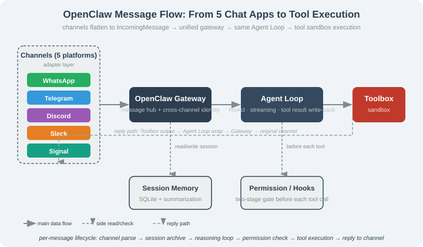

# 14.1 OpenClaw Panorama: From Clawdbot to OpenClaw

> 🦞 *"How a weekend project became a phenomenon — and why its name changed three times."*

---

## Why OpenClaw Matters

Before 2025, Agents were mostly demos (AutoGPT, BabyAGI) stuck in a CLI or a crude web UI. The thing that pushed Agents into daily life was the **action-oriented Agent living in chat apps** — you `@` it in WhatsApp and it searches, edits files, runs commands.

**OpenClaw** is a leading representative. Its GitHub growth was unprecedented — hundreds of thousands of stars within months. How did it start? What fundamentally separates it from an industrial harness like Claude Code? This section gives the panorama.

---

## A Brief Naming History

The same codebase changed names three times in under two months:

| Time | Name | Event |
|------|------|-------|
| Dec 2025 | early prototype | Peter Steinberger's first repo — a "WhatsApp relay" forwarding messages to an LLM and back |
| Jan 2026 (early) | **Clawdbot** | First "general" version; "claw" from the Claude+claw meme; multi-channel + sandbox + LSP + voice |
| Jan 27, 2026 | **Moltbot** | Renamed over Anthropic trademark concerns ("Clawd" too close to "Claude") |
| Jan 30, 2026+ | **OpenClaw** | Dropped the trademark conflict; emphasized open-source / long-term brand |

What this history teaches:

1. **Naming is engineering** — a wrong name brings recurring trademark/SEO/community costs.
2. **Rewrites flourished** — nanobot (Python ~4000 lines), ZeroClaw (Rust), NanoClaw (Go + Apple containers), IronClaw (Rust + WASM sandbox), NullClaw (Zig, 678KB static binary) all use OpenClaw's core architecture as a starting line — itself a "collective quality review."
3. **OpenClaw chose the community-driven route** — the biggest divide from Claude Code (closed source).

---

## OpenClaw's Place in the Harness Spectrum

```
Action-oriented Agent Harness spectrum (2026)
│
├── Multi-channel · consumer · community-driven (open source)
│   └─ OpenClaw (Ch.14) — put the Agent in chat apps
│
├── Multi-channel · consumer · self-evolving (open source)
│   └─ Hermes Agent (Ch.15) — Agent writes its own skills
│
├── Terminal IDE · industrial · closed (source-available)
│   └─ Claude Code (Ch.16) — the coding IDE
│
└── Terminal IDE · developer workshop · everything-is-a-plugin (open source)
    └─ DeepSeek Harness (Ch.17) — model-agnostic + swappable kernel
```

The "user key" difference is decisive:

| Harness | Primary interface | User key |
|---------|-------------------|----------|
| OpenClaw | Chat apps | `@bot` in WhatsApp/Telegram/Discord/Slack/Signal |
| Hermes | Chat apps + CLI + TUI | Same + `hermes` command |
| Claude Code | Terminal CLI | `claude "fix this bug"` |
| DeepSeek Harness | Web UI + CLI + TUI | Browser 127.0.0.1:3080 / `dsh` |

> 📌 OpenClaw moved the user key from CLI to chat app — a structural change: inputs become shorter and more colloquial, demanding stronger context summarization and ambiguity tolerance.

---

## Three Fundamental Differences from Claude Code

| Dimension | OpenClaw | Claude Code |
|-----------|----------|-------------|
| License | MIT open source | source-available |
| Target scene | Personal assistant, life tasks | Software engineering |
| Interaction | Chat apps + CLI + TUI | Terminal CLI |
| Skill system | Skills (Markdown) + plugins (TS) | Skills / MCP / Hooks |
| Extension | Community + ClawHub market | Private + team config |
| Sandbox | Terminal safety + Docker (recommended) | Permission modes |

Key takeaways: **scene** (not capability) is the dividing line; **license ≠ safety**; **entry point determines design** — a chat entry means "messages must fit in ~1.6K chars," driving summarization and task-decomposition submodules that a CLI entry doesn't need.

---

## The 4 Core Subsystems

### Gateway (message hub)

Normalizes all channels into `IncomingMessage`/`OutgoingMessage`. The flow across the four subsystems is:



### Agent Loop — streaming inference → tool-call parsing → execution → write-back; with compression and permission checks.

### Toolbox — file / shell / web / message / calendar / skill / memory tools for daily tasks.

### Skills & Plugins — `SKILL.md` (Markdown + optional script) registers new capabilities; the format is compatible with Claude Code.

> 💡 These four map directly onto Chapter 8's "six engineering pillars": Gateway ⊂ Channels; Agent Loop ⊂ loop + context; Toolbox ⊂ tools; Skills ⊂ skill system.

---

## Section Summary

| Topic | Key point |
|-------|-----------|
| Positioning | Cross-platform open-source personal assistant in your chat apps |
| Naming | Clawdbot → Moltbot → OpenClaw |
| Spectrum | Multi-channel · consumer · community-driven |
| Core subsystems | Gateway / Agent Loop / Toolbox / Skills |
| vs Claude Code | entry (chat vs CLI), scene (life vs coding), license (MIT vs source-available) |

---

*Next section: [14.2 Installation & 4 Deployment Modes](./02_install_and_deploy.md)*
