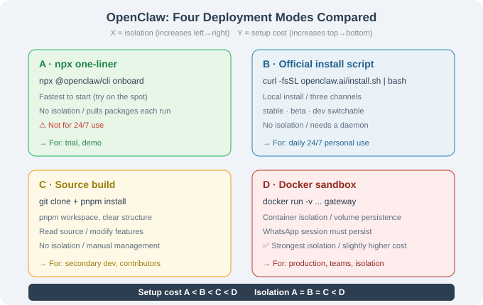

# 14.2 Installation & 4 Deployment Modes

> 🦞 *"Four ways to run OpenClaw — from 'try it out' to 'production'."*

---

## Overview

| Mode | Command | For | Persistence | Isolation |
|------|---------|-----|-------------|-----------|
| **A. npx** | `npx @openclaw/cli onboard` | Try / demo | `~/.openclaw/` | None |
| **B. Install script** | `curl -fsSL openclaw.ai/install.sh \| bash` | Daily long-term use | Local | None |
| **C. Source build** | `git clone` + `pnpm install` | Development / reading source | Local | None |
| **D. Docker sandbox** | `docker run` | Production / isolation | Volume | ✅ |



---

## Mode A: npx (Try It Out)

```bash
npx @openclaw/cli onboard
```

The wizard asks for: LLM provider, at least one channel, persona, language, timezone, self-evolving on/off. **Note**: npx pulls packages over the network each run — not for 24/7.

## Mode B: Install Script (Recommended for Daily Use)

```bash
# macOS / Linux / WSL2
curl -fsSL https://openclaw.ai/install.sh | bash
openclaw onboard

# Windows (PowerShell)
powershell -c "irm https://openclaw.ai/install.ps1 | iex"
```

Three update channels: `stable` (production) / `beta` / `dev`.

## Mode C: Source Build

```bash
git clone https://github.com/openclaw/openclaw.git
cd openclaw && corepack enable && pnpm install
pnpm openclaw onboard
```

Source layout (per `main`): `src/` (agent / gateway / config / memory), `extensions/` (channel plugins), `skills/`, `packages/`.

## Mode D: Docker Sandbox

```bash
docker pull ghcr.io/openclaw/openclaw:latest
docker run -d --name openclaw \
    -v ~/.openclaw:/home/node/.openclaw \
    -v ~/workspace:/workspace \
    -e ANTHROPIC_API_KEY=sk-... \
    ghcr.io/openclaw/openclaw:latest gateway
```

> ⚠️ WhatsApp uses QR linking — session must persist in the volume, or re-scan after every restart.

## Verify: `openclaw doctor`

```bash
$ openclaw doctor
✓ Node.js / pnpm / API key / Config / Memory
✓ Channels: Telegram ● online / WhatsApp ○ not configured
✓ Skills: 28 loaded
✓ Sandbox: local (no isolation) — consider Docker for production
```

## Decision Summary

| Goal | Pick |
|------|------|
| 5-minute try | A (npx) |
| Daily 24/7 | B + `pm2`/`launchd` daemon |
| Read source / modify | C (source) |
| Team / production | D (Docker) |

---

*Next section: [14.3 Architecture: Gateway / Agent Loop / Skills](./03_architecture.md)*
