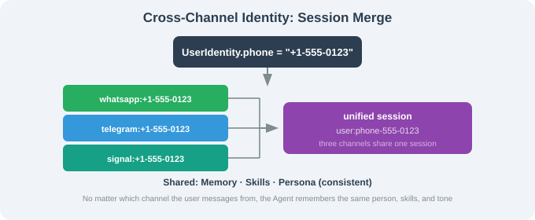

# 14.4 Multi-Channel Routing: WhatsApp / Telegram / Discord / Slack / Signal

> 🦞 *"The user key is already in your pocket — put the Agent into that key."*

---

## Five Channels at a Glance

| Channel | Protocol | Group chat | Attachments | Char limit |
|---------|----------|-----------|-------------|------------|
| WhatsApp | Web multi-device | ✅ | ✅ | 65536 |
| Telegram | Bot API | ✅ (@bot) | ✅ | 4096 |
| Discord | Bot API + Gateway | ✅ | ✅ | 2000 |
| Slack | Bolt SDK | ✅ | ✅ | 40000 |
| Signal | signal-cli | ✅ | ✅ | 2000 |

Character limits vary 30× — OpenClaw handles this with **auto-chunking** (split long replies by paragraph to fit each platform's limit).

---

## Group Chat & DM Policies

| Group policy | Meaning | Risk |
|--------------|---------|------|
| `open` | respond to all messages | high (spam) |
| `mention_only` | respond only when `@`-mentioned | medium (recommended) |
| `closed` | never speak in groups | low |

| DM policy | Meaning |
|-----------|---------|
| `open` | respond to any number | risky |
| `contacts` | only contacts | recommended |
| `closed` | no response | |

---

## Cross-Channel Identity

```yaml
session:
  cross_channel_identity: true   # default false (privacy)
  identity_resolver: "phone"     # match by phone number
```

When enabled, the same human's WhatsApp/Telegram/Signal conversations merge into one session — shared memory, shared skills, consistent persona. (Claude Code, by contrast, keeps each terminal window as an independent session.)



---

## WhatsApp: QR-Linking Engineering Impact

WhatsApp uses QR linking (not a token), which means:

1. Session must be persisted (Docker `-v`), or re-scan after restart;
2. A watchdog process handles reconnection;
3. `rate_limit` prevents ban (don't bind your main number).

```yaml
channels:
  whatsapp:
    phone: "+15550100"          # a spare number
    dm_policy: contacts
    group_policy: mention_only
    rate_limit: "3/m"
  watchdog:
    enabled: true
    check_interval_s: 60
```

---

## Telegram / Discord / Slack Special Cases

- **Telegram** topic/thread → separate session (per `message_thread_id`); merge with `merge_threads: true` if you want global group memory.
- **Discord / Slack** → maintain an `allowed_channels` allow-list; use minimal bot permissions; slash commands are a natural user key.
- **Signal** → via `signal-cli`; best privacy (no Meta/Google data sharing), but needs a dedicated daemon.

---

## Section Summary

| Topic | Key point |
|-------|-----------|
| Channels | 5 platforms (WhatsApp/Telegram/Discord/Slack/Signal) |
| Group policy | open / mention_only / closed (recommend mention_only) |
| DM policy | open / contacts / closed (recommend contacts) |
| Cross-channel | `cross_channel_identity: true` merges one human's sessions |
| Auto-chunking | split replies per platform limit |

---

*Next section: [14.5 Skills & Plugin Ecosystem](./05_skills_and_plugins.md)*
