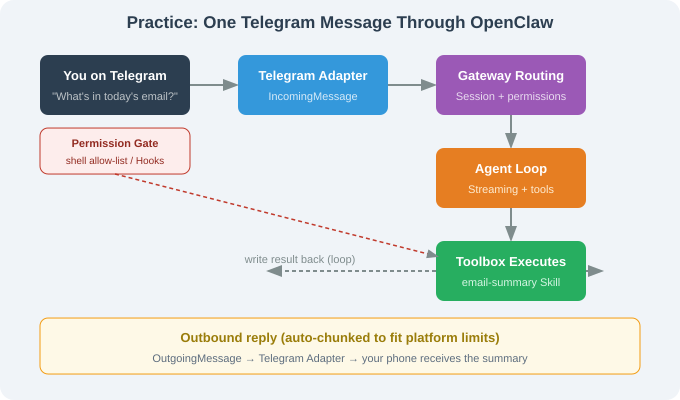

# 14.6 Practice: Build a Personal Assistant

> 🦞 *"From zero to a 24/7 personal assistant, in five steps."*

---

## Goal

Build a personal assistant **living in Telegram** that can: read email summaries (Gmail), record/query todos, run restricted shell commands, and push daily schedules.



---

## Step 1: Install & Initialize

```bash
curl -fsSL https://openclaw.ai/install.sh | bash
openclaw onboard
```

Onboard: LLM (Anthropic or your key) → Channel (Telegram via BotFather token) → persona → timezone.

## Step 2: Configure Telegram

```bash
openclaw config set channels.telegram.botToken "$TELEGRAM_BOT_TOKEN"
openclaw config set channels.telegram.dmPolicy "contacts"
openclaw config set channels.telegram.groupPolicy "mention_only"
openclaw config set channels.telegram.rateLimit "3/m"
openclaw gateway     # ✓ Telegram bot online
```

## Step 3: Install Skills

```bash
openclaw skills install email-summary
openclaw skills install todo-list
openclaw skills install daily-report
```

## Step 4: Restrict Shell (Security)

```yaml
# ~/.openclaw/config.yaml
permissions:
  - user: "telegram:123456789"   # you
    tools: ["*"]
    shell:
      allow: ["ls", "cat", "grep", "find", "pwd", "df", "du"]
      block: ["rm", "mv", "chmod", "sudo", "curl"]
  - user: "*"                    # everyone else
    action: "deny"
```

> ⚠️ Least privilege: shell allow-list only read-only commands; destructive ones explicitly blocked.

## Step 5: Daemon (24/7)

macOS `launchd` / Linux `pm2`:

```bash
pm2 start "openclaw gateway" --name openclaw-gateway
pm2 save && pm2 startup
```

## Acceptance: Three Commands

| Command | Expected | Capability |
|---------|----------|-----------|
| "What's in today's email?" | inbox summary | email-summary Skill |
| "Add a todo: meeting 9am" | write todo + confirm | todo-list + memory |
| "df" | disk usage (read-only) | shell allow-list `df` |

---

## Failure Modes & Troubleshooting

| Symptom | Cause | Fix |
|---------|-------|-----|
| bot doesn't reply | gateway down / bad token | `openclaw doctor` |
| "permission denied" | dmPolicy too strict | check `contacts` |
| shell blocked | not in allow-list | check `allow` |
| message spam | rateLimit too loose | drop to `3/m` |

---

## Section Summary

| Topic | Key point |
|-------|-----------|
| 5 steps | install → Telegram → skills → permissions → daemon |
| Security | read-only shell allow-list + deny strangers |
| Daemon | launchd (mac) / pm2 (linux) |
| Acceptance | email summary / todo / read-only shell |

---

*Next section: [14.7 Lessons for Engineers](./07_lessons_for_engineers.md)*
