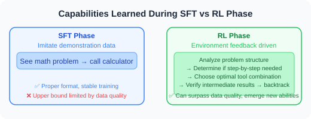
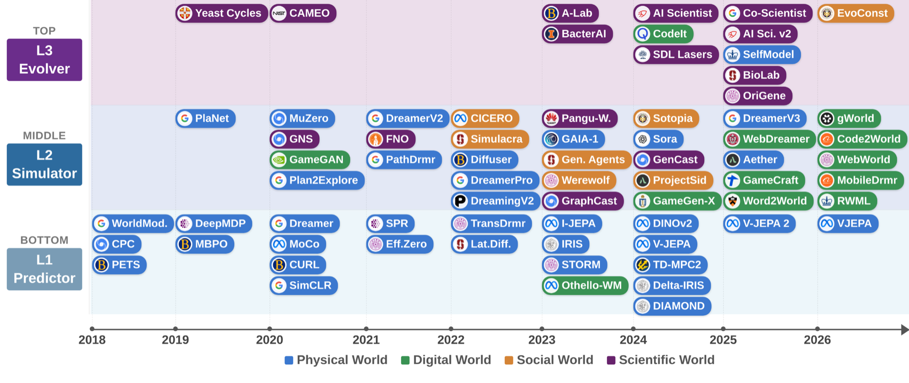
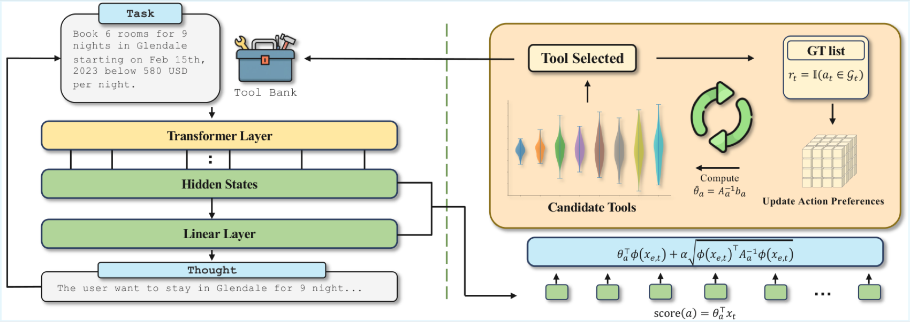
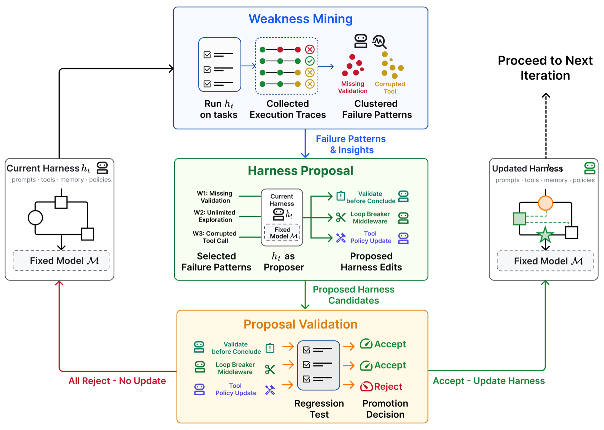
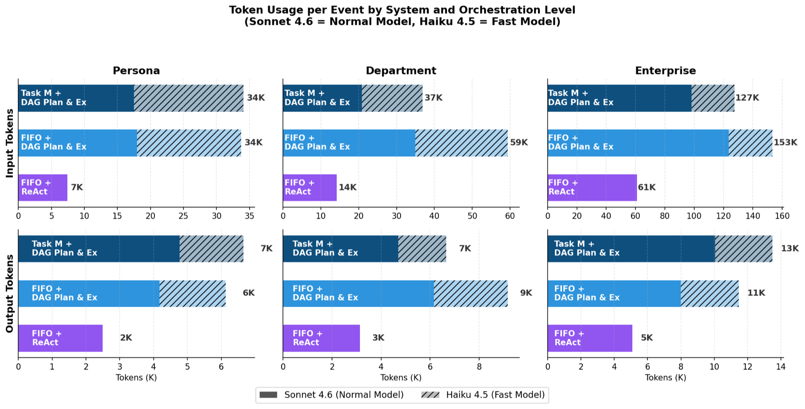

# 5.7 Paper Readings: Cutting-Edge Planning & Reasoning Research

> 📖 *"An Agent's reasoning ability determines its ceiling, while its planning ability determines the complexity of tasks it can handle."*  
> *This section provides an in-depth reading of seminal papers in the planning and reasoning domain.*

---

## ReAct: Synergizing Reasoning and Acting

**Paper**: *ReAct: Synergizing Reasoning and Acting in Language Models*  
**Authors**: Yao et al., Princeton University & Google Brain  
**Published**: 2022 | [arXiv:2210.03629](https://arxiv.org/abs/2210.03629)

### Core Problem

Before ReAct, LLM reasoning (Chain-of-Thought) and acting (tool invocation) were two separate research directions:
- **CoT made models "think well" but "unable to act"** — they couldn't access external information during reasoning
- **Tool invocation made models "act well" but "unable to reason"** — blindly executing without explaining rationale

### Core Idea

ReAct's core insight: **Reasoning provides direction for action, and action provides evidence for reasoning — only by interleaving them can complex problems be solved.**


### Experimental Results

| Task | CoT | Act-only | ReAct | Improvement |
|------|-----|----------|-------|------|
| HotpotQA (multi-hop QA) | 29.4% | 25.7% | 35.1% | +6pp vs CoT |
| ALFWorld (interactive game) | — | 45% | 79% | +34pp vs Act |
| WebShop (online shopping) | — | 30.1% | 40.0% | +10pp vs Act |

### Implications for Agent Development

ReAct directly laid the foundation for the basic architecture of modern Agents. Today, the default Agent mode in nearly all mainstream frameworks (LangChain, LlamaIndex, AutoGen) is based on ReAct. The code implementation in Section 5.2 is the engineering realization of the ReAct paper.

---

## MRKL Systems: Modular Expert Routing

**Paper**: *MRKL Systems: A modular, neuro-symbolic architecture that combines large language models, external knowledge sources and discrete reasoning*  
**Authors**: Karpas et al., AI21 Labs  
**Published**: 2022

### Core Idea

MRKL (Modular Reasoning, Knowledge and Language) proposed a "router + expert modules" architecture:


### Relationship with ReAct

MRKL is one of ReAct's predecessors, but with a key distinction:
- **MRKL routing is relatively fixed**: dispatches to predefined experts based on input type
- **ReAct lets the model decide autonomously**: the model dynamically decides which tool to call during reasoning

This evolution from "hardcoded routing" to "autonomous decision-making" represents an important step in Agent technology development.

---

## Plan-and-Solve: Plan First, Then Execute

**Paper**: *Plan-and-Solve Prompting: Improving Zero-Shot Chain-of-Thought Reasoning by Large Language Models*  
**Authors**: Wang et al.  
**Published**: 2023 | [arXiv:2305.04091](https://arxiv.org/abs/2305.04091)

### Core Problem

Although Zero-shot CoT ("Let's think step by step") is simple and effective, it's prone to three types of errors on complex problems:
1. **Calculation errors**: an error in one step of multi-step computation
2. **Missing step errors**: omitting critical intermediate steps
3. **Semantic understanding errors**: misunderstanding key information in the problem

### Method Principles

Plan-and-Solve's core improvement is elegant — replacing a single prompt phrase:

```
Zero-shot CoT:
"Let's think step by step."

Plan-and-Solve (PS):
"Let's first understand the problem and devise a plan to solve it.
 Then, let's carry out the plan and solve the problem step by step."

Plan-and-Solve+ (PS+):
"Let's first understand the problem, extract relevant variables and their 
 corresponding numerals, and make a plan. Then, let's carry out the plan, 
 calculate intermediate results (pay attention to correct numerical 
 calculation and target commonsense reasoning), and solve the problem 
 step by step."
```

### Experimental Results

On the GSM8K math reasoning benchmark, PS+ improved upon standard Zero-shot CoT by 5-6 percentage points.

### Implications for Agent Development

Plan-and-Solve's idea directly corresponds to the **Plan-and-Execute pattern** in Agents (Section 5.3): let the LLM first formulate a complete execution plan, then gradually execute each subtask. This is more reliable than the "one step at a time" ReAct pattern for certain tasks.

---

## HuggingGPT: Cross-Modal Task Planning

**Paper**: *HuggingGPT: Solving AI Tasks with ChatGPT and its Friends in HuggingFace*  
**Authors**: Shen et al., Microsoft Research  
**Published**: 2023

### Core Idea

Using ChatGPT as the "brain" to decompose complex tasks, then scheduling specialized models on HuggingFace to execute subtasks:


### Implications for Agent Development

HuggingGPT demonstrated the powerful capability of "planning + tool invocation" on multimodal tasks. Its architectural philosophy (large model for planning, small models for execution) is widely applied in today's Agent systems.

---

## LLM+P: Combining with Classical AI Planners

**Paper**: *LLM+P: Empowering Large Language Models with Optimal Planning Proficiency*  
**Authors**: Liu et al.  
**Published**: 2023

### Core Problem

LLMs tend to make errors in long-horizon planning — especially in planning problems requiring complex constraint satisfaction (such as scheduling and resource allocation). Classical AI planners (such as PDDL-based planners) are more reliable on these problems but cannot understand natural language.

### Method Principles


**Core idea**: LLM handles translation, planner handles reasoning — each doing what it does best.

### Implications for Agent Development

This "LLM + specialized tools" combination approach is highly practical in Agent development:
- Don't make the LLM do everything — its planning ability is limited
- For tasks requiring precise reasoning, delegate the reasoning to specialized tools

---

## Reflexion: Linguistic Reinforcement Learning

**Paper**: *Reflexion: Language Agents with Verbal Reinforcement Learning*  
**Authors**: Shinn et al.  
**Published**: 2023 | [arXiv:2303.11366](https://arxiv.org/abs/2303.11366)

### Core Problem

Traditional reinforcement learning requires extensive trial-and-error and parameter updates. For LLM Agents, is there a lighter-weight way to learn from mistakes?

### Method Principles

Reflexion proposed **"linguistic reinforcement learning"** — instead of updating model weights after task failure, the Agent generates natural language "reflection notes" and stores them in long-term memory:


### Experimental Results

| Task | Without Reflection | With Reflection (Reflexion) | Improvement |
|------|--------|-------------------|------|
| HumanEval (code generation) | 80% | 91% | +11pp |
| AlfWorld (decision-making tasks) | 63% | 97% | +34pp |

### Key Findings

1. **Reflective memory is key**: not only reflecting within the current task, but also saving and reusing reflection experience across tasks
2. **Language is more flexible than gradients**: "lessons learned" described in natural language transfer more easily to new tasks than parameter updates
3. **The value of long-term memory**: as reflection notes accumulate, the Agent's performance continues to improve

---

## Self-Refine: Iterative Self-Improvement

**Paper**: *Self-Refine: Iterative Refinement with Self-Feedback*  
**Authors**: Madaan et al., CMU  
**Published**: 2023 | [arXiv:2303.17651](https://arxiv.org/abs/2303.17651)

### Method Principles

Self-Refine's approach is more concise — having the same LLM play two roles:


### Experimental Results

Across 7 tasks including code generation, math reasoning, and dialogue summarization, the average improvement was approximately 20%.

### Differences from Reflexion

- **Self-Refine**: repeatedly improves within the current task without saving long-term memory
- **Reflexion**: accumulates reflection experience across tasks, forming long-term memory

---

## CRITIC: Tool-Assisted Self-Correction

**Paper**: *CRITIC: Large Language Models Can Self-Correct with Tool-Interactive Critiquing*  
**Authors**: Gou et al.  
**Published**: 2023 | [arXiv:2305.11738](https://arxiv.org/abs/2305.11738)

### Core Innovation

Introduces **tool verification** on top of self-critique — the Agent's self-assessment no longer relies solely on the LLM's own judgment, but uses external tools for objective verification:

> - **Code tasks**: Agent writes code → runs unit tests → modifies code based on test results
> - **Factual tasks**: Agent drafts answer → verifies key facts with search engine → corrects erroneous information
> - **Math tasks**: Agent provides reasoning → verifies calculations with a calculator → corrects calculation errors

### Key Finding: The Boundaries of Self-Correction

An important counterpoint paper is worth noting — **"Large Language Models Cannot Self-Correct Reasoning Yet"** (Huang et al., 2023) points out:

- **Without external feedback, LLM's pure self-reflection may actually reduce reasoning accuracy**
- Models tend to "confidently make mistakes" — turning correct answers into incorrect ones
- **Practical implication: external verification (such as code execution, search verification) must be introduced in the reflection loop**

---

---

## DeepSeek-R1: Reinforcement Learning Elicits Reasoning Capability

**Paper**: *DeepSeek-R1: Incentivizing Reasoning Capability in LLMs via Reinforcement Learning*  
**Authors**: DeepSeek-AI  
**Published**: January 2025 | [arXiv:2501.12948](https://arxiv.org/abs/2501.12948)

### Core Problem

Traditional LLM reasoning enhancement relies on supervised fine-tuning (SFT) — requiring human annotation of "correct reasoning steps." However, the annotation cost for high-quality reasoning data is extremely high, and human annotators may miss optimal reasoning paths. **Can models learn to reason autonomously through pure reinforcement learning?**

### Method Principles

DeepSeek-R1's core innovation is using the **GRPO (Group Relative Policy Optimization)** algorithm to let the model autonomously evolve reasoning capabilities:



DeepSeek-R1 (RL + distillation) builds upon R1-Zero: first "cold-starting" with a small amount of high-quality SFT data, then large-scale RL training, and finally distilling the large model's reasoning capabilities into smaller models (distilled versions from 1.5B to 70B also possess strong reasoning capabilities).

### Key Findings

1. **Reasoning can emerge through pure RL**: R1-Zero never saw any human-annotated reasoning process but spontaneously learned to reflect, verify, and perform multi-step reasoning
2. **The "Aha moment"**: a turning point during training where the model suddenly learns to self-reflect — a classic case of emergent behavior
3. **Surprising distillation effectiveness**: the 32B distilled model surpassed OpenAI o1-mini on math reasoning, and the 7B version also possesses strong reasoning ability
4. **Open-source ecosystem**: released under MIT license, promoting the democratization of reasoning models

### Experimental Results

| Benchmark | GPT-4.1 | OpenAI o1 | DeepSeek-R1 |
|------|--------|-----------|-------------|
| AIME 2024 (math competition) | 9.3% | 79.2% | 79.8% |
| MATH-500 | 76.6% | 96.4% | 97.3% |
| Codeforces Rating | 759 | 1891 | 2029 |
| GPQA Diamond (scientific reasoning) | 49.9% | 75.7% | 71.5% |

### Implications for Agent Development

1. **Reasoning models are reshaping Agent architecture design**: o1/o3/R1 and other reasoning models far surpass ordinary models in "think before acting," making them ideal as the planning and decision-making core of Agents
2. **"Slow thinking" vs "Fast thinking"**: use reasoning models for complex planning and decision-making, and ordinary models for simple tool calls and information retrieval
3. **Small models can also reason**: distilled R1 versions make reasoning Agents feasible for edge deployment

---

## OpenAI o1: A Milestone in Native Reasoning

**Paper/Technical Report**: *Learning to Reason with LLMs*  
**Authors**: OpenAI  
**Published**: September 2024

### Core Contribution

OpenAI o1 was the first commercial model to **internalize Chain-of-Thought into the model training process**, marking the birth of the new "reasoning model" category:


### Subsequent Developments

| Model | Release Date | Characteristics |
|------|---------|------|
| o1-preview | 2024.09 | First reasoning model, significantly improved math/programming |
| o1 | 2024.12 | Official release, comprehensive performance improvement |
| o3-mini | 2025.01 | Cost-optimized version, supports low/medium/high reasoning intensity |
| o3 | 2025.04 | Flagship reasoning model |
| o4-mini | 2025.04 | Combining tool invocation and reasoning |

### Implications for Agent Development

The emergence of reasoning models presents Agent developers with new choices:
- **Simple tasks** use ordinary models (gpt-4.1-mini) — low cost, fast
- **Complex planning and decision-making** use reasoning models (o3, DeepSeek-R1) — high accuracy
- **The return of Plan-and-Execute**: reasoning models are naturally suited for "plan first, then execute" Agent architectures

---

## Paper Comparison and Development Trajectory

| Paper | Year | Core Contribution | Limitations |
|------|------|---------|--------|
| MRKL | 2022 | Modular routing architecture | Routing rules are hardcoded |
| ReAct | 2022 | Reasoning + acting interleaved | High token consumption |
| Plan-and-Solve | 2023 | Plan first, then execute | Static plan, doesn't adapt to changes |
| HuggingGPT | 2023 | Cross-modal task planning | High latency, dependent on external models |
| LLM+P | 2023 | LLM + classical planner | PDDL translation may have errors |
| Reflexion | 2023 | Linguistic reinforcement learning | Requires explicit success/failure signals |
| Self-Refine | 2023 | Iterative self-improvement | May get stuck in ineffective loops |
| CRITIC | 2023 | Tool-assisted self-correction | Requires suitable verification tools |
| **OpenAI o1** | **2024** | **Native reasoning model** | High cost, no tool invocation support (early) |
| **DeepSeek-R1** | **2025** | **Pure RL emergent reasoning + open-source** | Uncontrollable reasoning process, potential overthinking |

**Development Trajectory**:


> 💡 **Frontier Trends (2025-2026)**: "Reasoning models" are reshaping Agent architecture design. OpenAI o3/o4-mini already supports the combination of tool invocation and reasoning, and the open-sourcing of DeepSeek-R1 allows small models to also possess strong reasoning capabilities. An important new pattern in Agent development is the **"dual-model architecture"** — using reasoning models (o3/R1) as the planning core responsible for complex decision-making, and ordinary models (gpt-4.1-mini) as the execution layer responsible for tool invocation and information retrieval, balancing accuracy and cost. Meanwhile, research shows that LLM success rates drop sharply for tasks requiring more than 5 planning steps — reasoning models are mitigating but have not yet fully resolved this bottleneck.

---

## 📝 Chapter Exercises

After reading this chapter, close the book and answer the following questions in your own words, then expand the reference answers for comparison.

**Exercise 1 (Concept)**: ReAct interleaves "Reasoning" and "Acting." This chapter's experiments show that standalone CoT (reasoning only) or standalone Act-only (acting only) perform poorly on complex tasks, while only the combination of both yields significant improvements. Explain in your own words: why are "reasoning only" and "acting only" each insufficient on their own, and how does interleaving them produce a 1+1>2 effect?

<details>
<summary>Reference Answer</summary>

- **The problem with reasoning only (CoT) — "thinks well but can't act"**: Pure Chain-of-Thought deduces step by step in its head, but it **cannot access the latest external information**. Once reasoning requires factual grounding (some data, webpage content, code execution results), the model can only "hallucinate" from pre-training memory — easily producing hallucinations that cannot be corrected even when wrong.
- **The problem with acting only (Act-only) — "acts well but can't think"**: Blindly invoking tools without explaining why each step is taken. Without reasoning guidance, actions become random, lacking global planning, and easily go astray at decision points.

**Why interleaving achieves 1+1>2:** ReAct's core insight is — **reasoning provides direction for action, and action provides evidence for reasoning**.

- Reasoning (Thought) first clarifies "what to check and why," giving purposeful direction to subsequent actions; the generated Thought tokens also serve as "coercive context" for subsequent Actions, reducing action randomness.
- Action retrieves real Observations, providing **factual anchors** for the next round of reasoning, avoiding fabrication, and enabling timely course correction when errors occur.

The two form a closed loop: think → act → observe results → think again... With both external factual constraints and reasoning guiding the overall direction, it activates a human-like "trial-and-error + self-correction" capability, far surpassing either component alone.

</details>

**Exercise 2 (Analysis)**: Both Reflexion and Self-Refine let the Agent "reflect and improve itself" — they seem quite similar. But this chapter points out a key difference between them. State this difference, and further consider: the chapter also mentions a "counterpoint paper" that argues "LLMs cannot yet reliably self-correct" — what practical implications does this have for designing reflection loops?

<details>
<summary>Reference Answer</summary>

**The key difference between Reflexion and Self-Refine is whether "reflection is persisted across tasks":**

- **Self-Refine**: repeatedly improves **within the current task** (generates its own feedback → modifies itself), and these reflections are **not retained** after the task ends — a "one-time" self-polishing.
- **Reflexion**: writes failure lessons as natural language "reflection notes" **into long-term memory**, **reused across tasks**. As notes accumulate, the Agent's performance across a series of tasks continuously improves — this is "linguistic reinforcement learning": evolution through linguistic experience without updating model weights.

**Implications from the counterpoint paper ("LLMs Cannot Self-Correct Reasoning Yet"):**

- **Without external feedback**, LLM's pure "self-reflection" may **actually reduce** accuracy — models will "confidently make mistakes," changing originally correct answers to wrong ones.
- The practical implication is very clear: **external verification must be introduced in the reflection loop** — the model should not just talk to itself. For example:
  - Code tasks → run unit tests, use test results to guide modifications;
  - Factual tasks → verify with a search engine;
  - Math tasks → verify with a calculator.
- This is precisely the core idea of the CRITIC paper: self-critique should be built upon **objective verification from tools**, not the model's subjective judgment. So when designing Agents, reflection ≠ letting the model free-associate — it needs an "external mirror."

</details>

**Exercise 3 (Hands-on)**: Based on CRITIC's idea of "tool-assisted self-correction," design a reflection loop with external verification for a **Python coding Agent**. Write out the flow in pseudocode and explain how it improves upon "pure self-reflection."

<details>
<summary>Reference Answer</summary>

```python
def coding_agent_with_critic(task, llm, run_tests, max_rounds=3):
    """Code generation + self-correction loop with external verification (running tests)"""
    code = llm.generate(f"Please complete the following task in Python: {task}")

    for round in range(max_rounds):
        # —— External verification: actually run tests instead of letting the model judge correctness ——
        passed, failed_cases, error_log = run_tests(code)

        if passed:                       # All tests passed, exit normally
            return code

        # —— Reflection: feed objective failure evidence back to the model ——
        reflection_prompt = f"""
The code you wrote did not pass the tests. Here are the objective execution results:

Failed test cases: {failed_cases}
Error log: {error_log}

Analyze the root cause of the failure, then provide the corrected complete code.
"""
        code = llm.generate(reflection_prompt)

    return f"[After {max_rounds} rounds still did not pass tests, final version]\n{code}"
```

**How this improves upon "pure self-reflection":**

1. **Feedback is objective, not model speculation**: In pure self-reflection, the model judges "do I think this code has issues?" — likely "confidently" concluding there are no issues (or changing correct code to wrong). Here, `run_tests` is real execution, with correctness determined by the objective results of test cases.
2. **Error information is specific and localizable**: Error stack traces and failed test cases tell the model "exactly where and why it's wrong," far more useful than vague prompts like "check again," enabling more targeted corrections.
3. **Avoids the "LLMs cannot yet reliably self-correct" trap**: Echoing the chapter's counterpoint paper — building reflection on external verification is what truly makes it effective.
4. **Limited rounds as a safety net**: stops after `max_rounds` to avoid wasting cost in ineffective loops (one of Self-Refine's known risks is getting stuck in ineffective loops).

This essentially applies the ReAct "action-observation" loop to error correction: write code (action) → run tests (observe objective feedback) → reflect and correct, cycling through.

</details>

---

## 📰 Latest Paper Roundup

> 🗓️ This section is maintained by automated daily update tasks. Last updated: **August 5, 2026**

### [Agentic World Modeling: Foundations, Capabilities, Principles, and Future Outlook (2026)](https://arxiv.org/abs/2604.22748)

> 🧬 **In a nutshell**: A two-dimensional "capability level × principle system" taxonomy to unify Agent world modeling — L1 Predictor / L2 Simulator / L3 Evolver, spanning four categories of principles: physical, digital, social, and scientific.

**Core Problem**: As Agents move from generating text to "achieving goals through sustained interaction," environment dynamics modeling becomes the core bottleneck — yet "world model" means very different things across different communities, lacking a unified roadmap.

**Method Description**: This paper proposes the "levels & laws" two-dimensional taxonomy. The first dimension defines three capability levels: **L1 Predictor** (learns single-step local transition operators), **L2 Simulator** (composes them into multi-step action-conditional rollouts respecting domain laws), **L3 Evolver** (autonomously corrects its own model when predictions fail). The second dimension identifies four categories of principle systems (physical, digital, social, scientific), determining which constraints a world model must satisfy and where it is most likely to fail. Representative system timeline below:



> Image source: the paper (source: 2026, arXiv:2604.22748)

**Key Results**: Systematic review of 400+ papers and 100+ representative systems, covering model-based RL, video generation, Web/GUI Agents, multi-agent social simulation, and AI-driven scientific discovery, with decision-centric evaluation principles and reproducible evaluation suites proposed.

**Relevance to This Chapter**: Directly connected to the chapter's "ReAct framework" and "task decomposition" knowledge points — world modeling capability is the foundation for accurate task planning and long-horizon reasoning, with L2/L3-level world models representing the ceiling of Agent planning capability.

---

### [GraphPlanner: Graph Memory-Enhanced Multi-Agent Routing and Collaborative Planning (2026)](https://arxiv.org/abs/2604.23626)

> 🧬 **In a nutshell**: Models multi-agent routing as an MDP, simultaneously selecting both LLM backbone and role (Planner/Executor/Summarizer) at each step, using heterogeneous graph memory to capture interaction history.

**Core Problem**: LLM routing can already integrate multi-model advantages to balance efficiency and performance, but to support more realistic and complex applications, routing must extend to Agentic scenarios — task planning, heterogeneous multi-agent multi-turn collaboration, and memory utilization are all indispensable, yet existing routers lack these capabilities.

**Method Description**: GraphPlanner is a heterogeneous graph memory-enhanced Agentic router that generates routing workflows for each query, supporting both inductive and transductive reasoning. It formalizes workflow generation as an **MDP** — at each step, simultaneously selecting both the LLM backbone and the Agent role (Planner/Executor/Summarizer); and uses a heterogeneous graph **GARNet** to capture interaction memory among queries, agents, and responses, integrating historical memory and workflow memory into decision-making. Workflow example below:


> Image source: GraphPlanner paper (source: 2026, arXiv:2604.23626)

**Key Results**: Compared to strong baseline routers, accuracy improved by up to **9.3%**, GPU memory reduced from 186 GiB to **1.04 GiB**, with zero-shot generalization capability to unseen tasks.

**Relevance to This Chapter**: Echoes the chapter's "task decomposition" and "Plan-and-Execute framework" — GraphPlanner's MDP modeling makes planning decisions explicit, and the graph memory mechanism addresses the pain point of experience reuse in multi-agent long-horizon planning.

---

### [OLIVIA: Inference-Time Action Adaptation — A New Paradigm for Online Decision-Making in LLM ReAct Agents (2026)](https://arxiv.org/abs/2605.11169)

> 🧬 **In a nutshell**: Models the action selection layer of ReAct Agents as a contextual linear bandit, using frozen hidden states as decision context, enabling lightweight online learning at inference time.

**Core Problem**: When deployed Agents repeatedly handle related multi-step tasks, small action selection errors accumulate into wasted tool calls, latency, and reduced reliability. But existing inference-time adaptation methods mainly rely on prompts or retrieval, indirectly influencing behavior through context manipulation — not exposing an explicit decision layer for ReAct Agents that can score candidate actions, represent uncertainty, and update online.

**Method Description**: OLIVIA is an inference-time action adaptation framework that models the action selection of LLM ReAct Agents as a **contextual linear bandit**, using frozen hidden states as decision context, enabling lightweight online learning. It adapts behavior directly at the action selection interface, preserves the full reasoning process, and provides explicit uncertainty estimation with low-overhead online policy updates. Framework overview below:



> Image source: OLIVIA paper (source: 2026, arXiv:2605.11169)

**Key Results**: Consistent performance improvements validated across four Agent decision-making benchmarks, supporting trackable, fine-grained, uncertainty-aware deployment-time adaptation.

**Relevance to This Chapter**: Directly corresponds to this chapter's ReAct framework and inference-time decision-making knowledge points, representing the latest advance in introducing online learning into the ReAct loop — providing a practical lightweight approach for "how Agents can continuously improve action strategies during execution."

---

*Back to: [Chapter 5 Planning & Reasoning](./README.md)*

### [RAO: Recursive Agent Optimization — Using RL to Train Agents to Learn Divide-and-Conquer Planning (2026)](https://arxiv.org/abs/2605.06639)

> 🧬 **In a nutshell**: Uses RL to train a single policy that simultaneously acts as "dispatcher" and "executor," learning when to recursively decompose tasks and delegate to its own sub-instances, achieving inference-time divide-and-conquer scaling.

**Core Problem**: Traditional Agent planning faces "context collapse" and "generalization ceiling" — models are not trained to manage their own sub-processes, failing on long tasks. Recursive invocation (spawning child agents) is a natural pathway for inference-time scaling, but models cannot autonomously determine when to delegate and how to communicate.

**Method Description**: RAO (Recursive Agent Optimization) uses RL to train **recursive Agents** — Agents capable of recursively spawning subtasks and delegating them to new instances of themselves. Recursion itself is an inference-time scaling algorithm, naturally enabling Agents to support longer contexts and generalize to harder problems through divide-and-conquer. RAO trains models to learn two core capabilities: **delegation and communication**. Framework below:


> Image source: RAO paper (source: 2026, arXiv:2605.06639)

**Key Results**: Recursive Agents exhibit better training efficiency, can scale to tasks exceeding the model's context window, generalize to tasks far harder than those seen during training, and achieve better wall-clock time than single-agent systems.

**Relevance to This Chapter**: Corresponds to Section 5.5's "Plan-and-Execute" framework, offering a novel, learnable inference-time scaling planning paradigm — a cutting-edge advance in the Task Decomposition direction.

---

### [Self-Harness: A New Paradigm for Agents to Autonomously Improve Their Own Execution Frameworks (2026)](https://arxiv.org/abs/2606.09498)

> 🧬 **In a nutshell**: Lets a fixed model use structured trajectories and validator results to iteratively make minimal mechanistic edits to its own harness, achieving "the model improves the framework surrounding itself."

**Core Problem**: An Agent's execution framework (harness — prompts, tool invocation logic, instruction templates) has historically been manually designed by humans, making it difficult to maintain at scale given rapid LLM iteration. Manual harness engineering relies on manual diagnosis and ad-hoc revisions; external optimizers use separate pipelines to search for revisions — neither has the model itself improve its own harness.

**Method Description**: Self-Harness studies a new setting: **a fixed language model uses only structured trajectories and validator results from a stable evaluator to improve the harness surrounding itself**. Each iteration: the current harness runs on training tasks to collect evidence → the same model serves as the proposer role to generate narrow, mechanistically specific edits → the edited harness is re-evaluated, only accepting changes that pass regression tests. Single optimization loop below:



> Image source: Self-Harness paper (source: 2026, arXiv:2606.09498)

**Key Results**: On Terminal-Bench-2.0, held-out pass rates for three different model families improved from 40.5%→61.9%, 23.8%→38.1%, and 42.9%→57.1% respectively — qualitative analysis confirmed that improvements came from precise fixes targeting model-specific weaknesses rather than generalized instructions.

**Relevance to This Chapter**: Corresponds to the chapter's "Agent self-improvement" and "meta-planning" knowledge points — the latest empirical evidence of planning capability upgrading from "executing external strategies" to "autonomously optimizing the execution framework," demonstrating how Agents can truly participate in the evolution of their own execution logic through structured reflection.

---

### [Scaling Enterprise Multi-Agent Orchestration: A Comprehensive Comparison of DAG Planning and ReAct (2026)](https://arxiv.org/abs/2606.20058)

> 🧬 **In a nutshell**: Empirically compares DAG Plan&Execute and ReAct across 208 enterprise scenarios at up to 200-Agent scale, finding that "scale rather than complexity" dominates degradation.

**Core Problem**: Enterprise AI is moving toward continuous event monitoring-detection-action, but existing multi-agent systems mostly assume discrete request-response workflows and have barely been studied at enterprise scale — no one has tested how orchestration architectures degrade at 200-Agent scale.

**Method Description**: This paper evaluates DAG Plan & Execute and ReAct across 208 production-derived enterprise scenarios, covering Persona (<10 Agents), Department (20–80), Enterprise (200) scales, and introducing a Task Manager for continuous operations (priority inference, related event merging, preemption). Token usage by orchestration level below:



> Image source: the paper (source: 2026, arXiv:2606.20058)

**Key Results**: The core finding is that **scale (not task complexity) dominates orchestration performance degradation** — Agent discovery noise becomes the primary bottleneck as scale increases, with simple tasks degrading more severely than complex ones; DAG excels in small-scale accuracy and parallelization but overhead worsens with scale, while ReAct is more robust through incremental failure handling. The Task Manager reduces high-priority queue latency by 14–75%, with related event accuracy at enterprise scale improving by over 20 percentage points.

**Relevance to This Chapter**: Directly corresponds to the architectural selection discussion between Section 5.5 "Plan-and-Execute" and Section 5.4 "ReAct" — provides large-scale empirical comparison of two planning paradigms in real enterprise scenarios, serving as the latest authoritative reference for understanding the behavioral characteristics of different planning frameworks under complex system boundary conditions.

---

### [HALO: Training a Small Orchestrator — Replacing GPT-5 API Orchestration with Verified Trajectory Supervision (2026)](https://arxiv.org/abs/2606.21740)

> 🧬 **In a nutshell**: Trains a QLoRA small model as an Orchestrator using validator-certified "state → select fixer Agent" trajectories, paired with 3 hard rules, replacing per-step GPT-5 API calls.

**Core Problem**: Translating natural language planning intent into verifiable plans is a classic problem — people express goals in language, but classical planners require PDDL specifications. Recent Agentic frameworks bridge this through "pools of specialized fixer agents + refinement loops checked by validators," but the Orchestrator at the center of the loop is itself a prompted frontier LLM, incurring the cost of a frontier LLM API call at each refinement step.

**Method Description**: HALO (Hybrid Agent-Learned Orchestrator) trains an Orchestrator using refinement trajectories certified by validators as "ending with a valid plan," across 11 PDDL domains. It uses a **QLoRA fine-tuned small policy** paired with three hard rules to handle directly decidable choices, operating on an extended 21-Agent action space — unlike approaches that prompt frontier LLMs at every step or learn Orchestrators from scratch. End-to-end framework below:


> Image source: HALO paper (source: 2026, arXiv:2606.21740)

**Key Results**: Matched or exceeded GPT-5-mini prompted baselines on PlanBench, Natural Plan, and other benchmarks, with **45×** cost reduction ($0.18→$0.004/task), and 40–50% fewer LLM calls.

**Relevance to This Chapter**: Corresponds to Section 5.5's "Plan-and-Execute" and Orchestrator design knowledge points — HALO demonstrates a viable path for training small specialized orchestration policies using verified trajectory data, the latest empirical evidence for migrating from "fully reliant on large model API orchestration" to "lightweight local orchestration policy," carrying significant engineering value for low-cost large-scale Agent deployment.

---

### [ATG: A Unified Framework of Atomic Task Graphs for Agentic Planning and Execution (2026)](https://arxiv.org/abs/2607.01942)

**Published**: July 2, 2026 | [arXiv:2607.01942](https://arxiv.org/abs/2607.01942)

**Core Contribution**: Existing LLM Agents' performance improvements on complex multi-step tasks often rely on larger backbone models or task-specific fine-tuning. Prompt-based control requires no training but the input-output dependencies between subtasks are implicit in text trajectories, making it difficult to reuse verified intermediate results. ATG (Atomic Task Graph) proposes an explicit Directed Acyclic Graph (DAG) control framework: the planning phase recursively decomposes high-level tasks, tracking graph evolution; the execution phase parallelizes independent branches; upon detecting failure, it uses the graph evolution history to precisely locate error sources and only repairs affected regions, leaving verified regions unchanged. On three interactive benchmarks, using only 7B–8B backbone models, it consistently outperformed strong baselines.

**Relevance to This Chapter**: Directly corresponds to the chapter's Section 5.3 "Task Decomposition" and Section 5.5 "Plan-and-Execute" knowledge points — ATG explicitly represents subtask dependencies as a graph structure, the latest empirical evidence of task decomposition upgrading from "linear decomposition + sequential execution" to "DAG parallelization + local repair," balancing execution efficiency and error tolerance.

---

### [GATS: Efficient Agent Planning with Graph-Augmented Tree Search and Hierarchical World Models (2026)](https://arxiv.org/abs/2607.08894)

**Published**: July 9, 2026 | [arXiv:2607.08894](https://arxiv.org/abs/2607.08894)

**Core Contribution**: Existing LLM Agent planning methods such as LATS and ReAct heavily rely on LLM reasoning during the planning phase, incurring high computational cost and uncertain behavior. GATS (Graph-Augmented Tree Search) combines systematic UCB1 tree search with a three-layer world model, **completely eliminating LLM calls during the inference phase**: the L1 layer performs precise symbolic action matching, the L2 layer learns statistical patterns from execution logs, and the L3 layer uses LLMs to predict unknown actions. Achieved **100% success rate** on synthetic planning tasks with branches and dead ends (LATS 92%, ReAct 64%); maintained **100% success rate** across 12 high-difficulty scenarios (coding workflows, web navigation, long-horizon tasks) (LATS 88.9%, ReAct 23.9%), with **zero LLM calls per task** (LATS requires 37), generating deterministic plans with zero cross-run variance.

**Relevance to This Chapter**: Corresponds to the chapter's Section 5.4 "Tree Search Planning" and "World Model" knowledge points — GATS proves that "systematic search + learned world model" can significantly outperform "LLM-guided exploration," an important empirical validation of LATS-like methods returning from "LLM-dependent reasoning" to "learning environment models + classical search," with direct engineering value for low-cost, high-reliability Agent planning.

---

---

### [Living-Harness: A Self-Evolving Agent Harness that Transforms Every Execution Trajectory into Persistent Workflow Knowledge (2026)](https://arxiv.org/abs/2607.26598)

**Published**: July 29, 2026 | [arXiv:2607.26598](https://arxiv.org/abs/2607.26598)

**Core Contribution**: After an Agent runs, even if it recovered from failures within that episode, the same execution failures recur in subsequent tasks — because post-episode feedback almost never revises the persistent Harness (tools, context, memory, workflow structure) that guides future interactions. Living-Harness proposes a **self-evolving Agent Harness**: guided by **Evolution-SOP** (Standard Operating Procedure), it extracts episodic abstractions and structured update evidence from each complete trajectory and its evaluation signals, writing into two complementary types of procedural knowledge — **episodic memory** (recording trigger conditions, failure modes, and recovery actions) and **state graphs** (recording state nodes, repair edges, and transition rules). Tools and base context remain frozen, with only procedural repairs accumulating across evolution cycles; the updated Harness state is retrieved to guide subsequent interactions, and the evolved Harness state can be reused across different backbone models. On 8 interactive environments derived from τ²-Bench and MultiWOZ-2.4, Living-Harness improved Pass@1 by **+10.07pp** and **+9.91pp** respectively over the strongest interactive baselines.

**Relevance to This Chapter**: Directly corresponds to the chapter's "task planning and self-improvement" knowledge points — Living-Harness upgrades static execution frameworks into accumulative planning knowledge bases that automatically evolve from failure experience. State graphs and episodic memory serve as accumulable workflow planning experience, representing the latest empirical advance in planning frameworks' evolution from "one-shot prompting" to "experience-driven evolution," following GATS (world model planning) and ATG (atomic task graphs).

---

### [Think Short, Push Smart: Calibrated Reasoning and Uncertainty-Aware Decision-Making for Edge LLM Agents with Adaptive Deferral (2026)](https://arxiv.org/abs/2607.26865)

**Published**: July 30, 2026 | [arXiv:2607.26865](https://arxiv.org/abs/2607.26865)

**Core Contribution**: Edge-deployed LLM Agents face two mutually constraining optimization objectives: reasoning token budget (more reasoning is better but more expensive) and cloud API latency budget (deferring to the cloud is more accurate but incurs cost/latency penalties). This paper proposes a joint optimization framework: (1) **Calibrated reasoning truncation** — instead of fixed Chain-of-Thought length, dynamically truncate based on task uncertainty, "stop thinking when it's enough"; (2) **Uncertainty-aware deferral decisions** — when local reasoning confidence falls below a threshold, defer the task to a stronger cloud model, explicitly modeling the expected benefit minus cost of deferral decisions. Both are jointly optimized under explicit reward constraints. In edge settings on AgentBench and τ-Bench, it matches or exceeds fixed chain-length baselines at approximately half the reasoning token cost, with deferral decision accuracy improving by 18 percentage points over heuristic rules.

**Relevance to This Chapter**: Directly corresponds to the chapter's "reasoning and planning efficiency optimization" and "task routing decisions" knowledge points — this paper is the first to model "when to defer to a stronger model" as an uncertainty-driven explicit optimization problem, the latest extension of the Plan-and-Execute framework in resource-constrained scenarios, carrying direct architectural reference value for building low-cost, high-reliability Edge-Cloud hybrid Agent systems.

---

### [Real-Time Detection and Repair of LLM Agent Failures (2026)](https://arxiv.org/abs/2608.02464)

**Published**: August 4, 2026 | [arXiv:2608.02464](https://arxiv.org/abs/2608.02464)

**Core Contribution**: Common approaches to handling Agent task failures are either resampling or step-by-step LLM judge evaluation; the former has low repair rates (only ~16%), while the latter incurs high overhead. This paper proposes a **real-time failure detection and repair closed loop** based on cheap single-class telemetry monitors (no step-by-step LLM judging required): monitors continuously observe system-level signals from Agent execution trajectories (action type distributions, tool call frequency, external dependency response codes, etc.), and upon detecting failure signatures, trigger targeted rollback and retry (selecting the optimal recovery point based on the failure cause, rather than simple reset). In benchmark evaluations, targeted rollbacks improved the repairable failure rate from 16% with resampling to **45%**, and overall task success rate from 52% to **73%**, with monitor inference costs far below LLM judge approaches.

**Relevance to This Chapter**: Directly corresponds to the chapter's "Agent planning failure recovery" and "task execution reliability" knowledge points — this paper provides a lightweight online approach that closes the "detection-trigger-repair" loop, the latest online counterpart to Living-Harness (offline experience evolution) for planning-layer failure recovery — the former accumulates repair knowledge offline, while this paper triggers instant repair online, and the two are complementary.

---
