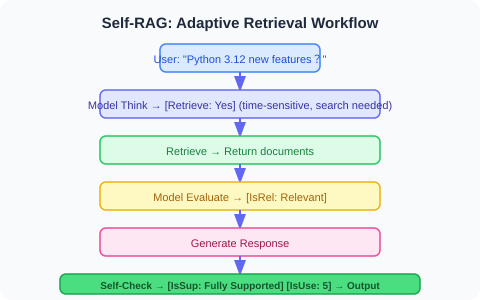
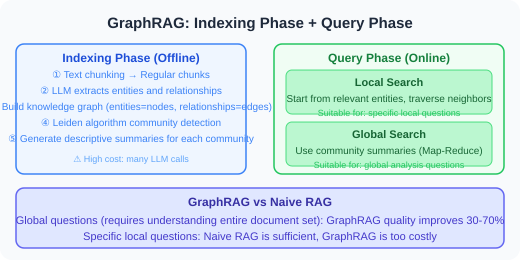
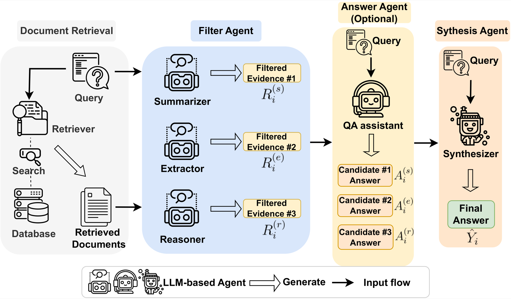
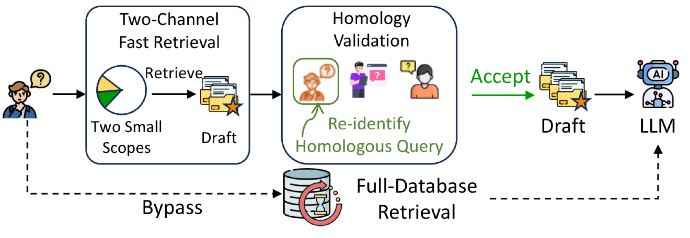
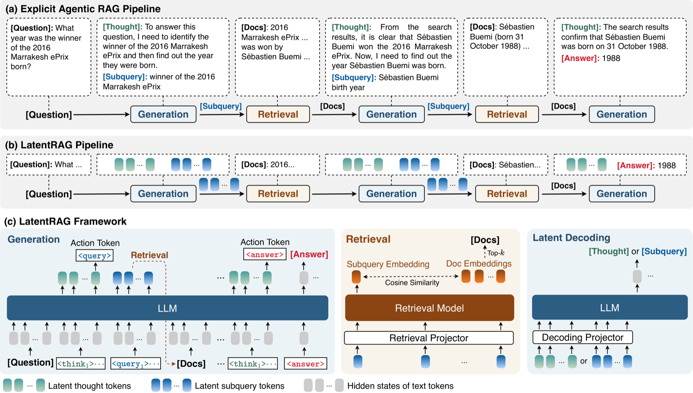
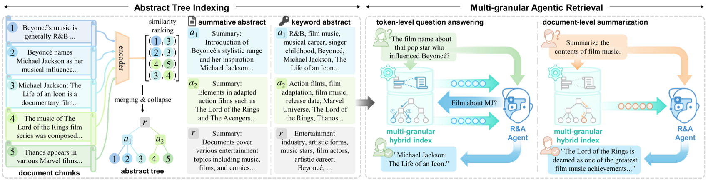
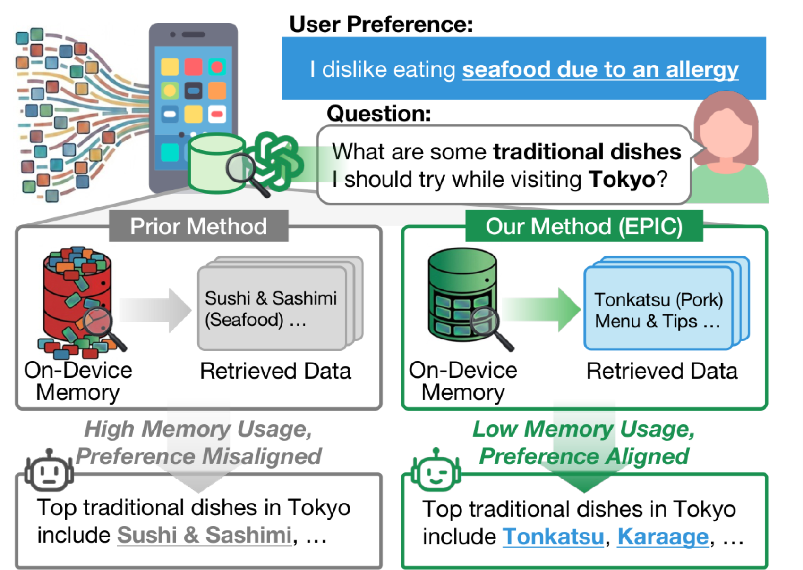
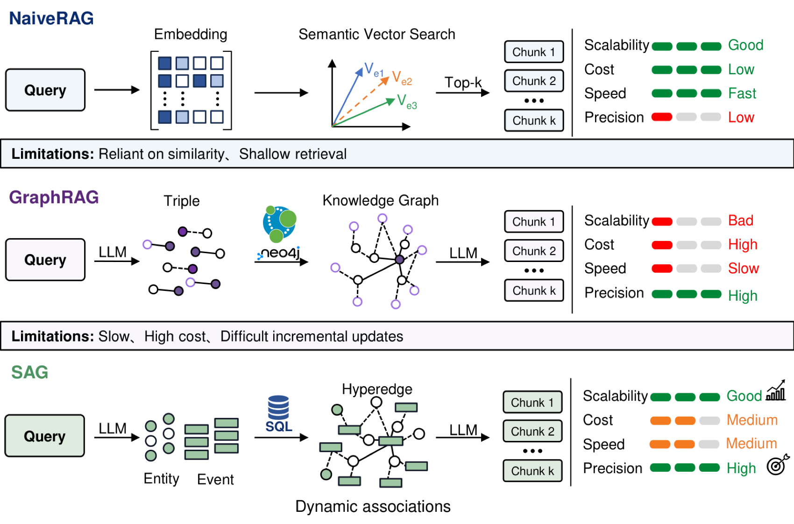

# 6.6 Paper Readings: RAG Frontier Developments

> 📖 *"RAG is one of the fastest-evolving technical directions of the past two years."*  
> *From Naive RAG to Agentic RAG, this section dives deep into the core papers driving this evolution.*

---

## The Original RAG Paper: Where It All Began

**Paper**: *Retrieval-Augmented Generation for Knowledge-Intensive NLP Tasks*  
**Authors**: Lewis et al., Meta AI (Facebook AI Research)  
**Published**: 2020 | [arXiv:2005.11401](https://arxiv.org/abs/2005.11401)

### Core Problem

Pretrained language models implicitly encode knowledge in their parameters, which introduces three problems:
1. Knowledge cannot be easily updated (retraining required)
2. Coverage of rare and long-tail knowledge is insufficient
3. Knowledge sources cannot be traced

### Method Overview

The original RAG approach performs **end-to-end training** of both the retrieval model and the generation model:

The paper proposes two variants:
- **RAG-Sequence**: Each document independently generates a complete answer, with weighted aggregation of all answers
- **RAG-Token**: During generation, each token can reference a different document

### Differences from Today's Practice

Although today's RAG implementations differ significantly from the original paper (we typically do not perform end-to-end training but instead decouple retrieval and generation), the core idea remains the same: **enabling the model to reference external knowledge when generating answers.**

| Dimension | Original RAG (2020) | Modern RAG (2024-2025) |
|-----------|---------------------|------------------------|
| Retrieval Model | DPR (end-to-end trained) | General embedding models (e.g., OpenAI text-embedding-3) |
| Generation Model | BART | GPT-4.1 / Claude, etc. |
| Training Method | End-to-end joint training | Decoupled (retrieval and generation independent) |
| Vector Database | FAISS | ChromaDB / Pinecone / Weaviate |

---

## Self-RAG: Adaptive Retrieval

**Paper**: *Self-RAG: Learning to Retrieve, Generate, and Critique through Self-Reflection*  
**Authors**: Asai et al.  
**Published**: 2023 | [arXiv:2310.11511](https://arxiv.org/abs/2310.11511)

### Core Problem

A fundamental flaw of traditional RAG is that **retrieval is performed for every query**. In reality:
- Some questions can be answered by the model itself; retrieval only introduces noise
- Some questions require multiple rounds of retrieval; one round is insufficient
- Retrieved documents vary in quality and need filtering

### Method Overview

Self-RAG trains the model to generate four types of **Reflection Tokens**:

> 1. **[Retrieve]**: Is retrieval needed? → "Yes" / "No" / "Continue"
> 2. **[IsRel]**: Are the retrieved documents relevant? → "Relevant" / "Irrelevant"
> 3. **[IsSup]**: Is the generated content supported by documents? → "Fully Supported" / "Partially Supported" / "No Support"
> 4. **[IsUse]**: Is the generated answer useful? → Rating from 1–5

### Workflow

### Implications for Agent Development

Self-RAG's adaptive retrieval philosophy can be directly applied to Agent development:
- **Not all requests need RAG**: The Agent should first determine whether retrieval is necessary
- **Retrieval quality verification**: After retrieving documents, evaluate relevance rather than blindly using them
- **Generation quality self-check**: After generating an answer, verify whether it is document-supported

---

## CRAG: Corrective Mechanism for Retrieval Results

**Paper**: *Corrective Retrieval Augmented Generation*  
**Authors**: Yan et al.  
**Published**: 2024 | [arXiv:2401.15884](https://arxiv.org/abs/2401.15884)

### Core Problem

Another pain point of traditional RAG is: **what to do when low-quality documents are retrieved?**
- High vector similarity does not necessarily mean true relevance
- Retrieved documents may be outdated, one-sided, or erroneous
- Once low-quality context is injected, LLM answer quality also degrades

### Method Overview

CRAG introduces a **lightweight retrieval evaluator** that adopts different strategies based on retrieval quality:

### Implications for Agent Development

1. **Retrieval is not the end**: Post-retrieval quality evaluation and filtering are still needed
2. **Degradation strategy**: When the internal knowledge base is insufficient, fall back to web search
3. **Fine-grained processing**: In long documents, only a few sentences may be relevant; key information must be extracted

---

## GraphRAG: Knowledge Graph-Enhanced RAG

**Paper**: *From Local to Global: A Graph RAG Approach to Query-Focused Summarization*  
**Authors**: Edge et al., Microsoft Research  
**Published**: 2024 | [arXiv:2404.16130](https://arxiv.org/abs/2404.16130)

### Core Problem

Traditional RAG retrieves independent text chunks (Chunk), suitable for answering **local questions** ("What is X?"), but struggles with **global questions** ("What are the collaborative relationships among all teams in this project?", "What are the main themes of the entire document collection?").

### Method Overview

GraphRAG adds a knowledge graph layer on top of traditional RAG:

### Experimental Results

On global questions (requiring understanding of the entire document collection), GraphRAG improves answer quality over Naive RAG by **30-70%**.

### Implications for Agent Development

1. **Value of structured knowledge**: Pure text retrieval has inherent limitations in relational reasoning; knowledge graphs can compensate
2. **Layered retrieval strategy**: Use vector retrieval for local questions and graph retrieval for global questions
3. **Indexing cost**: GraphRAG's indexing phase requires extensive LLM calls to extract entities and relationships, making it relatively expensive

---

## Modular RAG: Modular RAG Architecture

**Paper**: *Modular RAG: Transforming RAG Systems into LEGO-like Reconfigurable Frameworks*  
**Authors**: Gao et al.  
**Published**: 2024

### Core Contribution

Modular RAG is not a specific method but a **systematic taxonomy framework** that divides the evolution of RAG systems into three stages:

### Summary of RAG Paradigm Evolution

| Paradigm | Characteristics | Representative Work |
|----------|-----------------|---------------------|
| Naive RAG | Retrieval → Generation, simple and direct | Original RAG (Lewis et al., 2020) |
| Advanced RAG | Pre-retrieval optimization + Post-retrieval optimization | Section 6.4 of this book |
| Modular RAG | Modular, pluggable, adaptive | Self-RAG, CRAG |
| Agentic RAG | Agent-directed retrieval decisions, supports multi-round retrieval | LangGraph + RAG workflows |

---

---

## LightRAG: Lightweight Graph-Enhanced RAG

**Paper**: *LightRAG: Simple and Fast Retrieval-Augmented Generation*  
**Authors**: Guo et al., University of Hong Kong  
**Published**: 2024 | [arXiv:2410.05779](https://arxiv.org/abs/2410.05779)

### Core Problem

While GraphRAG (Microsoft) improves global question answering through knowledge graphs, it suffers from serious **cost and efficiency issues**:
- The indexing phase requires extensive LLM calls with enormous token consumption
- Community detection and summary generation are time-consuming
- Adding new documents requires rebuilding the entire graph

### Method Overview

LightRAG significantly reduces costs while preserving the graph-enhanced advantages:

> **GraphRAG's cost**: Indexing 1,000 documents → may require $50-100 in LLM call fees; adding 10 documents → requires rebuilding the entire community structure
>
> **LightRAG's improvements**: Simplified entity/relationship extraction (reducing LLM calls) + Dual-layer retrieval (low-level precise retrieval + high-level abstract retrieval) + Incremental updates (new documents only need new entities extracted and merged)
>
> **Cost comparison**: GraphRAG $100+ / 1M Token indexing vs LightRAG $5-10 / 1M Token indexing (10-20x reduction)

### Key Findings

1. **Graph structure + Dual-layer retrieval**: Outperforms both GraphRAG and Naive RAG across multiple datasets
2. **Incremental update capability**: New documents can be added without rebuilding the graph, suitable for dynamic knowledge bases
3. **Drastically reduced costs**: Indexing and retrieval costs reduced by 10-20x compared to GraphRAG

### Implications for Agent Development

For Agents requiring RAG capabilities, LightRAG provides a more practical choice than GraphRAG — preserving graph-enhanced advantages while dramatically lowering deployment and maintenance costs. Particularly suitable for scenarios with frequently updated knowledge bases.

---

## RAG and Reasoning Integration: Agentic RAG

**Survey**: *Agentic RAG: Boosting the Generative AI Capabilities with Autonomous RAG*  
**Trend Survey**: Multiple papers (2024-2025)

### Core Concept

Agentic RAG upgrades RAG from a "passive pipeline" to "Agent-directed intelligent retrieval":

### Key Technical Components

| Component | Academic Source | Function |
|-----------|----------------|----------|
| Adaptive Retrieval | Self-RAG (2023) | Determine whether retrieval is needed |
| Retrieval Correction | CRAG (2024) | Evaluate retrieval quality and degrade |
| Query Rewriting | HyDE, Query Rewriting | Optimize retrieval queries |
| Multi-source Retrieval | Modular RAG (2024) | Dynamically select data sources |
| Iterative Retrieval | IRCoT (2023) | Multi-round retrieval with progressive deepening |
| Reasoning Integration | LangGraph Workflows | Embed retrieval into the reasoning loop |

### Implications for Agent Development

Agentic RAG is one of the most practical architectural patterns in Agent development for 2025. LangGraph is the ideal framework for implementing Agentic RAG (see Chapter 12 for details) — it can orchestrate retrieval decisions, query rewriting, quality evaluation, and other steps as nodes in a state graph.

---

## Paper Comparison and Development Trajectory

| Paper | Year | Core Problem Solved | Key Innovation |
|-------|------|---------------------|----------------|
| RAG Original Paper | 2020 | Limited LLM knowledge | Integration of retrieval + generation |
| Self-RAG | 2023 | When retrieval is needed | Adaptive reflection tokens |
| CRAG | 2024 | Unstable retrieval quality | Retrieval evaluator + degradation strategy |
| GraphRAG | 2024 | Difficulty answering global questions | Knowledge graph + community summaries |
| Modular RAG | 2024 | Lack of flexibility in RAG systems | Modular architecture framework |
| **LightRAG** | **2024** | **GraphRAG too expensive** | **Lightweight graph indexing + incremental updates** |
| **Agentic RAG** | **2025** | **Lack of intelligence in RAG pipelines** | **Agent-directed retrieval decisions** |

**Development Trajectory**:

> 💡 **Frontier Trends (2025-2026)**: Three major trends in RAG: ① **Agentic RAG becomes mainstream**: No longer a simple "retrieval → generation" pipeline, but a complete reasoning loop where the Agent dynamically decides retrieval strategies, rewrites queries, switches data sources, and verifies results; ② **Graph-enhanced RAG moves toward practicality**: Lightweight solutions like LightRAG have solved GraphRAG's cost problems, enabling large-scale production deployment of graph-enhanced RAG; ③ **RAG + Reasoning Models**: The combination of reasoning models like o3/R1 with RAG is being explored — reasoning models can more intelligently decompose retrieval needs and evaluate retrieval quality.

---

*Back to: [Chapter 6: Retrieval-Augmented Generation (RAG)](./README.md)*

---

## 📰 Latest Papers Bulletin

> 🗓️ This section is maintained by daily auto-update tasks. Last updated: **August 5, 2026**

### [MASS-RAG: Multi-Agent Synthetic Retrieval-Augmented Generation (2026)](https://arxiv.org/abs/2604.18509)

> 🧬 **One-liner**: Decomposes evidence processing under noisy context into multiple role-specific collaborating Agents, then integrates multi-perspective evidence in a dedicated synthesis stage.

**Core Problem**: When retrieved context is noisy, incomplete, or heterogeneous, a single generation process struggles to effectively reconcile contradictory evidence, causing RAG to frequently fail in scenarios where evidence is scattered across multiple retrieval chunks.

**Method Overview**: MASS-RAG structures the evidence processing pipeline into multiple role-specific Agents — respectively responsible for **evidence summarization**, **evidence extraction**, and **reasoning** — then integrates these intermediate evidence perspectives through a dedicated **synthesis stage** to generate the final answer. The key design insight is that it exposes multiple intermediate evidence views, allowing the model to compare and integrate complementary information before generating the answer, rather than grappling with all the noise in a single generation step. The overall workflow is shown below:

> Source: MASS-RAG paper Figure 1 (Source: 2026, arXiv:2604.18509)

**Key Results**: Consistently outperforms both training-based and training-free baselines across four benchmarks, with accuracy improvements of up to ~3 points; the advantage is most pronounced in scenarios where "relevant evidence is scattered across multiple retrieval contexts."

**Relationship to This Chapter**: This is a concrete paper implementation of the "Agentic RAG" concept from Section 6.5 — evolving a single RAG pipeline into a multi-agent collaborative reasoning system, addressing the core pain point of traditional RAG's inability to effectively integrate noisy, heterogeneous context.

---

### [HaS: Homology-Aware Speculative Retrieval Acceleration Framework for RAG (2026)](https://arxiv.org/abs/2604.20452)

> 🧬 **One-liner**: Borrowing the speculative execution concept — first quickly fetch candidates from a restricted scope, then use "homology query re-identification" to determine hits, skipping the slow full-database retrieval on a hit.

**Core Problem**: RAG retrieval latency increases significantly with knowledge base size. Existing acceleration methods either sacrifice accuracy (approximate retrieval) or only yield marginal benefits when reusing "exactly identical queries" — yet in real-world scenarios, a large number of queries are "homologous variants" rather than literally identical.

**Method Overview**: The core of HaS (Homology-aware Speculative retrieval) is a two-stage process of **speculative retrieval + homology verification**: first perform low-latency speculative retrieval within a restricted scope to obtain candidate documents; then formalize "whether the candidate contains the needed knowledge" as a **homology query re-identification** task — once the current query is identified as a homologous recurrence of some previously observed query, the draft is accepted and the slow full-database retrieval is skipped. This relaxes the traditional "must be exactly identical to reuse" constraint to "homologous is sufficient to reuse," greatly increasing cache hit rate. The speculative retrieval and verification workflow is shown below:

> Source: HaS paper (Source: 2026, arXiv:2604.20452)

**Key Results**: Reduces retrieval latency by **23.74%** and **36.99%** on two datasets respectively, with only 1–2% accuracy loss; as a plug-and-play solution, it also significantly accelerates multi-hop queries in complex Agentic RAG.

**Relationship to This Chapter**: Corresponds to the "RAG Efficiency Optimization" direction in this chapter, complementing LightRAG's approach to reducing graph construction costs — HaS focuses on latency acceleration during the retrieval phase, representing significant engineering progress toward production deployment of Agentic RAG.

---

### [SLIDERS: SQL-Driven Relational Database for Scalable Q&A on Ultra-Long Document Collections (2026)](https://arxiv.org/abs/2604.22294)

> 🧬 **One-liner**: Extracts documents into a relational database, uses SQL for persistent structured reasoning, bypassing the chunk aggregation bottleneck.

**Core Problem**: Real-world document collections can exceed any fixed context window. The common approach is to chunk and then assemble answers, but this introduces an "aggregation bottleneck" — the more chunks there are, the more evidence the system must merge and reason over, effectively recreating the exact problem that chunking was meant to circumvent, now inside the long context.

**Method Overview**: SLIDERS' approach is **structured reasoning instead of text concatenation**: extract key information from documents into a relational database, then use SQL to perform scalable reasoning on persistent structured state. To make locally extracted representations globally self-consistent, it introduces a **data reconciliation phase**, using provenance information, extraction grounds, and metadata to automatically detect and repair duplicate, inconsistent, or incomplete records. The figure below contrasts how chunk concatenation recreates the long-context problem while SLIDERS resolves it via structured reasoning:

> Source: SLIDERS paper Figure 1 (Source: 2026, arXiv:2604.22294)

**Key Results**: Surpasses all baselines on three existing long-context benchmarks (outperforming GPT-4.1 by ~6.6 points on average); on two new benchmarks at 3.9M and 36M token scales, leads the next-best baseline by approximately **19** and **32** points respectively.

**Relationship to This Chapter**: Highly aligned with the "Agentic RAG" and "RAG + Structured Retrieval" directions in this chapter, representing a novel approach of replacing flat vector retrieval with structured state (relational database + SQL) — a major breakthrough for ultra-long-context RAG.

---

*Back to: [Chapter 6: Retrieval-Augmented Generation (RAG)](./README.md)*

### [LatentRAG: Latent-Space Reasoning and Retrieval Co-Design for Efficient Agentic RAG (2026)](https://arxiv.org/abs/2605.06285)

> 🧬 **One-liner**: Migrates Agentic RAG reasoning and sub-queries from discrete language space to continuous latent space, generating in a single forward pass without token-by-token autoregression.

**Core Problem**: Single-step RAG cannot handle complex multi-hop problems; Agentic RAG introduces multi-step retrieval, but each step requires autoregressively generating long "thoughts" and "sub-queries," accumulating huge latency.

**Method Overview**: LatentRAG migrates both reasoning and retrieval from discrete language space to **continuous latent space** — instead of token-by-token generation of natural language thoughts/sub-queries, it directly generates latent tokens from hidden states to represent thoughts and sub-queries, completing everything in a single forward pass. Through alignment training, it teaches the LLM to perform "implicit thinking + implicit retrieval," eliminating the explicit retrieval/generation mode switch and achieving deep integration of reasoning and retrieval. The framework is shown below:

> Source: LatentRAG paper (Source: 2026, arXiv:2605.06285)

**Key Results**: On multi-hop QA benchmarks, accuracy is **comparable (on par)** with standard Agentic RAG, but thought and sub-query generation latency is reduced by approximately **90%**.

**Relationship to This Chapter**: Directly corresponds to the Agentic RAG multi-step retrieval architecture in this chapter, representing a fundamental improvement to the "retrieval-reasoning alternating loop" paradigm — suitable as cutting-edge supplementary reading for Section 6.5 Agentic RAG.

---

### [TGS-RAG: Text-Graph Bidirectional Verification and Completion RAG Framework (2026)](https://arxiv.org/abs/2605.05643)

> 🧬 **One-liner**: Uses Graph→Text voting to re-rank textual evidence and Text→Graph bridging to recover pruned reasoning paths, breaking the "information silo" between text and graph.

**Core Problem**: Traditional text RAG often retrieves "semantically similar but logically irrelevant" pseudo-evidence; graph RAG often loses potentially valid reasoning paths due to pruning during retrieval. Existing hybrid approaches mostly remain at simple concatenation or unidirectional enhancement, failing to address the "asymmetric reasoning flow" information silo between text and graph.

**Method Overview**: TGS-RAG proposes a bidirectional collaboration mechanism — the **Graph→Text channel** uses Global Voting from visited graph nodes to re-rank and refine textual evidence, filtering semantic noise; the **Text→Graph channel** uses a memory-based isolated entity bridging algorithm to use text information to restore potentially valid reasoning paths that were pruned from the graph. The two channels complement rather than simply concatenate. The figure below contrasts isolated retrieval paradigms with TGS-RAG's bidirectional collaboration:

> Source: TGS-RAG paper Figure 1 (Source: 2026, arXiv:2605.05643)

**Key Results**: On multi-hop reasoning benchmarks, retrieval accuracy and computational efficiency both surpass existing text-only, graph-only, and hybrid baselines.

**Relationship to This Chapter**: Directly extends the GraphRAG subsection of this chapter, representing the latest practice of deep text RAG + graph RAG integration, effectively addressing the common problem of lost pruned paths in GraphRAG.

---

### [Ψ-RAG: Hierarchical Abstract Tree Index and Multi-Granularity Retrieval Agent Framework (2026)](https://arxiv.org/abs/2605.00529)

> 🧬 **One-liner**: Uses an iterative "merge-collapse" process to build an adaptive hierarchical abstract tree, paired with a multi-granularity retrieval Agent, specifically addressing three major flaws of tree-RAG for cross-document multi-hop reasoning.

**Core Problem**: Existing tree-based RAG (such as RAPTOR) targets single documents; extending to cross-document multi-hop faces three difficulties: k-means clustering introduces noise due to rigid distribution assumptions (poor distribution adaptability); the tree index lacks explicit cross-document connections (structural isolation); overly coarse abstraction masks fine-grained information.

**Method Overview**: Ψ-RAG proposes two core innovations — ① **Hierarchical Abstract Tree Index**: built through an iterative "merging and collapse" process, adaptively fitting the true distribution of the document collection without prior assumptions; ② **Multi-granularity Retrieval Agent**: intelligently interacts with the knowledge base across multiple rounds (proactively asking follow-up questions), combined with hybrid sparse-dense retrieval, to locate evidence at multiple granularities. The overall framework is shown below:

> Source: Ψ-RAG paper (Source: 2026, arXiv:2605.00529)

**Key Results**: F1 mean improved by **25.9%** over RAPTOR and **7.4%** over HippoRAG 2, with indexing speed tens of times faster than graph-based methods.

**Relationship to This Chapter**: Corresponds to Section 6.4 "Graph RAG and Hierarchical Retrieval," demonstrating the deep integration of tree-structured indexing and agentized retrieval — representing the latest ICML 2026 top-conference achievement in Agentic RAG.

---

### [EPIC: Preference-Aligned Memory Construction for On-Device Personal Agents (2026)](https://arxiv.org/abs/2605.18271)

> 🧬 **One-liner**: Uses user preferences as a compact and stable personal context throughout the entire RAG pipeline, ensuring retrieval remains preference-aligned under strict memory budgets.

**Core Problem**: On-device personal Agents must operate under privacy, response speed, and storage budget constraints. The core bottleneck is not "how much to store," but "what to store" so that retrieval always aligns with the user — most raw data is irrelevant to preferences, and storing everything would overflow memory and defocus retrieval.

**Method Overview**: EPIC (Efficient Preference-aligned Index Construction) treats **user preferences** as a compact and stable personal context representation that runs through the indexing and retrieval pipeline: first **selectively retain preference-relevant information** from raw data, then bias retrieval results toward preference-aligned context. This naturally produces a small and accurate index suitable for on-device deployment. The overview is shown below:

> Source: EPIC paper (Source: 2026, arXiv:2605.18271)

**Key Results**: Across conversation/debate/explanation/recommendation four benchmark categories, index memory reduced by **2,404×**, preference following accuracy improved by **18.79 percentage points**, retrieval cost **32.17×** lower.

**Relationship to This Chapter**: Directly corresponds to the "Personalized RAG," "Memory-based RAG," and "On-Device Deployment" knowledge points in this chapter, demonstrating that RAG indexing should not merely pursue information quantity but should build a sustainable personal context layer centered around user preferences.

---

### [Ex-GraphRAG: Explainable Graph-Enhanced LLM Retrieval via Additive Decomposition GNN (2026)](https://arxiv.org/abs/2605.21994)

> 🧬 **One-liner**: Replaces entangled GNN encoders with additive graph neural networks, enabling each retrieval entity's contribution to the answer to be precisely decomposed and audited.

**Core Problem**: GraphRAG uses message-passing GNNs to encode retrieval subgraphs, but iterative neighborhood aggregation entangles individual node contributions — there is no closed-form method to determine exactly how much each retrieval entity contributed to the encoder output, making it impossible to faithfully audit "which structural evidence actually reached the model."

**Method Overview**: Ex-GraphRAG replaces the traditional GNN encoder with **M-GNAN** (Multivariate Graph Neural Additive Network), an extension of the additive graph model into high-dimensional embedding space, capable of doing **exact decomposition** of encoder output by individual nodes and feature groups without post-hoc approximation. Using this auditable encoder, the authors further discovered a "semantic-structural mismatch": the nodes that dominate the encoder output are actually structurally disconnected in the subgraph, connected by low-attribution intermediate nodes.

**Key Results**: On STaRK-Prime, this auditable encoder **matches black-box GNN performance**; the audit also reveals that removing those low-scoring nodes causes approximately **28%** performance degradation in multi-hop scenarios — indicating they are not important but are necessary "bridges."

**Relationship to This Chapter**: Corresponds to the "GraphRAG" and "Retrieval Interpretability" knowledge points in this chapter, revealing how to achieve intrinsic interpretability through architectural design in Agentic GraphRAG systems, rather than relying on post-hoc attribution methods.

---

### [DynaTree: Dynamic Agent Retrieval Tree for Time-Sensitive News Retrieval (2026)](https://arxiv.org/abs/2605.31377)

> 🧬 **One-liner**: Offline Agentic RAG semantic exploration builds reusable retrieval trees; online only lightweight subtree selection, specifically targeting time-sensitive news retrieval.

**Core Problem**: Agentic RAG tightly couples semantic expansion and retrieval decisions in a short-horizon reasoning loop, incurring high reasoning cost; time-sensitive news tasks require high recall and fast response, making this tightly coupled paradigm unsuitable.

**Method Overview**: DynaTree is a two-stage framework — in the **offline phase**, Agentic RAG performs semantic exploration to build reusable hierarchical retrieval trees (document clusters organized as multi-granularity nodes); in the **online phase**, no Agentic reasoning is performed at all, only lightweight subtree selection and pruning. This "stable tree skeleton + dynamic leaf nodes" design allows the latest content to be served without rebuilding the entire tree. The framework is shown below:

> Source: DynaTree paper (Source: 2026, arXiv:2605.31377)

**Key Results**: On news retrieval and BEIR benchmarks, Recall@100 and NDCG@10 both outperform traditional BM25, DPR, and graph RAG baselines, while online retrieval incurs no Agentic reasoning overhead.

**Relationship to This Chapter**: Directly corresponds to the dynamic retrieval and real-time knowledge update knowledge points of Agentic RAG in this chapter, representing the latest extension of hierarchical tree RAG methods in time-sensitive scenarios — forming an important contrast with the RAPTOR tree index method, as DynaTree focuses on online incremental maintenance rather than batch rebuilding.

---

### [SAG: SQL Hyperedge-Based Query-Time Dynamic Retrieval-Augmented Generation (2026)](https://arxiv.org/abs/2606.15971)

> 🧬 **One-liner**: No pre-built global graph — converts each text chunk into events + entities, then at query time uses SQL JOIN to dynamically link events sharing entities as local hyperedges.

**Core Problem**: Dense similarity retrieval has limited support for structured constraints and multi-hop reasoning; introducing knowledge graphs can alleviate this but brings semantic fragmentation, high maintenance cost, and difficult incremental updates.

**Method Overview**: SAG (SQL-Retrieval Augmented Generation) abandons the "pre-built global static graph" approach — it converts each text chunk into a semantically complete **event** and a set of **index entities**, written into three index types: SQL, vector, and full-text; at query time, it uses **SQL JOIN** to dynamically link events sharing entities as **local hyperedges**, constructing dynamic local index structures on the fly. This avoids global graph rebuilding and continuous maintenance, naturally supporting incremental writes, concurrent processing, and continuous scaling. The figure below contrasts the three paradigms of NaiveRAG, GraphRAG, and SAG:

> Source: SAG paper Figure 1 (Source: 2026, arXiv:2606.15971)

**Key Results**: Deployed in production at hundred-million scale, with online retrieval latency maintained at seconds; wins all 8 Recall@K metrics across HotpotQA, 2WikiMultiHop, and MuSiQue three multi-hop benchmarks.

**Relationship to This Chapter**: Corresponds to the "Multi-hop Retrieval" and "Structured RAG Methods" knowledge points in this chapter, representing the latest engineering breakthrough of using relational database infrastructure for dynamic graph-style RAG — combining GraphRAG's multi-hop capability with traditional database maintainability.

---

### [AgentKGV: Agentic LLM-RAG Two-Stage Training Framework for Knowledge Graph Fact Verification (2026)](https://arxiv.org/abs/2607.09092)

**Published**: July 10, 2026 | [arXiv:2607.09092](https://arxiv.org/abs/2607.09092)

**Core Contribution**: Large-scale automatic construction of knowledge graphs (KG) inevitably contains factual errors, and industrial-grade verification remains a key challenge. AgentKGV proposes an Agentic LLM-RAG framework integrating dynamic routing and iterative query rewriting to handle surface form mismatches in document-level retrieval. To improve accuracy and cost efficiency, a two-stage training strategy is designed: **Stage 1** performs turn-level distillation SFT, transferring the reasoning capability of a large teacher model to a small model to stabilize query rewriting and reasoning; **Stage 2** performs trajectory-level GRPO, optimizing search strategy to reduce unnecessary retrieval. On T-REx long-tail predicate splits, compared to single-round RAG, macro F1 improves by **5.5 percentage points**, and the two-stage training adds another **9.4 percentage points**; GRPO reduces average search calls from **3.24 to 1.63** without degrading accuracy.

**Relationship to This Chapter**: Corresponds to the "Agentic RAG" and "Retrieval Strategy Optimization" knowledge points in this chapter, representing the latest achievement of introducing GRPO reinforcement learning into Agentic RAG retrieval strategy optimization — not only improving retrieval result quality, but also using RL training to teach the Agent "when retrieval is unnecessary," a significant engineering demonstration of Agentic RAG evolving from "multi-round retrieval" to "efficient retrieval."

---

### [Reinforcement Learning-Driven LLM Selective Evidence Adoption — Contamination-Resistant RAG Training (2026)](https://arxiv.org/abs/2607.20090)

**Published**: July 22, 2026 | [arXiv:2607.20090](https://arxiv.org/abs/2607.20090)

**Core Contribution**: In real-world RAG deployments, retrieval results often mix valid evidence with misleading statements or even instruction injection content — rejecting everything discards valid evidence, while adopting everything produces incorrect or unsafe answers. This paper proposes **SelectBench**, a selective evidence adoption benchmark and training set, using DAPO reinforcement learning (supporting two reward signals: rule-based rewards and frozen semantic judge) for direct post-training of Qwen3.5-4B. On the corrected 325-sample SelectBench-v2, strict success rate improves from the base checkpoint's 22.46% to DAPO-Rule's 25.54% and DAPO-DeepSeek's 26.46%; both strategies reduce adoption of prohibited content, with no substantive degradation on MMLU and clean HotpotQA, demonstrating that post-training preserves general capabilities. The study also identifies "prompt injection following" as a key challenge still requiring resolution.

**Relationship to This Chapter**: Directly corresponds to the "Retrieval-Augmented Safety" and "Agentic RAG" knowledge points in this chapter. The SelectBench + DAPO framework is the first to transform RAG reliability into a quantifiable RL training task, representing the latest empirical evidence of applying reinforcement learning to RAG robustness training after AgentKGV (GRPO optimizing retrieval strategy), revealing the differential benefits of "contamination-resistant selection capability" vs. "prompt injection resistance" under current RL training frameworks.

---

### [Scale Determines RAG Paradigm Winners: A Large-Scale Comparative Study of Four Retrieval Paradigms (2026)](https://arxiv.org/abs/2607.26497)

**Published**: July 29, 2026 | [arXiv:2607.26497](https://arxiv.org/abs/2607.26497)

**Core Contribution**: RAG methods vary from lexical retrieval to graph indexing to Agentic search, but are typically evaluated at different benchmarks at a single scale, making it impossible to compare accuracy-cost trade-offs across corpus sizes. This paper evaluates four paradigms — BM25, dense retrieval, graph RAG, and Agentic RAG — under controlled variables across 28 strictly nested corpus layers (approximately 1,000 to 512,000 documents). **Core findings**: BM25 defines the low-cost Pareto frontier across the entire scale range, with accuracy leadership from medium scale onward; pure file-system Agentic RAG slightly outperforms BM25 at the smallest scale but lags by nearly 20 points across scales with 39× more query tokens; replacing the Agent's internal retrieval with BM25, Agent+BM25 achieves 69.4 accuracy across scales (vs. native Agent 36.9, BM25 54.8); graph RAG in its heaviest construction variant consumes 24.6 generation tokens per index token yet fails to build beyond the top 2% corpus.

**Relationship to This Chapter**: Directly corresponds to the "RAG Method Comparison" and "Agentic RAG" knowledge points in this chapter. This is the most comprehensively scaled and most rigorously controlled comparative study of RAG paradigms to date; the core conclusions (Agentic RAG's internal retrieval bottleneck, BM25's scale resilience) provide direct engineering guidance for RAG system architecture selection.

---

### [CACD: Cross-Attention Calibrated Deduplication for RAG System Optimization (2026)](https://arxiv.org/abs/2607.24332)

**Published**: July 27, 2026 | [arXiv:2607.24332](https://arxiv.org/abs/2607.24332)

**Core Contribution**: Common chunking strategies in RAG systems frequently produce redundant chunks, bloating vector databases and slowing retrieval. Traditional cosine similarity deduplication compresses each chunk into a single vector, losing the fine-grained token-level information needed to distinguish true duplicates from thematically similar chunks. CACD (Cross-Attention Calibrated Deduplication) uses a **cross-encoder** rather than pooled vectors to check each new chunk against the pool of retained chunks, maintaining token-level precision throughout; it introduces **Novel Information Score (NIS)** — computed from cross-encoder attention entropy as the proportion of content in the new chunk not explained by existing chunks — and performs majority voting across multiple candidates. On the full SQuAD 1.1 validation set, compared across 5 existing filtering methods, 9 chunking strategies, and 18 configurations: CACD removes an average of **9.75%** of redundant chunks (comparable to semantic methods, far exceeding exact match), processing **27%** faster than the strongest baseline NERExact, and **7×** faster than cosine similarity filtering.

**Relationship to This Chapter**: Directly corresponds to the "RAG System Engineering Optimization" and "Vector Database Management" knowledge points in this chapter. CACD uses cross-encoder attention entropy to address the "deduplication blind spot" in RAG index quality — unlike previously included papers LatentRAG (latent-space retrieval) and SAG (SQL hyperedge RAG) which focus on retrieval strategies, this paper focuses on data quality during the index construction phase, serving as an important complement to the full-chain RAG engineering optimization.

---

### [Before Reasoning Fails: A Taxonomy of Pre-Evidence Procedural Failures in Agentic RAG (2026)](https://arxiv.org/abs/2608.02011)

**Published**: August 4, 2026 | [arXiv:2608.02011](https://arxiv.org/abs/2608.02011)

**Core Contribution**: Agentic RAG failure analysis typically focuses on "incorrect reasoning after retrieving wrong evidence," but this paper points out that a large number of failures occur before evidence retrieval, belonging to **Procedural Failures** — the Agent begins reasoning or generating answers before having collected sufficient evidence. This paper constructs an Agentic RAG failure taxonomy, classifying failure modes into: (1) Premature termination (stopping retrieval with insufficient evidence), (2) Loop deadlock (retrieval loop not terminating not due to answer adequacy), (3) Boundary ambiguity (missing transition logic between tool call sequences and reasoning steps). The paper empirically quantifies the proportion of each type of procedural failure and proposes simple runtime gating (requiring at least K rounds of tool calls before allowing final answer generation) that can eliminate over 60% of such failures, without relying on stronger base models.

**Relationship to This Chapter**: Directly corresponds to the "Agentic RAG" and "RAG Failure Analysis" knowledge points in this chapter. This paper advances RAG failure analysis from "retrieval quality" to the "procedural control of retrieval behavior" level, revealing execution logic flaws unique to Agentic RAG — unlike previously included CACD (index deduplication optimization) and AgentKGV (retrieval-RL joint optimization), this paper focuses on the reliability of the retrieval behavior workflow itself, providing direct engineering value for building robust Agentic RAG systems.

---
