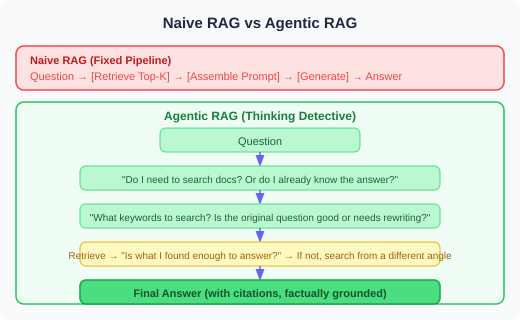
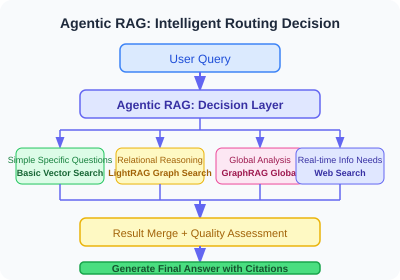

# 6.7 Advanced RAG: GraphRAG and Agentic RAG Engineering in Practice

> **Section Goal**: Go beyond the naive "retrieve → generate" pipeline and master two production-grade RAG architectures of 2025 — knowledge graph-augmented retrieval (GraphRAG) and agent-driven intelligent retrieval (Agentic RAG) — and apply them in real-world projects.

---

## Why Do We Need Advanced RAG?

The core problem with Naive RAG can be summarized in one sentence: **it treats every question as if it's a local question**.

> **Naive RAG's implicit assumption**: "Whatever the user wants to know must be in a few adjacent text chunks"
>
> **Real-world counterexamples**:
> - Q1: "Where do all departments' work intersect in this report?" → requires a global perspective
> - Q2: "What indirect partnerships exist between Company A and Company B?" → requires relational reasoning
> - Q3: "Why is the final conclusion X? Walk through the derivation step by step" → requires multi-hop retrieval

Two advanced architectures target these two types of problems respectively:

| Problem Type | Suitable Architecture | Core Idea |
|---|---|---|
| Global relations / cross-document reasoning | **GraphRAG** | Represent knowledge as a graph, retrieve via graph structure |
| Multi-hop / adaptive / uncertain problems | **Agentic RAG** | Agent dynamically decides retrieval strategy |

---

## Part 1: GraphRAG in Practice

### 1.1 Core Idea: From Text Chunks to Knowledge Graphs

GraphRAG's key insight: **text chunks preserve knowledge but lose relationships**.

> **Traditional vectorization**: "Apple acquired Shazam" → [0.23, -0.11, 0.87, ...]; "Shazam was bought by Google's competitor" → [0.21, -0.09, 0.85, ...] (the two vectors are close, but you don't know the inference chain that Apple = Google's competitor)
>
> **GraphRAG's graph representation**: Nodes: Apple, Shazam, Google; Edges: Apple --[acquired]--> Shazam; Apple --[competitor]--> Google (relationships stored explicitly, supporting graph traversal-based inference)

### 1.2 Two Retrieval Modes

GraphRAG offers two retrieval modes: Local and Global:

- **Local Search**: Suitable for specific questions ("What is Zhang San responsible for in the project?") → find the "Zhang San" node → traverse neighboring relationships → assemble relevant text
- **Global Search**: Suitable for holistic questions ("Who is the most central collaborative node in the entire project?") → Map-Reduce across all community summaries → comprehensive analysis

### 1.3 Quick Setup with Microsoft GraphRAG Library

```bash
# Install + Initialize
pip install graphrag
mkdir my_graphrag_project && cd my_graphrag_project
python -m graphrag init --root .
# Place .txt documents in input/, configure settings.yaml, then build the index
python -m graphrag index --root .   # 10-30 minutes (depending on document volume)
```

Key `settings.yaml` configuration (simplified version):

```yaml
llm:
  api_key: ${GRAPHRAG_API_KEY}
  model: gpt-4.1-mini         # Use mini during indexing to save cost
embeddings:
  llm:
    api_key: ${GRAPHRAG_API_KEY}
    model: text-embedding-3-small
chunks:
  size: 1200
  overlap: 100
```

```python
# Query: Local mode vs Global mode
import asyncio
from graphrag.query.cli import run_local_search, run_global_search

async def query_graphrag(question: str, mode: str = "local"):
    if mode == "local":
        return await run_local_search(root_dir=".", query=question)
    return await run_global_search(root_dir=".", query=question)

# Local question → local
asyncio.run(query_graphrag("When was GPT-4's Vision feature released?", "local"))
# Global question → global
asyncio.run(query_graphrag("What are the recurring core themes across these documents?", "global"))
```

> 💡 **Cost Estimate**: 1000 short documents (~500K tokens), `gpt-4.1-mini` ~$0.4-1, `text-embedding-3-small` ~$0.02.

### 1.4 LightRAG: A Lower-Cost Alternative

If GraphRAG's indexing cost is prohibitive, LightRAG is a more practical choice:

```bash
pip install lightrag-hku
```

```python
import asyncio
from lightrag import LightRAG, QueryParam
from lightrag.llm.openai import gpt_4o_mini_complete, openai_embedding

async def build_and_query(documents: list[str], question: str):
    rag = LightRAG(
        working_dir="./lightrag_data",
        llm_model_func=gpt_4o_mini_complete,
        embedding_func=openai_embedding,
    )
    for doc in documents:
        await rag.ainsert(doc)
    # Four query modes: naive (baseline comparison) / local (entity neighbors) / global (high-level concepts) / hybrid (recommended)
    return await rag.aquery(question, param=QueryParam(mode="hybrid"))
```

**LightRAG's core advantage**: Incremental updates — new documents don't require rebuilding the entire graph; just `await rag.ainsert(new_doc)`.

### 1.5 GraphRAG vs Traditional RAG: When to Choose Which?

```python
def choose_rag_strategy(use_case: dict) -> str:
    """Select RAG strategy based on use case."""
    if not use_case.get("global_questions") and use_case.get("kb_size_docs", 100) < 500:
        return "naive_rag"          # Sufficient; don't over-engineer
    if use_case.get("global_questions"):
        if use_case.get("budget_sensitive") or use_case.get("frequent_updates"):
            return "lightrag"       # Graph-enhanced + low cost + incremental updates
        return "graphrag"           # Microsoft official, highest quality
    return "hybrid"
```

| Scenario | Recommendation |
|---|---|
| FAQ Q&A (< 200 documents) | naive_rag |
| Enterprise knowledge base (> 5000 docs, occasional global questions) | lightrag (cost-sensitive) |
| Academic paper analysis (static corpus, requires relational reasoning) | graphrag |
| News monitoring system (daily updates) | lightrag (incremental updates) |

---

## Part 2: Agentic RAG in Practice

### 2.1 Core Idea: Let the Agent Control Retrieval Decisions

Naive RAG is a fixed pipeline: question in, answer out. Agentic RAG is a thinking detective — the Agent decides "whether to retrieve, what to search with, whether the results are sufficient, and if not, switch strategy".



### 2.2 Four Core Components

```python
# ── Component 1: Retrieval Decider ───────────────────────────────────────────
def should_retrieve(question: str, history: list[dict]) -> bool:
    """Determine whether the current question requires retrieval."""
    prompt = f"""Determine whether the following question requires consulting external documents.
[Not needed] Simple calculations, general knowledge, questions already answered in conversation history
[Needed] Involves specific domains / internal company information / time-sensitive data, requires precise data or citations
Conversation history: {json.dumps(history[-3:], ensure_ascii=False)}
Question: {question}
Reply only YES/NO."""
    resp = client.chat.completions.create(
        model="gpt-4.1-mini",         # Small model is sufficient for judgment
        messages=[{"role": "user", "content": prompt}],
        max_tokens=5, temperature=0
    )
    return resp.choices[0].message.content.strip().upper() == "YES"


# ── Component 2: Query Rewriter ───────────────────────────────────────────
def rewrite_query(question: str, context: str = "") -> list[str]:
    """Rewrite into 2-3 retrieval query variants more conducive to search."""
    prompt = f"""Rewrite the question into 2-3 retrieval query variants.
Requirements: Remove colloquial language, cover different aspects, one per line, no numbering.
Background: {context}
Question: {question}"""
    resp = client.chat.completions.create(
        model="gpt-4.1-mini",
        messages=[{"role": "user", "content": prompt}],
        max_tokens=200, temperature=0.3
    )
    return [q.strip() for q in resp.choices[0].message.content.split("\n") if q.strip()]


# ── Component 3: Retrieval Quality Evaluator ───────────────────────────────────────
def evaluate_retrieval(question: str, docs: list[str]) -> dict:
    """Evaluate whether retrieved documents are sufficient to answer the question, returning {relevance, sufficiency, missing}."""
    prompt = f"""Evaluate whether the retrieval results are sufficient to answer the question.
Question: {question}
Documents: {chr(10).join(docs[:5])}
Return JSON: {{"relevance": 0-10, "sufficiency": bool, "missing": "missing information"}}"""
    resp = client.chat.completions.create(
        model="gpt-4.1-mini",
        messages=[{"role": "user", "content": prompt}],
        response_format={"type": "json_object"}, max_tokens=200
    )
    return json.loads(resp.choices[0].message.content)


# ── Component 4: Answer Generator with Citations ───────────────────────────────────
def generate_with_citation(question: str, docs: list[dict]) -> dict:
    """Generate an answer with [number] citations based on retrieved documents."""
    docs_text = "\n".join(
        f"[{i}] {d['source']} p.{d.get('page','?')}\n{d['content']}"
        for i, d in enumerate(docs, 1)
    )
    prompt = f"""Answer the question based on the following reference documents.
Requirements: Use [number] for citations; clearly state when documents are insufficient; do not fabricate information.
{docs_text}
Question: {question}"""
    resp = client.chat.completions.create(
        model="gpt-4.1", messages=[{"role": "user", "content": prompt}], max_tokens=1000
    )
    return {
        "answer": resp.choices[0].message.content,
        "sources": [f"{d['source']} p.{d.get('page','?')}" for d in docs]
    }
```

> 📦 **Full code available in repository** `examples/chapter06/agentic_rag.py`, including streaming output, multi-source routing, and other extensions.

### 2.3 Orchestrating the Full Workflow with LangGraph

```python
from langgraph.graph import StateGraph, END
from typing import TypedDict, Annotated
import operator

class AgenticRAGState(TypedDict):
    question: str
    chat_history: list[dict]
    needs_retrieval: bool
    rewritten_queries: list[str]
    retrieved_docs: list[dict]
    retrieval_quality: dict
    retry_count: int
    final_answer: str
    sources: list[str]


def build_agentic_rag_graph():
    graph = StateGraph(AgenticRAGState)

    # 6 nodes
    graph.add_node("decide", lambda s: {**s, "needs_retrieval": should_retrieve(s["question"], s.get("chat_history", []))})
    graph.add_node("rewrite", lambda s: {**s, "rewritten_queries": rewrite_query(s["question"])})
    graph.add_node("retrieve", lambda s: {**s, "retrieved_docs": _do_retrieve(s)})  # Retrieve, merge, deduplicate
    graph.add_node("assess", lambda s: {**s, "retrieval_quality": evaluate_retrieval(s["question"], [d["content"] for d in s["retrieved_docs"]])})
    graph.add_node("generate", lambda s: {**s, **generate_with_citation(s["question"], s["retrieved_docs"])})
    graph.add_node("direct", lambda s: {**s, "final_answer": _direct_answer(s), "sources": []})

    # Conditional routing
    graph.set_entry_point("decide")
    graph.add_conditional_edges("decide",
        lambda s: "rewrite" if s["needs_retrieval"] else "direct",
        {"rewrite": "rewrite", "direct": "direct"})
    graph.add_edge("rewrite", "retrieve")
    graph.add_edge("retrieve", "assess")
    graph.add_conditional_edges("assess",
        # Quality sufficient or retried >= 2 times → generate; otherwise retry
        lambda s: "generate" if s.get("retrieval_quality", {}).get("sufficiency") or s.get("retry_count", 0) >= 2 else "rewrite",
        {"generate": "generate", "rewrite": "rewrite"})
    graph.add_edge("generate", END)
    graph.add_edge("direct", END)
    return graph.compile()
```

**Key Design Points**:
- **Retry limit must be set**: `retry_count >= 2` prevents certain questions from triggering infinite loops
- **Quality evaluation must be strict**: The evaluation prompt should explicitly define what counts as "sufficient" (must include specific numbers/dates/proper nouns, etc.)
- **Conditional routing vs fixed edges**: Core decision points (whether to retrieve, whether to retry) use conditional edges; everything else uses fixed edges

### 2.4 Key Production Configuration

| Configuration Item | Choice | Reason |
|---|---|---|
| Decision / Rewriting / Evaluation | `gpt-4.1-mini` | Structured tasks don't need the strongest model; saves cost |
| Final generation | `gpt-4.1` | Answer quality is critical; use a large model |
| Retry limit | `2` times | More than 2 means the question itself needs human intervention |
| Query variant count | 2-3 | Diminishing marginal returns beyond 3 |
| Retrieval top_k | 3-5 | More than 5 introduces noise |

**Multi-Source Routing** (full implementation in repository):

```python
# Idea: Route to different data sources based on question type
class MultiSourceRetriever:
    def route(self, question: str) -> list[str]:
        """Use LLM to determine which data sources to use: internal_docs / web_search / graph_rag / sql_database."""
        ...
    def search(self, question: str, queries: list[str]) -> list[dict]:
        sources = self.route(question)
        # Parallel calls to each data source + merge & deduplicate + re-rank
        ...
```

---

## Part 3: Comparison and Selection of the Two Architectures

### Core Differences

| Dimension | GraphRAG / LightRAG | Agentic RAG |
|---|---|---|
| **Suitable problem types** | Relational reasoning, global summarization | Multi-hop Q&A, uncertain problems |
| **Retrieval strategy** | Graph traversal + community summaries | Dynamic decision-making + multi-round retrieval |
| **Indexing cost** | High (requires pre-built knowledge graph) | Low (reuses standard vector indices) |
| **Latency** | Medium (graph traversal) | High (multiple LLM calls) |
| **Interpretability** | Strong (transparent graph structure) | Medium (decision chain traceable) |
| **Recommended scenarios** | Enterprise knowledge bases, document analysis | Customer service, research assistants, complex Q&A |

### Combined Use: The Strongest Architecture

In production environments, the two are often combined: first classify the question type, then route to the appropriate retrieval strategy.



```python
class HybridRAGSystem:
    """Agentic RAG + GraphRAG combined: route by question type."""
    async def query(self, question: str) -> dict:
        q_type = self._classify(question)   # relational / global / factual
        if q_type == "relational":
            docs = await self.lightrag.aquery(question, QueryParam(mode="hybrid"))
        elif q_type == "global":
            docs = await self.lightrag.aquery(question, QueryParam(mode="global"))
        else:   # factual
            docs = self.vector_store.search(rewrite_query(question))
        return generate_with_citation(question, docs)
```

---

## Common Errors and Debugging

| Error | Symptom | Solution |
|---|---|---|
| **GraphRAG index without token estimation** | Hit API quota halfway through | Test with 10-20 documents first, confirm costs |
| **Agentic RAG retrieval without limit** | Some questions retry infinitely | Set `retry_count >= 2` cutoff in `route_after_assessment` |
| **Wrong LightRAG mode selection** | Poor quality, improves after switching to "hybrid" | Default to "hybrid"; only use "naive" during debugging |
| **Retrieval evaluation too lenient** | All retrievals judged "sufficient" | Explicitly define "sufficient" criteria in the evaluation prompt |

---

## Summary

| Technology | Core Value | Production Ready |
|---|---|---|
| **GraphRAG** | Handles global relational problems, highest accuracy | ✅ Maintained by Microsoft |
| **LightRAG** | Lightweight GraphRAG alternative, supports incremental updates | ✅ Production-usable at low cost |
| **Agentic RAG** | Dynamic retrieval decisions, adapts to complex and varied problems | ✅ Requires LangGraph |
| **All three combined** | Covers all RAG scenarios | ⚠️ High complexity; combine as needed |

> 💡 **Further Reading**: For the three multimodal RAG architectures (text-first / multimodal embedding / native multimodal) and CLIP cross-modal retrieval, see [23.6 Video Understanding and Multimodal RAG](../chapter_25_multimodal/06_video_and_multimodal_rag.md).

## Exercises

1. **Hands-on**: Use LightRAG to build a knowledge graph from a local document set (at least 20 documents), query the same question with three modes — `local`, `global`, and `hybrid` — compare the quality differences in the answers, and write a brief analysis.

2. **Design**: An e-commerce company has three knowledge bases: product manuals (500 documents), historical customer service conversations (100K records), and a real-time inventory database. Design an Agentic RAG system explaining how to route different types of user queries.

3. **Debugging**: The following Agentic RAG code will never trigger retrieval for "What is the company's latest revenue?" Analyze the cause and fix it:

```python
def should_retrieve(question: str, history: list) -> bool:
    prompt = f"Does this question require consulting references? Reply only YES/NO: {question}"
    # Hint: the problem lies in the prompt's ambiguity
    ...
```

<details>
<summary>Reference Answer (Exercise 3)</summary>

The prompt is too brief and lacks explicit classification criteria for "when retrieval is / isn't needed." The model will tend to assume "the information may be in training data" → responds NO. It should be revised to:

```python
def should_retrieve(question: str, history: list) -> bool:
    prompt = f"""Determine whether the following question requires consulting external documents.
[Not needed] Simple calculations, general knowledge, questions already answered in conversation history
[Needed] Involves specific domains / internal company information / time-sensitive data, requires precise data or citation sources

Question: {question}

Reply only YES or NO."""
```

With explicit "needed" and "not needed" classification criteria, the model correctly recognizes that "latest company revenue" involves "internal company information" and "time-sensitive data," and should trigger retrieval.
</details>

4. **Advanced**: A common issue with GraphRAG when processing Chinese documents: entity extraction quality degrades (e.g., recognizing "腾讯公司" and "腾讯" as two different entities). Design a post-processing step to solve entity merging.

---

*Previous: [6.6 Paper Readings: RAG Frontiers](./06_paper_readings.md)*  
*Return to: [Chapter 6 Retrieval-Augmented Generation (RAG)](./README.md)*
