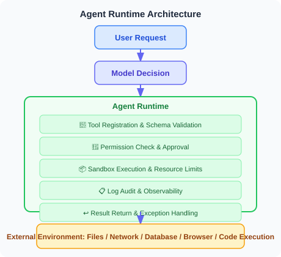

# 19.3 Permission Control and Sandbox Isolation

> **Section Objective**: Learn to design minimal permission systems and secure execution environments for Agents.

---

## Agent Runtime / Sandbox: Why Do We Need Runtime Boundaries?

The key difference between an Agent and a regular LLM application is that an Agent doesn't just generate text—it **calls tools, reads/writes files, accesses the network, executes code, and operates browsers**. Therefore, security boundaries cannot just be written into prompts; they must be enforced at the Runtime and Sandbox level.

Think of the Agent Runtime as the "operating system layer between the model and the real world":



An Agent without Runtime constraints is like connecting the model directly to production systems. Once the model is subjected to prompt injection, hallucinated tool calls, or misinterpreted tasks, the risks are amplified by tool invocation.

| Runtime Control Point | Purpose | Typical Implementation |
|-----------------------|---------|------------------------|
| **Tool Allowlist** | Only allow registered tools to be called | Tool registry / MCP server allowlist |
| **Schema Validation** | Intercept incorrect parameters and unauthorized fields | JSON Schema / Pydantic |
| **Permission Policy** | Determine who can do what | RBAC / ABAC / Policy Engine |
| **Sandbox Isolation** | Restrict code and browser access scope | Docker / Firecracker / E2B / VM |
| **Resource Limits** | Prevent runaway execution | timeout, CPU, memory, network, file size limits |
| **Human Approval** | Secondary confirmation for high-risk actions | Human-in-the-loop approval |
| **Audit Logs** | Post-hoc tracing and regression testing | Trace, tool log, artifact log |

The following subsections will implement the core mechanisms: least privilege, tool wrappers, and code execution sandbox.

---

## Principle of Least Privilege

An Agent should only have the minimum permissions needed to complete its task—just like a company shouldn't give every employee a master key.


```python
from enum import Flag, auto
from dataclasses import dataclass

class Permission(Flag):
    """Agent permission definitions"""
    NONE = 0
    READ_FILE = auto()       # Read files
    WRITE_FILE = auto()      # Write files
    EXECUTE_CODE = auto()    # Execute code
    NETWORK_ACCESS = auto()  # Network access
    DATABASE_READ = auto()   # Read from database
    DATABASE_WRITE = auto()  # Write to database
    SEND_EMAIL = auto()      # Send emails
    
    # Predefined permission sets
    READONLY = READ_FILE | DATABASE_READ
    STANDARD = READONLY | WRITE_FILE | NETWORK_ACCESS
    FULL = STANDARD | EXECUTE_CODE | DATABASE_WRITE | SEND_EMAIL


@dataclass
class PermissionPolicy:
    """Permission policy"""
    agent_name: str
    permissions: Permission
    allowed_paths: list[str] = None     # Allowed file paths
    allowed_domains: list[str] = None   # Allowed network domains
    max_file_size: int = 10 * 1024 * 1024  # Maximum file size (10MB)
    
    def check(self, action: str, resource: str = None) -> bool:
        """Check whether permission exists to perform an action"""
        perm_map = {
            "read_file": Permission.READ_FILE,
            "write_file": Permission.WRITE_FILE,
            "execute": Permission.EXECUTE_CODE,
            "http_request": Permission.NETWORK_ACCESS,
            "db_read": Permission.DATABASE_READ,
            "db_write": Permission.DATABASE_WRITE,
            "send_email": Permission.SEND_EMAIL,
        }
        
        required = perm_map.get(action)
        if required is None:
            return False
        
        if not (self.permissions & required):
            return False
        
        # Check resource-level permissions
        if action in ("read_file", "write_file") and resource:
            if self.allowed_paths:
                return any(
                    resource.startswith(p) for p in self.allowed_paths
                )
        
        if action == "http_request" and resource:
            if self.allowed_domains:
                from urllib.parse import urlparse
                domain = urlparse(resource).hostname
                return domain in self.allowed_domains
        
        return True


# Usage example
customer_service_policy = PermissionPolicy(
    agent_name="customer_service",
    permissions=Permission.READONLY | Permission.NETWORK_ACCESS,
    allowed_paths=["/data/faq/", "/data/products/"],
    allowed_domains=["api.internal.com"]
)

# Check permissions
print(customer_service_policy.check("read_file", "/data/faq/guide.md"))  # True
print(customer_service_policy.check("write_file", "/etc/passwd"))  # False
print(customer_service_policy.check("execute"))  # False
```

---

## Secure Tool Wrapper

Add security checks before and after tool execution:

```python
import functools

def secure_tool(policy: PermissionPolicy):
    """Secure tool decorator — adds permission checks to tools"""
    
    def decorator(func):
        @functools.wraps(func)
        def wrapper(*args, **kwargs):
            tool_name = func.__name__
            
            # Permission check
            action = _infer_action(tool_name)
            resource = kwargs.get("path") or kwargs.get("url")
            
            if not policy.check(action, resource):
                return {
                    "error": f"Insufficient permissions: {tool_name} requires {action} permission",
                    "allowed": False
                }
            
            # Execute the tool
            try:
                result = func(*args, **kwargs)
                
                # Record audit log
                _log_tool_execution(
                    agent=policy.agent_name,
                    tool=tool_name,
                    args=kwargs,
                    success=True
                )
                
                return result
                
            except Exception as e:
                _log_tool_execution(
                    agent=policy.agent_name,
                    tool=tool_name,
                    args=kwargs,
                    success=False,
                    error=str(e)
                )
                raise
        
        return wrapper
    return decorator


def _infer_action(tool_name: str) -> str:
    """Infer required permission from tool name"""
    action_keywords = {
        "read": "read_file",
        "write": "write_file",
        "save": "write_file",
        "execute": "execute",
        "run": "execute",
        "fetch": "http_request",
        "search": "http_request",
        "query": "db_read",
        "insert": "db_write",
        "delete": "db_write",
        "email": "send_email",
    }
    
    for keyword, action in action_keywords.items():
        if keyword in tool_name.lower():
            return action
    
    return "unknown"


def _log_tool_execution(**kwargs):
    """Record tool execution log (simplified version)"""
    import json, datetime
    log_entry = {
        "timestamp": datetime.datetime.now().isoformat(),
        **kwargs
    }
    print(f"[AUDIT] {json.dumps(log_entry, ensure_ascii=False)}")
```

---

## Code Execution Sandbox

If an Agent needs to execute code, it must run in an isolated environment:

```python
import subprocess
import tempfile
import os

class CodeSandbox:
    """Code execution sandbox"""
    
    def __init__(
        self,
        timeout: int = 10,
        max_memory_mb: int = 256,
        allowed_imports: list[str] = None
    ):
        self.timeout = timeout
        self.max_memory_mb = max_memory_mb
        self.allowed_imports = allowed_imports or [
            "math", "json", "datetime", "re",
            "collections", "itertools", "functools",
            "statistics", "random", "string"
        ]
    
    def validate_code(self, code: str) -> tuple[bool, str]:
        """Validate code safety before execution"""
        import ast
        
        try:
            tree = ast.parse(code)
        except SyntaxError as e:
            return False, f"Syntax error: {e}"
        
        # Check for dangerous operations
        dangerous_calls = {
            "eval", "exec", "compile",
            "__import__", "globals", "locals",
            "getattr", "setattr", "delattr",
        }
        
        dangerous_modules = {
            "os", "sys", "subprocess", "shutil",
            "socket", "http", "urllib",
        }
        
        for node in ast.walk(tree):
            # Check function calls
            if isinstance(node, ast.Call):
                if isinstance(node.func, ast.Name):
                    if node.func.id in dangerous_calls:
                        return False, f"Prohibited call: {node.func.id}()"
            
            # Check imports
            if isinstance(node, ast.Import):
                for alias in node.names:
                    module_name = alias.name.split(".")[0]
                    if module_name in dangerous_modules:
                        return False, f"Prohibited import: {module_name}"
                    if (self.allowed_imports and 
                        module_name not in self.allowed_imports):
                        return False, f"Not in allowlist: {module_name}"
            
            if isinstance(node, ast.ImportFrom):
                if node.module:
                    module_name = node.module.split(".")[0]
                    if module_name in dangerous_modules:
                        return False, f"Prohibited import: {module_name}"
        
        return True, "Code validation passed"
    
    def execute(self, code: str) -> dict:
        """Execute code in the sandbox"""
        
        # Validate first
        is_safe, message = self.validate_code(code)
        if not is_safe:
            return {
                "success": False,
                "error": message,
                "output": ""
            }
        
        # Create temporary file
        with tempfile.NamedTemporaryFile(
            mode='w', suffix='.py', delete=False
        ) as f:
            f.write(code)
            temp_path = f.name
        
        try:
            # Execute in subprocess (with resource limits)
            result = subprocess.run(
                ["python3", temp_path],
                capture_output=True,
                text=True,
                timeout=self.timeout,
                env={
                    "PATH": "/usr/bin:/usr/local/bin",
                    "HOME": tempfile.gettempdir(),
                }
            )
            
            return {
                "success": result.returncode == 0,
                "output": result.stdout,
                "error": result.stderr if result.returncode != 0 else "",
            }
            
        except subprocess.TimeoutExpired:
            return {
                "success": False,
                "error": f"Execution timed out ({self.timeout} seconds)",
                "output": ""
            }
        finally:
            os.unlink(temp_path)


# Usage example
sandbox = CodeSandbox(timeout=5)

# Safe code
result = sandbox.execute("""
import math
print(f"Pi = {math.pi:.10f}")
print(f"Square root of 2 = {math.sqrt(2):.10f}")
""")
print(result)  # {"success": True, "output": "Pi = ...\n", "error": ""}

# Dangerous code will be intercepted
result = sandbox.execute("""
import os
os.system("rm -rf /")
""")
print(result)  # {"success": False, "error": "Prohibited import: os", "output": ""}
```

### Additional Requirements for Production-Grade Sandboxes

The `CodeSandbox` above is suitable for educational and prototype validation, but production environments cannot rely solely on Python process isolation. A more reliable approach is to place each task in an independent runtime environment:

| Sandbox Solution | Use Case | Advantages | Considerations |
|-----------------|----------|------------|----------------|
| **Docker Container** | Code execution, file processing, CI tasks | Mature, reproducible, rich ecosystem | Must disable privileged mode, restrict mount directories |
| **Firecracker / microVM** | Multi-tenant high-risk tasks | Strong isolation, fast startup | Higher operational complexity |
| **E2B / Code Interpreter Sandbox** | Agent code execution | Purpose-built for Agents, API-friendly | Cost and vendor lock-in |
| **Browser Sandbox** | Web Agent / Browser Use | Can restrict domains, downloads, and form submissions | Must prevent indirect prompt injection |
| **Full VM** | GUI / Computer Use | Strongest isolation, supports desktop environments | Slow startup, high cost |

A production-grade Agent Runtime should also support three additional capabilities:

1. **Snapshot & Rollback**: Save an environment snapshot before a task starts, and restore it on failure or privilege escalation.
2. **Network Egress Control**: Only allow access to allowlisted domains to prevent data exfiltration.
3. **Artifact Isolation**: Store generated files, downloaded files, and logs in separate partitions to avoid contaminating the host machine.

For Browser Use, Computer Use, and code execution Agents, sandboxing is not a "nice-to-have"—it is the minimum requirement before going live.

---

## Summary

| Concept | Description |
|---------|-------------|
| Agent Runtime | The runtime control layer between the model and the external environment |
| Least Privilege | The Agent only has the minimum permissions needed to complete its task |
| Permission Policy | Defines allowed operations and accessible resources |
| Secure Wrapper | Adds permission checks and audit logging before and after tool execution |
| Code Sandbox | Executes untrusted code in an isolated environment |
| Code Validation | Checks for dangerous operations via AST analysis before execution |
| Production-Grade Sandbox | Docker, microVM, E2B, browser sandbox, or full VM |

> **Next Section Preview**: Agents may have access to users' sensitive data—how do we protect that data?

---

[19.4 Sensitive Data Protection](./04_data_protection.md)