# 11.1 Automatic Prompt Optimization: From Manual Prompt Engineering to Self-Evolving Agents

> 🧬 *"A good Prompt is not written in one sitting — it evolves continuously through tasks, feedback, failures, and reflection. The future Agent won't just answer questions; it will observe its own failures, modify how it works, and distill successful patterns into reusable assets."*

In previous chapters, we learned about how LLMs work, Prompt Engineering, common prompting strategies, model API calls, model parameters, and SFT/RL training data preparation.

These methods help us write better Prompts, but in real Agent systems, the problems become more complex:

- An Agent often doesn't use a single Prompt, but a collection of Prompts.
- Planning, retrieval, tool selection, code execution, verification, summarization, memory, and safety policies may each have their own Prompt.
- Modifying one Prompt may affect other modules.
- Manually tuning Prompts relies on a few experts' experience — it's inefficient, hard to reproduce, and doesn't scale.
- If you use reinforcement learning to modify model weights, you need extensive rollouts, training infrastructure, and cost.

Thus, a new direction emerged: **Automatic Prompt Optimization (APO)**.

> 📌 **Connecting to Section 2.3**: The end of [2.3 Prompting Strategies](./03_prompting_strategies.md) provided a conceptual preview of APO. This section is its full expansion — systematically mapping out the method lineage, GEPA's reflective evolution, feedback function design, and overfitting prevention.

It aims to solve a very direct problem:

> Can we let the system itself run tasks, discover failures, read feedback, reflect on causes, rewrite Prompts, and retain better versions?

This section is not an introduction to a single paper, but a comprehensive survey of this entire direction. We'll start from the easiest-to-understand examples and progressively cover:

- Why we need automatic Prompt optimization.
- How automatic Prompt optimization differs from reinforcement learning.
- What problems APE, OPRO, ProTeGi, TextGrad, DSPy/MIPROv2, EvoPrompt, PromptBreeder, Trace, and other methods each solve.
- Why GEPA is an integrative representative of this direction.
- How Prompt evolution and Skill evolution are related.
- How to implement this in real Agent projects.

### How Should You Read This Section?

This section is relatively long because automatic Prompt optimization is not a single point technique, but an entire engineering methodology for "letting the system improve itself based on feedback." To reduce the learning curve, you can read it at three levels:

| Reading Level | Focus On First | Don't Worry About Yet |
|----------|------------|----------------------|
| **First Pass: Intuition** | Automatic Prompt optimization is "letting the system review its own mistakes and revise its instruction manual" | Subtle algorithmic differences between papers |
| **Second Pass: Mechanism** | What roles do feedback, traces, candidate generation, evaluation, and selection each play | Implementation optimization details |
| **Third Pass: Engineering** | How to record traces, design evaluations, and control risks in real Agents | Experiment details for each benchmark |

If you're new to this direction, start by grasping one sentence:

> **Automatic Prompt optimization is not about making models magically smarter — it's about automating the process of "discover problems → summarize causes → modify prompts → validate again."**

All the methods that follow basically answer four questions:

```text
1. How do we discover that a Prompt is bad?
2. How do we know why it's bad?
3. How do we generate a potentially better Prompt?
4. How do we judge whether the new Prompt is actually better?
```

---

## 11.1.1 Understanding Automatic Prompt Optimization Through a Real-Life Analogy

Think of a Prompt as the "instructions for problem-solving" a teacher gives to students.

For example, a teacher assigns students a reading comprehension task and initially writes just one sentence:

```text
Please read the passage and answer the questions.
```

Students frequently get answers wrong. After reviewing several mistakes, the teacher notices:

- Students often fail to cite the original text.
- Students tend to treat their own guesses as answers.
- If the question asks about time, students ignore the year.

So the teacher revises the instructions to:

```text
First, find sentences in the passage that directly support your answer.
If the question involves time or a year, prioritize finding sentences that contain the same time or year.
When answering, only use information supported by the original text — do not guess.
```

This is one round of manual Prompt optimization.

What automatic Prompt optimization does is let the system complete a similar process automatically:

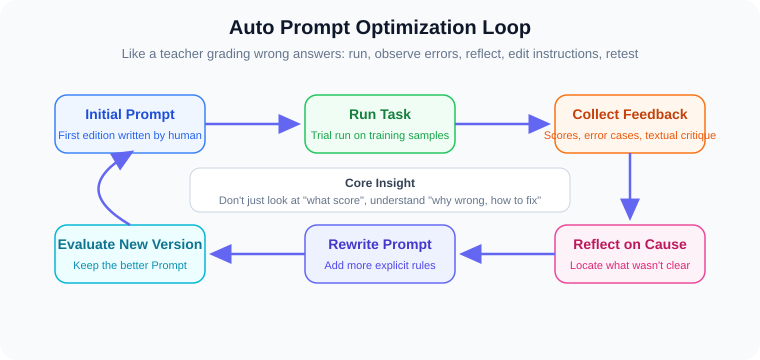

If this process can loop automatically, Prompts are no longer fixed text written once and forgotten — they become continuously improvable "textual parameters."

### A Running Example Throughout This Section: A Customer Service Q&A Agent

To make the concepts that follow easier to understand, let's first set up a very small Agent. It handles user questions about refund policies.

Initially it has only a very simple Prompt:

```text
You are a customer service assistant. Answer user questions based on the knowledge base.
```

A user asks:

```text
I signed for my headphones 20 days ago — can I still get a refund?
```

The knowledge base has two rules:

```text
Rule A: Regular products support 7-day unconditional refunds after signing.
Rule B: Products with quality issues support after-sales service within 30 days after signing.
```

The Agent's incorrect response:

```text
You can get a refund, because after-sales service is available within 30 days.
```

What's wrong with this answer?

- The user didn't mention any quality issues with the headphones.
- The Agent confused "after-sales" with "refund."
- The Agent didn't distinguish between "unconditional refund" and "quality issue after-sales."

If we only give the system a score:

```text
score = 0
```

The system only knows "it's wrong," but doesn't know how to fix it.

If we give it a text feedback:

```text
Incorrect answer. The user only mentioned 20 days since signing, with no quality issue evidence.
The current Prompt didn't require distinguishing between "unconditional refund" and "quality issue after-sales."
Suggestion: Add a rule — only apply the 30-day after-sales rule when the user explicitly mentions quality issues; otherwise use the 7-day unconditional refund rule.
```

The system can then modify the Prompt to:

```text
You are a customer service assistant. Answer user questions based on the knowledge base.
Before answering, first determine whether the user is asking about "unconditional refund" or "quality issue after-sales."
If the user hasn't explicitly mentioned quality issues, don't apply the quality issue after-sales rule.
If multiple rules seem relevant, prioritize rules whose conditions exactly match the user's description.
```

This is the core intuition behind automatic Prompt optimization:

> **Use specific failure cases to generate specific feedback, then convert that feedback into clearer Prompt rules.**

The methods introduced later — APE, OPRO, ProTeGi, TextGrad, GEPA — vary in complexity, but they can all be understood within this small example.

---

## 11.1.2 Why Is Manual Prompt Tuning No Longer Enough?

For simple tasks, manually written Prompts are usually sufficient. For example:

```text
Please translate the following passage into English.
```

But real Agent systems are often multi-module systems. Take a document Q&A Agent as an example:

| Module | What the Prompt Handles | Common Failure Modes |
|------|------------------|--------------|
| **Query Analyzer** | Understand what the user actually wants to ask | Intent misjudgment, ignoring hidden conditions |
| **Retriever** | Generate search terms, find relevant documents | Retrieving irrelevant documents, missing key documents |
| **Reader** | Extract evidence from documents | Missing key sentences, citing weak evidence |
| **Reasoner** | Combine multiple pieces of evidence into an answer | Making inferences without evidential support |
| **Tool Selector** | Decide whether to call search, calculator, code executor, etc. | Selecting the wrong tool, or not using a tool when needed |
| **Verifier** | Check whether the answer is reliable | Failing to detect hallucinations or format errors |
| **Formatter** | Output JSON, reports, citation formats | Breaking schema, mixing in unnecessary explanations |
| **Safety Module** | Block unsafe requests | Rules too loose or too strict |

If the final answer is wrong, which Prompt should we modify?

- Is the retrieval Prompt too broad?
- Does the reading Prompt fail to require citation of evidence?
- Does the reasoning Prompt allow the model to guess?
- Did the verification Prompt fail to catch the error?
- Or did the formatter Prompt break the structured output?

Human experts can review the execution process to judge, but this is slow. The more complex the system, the more Prompts there are, and the higher the manual maintenance cost.

Therefore, the goal of automatic Prompt optimization is not to replace all human judgment, but to engineer, automate, and make reproducible the process of "reviewing failures, finding causes, modifying Prompts, and re-validating."

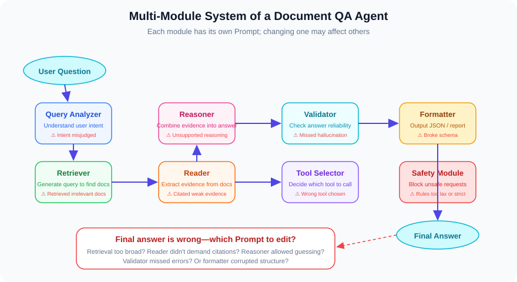

---

## 11.1.3 What Exactly Does Automatic Prompt Optimization Optimize?

In neural network training, we optimize model weights. Weights are numbers, so we can use gradient descent to update them.

In automatic Prompt optimization, we optimize Prompt text. Prompts are natural language — they can't be differentiated like numbers, but they can still be improved through feedback.

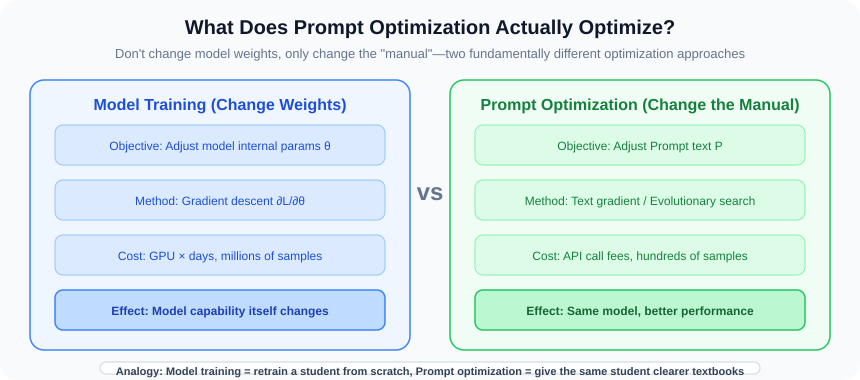

Let's compare the two:

| Aspect | Model Training / Reinforcement Learning | Automatic Prompt Optimization |
|------|-------------------|----------------|
| Optimization Target | Model weights or policy parameters | Prompts, instructions, few-shot examples |
| Modifies Model? | Usually yes | Usually no |
| Feedback Form | Scalar rewards, preference data, loss | Scores, text feedback, execution traces |
| Cost | Usually high | Usually achievable at the application layer |
| Interpretability | Weight changes are hard to interpret | Prompt diffs are human-readable |
| Suitable Scenarios | Deep capability training, new policy learning | Application-layer behavior, format, tool usage, workflow constraints |

A minimal automatic Prompt optimization loop looks like this:

```text
Initial Prompt
   ↓
Run the system on training tasks
   ↓
Collect outputs, scores, error cases, and execution traces
   ↓
Have an LLM or evaluator write natural language feedback
   ↓
Rewrite the Prompt based on feedback
   ↓
Evaluate the new Prompt
   ↓
Retain the better-performing version
   ↓
Repeat
```

If we break this loop apart, there are actually four roles inside:

| Role | What It Does | Analogy |
|------|----------|------|
| **Executor** | Completes tasks following the current Prompt | A student solving problems |
| **Evaluator** | Judges whether answers are good, provides scores and feedback | A teacher grading homework |
| **Rewriter** | Modifies the Prompt based on feedback | A teacher revising the lesson plan |
| **Selector** | Decides which Prompt version to keep | A curriculum committee selecting new teaching materials |


These four roles can be played by the same LLM or by different components. For example:

- The executor uses a cheap, small model.
- The evaluator uses rules, unit tests, or human annotations.
- The rewriter uses a stronger model.
- The selector uses validation set scores, cost, latency, and safety checks together.

So automatic Prompt optimization is not "let a model randomly change Prompts." More precisely, it is a constrained engineering pipeline:

```text
Execute → Observe → Explain → Modify → Validate → Select
```

The most critical insight here is:

> **Don't just compress feedback into a number — always retain language explanations.**

For example, both of the following feedbacks indicate a wrong answer, but they carry vastly different amounts of information:

```text
Score: 0
```

versus:

```text
Incorrect answer. The model cited Document A, but the evidence actually supporting the answer is in Document C.
The question asked about a 2021 acquisition event, but the model used a 2019 investment event.
The Prompt should require the model to prioritize evidence sentences that explicitly match the target year.
```

The second type of feedback is more like a teacher grading homework. It not only tells you it's wrong, but tells you why it's wrong and how to fix it.

---

## 11.1.4 The Development Trajectory of This Direction

Automatic Prompt optimization didn't appear suddenly. It roughly went through the following stages of development:


Below we introduce the methods by type.

### From a Survey Perspective: What Is This Direction Actually Studying?

If we look beyond individual papers at the entire direction, automatic Prompt optimization can roughly be broken into four questions:

| Research Question | What It Tries to Solve | Representative Methods |
|----------|------------|----------|
| **Who writes the Prompt?** | Moving from manual Prompt writing to having LLMs automatically generate candidate Prompts | `APE` |
| **How to judge if a Prompt is good?** | Moving from only looking at final scores to combining validation sets, text feedback, and execution traces | `OPRO`, `ProTeGi`, `TextGrad` |
| **How to search for better Prompts?** | Moving from single rewrites to beam search, Bayesian optimization, genetic evolution, Pareto selection | `MIPROv2`, `EvoPrompt`, `PromptBreeder`, `GEPA` |
| **How to make Agents stronger long-term?** | Moving from only changing Prompts to further distilling experience, code, and skill libraries | `Reflexion`, `Voyager`, `ExpeL`, `SkillRL`, `SkillX` |

So `GEPA` didn't appear in isolation. It's more like a combination of several earlier lines:

```text
Text feedback ideas: from ProTeGi / TextGrad
Evolutionary search ideas: from EvoPrompt / PromptBreeder
Multi-module system ideas: from DSPy / Trace
Long-term experience accumulation ideas: adjacent to Skill directions like Reflexion / ExpeL / Voyager
```

In other words, the focus of this section is not "how to use GEPA this one method," but understanding a larger trend:

> **Agent systems are moving from manual parameter tuning toward automatic improvement based on feedback, traces, reflection, and skill libraries.**

---

## 11.1.5 Category 1: Automatically Generating Prompts

### APE (ICLR 2023): Letting LLMs Automatically Write Prompts

The full name of **APE** is *Large Language Models Are Human-Level Prompt Engineers*.

> 📄 **Publication Info**: Zhou et al., **ICLR 2023** | arXiv: [2211.01910](https://arxiv.org/abs/2211.01910)

Its idea is simple: since LLMs are good at writing text, can LLMs write Prompts for tasks themselves?


*▲ APE original paper Figure (Source: Zhou et al., ICLR 2023, arXiv:2211.01910)*

The process roughly goes:

```text
Give an LLM some input-output examples
   ↓
Have the LLM guess the task instruction behind these examples
   ↓
Generate many candidate Prompts
   ↓
Test on a validation set
   ↓
Select the highest-scoring Prompt
```

For example, give the model a few examples:

```text
Input: I love this movie.
Output: positive

Input: This is terrible.
Output: negative
```

The model might generate multiple candidate Prompts:

```text
Candidate 1: Determine whether the sentiment of the following sentence is positive or negative.
Candidate 2: Analyze the sentiment of the text and output positive or negative.
Candidate 3: Read the following sentence and determine whether the speaker's attitude is positive or negative.
```

Then test these three candidates on a validation set and keep the one with the highest score.

#### Understanding APE Through the Customer Service Example

Returning to our customer service Q&A Agent. If we use APE to optimize it, the process is:

```text
1. Prepare a batch of "question → correct answer" examples:

   "Can I get a refund if signed 7 days ago?" → "Yes, regular products support 7-day unconditional refund."
   "Can I get a refund if signed 20 days ago?" → "No, exceeding the 7-day unconditional refund window."
   "Can I return headphones with static noise?" → "You can apply for after-sales; quality issues are handled within 30 days."

2. Have the LLM guess the instructions behind these examples and generate candidate Prompts.

3. Test each candidate Prompt on more customer service questions.

4. Keep the highest-scoring version.
```

APE might generate candidates like:

```text
Candidate A: You are a customer service assistant. Answer refund-related questions based on the knowledge base. Pay attention to distinguishing between unconditional refunds and quality issue after-sales.
Candidate B: Answer user questions based on the following rules: 7-day unconditional refund, 30-day quality issue after-sales.
```

We can see that APE already helps us write decent Prompts from scratch. But it stops there — if Candidate A still fails on certain questions, APE won't analyze why it failed, nor will it make targeted modifications.

#### Limitations of APE

| Limitation | Description |
|------|------|
| **Single-stage** | After generating candidates, it only filters once — no iterative improvement |
| **Only looks at scores** | Doesn't know why a certain Prompt scored low |
| **Doesn't analyze process** | Doesn't care whether the model's intermediate reasoning is sound |
| **Candidate quality is not controllable** | LLM may generate Prompts that sound reasonable but are actually ineffective |

These limitations are exactly what subsequent methods address. OPRO adds iteration, ProTeGi adds text feedback, and GEPA further adds trace reflection and evolutionary search.

---

## 11.1.6 Category 2: Using LLMs as Optimizers

### OPRO (ICLR 2024): Writing Historical Candidates and Scores into the Prompt

The full name of **OPRO** is *Large Language Models as Optimizers*.

> 📄 **Publication Info**: Yang et al. (Google DeepMind), **ICLR 2024** | arXiv: [2309.03409](https://arxiv.org/abs/2309.03409)

Its core idea: treat the LLM as an optimizer.


*▲ OPRO original paper Figure (Source: Yang et al., ICLR 2024, arXiv:2309.03409)*

The approach writes historical attempts into a meta-prompt, letting the LLM observe "what works and what doesn't," then propose new candidates:

```text
You are a Prompt optimizer. Below are previous attempts and their corresponding scores:

Candidate Prompt A: "Please answer the user's question." → Score 62
Candidate Prompt B: "Please answer based on the provided materials." → Score 70
Candidate Prompt C: "Please answer based only on the provided materials; do not fabricate." → Score 68

Higher scores are better. Based on the historical results above, propose a new Prompt that might score higher.
```

The LLM will observe that B outperforms A, suggesting the "based on materials" constraint is effective; C is slightly lower than B, suggesting the "do not fabricate" wording may be too strict or awkwardly phrased. So it might generate:

```text
Candidate Prompt D: "Please answer based on the provided materials. If the materials lack relevant information, state that you cannot determine."
```

This process can iterate: each round appends new candidates and scores to history, letting the LLM continue optimizing.

#### Understanding OPRO Through the Customer Service Example

If we use OPRO to optimize the customer service Agent:

```text
Round 1:
  Candidate A: "You are a customer service assistant. Answer user questions based on the knowledge base." → Score 55

Round 2:
  Candidate B: "You are a customer service assistant. Answer user questions based on the knowledge base. Pay attention to distinguishing between different rules." → Score 63

Round 3:
  Candidate C: "You are a customer service assistant. Before answering, determine whether the user is asking about refunds or after-sales, then select the corresponding rule." → Score 72

Round 4:
  Candidate D: "You are a customer service assistant. Before answering, first determine the user's inquiry type (unconditional refund or quality issue after-sales),
           then select the matching rule. Do not confuse different types of rules." → Score 78
```

OPRO's strengths are simplicity, generality, and not requiring model training. It shows us: **LLMs can do black-box optimization based on "candidates + scores."**

But its weakness is also clear: if it only sees scores, the LLM doesn't know where the error occurred. It knows B is better than A, but doesn't know why A was wrong. It's like a student who only sees their exam score without seeing which problems they got wrong — though they can slowly figure it out, it's not efficient.

#### APE → OPRO: Progress and Shortcomings

| Comparison | APE | OPRO |
|------|-----|------|
| **Iteration** | Single-stage, only filters after generation | Multi-round iteration, continuously improving |
| **Historical information** | Only looks at validation set scores | Writes historical candidates and scores into meta-prompt |
| **Optimization direction** | Relies on random generation | Relies on LLM observing score trends |
| **Still lacking** | Doesn't analyze failure causes | Also doesn't analyze failure causes |

OPRO adds iteration compared to APE, but still only looks at scores. The natural next step: can we not only look at scores but also tell the LLM "where you went wrong"? This is what ProTeGi does.

---

## 11.1.7 Category 3: Text Feedback-Driven Prompt Optimization

### ProTeGi (EMNLP 2023): A Text-Based Version of "Gradient Descent"

The full name of **ProTeGi** is *Automatic Prompt Optimization with "Gradient Descent" and Beam Search*.

> 📄 **Publication Info**: Pryzant et al. (Microsoft), **EMNLP 2023** | arXiv: [2305.03495](https://arxiv.org/abs/2305.03495)

It is one of the most important intellectual sources for GEPA.

We know that neural networks can be optimized with gradient descent because parameters are continuous numbers. But a Prompt is a piece of natural language — you can't compute a numerical gradient.

ProTeGi proposes a very vivid idea:

> Can we use natural language criticism as a "textual gradient"?


Below is a complete example from the ProTeGi paper: starting from an initial Prompt, generating natural language "gradients" for error cases, rewriting new Prompts accordingly, and finally selecting with a bandit strategy.


*▲ ProTeGi original paper Figure 1 (Source: Pryzant et al., EMNLP 2023, arXiv:2305.03495)*

Its process is as follows:

```text
Run the current Prompt on a batch of training samples
   ↓
Find the samples that were answered incorrectly
   ↓
Have the LLM criticize what the current Prompt didn't make clear
   ↓
This criticism is the "textual gradient"
   ↓
Have the LLM rewrite the Prompt in the opposite direction of the criticism
   ↓
Generate multiple candidate Prompts
   ↓
Use beam search and bandit strategies to retain more promising candidates
   ↓
Continue iterating
```

For example, the current Prompt is:

```text
Please answer the user's question.
```

Error cases show the model frequently makes up answers. The "textual gradient" written by the LLM might be:

```text
The current Prompt doesn't require the model to distinguish between known and unknown information.
It also doesn't require the model to refuse answering when evidence is insufficient.
```

So the new Prompt might become:

```text
Please answer based only on the provided materials.
If the materials lack sufficient evidence, please explicitly state that you cannot determine — do not fabricate.
```

ProTeGi's value lies in turning "criticism" into an actionable optimization signal.

#### Understanding ProTeGi Through the Customer Service Example

When using ProTeGi to optimize the customer service Agent, the process is more granular:

```text
Step 1: Run the current Prompt on a batch of customer service questions

Step 2: Find the questions that were answered incorrectly

  Question: "Can I get a refund if signed 20 days ago?"
  Model answer: "You can get a refund; after-sales is available within 30 days."
  Reference answer: "No refund; exceeding the 7-day unconditional refund window."

Step 3: Have the LLM criticize the current Prompt

  "The current Prompt doesn't require distinguishing between 'unconditional refund' and 'quality issue after-sales.'
   The model mixed the two rules together, using the after-sales rule upon seeing '30 days.'
   It should require first determining the user's inquiry type."

Step 4: This criticism is the "textual gradient"

Step 5: Have the LLM rewrite the Prompt against the direction of the criticism

  New Prompt: "You are a customer service assistant. Before answering, first determine whether the user is asking about
  'unconditional refund' or 'quality issue after-sales,' then select the corresponding rule."

Step 6: Test the new Prompt on more questions

Step 7: Use beam search to retain the best-performing candidates and continue iterating
```

#### What Is Beam Search?

ProTeGi doesn't generate just one candidate Prompt but many. It then uses a beam search strategy to progressively narrow down:

```text
Round 1: Generate 5 candidates → Test → Retain the 3 highest-scoring
Round 2: Generate variations from the 3 candidates → Get ~15 → Test → Retain the best 3
Round 3: Continue variation → Continue filtering ...
```

This is like not just calculating one move ahead in chess, but considering multiple paths simultaneously and keeping the most promising ones for further exploration.

#### The Analogy Between "Textual Gradient" and Numerical Gradient

| Analogy | Numerical Gradient | Textual Gradient |
|------|----------|----------|
| **Form** | A vector indicating which direction parameters should move | A piece of text indicating what the Prompt didn't make clear |
| **Direction** | Negative gradient direction = direction parameters should decrease | Criticism = direction the Prompt should be corrected |
| **Step size** | Learning rate controls how much to adjust | The LLM's rewriting intensity controls how much to change |
| **Iteration** | Gradient descent repeatedly updates parameters | Repeatedly criticize and rewrite the Prompt |

ProTeGi proved that: although Prompts aren't numbers, as long as you can articulate "what went wrong" in words, you can perform gradient-descent-like optimization.

It is very closely related to GEPA:

| Comparison Point | ProTeGi | GEPA |
|--------|---------|------|
| Optimization target | Mainly a single Prompt | Can be multiple Prompts across a multi-module AI system |
| Feedback source | Error samples and text criticism | Execution traces, scores, evaluator text feedback |
| Candidate selection | Beam search, favoring high-score candidates | Pareto frontier, retaining complementary candidates |
| Focus | Textual gradient | Trace reflection + evolutionary search |

You can think of GEPA as: building on ProTeGi's "textual gradient" idea, additionally incorporating multi-module traces, evolutionary search, and Pareto selection.

### TextGrad (Nature 2025): Propagating Text Feedback Like Automatic Differentiation

The full name of **TextGrad** is *TextGrad: Automatic "Differentiation" via Text*.

> 📄 **Publication Info**: Yuksekgonul et al. (Stanford), arXiv preprint 2024, formally published as *Optimizing generative AI by backpropagating language model feedback* in **Nature 2025** (vol. 639, pp. 609–616) | arXiv: [2406.07496](https://arxiv.org/abs/2406.07496)

Its idea is more abstract: since PyTorch can backpropagate numerical gradients along a computation graph, can we organize text feedback into a similar form of "backpropagation"?

In TextGrad, the optimization target isn't necessarily just a Prompt — it can also be:

- An intermediate answer.
- A piece of explanation.
- A tool-calling plan.
- A multi-step reasoning chain.
- Multiple text variables across a system.

It treats each text variable as optimizable, then propagates evaluation feedback backward through the system structure.


The figure below is the overview from the TextGrad paper: top-left (a) is numerical gradient backpropagation in neural networks, top-right (b) applies the same idea to "black-box AI systems + natural language gradients," and bottom (c)–(g) show applications in molecular design, code, radiotherapy planning, and Prompt optimization.


*▲ TextGrad original paper Figure 1 (Source: Yuksekgonul et al., arXiv:2406.07496; formally published in Nature 2025, 639:609–616)*

#### Understanding TextGrad's "Backpropagation" Through an Example

Suppose we have a two-step reasoning system:

```text
Step 1: Generate a preliminary answer (text variable A)
Step 2: Write the final report based on the preliminary answer (text variable B)
```

The evaluator gives feedback on the final report:

```text
The data analysis in the final report is incorrect because the preliminary answer mixed up two sets of data.
```

TextGrad would "backpropagate" this feedback to text variable A:

```text
Feedback for variable B: Report data is mixed up.
Feedback for variable A: Preliminary answer mixed up two sets of data; they should be processed separately.
```

Then use these feedbacks to modify A and B respectively:

```text
A's new version: Clearly distinguish the two sets of data and list them separately.
B's new version: Reorganize the report based on the corrected preliminary answer.
```

This is very similar to PyTorch's automatic differentiation, except the gradients change from "numerical vectors" to "natural language criticism."

| Analogy | PyTorch | TextGrad |
|------|---------|----------|
| **Computation graph** | Forward pass produces numbers | Forward pass produces text |
| **Backpropagation** | Chain rule computes numerical gradients | LLM generates text feedback along dependency relationships |
| **Update** | Parameters ← Parameters - lr × gradient | Text ← LLM rewrites text based on feedback |
| **Optimization targets** | Weights, biases | Prompts, intermediate answers, reasoning chains, plans, etc. |

The commonality between TextGrad and GEPA is: both believe natural language can carry optimization signals.

The difference is:

- TextGrad is more like a general framework, emphasizing "textual automatic differentiation."
- GEPA is more focused on Prompt optimization, emphasizing "trace reflection + evolutionary selection."

---

## 11.1.8 Category 4: Evolutionary Algorithms for Prompt Search

### EvoPrompt (ICLR 2024): Applying Genetic Algorithms to Prompts

The full name of **EvoPrompt** is *Connecting Large Language Models with Evolutionary Algorithms Yields Powerful Prompt Optimizers*.

> 📄 **Publication Info**: Guo et al. (Microsoft), **ICLR 2024** | arXiv: [2309.08532](https://arxiv.org/abs/2309.08532)

It frames Prompt optimization as an evolutionary process:

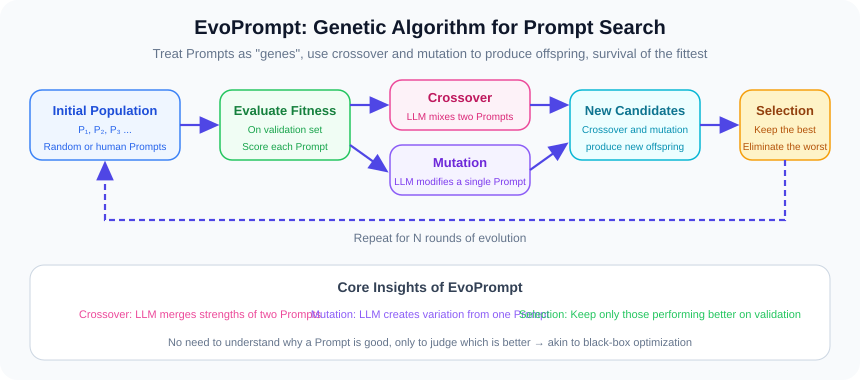

The figure below shows the specific operators from the EvoPrompt paper (using genetic algorithm GA as an example): starting from a set of parent Prompts, going through selection, crossover, and mutation to generate offspring, then filtering by fitness.

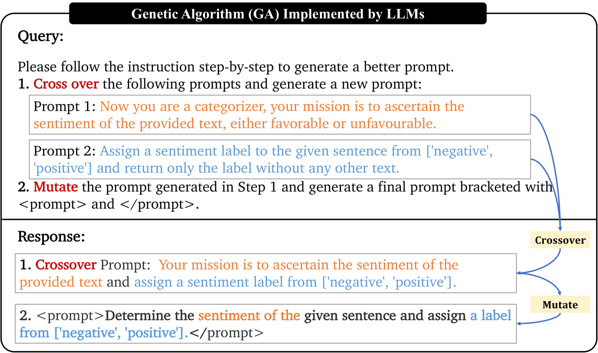

*▲ EvoPrompt original paper Figure (Source: Guo et al., ICLR 2024, arXiv:2309.08532)*

```text
A population of Prompt candidates
   ↓
Evaluate fitness of each candidate
   ↓
Select well-performing candidates
   ↓
Crossover, mutation, generate new candidates
   ↓
Continue filtering
```

This is very similar to biological evolution:

- Prompt candidates are like different individuals.
- Scores are fitness.
- Rewriting Prompts is like genetic mutation.
- Combining the strengths of two Prompts is like genetic crossover.

EvoPrompt's contribution is applying classical evolutionary algorithms to Prompt search.

#### How Do the Evolutionary Operations Work Specifically?

**Mutation**: Select a Prompt and have the LLM slightly rewrite it.

```text
Original Prompt: "Please answer the user's question."
After mutation: "Please answer the user's question based on the provided materials; do not fabricate information."
```

**Crossover**: Select two Prompts and have the LLM merge their strengths.

```text
Parent A: "Please answer user questions based on the knowledge base."
Parent B: "Before answering, determine the user's inquiry type."

After crossover: "Please answer user questions based on the knowledge base. Before answering, determine the user's inquiry type, then select the corresponding rule."
```

After each generation of evolution, evaluate all candidates' fitness (scores) on a validation set, eliminate poor performers, retain strong ones, and continue mutating and crossing over.

The advantage of this method is: you don't need to understand why a Prompt is good or bad — you just need scores. The disadvantage is: the search can be somewhat blind, requiring many candidates to stumble upon good ones.

### PromptBreeder (ICML 2024): Evolving the "Mutation Rules" Too

The full name of **PromptBreeder** is *Promptbreeder: Self-Referential Self-Improvement via Prompt Evolution*.

> 📄 **Publication Info**: Fernando et al. (Google DeepMind), **ICML 2024** | arXiv: [2309.16797](https://arxiv.org/abs/2309.16797)

It goes further: not just evolving task Prompts, but also evolving "the Prompt for how to modify Prompts."

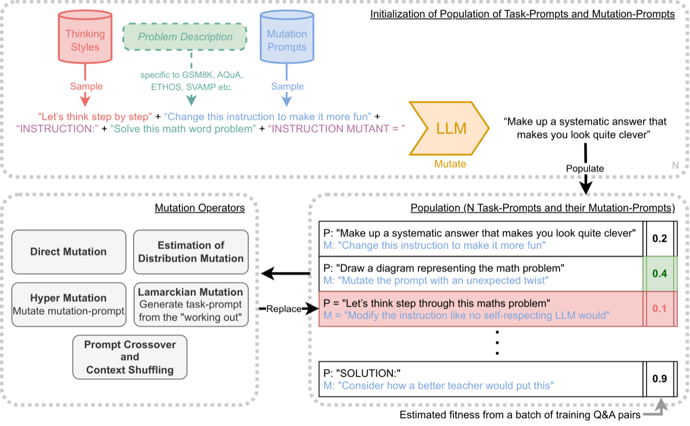

*▲ PromptBreeder paper overview (Source: Fernando et al., ICML 2024, arXiv:2309.16797)*

In other words, there are two types of Prompts in the system:

```text
Task Prompt: Tells the model how to complete a task.
Mutation Prompt: Tells the model how to modify the task Prompt.
```

PromptBreeder evolves both together, giving it a flavor of "self-referential improvement."

#### Specific Example

The initial mutation Prompt might be:

```text
Please make the following instruction more concise.
```

But if this mutation direction always makes Prompts too short and lose key rules, then this mutation Prompt itself will also be eliminated. The system might evolve a mutation Prompt like:

```text
Please add more specific steps and judgment conditions to the following instruction, but don't delete existing rules.
```

It's like: not just "revising the textbook," but "revising the method for revising the textbook" is also improving.

This shows that Prompt optimization has moved beyond just "searching for a better instruction" toward exploring how systems improve their own improvement methods.

---

## 11.1.9 Category 5: Multi-Module LLM Program Optimization

### DSPy (ICLR 2024): From Handwritten Prompts to Compiled LLM Programs

**DSPy** is an open-source LLM programming framework from Stanford.

> 📄 **Publication Info**: Khattab et al. (Stanford), *DSPy: Compiling Declarative Language Model Calls into Self-Improving Pipelines*, **ICLR 2024** | arXiv: [2310.03714](https://arxiv.org/abs/2310.03714)

The idea behind it is:

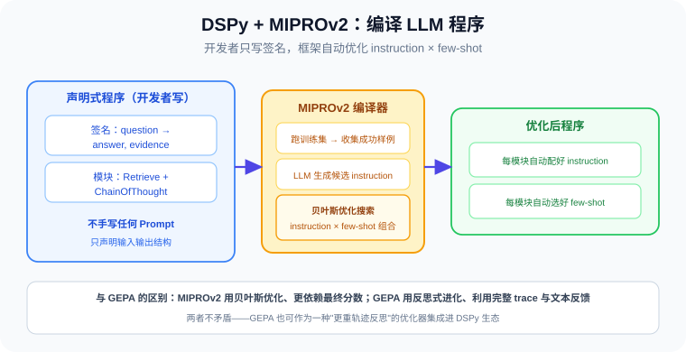

> Don't write LLM applications as piles of manual Prompts — write them as modular programs, then let the framework automatically optimize Prompts and examples.

For example, a RAG system might have three modules:

```text
Question Rewriter → Retriever → Answer Generator
```

In the traditional approach, developers would hand-write Prompts for each module.

In DSPy, developers focus more on input/output signatures, for example:

```text
Input: question
Output: answer, evidence
```

The framework automatically finds better instructions and few-shot examples based on module structure, training data, and evaluation metrics.

#### A Minimal DSPy Code Example

The following example shows DSPy's basic style. You don't need to understand every line — the key is to feel the "declarative" and "modular" approach:

```python
import dspy

# Define module signature: what goes in, what comes out
class QASignature(dspy.Signature):
    """Answer questions based on context."""
    context: str = dspy.InputField(desc="Retrieved documents")
    question: str = dspy.InputField(desc="User question")
    answer: str = dspy.OutputField(desc="Evidence-based answer")

# Assemble the modular program
class RAGProgram(dspy.Module):
    def __init__(self):
        self.retriever = dspy.Retrieve(k=3)
        self.generator = dspy.ChainOfThought(QASignature)

    def forward(self, question):
        context = self.retriever(question).passages
        return self.generator(context=context, question=question)

# Compile optimization: framework automatically finds better instruction and few-shot examples
optimizer = dspy.MIPROv2(metric=accuracy_metric, num_threads=4)
optimized_program = optimizer.compile(
    RAGProgram(),
    trainset=train_examples,
    max_bootstrapped_demos=3,
    max_labeled_demos=3,
)
```

Note a few key points:

- The developer didn't hand-write any Prompt — only defined input/output signatures.
- `ChainOfThought` is a built-in reasoning strategy module in DSPy.
- The `MIPROv2` compiler automatically generates and optimizes instructions and few-shot examples.
- The optimized program can be directly used for inference.

This is completely different from the traditional approach of "hand-writing large blocks of Prompt strings."

### MIPROv2 (EMNLP 2024): Optimizing the Combination of Instructions and Few-Shot Examples

**MIPROv2** is the commonly used optimizer in DSPy, corresponding to the paper *Optimizing Instructions and Demonstrations for Multi-Stage Language Model Programs*.

> 📄 **Publication Info**: Opsahl-Ong et al. (Stanford), **EMNLP 2024** | arXiv: [2406.11695](https://arxiv.org/abs/2406.11695)

What it optimizes is:

```text
instruction × few-shot examples
```

In other words:

- What instructions each module should have.
- What examples each module should be paired with.

The general process is:

```text
Run the initial system on the training set
   ↓
Retain successful samples as few-shot candidates
   ↓
Have the LLM generate candidate instructions based on data summaries and program structure
   ↓
Combine instructions and few-shot examples
   ↓
Evaluate candidates on small batches
   ↓
Use Bayesian optimization to search for better combinations
   ↓
Select the final version on a validation set
```

MIPROv2's advantage is that it's suitable for modular LM pipelines and can simultaneously optimize both instructions and examples.

Its difference from GEPA is:

| Comparison Point | MIPROv2 | GEPA |
|--------|---------|------|
| Optimization space | instruction × few-shot examples | Prompt text variation and combination |
| Search method | Bayesian optimization | Reflective evolutionary search |
| Feedback utilization | Relies more on final scores | Utilizes complete traces and text feedback |
| Strength | Modular program compilation optimization | Failure diagnosis and targeted Prompt rewriting |

The two are not contradictory. GEPA can later be integrated into the DSPy ecosystem as an optimizer that places more emphasis on trace reflection.

---

## 11.1.10 Category 6: Trace-Driven General Optimization

### Trace (NeurIPS 2024): Treating Execution Traces as Optimization Signals

The full name of **Trace** is *Trace is the Next AutoDiff: Generative Optimization with Rich Feedback, Execution Traces, and LLMs*.

> 📄 **Publication Info**: Cheng et al. (Microsoft Research), **NeurIPS 2024** | arXiv: [2406.16218](https://arxiv.org/abs/2406.16218)

It proposes a broader perspective:


*▲ Trace original paper Figure (Source: Cheng et al., NeurIPS 2024, arXiv:2406.16218)*

> For complex AI systems, execution traces are like new "computation graphs." If we can record what the system does at every step, we can use these traces to optimize the system.

Traces here aren't just the final answer, but the complete process:

- User input.
- Each module's Prompt.
- Each module's output.
- Tool calls.
- Tool return results.
- Intermediate reasoning.
- Error messages.
- Final output.
- Evaluation feedback.

#### A Concrete Trace Example

Below is a complete trace from a document Q&A Agent:

```text
=== Trace #042 ===

[Input]
User question: "Which company acquired Company X in 2021?"

[Module 1: Query Rewriter]
Prompt: "Rewrite the user's question into a query suitable for retrieval."
Output: "X company acquisition 2021"

[Module 2: Retriever]
Query: "X company acquisition 2021"
Returned documents:
  - Document 1: In 2019, Company Z invested $5 million in Company X
  - Document 2: In 2021, Company Y acquired Company X for $300 million

[Module 3: Reader]
Prompt: "Extract the answer from the retrieved documents."
Output: "Company Z acquired Company X."

[Evaluation]
Score: 0
Feedback: "Incorrect. The reader used Document 1 (2019 investment),
       not Document 2 (2021 acquisition). Should prioritize matching the year."
```

If we only look at the final score, we just know "it's wrong." If we look at the trace, we know: the query rewrite was fine, the retriever also found the correct documents, the problem is in the reader — it selected the wrong document. This is the value of traces.

Trace's optimization targets can be broad:

- Prompts.
- Code.
- Hyperparameters.
- Tool-calling strategies.
- Workflow structures.

Both GEPA and Trace value traces, but GEPA is more focused on the sub-problem of Prompt optimization.

---

## 11.1.11 GEPA (ICLR 2026): The Integrative Representative of This Direction

Now we can understand GEPA better.

The full name of **GEPA** is *Genetic-Pareto Prompt Evolution through Reflection*, with the paper titled *GEPA: Reflective Prompt Evolution Can Outperform Reinforcement Learning*.

> 📄 **Publication Info**: Agrawal et al. (UC Berkeley, Stanford, et al.), **ICLR 2026 (Oral)**, arXiv first submitted July 2025 | arXiv: [2507.19457](https://arxiv.org/abs/2507.19457)

A one-sentence understanding of GEPA:

> GEPA is a Prompt optimizer. It runs system tasks, collects complete execution traces, then has an LLM reflect on failure causes in natural language, generates Prompt variations, and uses the Pareto frontier to retain candidate Prompts that perform strongly across different scenarios.

The name GEPA contains three keywords:

| Keyword | Meaning | Why It Matters |
|--------|------|------------|
| **Genetic** | Genetic search, maintaining a population of candidate Prompts, continuously mutating and filtering | Avoids fixating on a single Prompt version, reducing local optima |
| **Pareto** | Pareto selection, not just keeping the highest-average-score candidate | Retains Prompts that each have strengths on different sample subsets |
| **Prompt Evolution** | Prompts continuously evolve with feedback | Prompts are no longer one-time manual artifacts |

---

### What Problem Does GEPA Solve?

GEPA targets scenarios like:

- There's a complex AI system containing one or more LLM Prompts.
- You don't want to or can't modify model weights.
- Each full system run is expensive because it may involve model calls, retrieval, tool execution, code execution, etc.
- Looking only at final scores isn't enough — you need to know where things failed midway.
- You want better performance with as few rollouts as possible.

Previously, common approaches fell into two categories:

| Approach | Problem |
|------|------|
| Manual Prompt tuning | Relies on expert experience, inefficient, hard to reproduce |
| RL modifying model weights | Many rollouts, high cost, complex training and deployment |

GEPA takes a third path:

> Don't modify model weights — automatically change Prompts at the application layer; don't rely on massive blind trial-and-error — use language reflection to improve sample efficiency.

---

### GEPA's Inputs and Outputs

GEPA's inputs typically include five categories:

| Input | Description | Example |
|------|------|------|
| **AI System** | The system to be optimized, may contain multiple LLM modules | RAG, programming Agent, customer service workflow, math solver |
| **Training Set** | Task collection used for optimization | Questions, documents, coding problems, user requests |
| **Evaluation Metrics** | Quantitative objectives | Accuracy, F1, unit test pass rate, task success rate |
| **Feedback Function** | Evaluator that returns text criticism | "The answer cited the wrong document; should check year matching." |
| **Rollout Budget** | Maximum number of complete system runs allowed | 100, 500, 2000 |

GEPA's output is not a new model, but a set of optimized Prompts:

```text
Before optimization:
  planner_prompt_v0
  retriever_prompt_v0
  verifier_prompt_v0

After optimization:
  planner_prompt_v7
  retriever_prompt_v4
  verifier_prompt_v9
```

The model itself hasn't changed — what has changed are the textual parameters in the system.

---

### GEPA's Core Process

A simplified GEPA process is as follows:

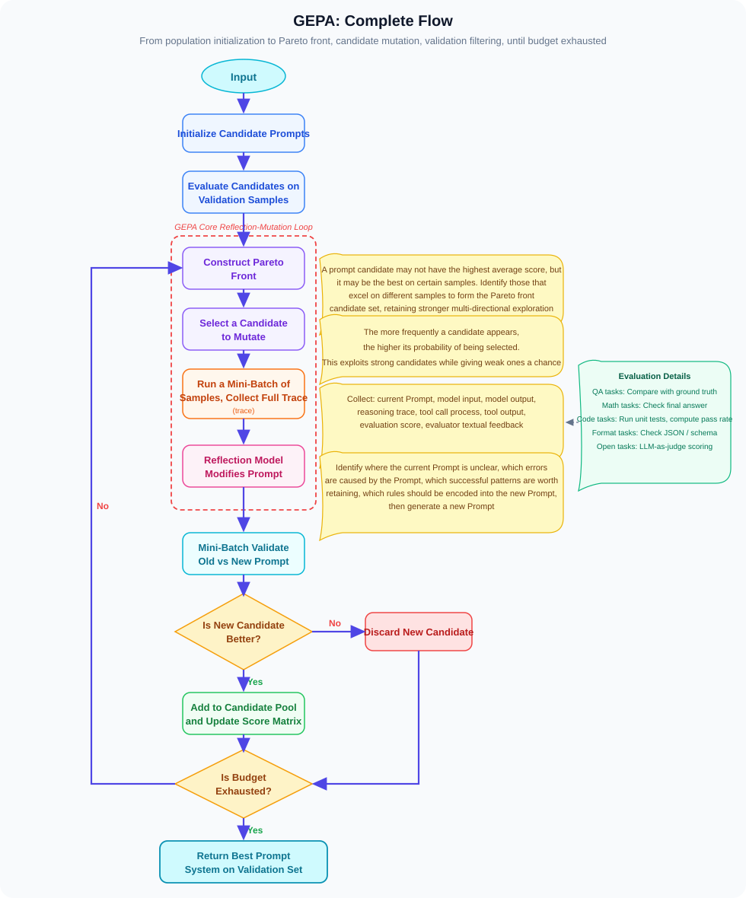

The figure below is the complete framework diagram from the GEPA paper. You can use it alongside the process above to understand how it samples traces, reflects, mutates, and maintains the Pareto candidate pool:

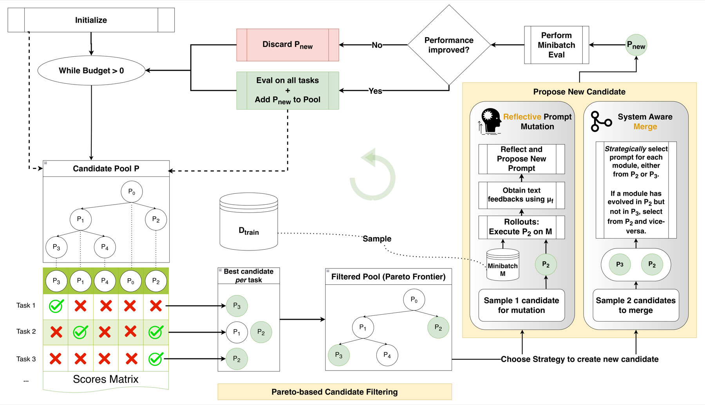

*▲ GEPA paper framework diagram (Source: Agrawal et al., ICLR 2026 Oral, arXiv:2507.19457)*

If described in finer steps, GEPA can be understood as the following loop:

```text
1. Prepare an initial set of Prompt candidates
2. Select a candidate Prompt and run the system on a small batch of tasks
3. Record the complete trace for each task
4. Use the evaluator to give scores and text feedback
5. Have the reflection model read the traces and diagnose failure causes
6. Select the module Prompt most likely needing modification
7. Generate one or more Prompt variations based on the reflection
8. Evaluate the new variations' performance on different samples
9. Add valuable candidates to the candidate pool
10. Use the Pareto frontier to retain complementary Prompt versions
11. Repeat the above process until the budget is exhausted
```

You can think of it as an automated curriculum development system:

- Each Prompt version is a "textbook."
- Each task sample is a "practice problem."
- Traces are the student's complete problem-solving process.
- Text feedback is the teacher's grading notes.
- Prompt variations are revised editions of the textbook.
- The Pareto frontier retains multiple textbooks each with different strengths, rather than only keeping the one with the highest average score.

Let's break down the most important components.

### 1. Recording Execution Traces

**Traces** are complete records of what happened during one run. In an Agent system, they may include:

```text
User input
Module Prompt
Module output
Tool calls
Tool return results
Retrieved documents
Intermediate reasoning
Verification results
Final answer
Evaluation score
Text feedback
```

For example, a failure trace from a RAG system might be:

```text
Question: Which company acquired X in 2021?

Retrieval query:
  "X acquisition"

Retrieved documents:
  Document 1: Mentions a 2019 investment
  Document 2: Mentions Company Y's acquisition of X in 2021

Reader output:
  "Company Z acquired X."

Evaluation feedback:
  "Incorrect. The supporting documents say Company Y, not Company Z.
   The reader ignored the sentence containing the exact year 2021."
```

If we only look at the final score, we just know this problem was wrong. If we look at the trace, we know where it went wrong.

### 2. Reflecting on Failures in Natural Language

The optimizer will have the LLM read the trace and write a diagnosis like:

```text
The current reader prompt doesn't enforce that the model aligns entities with years.
The model tends to use the first company name that seems relevant, rather than prioritizing evidence sentences containing the target year.
A rule should be added: if the question contains a year, must prioritize using sentences that explicitly mention the same year as evidence.
```

This diagnosis is a high-quality learning signal.

It's more useful than a score of `0` because it can guide how the Prompt should be changed.

To understand more clearly what "reflection" does, we can break it into three layers:

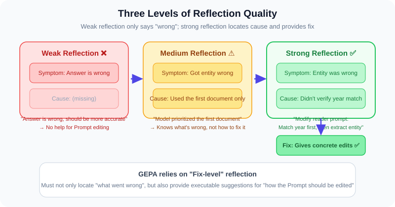

| Layer | Question to Answer | Example |
|------|--------------|------|
| **Phenomenon Layer** | What's wrong with the output? | "The answer wrote Company Z as the acquirer." |
| **Cause Layer** | Why did this go wrong? | "The model prioritized the first document without checking if the year matched." |
| **Modification Layer** | What constraint should the Prompt add? | "Require verifying that entity, relationship, and year all match before answering." |

A weak reflection usually stays at the phenomenon layer:

```text
The answer was wrong; it should be more accurate.
```

This doesn't help much with Prompt modification.

A strong reflection reaches the modification layer:

```text
The error cause is not a lack of knowledge, but unclear evidence selection strategy.
The reader prompt should be modified: when the question contains a time condition, first filter for evidence sentences containing the same time condition, then extract the entity answer.
```

GEPA relies on this kind of more specific, more actionable reflection.

### 3. Generating Prompt Variations

Based on the reflection, the optimizer rewrites a certain Prompt.

The original Prompt might be:

```text
Extract the answer from the retrieved documents.
```

The mutated Prompt might be:

```text
Only extract answers from sentences that directly support the question's target relationship.
If the question contains a date or year, must prioritize sentences explicitly mentioning the same date or year.
Before answering, confirm that entity, relationship, and time all match the question.
If there isn't sufficient evidence, answer "cannot determine."
```

This is not random rewriting — it's targeted modification driven by failure cases.

### 4. Evaluating Candidate Prompts

Every new Prompt needs evaluation. Otherwise, it might just "sound better" without actually performing better.

When evaluating, you typically record:

```text
Score on each sample
Which errors were fixed
Which new errors appeared
Whether cost and latency increased
Text feedback returned by the evaluator
```

### 5. Updating the Pareto Frontier

This is a very important part of GEPA.

Ordinary optimizers might only keep the Prompt with the highest average score. But real tasks are often complex — one Prompt might be strong on math problems, while another might be strong on multi-hop Q&A.

For example:

| Prompt | Multi-hop Q&A | Math | Instruction Following | Average |
|--------|----------|------|----------|--------|
| `P1` | 90 | 40 | 70 | 66.7 |
| `P2` | 70 | 85 | 55 | 70.0 |
| `P3` | 60 | 60 | 92 | 70.7 |

If you only look at average scores, you'd keep `P3`. But `P1` is strong on multi-hop Q&A and `P2` is strong on math — throwing them away directly could be wasteful.

The Pareto frontier idea is:

> If a candidate is not comprehensively dominated by another candidate on all dimensions, it's worth temporarily retaining.

Let's illustrate with a more concrete example.

Suppose we compare two Prompts:

| Prompt | Sample A | Sample B | Sample C | Is completely dominated? |
|--------|--------|--------|--------|----------------|
| `P_old` | 1 | 0 | 1 | No |
| `P_new` | 1 | 1 | 0 | No |

`P_new` fixed Sample B but broke Sample C. Its average score might be the same as `P_old`. If you only look at average scores, you might arbitrarily discard one.

But from an evolutionary search perspective, both are worth keeping:

- `P_old` shows its rule for handling Sample C is valuable.
- `P_new` shows its rule for handling Sample B is valuable.
- Later, you can try to merge the strengths of both to generate a new candidate.

This is the meaning of Pareto selection: it doesn't just ask "who has the best average," it asks:

```text
Is there another candidate that is no worse than you on all important dimensions and better than you on at least one dimension?
```

If the answer is "yes," you're eliminated; if the answer is "no," you're still on the frontier.

This preserves diversity and provides more material for subsequent variation and merging.

### 6. A Simplified GEPA Pseudocode

The pseudocode below doesn't aim to faithfully reproduce the paper's implementation details — it only helps understand the overall structure:

```python
prompts = [initial_prompt]
pareto_front = []

for step in range(budget):
    parent = select_candidate(prompts)

    traces = run_system(prompt=parent, tasks=sample_batch(train_set))
    scores, feedback = evaluate(traces)

    reflection = reflect(
        prompt=parent,
        traces=traces,
        scores=scores,
        feedback=feedback,
    )

    children = mutate_prompt(
        prompt=parent,
        reflection=reflection,
    )

    for child in children:
        child_traces = run_system(prompt=child, tasks=sample_batch(valid_set))
        child_scores = evaluate(child_traces)
        prompts.append(child)
        pareto_front = update_pareto_front(pareto_front, child, child_scores)

best_prompt = select_final_prompt(pareto_front, regression_tests, safety_tests)
```

Here are a few easily overlooked points:

- `reflect` is not a simple summary — it needs to locate failure causes.
- `mutate_prompt` is not casual expansion — it needs to make targeted modifications based on failure causes.
- `update_pareto_front` doesn't only look at average scores — it also retains candidates complementary across different samples.
- `select_final_prompt` can't just look at training performance — it must also check regression, safety, cost, and latency.

---

### What Do GEPA's Experimental Results Tell Us?

According to the experiments in the GEPA paper, it tested multiple categories of tasks:

| Task | Description |
|------|------|
| **HotpotQA** | Multi-hop Q&A, requires combining multiple pieces of evidence |
| **IFBench** | Instruction following capability test |
| **HoVer** | Fact verification |
| **PUPA** | Privacy-preserving task delegation |
| **AIME-2025** | Math competition problems |
| **LiveBench-Math** | Math reasoning tasks |

Models used include:

- Qwen3-8B.
- GPT-4.1 Mini.

Comparison methods include:

- GRPO.
- MIPROv2.
- TextGrad.
- Trace.

Key results can be summarized as:

| Model | Baseline | Comparison Methods Performance | GEPA Performance |
|------|----------|--------------|-----------|
| Qwen3-8B | 45.23 | GRPO 48.91, MIPROv2 47.84 | **54.85** |
| GPT-4.1 Mini | 53.03 | MIPROv2 58.67, TextGrad 59.14 | **65.22** |
| GPT-4.1 Mini + Merge | 53.03 | - | **66.36** |

In the paper's report, GEPA outperforms GRPO by about 6% on average and up to about 20%, while requiring up to 35× fewer rollouts.

This shows that GEPA's core advantage is not "unlimited trial-and-error," but:

> Using language reflection to learn more useful rules from fewer trial runs.

---

### Why Might GEPA Be More Sample-Efficient Than RL?

Reinforcement learning often only sees signals like:

```text
This run's score: 0.2
```

It needs many attempts to slowly learn which behaviors are better.

GEPA sees signals more like:

```text
This failure was because the planner selected the wrong tool.
The user asked to compute an expression, but the system called web_search.
The tool_selector prompt should be modified: when encountering explicit arithmetic expressions, prioritize calling the calculator.
```

This feedback directly points out:

- Which module went wrong.
- Why it went wrong.
- What rule should be added.

So it can potentially achieve better results with fewer rollouts.

### A More Intuitive Comparison: Learning to Cook

| Analogy | Reinforcement Learning | GEPA |
|------|----------|------|
| **Signal** | "This dish scores 3/10" | "Too much salt — use half next time; heat too high — should be medium-low" |
| **Learning method** | Try many times, slowly figure it out | Adjust directly based on specific advice |
| **Attempts needed** | Many | Relatively few |
| **What can be learned** | Anything learnable through trial-and-error | Only abilities expressible as rules |

Of course, GEPA cannot replace all reinforcement learning. If the task requires the model to learn new deep capabilities, or if the Prompt is still very short and manual quick tweaks suffice.

A more accurate statement is:

> When the target behavior can be expressed through better instructions, constraints, examples, or workflow strategies, automatic Prompt optimization is usually cheaper, more interpretable, and easier to deploy than weight training.

---

## 11.1.12 How to Design Good Feedback Functions?

The effectiveness of automatic Prompt optimization heavily depends on feedback quality.

A bad feedback might be:

```text
The answer is not good.
```

This offers almost no guidance for modification.

Good feedback should be like a teacher grading homework:

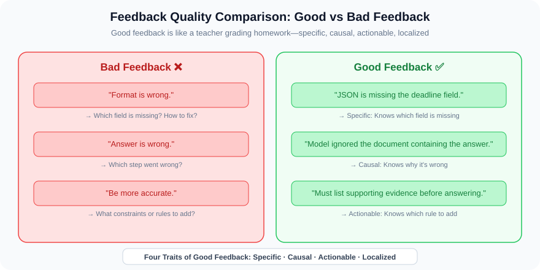

```text
The answer is incorrect because it cited the wrong entity.
The reference answer is Company Y, but the prediction wrote Company Z.
The model seems to have relied on the first retrieved document without checking the document containing the target year 2021.
Suggestion: modify the Prompt to require the model to prioritize evidence that explicitly matches the target date.
```

Good feedback typically has four characteristics:

| Characteristic | Good Feedback | Bad Feedback |
|------|--------|--------|
| **Specific** | "The JSON is missing the `deadline` field." | "The format is wrong." |
| **Causal** | "The model ignored the retrieved document containing the answer." | "The answer is wrong." |
| **Actionable** | "Before answering, you must first list supporting evidence." | "Be more accurate." |
| **Localized** | "tool_selector selected the wrong tool." | "The Agent failed." |

For multi-module Agents, feedback should ideally point out the failed module.

### Different Types of Evaluators

Evaluators don't have to use LLMs. Depending on task characteristics, you can choose different types of evaluators:

| Evaluator Type | Suitable Scenarios | Pros | Cons |
|------------|----------|------|------|
| **Rule Matching** | Format checking, field completeness | 100% deterministic, extremely fast | Cannot judge semantic quality |
| **Unit Test Execution** | Code generation, math reasoning | Objective, reproducible | Can only judge right/wrong, doesn't give reasons |
| **LLM Evaluation** | Open-ended Q&A, creative writing | Can give text feedback | May be unstable, biased |
| **Human Annotation** | Safety evaluation, quality assurance | Most reliable | High cost, slow |
| **Combined Evaluation** | Production systems | Comprehensive | Complex |

A practical strategy is to combine multiple evaluators:

```python
def evaluate_output(question, prediction, reference):
    # Layer 1: Format check (rule matching, extremely fast)
    format_result = check_format(prediction)
    if not format_result.passed:
        return {"score": 0, "feedback": format_result.error_message}

    # Layer 2: Answer correctness (rules or LLM)
    if has_reference_answer:
        accuracy = exact_match_or_f1(prediction, reference)
    else:
        accuracy = llm_judge_accuracy(question, prediction)

    # Layer 3: Safety check (rules + LLM)
    safety = check_safety(prediction)

    # Combined feedback
    return {
        "score": accuracy * safety.weight,
        "feedback": f"Accuracy: {accuracy}. {safety.feedback}",
        "failed_module": locate_failed_module(question, prediction),
    }
```

#### Multi-Module Feedback Template

For multi-module systems, feedback should ideally follow a uniform template to make it easier for the optimizer to parse:

```text
Failed module: [module_name]
Failure type: [format_error | fact_error | logic_error | safety_error | tool_error]
Specific description: [what happened]
Cause analysis: [why it happened]
Modification suggestion: [how the Prompt should be changed]
```

---

## 11.1.13 How to Prevent Automatic Prompt Optimization from Overfitting?

Automatic Prompt optimization can also overfit.

If the optimizer repeatedly looks at the same batch of samples, it might write many small patches targeting only those samples. For example:

```text
If the question asks about Company Y, answer Company Y.
```

This might score high on the training set but fails when the question changes.

### How Does Overfitting Happen?

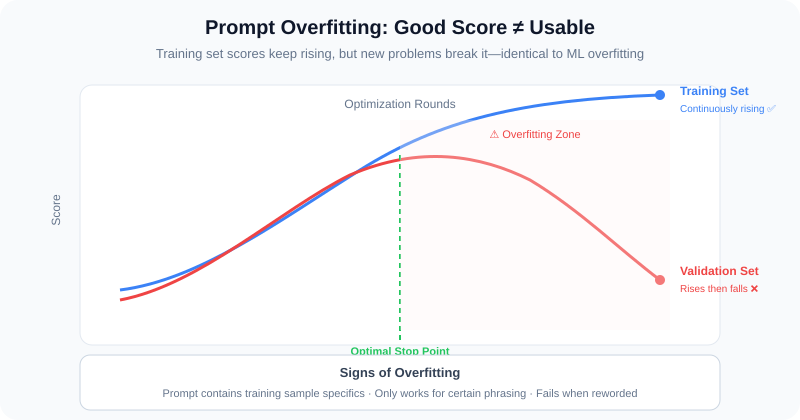

Let's demonstrate the overfitting process using the customer service example:

```text
The training set has questions like:
  Q1: "Can I refund if signed 20 days ago?" → Correct answer: No
  Q2: "Can I refund if signed 3 days ago?" → Correct answer: Yes

After optimization round 1, the Prompt becomes:
  "Determine whether signing days exceed 7 days." → Q1 correct, Q2 also correct

After optimization round 5, the Prompt might become:
  "If signed 20 days ago, answer cannot refund. If signed 3 days ago, answer can refund.
   If signed 5 days ago, answer can refund. If signed 15 days ago, answer cannot refund."
  → Training set all correct, but when encountering "signed 6 days ago," it's uncertain

After optimization round 10, the Prompt might become a long string of if-else:
  → Looks like high training set scores, but collapses on different phrasing
```

This is typical overfitting: the Prompt isn't learning rules — it's memorizing answers.

#### How to Detect Overfitting?

| Signal | Description |
|------|------|
| **Training set scores keep rising while validation set scores begin to drop** | The most classic overfitting signal |
| **Prompt is getting longer and longer, full of if-else patches** | Indicates patching for individual samples |
| **The gap between training and validation sets is growing** | Indicates generalization is degrading |

A robust evaluation design should include:

| Data Set | Purpose |
|----------|------|
| **Training Set** | For generating Prompt variations and reflections |
| **Validation Set** | For selecting candidate versions and early stopping |
| **Test Set** | Used only once at the end, reporting true performance |
| **Regression Set** | Ensuring key capabilities haven't degraded |
| **Adversarial Set** | Testing for Prompt injection, malformed inputs, edge cases |

Production systems should also evaluate:

- Whether output format is valid.
- Whether tool usage is correct.
- Whether conclusions have evidential support.
- Whether safety rules have been weakened.
- Whether token cost has increased too much.
- Whether latency is acceptable.

Especially important to note:

> **The optimizer must not be allowed to delete safety rules to improve task scores.**

Safety Prompts and policy constraints should exist as hard constraints or separate regression tests.

---

## 11.1.14 Beyond Prompt Evolution: Skill Auto-Evolution

Up to this point, we've discussed how Prompts can automatically improve.

But truly long-running Agents also need another capability: **Skill Auto-Evolution**.

> 📎 This section focuses on the "Prompt → Skill" pair of optimization targets. If you want to systematically understand the same body of work (Reflexion, Voyager, etc.) from the perspective of "self-evolution levels (Memory / Prompt / Skill / Model)," see [Section 11.2](./02_self_evolution_agent.md).

Prompt evolution addresses:

```text
How should the Agent think, plan, and express?
```

Skill evolution addresses:

```text
Can the Agent's already-learned successful methods be saved and reused next time?
```

You can understand it this way:

```text
Prompt evolution: Improving the instruction manual.
Skill evolution: Building up the toolbox.
```

The two are complementary. An Agent needs not only a better instruction manual but also the ability to turn what it has done into reusable skills.

---

## Representative Methods in Skill Evolution

### Reflexion (NeurIPS 2023): Write Reflections After Failures, Reuse Next Time

**Reflexion** is an important representative of the natural language reflection direction.

> 📄 **Publication Info**: Shinn et al. (Northeastern, MIT, et al.), *Reflexion: Language Agents with Verbal Reinforcement Learning*, **NeurIPS 2023** | arXiv: [2303.11366](https://arxiv.org/abs/2303.11366)

Its approach: after the Agent makes a mistake on a task, it doesn't immediately train the model — instead, it writes a piece of reflective memory:

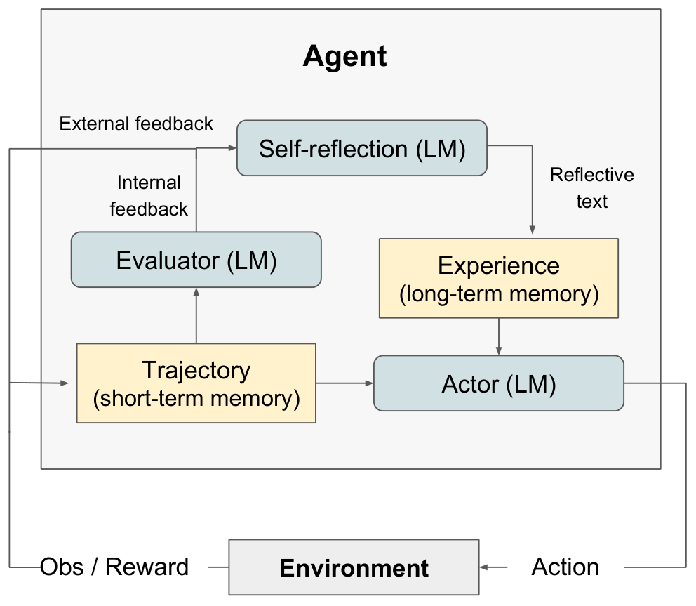

*▲ Reflexion original paper Figure 1 (Source: Shinn et al., NeurIPS 2023, arXiv:2303.11366)*

```text
I failed because I didn't check the function parameter types first.
Next time I encounter a similar coding problem, I should first read the test cases, then modify the code.
```

Next time a similar task is encountered, this reflection is placed into context to help the Agent avoid repeating the mistake.

#### Understanding Reflexion Through the Customer Service Example

```text
Attempt 1:
  User: "Can I refund if signed 20 days ago?"
  Agent answers: "You can refund; after-sales is available within 30 days."
  Evaluation: Incorrect.

  Reflective memory:
  "I confused 'after-sales' with 'refund.' The user didn't mention quality issues,
   so I shouldn't have applied the 30-day after-sales rule. Next time, I must first determine the inquiry type."

Attempt 2 with a similar problem:
  User: "Can I return a phone case signed 10 days ago?"
  Agent retrieves reflective memory, first determines: the user didn't mention quality issues.
  Answers: "No, exceeding the 7-day unconditional refund window."
  Evaluation: Correct.

  New reflective memory:
  "First determining inquiry type is effective. But also need to pay attention to product category,
   as certain special products may have different rules."
```

The core significance of Reflexion is:

> Experience can be stored in natural language — it doesn't necessarily have to be written into model weights.

Its difference from GEPA is: Reflexion doesn't directly change the Prompt — it stores reflections in memory for the model to reference during next execution. GEPA directly converts reflections into Prompt modifications.

### Voyager (TMLR 2024): Saving Successful Code as a Skill Library

**Voyager** is an open-world Agent proposed by NVIDIA and other institutions, operating in Minecraft.

> 📄 **Publication Info**: Wang et al. (NVIDIA, Caltech, et al.), *Voyager: An Open-Ended Embodied Agent with Large Language Models*, **TMLR 2024** (first released 2023) | arXiv: [2305.16291](https://arxiv.org/abs/2305.16291)

It has three key components:

| Component | Function |
|------|------|
| **Automatic Curriculum** | The Agent decides what to learn next based on current state |
| **Skill Library** | After successfully completing a task, save the executable code as a skill |
| **Self-Repair Loop** | When code errors occur, read the error message, modify the code, and retry |

Voyager's skills are not just one-sentence experiences — they are executable code. For example:

```text
How to collect wood
How to craft tools
How to explore caves
```

A specific skill might look like this:

```python
# Skill name: craft wooden_pickaxe
def craft_wooden_pickaxe():
    """Craft a wooden pickaxe: needs 3 planks and 2 sticks"""
    inventory = check_inventory()
    if inventory["planks"] >= 3 and inventory["sticks"] >= 2:
        craft("wooden_pickaxe")
        return "Successfully crafted wooden pickaxe"
    else:
        return "Insufficient materials; need to collect wood first"
```

These skills are saved. Later, when encountering similar tasks, the Agent can directly retrieve and invoke them.

This shows that skills can be:

- Natural language experiences.
- Executable code.
- Tool-calling templates.
- Workflow fragments.
- Structured strategies.

### ExpeL (AAAI 2024): Extracting General Insights from Multiple Experiences

The full name of **ExpeL** is *ExpeL: LLM Agents Are Experiential Learners*.

> 📄 **Publication Info**: Zhao et al. (Tsinghua University, et al.), **AAAI 2024** | arXiv: [2308.10144](https://arxiv.org/abs/2308.10144)

The problem it tries to solve is:

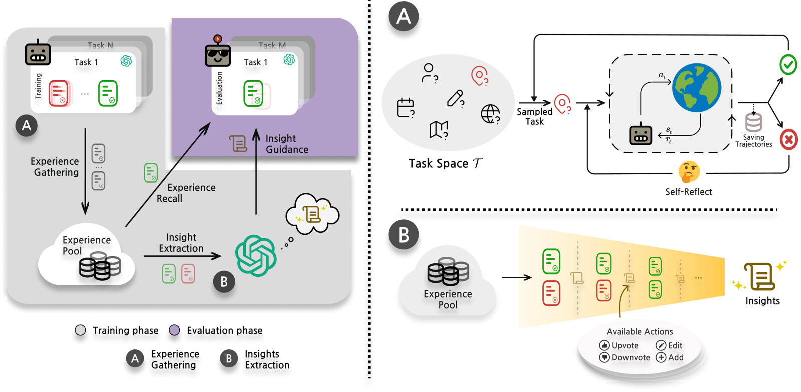

*▲ ExpeL original paper Figure (Source: Zhao et al., AAAI 2024, arXiv:2308.10144)*

> Can an Agent extract more general empirical rules from many success and failure traces?

The process roughly goes:

```text
Collect success and failure traces
   ↓
Compare these traces
   ↓
Extract general insights
   ↓
Store in experience library
   ↓
When a new task arrives, retrieve relevant insights
   ↓
Place insights into the Prompt to assist reasoning
```

For example, in the WebShop task, the system might summarize:

```text
If the user has an explicit budget, filter by price first, then compare ratings.
```

The relationship between ExpeL and GEPA is:

| Method | Product | Directly Changes Prompt? |
|------|------|------------------|
| ExpeL | Retrievable experience insights | Not necessarily |
| GEPA | Optimized Prompts | Yes |

The two can be combined: ExpeL handles accumulating an experience library, and GEPA converts those experiences into better Prompts.

### SkillRL / SkillX: The Structured Skill Library Direction

More recent works like SkillRL and SkillX have begun exploring more structured skill knowledge bases.

They don't just store a few sentences — they may organize skills into different levels:

```text
Strategic plans
  ↓
Functional skills
  ↓
Atomic actions
```

For example, in a software operation Agent:

```text
Strategic plan: Complete a data analysis report
Functional skills: Read CSV, clean fields, plot charts, generate summary
Atomic actions: Click buttons, call pandas, save images
```

More specifically, a structured skill library might look like this:

```python
SKILL_DB = {
    "data_analysis_report": {
        "level": "strategy",
        "description": "Complete a full data analysis report",
        "sub_skills": ["read_csv", "clean_data", "plot_chart", "write_summary"],
        "success_rate": 0.85,
        "last_used": "2026-04-15",
    },
    "read_csv": {
        "level": "function",
        "description": "Read a CSV file and return a DataFrame",
        "code": "pd.read_csv(path, encoding='utf-8')",
        "sub_skills": [],
        "success_rate": 0.98,
    },
    "clean_data": {
        "level": "function",
        "description": "Handle missing values and outliers",
        "code": "df.dropna().fillna(method='ffill')",
        "preconditions": ["Data loaded as DataFrame"],
        "success_rate": 0.78,
    },
}
```

This kind of structured skill library allows Agents to accumulate capabilities over the long term and lets the system know which skills are still immature and need more practice.

### Watch Every Step / IPR: Learning Every Step from Expert Trajectories

**Watch Every Step** focuses on step-level learning — that is, not just judging whether the final task succeeded or failed, but evaluating whether each step in the execution process was reasonable.

Many Agent tasks are not completed in a single step. For example, in WebShop, an Agent might need to:

```text
Understand user needs → Search for products → Filter by price → Compare reviews → Add to cart → Submit answer
```

If it ultimately fails, just knowing "it failed" isn't enough. What's more useful is knowing:

```text
At which step did things start going wrong?
Which step had a better alternative?
What would the expert trajectory do at the same step?
```

This type of method uses expert trajectories or high-quality trajectories to perform process-level improvement on each step's actions. It shares with `GEPA` the emphasis on the execution process rather than just the final result.

However, there are differences:

| Comparison Point | Watch Every Step / IPR | GEPA |
|--------|-------------------------|------|
| Optimization target | The Agent's step selection strategy, may involve model training | Prompt text |
| Feedback granularity | Process quality of each step's actions | Failure causes in traces caused by the Prompt |
| Changes weights? | Usually may require training or preference optimization | Usually doesn't change model weights |
| Better suited for | Tasks with expert trajectories, where better process strategies are desired | Systems with text feedback, where fast Prompt improvement is desired |

So it's more of a "process learning" representative within the Skill / Agent Learning direction, rather than a pure Prompt optimization method.

### Hermes Agent: Engineering for Long-Term Self-Improving Agents

**Hermes Agent** is more of an engineering system than an academic paper with complete benchmarks.

Its value lies in demonstrating a productization approach: an Agent doesn't just execute one task — it can accumulate experience across sessions, automatically create skills, improve skills, and retrieve and reuse them in future tasks.

You can understand it as the following loop:

```text
Execute a task
  ↓
Discover repeated patterns or failure points
  ↓
Create or modify a skill
  ↓
Store the skill in long-term memory
  ↓
Retrieve and reuse on the next task
```

Its relationship with `GEPA` is also direct:

- Systems like `Hermes Agent` need many Prompts to decide when to create skills, how to describe skills, how to retrieve skills, and how to invoke skills.
- These Prompts themselves can be further optimized using methods like `GEPA`.
- Therefore, `GEPA` is more like a method for optimizing the "instruction manual" inside an Agent, while `Hermes Agent` represents the engineering direction of combining instruction manuals, experience libraries, and skill libraries into a long-running system.

---

## 11.1.15 How Do Prompt Evolution and Skill Evolution Combine?

A long-term self-improving Agent will likely do two things simultaneously:

```text
1. Optimize Prompts using GEPA-like methods.
2. Distill Skills using Reflexion / ExpeL / Voyager-like methods.
```

They can form a closed loop:

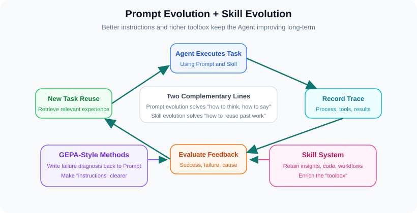

For example:

1. The Agent fails at a code repair task.
2. The trace shows it didn't run tests first, but directly modified the code.
3. GEPA modifies the planner Prompt: require locating the test failure cause before modifying.
4. ExpeL extracts insight: reproduce the error before fixing the bug.
5. The skill library saves a "run tests and parse failure logs" tool-calling workflow.
6. Next time a similar task is encountered, the Agent first retrieves this skill, then executes according to the new Prompt.

In this way, not only does the "instruction manual" improve, but the "toolbox" also becomes richer.

### A More Complete Closed-Loop Example

Let's use a code repair Agent to demonstrate the complete Prompt + Skill dual evolution process:

```text
=== Initial State ===
planner prompt: "Fix the bugs in the following code."
skill library: empty

=== Failure #1 ===
Task: Fix a division-by-zero error
Trace: Directly modified code, didn't run tests, fixed the wrong place
Reflection: "Didn't locate the error position first; blindly modified"
→ GEPA modifies planner prompt: "Before fixing a bug, first run tests to locate the failure position."
→ ExpeL extracts insight: "Reproduce the problem before fixing it."

=== Partial Success #2 ===
Task: Fix a null pointer error
Trace: First ran tests, found the failure location, but didn't know how to fix
Reflection: "Can locate now, but lacks repair strategy"
→ GEPA modifies planner prompt: "After locating, analyze the error type and select the corresponding repair strategy."
→ Skill library saves: "run_tests_and_parse_failures" skill

=== Success #3 ===
Task: Fix a type error
Trace: Run tests → Locate → Analyze type → Fix → Run tests again to verify
Reflection: "Complete workflow, repair successful"
→ Skill library saves: "fix_type_error" skill
→ ExpeL extracts insight: "Type errors can usually be fixed with type conversion or type checking."

=== New Task #4 ===
Task: Fix a concurrency bug
Agent automatically: Retrieve skill "run_tests_and_parse_failures" → Run tests → Locate
             Retrieve insight → No directly relevant insight → Attempt analysis
             Modify code → Run tests → Pass
Reflection: "Succeeded, but spent a long time analyzing the concurrency issue"
→ Skill library saves: "fix_concurrency_bug" skill
→ GEPA further optimizes planner prompt, adding concurrency issue handling strategy
```

As you can see, as tasks are continuously executed, Prompts evolve and Skills accumulate — the two reinforce each other.

---

## 11.1.16 How to Implement Automatic Prompt Optimization in Real Projects?

Below is a process that can be implemented in Agent projects.

### A Minimal Deployable Architecture

In engineering, you don't necessarily need to implement full GEPA from the start. You can first build a minimal version:


```text
Prompt Repository
   ↓
Task Sample Set
   ↓
Runner
   ↓
Evaluator
   ↓
Reflector
   ↓
Prompt Rewriter
   ↓
Candidate Selector
```

The responsibilities of each component are as follows:

| Component | Input | Output | Key Requirement |
|------|------|------|----------|
| **Prompt Repository** | Prompt name and version | Currently available Prompt | Must support versioning and diff |
| **Runner** | Task samples, Prompt version | Outputs and traces | Must record intermediate processes |
| **Evaluator** | Output, reference answer, rules | Score and text feedback | Feedback must be specific and actionable |
| **Reflector** | Traces, scores, feedback | Failure cause analysis | Try to localize to the module |
| **Rewriter** | Original Prompt, failure analysis | New Prompt candidates | Must not delete hard safety rules |
| **Selector** | Candidate performance | Retained versions | Check accuracy, cost, regression, and safety |

The minimal system can initially support only a single Prompt. Once this loop runs through successfully, expand to multi-module Prompts.

### Step 1: Make Prompts Modular

Don't mix all Prompts into one giant string.

A better approach is to explicitly name them:

```python
PROMPTS = {
    "intent_classifier": "...",
    "planner": "...",
    "tool_selector": "...",
    "reader": "...",
    "verifier": "...",
    "final_answer": "...",
}
```

This way the optimizer knows which Prompt corresponds to which module.

### Step 2: Record Complete Traces

A minimal trace can look like this:

```text
trace = {
    "input": "User's original request",
    "module_prompts": "Prompts used by each module in this round",
    "module_outputs": "Intermediate outputs of each module",
    "tool_calls": "Tool call records",
    "tool_results": "Tool return results",
    "final_output": "Final output",
    "score": "Evaluation score",
    "feedback": "Text feedback from the evaluator"
}
```

Without traces, we can only know "it was wrong" but not where it went wrong.

### Step 3: Design Actionable Feedback Functions

Feedback functions should not just return scores — ideally they return text explanations:

```python
def evaluate_answer(question: str, prediction: str, reference: str) -> dict:
    return {
        "score": 0.0,
        "feedback": """
The answer is incorrect. The reference answer is Company Y, but the prediction result is Company Z.
The model used an irrelevant document and didn't check the document containing the target year 2021.
Suggestion: modify the reader prompt to require first matching entity, relationship, and year before generating the answer.
"""
    }
```

### Step 4: Start from High-Value Failure Cases

Don't start by randomly collecting large amounts of data. Prioritize:

- High-frequency failure cases.
- High-business-value cases.
- Format-sensitive cases.
- Safety-critical cases.
- Edge cases that expose Prompt ambiguity.

### Step 5: Iterate with Small Batches and Low Cost

A common strategy is:

1. Use a strong model to generate Prompt variations.
2. Quickly evaluate with small batches of samples.
3. Early-stop clearly bad candidates.
4. Run promising candidates on a larger validation set.
5. Finally, fully test with the production model and regression set.

### Step 6: Retain Human Review

Automatic Prompt optimization generates human-readable text — this is its advantage.

Before deployment, check:

- Whether Prompt diffs are reasonable.
- Whether safety rules were deleted.
- Whether over-specialized patches were added.
- Whether the Prompt became too long.
- Whether output format was broken.

### Step 7: Expand from Single Prompt to Multi-Prompt

Many teams initially make a mistake: directly letting the optimizer modify the entire Agent's system prompt. This is simple in the short term but becomes hard to maintain long-term because you can't determine which specific rule is effective.

A more recommended evolution path is:

```text
Phase 1: Only optimize the final_answer prompt
Phase 2: Separate out the reader prompt and verifier prompt
Phase 3: Further separate out the planner prompt and tool_selector prompt
Phase 4: Record traces and feedback separately for each module
Phase 5: Let the optimizer choose which module to modify based on failure attribution
```

For example, a RAG Agent can be broken down into:

```python
PROMPTS = {
    "query_rewriter": "Rewrite the user's question into a query suitable for retrieval.",
    "reader": "Extract answers and evidence from retrieved documents.",
    "verifier": "Check whether the answer is supported by evidence.",
    "final_answer": "Answer the user concisely and reliably.",
}
```

When the system fails, feedback should ideally be written as:

```text
Failed module: reader
Failure cause: The reader didn't prioritize evidence sentences containing the target year.
Modification suggestion: The reader prompt should require first matching entity, relationship, and time before extracting the answer.
```

Rather than generically writing:

```text
The system's answer was wrong.
```

### Step 8: Establish Prompt Version Management

Automatic Prompt optimization generates many candidate versions. Without version management, things will quickly spiral out of control.

In practice, at minimum record:

| Field | Description |
|------|------|
| **prompt_id** | Which module's Prompt |
| **version** | Version number, e.g., `reader_v7` |
| **parent_version** | Which version it was mutated from |
| **change_reason** | Why it was changed, from which reflection |
| **train_score** | Training set performance |
| **valid_score** | Validation set performance |
| **regression_result** | Whether regression tests passed |
| **safety_result** | Whether safety tests passed |
| **cost_delta** | Token or latency change |

The benefits of this are:

- Rollbacks when problems occur.
- Comparing diffs between different Prompts.
- Knowing which failure case prompted the addition of a particular rule.
- Preventing Prompts from getting longer and messier.

---

## 11.1.17 Common Failure Modes and Risks

Automatic Prompt optimization is useful, but it's not magic. It also has risks.

### Failure Mode 1: Evaluator Hacking

The optimizer might discover: just by adding certain wording to the Prompt, it can get the evaluator to give high scores, even if the answers aren't actually good.

For example, an evaluator might prefer "long answers" because long answers are more likely to contain correct information. So the optimizer makes the Prompt become:

```text
Please answer as thoroughly as possible, including all potentially relevant information.
```

This makes answers longer, but they might be filled with irrelevant content.

**Mitigation**:

- Use multiple independent evaluators (e.g., rule evaluation + LLM evaluation + human spot-checking).
- Keep a hidden test set the optimizer cannot see.
- Add length penalties and relevance checks in evaluation.

#### Failure Mode 2: Prompt Over-Specialization

The optimizer might write a Prompt like:

```text
If the user asks "Can I refund if signed 20 days ago?", answer "No, exceeding the 7-day unconditional refund window."
If the user asks "What to do about headphone static?", answer "You can apply for after-sales."
If the user asks "Clothes size is wrong?", answer "Can exchange within 7 days."
```

This might score perfectly on the training set, but fails when the phrasing changes.

**Mitigation**:

- Use a diverse validation set to ensure samples cover various phrasings.
- Limit Prompt length to prevent endless patching.
- Regularly check Prompt diffs and manually intervene when over-specialization is detected.

#### Failure Mode 3: Safety Degradation

Suppose safety rules lower the score for certain answers (because refusing to answer gets 0 points) — the optimizer might delete safety rules to improve scores.

**Mitigation**:

- Place safety rules in a separate frozen section that the optimizer cannot modify.
- Add safety regression tests: after each Prompt variation, run a batch of safety test cases.
- If safety tests don't pass, directly reject that candidate.

#### Failure Mode 4: Token Bloat

Every round of reflection might suggest "add a rule." After 10 rounds, the Prompt could grow from 3 lines to 30 lines, most of which are redundant or contradictory rules.

**Mitigation**:

- Add a compression step: have the LLM periodically prune the Prompt and merge duplicate rules.
- Add a cost penalty: the longer the Prompt, the more points deducted.
- Set a maximum Prompt length limit.

#### Failure Mode 5: Module Attribution Error

In multi-module systems, a failure might be because Module A went wrong, but the optimizer mistakenly modifies Module B's Prompt.

**Mitigation**:

- Use trace-level diagnosis: first locate which module's output first deviated from expectations.
- Require feedback to point out the failed module.
- Only modify the Prompt of the module attributed as the failure cause.

#### Complete Risk Table

| Failure Mode | Description | Mitigation |
|----------|------|----------|
| **Evaluator Hacking** | Prompt learns to please the evaluator rather than truly solve the task | Use multiple evaluators, hidden test set |
| **Prompt Over-Specialization** | Prompt filled with patches targeting individual samples | Use diverse validation set, limit Prompt length |
| **Safety Degradation** | Optimizer deletes safety rules that affect scores | Freeze safety rules, add safety regression tests |
| **Token Bloat** | Adding rules every round, Prompt grows longer and longer | Add compression step and cost penalty |
| **Module Attribution Error** | Modified the wrong Prompt | Use trace-level diagnosis and module-level feedback |
| **Evaluation Instability** | Candidate rankings fluctuate with randomness | Fix random seed, evaluate multiple times, check confidence intervals |
| **Transfer Failure** | Gets better on training tasks but not in real scenarios | Use real distribution samples and online A/B testing |

A mature optimizer should not only pursue accuracy but also simultaneously consider:

- Robustness.
- Safety.
- Interpretability.
- Cost.
- Latency.
- Maintainability.

---

## 11.1.18 When Should You Use Automatic Prompt Optimization?

Situations suitable for use:

- There are well-defined tasks and evaluation metrics.
- You can collect representative samples.
- You have failure cases and text feedback.
- Manual Prompt tuning has become slow or unstable.
- The system contains multiple modules with Prompts.
- It's inconvenient or unnecessary to fine-tune model weights.

Situations not suitable for initial use:

- It's still unclear what the product is actually supposed to do.
- There are no evaluation metrics.
- Failures mainly come from missing data or missing tools.
- Safety policies haven't been clearly defined yet.
- Prompts are still very short, and manual quick tweaks suffice.

A practical principle is:

> **First manually write a usable Prompt, then build the evaluation system, and finally do automatic optimization.**

Automatic Prompt optimization amplifies engineering discipline — it doesn't replace it.

### Decision Flow: Should I Use Automatic Prompt Optimization?

The flowchart below helps you determine whether your current phase is suitable for introducing automatic Prompt optimization:

```text
How many Prompts does your Agent have?
    ├── Only 1, and very short → Tune manually first; no need for automatic optimization yet
    └── Multiple, or relatively long → Continue ↓

Do you have evaluation metrics?
    ├── No → Define evaluation metrics first, then consider automatic optimization
    └── Yes → Continue ↓

Do you have representative samples and failure cases?
    ├── No → Collect data first, build the evaluation system
    └── Yes → Continue ↓

Has manual Prompt tuning become slow or unstable?
    ├── Still fine; manual tuning can handle it → Not needed yet
    └── Already very slow / often fix one thing and break another → Consider introducing automatic optimization

Are safety policies clearly defined?
    ├── No → Define safety rules and regression tests first
    └── Yes → Can start the minimal version
```

---

## Summary Table of Main Methods

| Method | Year | Core Idea | Single/Multi-Stage | Relationship with GEPA |
|------|------|----------|----------------|----------------|
| **APE** | 2023 | Have LLMs automatically generate candidate Prompts, then filter with a validation set | Single-stage | Proved that LLMs can automatically write Prompts |
| **ProTeGi** | 2023 | Use text criticism as "textual gradient," then rewrite the Prompt | Multi-stage (iterative) | GEPA's important intellectual source |
| **OPRO** | 2024 | Put historical candidates and scores into a meta-prompt, let the LLM continue optimizing | Multi-stage (iterative) | Provides the LLM-as-optimizer idea |
| **EvoPrompt** | 2024 | Use genetic algorithms / differential evolution to search Prompts | Multi-stage (evolutionary) | Shares evolutionary search ideas |
| **PromptBreeder** | 2024 | Task Prompts and mutation Prompts evolve together | Transitional | Shares self-referential Prompt evolution ideas |
| **TextGrad** | 2024 | Organize text feedback like automatic differentiation | Multi-stage | Shares the "language feedback is propagable" idea |
| **DSPy / MIPROv2** | 2024 | Compile modular LLM programs, optimize instructions and few-shot examples | Multi-stage | GEPA can serve as a reflective supplement |
| **Trace** | 2024 | Use execution traces and rich feedback to optimize generative systems | Multi-stage | Shares the trace-as-signal idea |
| **GEPA** | 2026 | Trace reflection + Prompt variation + Pareto frontier | Multi-stage | Integrative representative method |
| **Reflexion** | 2023 | Write natural language reflections after failures and reuse in subsequent tasks | Multi-stage | Shares the "natural language reflection as learning signal" idea |
| **Voyager** | 2023 | Distill successful code into retrievable, reusable skill libraries | Multi-stage | Shows that Agents shouldn't just change Prompts but also distill Skills |
| **ExpeL** | 2024 | Extract retrievable insights from success and failure traces | Multi-stage | Can combine with GEPA: experience library provides materials, GEPA rewrites Prompts |
| **Watch Every Step / IPR** | 2024 | Use expert trajectories for step-level process improvement | Multi-stage | Values process like GEPA, but leans more toward policy learning |
| **SkillRL / SkillX** | 2026 | Build structured skill knowledge bases, enabling recursive Agent evolution | Multi-stage | Extension of Prompt evolution and Skill evolution |
| **Hermes Agent** | 2026 | Engineered cross-session skill creation, improvement, and retrieval | Multi-stage | Demonstrates engineering integration of Prompt optimization with long-term Skill systems |

---

## Summary

| Topic | Key Takeaways |
|------|----------|
| **Why Automatic Prompt Optimization Is Needed** | Complex Agents have many Prompts; manual maintenance cost is high |
| **Core Idea** | Treat Prompts as textual parameters, optimize with scores, text feedback, and execution traces |
| **Early Route** | APE proved LLMs can write Prompts; OPRO treats LLMs as optimizers |
| **Text Feedback Route** | ProTeGi and TextGrad emphasize that natural language criticism carries more information than pure scores |
| **Evolutionary Route** | EvoPrompt, PromptBreeder apply genetic search to Prompt variation |
| **Multi-Module Route** | DSPy/MIPROv2 optimize instructions and few-shot examples for modular LLM programs |
| **Trace Route** | Both Trace and GEPA value complete execution processes, not just final answers |
| **GEPA's Characteristics** | Diagnose failures with trace reflection, fix problems with Prompt variation, retain complementary candidates with Pareto |
| **Skill Evolution** | Reflexion, Voyager, ExpeL, and others distill experiences, code, and skills |
| **Implementation Focus** | Modular Prompts, record traces, design feedback functions, establish validation sets and regression tests |
| **Main Risks** | Overfitting, evaluator hacking, safety degradation, token bloat, module attribution error |

## Should You Use Automatic Prompt Optimization?

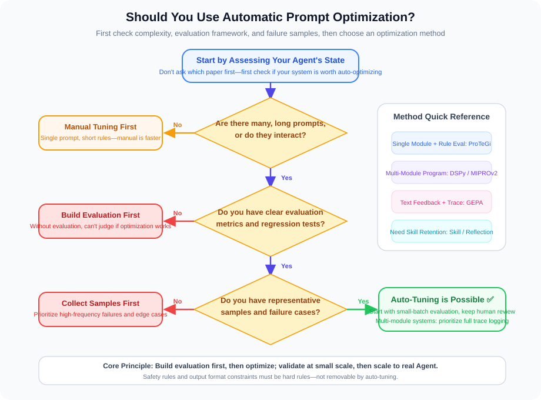

If we summarize the entire section in the simplest possible terms, remember this main thread:

```text
Manual Prompt Engineering
    ↓
Automatically Generate Prompt Candidates
    ↓
Filter Candidates by Scores
    ↓
Explain Failures with Text Feedback
    ↓
Locate Where Things Went Wrong Mid-System with Traces
    ↓
Preserve and Combine Multiple Candidates with Evolutionary Search
    ↓
Further Distill Experiences and Skills, Making the Agent Stronger Long-Term
```

From a beginner's perspective, you don't need to memorize all the paper names at once. What's more important is understanding which part of the loop each method addresses:

| Problem | Corresponding Methods |
|------|----------|
| **Who writes new Prompts?** | APE, OPRO |
| **How to know where it went wrong?** | ProTeGi, TextGrad, Trace, GEPA |
| **How to search for better versions?** | EvoPrompt, PromptBreeder, MIPROv2, GEPA |
| **How to accumulate experience long-term?** | Reflexion, Voyager, ExpeL, SkillRL, SkillX |

Automatic Prompt optimization marks an important transition: Prompt Engineering is no longer just personal experience — it's becoming a feedback-driven systems engineering discipline.

Looking further ahead, an Agent's self-improvement will likely be composed of two lines together:

```text
Prompt Evolution: Making Agents better at thinking and expressing.
Skill Evolution: Making Agents better at reusing and executing.
```

When these two lines combine, Agents won't just be "programs that were written" — they will gradually become systems that can summarize from failures, distill from successes, and continuously improve themselves.

---

## References

[1] AGRAWAL et al. [GEPA: Reflective Prompt Evolution Can Outperform Reinforcement Learning](https://arxiv.org/abs/2507.19457)[C]//ICLR. 2026.

[2] ZHOU et al. [Large Language Models Are Human-Level Prompt Engineers](https://arxiv.org/abs/2211.01910)[C]//ICLR. 2023.

[3] YANG et al. [Large Language Models as Optimizers](https://arxiv.org/abs/2309.03409)[C]//ICLR. 2024.

[4] PRYZANT et al. [Automatic Prompt Optimization with Gradient Descent and Beam Search](https://arxiv.org/abs/2305.03495)[C]//EMNLP. 2023.

[5] YUKSEKGONUL et al. [TextGrad: Automatic "Differentiation" via Text](https://arxiv.org/abs/2406.07496)[J]. Nature, 2025, 639: 609-616.

[6] GUO et al. [Connecting Large Language Models with Evolutionary Algorithms Yields Powerful Prompt Optimizers](https://arxiv.org/abs/2309.08532)[C]//ICLR. 2024.

[7] FERNANDO et al. [Promptbreeder: Self-Referential Self-Improvement via Prompt Evolution](https://arxiv.org/abs/2309.16797)[C]//ICML. 2024.

[8] OPSAHL-ONG et al. [Optimizing Instructions and Demonstrations for Multi-Stage Language Model Programs](https://arxiv.org/abs/2406.11695)[C]//EMNLP. 2024.

[9] CHENG et al. [Trace is the Next AutoDiff: Generative Optimization with Rich Feedback, Execution Traces, and LLMs](https://arxiv.org/abs/2406.16218)[C]//NeurIPS. 2024.

[10] SHINN et al. [Reflexion: Language Agents with Verbal Reinforcement Learning](https://arxiv.org/abs/2303.11366)[C]//NeurIPS. 2023.

[11] WANG et al. [Voyager: An Open-Ended Embodied Agent with Large Language Models](https://arxiv.org/abs/2305.16291)[R]. 2023.

[12] ZHAO et al. [ExpeL: LLM Agents Are Experiential Learners](https://arxiv.org/abs/2308.10144)[C]//AAAI. 2024.

[13] LI et al. [Watch Every Step! LLM Agent Learning via Iterative Step-level Process Refinement](https://arxiv.org/abs/2406.11176)[R]. 2024.

[14] [SkillRL: Evolving Agents via Recursive Skill-Augmented Reinforcement Learning](https://arxiv.org/abs/2602.08234)[R]. 2026.

[15] [SkillX: Automatically Constructing Skill Knowledge Bases for Agents](https://arxiv.org/abs/2604.04804)[R]. 2026.

[16] NousResearch. [Hermes Agent: The agent that grows with you](https://github.com/nousresearch/hermes-agent)[EB/OL]. 2026. Note: `Hermes Agent` is currently more of an engineering project without a formal paper, so the project link is provided here.

---

*Previous Chapter: [Chapter 10 Agentic-RL: Reinforcement Learning Training for Agents](../chapter_agentic_rl/README.md)*

*Next Section: [11.2 Self-Evolution Agent: From Execution to Self-Improvement](./02_self_evolution_agent.md)*
