# 11.2 Self-Evolution Agent: From Execution to Self-Improvement

> 🧬 *"A truly long-term valuable Agent does not merely complete the current task, but extracts experience from every task so that the next performance is better."*

---

## 11.2.1 What Is a Self-Evolution Agent?

A **Self-Evolution Agent** is an Agent system capable of continuous self-improvement based on its own operational experience. It crystallizes the success patterns, failure causes, user feedback, and environmental changes from each task into reusable assets, and automatically applies them in later tasks.

It can be summed up in one sentence:

> **An ordinary Agent solves tasks; a Self-Evolution Agent solves tasks and learns how to better solve the next class of tasks.**

| Dimension | Ordinary Agent | Self-Evolution Agent |
|-----------|----------------|----------------------|
| **Goal** | Complete the current request | Complete the request and extract reusable experience |
| **Feedback usage** | Only corrected within the current conversation | Written into long-term memory, skill library, or training data |
| **Capability change** | Essentially unchanged after the session ends | Improves as the number of runs accumulates |
| **Improvement target** | Prompt or single-step inference | Memory, tool selection, process, skills, model strategy |
| **Evaluation method** | Check whether the final answer is correct | Also evaluate process, cost, stability, and transferability |

The core of a Self-Evolution Agent is not "letting the model arbitrarily rewrite itself", but establishing a controlled closed loop:

```text
Execute task → Record trajectory → Evaluate performance → Attribute failure/success → Generate improvement → Validate improvement → Deploy safely
```

Only improvements that have passed evaluation and validation enter the long-term system.

---

## 11.2.2 The Four Levels of Self-Evolution

Self-Evolution can happen at different levels. The further down the stack, the greater the benefit — but also the higher the risk and cost.

| Level | Evolution target | Typical approach | Cost | Risk |
|-------|------------------|------------------|------|------|
| **L1 Memory Evolution** | Long-term memory, preferences, lessons learned | Write successful strategies and failure lessons into memory | Low | Memory pollution |
| **L2 Prompt Evolution** | System Prompt, task templates, tool descriptions | Automatically generate better instructions and constraints | Low–Medium | Overfitting to a few cases |
| **L3 Skill Evolution** | Reusable skills, scripts, workflows | Encapsulate high-frequency tasks into Skills | Medium | Reuse of incorrect skills |
| **L4 Model Evolution** | SFT / DPO / RL training data | Update model weights through a data flywheel | High | Catastrophic forgetting, difficult safe rollback |

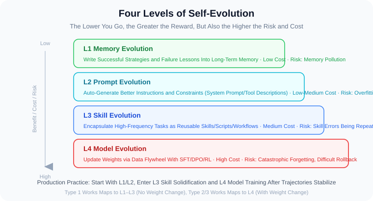

Production systems usually start with L1 and L2: first teach the Agent to "remember lessons" and "rewrite its process", and only after trajectory data is stable enough move into L3 skill crystallization and L4 model training.

> 💡 These four engineering levels complement the research coordinate system in the latter part of this chapter: the engineering levels care about "where is it safer to change first", while the research coordinate system cares about "what object the paper actually updates". Do not mix them up, but they can be mapped to each other.

---

## 11.2.3 Representative Frontier Work: The Paper Lineage of Self-Evolution

A Self-Evolution Agent is not a fixed architecture proposed by a single paper; it is the convergence of multiple research lines: **reflection-based learning, output self-correction, tool-assisted critique, lifelong skill-library learning, automatic Agent-system design, and self-modifying codebases**. Understanding this body of work clarifies exactly which level "self-evolution" can occur at.

> 📎 **Division of labor with 11.1**: This section strings these works together from the perspective of "self-evolution levels (L1–L4)"; among them, Reflexion and Voyager were already explained in detail from the perspective of "Prompt/Skill optimization methods" in the "Skill Auto-Evolution" subsection of [Section 12.1](./01_automatic_prompt_optimization.md) (with diagrams and a customer-service example). The two sections are complementary in perspective; here we only locate them by level and do not repeat the implementation details.

### Reflexion (NeurIPS 2023): Turning Reward Signals into Verbal Memory

> 📄 **Publication**: Shinn et al. (Northeastern, MIT, et al.), *Reflexion: Language Agents with Verbal Reinforcement Learning*, **NeurIPS 2023** | arXiv: [2303.11366](https://arxiv.org/abs/2303.11366)
>
> 🧬 **Evolution level**: L1 Memory Evolution | **One-liner**: Without changing weights, write failures as verbal reflections into memory, to be read back next time to avoid repeating mistakes.

**The fundamental tension it addresses**: standard reinforcement learning (e.g., PPO) must learn from sparse scalar rewards, requiring huge numbers of weight updates and hundreds of rollouts — both expensive and often infeasible for billion-parameter models accessible only through an API. Reflexion's answer is to change the **carrier of the "reward" signal from a number to natural language** — a mechanism it calls "Verbal Reinforcement Learning".

**How the three components cooperate** (a closed-loop episode):

- **Actor**: generates actions or answers based on the current context (including historical reflection memory), typically in ReAct or CoT form.
- **Evaluator**: scores the Actor's trajectory. The score source varies by task — decision tasks use the success/failure signal returned by the environment, reasoning tasks use heuristic matching, and programming tasks simply run unit tests.
- **Self-Reflection**: the soul of Reflexion. It reads "trajectory + evaluation score" and writes a **diagnostic reflection** in language (e.g., "I tried to use an item without first checking whether it was in the backpack; next time I should do an inventory check first"), storing it in a **sliding-window-style memory buffer**.

At the start of the next episode, the most recent reflections are spliced into the Actor's context, effectively giving it a checklist of "potholes I hit last time". Note: **the model weights never change; "learning" happens entirely in external memory**.

**Key results and boundaries**: it clearly surpasses the no-reflection baseline on three task types — decision-making (ALFWorld), reasoning (HotpotQA), and programming (HumanEval, pass@1 reaching 91%). But it has two implicit prerequisites — a **relatively reliable Evaluator** (otherwise reflections drift further and further based on wrong signals), and the task must allow **multiple retries** (reflections only pay off in the next similar task). This is exactly why it is classified as L1: what changes is retrievable, editable, forgettable verbal memory, not weights.

> 📎 The framework diagram and customer-service example of Reflexion are already given in [11.1.14 Skill Auto-Evolution](./01_automatic_prompt_optimization.md); we do not repeat them here.

### Self-Refine (NeurIPS 2023): Iterative Improvement of a Single Output with Self-Feedback

> 📄 **Publication**: Madaan et al. (CMU, Allen AI, et al.), *Self-Refine: Iterative Refinement with Self-Feedback*, **NeurIPS 2023** | arXiv: [2303.17651](https://arxiv.org/abs/2303.17651)
>
> 🧬 **Evolution level**: L2 Process Evolution | **One-liner**: The same model generates, critiques, and rewrites by itself, with no additional training.


*▲ Figure 1 from the original Self-Refine paper (Source: Madaan et al., NeurIPS 2023, arXiv:2303.17651)*

Self-Refine addresses another kind of self-improvement: after the model generates a draft, can it propose its own feedback and then rewrite the output based on that feedback? Its core claim is counterintuitive — **the same frozen model plays both "author" and "reviewer"; with only three different few-shot prompts it can self-iterate, never touching the weights and introducing no additional model**.

**The three-prompt-driven loop** (the paper's formal definition):

1. **Initial generation** `y₀ = M(p_gen ‖ x)`: use the task-specific generation prompt to produce a draft.
2. **Feedback** `fbₜ = M(p_fb ‖ x ‖ yₜ)`: use the feedback prompt to let the model critique its own output. A key design here — the feedback must be **both specific and actionable**: not just "this code is inefficient", but "it uses a brute-force for-loop; it should use the summation formula n(n+1)/2" — locating the specific snippet and giving a clear action.
3. **Refine** `yₜ₊₁ = M(p_refine ‖ x ‖ y₀ ‖ fb₀ ‖ … ‖ yₜ ‖ fbₜ)`: note that during refinement all previous rounds of outputs and feedback are spliced into the context, letting the model "look at its own previous error list" while rewriting, avoiding repeating the same mistake.

The loop ends when a stop condition is met (reaching the maximum number of rounds, or a "stop indicator" generated by the model itself appearing in the feedback).

**Key results and boundaries**: on 7 generation tasks (dialogue, code optimization, math, sentiment reversal, etc.), it achieves an **absolute improvement of 5%–40%** over direct generation, and up to 13% improvement over Codex on code tasks. But its fundamental difference from Reflexion is — **Self-Refine's improvement only acts on "this one output"; it is discarded when the loop ends, with no long-term memory across tasks**. So it belongs to L2 Process Evolution: what truly crystallizes is not some particular result, but the **reusable workflow template** of "generate first → multi-dimensional self-evaluate → rewrite". Its soft spot is also clear: when the model's own judgment is insufficient to spot the error (e.g., it does not even know where the answer went wrong), self-evaluation fails — exactly the gap the next paper, CRITIC, fills.

### CRITIC (ICLR 2024): Letting External Tools Participate in Critique and Correction

> 📄 **Publication**: Gou et al. (Tsinghua, Microsoft, et al.), *CRITIC: Large Language Models Can Self-Correct with Tool-Interactive Critiquing*, **ICLR 2024** | arXiv: [2305.11738](https://arxiv.org/abs/2305.11738)
>
> 🧬 **Evolution level**: L2 / L3 Validation Evolution | **One-liner**: Relying only on the model's self-evaluation confidently repeats errors; external tools must serve as the judge.


*▲ Figure 1 from the original CRITIC paper (Source: Gou et al., ICLR 2024, arXiv:2305.11738)*

CRITIC's starting point is a sharp challenge to Self-Refine: **when the model "self-evaluates", it is still using the same parametric knowledge that produced the error — which often leads it to confidently defend the error rather than discover it**. CRITIC's solution moves the role of "judge" from inside the model to the external world: it lets the model, like a human looking things up, call tools to verify each of its own claims.

**The three steps of the verify-then-correct loop**:

1. **Generate initial answer** `ŷ₀`: the model first gives an answer from its parametric knowledge.
2. **Tool-interactive verification** `cᵢ = M(p ‖ x ‖ ŷᵢ, T)`: the model wraps the external tool `T` into a uniform **text-to-text interface** — a search engine takes a query and returns retrieval results; a code interpreter takes a program and returns execution results; the same for calculators, knowledge bases, and the Perspective API. The model then generates a **critique with evidence**, e.g., "I claimed X was founded in 2019, but search results show it was 2021".
3. **Correct based on critique** `ŷᵢ₊₁ = M(p ‖ x ‖ ŷᵢ ‖ cᵢ)`: splice the critique back into the context and regenerate.

The loop "verify → correct → verify again" continues until the critique is satisfied, the maximum number of rounds is reached, or environmental feedback is received. Tools can be pre-specified per task, or the model can **automatically choose tools** via in-context learning.

**Why it is crucial to self-evolution**: CRITIC experimentally proves a red thread running through this entire chapter — **self-improvement without an external anchor is essentially self-reinforced hallucination**. It can both correct errors and detect hallucinations on free-form QA, math, and toxicity-detection tasks. Mapped to our level framework, it sits at the L2/L3 "validation" stage: it does not directly crystallize a new Skill itself, but it defines "what kind of improvement deserves to be crystallized". This is also why production-grade Self-Evolution Agents, before writing into long-term memory, updating Prompts, or solidifying Skills, **should first pass a tool verification or test-set validation** — a point that recurs throughout the frontier-research survey later (the "examiner" of CoEvoSkills, the "validation gate" of SkillOpt, and the "code-executor judge" of Absolute Zero are all incarnations of the same idea).

### Voyager (2023): A Lifelong Learning Agent with Automatic Curriculum + Skill Library + Environmental Feedback

> 📄 **Publication**: Wang et al. (NVIDIA, Caltech, et al.), *Voyager: An Open-Ended Embodied Agent with Large Language Models*, **TMLR 2024** (first public in 2023) | arXiv: [2305.16291](https://arxiv.org/abs/2305.16291)
>
> 🧬 **Evolution level**: L3 Skill Evolution | **One-liner**: In Minecraft, automatically propose tasks and crystallize successful code into a reusable skill library.

Voyager is the representative work that took the Self-Evolution Agent to L3 Skill Evolution. The previous three papers (Reflexion / Self-Refine / CRITIC) were still operating at the level of "rewriting a piece of text"; Voyager for the first time upgraded "experience" into **executable, composable, permanently storable code skills**, and made the entire learning process decoupled from human step-by-step instructions, fully self-driven. Three core components interlock:

1. **Automatic Curriculum**: GPT-4 dynamically proposes a "difficulty-just-right" new task based on the Agent's current state, mastered skills, and exploration progress (e.g., "you now have a wooden pickaxe, go mine stone"). This is essentially a built-in "task proposer", pushing learning forward along the capability frontier instead of getting stuck on tasks that are too hard or too easy.
2. **Skill Library**: whenever the Agent successfully completes a task, it stores that verified **JavaScript code** together with an embedding of a functional description into the skill library; when facing a new task it retrieves the most relevant skills semantically and splices them in as callable subroutines. Skills can compose hierarchically ("craft stone pickaxe" reuses "gather wood"), so capability accumulates like a snowball.
3. **Iterative Prompting**: the written code is first run in the environment, and execution errors, environmental feedback, and self-verification are spliced back into the context for repeated correction, until the skill is stably usable before it enters the library — this step is the landing of CRITIC's "external verification" idea in an embodied scenario.

**Why it is a milestone**: in Minecraft, Voyager far surpassed previous methods in unique items obtained, exploration mileage, and tech-tree unlock speed, and **the skill library can transfer zero-shot to new worlds**. It corresponds to L3 — crystallizing successful trajectories into callable Skills, and is also the ideological origin of almost all of today's "tool-based skill libraries / Skill systems" (including the entire SkillRL lineage later). Its boundary is a strong dependence on an environment that is **code-executable with immediate feedback**; without such strong verification signals, skill quality is hard to guarantee.

> 📎 The skill-library code example of Voyager is already given in [11.1.14 Skill Auto-Evolution](./01_automatic_prompt_optimization.md); we do not repeat it here.

### ADAS (ICLR 2025): Automatically Searching for and Designing the Agent System Itself

> 📄 **Publication**: Hu et al. (UBC, Vector Institute, et al.), *Automated Design of Agentic Systems*, **ICLR 2025** | arXiv: [2408.08435](https://arxiv.org/abs/2408.08435)
>
> 🧬 **Evolution level**: System-level Evolution (between L2→L3) | **One-liner**: Let a "meta-agent" automatically write, test, and archive new Agent architectures.

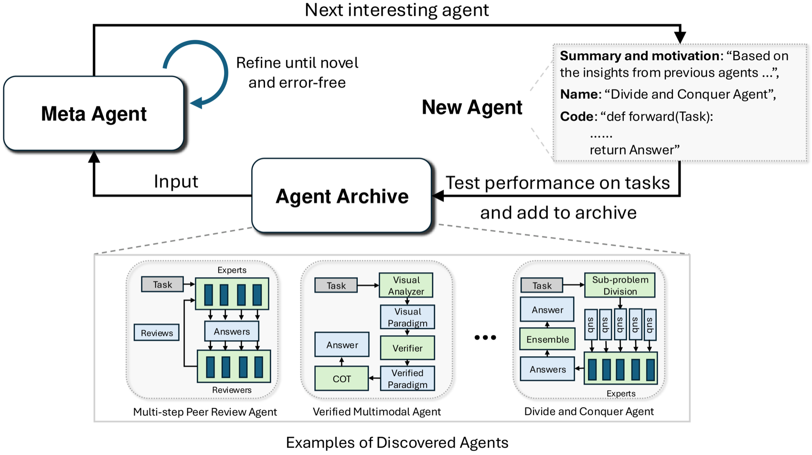

*▲ Figure from the original ADAS paper (Source: Hu et al., ICLR 2025, arXiv:2408.08435)*

ADAS pushes self-evolution to a more abstract level: the previous papers all changed "some internal part of the Agent" (memory, prompts, a single skill), while ADAS changes **the design diagram of the entire Agent system itself**. It proposes a bold hypothesis — since languages like Python are Turing-complete, representing "the entire Agent system" (prompts, tool calls, control flow, multi-Agent structure, all of it) **as code** means a search algorithm can in principle discover **any possible Agent architecture**.

It formalizes this as the three elements of the ADAS problem:

- **Search space**: all Agents that can be written in code — determines "which systems are representable". Using code as the carrier means the search space is nearly infinite.
- **Search algorithm (Meta Agent Search)**: a "meta-agent" (using GPT-4) **iteratively writes new Agents like writing programs**: each round, referencing a growing "archive of historical discoveries", it proposes an interesting new architecture, tests it on tasks, stores the result together with the code back into the archive, and then uses the archive to inspire the next round. This "archive-driven open-ended exploration" borrows from the ideas of FunSearch / neural architecture search.
- **Evaluation function**: uses accuracy, F1, cost, latency, or safety to score candidate Agents, as the optimization objective for the meta-agent.

**Key results**: on ARC logic puzzles the meta-agent progressively discovered designs surpassing the SOTA handcrafted Agent; on four standard benchmarks, the discovered Agents improved DROP reading-comprehension F1 by **13.6/100** and MGSM math accuracy by **14.4%**. Most strikingly, **transferability** — an Agent searched for math, moved directly to GSM8K / GSM-Hard, still improved by **25.9% / 13.2%** respectively, and could even transfer from math to the dissimilar domain of reading comprehension. From the level perspective, ADAS sits at system-level evolution between L2→L3: what it upgrades is not a single memory or a single skill, but the Agent's overall workflow orchestration. Its key difference from the next paper SICA is — **in ADAS the meta-agent and the target Agent are two separate entities; the meta-agent optimizes others, not itself**.

### SICA (2025): A Self-Improving Coding Agent That Can Edit Its Own Codebase

> 📄 **Publication**: Robeyns et al., *A Self-Improving Coding Agent*, arXiv preprint 2025 | arXiv: [2504.15228](https://arxiv.org/abs/2504.15228)
>
> 🧬 **Evolution level**: Code-level Evolution (most aggressive) | **One-liner**: Eliminate the boundary between the meta-agent and the target agent; the Agent directly rewrites its own code.


*▲ Figure from the original SICA paper (Source: Robeyns et al., 2025, arXiv:2504.15228)*

SICA pushes self-evolution to its logical endpoint, touching the most aggressive question: can a coding Agent **directly rewrite its own source code**, making itself faster, cheaper, and stronger on subsequent tasks? Its critique of ADAS hits the nail on the head — in ADAS the meta-agent modifies "another" Agent, so strictly speaking it is **not self-improvement**; SICA instead **eliminates the boundary between the meta-agent and the target agent**: the same Agent is both the object being modified and the one doing the modifying.

**Its loop (Meta Agent Loop)**: starting from a minimal piece of code "just enough to support self-improvement" (able to toggle/edit files, run terminal commands), it enters a "benchmark → meta-improvement" loop — the Agent observes its own bottlenecks on the benchmark (where it is slow, where expensive, where wrong), proposes code-level changes (inventing new prompting strategies, new tools, new workflows), rewrites its own implementation, and then uses the benchmark to validate whether the change is truly effective. Its motivation is a seductive "compound interest" hypothesis: **improvements in coding ability will make the next round of self-improvement better, thus growing stronger and stronger**.

**Key results and cost**: on a random subset of SWE-Bench Verified, SICA self-improved its own performance from **17% all the way to 53%** — and this was achieved under safety constraints. But it also most directly exposes the danger of this path: a single wrong self-modification can break safety boundaries, tool protocols, or task stability, and "judging your own changes" inherently carries reward-hacking risk (exactly the "evaluator collapse" to be wary of later). Therefore the paper emphasizes that any "self-modifying code" system must be equipped with:

- A sandboxed execution environment;
- A regression test set;
- Version control and rollback mechanisms;
- Permission boundaries;
- Human approval or canary-release processes.

### Paper Lineage Summary

| Representative work | Self-evolution level | Core question | Core mechanism | Engineering insight |
|---------------------|----------------------|---------------|----------------|---------------------|
| **Reflexion** | L1 Memory Evolution | Can it learn from failure without changing weights | Feedback → verbal reflection → memory buffer | Write failure attribution as retrievable experience |
| **Self-Refine** | L2 Process Evolution | Can a single output self-rewrite to get better | Generate → Feedback → Refine | Crystallize self-evaluation and rewriting into a task template |
| **CRITIC** | L2/L3 Validation Evolution | How to avoid hallucination in self-criticism | Tool verification → critique → correction | Important improvements must pass external validation |
| **Voyager** | L3 Skill Evolution | Can an Agent learn lifelong in an open environment | Automatic curriculum + executable skill library + environmental feedback | Crystallize successful trajectories into callable Skills |
| **ADAS** | System-level Evolution | Can better Agent architectures be designed automatically | Search space + search algorithm + evaluation function | Let workflows, module composition, and control flow participate in evolution |
| **SICA** | Code-level Evolution | Can an Agent modify its own codebase | Self-diagnosis + code modification + benchmark validation | Any self-modifying system must have sandbox, tests, and rollback |

These papers jointly show that Self-Evolution is not a slogan of "let the Agent self-improve", but a set of mechanisms that strengthen layer by layer. From Reflexion's verbal memory, to Voyager's skill library, to ADAS/SICA's system-level and code-level improvements, each layer requires stricter evaluation and safety boundaries.

---

## 11.2.4 The System Architecture of a Self-Evolution Agent

A controllable self-evolution system usually contains six modules:

1. **Executor**: completes user tasks, calls tools, retrieves materials, and generates results.
2. **Trajectory Logger**: saves inputs, plans, tool calls, observations, final outputs, and costs.
3. **Evaluator**: judges whether the task succeeded, whether the process was reliable, and whether there were safety issues.
4. **Critic / Diagnoser**: analyzes the causes of success or failure and locates improvement points.
5. **Evolution Engine**: turns improvement points into memory, Prompt patches, Skills, or training samples.
6. **Validator**: validates in regression tests and a sandbox whether the improvement is truly effective.

```text
┌──────────────┐
│ User task     │
└──────┬───────┘
       ↓
┌──────────────┐      ┌──────────────┐
│ Executor     │─────→│ Trajectory   │
│ Run task     │      │ Logger       │
└──────┬───────┘      └──────┬───────┘
       ↓                     ↓
┌──────────────┐      ┌──────────────┐
│ User result   │      │ Evaluator    │
└──────────────┘      └──────┬───────┘
                              ↓
                       ┌──────────────┐
                       │ Diagnoser    │
                       └──────┬───────┘
                              ↓
                       ┌──────────────┐
                       │ Evolution    │
                       │ Engine       │
                       └──────┬───────┘
                              ↓
                       ┌──────────────┐
                       │ Validator    │
                       └──────┬───────┘
                              ↓
                    Memory / Prompt / Skill / Training data
```

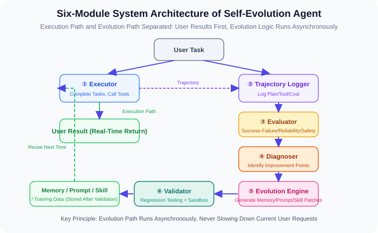

The key principle is: **separate the execution path from the evolution path**. User requests should be handled stably, and the evolution logic is best run asynchronously, so that every conversation is not slowed down by "self-analysis".

---

## 11.2.5 The Self-Evolution Loop: Learning from a Single Failure

Suppose a coding Agent made an error while modifying a project: without first reading the latest file content, it directly performed a replacement based on stale context, causing the patch to fail.

A Self-Evolution Agent should not just return "replacement failed", but should extract a reusable lesson:

```json
{
  "event": "patch_failed",
  "failure_reason": "used_stale_context_before_search_replace",
  "lesson": "Before performing an exact replacement, you must first read the target file's latest content and copy the real context as the old_string.",
  "trigger": "replace_in_file or search-and-replace edit",
  "future_rule": "For an exact replacement, read the file first; do not use stale content from a summary as the basis for replacement.",
  "confidence": 0.92
}
```

Next time a similar task comes up, the Agent can automatically apply this rule instead of repeating the mistake.

This is the minimal closed loop of self-evolution:

1. **Detect failure**: tool failure, test failure, user correction, low evaluation score.
2. **Attribute failure**: not just record "it failed", but find the actionable cause.
3. **Abstract the lesson**: turn the concrete error into a future-reusable rule.
4. **Validate the lesson**: confirm this rule will not harm other tasks.
5. **Apply the lesson**: trigger automatically in similar scenarios.

---

## 11.2.6 Implementation Skeleton: A Lightweight Self-Evolution Agent

Below is a simplified version showing the key data structures and control flow of a self-evolution system.

```python
from dataclasses import dataclass, field
from datetime import datetime
from typing import Literal
import json


@dataclass
class AgentEvent:
    """A single Agent run event"""
    task: str
    plan: list[str]
    actions: list[dict]
    final_answer: str
    success: bool
    feedback: str | None = None
    cost_tokens: int = 0
    created_at: str = field(default_factory=lambda: datetime.now().isoformat())


@dataclass
class EvolutionPatch:
    """A single candidate evolution patch"""
    patch_type: Literal["memory", "prompt", "skill", "training_sample"]
    content: str
    trigger: str
    expected_benefit: str
    risk: str
    confidence: float


class SelfEvolutionAgent:
    """A lightweight self-evolution Agent"""

    def __init__(self, base_agent, evaluator, memory_store):
        self.base_agent = base_agent
        self.evaluator = evaluator
        self.memory_store = memory_store
        self.pending_patches: list[EvolutionPatch] = []

    def run(self, task: str) -> str:
        """Execute the user task and asynchronously produce evolution candidates"""
        event = self._execute(task)

        # User result is returned first; evolution logic can be put into a background queue
        patches = self._reflect_and_propose(event)
        verified = self._validate_patches(patches)
        self._apply_patches(verified)

        return event.final_answer

    def _execute(self, task: str) -> AgentEvent:
        """Execute the task and record the trajectory"""
        result = self.base_agent.run(task)
        score = self.evaluator.evaluate(task, result)

        return AgentEvent(
            task=task,
            plan=result.get("plan", []),
            actions=result.get("actions", []),
            final_answer=result.get("answer", ""),
            success=score["success"],
            feedback=score.get("feedback"),
            cost_tokens=result.get("cost_tokens", 0),
        )

    def _reflect_and_propose(self, event: AgentEvent) -> list[EvolutionPatch]:
        """Generate improvement suggestions based on the success/failure trajectory"""
        patches = []

        if not event.success:
            patches.append(EvolutionPatch(
                patch_type="memory",
                content=f"Task failure experience: when facing a similar task `{event.task}`, first check the failure cause: {event.feedback}",
                trigger=self._infer_trigger(event),
                expected_benefit="Reduce repeated occurrence of the same error",
                risk="May over-generalize an incidental failure into a general rule",
                confidence=0.75,
            ))

        if event.success and len(event.actions) >= 3:
            patches.append(EvolutionPatch(
                patch_type="skill",
                content=self._summarize_successful_workflow(event),
                trigger=self._infer_trigger(event),
                expected_benefit="Crystallize multi-step successful processes into reusable skills",
                risk="The process may only apply to the current environment",
                confidence=0.68,
            ))

        return patches

    def _validate_patches(self, patches: list[EvolutionPatch]) -> list[EvolutionPatch]:
        """Validate candidate patches, filtering out high-risk or low-confidence improvements"""
        verified = []
        for patch in patches:
            if patch.confidence < 0.7:
                continue
            if "bypass permissions" in patch.content or "ignore safety" in patch.content:
                continue
            verified.append(patch)
        return verified

    def _apply_patches(self, patches: list[EvolutionPatch]):
        """Apply the improvements that passed validation"""
        for patch in patches:
            if patch.patch_type == "memory":
                self.memory_store.save({
                    "trigger": patch.trigger,
                    "content": patch.content,
                    "confidence": patch.confidence,
                    "created_at": datetime.now().isoformat(),
                })
            else:
                self.pending_patches.append(patch)

    def _infer_trigger(self, event: AgentEvent) -> str:
        """Infer the future trigger condition from the task and actions"""
        if any(action.get("tool") == "search" for action in event.actions):
            return "Tasks that require retrieval or research"
        if any(action.get("tool") == "code_edit" for action in event.actions):
            return "Tasks that require modifying code"
        return "Similar tasks"

    def _summarize_successful_workflow(self, event: AgentEvent) -> str:
        """Summarize the successful trajectory into a skill draft"""
        steps = "\n".join(f"{i + 1}. {step}" for i, step in enumerate(event.plan))
        return f"Successful workflow:\n{steps}\nApplicable task: {event.task}"
```

This example is deliberately kept simple, but it already embodies the core idea of a Self-Evolution Agent: **instead of training the model every time, first turn experience into low-cost, verifiable, rollback-able system assets**.

---

## 11.2.7 How to Decide Whether an "Evolution" Is Worth Keeping?

The most dangerous part of a self-evolution system is that it may crystallize wrong experience. Therefore, every evolution patch should be evaluated.

| Check item | Question | Handling on failure |
|------------|----------|---------------------|
| **Reproducibility** | Does this problem recur multiple times? | Keep only as a temporary memory, do not write into a long-term rule |
| **Generalizability** | Does the experience apply to a class of tasks, not a single case? | Narrow the trigger scope |
| **Safety** | Does it encourage bypassing permissions, hiding errors, or ignoring user intent? | Reject directly |
| **Benefit** | Does it significantly improve success rate, speed, or quality? | Do not deploy, only keep for observation |
| **Regression risk** | Will it make other tasks worse? | Enter A/B testing or human review |
| **Rollback-ability** | Can it be undone if something goes wrong? | Do not allow automatic rollout |

A practical rule is:

> **Memory can be written automatically, Prompts and Skills require semi-automatic review, and model-weight updates must be evaluated offline before deployment.**

---

## 11.2.8 The Relationship Between Self-Evolution and the Agentic Data Flywheel

The Self-Evolution Agent and the [data flywheel in Section 12.3](./03_data_flywheel.md) are not two independent concepts, but the same closed loop expressed at different levels.

| Perspective | Self-Evolution Agent | Agentic Data Flywheel |
|-------------|----------------------|-----------------------|
| **Focus** | How system behavior self-improves | How model capability is enhanced through data training |
| **Update target** | Memory, Prompt, Skill, process, evaluation rules | Training data, reward model, policy model |
| **Iteration speed** | Fast, can update by day or even by task | Slow, usually trained and released by week or month |
| **Risk control** | Rule validation, sandbox, rollback | Offline evaluation, benchmark testing, canary release |
| **Best use** | Quickly absorb experience, fix process problems | Improve the model's underlying capability and generalization |

In mature teams, the two are usually chained:

```text
Self-Evolution Agent
  ↓ produces high-quality experience, failure attribution, skill drafts
Agentic Data Flywheel
  ↓ filters, labels, trains, evaluates
Stronger Agent model
  ↓ deployed back into the execution system
Produces higher-quality trajectories
```

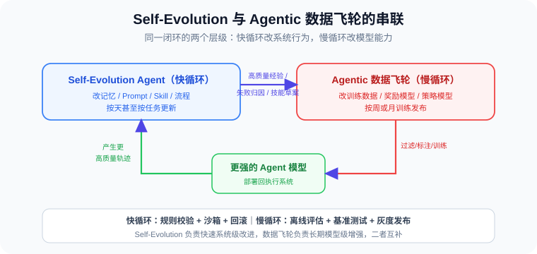

---

## 11.2.9 Risks and Boundaries

A Self-Evolution Agent sounds attractive, but you must avoid "uncontrolled self-modification". In production, adhere to the following boundaries:

1. **Cannot automatically relax safety policies**: any change that lowers permissions, auditing, sandboxing, or privacy protection must be human-approved.
2. **Cannot treat a single user preference as a global rule**: a user's personalized preference should be written into user-level memory, not a system-level policy.
3. **Cannot learn only from success samples**: failure samples are equally important, otherwise the Agent learns fragile shortcuts.
4. **Cannot skip regression testing**: Prompt, Skill, and model updates can all cause hidden degradation.
5. **Cannot let evolution logic affect current-task stability**: evolution should run asynchronously, with user tasks taking priority.

---

## 11.2.10 Practical Deployment Roadmap

To build a Self-Evolution Agent from scratch, proceed along the following roadmap:

```text
Phase 1: Record trajectories
  - Save tasks, plans, tool calls, results, user feedback

Phase 2: Automatic evaluation
  - Establish metrics for success rate, cost, tool error rate, user satisfaction

Phase 3: Failure attribution
  - Classify failures into tool errors, planning errors, insufficient information, insufficient permissions, format errors, etc.

Phase 4: Memory evolution
  - Write high-confidence experience into long-term memory and retrieve by trigger condition

Phase 5: Skill evolution
  - Encapsulate high-frequency successful processes into Skills and pass regression tests

Phase 6: Data flywheel
  - Feed high-quality trajectories and failure-contrast samples into SFT / DPO / RL training
```

---

## 11.2.11 Frontier Research Panorama: Technical Routes and Research Gaps

The previous sections answered "how to build a controllable self-evolution system" from an engineering perspective. But if we switch to the research frontier of 2025–2026, another question needs answering: **what exactly are these papers evolving, who is being trained, who is frozen, and which links are still missing?**

To avoid confusion with the engineering-implementation levels `L1–L4` from 11.2.2, the four-level coordinate in the research survey below is renamed `R1–R4`: `R1` denotes the parameter level, `R2` the skill level, `R3` the memory level, and `R4` the system level. The former cares about "what is safer to change first in engineering", while the latter cares about "what object the paper actually updates".

After reading this section, you will be able to:

- Use `R1–R4` to judge whether a self-evolution work is updating model weights, Skills, memory, or workflows;
- Use the "proposer / solver / summarizer" three-role perspective to judge which module the training resources are invested in;
- See clearly the most noteworthy research gap today: **the training of the summarizer itself**, and the cross-direction of "fully autonomous + training the summarizer".

### 11.2.11.1 A Research Coordinate System: What Exactly Is "Evolution" in a Paper?

To impose order on a dozen papers of wildly different styles, the best method is not to list them, but to first ask a fundamental question: **when we say an Agent has "evolved", which part of it actually changed?**

Take an LLM Agent apart and it is really composed of only four things:

- **Policy π**: the function that makes decisions, which may hide in the model weights or exist only in the current context;
- **Skill S**: reusable procedural knowledge, usually a set of Markdown documents ("how to do a certain class of tasks" operation manuals);
- **Memory K**: the long-term state about the world and historical interactions (facts, preferences, potholes hit);
- **Environment E**: the interactive world (web, code, sandbox, operating system).

So-called "self-evolution" is to define an update operator T that reads in the environment and interaction trajectories and updates (π, S, K) into a stronger version. **Depending on which object T updates**, the work of 2024–2026 roughly falls into four levels — this is the coordinate system running through this section:

| Level | Evolution target | Update method | Cost | Representative work |
|-------|------------------|---------------|------|---------------------|
| **R1 Parameter level** | Policy π (model weights) | SFT / RL | Most expensive, requires GPU training | EvolveR, SAGE, SkillRL, SKILL0, SkillOS, AgentEvolver, Agent0 |
| **R2 Skill level** | Skill S (Skill documents) | distill + verify + reuse | Medium, relies on LLM calls | AutoSkill, EvoSkill, CoEvoSkills, SE-Agent, SkillOpt |
| **R3 Memory level** | Memory K (experience entries) | explore + summarize + score | Medium-low | MemSkill, MemRL |
| **R4 System level** | Workflow / orchestration | inference-time only, no training | Lowest | Production-grade Harness, Skill runtime |

> 💡 **One-sentence intuition**: R1 is "practicing instinct into the bones", R2/R3 is "growing a toolbox and a notebook", and R4 is "optimizing the working process". The mainstream of 2025–2026 is R2 + R3, while R1 usually serves as their base via a "training-testing decoupling" approach. This section focuses on the most active R1, R2, R3; R4 has been detailed in Chapter 8's Harness engineering.

#### Why Is This Ignited Now?

The demand for self-evolution essentially aims to circumvent four chronic difficulties of large models: **static knowledge** (cognition frozen after training), **limited context** (multi-turn interaction eventually "loses the thread"), **repeating mistakes** (taught today, repeated tomorrow), and **expensive training** (to get stronger you must rerun SFT/RL). The core goal is just one sentence:

> **Let the by-products of interaction (trajectories, success/failure, lessons) become an extension or update channel of model capability, rather than relying on manual data feeding every time.**

This idea is not new academically (reinforcement learning + experience replay is the prototype), but it was reignited in the large-model era because three new conditions matured simultaneously: LLMs themselves acquired **summarization** ability (can write their own notes), Agent products brought real **long-horizon interaction** scenarios, and increasingly expensive high-quality human annotation forced the community to explore **"low-human / no-human"** routes.


#### The Second Ruler: Whether It Depends on Human Data

R1–R4 answers "what evolves"; there is another orthogonal ruler answering "where does the fuel of evolution come from" — **whether it depends on human-labeled data**. The vast majority of work (regardless of level) still relies on a dataset's Ground Truth or human feedback for training signals; only a very few radical works achieve **zero human data**, letting Agents propose and examine tasks for each other. Crossing these two rulers precisely locates any paper. Below we proceed in the order **R2 Skill level → R3 Memory level → R1 Parameter level → zero-data self-learning**, because this also roughly is the capability progression line of "from not changing weights to changing weights, from depending on data to escaping data".

---

### 11.2.11.2 R2 Skill Level: Crystallizing Experience into Reusable Skills (Without Changing Weights)

> **Common feature of this level**: the base model is frozen throughout; all "growth" happens in external Skill documents. Like giving the Agent an "external brain" — the main body does not move, the capability grows on the add-on.

This level best embodies the most plain intuition of "self-evolution": after finishing the work, write the useful tricks down as a Skill; next time you face a similar task, pull it out and follow it. What truly separates the various works is three progressively deeper questions — **how are Skills generated? how is quality guaranteed? how to continuously optimize without accumulating chaos?** Following this thread, we go from the most basic AutoSkill all the way to the most highly engineered SkillOpt.

#### AutoSkill: Dynamic Add/Delete/Modify/Query of Skills

> 📄 **Original**: arXiv [2603.01145](https://arxiv.org/abs/2603.01145) | 🧬 **Level**: R2 | **One-liner**: The most basic dual-loop architecture, preventing the Skill library from growing unbounded via dynamic add/delete/modify/query.

AutoSkill answers the most introductory question at this level: **where do Skills come from, how are they used, and how to avoid accumulating chaos?** Its answer is a very classic **dual-loop structure** — one loop is responsible for "using", the other for "modifying".

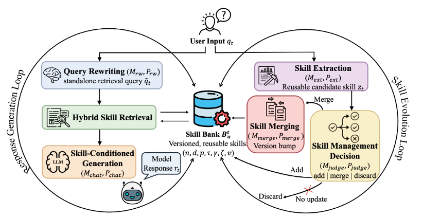

**Left loop — online service (using Skills)**, essentially a memory-backed RAG pipeline:

- **Query rewriting**: rewrite the user's original question into a form more suitable for retrieval (colloquial → retrieval-friendly);
- **Hybrid skill retrieval**: semantic similarity (Embedding) + lexical relevance (BM25) dual-channel recall, balancing "similar meaning" and "similar wording";
- **Skill-injected generation**: render the retrieved skills as external-memory context and splice them into the prompt for the model to reference.

**Right loop — skill evolution cycle (modifying Skills)**, where it differs from ordinary RAG:

- **Skill extraction**: extract reusable skill candidates from interaction signals;
- **Candidate skill management**: for each candidate decide **Add (new) / Merge (into existing) / Discard**, a gate that controls library size;
- **Versioned merge**: do a "semantic union" update on merge, preserving skill identity and incrementing the version number, thus traceable.

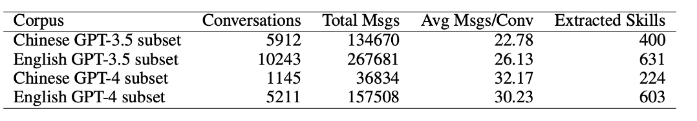

**Its soft spot precisely points out the common ailment of the whole level**: although the evaluation dataset used **WildChat-1M**, the paper only counts "how many Skills were extracted", **without any end-to-end performance metric**. That is, it proves "can automatically accumulate Skills and the library does not explode", but does not prove "these Skills actually make the Agent stronger". **Missing evaluation** is the most common and most fatal shortcoming of the entire R2 level — the contributions of CoEvoSkills and SkillOpt later are largely filling this hole.

#### EvoSkill: Turning "Failure" into a "New Skill"

> 📄 **Original**: arXiv [2603.02766](https://arxiv.org/abs/2603.02766) | 🧬 **Level**: R2 | **One-liner**: Three Agents divide the work to distill "failure" into a new Skill, then use a Pareto-front mechanism to keep the library "refined not bloated".

If AutoSkill solved "how to accumulate and not explode", EvoSkill goes further, answering "**how to use failure experience**". Traditional Agents retry on failure; EvoSkill turns this clumsy method into "**failure is learning**" — every failure is the raw material for a new Skill. Its biggest feature is treating Skill as a first-class citizen that can be upgraded, rather than just doing textual patching at the prompt / code level.


**Three-Agent division:**

- **Executor Agent**: runs tasks with the current Skill library and fully records failure cases — failure cause, trajectory, and final erroneous result are archived together. This is the "raw material" for all subsequent evolution.
- **Proposer Agent**: plays the role of a "diagnostic doctor". After reading the failure record, it first does root-cause analysis (why did it fail? missing skill? or wrong skill used?), then based on past feedback history decides whether to create a new Skill or modify an existing one — for example, in a financial-document QA task it automatically summarizes a reusable skill like *data extraction validation*.
- **SkillBuilder Agent**: turns the Proposer's natural-language proposal into a structured Skill folder (with meta-info, operation steps, auxiliary scripts), and runs a round of unitized validation on a small-sample validation set.

**Core mechanism — Pareto Frontier elite pool**: newly generated Skills are not dumped into the library blindly, but compared with existing Skills on multi-dimensional metrics; only those **strictly better on at least one dimension** than existing Skills enter the elite pool, otherwise they are discarded or merged. This mechanism keeps the Skill library "refined not bloated" as it grows — also its biggest difference from AutoSkill's "keep-all + versioning" approach.

**Evaluation highlights:**

- **OfficeQA main task** (a complex numerical-reasoning task based on ~89K pages of scanned financial documents): baseline accuracy 60.6% → after evolution **67.9% (+7.3pp)**, mainly propped up by two self-learned Skills:
  - *Data extraction validation* — solved the common "cell misalignment" problem in table parsing;
  - *Quantitative analysis with checkpoints* — forcibly adds checkpoints in the financial numerical-computation step.
- **Cross-task transfer**: the *search persistence protocol* learned on SealQA was directly moved to the BrowseComp task, bringing a **+5.3pp** improvement without retraining — showing that as long as a Skill is abstracted generally enough, it can transfer across tasks, but the precondition is choosing the right abstraction level.

> ⚠️ Note: although called a "training set", it is only used for summarization, not to update any model.

**Comment**: within the R2 Skill level, EvoSkill is the middle tier of "engineering degree" — adding an elite-pool filtering mechanism over AutoSkill. Its true value is explicitly writing "failure" into the evolution closed loop, which also became the direct inspiration for much later work (including the failure-trajectory distillation of the R1-level SkillRL).

#### MemSkill: Evolving Only the "Memory-Operating Skills"

> 📄 **Original**: arXiv [2602.02474](https://arxiv.org/abs/2602.02474) | 🧬 **Level**: between R2/R3 | **One-liner**: Previous works evolve Skills for "how to solve problems"; MemSkill evolves only Skills for "how to manage memory", and uses RL to train a lightweight Controller.

Both AutoSkill and EvoSkill evolve Skills oriented to user tasks; MemSkill's cut is unique — it focuses only on **"Skills that operate Memory"** (when to write, when to retrieve, what to write), essentially standing at the boundary of R2 (skill) and R3 (memory). Its other highlight is breaking components very finely, and rarely introducing a small piece of RL training at this level.


What is interesting about this work is its fine component breakdown:

- **Retriever**: similarity computation based on a small Embedding model;
- **Controller**: MLP structure, **trained with RL** (note this is a rare "has training" link in this category);
- **Executor / Designer / Base LLM**: all frozen.

It has two parallel update Loops:

- **Controller update**: Retriever extracts Memory + dialogue → Controller selects Skill → Executor updates Memory library → trains Controller using downstream F1 / Success Rate as reward;
- **Skill library update**: Hard Cases encountered during training are handed to Designer to update the Skill library.


**Highlight — Transfer Evaluation:**

- The Controller & Skill trained on LLaMA remain effective when migrated to Qwen;
- The Controller & Skill trained on LoCoMo remain effective when migrated to LongMemEval.

Since the Base LLM is unchanged, it still counts as "no-training". But MemSkill offers the previous two works a reference idea: **build Skills on the training set, evaluate on the test set / other datasets**. Of course, with this approach "the order of samples fed to the Agent" becomes very important.

#### MemRL: Training "Memory Retrieval" Itself as an RL Policy

> 📄 **Original**: arXiv [2601.03192](https://arxiv.org/abs/2601.03192) | 🧬 **Level**: R3 (Memory level) | **One-liner**: Without changing LLM weights, model "which memory to retrieve" as an MDP, using non-parametric RL to make the Agent increasingly good at picking experience at runtime.

The previous works' "evolution" happened on Skill documents; MemRL concentrates its firepower on **memory retrieval**, and offers a sharp critique: **traditional RAG retrieval is "passive" — it only looks at whether a candidate memory and the current query "look alike" (semantic similarity), completely ignoring whether that memory "was useful" (whether it brought success).**

MemRL's core insight borrows from humans' "constructive episodic simulation": we recall the past not to recite, but to synthesize new plans, and we **remember which experiences succeeded and which failed**. It formalizes this as — **modeling "which memory to retrieve" as a Markov Decision Process (MDP)**:


- **Capability decoupling**: stable reasoning ability is handed to the **frozen LLM** (ensuring core intelligence stays online), while plastic adaptation ability is handed to a **dynamic external memory module**;
- **Retrieval as decision**: given the current state, "which experiences to recall" is an action whose benefit is provided by downstream task success/failure as reward;
- **Non-parametric RL update**: training adjusts the **value weights of memory entries** (which experience deserves to be recalled), not model parameters — thus naturally **finetune-free, no catastrophic forgetting**.

To put it in one analogy: **give a genius (frozen LLM) a notebook that scores itself, optimizing only the weights of the notes, without operating on the brain.** It and MemSkill are a pair of mirrors at the R3 level — MemSkill trains "the policy network for how to manage memory", MemRL trains "the retrieval policy for how to rank memory entries"; both verify the same thing: **even with the base model frozen, doing RL only at the memory level lets the Agent keep getting stronger after deployment.**

#### CoEvoSkills: Giving Each Skill a "Examiner"

> 📄 **Original**: arXiv [2604.01687](https://arxiv.org/abs/2604.01687) | 🧬 **Level**: R2 | **One-liner**: Give each new Skill a Verifier "examiner" that must pass the exam before entering the library — bringing software engineering's "unit testing" into Skill evolution.

CoEvoSkills directly targets the common soft spot of AutoSkill / EvoSkill: **Skills are put into the library right after generation, with quality entirely relying on the LLM's self-discipline.** Its answer is blunt — you cannot rely on self-discipline, you need a validation closed loop. This is also the first frontal response to the "missing evaluation" ailment at the beginning of 11.2.11.2.


**Core component — Generator + Verifier twin stars:**

- **Skill Generator**: distills candidate Skills from execution trajectories. Besides writing the Skill itself (description + steps), it also synchronously generates corresponding **unit tests** (input examples, expected output, validation logic).
- **Skill Surrogate Verifier**: runs the Generator's Skill and unit tests in an isolated sandbox environment, returning structured validation feedback (not a simple pass/fail, but natural-language feedback with "failure reason" and "suggested modification direction").
- **Co-Evolution Iteration**: Skill and Test evolve simultaneously — somewhat like TDD's "write tests before code" in traditional software development. They constrain each other, gradually converging to a steady state of "high-quality Skill + high-rigor Test".

**Two-stage validation:**

- **Surrogate validation (cheap)**: the built-in Verifier gives feedback directly, runs fast, enables rapid iteration;
- **Oracle validation (expensive but authoritative)**: Skills that pass the Surrogate must also run end-to-end tasks on a real LLM Agent; only those that truly solve the task count as "evolution successful".


**Highlight conclusion — Self-evo outperforms Cross-model Transfer:**

The paper ran an interesting controlled experiment, directly transferring the Skills self-evolved by a strong model to a weak model, and comparing it with letting the weak model self-evolve itself. The result:

- **self-evo** (strong model uses its own Skills): the strong model improved from ~30% to ~70% (+40 magnitude);
- **cross-model transfer** (giving the strong model's Skills to the weak model): also improved, but the absolute value was significantly lower than letting the model self-evolve.

The implication is: **Skills are coupled with the model's own "style"** — Skills generated by a strong model work best on the strong model itself; forcibly migrating to a weak model, the weak model may not be able to completely "read and execute" those elaborate steps. A very practical engineering conclusion: **rather than spending big money having a closed-source strong model distill Skills for your product, let the small model your product actually uses do self-evo** — the former is expensive and not necessarily better.

> ⚠️ Note: although there is a "signal", there is actually no training involved, only rejecting Skills created by the Generator.

**Comment**: CoEvoSkills' "test-driven Skill evolution" idea is unique at the R2 level, essentially using the Verifier as a "cheap reward model" — this is already very close to the logic of training a Curator at the R1 level, just one step short: also training the Verifier.

#### SE-Agent: From "Single-Thread Deep Patching" to "Multi-Thread Lateral Fusion"

> 📄 **Original**: arXiv [2508.02085](https://arxiv.org/abs/2508.02085) (NeurIPS 2025) | 🧬 **Level**: R2 (but no long-term Skill library) | **One-liner**: Rather than repeatedly self-reflecting on one trajectory, run multiple trajectories at once and let them learn from and fuse with each other.

SE-Agent targets the common shortcoming of all previous self-refine / ReAct works — **the narrow field of view of single-trajectory reflection**: when one path dead-ends, no matter how you reflect you cannot jump out of that path's mental set. Its breakthrough switches self-evolution from "vertically digging deep into one trajectory" to "laterally fusing multiple trajectories".


**Complete five-stage flow:**

1. **Multi-Strategy Generation**: sample N trajectories using different "personalities". The paper gives 5 typical strategies — P-greedy (greedy fast output), P-tests-first (write tests first), P-linter-aware (care about code style), P-defensive (defensive programming), P-minimal (minimal viable).
2. **Revision**: independently do a round of traditional self-refine on each trajectory — this step is "vertical" (deepening a single trajectory).
3. **Quality-based Filtering**: use a composite scoring function `Reward(t,T) = α·TaskCompletion(t) + β·ReasoningQuality(t) + γ·Efficiency(t)` to score each trajectory, cutting candidates from 10 to 5.
4. **Recombination ⭐ core innovation**: three operations on the remaining 5 high-scoring trajectories:
   - **Crossover**: graft "trajectory A's precise positioning at step 5" onto "trajectory B's comprehensive test coverage";
   - **Transfer**: migrate "the try-except exception handling learned in the defensive strategy" to "the position lacking exception handling in the greedy strategy";
   - **Restructure**: identify global patterns shared across multiple trajectories, abstract them uniformly, then do a system-level rewrite once.
5. **Final Solution Selection**: select the highest-scoring output from 10 candidates (5 original + 5 recombined). The whole flow can iterate multiple rounds (converged at N=4 in the paper).

**Key observation — lateral vs. vertical:**

- **Revision (vertical)**: find erroneous steps and correct them — what traditional self-refine does;
- **Recombination (lateral)**: borrow successful sub-fragments across trajectories — the true innovation of SE-Agent;
- **Refinement (lateral-vertical fusion)**: do another round of vertical polishing on the recombined trajectory.

> 💡 This "lateral vs. vertical" concept runs through this section — it is an important anchor when discussing "research gaps" later.

**Evaluation:**

- The main battlefield is **SWE-Bench Verified** (real GitHub code-fix tasks). SE-Agent gave multiple underlying LLMs significant improvements, with the highest tier achieving **+55% relative improvement**.
- It also compared against industrial-grade Coding Agents, verifying that "trajectory-level evolution" is an optimization dimension orthogonal to the underlying model choice.

**Comment**: SE-Agent is the most "wild" in thinking at the R2 level — it has no long-term memory mechanism like a Skill library, but achieves similar effects with "one-time multi-sampling + cross-trajectory fusion". In a sense it is a mirror of SAGE (Sequential Rollout) at the R1 level: SE-Agent samples laterally, SAGE uses laterally.

#### SkillOpt: Treating Skills as "Trainable External State" to Optimize

**TLDR** (arXiv: [2605.23904](https://arxiv.org/abs/2605.23904), Microsoft): previous works either "generate Skills in one shot" or "loosely self-revise", neither of which is like a real optimizer. SkillOpt's claim is — **treat the Skill document as the "external state" of a frozen Agent, and train it with the discipline of deep-learning optimizers (bounded learning rate, validation gate, negative-feedback memory)**. It calls itself the first "systematic, controllable text-space Skill optimizer".

This work can be seen as the ultimate engineering version of CoEvoSkills' "validation closed loop" idea: CoEvoSkills gave Skills an "examiner", while SkillOpt turned the entire Skill-editing process into a flow **strictly aligned with the deep-learning training loop**.

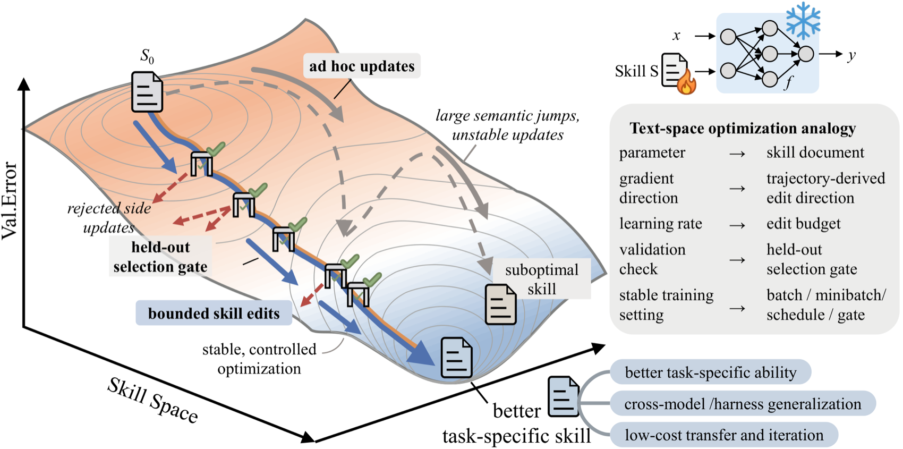

*▲ Figure 1 from the original SkillOpt paper (Source: Yang et al., Microsoft, arXiv:2605.23904). On the left, "tuning Skills" is drawn as descending along a loss landscape in Skill space: unconstrained ad hoc updates jump drastically and are unstable; bounded edits + a reserved validation gate make optimization stable and controllable.*

**Core analogy — aligning "tuning Skills" with "tuning weights":**

| Deep-learning training | SkillOpt counterpart |
|------------------------|----------------------|
| Model weights | A single Skill document (natural language) |
| Optimizer (e.g., Adam) | An independent frontier model (called only during offline training, not involved at all at deployment) |
| Forward pass | The frozen target model runs a batch of rollouts on the training set with the current Skill |
| Backward pass | The optimizer reads the scored trajectories, separates success/failure, and proposes structured **add/delete/replace** edits |
| Learning rate | **Text learning-rate budget**: the maximum number of edits accepted per step (default 4, with cosine decay) |
| Momentum term | **epoch-level slow/meta update**: summarizes stable edit directions across rounds, writes into protected fields |

**Three key mechanisms:**


*▲ Figure 2 from the original SkillOpt paper (flow diagram, same source as above): can be read step by step against the three mechanisms below.*

- **Validation Gate**: a candidate Skill is accepted only if it **strictly outperforms** the current version on a held-out selection set (ties are also rejected); `best_skill.md` is updated only when it beats the historical best. This is the most essential difference from works like Trace2Skill and EvoSkill that "put it in the library right after generation".
- **Rejected-Edit Buffer**: rejected edits and the score drops they caused are recorded and fed into later reflection calls, avoiding repeated same mistakes — equivalent to negative feedback during training, and **adds no inference cost**.
- **Text learning-rate budget + slow/meta update**: the former controls each step's "step size" to avoid unbounded rewrites wiping out useful rules; the latter carries the stable direction across epochs (in the ablation, removing both at once dropped SpreadsheetBench from 77.5 to 55.0, the largest degradation).

**Evaluation highlights (quite large scale):**

- Across **6 benchmarks** (SearchQA, SpreadsheetBench, OfficeQA, DocVQA, LiveMathematicianBench, ALFWorld), **7 target models** (GPT-5.5/5.4/5.4-mini/5.4-nano/5.2, Qwen3.5-4B, Qwen3.6-35B-A3B), **3 execution harnesses** (direct dialogue, Codex, Claude Code) — on all **52 (model, benchmark, harness) cells it was best or tied-best**, beating human, one-shot LLM, Trace2Skill, TextGrad, GEPA, EvoSkill item by item.
- On GPT-5.5, versus the no-Skill baseline: direct dialogue **+23.5 points**, Codex agentic loop **+24.8 points**, Claude Code **+19.1 points**.
- **Extremely compact**: learned Skills are usually < 2,000 tokens, requiring only 1–4 accepted edits (e.g., LiveMath's +29.3 points came from just **a single** edit).
- **Transferable**: optimized Skills remain effective across model scales, across the Codex↔Claude Code execution environments, and when migrated to neighboring math benchmarks, with no re-optimization needed.

> ⚠️ Note: although the "training" terminology is heavy throughout, the **target model stays frozen**; only the external Skill document is updated, and the optimizer is not trained (inference only). So it still belongs to the R2 Skill level.

**Comment**: SkillOpt is the **most highly engineered** work at the R2 Skill level; it almost brings "Prompt/Skill space optimization" to isomorphism with weight training — validation gate, learning rate, negative-feedback buffer, momentum, all present. It is close kin to TextGrad/GEPA in Section 12.1 (both text-space optimization), the difference being: TextGrad/GEPA optimize **prompts**, while SkillOpt optimizes **persistable, exportable, reusable Skill documents**, and introduces the "held-out validation gate" generally missing from prompt-optimization methods.

#### R2 Skill Level Summary: Seems Training-Free, but Still Relies on Data

- **Core point 1: Seems training-free, but still needs training data**. Whether relying on human interaction feedback or training-set feedback, it is essentially training data; it has not truly achieved "zero data".
- **Core point 2: The soul is "storing experience as reusable assets"**. The value of this level is entirely in crystallizing interaction by-products into retrievable Skill documents.
- **Core point 3: The summarization step is severely underestimated**. Almost all works tacitly hand "Skill summarization" to the frozen base or an independent large model — this should be the most critical link in the whole chain, yet almost no one optimizes for it (this foreshadowing detonates in 11.2.11.5).
- **Core point 4: Lateral vs. vertical summarization**: the vast majority of works are **vertical** (summarizing based on a single historical trajectory), only SE-Agent is **lateral** (summarizing based on multiple sampled trajectories). This distinction is an important anchor for discussing research gaps later.

---

### 11.2.11.3 R1 Parameter Level: Training Experience into Weights (Key Focus)

> **Common feature of this level**: directly update model weights via RL/SFT, letting the model fundamentally "grow capability", rather than just consulting an external notebook. This is the current mainstream direction in academia and industry.

R2/R3 experience lives outside the model and must be retrieved and occupy context when used; R1 is more thorough — it **internalizes experience into weights through training**, making capability the model's "instinct". What is interesting at this level is the different choices each work makes on "**who is trained, who is frozen**"; we will repeatedly revisit this with the "three-role" perspective of 11.2.11.5 later.

#### EvolveR: Offline Distillation Principles + Online Retrieval Action

> 📄 **Original**: arXiv [2510.16079](https://arxiv.org/abs/2510.16079) | 🧬 **Level**: R1 (online phase updates weights) | **One-liner**: The foundational type at this level, offline distills trajectories into "policy principles", online retrieves principles to guide action and feeds back into training.

EvolveR is the best introductory example at the R1 level because it clearly splits "storing experience" and "training weights" into two alternating phases:

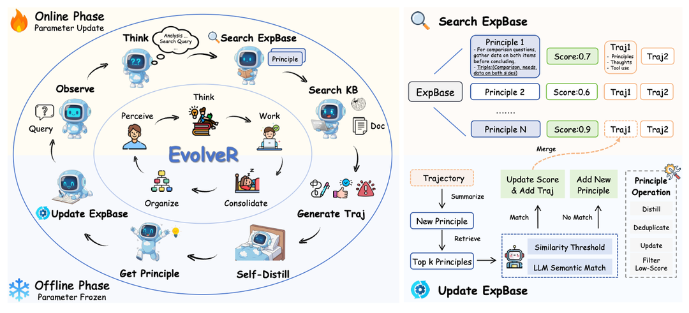

- **Offline phase (parameters frozen)**: after the Agent runs a batch of tasks, it distills all trajectories, abstracting concrete interaction steps into more general "policy principles", stored in a principle library (policy principles can be seen as a kind of Skill).
- **Online phase (parameter update)**: the Agent retrieves these principles in real time in new tasks to guide its actions, while simultaneously producing new trajectories that feed back into the next round of distillation training.

**Reward design**: final-result reward + format reward.
**Evaluation**: Natural Questions, HotpotQA, TriviaQA, PopQA.

> ⚠️ Note: it looks a lot like "RL by talking", but it still relies on the Ground Truth of annotated datasets for training. Data produced by talking is only used to distill experience/skills, not as training labels.

#### SAGE: Sequential Rollout

> 📄 **Original**: arXiv [2512.17102](https://arxiv.org/abs/2512.17102) | 🧬 **Level**: R1 (with Skill reward) | **One-liner**: At RL rollout time, run a string of similar tasks serially, so later tasks can directly reuse Skills just generated by earlier ones.

SAGE's cleverness lies in redesigning the RL rollout method:


The idea is clever: each rollout does not run one task, but has the Agent run a string of similar tasks in sequence. Skills accumulated while running early tasks can be used directly in later tasks within the same rollout. This means during training the model is forced to learn both "generate skills" and "reuse skills", not just "complete tasks".

Besides the result reward for task completion, SAGE also designs a **Skill-integrated Reward** — an extra signal specifically incentivizing skill generation and invocation. The evaluation dataset is **AppWorld** (APP interaction dataset).

#### SkillRL ⭐: Strong Model Distills Skills, Weak Model Learns to Use via RL

> 📄 **Original**: arXiv [2602.08234](https://arxiv.org/abs/2602.08234) | 🧬 **Level**: R1 | ⭐ One of the four key works focused on in this section.

**Core claim**: use a strong model (o3-level) to distill Skills, then train a weak model via RL to learn to use them, recursively evolving the skill library.


**Unified three-role breakdown:**

| Role | Configuration |
|------|---------------|
| Training task source | Official dataset training set: ALFWorld (~7,500 SFT), WebShop (~2,400 SFT), several search-QA datasets |
| Task proposer | No independent proposer, uses the dataset directly |
| Solver | Qwen2.5-7B-Instruct ✅ trained (Cold-start SFT → GRPO RL) |
| Skill summarizer | Strong model (o3-level) ❌ not trained |

**Skill summarization mechanism:**

- Successful trajectories → extract key decision points and transferable patterns;
- Failed trajectories → synthesize failure lessons (failure point + erroneous reasoning + response strategy);
- Compression ratio: 10–20×.

**Overall flow**: solver interacts → trajectory handed to summarizer to summarize skill → used in next-round training.

**Main experimental results:**

| Benchmark | SkillRL | GRPO baseline | Improvement |
|-----------|---------|---------------|-------------|
| ALFWorld | 89.9% | 77.6% | +12.3% |
| WebShop SR | 72.7% | 66.1% | +6.6% |
| Search-QA avg | 47.1% | ~38.5% | +8.6% |

Skill library growth: 55 → 100 entries (general 12→20, task-specific 43→80).

**Core design philosophy**: strong model distills knowledge, weak model learns to use knowledge via RL.

> 💬 **Comment**: we tend to classify this paradigm as distillation rather than true evolution.

#### SKILL0 ⭐: Internalizing Skills from Context into Weights

> 📄 **Original**: arXiv [2604.02268](https://arxiv.org/abs/2604.02268) | 🧬 **Level**: R1 | ⭐ Second of the four key works.

**Core claim**: internalize Skills from "external context at inference" into model parameters, achieving zero-shot execution (each step < 0.5K tokens).

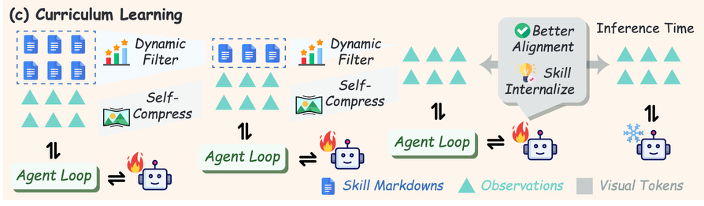

| Role | Configuration |
|------|---------------|
| Training task source | Directly inherits SkillRL's SkillBank (ALFWorld / WebShop / Search-QA official training sets) |
| Task proposer | None |
| Solver | Qwen2.5-VL-3B/7B-Instruct ✅ trained (three-stage progressive curriculum) |
| Skill summarizer | Inherits SkillRL's strong model, ❌ not trained |

**Three-stage progressive curriculum:**

| Stage | Number of Skills | Goal |
|-------|------------------|------|
| Stage 1 | 6 | Learn to call |
| Stage 2 | 3 | Reduce dependence |
| Stage 3 | 0 | Fully internalize |

**Core design philosophy**: a paradigm shift from "using skills" to "internalizing skills" — eliminating retrieval cost, Token overhead, and noise at inference, truly solidifying knowledge into model weights.

> SKILL0 does not care where Skills come from, only how to internalize them. It is essentially the "downstream consumer" of SkillRL.

#### SkillOS ⭐⭐: Training a Dedicated Curator

> 📄 **Original**: arXiv [2605.06614](https://arxiv.org/abs/2605.06614) | 🧬 **Level**: R1 (only trains Curator) | ⭐⭐ The one we consider **most inspiring** among the four.

**Core claim**: train a dedicated **Curator** that learns via RL how to add/modify/delete the SkillRepo, rather than directly learning how to use Skills.

| Role | Configuration |
|------|---------------|
| Training task source | Agentic (ALFWorld, WebShop official training sets) + reasoning (DeepMath-103k randomly sampled ~33,000 entries); two-step preprocessing: strong model labels attribute tags → group by similarity (group_size=8) |
| Task proposer | Strong model ❌ not trained, only offline-labels each task's skill-related attributes |
| Solver | Executor ❌ frozen, not trained; Qwen3-8B used during training; various-scale models swapped in at test; ReAct (Agentic tasks) + CoT (reasoning tasks) |
| Skill summarizer | Qwen3-8B Curator ✅ GRPO RL trained |

**Core design philosophy**: "learn how to manage skills, not how to use skills" — Executor frozen, only Curator trained, learning the add/delete/modify strategy for Skills via long-horizon indirect reward signals.

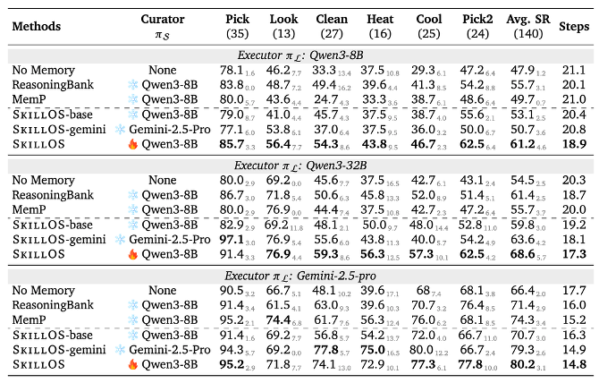

This work gives two conclusions extremely important for subsequent research:

- **Conclusion 1: A trained small-model summarizer > a frozen large-model summarizer**. The RL-trained Qwen3-8B as Curator outperforms directly using a frozen large model as Curator. It shows that "how to manage skills" itself is a trainable capability, and a small model after specialized training can beat a large model used directly.
- **Conclusion 2: Performance can rise without touching the solver**. On ALFWorld, with only the Curator trained and the solver completely frozen, overall performance still made substantial progress. "Swap the Curator" is a lighter optimization path than "swap the Executor".

#### AgentEvolver ⭐: Fully Autonomous Three-Loop Self-Evolution

> 📄 **Original**: arXiv [2511.10395](https://arxiv.org/abs/2511.10395) | 🧬 **Level**: R1 (self-proposes tasks, zero human data) | ⭐ Fourth of the four key works.

**Core claim**: a fully autonomous **three-loop self-evolution framework** — self-proposing tasks, self-solving tasks, self-summarizing experience, the whole chain requiring no human annotation.

| Role | Configuration |
|------|---------------|
| Training task source | Environment-exploration generated (Self-Questioning), fully automatic |
| Task proposer | The LLM itself (same model as the solver) ✅ |
| Solver | Qwen2.5-7B/14B-Instruct ✅ trained |
| Experience summarizer | Experience Manager ❌ not trained (essentially a memory-management mechanism) |

**Self-Questioning four-step flow:**

1. **Explore**: high-temperature LLM breadth-first (N_b steps) + depth-first exploration of the environment;
2. **Synthesize**: distill from exploration trajectories + user-preference constraints → generate task g and reference solution;
3. **Filter**: lexical deduplication + semantic similarity + feasibility verification;
4. **Mix (optional)**: `p_hybrid = (1−λ)·p_target + λ·p_task`.

**Feature**: the task-proposer and solver use the same Qwen2.5-7B/14B; after RL training, both task-proposal quality and solving ability improve doubly.

#### R1 Parameter Level Summary

- **Core point 1**: except for AgentEvolver, still relies on training-set feedback for reward;
- **Core point 2**: the lever of evolution is "inheriting/updating previous Skills at RL rollout time", making both "generate skills" and "reuse skills" trained capabilities;
- **Core point 3**: the "talking" here is not strictly "RL by talking" — feedback still comes from task results or human labels, not the interaction dialogue itself.

---

### 11.2.11.4 Zero-Data Self-Learning: No Dataset Needed

> **Common feature of this level**: completely without human-annotated data, driven by a closed loop where Agents propose tasks for and solve tasks for each other. It builds on R1 (updating weights) by further shedding the constraint of the "whether it depends on human data" ruler.

All previous works (except AgentEvolver) still needed datasets to feed questions and answers; this category is more radical in spirit: **it even builds its own question bank** — one Agent proposes tasks, one Agent solves them, neither relying on humans. Its success or failure almost entirely hinges on two cruxes: **how to judge right/wrong of answers (where does the verification signal come from)**, and **how to control task difficulty**.

#### Agent0: One Proposes, One Solves

> 📄 **Original**: arXiv [2511.16043](https://arxiv.org/abs/2511.16043) | 🧬 **Zero-data self-learning** | **One-liner**: Learning tool use, one Agent proposes tasks, one Agent solves them, alternating RL.


**Components:**

- **Curriculum Agent (RL)**: responsible for proposing tasks; reward = the answering Agent's uncertainty + tool-use frequency;
- **Executor Agent (RL)**: responsible for solving tasks; reward = task-solving success rate.

**Flow:**

1. The task-proposing Agent is RL-trained first (the solving Agent frozen as reward model);
2. The task-proposing Agent frozen, proposes tasks for the solving Agent to do RL training.

> ⚠️ Pitfall: the task-solving success-rate reward has a big problem — the task answer is the **silver answer** (pseudo-label) that the Curriculum Agent itself multi-samples and votes on, whose reliability is questionable.

Evaluation set: mainly math (GSM8K, AIME, etc.).

#### Tool-R0: Moving the Agent0 Idea to General Tools

> 📄 **Original**: arXiv [2602.21320](https://arxiv.org/abs/2602.21320) | 🧬 **Zero-data self-learning** | **One-liner**: Moving the Agent0 idea from pure math to general tool calling.

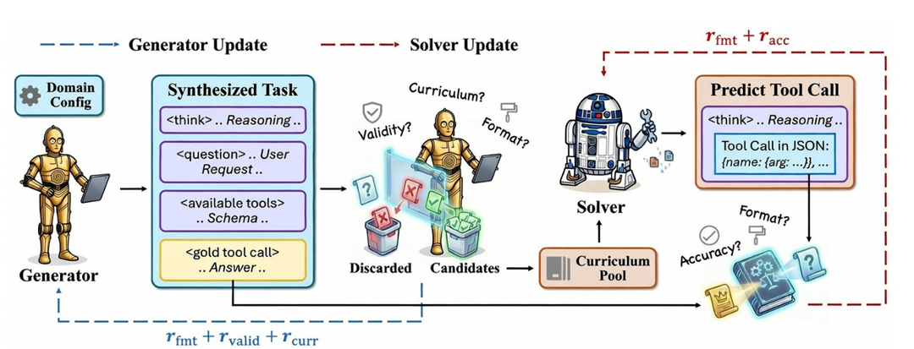

**Reward design:**

- **Generator Agent**: format reward + legality reward (no hallucinated tools) + difficulty reward (not too hard or too easy);
- **Solver Agent**: format reward + accuracy reward.

> ⚠️ Same pitfall: the answer is still the silver answer generated by the Generator Agent itself.

Evaluation set: ToolAlpaca, SealTool, NexusRaven.

#### Absolute Zero: Using a Code Executor as the Sole Judge

> 📄 **Original**: arXiv [2505.03335](https://arxiv.org/abs/2505.03335) | 🧬 **Zero-data self-learning** | **One-liner**: A single model proposes and solves its own tasks, using a code executor as the sole judge, completely untouched by external data.


**Components:**

- **Task-proposing Agent**: reward = 1 − answering Agent success rate; but when success rate is 0 the reward is also 0 (to avoid proposing overly hard tasks);
- **Answering Agent**: reward = task-solving success rate.

**Task-proposing flow**: a task is a `[input, code, output]` triple; randomly delete one to let the answering Agent guess, **with the code executor as the final judgment criterion**. This is a very clever design — it fully outsources the "scoring" to an absolutely objective execution environment, fundamentally avoiding the silver-answer reliability problem.

Evaluation set:

- Code: HumanEval, MBPP, LCB;
- Math: AIME24, AIME25, AMC, MATH-500, Minerva, Olympiad.

#### Zero-Data Self-Learning Summary: The Cost of Freedom Is Reliability

General flow: `task-proposing Agent training → propose and construct dataset → solving Agent training → task-proposing Agent training …`

- **Core point 1**: tasks are all generated by the task-proposing Agent itself, shedding dependence on human datasets;
- **Core point 2**: the biggest pitfall is the **silver answer** — accuracy judgments mostly compare against the answer given by the task-proposing Agent itself, whose reliability is questionable;
- **Core point 3**: the key to cracking the pitfall is **introducing an objective external judge**, and Absolute Zero using a code executor is the exemplar;
- **Core point 4**: **reward shaping for task difficulty is the core difficulty** — too hard cannot be learned, too easy nothing is learned, must be finely tuned;
- **Core point 5**: evaluation is chaotic — except for math benchmarks appearing multiple times occasionally, almost nothing else overlaps, poor horizontal comparability.

---

### 11.2.11.5 Horizontal Comparison: The "Three-Role" Perspective on Four Representative Works

Within the R1 Parameter level, the four works **SkillRL → SKILL0 → SkillOS → AgentEvolver** deserve a dedicated horizontal comparison, because they best reflect the paradigm evolution of long-horizon Agent self-evolution. Here we introduce the second core tool of this section — the **"three-role" perspective**: any self-evolution system, regardless of level, can essentially be broken into **task proposer / solver / summarizer** three roles; the only difference is "who is trained, who is frozen". This ruler is finer than R1–R4, specifically for seeing "which role the training resources are invested in".

#### Core Comparison Table

| Paper | Training task source | Task proposer | Solver (trained?) | Skill/Experience summarizer (trained?) |
|-------|----------------------|---------------|------------------|------------------------------------------|
| SkillRL | Official dataset training set | — | Qwen2.5-7B ✅ trained | Strong model ❌ |
| SKILL0 | Official dataset training set | — | Qwen2.5-VL-3B/7B ✅ trained | Strong model (inherited) ❌ |
| SkillOS | Official dataset training set | Strong model (offline grouping only ❌) | Executor frozen ❌ | Qwen3-8B Curator ✅ |
| AgentEvolver | Fully auto-generated | LLM itself (same model as solver) ✅ | Qwen2.5-7B/14B ✅ | Experience Manager ❌ |

#### One-Line Cheat Sheet

- **SkillRL**: [training set ✅ dependent] [solver ✅ trained] [summarizer ❌]
- **SKILL0**: [training set ✅ dependent] [solver ✅ trained] [summarizer ❌]
- **SkillOS**: [training set ✅ dependent] [solver ❌] [summarizer ✅ trained] ← **the only work that trains the summarizer**
- **AgentEvolver**: [task proposer ✅ trained] [solver ✅ trained] [summarizer ❌]

#### Strong-Model Dependence Level

| Method | Dependent strong model | Use |
|--------|----------------------|-----|
| SkillRL | o3-level | Skill summarization (core) |
| SKILL0 | o3-level (inherited) | Skill summarization (core) |
| SkillOS | Strong model (auxiliary) + Judge model | Label grouping + quality evaluation |
| AgentEvolver | Large-model API | Experience extraction + summarization |

> As can be seen: **the summarization step is tacitly outsourced to large models / closed-source APIs by almost everyone**, highly consistent with the phenomenon observed in the R2 Skill level summary earlier.

#### Paradigm Evolution Lineage

```text
SkillRL
  Strong model distills knowledge → weak model learns to use via RL → recursively evolves skill library
    ↓
SKILL0
  Same skill library → progressively withdrawn → internalized into parameters → zero-shot execution (no retrieval overhead)
    ↓
SkillOS
  Freeze executor → train Curator → learn how to manage skills (add/modify/delete)
    ↓
AgentEvolver
  Fully autonomous → self-propose tasks + self-solve tasks + self-summarize → step-level credit assignment
```

---

### 11.2.11.6 Key Insight: The Overlooked "Summarizer"

#### The Summarizer Is a Severely Underestimated Key Module

Put together whether each work in R2 + R3 + R1 "trains the summarizer":

| Work | Level | Is the Skill summarizer trained |
|------|-------|----------------------------------|
| AutoSkill | R2 | ❌ |
| EvoSkill | R2 | ❌ |
| MemSkill | R2/R3 | ❌ (Base frozen, only trains Controller) |
| MemRL | R3 | ❌ (trains retrieval policy, not summarization) |
| CoEvoSkills | R2 | ❌ |
| SE-Agent | R2 | ❌ |
| SkillOpt | R2 | ❌ (optimizer is frozen frontier model, inference only) |
| EvolveR | R1 | ❌ |
| SAGE | R1 | ✅ (skill reward within sequential rollout) |
| SkillRL | R1 | ❌ (strong model o3) |
| SKILL0 | R1 | ❌ (inherited) |
| SkillOS | R1 | ✅ (the only one with dedicated training) |
| AgentEvolver | R1 | ❌ (large-model API) |

As can be seen, **works that specifically train the summarizer itself are few and far between** — SAGE counts as half (has skill reward during RL), and SkillOS is the only one that truly and completely makes the Curator the main training object. And the experimental conclusion given by SkillOS — **a trained 8B Curator outperforms a frozen large-model Curator** — exactly corroborates the value of this.

#### "The Judge" Actually Has Three Identities — Don't Confuse Them

Many people ask: self-evolution research now seems to be competing on various Skills of the "executor", why has no one improved the overall level by "optimizing the judge"? This intuition is partially correct, but you must first split "the judge" into three layers, otherwise you easily draw wrong conclusions.

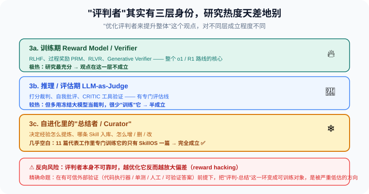

- **3a. Training-time Reward Model / Verifier** (RLHF, process reward PRM, RLVR, Generative Verifier): this is the core of the entire o1 / DeepSeek-R1 route, **extremely well researched**. At this layer, "optimizing the judge to improve the whole" is not only done by someone, but is the main battlefield — so the claim "no one researches the judge" **does not hold here**.
- **3b. Inference / evaluation-time LLM-as-Judge** (scoring judge, self-criticism, CRITIC tool verification): there is a dedicated evaluation research line, but the vast majority of works **directly use a frozen large model as the judge, rarely "training" this judge itself** — this layer is **half-true**.
- **3c. The "summarizer / Curator" in self-evolution**: the role repeatedly emphasized in this section. It is **almost blank** — among 11 representative works, only SkillOS specifically trains it. The view "improve the whole by elevating it" is **fully true** at this layer.

So the more precise statement is: **"optimizing the executor's Skills" is the explicit science; "training the judging / summarizing link" is the truly neglected corner, especially 3c.**

#### A Necessary Companion Reverse Risk: Judge Collapse

But this path has a fatal precondition: **the judge must be more reliable than the executor**. Once the judge itself is biased, the more you repeatedly "optimize" it in the self-evolution closed loop, the more you solidify and amplify the bias — this is **reward hacking / evaluator collapse**. In a pure self-loop without external anchors (code executor, unit tests, human annotation, verifiable answers), "training the judge" easily degenerates into "training an increasingly confident wrong judge". This is exactly why Absolute Zero insists on using a code executor as the sole judge rather than a silver answer (see 11.2.11.4).

Therefore, the core proposition of this section should be precisely stated as:

> **Given a credible external verification signal, making the "judging / summarizing link" also a trainable object is a currently severely underestimated direction.**

#### The Two-Dimensional Space of Autonomy × Summarization Quality

Place the four representative works on two dimensions:

```text
Summarizer training
   ▲
   │  SkillOS
   │
   │
───┼──────────────► Task auto-generation
   │
SkillRL/      AgentEvolver
SKILL0
```

**The blank quadrant in the upper right — both auto-generating tasks and training the summarizer — is currently covered by no work. This is the most conspicuous research gap today.**

#### The Fusion Space of Lateral vs. Vertical Summarization

SE-Agent at the R2 Skill level is **lateral** (multiple sampled trajectories) summarization, while almost all other works are **vertical** (single historical trajectory) summarization. These two are basically not fused in the R1 Parameter level works — SkillRL/SKILL0/SkillOS still mostly vertical. Would lateral + vertical fusion bring a more robust Skill library? This is another open question.

---

### 11.2.11.7 Final Words

The pace of self-evolving Agent research over this past year-plus has actually been very fast, from "storing skills" to "training skills", from "depending on human data" to "zero-data self-training", with new work appearing almost every month. But after chewing through it carefully, you find large research gaps no one has touched — especially the cross-path of "**training the summarizer itself**" and "**fully autonomous + training the summarizer**".

Looking back, the essential question of this track is actually just one:

> **How to let an Agent, without human intervention, turn the by-products of interaction into stronger capability next time?**

Whether storing experience in files (R2/R3), training it into weights (R1), or having Agents propose tasks for each other (zero-data self-learning), all paths answer different facets of this one question. And for engineering practitioners, the three most worth-remembering conclusions are:

1. **The summarizer deserves dedicated training** — SkillOS proves an 8B specially-trained Curator can beat a frozen large model, meaning "how to manage experience" itself is a learnable, optimizable capability;
2. **Skills are strongly coupled with model style** — CoEvoSkills hints that rather than spending big money having a closed-source strong model distill Skills, let the small model used online self-evolve, which is cheaper and may work better;
3. **"Tuning Skills" can be as disciplined as "tuning weights"** — SkillOpt proves that as long as you introduce a validation gate, bounded learning rate, and negative-feedback memory into text-space optimization, you can stably and reproducibly train Skills stronger and stronger without touching any weights, with zero extra overhead at deployment;
4. **Continuous evolution without changing weights is possible** — MemRL/MemSkill prove that even with the base model completely frozen, doing RL only at the memory level lets the Agent, after deployment, keep getting better at picking experience — this is the lowest-cost self-evolution path.

---

### Appendix: Evaluation Dataset Index

| Dataset | Used by | Type |
|---------|---------|------|
| WildChat-1M | AutoSkill | User dialogue |
| OfficeQA | EvoSkill | Office charts |
| LoCoMo / LongMemEval | MemSkill / MemRL | Long-horizon dialogue memory |
| SkillBench | CoEvoSkills | Skills |
| SWE-Bench Verified | SE-Agent | Code fixing |
| SearchQA / SpreadsheetBench / OfficeQA / DocVQA / LiveMathematicianBench / ALFWorld | SkillOpt | Multi-domain (QA/tables/documents/math/embodied) |
| ALFWorld | SkillRL / SKILL0 / SkillOS | Embodied / Agentic |
| WebShop | SkillRL / SKILL0 / SkillOS | Web shopping |
| Search-QA | SkillRL / SKILL0 | Retrieval QA |
| AppWorld | SAGE | APP interaction |
| NQ / HotpotQA / TriviaQA / PopQA | EvolveR | Retrieval QA |
| DeepMath-103k | SkillOS | Math reasoning |
| GSM8K / AIME | Agent0 | Math |
| ToolAlpaca / SealTool / NexusRaven | Tool-R0 | Tool use |
| HumanEval / MBPP / LCB | Absolute Zero | Code |

---

## References

1. Shinn et al. [**Reflexion: Language Agents with Verbal Reinforcement Learning**](https://arxiv.org/abs/2303.11366). NeurIPS 2023.
2. Madaan et al. [**Self-Refine: Iterative Refinement with Self-Feedback**](https://arxiv.org/abs/2303.17651). NeurIPS 2023.
3. Gou et al. [**CRITIC: Large Language Models Can Self-Correct with Tool-Interactive Critiquing**](https://arxiv.org/abs/2305.11738). ICLR 2024.
4. Wang et al. [**Voyager: An Open-Ended Embodied Agent with Large Language Models**](https://arxiv.org/abs/2305.16291). TMLR 2024.
5. Hu et al. [**Automated Design of Agentic Systems**](https://arxiv.org/abs/2408.08435). ICLR 2025.
6. Robeyns et al. [**A Self-Improving Coding Agent**](https://arxiv.org/abs/2504.15228). 2025.
7. AutoSkill. arXiv:2603.01145.
8. EvoSkill. arXiv:2603.02766.
9. MemSkill. arXiv:2602.02474.
10. MemRL. arXiv:2601.03192.
11. CoEvoSkills. arXiv:2604.01687.
12. SE-Agent. arXiv:2508.02085.
13. SkillOpt. arXiv:2605.23904.
14. EvolveR. arXiv:2510.16079.
15. SAGE. arXiv:2512.17102.
16. SkillRL. arXiv:2602.08234.
17. SKILL0. arXiv:2604.02268.
18. SkillOS. arXiv:2605.06614.
19. AgentEvolver. arXiv:2511.10395.
20. Agent0. arXiv:2511.16043.
21. Tool-R0. arXiv:2602.21320.
22. Absolute Zero. arXiv:2505.03335.

## Summary

The essence of a Self-Evolution Agent is: **let the Agent extract experience from its own execution trajectories, and turn that experience into reusable, verifiable, rollback-able capability assets**.

Key points:

- **Self-evolution is not the same as automatically changing model weights**: memory, Prompt, Skill, and process optimization are often lower-cost and safer.
- **Evolution must be a closed loop**: execution, recording, evaluation, attribution, improvement, and validation are all indispensable.
- **Failure samples are very important**: they expose boundaries, trigger rule corrections, and generate preference-learning data.
- **Risk control first**: any self-modification must have permission boundaries, regression tests, and rollback mechanisms.
- **Complementary to the data flywheel**: Self-Evolution handles fast system-level improvement, while the data flywheel handles long-term model-level enhancement.

When an Agent can stably complete tasks, remember lessons, crystallize skills, and feed trajectories back into the training system, it is no longer just "a chatbot that can call tools", but begins to possess the ability to grow continuously.

---

*Previous section: [11.1 Automatic Prompt Optimization](./01_automatic_prompt_optimization.md)*

*Next section: [11.3 Agentic Data Flywheel](./03_data_flywheel.md)*
