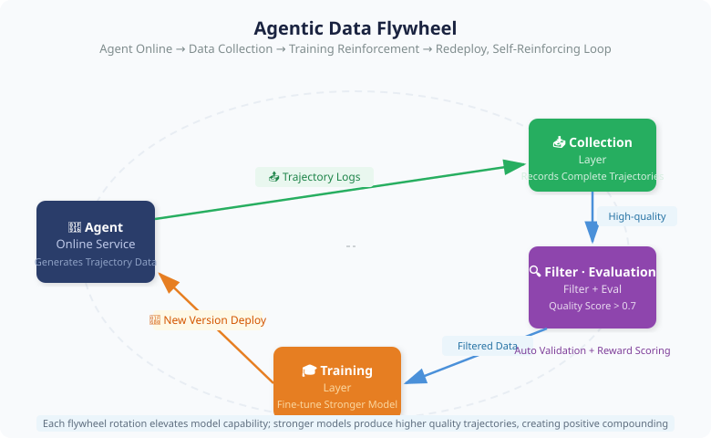
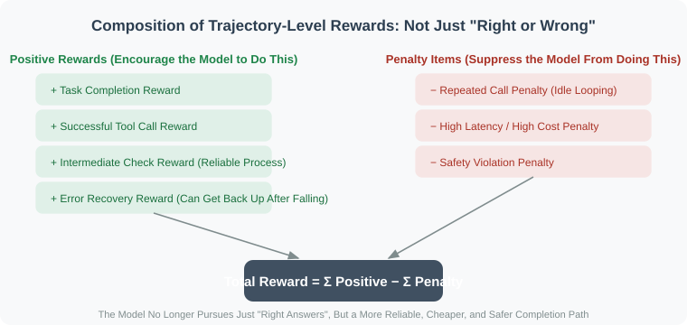

# 11.3 Agentic Data Flywheel: Letting Agents Evolve Autonomously

> 🔄 *"The best training data is not manually labeled — it is the trajectory left behind when Agents succeed, fail, recover, and complete tasks in real environments."*

[Section 10.8](../chapter_agentic_rl/08_agent_finetuning.md) addressed "how to build the first batch of Agent training data." But that is only the starting point.

A truly powerful Agent system follows a cycle: **Agent runs → produces trajectories → evaluate results and process → extract success and failure signals → train a stronger model → stronger model produces better trajectories → ...**

This closed loop is the **Agentic Data Flywheel** — one of the core secrets that enables top teams like DeepSeek, OpenAI, and Anthropic to iterate continuously.

From a training paradigm perspective, the data flywheel is the engineering manifestation of Agentic-RL: SFT provides the first usable policy, the online environment provides real feedback, the reward and filtering system turns feedback into training signals, and the next-round model re-enters the environment to continue trial and error.

---

## Why the Data Flywheel Is Key to Agentic-RL

If you only do SFT once, the model's capabilities stay within the coverage of the training set. With a data flywheel, the model continuously encounters new tasks, new tools, new errors, and new edge cases, converting these experiences into capability improvements for the next round.

| Problem | One-Shot SFT Approach | Data Flywheel Approach |
|---------|----------------------|----------------------|
| **Plain SFT is insufficient for training Agents** | Only learn from existing expert trajectories | Continuously collect real trajectories to cover uncovered scenarios |
| **Tool calling requires environment feedback** | Offline judgment of whether tool calls "look correct" | Record whether tools actually executed successfully and whether returns were usable |
| **Multi-step tasks need trajectory-level rewards** | Learn from assistant outputs sentence by sentence | Evaluate task completion rate, recovery rate, and cost per full trajectory |
| **Correct result ≠ reliable process** | Only keep samples with correct final answers | Also check intermediate steps, error handling, and repeated calls |
| **Failed trajectories have training value** | Failed samples are usually discarded | Failures are classified, corrected, converted into preference pairs and targeted data |
| **Agent gets stronger with use** | Capability frozen after training | More usage → more trajectories → clearer weak points → faster iteration |

This is the relationship between Agentic-RL and the data flywheel: **RL provides the algorithm for "how to learn from feedback"; the flywheel provides the system for "continuously generating feedback."**

---

## Overall Flywheel Architecture



With each revolution of the flywheel, the model's capability climbs one step. The higher the step, the better the quality of trajectories produced, making the raw material for the next round even better.

---

## Layer 1: Trajectory Collection

The raw material of the flywheel is the **complete interaction records** (Trajectories) produced when the Agent runs. The core principle during collection is: **record not just "what was asked and what was answered," but all signals needed to judge "whether the process was good."**

A trajectory must include at least four categories of information:

| Category | Key Fields | Purpose |
|---------|-----------|---------|
| Interaction Records | `messages` (complete system/user/assistant/tool sequence), `tool_definitions` | Reconstruct context during training |
| Outcome Information | `task_completed`, `final_response` | Score the result dimension |
| Cost Information | `total_tool_calls`, `tool_call_failures`, `latency_ms`, `total_tokens` | Score the process dimension, efficiency penalties |
| User Feedback | `user_rating` (explicit), `user_followup` (implicit satisfaction signal) | Free high-quality labels |

Two engineering details are easy to overlook but critical — **sampling** (not every trace needs to be stored during high traffic) and **anonymization** (training data must have PII removed first). The entire collection process should be **asynchronous** and not block the online main flow:

```python
async def record(self, traj: AgentTrajectory):
    if random.random() > self.sampling_rate:   # 1. Sampling
        return
    traj = self._anonymize(traj)                # 2. Anonymize (regex replace phone/email etc.)
    await self.storage.save(traj)               # 3. Async persistence, don't block online
    asyncio.create_task(self._score(traj))      # 4. Trigger async quality scoring
```

---

## Layer 2: Quality Filtering and Labeling

Raw trajectories vary widely in quality and must go through strict screening before entering the training set.

### Dual-Dimension Filtering: Outcome × Process

Looking only at "was the task completed" is insufficient — a trajectory where the **result was accidentally correct but the process was chaotic** (e.g., repeated trial and error, haphazard tool calls that happened to guess right) will contaminate the training set. So quality scores must be weighted across two dimensions:

- **Outcome dimension** (~50%): explicit satisfaction (user rating), implicit satisfaction (did the user keep asking follow-ups), whether the task was substantively completed.
- **Process dimension** (~50%): tool call success rate, efficiency (step penalty to prevent spinning), format compliance (are tool calls all valid JSON), and an optional reward model score.

In implementation, these sub-scores are weighted and averaged, with a threshold (empirical value `0.7`) as the admission cutoff:

```python
def compute_quality_score(self, traj) -> float:
    scores = {
        # Outcome dimension
        "satisfaction":   traj.user_rating / 5.0 if traj.user_rating else 0.5,
        "task_completion": 1.0 if traj.task_completed else 0.2,
        # Process dimension
        "tool_success":   1 - traj.tool_call_failures / max(traj.total_tool_calls, 1),
        "efficiency":     1.0 if traj.total_tool_calls <= 5 else 0.5,  # Step penalty
        "format":         self._check_format_compliance(traj.messages),
    }
    # Weighted average across dimensions → 0–1 composite score
    return sum(scores[k] * self.weights[k] for k in scores) / sum(self.weights.values())

# Batch filter: only keep trajectories with score >= 0.7
```

> 💡 **Weights are not black magic**: the outcome dimension determines "should we learn from this trajectory," and the process dimension determines "will this trajectory teach the model bad habits." Weights can be adjusted per domain — for customer service, raise "satisfaction"; for a code Agent, raise "format compliance" and "tool success rate."

### The Value of Negative Samples: Failed Trajectories Are Useful Too

In an Agent system, failure is not noise — it is the densest learning signal. Successful trajectories tell the model "this path works"; failed trajectories tell the model "which actions seem reasonable but actually cause task failure."

Failed trajectories have at least three uses:

1. **Preference learning**: for the same task, use the successful trajectory as `chosen` and the failed one as `rejected`, for DPO/IPO-style preference optimization.
2. **Error-recovery SFT**: truncate at the point before failure, then have a stronger model or human expert write the correct next step.
3. **RL reward correction**: convert high-frequency failure types into penalty terms, e.g., illegal tools, repeated calls, unchecked results, bypassing approvals.

| Failure Type | Appearance in Offline Logs | Training Value |
|-------------|---------------------------|----------------|
| Tool hallucination | Called a non-existent API | Strengthen tool schema constraints |
| Parameter errors | Missing fields, wrong types, wrong units | Learn parameter validation and self-correction |
| Environmental anomalies | API timeout, DOM element change, insufficient permissions | Learn retry, degradation, and help-seeking strategies |
| Long-range chain break | Forgot earlier results, repeated the same step | Learn state tracking and trajectory-level planning |
| Accidental correctness | Final answer correct but steps chaotic, cost extremely high | Learn process rewards and cost control |

This is also why a data flywheel cannot just collect "user-liked" samples. A truly valuable system collects both high-quality successful trajectories and diagnosable failed trajectories — the former for strengthening capabilities, the latter for patching boundaries.

In practice, "extracting negative samples" mainly does two things: first, **pair successful trajectories (chosen) and failed trajectories (rejected) for the same task** directly into DPO preference pairs; second, **locate the first error point in a trajectory**, truncate the context before it, and have a strong model fill in the correct continuation to create "error recovery" samples. Core snippet:

```python
# Use 1: Form DPO preference pairs
pair = {
    "prompt":   good_traj.messages[1]["content"],  # Same user question
    "chosen":   to_text(good_traj),                # Successful trajectory
    "rejected": to_text(bad_traj),                 # Failed trajectory
}

# Use 2: Classify by error type for statistical analysis of model weaknesses
def classify_error(msg, available_tools) -> str:
    for call in msg.get("tool_calls", []):
        if call["name"] not in available_tools:
            return "hallucinated_tool"      # Tool hallucination: calling non-existent APIs
        if not isinstance(call["arguments"], dict):
            return "invalid_format"         # Parameter format error
    return "reasoning_error"                # Rest classified as reasoning errors
```

---

## Layer 3: Auto-Labeling and Reward Models

Most online trajectories have no user ratings and must have their quality judged automatically. There is an important triage principle here: **verify what is verifiable; only use model scoring for what cannot be verified.**

**① Verifiable tasks use rule-based rewards (RLVR approach).** Math, code, SQL — these tasks have objective answers that can be verified directly. This is the most precise, zero-cost reward signal, and the core approach of DeepSeek-R1. For example, math problems extract the final number and compare; code problems run the code and check if the output matches:

```python
def verify_math(response: str, ground_truth: float) -> float:
    pred = extract_last_number(response)          # Extract the final number from the response
    if abs(pred - ground_truth) < 1e-6: return 1.0
    return 0.5 if relative_error(pred, ground_truth) < 0.05 else 0.0  # Approximate gets half
```

**② Non-verifiable tasks use LLM-as-Judge.** Dialogue quality or copywriting quality has no standard answer, so a strong model acts as judge, scoring across dimensions like reasoning quality, tool usage, and error handling, outputting structured JSON. A key **cost-saving trick**: don't call the judge on every sample — only call it on **ambiguous samples near the boundary (e.g., quality score 0.5–0.7)**. Obviously good or bad samples can use rule-based scores, saving most of the judge overhead.

> ⚠️ **Don't let the judge judge itself**: the model used for scoring should be stronger than or at least on par with the Agent being evaluated, otherwise you get systemic bias where a weak model gives high scores to weak trajectories.

---

## Layer 4: Training and Iteration

### Flywheel Iteration Cadence


### From SFT Flywheel to RL Flywheel

The data flywheel usually does not start with full RL right away. It evolves in phases:

| Phase | Main Training Method | When Appropriate | Core Benefit |
|-------|---------------------|-----------------|--------------|
| **Cold Start** | Human/synthetic trajectory SFT | No online data yet | Teach the model basic tool formats |
| **Success Trajectory Flywheel** | Continued SFT on high-quality trajectories | Small amount of real users | Improve stability on common tasks |
| **Preference Flywheel** | DPO/IPO/reward model | When success-failure comparisons exist | Let the model distinguish good from bad processes |
| **Agentic-RL Flywheel** | GRPO/PPO/environment rollout | When an executable environment and rewards exist | Optimize long-task completion rate and cost |

The key judgment criterion: when the system can already produce legal actions stably but is still unstable on long tasks, error recovery, and cost control, it is time to shift from "continue imitating successful samples" to "optimize trajectory returns in the environment."

Agentic-RL flywheel cares about more than "was this completed this time" — it uses a more complete return function that combines positive rewards and penalty terms:



This way, the model does not just chase the final answer, but learns a more reliable, cheaper, and safer completion path.

### Mixed Training: New Data + Old Data to Prevent Catastrophic Forgetting

Flywheel iteration has a hidden pitfall: if each round only fine-tunes on **newly collected** data from that round, the model gradually forgets earlier learned capabilities (**catastrophic forgetting**). The solution is to **mix in a portion of historical high-quality data** in each training round — empirically, about "70% new + 30% old," with old data **weight-sampled by quality score** (the better the sample, the more likely it is reused):

```python
def prepare_training_data(self, new_data, memory_ratio=0.3):
    keep_old = int(len(new_data) / (1 - memory_ratio) * memory_ratio)
    old_data = weighted_sample(self.history, n=keep_old, key="quality_score")
    return shuffle(new_data + old_data)   # New data + weighted-sampled old data
```

A complete iteration round strings together the previous layers: **filter high-quality samples → extract failure preference pairs → mix new and old data for SFT → (when enough preference pairs exist) do DPO → evaluate the new version on benchmarks**. This pipeline is the full set of actions for one revolution of the flywheel, where SFT lays the foundation and DPO refines — corresponding to the phased evolution table above.

---

## Three Key Acceleration Factors for the Flywheel

A flywheel that can spin doesn't mean it spins fast. The following three factors determine the "gold content" of each revolution, and are precisely the directions that 2025–2026 frontier work (see paper interpretations below) has focused on strengthening.

**1. Task Difficulty Curriculum.** Feeding high-difficulty long tasks from the start only results in total failure — the model produces no usable samples. The correct approach is **graduated difficulty from easy to hard**: start with single tool calls, and as iterations progress gradually raise the step limit (e.g., "upgrade one level every 3 rounds"), letting the flywheel first spin smoothly on simple tasks before climbing.

**2. Exploratory Sampling (increasing diversity).** Production environments default to low temperature for stability, but this makes trajectories highly homogeneous, missing "cold paths." The trick is to **reserve about 10% of traffic running at high temperature**, specifically to discover paths rarely taken, injecting diversity into the training set:

```python
# 90% of requests use stable config, 10% use exploration config
config = {"temperature": 0.8} if random.random() < 0.1 else {"temperature": 0.2}
```

**3. Synthetic Data Augmentation (covering blind spots).** Through evaluation, identify the model's **weak skill dimensions** (e.g., "recovery after tool failure" accuracy is only 40%), then synthesize a batch of trajectories for that specific scenario to supplement the training set — replacing "blindly increase volume" with "patch where it's weak."

---

## Flywheel Effectiveness: Real-World Case References

| Team | Method | Iteration Rounds | Result |
|------|--------|-----------------|--------|
| **DeepSeek** | GRPO + self-generated math trajectories | ~10 rounds | Math reasoning caught up from GPT-4 level to o1 |
| **Reflection-70B** | Self-reflection self-criticism | ~5 rounds | Llama 70B surpassed GPT-4 (disputed) |
| **STaR / V-STaR** | Bootstrapping with correct reasoning chains | 5 rounds | Math accuracy +40% |
| **AgentTuning** | Multi-task Agent trajectory fine-tuning | 1 round | General Agent capability +30% |

> 📌 Core pattern: **The data flywheel improves fastest in the first 3 rounds** (the leap from "doesn't know how to use tools" to "can use tools"). Subsequent rounds see diminishing returns and require more refined data engineering.

---

## Paper Interpretations: Three Foundational Works on Flywheel Thinking

The methods in the table above did not appear out of nowhere. The core idea of the data flywheel — "use a model's own outputs to train a stronger model" — was progressively solidified by three papers from 2022–2024. Reading them in chronological order reveals exactly how the flywheel evolved from "only keeping successful samples" to "making full use of failures too."

### STaR (NeurIPS 2022): Flywheel v1 — Bootstrapping Correct Reasoning Chains

> 📄 **Publication**: Zelikman et al. (Stanford), *STaR: Bootstrapping Reasoning With Reasoning*, **NeurIPS 2022** | arXiv: [2203.14465](https://arxiv.org/abs/2203.14465)
>
> 🧬 **Corresponding flywheel layer**: Trajectory collection + outcome-dimension filtering | **One-liner**: Let the model write its own reasoning, keep only what leads to correct answers, and use that to train itself.

STaR answered a thorny question at the time: to teach a model to solve problems "with reasoning chains (rationales)," there was **almost no human-annotated reasoning process data** — having people write step-by-step solutions for tens of thousands of problems was too expensive. STaR's approach was to have the model **generate its own data**:

1. **Generate**: Using a small number of few-shot examples, have the model produce "reasoning chain + answer" for a large set of problems.
2. **Filter**: Keep only reasoning chains where the **final answer is correct** (this is the earliest prototype of "outcome-dimension filtering" in this section — using verifiable answers as free quality signals).
3. **Fine-tune + iterate**: Fine-tune the model on these filtered reasoning chains, get a stronger model, then return to step 1.

But this loop alone has a deadlock: **hard problems that the model gets entirely wrong from the start will never produce correct samples**, so the flywheel can't spin on hard problems. STaR's clever solution is **"rationalization"** — for incorrectly solved problems, feed the **correct answer back as a hint** and have the model work backward to write a reasoning chain that reaches that answer. This way, hard problems can also contribute training samples, and the flywheel spins. This already hints at "failed samples can be used too," but in a crude way (essentially giving the answer to copy).

### ReST^EM (2024): Formalizing the Flywheel as a "Generate–Improve" Two-Stage Loop

> 📄 **Publication**: Singh et al. (Google DeepMind), *Beyond Human Data: Scaling Self-Training for Problem-Solving with Language Models*, **2024** | arXiv: [2312.06585](https://arxiv.org/abs/2312.06585)

If STaR gave the flywheel's intuition, ReST^EM **formalized it into a clear two-stage loop** and proved it can scale:

- **Generate (E-step)**: The current model samples multiple solutions per problem, uses a **verifiable reward** (math answer correctness, code passing tests) to filter correct ones, accumulating a new dataset.
- **Improve (M-step)**: Fine-tune only on this filtered dataset to get the next model version; then return to Generate.

Its two most important empirical conclusions directly correspond to engineering judgments in this section: first, **on verifiable tasks, model self-generated data can surpass human-annotated data** in effectiveness — this is the confidence that establishes the data flywheel as an independent paradigm; second, **returns diminish with iterations** — after a few rounds, pure SFT bootstrapping saturates or even overfits. This is precisely the empirical source for this section's emphasis that "the first 3 rounds improve fastest, after which more refined data engineering (preference learning, RL) is needed."

### V-STaR (COLM 2024): Finally Putting Failed Trajectories to Use

> 📄 **Publication**: Hosseini et al. (Mila, Microsoft Research, et al.), *V-STaR: Training Verifiers for Self-Taught Reasoners*, **COLM 2024** | arXiv: [2402.06457](https://arxiv.org/abs/2402.06457)
>
> 🧬 **Corresponding flywheel layer**: Value of negative samples + preference flywheel | **One-liner**: STaR threw away all incorrect solutions; V-STaR says — those failures are the best material for training a "judge."

V-STaR pointedly identifies the waste of the previous two: STaR/ReST only use **correct** solutions to train the generator, **discarding massive amounts of incorrect solutions**. Yet "incorrect solutions" contain extremely valuable signals — they tell us "what reasoning looks right but is actually wrong." V-STaR's approach is **dual-track utilization**:

- **Correct solutions** → still used for SFT training of the **generator**, making it better at solving problems;
- **Correct + incorrect solution pairs** → used to DPO-train an independent **verifier**, specialized in judging whether a solution is reliable.

At inference time, the generator samples multiple candidate solutions, and the verifier scores and selects the best (best-of-n). Result: with the same self-generated data, V-STaR achieves significant improvements over generator-only STaR on math and code tasks.

This paper's significance for this section is the most direct: it experimentally proves that **the "value of negative samples" in Section 8.2 is far from armchair theory** — failed trajectories, when properly organized (paired as preference pairs to train a verifier), bring gains that successful samples alone cannot deliver. The approach in this section's code where `NegativeSampleExtractor.extract_contrastive_pairs` uses successful trajectories as `chosen` and failed ones as `rejected` is precisely the V-STaR idea applied to Agent trajectories.

> 🧭 **Read the three together**: STaR proved "bootstrapping successful samples" works (the flywheel can start) → ReST^EM formalized it and revealed "diminishing returns" (how the flywheel spins, when to shift gears) → V-STaR supplemented "failed samples turned into judges" (the flywheel's other half of fuel). From STaR to the Agent data flywheel, what changed is only that "trajectories" replaced "reasoning chains" and "environment feedback" replaced "answer correctness" — the core is entirely the same.

### 2025–2026 Frontiers: From "Replaying Experience" to "Actively Evolving Trajectories"

The three papers above laid the foundation, but they are essentially **passive** — accumulate a batch of trajectories first, then filter, then train. After 2025, the direction clearly shifted toward **closed-loop, autonomous, active evolution**: the flywheel no longer just replays existing experience but actively "creates" harder, more informative new trajectories. The following three works represent three paths of this shift.

**① BPO (arXiv:2508.03018, 2025): A three-stage flywheel for sparse-reward long-horizon planning.** Long-horizon Agent tasks have two persistent headaches — **credit assignment** (a task takes dozens of steps before receiving a single success/failure signal; RL doesn't know which step to reward) and **reasoning verbosity** (step-by-step CoT history is too long, computationally prohibitive). BPO addresses these with bootstrapping → extrapolation → refinement: first fuse short and long CoT to induce efficient reasoning, then use **complexity-layered curriculum** to extrapolate to out-of-distribution tasks, and finally rely on **reward-gated rejection sampling** to iteratively self-refine only on filtered experience. It achieves SOTA on ALFWorld, ScienceWorld, and WebShop at significantly lower token cost — turning this section's "efficiency penalty" and "curriculum" engineering points into a complete methodology.

**② CoEvolve (2025): An unsupervised closed loop where Agents and data co-evolve.** Previous trajectory synthesis was mostly **open-loop** — offline generate a batch of tasks, loosely coupled with the Agent's constantly changing failure patterns. CoEvolve's proposition is **closed-loop**: extract "weakness signals" from rollout trajectories, use them to prompt an LLM to **re-explore and discover new executable tasks and states**, then abstract and verify these new interactions into executable tasks for training. Thus the training distribution **continuously and adaptively drifts** with the Agent's capabilities rather than spinning in a fixed problem bank, all without human supervision. This is precisely an autonomous upgrade of this section's "synthetic data augmentation for blind spots" idea.

**③ AutoMATES / STRIVE (2026): Reframing policy optimization as "trajectory evolution."** This work directly combines the flywheel with **evolutionary algorithms**: through multi-path adversarial generation, a learnable critic for selection, and domain-aware **trajectory mutation**, it actively bootstraps high-quality training data rather than passively replaying experience. Ablation shows the "evolution" step is the most critical — lifting a 1.5B small model's success rate from 72.8% to 97.2% on ALFWorld, and even transferring to vision-language tasks (Sokoban 89.4%). It confirms this section's judgment: **when pure SFT bootstrapping saturates, actively increasing trajectory diversity (adversarial generation + mutation) is the key to breaking through the bottleneck.**

> 📌 **Trend summary**: The 2022–2024 flywheel solved "can it spin"; the 2025–2026 flywheel solves "how to spin longer and more autonomously." Three keywords — **closed-loop** (using failure signals to feed back into task generation), **curriculum** (easy-to-hard layered extrapolation), **evolution** (actively creating diverse trajectories rather than replaying). They map one-to-one onto this section's code `CurriculumManager`, `BlindSpotFixer`, `ExploratoryAgentRunner`, except these "acceleration factors" are elevated from side-channel tricks to the core of the training paradigm.

---

## Practical Checklist

Before building your Agentic data flywheel, confirm the following conditions:

```
Basic conditions:
□ Agent online system is running stably (> 100 calls/day)
□ Trajectory recording system is deployed (collecting complete system/user/tool/assistant context)
□ User feedback channels are connected (like/dislike, satisfaction ratings)

Data pipeline:
□ Anonymization pipeline is ready (GDPR/PIPL compliance)
□ Quality scoring function is implemented and validated on 100 samples
□ Storage system can support daily increments (recommend object storage + Parquet format)

Training conditions:
□ GPU resources available (at least A100/H100 × 1, recommended × 4)
□ Training code validated (small-scale local run successful)
□ Evaluation benchmarks defined (tool accuracy, task completion rate, etc.)

Cadence planning:
□ Clear iteration cycle defined (recommended 2–4 weeks per round)
□ A/B testing plan for version comparison in place
□ Clear "when to stop iterating" condition defined (marginal return below threshold)
```

---

## Summary

The essence of the Agentic data flywheel is: **using the Agent's own runtime data to train a stronger Agent, forming a self-reinforcing loop.**

More precisely, it combines three kinds of signals:

- **Success signals**: which trajectories actually completed the task
- **Failure signals**: which actions led to errors, stalls, or high costs
- **Process signals**: which intermediate steps made results more reliable and reproducible

> 📋 **Key points for each link**
>
> - **Collection**: Record complete trajectories — not just input and output, but also tool-call details
> - **Filtering**: Dual-dimension (outcome × process), quality score > 0.7 to enter training set
> - **Labeling**: Verifiable tasks use rule-based rewards; non-verifiable use LLM-as-Judge
> - **Training**: SFT first, then preference learning, finally Agentic-RL in an executable environment
> - **Deployment**: Reserve 10% exploration traffic (discovering new scenarios)

The flywheel needs an initial model and initial data to start, but once spinning, **data quality and model capability pull each other upward**. This is also why "first-mover advantage" is so important in the Agent domain — starting the flywheel one round earlier means accumulating environment feedback, failure cases, and task trajectories that others cannot catch up with.

## 📝 Chapter Exercises

After reading this chapter, close the book and answer the following questions in your own words, then expand the reference answers for comparison.

**Exercise 1 (Concept)**: Why does "one-shot SFT" keep model capabilities within the training set's scope, while the data flywheel can continuously break through? Use the "raw material → product" relationship to explain the flywheel's self-reinforcement.

<details>
<summary>Reference Answer</summary>

One-shot SFT's capability ceiling is determined by the training set: the model has only seen tasks, tools, and error types that appeared in expert trajectories. Unseen scenarios can only be handled through generalization by "guessing," and out-of-distribution situations easily break down. Once training ends, capability is frozen.

The data flywheel's key is that **products become the next round's raw materials**:

- Stronger model → produces **higher-quality trajectories** in real environments (raw materials improve);
- Better trajectories + exposed failures → train **a stronger model** (product improves);
- This cycle repeats, with capability climbing one step per revolution.

In other words, one-shot SFT is a "one-time deal"; the flywheel is "compound interest." The more the model is used, the more new tasks, new tools, and new errors it encounters, the clearer its weak points become, and the more effective the next round's targeted training. This is also why "first-mover advantage" is especially important in the Agent domain — starting the flywheel early means accumulating environment feedback and failure cases that others cannot obtain.

</details>

**Exercise 2 (Analysis)**: Someone says "the data flywheel only needs to collect successful trajectories that users liked — failed trajectories are noise and should be discarded." Is this correct? What use are failed trajectories?

<details>
<summary>Reference Answer</summary>

**Incorrect**, and in fact the opposite is true — failed trajectories are often the **highest information-density** learning signals. Successful trajectories only tell the model "this path works," while failed trajectories tell the model "which actions look reasonable but actually cause task failure" — precisely the weak spots the model most needs to patch.

Failed trajectories have at least three uses:

1. **Preference learning**: for the same task, successful trajectory as `chosen`, failed as `rejected`, fed into DPO/IPO.
2. **Error-recovery SFT**: truncate at the point before failure, have a strong model or human write the correct next step.
3. **RL reward correction**: convert high-frequency failure types (illegal tools, repeated calls, bypassing approvals, etc.) into penalty terms.

Additionally, collecting only "liked" samples introduces **survivorship bias**: the training set contains only smoothly completed cases, and the model never learns to handle anomalies, timeouts, insufficient permissions — the most common real-world problems. So a mature system collects both high-quality successful trajectories (to strengthen capabilities) and diagnosable failed trajectories (to patch boundaries).

</details>

**Exercise 3 (Hands-on)**: This chapter's `TrajectoryFilter` uses "outcome × process" dual-dimension scoring. Now the product team proposes a new requirement: **if a trajectory triggers a safety violation (e.g., called an unauthorized tool), it must be judged as unqualified regardless of how high other dimensions score**. Modify `compute_quality_score` to add this "one-vote veto" logic.

<details>
<summary>Reference Answer</summary>

"One-vote veto" cannot be implemented with weighted averaging (because high-scoring dimensions would average it back up). It must be a hard gate applied **before** computing the weighted score. A clean implementation:

```python
def compute_quality_score(self, traj: AgentTrajectory) -> float:
    """Composite quality score (0–1). Safety violations get immediate veto."""

    # ── Hard gate: safety violation → immediate 0, skip all other dimensions ──
    if self._has_safety_violation(traj):
        return 0.0

    scores = {}
    # ... (original outcome + process dimension scoring logic unchanged) ...

    total_weight = sum(weights[k] for k in scores)
    return sum(scores[k] * weights[k] for k in scores) / total_weight

def _has_safety_violation(self, traj: AgentTrajectory) -> bool:
    """Check whether unauthorized tool calls or other safety violations occurred"""
    for msg in traj.messages:
        if msg.get("role") != "assistant":
            continue
        for call in msg.get("tool_calls", []):
            if call.get("name") not in self.allowed_tools:
                return True
    return False
```

Key points:

- **Hard constraints vs. soft constraints must be separated.** Quality score is a soft constraint (dimensions can compensate each other); safety is a hard constraint (non-compensable). The two must not be mixed into the same weighted formula.
- Placing the gate at the very top of the function as an "early return" saves computation and makes the "safety first" intent immediately clear in the code.
- In a real system, `allowed_tools` should be passed as a constructor parameter (following the same pattern as `NegativeSampleExtractor` in this chapter) rather than hardcoded.

</details>

---

## References

1. Zelikman et al. "STaR: Bootstrapping Reasoning With Reasoning." NeurIPS 2022. arXiv:2203.14465.
2. Singh et al. "Beyond Human Data: Scaling Self-Training for Problem-Solving with Language Models (ReST^EM)." 2024. arXiv:2312.06585.
3. Hosseini et al. "V-STaR: Training Verifiers for Self-Taught Reasoners." COLM 2024. arXiv:2402.06457.
4. Zeng et al. "AgentTuning: Enabling Generalized Agent Abilities for LLMs." 2023.
5. Chen et al. "Self-play Fine-tuning Converts Weak Language Models to Strong Language Models (SPIN)." ICML 2024.
6. Guo et al. "DeepSeek-R1: Incentivizing Reasoning Capability in LLMs via Reinforcement Learning." DeepSeek 2025.
7. Mitra et al. "AgentInstruct: Toward Generative Teaching with Agentic Flows." Microsoft Research 2024.
8. Wang, Ji et al. "Beyond Policy Optimization: A Data Curation Flywheel for Sparse-Reward Long-Horizon Planning (BPO)." 2025. arXiv:2508.03018.
9. "CoEvolve: Training LLM Agents via Agent-Data Co-Evolution." 2025.
10. Zhu et al. "STRIVE / AutoMATES: Self-Improving Agent Training via Evolutionary Trajectory Flywheel." 2026.

---

*Next chapter: [Chapter 12: LangChain In-Depth](../chapter_langchain/README.md)*
