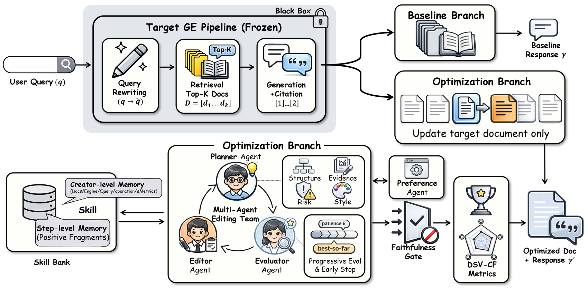
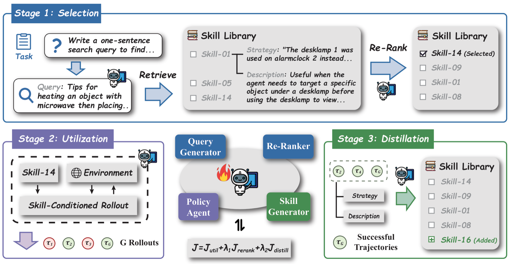
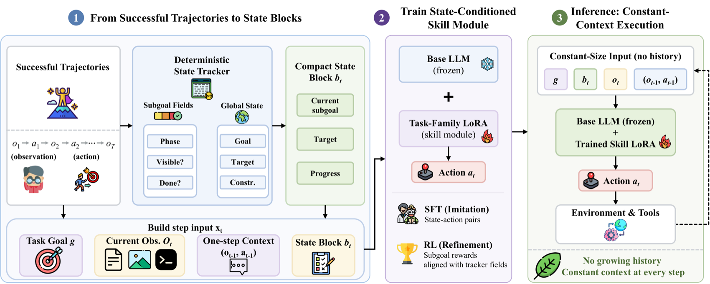
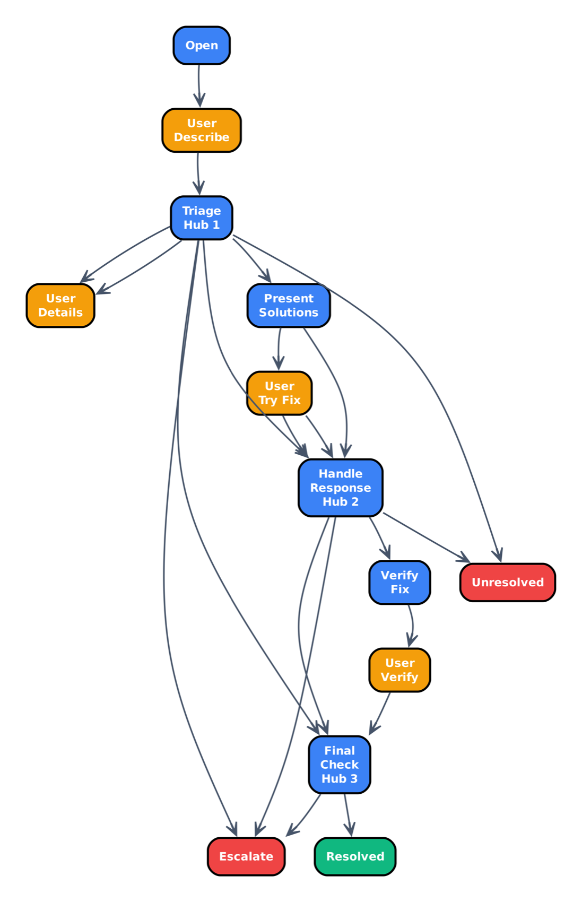
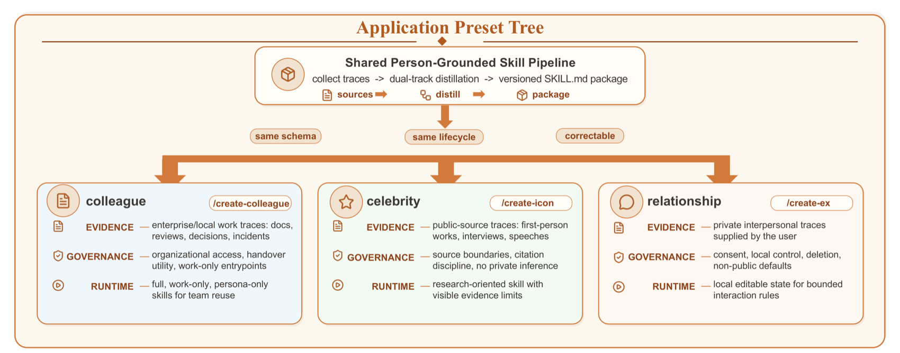
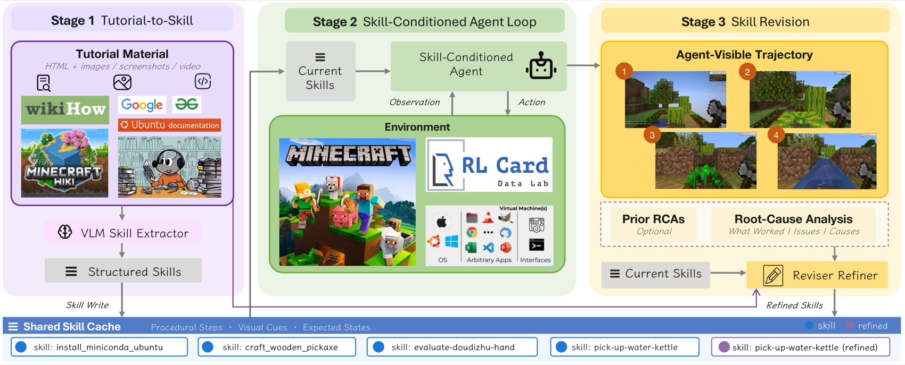
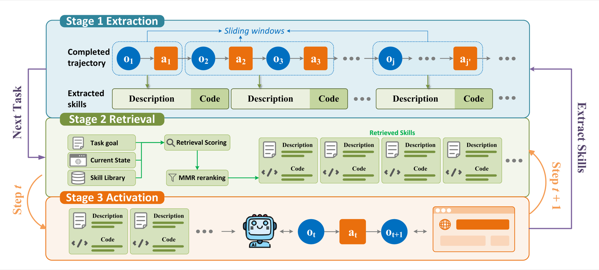

# 9.6 Paper Readings: Frontier Research on Skill Systems

This section interprets key papers related to Agent skill systems, covering three directions: skill learning, tool creation, and skill ecosystems.

---

## Voyager: LLM-Powered Lifelong Learning Agent

**Paper**: *Voyager: An Open-Ended Embodied Agent with Large Language Models*  
**Authors**: Wang et al., NVIDIA & Caltech  
**Published**: 2023 | [arXiv:2305.16291](https://arxiv.org/abs/2305.16291)

### Core Problem

In open-world environments, can an Agent **continuously explore and learn new skills** like a human, rather than only completing predefined tasks?

### Method and Principles

Voyager builds a complete closed loop for Agent skill learning in the Minecraft game:


### Key Findings

1. **Skill library is key to lifelong learning**: Agents without a skill library stagnate after 50 iterations, while Voyager with a skill library continues to improve
2. **Temporal scalability of skills**: Simple skills learned early can be reused by later complex tasks, forming a positive feedback loop
3. **Automatic curriculum > fixed curriculum**: GPT-4 generated adaptive curricula are 4.2x more efficient than human-designed fixed curricula
4. **Code as skill representation**: Representing skills as executable code is more precise and reliable than natural language descriptions

### Experimental Comparison

| Metric | Voyager | ReAct | Reflexion | AutoGPT |
|------|---------|-------|-----------|---------|
| Unique items obtained | **63** | 41 | 43 | 22 |
| Tech tree coverage | **15.3/36** | 8.5/36 | 9.2/36 | 5.4/36 |
| Distance explored (blocks) | **2,252** | 1,086 | 1,225 | 892 |

### Implications for Agent Development

Voyager demonstrates a key architectural pattern — **skill library + automatic curriculum + iterative improvement** enables lifelong learning in Agents. This pattern can be generalized to any Agent application:
- Customer service Agents can extract "conversation skills" from each successful dialogue
- Programming Agents can extract "coding skills" from each successful code modification
- Research Agents can extract "research skills" from each successful investigation

---

## CRAFT: Creating and Retrieving from Specialized Toolsets

**Paper**: *CRAFT: Customizing LLMs by Creating and Retrieving from Specialized Toolsets*  
**Authors**: Yuan et al., Peking University  
**Published**: 2024 | ICLR 2024 | [arXiv:2309.17428](https://arxiv.org/abs/2309.17428)

### Core Problem

Traditional Agents can only use **predefined tools** to solve problems. But what if a new type of problem arises with no ready-made tool? CRAFT proposes: **let the LLM create tools itself**.

### Method and Principles

> **Traditional approach (direct solving)**: Problem → LLM directly generates code to solve → prone to errors
>
> **CRAFT approach (create tools first, then solve)**:
> - Phase 1 (Create tools): LLM analyzes problem patterns → abstracts reusable tool functions → validates tools with test cases
> - Phase 2 (Use tools): Retrieve suitable tools from the tool library → combine tools to solve specific problems
>
> **Key insight**: "Abstraction" makes LLMs less error-prone — creating a "sum" tool + invoking it is more reliable than writing a large block of summation code directly

### CRAFT vs Direct Code Generation

```python
# Direct code generation (prone to errors)
def solve_directly(problem):
    """
    Problem: Compute the determinant of the following matrix
    [[1, 2, 3], [4, 5, 6], [7, 8, 9]]
    """
    # LLM writes the complete determinant computation code directly
    # Long code, prone to bugs
    matrix = [[1, 2, 3], [4, 5, 6], [7, 8, 9]]
    det = (matrix[0][0] * (matrix[1][1] * matrix[2][2] - ...)
           - matrix[0][1] * (...))  # Easy to get wrong!
    return det

# CRAFT approach (create tool first, then invoke)
def craft_approach():
    # Phase 1: Create a universal determinant computation tool
    def determinant(matrix):
        """Compute the determinant of any n×n matrix"""
        n = len(matrix)
        if n == 1: return matrix[0][0]
        if n == 2: return matrix[0][0]*matrix[1][1] - matrix[0][1]*matrix[1][0]
        det = 0
        for j in range(n):
            minor = [row[:j] + row[j+1:] for row in matrix[1:]]
            det += ((-1)**j) * matrix[0][j] * determinant(minor)
        return det
    # Validation: determinant([[2,1],[1,2]]) == 3  ✅
    
    # Phase 2: Invoke tool to solve specific problem
    result = determinant([[1, 2, 3], [4, 5, 6], [7, 8, 9]])
    return result  # More reliable
```

### Key Findings

1. **"Abstract first, then use" outperforms "direct solving"**: CRAFT significantly outperforms direct code generation on mathematical reasoning and visual question-answering tasks
2. **High tool reuse rate**: Approximately 60% of new problems can be solved directly using already created tools
3. **Tool composition capability**: Combining multiple simple tools can solve complex problems
4. **Quality validation is critical**: Tools without test case validation have a 3x higher error rate

### Implications for Agent Development

CRAFT provides an important design philosophy — Agents should not be limited to using predefined tools, but should be able to **create new tools on demand**. In real-world projects:
- When an Agent repeatedly encounters similar data processing needs, it can automatically create a specialized tool
- Created tools are validated and saved to the tool library for direct reuse next time
- This aligns with Voyager's skill library philosophy but applies to different scenarios

---

## Anthropic Skills Ecosystem

**Project**: *Anthropic Agent Skills*  
**Authors**: Anthropic  
**Released**: 2025 | [github.com/anthropics/skills](https://github.com/anthropics/skills)

### Core Contribution

Anthropic open-sourced a complete **declarative skill framework** that defines Agent skills using `SKILL.md` files. This is the first systematic standardization of Agent skills in the industry.

### Framework Design


### 16 Demonstration Skills Coverage Areas

| Category | Demonstration Skills | Purpose |
|------|---------|------|
| Document Processing | Document analysis, Content generation | Process various document formats |
| Creative Design | Theme factory, Canvas design | Generate brand assets and design proposals |
| Development Technology | Code review, Architecture design | Assist software development workflows |
| Enterprise Applications | Business communication, Data analysis | Daily office automation |

### Implications for Agent Development

The greatest contribution of Anthropic Skills is **lowering the barrier to skill creation** — you don't need to write code; just write a structured Markdown document to add new skills to an Agent. The community project [add-skill](https://add-skill.org/) further provides cross-platform skill installation tools, supporting mainstream AI programming tools such as Claude Code, Cursor, OpenCode, etc.

---

## Paper Comparison and Development Trajectory

| Paper/Project | Year | Skill Type | Core Innovation | Applicable Scenarios |
|----------|------|---------|---------|---------|
| HuggingGPT/JARVIS | 2023 | Model routing | Cross-model task distribution | Multimodal tasks |
| **Voyager** | **2023** | **Code skills** | **Skill library + lifelong learning** | Embodied intelligence/Exploration |
| Semantic Kernel | 2023 | Plugin | Enterprise-grade skill encapsulation | Enterprise applications |
| **CRAFT** | **2024** | **Tool creation** | **Create + Retrieve + Validate** | Problem solving |
| **Anthropic Skills** | **2025** | **Declarative skills** | **SKILL.md standardization** | General-purpose Agent |
| A2A Agent Card | 2025 | Skill declaration | Multi-Agent skill discovery | Multi-Agent collaboration |

**Development Trajectory**:


> 💡 **Frontier Trends (2025-2026)**: Agent skill systems are undergoing a shift from "manually defined" to "ecosystem-driven". Three major trends: ① **Skill standardization**: Anthropic's SKILL.md and Google's A2A Agent Card are becoming industry standards for skill description; ② **Skill marketplaces**: Community tools like add-skill CLI enable skills to be installed and shared like npm packages; ③ **Skill self-evolution**: Voyager and CRAFT demonstrate the possibility of Agents autonomously learning and creating skills — future Agents will continuously accumulate new skills during work, with skill libraries growing over time.

---

*Back to: [Chapter 9 Skill System](./README.md)*

*Next chapter: [Chapter 10 Agentic-RL: Agent Reinforcement Learning Training](../chapter_agentic_rl/README.md)*

---

## 📰 Latest Paper Express

> 🗓️ This section is maintained by a daily automated update task. Last updated: **August 5, 2026**

### [MAGEO: From Experience to Skills — Multi-Agent Reusable Policy Learning Framework (2026)](https://arxiv.org/abs/2604.19516)

> 🧬 **TL;DR**: Reframes generative engine optimization as multi-agent policy learning, progressively distilling validated editing patterns into engine-specific reusable skills.

**Core Problem**: Generative Engines (GE) are reshaping information access by replacing "ranked links" with "cited answers," but existing Generative Engine Optimization (GEO) methods optimize each instance in isolation and cannot accumulate or transfer effective strategies across tasks and engines.

**Method Introduction**: MAGEO reframes GEO as a **policy learning problem** — coordinated planning, editing, and fidelity-aware evaluation serve as the execution layer, with validated editing patterns progressively distilled into reusable, engine-specific optimization skills. To support controlled evaluation, it introduces a **Twin-Branch evaluation protocol** for causal attribution of content editing, along with the **DSV-CF** dual-axis metric that unifies semantic visibility and attribution accuracy, and releases the multi-scenario, multi-engine benchmark MSME-GEO-Bench. An overview of MAGEO under the Twin-Branch protocol is shown below:



> Image source: MAGEO paper (Source: 2026, arXiv:2604.19516, ACL 2026 Findings)

**Key Results**: Skill transferability was validated on multi-scenario, multi-engine benchmarks, confirming the feasibility of cross-engine policy accumulation.

**Relation to this Chapter**: Directly embodies this chapter's theme of "automatic creation and accumulation of Agent skills," complementing Voyager's code-as-skill approach — MAGEO automatically transforms policy experience into structured skills through multi-agent validation, representing the latest practice in the self-evolution of skills.

---

### [EvoAgent: Evolvable Skill Learning and Multi-Agent Delegation Framework (2026)](https://arxiv.org/abs/2604.20133)

> 🧬 **TL;DR**: Models skills as multi-file structured capability units with trigger mechanisms and evolution metadata, equipped with three-layer memory + three-stage matching, continuously evolving through a user feedback loop.

**Core Problem**: Existing Agent skills are mostly static, single-file, lacking trigger mechanisms, evolution metadata, and hierarchical memory, making it difficult to support dynamic decomposition of complex tasks and long-term capability accumulation.

**Method Introduction**: EvoAgent models skills as **multi-file structured capability units**, equipped with trigger mechanisms and evolution metadata, achieving continuous skill generation and optimization through a feedback-driven closed-loop process. It integrates a **three-stage skill matching strategy** with a **three-layer memory architecture**, supporting dynamic decomposition of complex tasks and long-term capability accumulation. The system architecture is shown below:


> Image source: EvoAgent paper (Source: 2026, arXiv:2604.20133)

**Key Results**: In real-world foreign trade scenarios, after integrating EvoAgent, GPT-5.2's composite score across professionalism, accuracy, and utility improved by approximately **28%** (LLM-as-Judge five-dimensional evaluation); transfer experiments indicate that Agent performance depends not only on the underlying model capability but also on model-architecture synergy.

**Relation to this Chapter**: Represents the latest practice in "skill lifecycle management" from this chapter — EvoAgent's trigger mechanisms correspond to skill discovery, closed-loop feedback to skill optimization, and three-layer memory to skill persistence, fully covering the entire lifecycle from skill creation to evolution.

---

### [Skill1: Reinforcement Learning-Driven Unified Evolutionary Framework for Skill-Augmented Agents (2026)](https://arxiv.org/abs/2605.06130)

> 🧬 **TL;DR**: Co-evolves three capabilities — skill selection, exploitation, and distillation — using a single policy and a single task outcome signal, with high-frequency and low-frequency components of the reward signal dividing the labor.

**Core Problem**: Maintaining a skill library requires three coupled capabilities — selecting relevant skills, exploiting them for execution, and distilling new skills from experience. Existing methods optimize these in isolation or use separate reward sources, leading to partial and conflicting evolution.

**Method Introduction**: Skill1 trains a **single policy** to co-evolve skill selection, exploitation, and distillation toward a common task outcome objective. The policy generates queries to search the skill library, re-ranks candidates to pick one, conditions on that skill to solve the task, then distills a new skill from the trajectory. Key ingenuity: all learning comes from a single task outcome signal — its **low-frequency trend** is attributed to selection, and its **high-frequency variation** to distillation. The framework overview is shown below:



> Image source: Skill1 paper (Source: 2026, arXiv:2605.06130)

**Key Results**: The superiority of the unified evolutionary strategy was validated on benchmarks including ALFWorld and WebShop, avoiding multi-component objective conflicts.

**Relation to this Chapter**: Directly corresponds to this chapter's theme of "dynamic update and reinforcement learning of skill libraries," with Skill1 finely decomposing RL signals to simultaneously drive skill selection and distillation, representing the latest extension of Voyager's "code-as-skill" approach into the RL era.

---

### [From History to State: Constant-Context Skill Learning for LLM Agents (2026)](https://arxiv.org/abs/2605.05413)

> 🧬 **TL;DR**: "Freeze" reusable workflows into lightweight task modules, where inference only looks at current observations + compact state blocks, using context-to-weights to balance privacy and capability.

**Core Problem**: Personal Agents face a "privacy-cost-capability" tension — cloud models with multi-step workflows are powerful but expose sensitive intermediate context to external APIs, while local models preserve privacy but lack reliability; both settings also incur recurring costs for long skill prompts and growing history.

**Method Introduction**: Proposes **constant-context skill learning**, a context-to-weights framework: reusable workflows are learned into lightweight task-family modules, and inference is conditioned only on current observations and compact state blocks. A deterministic tracker renders state blocks from task progress and provides aligned sub-goal rewards, enabling each module to be trained with step-level SFT and then refined with RL. The skill learning pipeline is shown below:



> Image source: This paper (Source: 2026, arXiv:2605.05413)

**Key Results**: On benchmarks including ALFWorld, WebShop, and SciWorld, Qwen3-8B achieves **89.6%/76.8%/66.4%** success rates on unseen tasks, reducing prompt token consumption by 2–7x compared to traditional methods.

**Relation to this Chapter**: Highly relevant to this chapter's theme of "persistent storage and context compression of skills," combining skill learning with context engineering to achieve skill reuse capability close to cloud-based large models on local models.

---

### [HASP: Harnessing LLM Agents with Executable Skill Programs — Upgrading Agent Skills from Passive Advice to Active Intervention (2026)](https://arxiv.org/abs/2605.17734)

> 🧬 **TL;DR**: Upgrades skills from "natural language suggestions" to executable program functions (PF) that automatically activate and correct the next action in high-failure-risk states.

**Core Problem**: Existing skill systems encode experience as natural language suggestions, lacking clear trigger conditions and intervention mechanisms — skills "passively advise" but do not "actively intervene," unable to correct deviations in high-risk states in time.

**Method Introduction**: HASP (Harnessing LLM Agents with Skill Programs) upgrades skills to executable **program functions (PF)** that automatically activate and correct the next action when the Agent encounters a high-failure-risk state. It supports three usage modes: plug-and-play intervention at inference time, post-training supervised fine-tuning, and self-evolution through a verification-teacher loop, advancing skills from "memory" to "action."

**Key Results**: In web search reasoning tasks, inference-time PF improves over the ReAct Agent by **25%**, and combining training and evolution exceeds Search-R1 by **30.4%**.

**Relation to this Chapter**: Corresponds to this chapter's knowledge point on "dynamic triggering and execution of skills," evolving Voyager-style textual skills into structured, verifiable program skills, representing a major paradigm upgrade of Agent skill systems from "memory" to "action."

---

### [Compiling Agentic Workflows into LLM Weights: Near Frontier Quality at Two Orders of Magnitude Lower Cost (2026)](https://arxiv.org/abs/2605.22502)

> 🧬 **TL;DR**: Directly distills Agent workflow steps into small model weights, creating "underground Agents" — capable of independently completing complex workflows without external orchestrators, preserving privacy while saving costs.

**Core Problem**: Mainstream Agent frameworks (LangGraph, CrewAI, etc., collectively exceeding 290K GitHub Stars) all use an "external orchestrator on top of LLM" pattern, injecting instructions and routing each round. Recent work shows that for procedural tasks, directly writing the workflow into a frontier model's system prompt can outperform this orchestrator — but at the cost of consuming context windows, requiring a frontier model for every conversation, and exposing proprietary workflows to third parties. Distilling workflows into small model weights ("underground Agents") should solve all these problems.

**Method Introduction**: This paper directly distills Agent process steps into **small fine-tuned model weights**, enabling them to independently complete complex workflows (e.g., 14-node travel booking, 55-node insurance claims processes). Taking a production-grade customer service workflow as an example, the flow chart is shown below:



> Image source: This paper (Source: 2026, arXiv:2605.22502)

**Key Results**: On three production-grade workflows, the compiled small model achieves near-frontier-model quality at **one hundredth** the cost, while protecting proprietary workflow privacy.

**Relation to this Chapter**: Corresponds to this chapter's knowledge point on "skill internalization and model fine-tuning," revealing a viable path to transform Agent skills from runtime tricks into model-endogenous capabilities, providing a new direction for lightweight skill deployment.

---

### [MUSE-Autoskill: Skill Creation, Memory, Management, and Evaluation-Driven Agent Self-Evolution Framework (2026)](https://arxiv.org/abs/2605.27366)

> 🧬 **TL;DR**: Equips skills with a unified five-stage lifecycle (Create → Remember → Manage → Evaluate → Refine), each skill carrying SKILL.md + scripts + unit tests + .memory.md, with sandbox validation before registration.

**Core Problem**: Existing skill creation methods treat skills as isolated static artifacts — lacking memory mechanisms, automatic testing, and iteration, skills are "use once and discard," limiting reusability, reliability, and long-term improvement.

**Method Introduction**: ByteDance's ByteBrain team proposes MUSE-Autoskill (Memory-Utilizing Skill Evolution), defining a unified five-stage skill lifecycle (Create, Remember, Manage, Evaluate, Refine): each skill comes with a structured **SKILL.md** interface, executable scripts, and unit tests, registered into the library only after sandbox validation; each skill also maintains `.memory.md` recording cross-task experience; context management uses DAG node graphs and two-level compression to prevent token overflow. The Agent architecture is shown below:


> Image source: MUSE-Autoskill paper (Source: 2026, arXiv:2605.27366, ByteDance ByteBrain)

**Key Results**: On SkillsBench (51 real-world tasks), self-generated skills achieved **87.94%** accuracy on 35 tasks, exceeding the 68.40% of human-expert-written skills; transferring MUSE skills to Hermes improved accuracy by **10.51 percentage points**.

**Relation to this Chapter**: Represents the latest flagship work in the direction of "automatic creation, accumulation, and evolution of skills" from this chapter, continuing the code-as-skill approach of Voyager while introducing two new dimensions — skill lifecycle management and cross-Agent skill transfer — directly reflecting the frontier trend of skill systems moving toward "skill ecosystems" as discussed in this book.

---

### [COLLEAGUE.SKILL: Automated AI Skill Generation via Expert Knowledge Distillation (2026)](https://arxiv.org/abs/2605.31264)

> 🧬 **TL;DR**: Fully automatically distills experts' digital traces (messages/documents/screenshots) into dual-track skill packages — "work skill layer + personality layer" — following AgentSkills standards with version management.

**Core Problem**: LLM Agents increasingly need to embody human expertise and interaction styles, but this actionable knowledge is typically buried in heterogeneous traces rather than written as clean instructions. Existing memory/personality systems only capture fragments, and skill frameworks only provide packaging formats — what's missing is an end-to-end workflow to distill traces into inspectable, correctable, Agent-usable skills.

**Method Introduction**: Shanghai AI Lab proposes COLLEAGUE.SKILL, an **automated traces-to-skills distillation system** that generates personalized AI skills. Given materials of a target person/role, it produces versioned skill packages with two synergistic tracks: a **capability track** carrying explicit knowledge such as technical specifications and decision frameworks; and a **persona track** carrying implicit patterns such as language style and decision priorities. The skill package layered presets are shown below:



> Image source: COLLEAGUE.SKILL paper (Source: 2026, arXiv:2605.31264, Shanghai AI Lab)

**Key Results**: Achieves a fully automated pipeline from digital traces to transferable expert skills, with skill packages following the AgentSkills open standard, supporting continuous evolution and version management (rollback); received 13,000+ Stars on GitHub within two weeks.

**Relation to this Chapter**: Corresponds to this chapter's knowledge point on "automatic skill generation and standardization," with COLLEAGUE.SKILL advancing skill creation from manual authoring to fully automated extraction from real work data — representing the latest practice in the transferability of expert knowledge under the AgentSkills standard, and an important signal of skill systems expanding from programming environments to real organizational knowledge management.

---

### [MMG2Skill: Can Agents Distill Wild Guides into Self-Evolving Skills? (2026)](https://arxiv.org/abs/2606.01993)

> 🧬 **TL;DR**: Compiles "wild multimodal guides" into editable structured skills, using trajectory-level root-cause feedback to revise skills (no benchmark scores needed), making fixed VLM Agents stronger with use.

**Core Problem**: The internet contains vast amounts of procedural knowledge, but it is multimodal, heterogeneous, noisy, and implicitly assumes human execution, making it difficult to directly use as skills needed by Agents.

**Method Introduction**: This paper formalizes the problem as **"Guide-to-Skill Learning"**: compile guides into editable structured skills, condition a fixed VLM Agent on the skill during execution, then revise skills using **trajectory-level root-cause feedback** (no benchmark scores needed). It also releases the first dedicated benchmark, MMG2Skill-Bench. The framework is shown below:



> Image source: MMG2Skill paper (Source: 2026, arXiv:2606.01993)

**Key Results**: Across three task categories — GUI control, open-world gaming, and strategy card games — six VLM backbones all achieved macro-average improvements of **+12.8 to +25.3 percentage points**; ablation shows that directly feeding raw guides actually degrades performance, and both structured compilation and trajectory feedback are indispensable.

**Relation to this Chapter**: Corresponds to this chapter's knowledge point on "automatic skill generation and continuous improvement," representing the latest exploration of using real-world heterogeneous documents (rather than code execution) as a source of skill knowledge, enriching the path of automatically distilling skills from human knowledge.

---

### [SGDR: State-Grounded Dynamic Retrieval — Online Skill Learning for Web Agents (2026)](https://arxiv.org/abs/2606.04391)

> 🧬 **TL;DR**: Upgrades skill retrieval from "task-level one-shot" to "step-level dynamic matching" — matching both the task goal and the current web page state at each step.

**Core Problem**: Existing skill learning methods perform static reuse at the "task level" — retrieving a skill set once based on the initial task instruction, with execution held fixed throughout. But in web execution, the appropriate next action depends not only on the task goal but also on the constantly changing current web page state; the initial skill set often fails to cover mid-session states.

**Method Introduction**: SGDR (State-Grounded Dynamic Retrieval) proposes three components: **sliding window trajectory extraction** slices completed trajectories into sub-procedures callable at intermediate states; **dual text-code representation** bridges semantic retrieval and executable actions; and **state-grounded dynamic retrieval** matches both the task goal and the current web page state at each step. The method overview is shown below:



> Image source: SGDR paper (Source: 2026, arXiv:2606.04391)

**Key Results**: In experiments across five WebArena domains, SGDR with GPT-4.1 achieves a **37.5%** average success rate, improving by approximately **10.6%** over the strongest baseline.

**Relation to this Chapter**: Directly corresponds to this chapter's knowledge point on "skill retrieval and reuse," upgrading skill retrieval from "task-level one-shot" to "step-level dynamic matching" — the latest achievement of deep integration between Skill Learning and Agentic RAG, complementing the coarse granularity of skill retrieval in frameworks like Voyager.

---

### [Compositional Skill Routing: A Decompose-Retrieve-Compose Framework Based on MCP Skills (2026)](https://arxiv.org/abs/2606.18051)

> 🧬 **TL;DR**: Decomposes complex requests into atomic sub-tasks, retrieves MCP skills for each, then composes them into an executable plan using a dependency-aware DAG planner.

**Core Problem**: LLM Agents increasingly rely on external skills (reusable tool specifications), but real-world tasks often require multiple skills rather than just one. Existing work treats skill retrieval as "whole-task matching to a single skill," making it difficult to handle complex requests requiring multi-skill collaboration.

**Method Introduction**: This paper formalizes the problem as **compositional skill routing**: given a complex query and a large skill library, decompose the query into atomic sub-tasks, retrieve suitable skills for each sub-task, then compose them into an executable plan. It proposes a **Decompose-Retrieve-Compose framework** — an LLM task decomposer + a dual-encoder skill retriever with FAISS index + a dependency-aware DAG planner. To support evaluation, it releases a benchmark of **300 compositional queries covering 2,209 real MCP server skills across 24 functional categories**. Experiments reveal standard LLM decomposition achieves only 34.2% step-level category recall, prompting the proposal of retrieval-augmented decomposition (SAD) as an improvement.

**Key Results**: The compositional routing approach significantly outperforms single-shot holistic matching on multi-skill collaborative tasks while reducing per-step tool invocation redundancy; SAD retrieval-augmented decomposition effectively improves decomposition quality.

**Relation to this Chapter**: Corresponds to this chapter's knowledge points on "skill retrieval and reuse" and "skill orchestration," representing the latest framework upgrading skill systems from "single-skill invocation" to "multi-skill composition," directly addressing real-world skill marketplace scenarios under the MCP ecosystem, complementing the lack of skill composition dimensions in works like Voyager and SGDR.

---

### [Skills Are Not Isolated: Dependency and Risk Measurement in Agent Skill Supply Chains (2026)](https://arxiv.org/abs/2607.01136)

**Published**: July 1, 2026 | [arXiv:2607.01136](https://arxiv.org/abs/2607.01136)

**Core Contribution**: This paper proposes the Agent Skill Supply Chain (ASSC) framework, drawing from the software SBOM (Software Bill of Materials) concept, designing SkillDepAnalyzer to automatically extract natural language dependency evidence from skills and model it as a dependency graph. Large-scale analysis of 1.43 million skills reveals four structural patterns: skill metadata is "activation-ready but governance-scarce"; dependency graphs span three layers — skill, package, and service — with concentrated reuse; recursive reuse expands implicit package manifests; and skill dependency clusters gather around workflows. The study also finds that reviewing a single skill in isolation misses security signals hidden in its dependency chain, and successfully identifies multiple in-the-wild malicious skills that were missed by existing scanning tools (SkillSpector, Cisco Skill Scanner).

**Relation to this Chapter**: Corresponds to this chapter's knowledge point on "skill system security and governance," representing the first work to systematically analyze Agent skill ecosystem security risks from a supply chain perspective, complementing the already included Detect Malicious Agent Skills (Locate-and-Judge) in this chapter — the latter detects malicious skills at runtime, while this paper quantifies systemic risk at the dependency chain level.

---

### [MetaSkill-Evolve: A Dual-Timescale Meta-Skill Recursive Self-Improvement Framework (2026)](https://arxiv.org/abs/2607.05297)

**Published**: July 6, 2026 | [arXiv:2607.05297](https://arxiv.org/abs/2607.05297)

**Core Contribution**: Existing self-evolving Agents only improve task skills (what to do), while the improvement process itself (how to improve) is written once and held fixed. MetaSkill-Evolve proposes a dual-timescale framework to make skill improvement **recursive**: each branch carries both a task skill s and a branch-local meta-skill m=(ψ,σ,α,π,ε), whose five components respectively parameterize the analyzer, retriever, allocator, proposer, and evolver. Task skills evolve on a fast cycle, while meta-skills evolve on a slow cycle by applying the same pipeline to themselves, requiring no additional models or objectives. On three Agent benchmarks — OfficeQA, SealQA, and ALFWorld — improvements over the original backbone model reach **+23.54, +16.09, and +1.92** percentage points respectively.

**Relation to this Chapter**: Corresponds to this chapter's knowledge point on "skill self-evolution and recursive improvement," with MetaSkill-Evolve being the first to treat the skill improvement process itself as an evolvable object, achieving the recursive self-improvement of "learning how to learn" — a major breakthrough from single-layer skill evolution to meta-skill recursive upgrade, following Skill1 (RL-driven skill evolution).

---

### [SkillSight: Eliminating Shared Description Background Bias for Precise Skill Retrieval (2026)](https://arxiv.org/abs/2607.18785)

**Published**: July 21, 2026 | [arXiv:2607.18785](https://arxiv.org/abs/2607.18785)

**Core Contribution**: In large skill libraries, different skill descriptions share substantial amounts of generic template language ("use this tool to...", "this skill can..."), and such shared backgrounds systematically inflate dense similarity scores, masking the task-relevant signals that truly distinguish skill capabilities. SkillSight is a training-free retrieval calibration framework: **Semantic Background Calibration (SBC)** uses IDF to identify generic tokens and estimates a background subspace to eliminate them; **Lexical Evidence Calibration (LEC)** down-weights shared background tokens to restore discriminative lexical evidence. On SRA-Bench and SkillBench-Supp, Recall@10 improves by up to **20.21 percentage points**; end-to-end evaluation outperforms LLM direct selection by 4.97 pp; inference speed is up to **1,248x faster** than the "dense retrieval + re-ranking" baseline.

**Relation to this Chapter**: Corresponds to this chapter's knowledge point on "skill retrieval and reuse." SkillSight analyzes the structural root cause of semantic retrieval failure in skill libraries from an information theory perspective, providing a lightweight and efficient calibration solution for precise skill recall in large-scale MCP/skill ecosystems, complementing SGDR (step-level dynamic retrieval) — the former addresses background bias, while the latter addresses static granularity.

---

### [Skill Self-Play: Co-Evolution of Proposer-Solver-Controller, Breaking Through LLM Tool Calling and Reasoning Upper Limits (2026)](https://arxiv.org/abs/2607.22529)

**Published**: July 24, 2026 | [arXiv:2607.22529](https://arxiv.org/abs/2607.22529)

**Core Contribution**: Existing LLM self-evolution methods face a dilemma: environment-constrained methods get precise feedback but are limited to narrow domains, while open-ended self-generation methods expand the task space but lack reliable verification, allowing misleading rewards to contaminate the training loop. This paper identifies **Agent skills** as the effective intermediate layer to reconcile this tension — each skill guarantees verifiable execution in specific scenarios, while cross-skill dynamic routing maintains open-ended task diversity. Skill Self-Play (Skill-SP) consists of three parts: the **proposer** generates challenging tasks based on dynamically sampled skills; the **solver** explores candidate solutions to push the capability frontier; and the **skill controller** collects execution feedback to update and expand the skill library. The three co-evolve through an RL loop, bridging the gap between "structured verification" and "open-ended exploration." On tool calling and reasoning benchmarks, Skill-SP consistently breaks through performance ceilings for high-capability backbone models, and achieves significant leapfrog improvements for models with initially poor alignment; the code is open-sourced in the Qwen repository.

**Relation to this Chapter**: Corresponds to this chapter's knowledge points on "skill system self-evolution" and "skill generation and update." Skill-SP introduces the RL self-play paradigm from the "task level" to the "skill level" — following Skill1 (RL-driven single-skill evolution) and MetaSkill-Evolve (meta-skill recursive improvement), it represents the latest breakthrough in skill systems moving from "human-designed" to "fully automated continuous evolution." Produced by Alibaba's Qwen team and already open-sourced, it carries high engineering reference value.

---

### [SkillRise: An Agentic Reinforcement Learning Framework for Cross-Task Skill Evolution (2026)](https://arxiv.org/abs/2607.26784)

**Published**: July 29, 2026 | [arXiv:2607.26784](https://arxiv.org/abs/2607.26784)

**Core Contribution**: Standard Agentic RL treats tasks as independent episodes and cannot accumulate transferable skills across task execution; existing skill learning methods either target only single-task repeated attempts or adopt multi-stage pipelines that decouple skill extraction, retrieval, and execution. SkillRise proposes a **unified reinforcement learning skill cross-task evolution** framework: organizing related task instances as a progressive challenge sequence, using a single policy to alternate between "task solving" and "skill documentation curation" — skill documentation is directly passed to the next task, and decoupled credit assignment supervises solving with the current task outcome, and curation with discounted downstream outcomes. On ALFWorld, WebShop, and ScienceWorld, SkillRise's Pass@1 improves by **2.3–8.5 percentage points** over the strongest baselines; cross-task testing further reveals that longer task sequences yield better performance — indicating the model is transferring skills rather than re-sampling the same task, and significantly reducing the runtime overhead of multi-stage skill learning pipelines.

**Relation to this Chapter**: Directly corresponds to this chapter's knowledge points on "skill system self-evolution" and "transferable skills." SkillRise validates the learning paradigm of "continuously curating skills across task sequences" — requiring no human-annotated skill boundaries or offline knowledge distillation. It represents another route to automated skill accumulation through RL, following Skill Self-Play (three-party co-evolution), with the two complementing each other — the former expands the skill library through proposal-verification gameplay, while this paper relies on progressive evolution across task sequences.

---

### [FRAMES: A Dual-Objective Skill Evolution and Guardrail Framework for Policy-Driven Enterprise Workflows (2026)](https://arxiv.org/abs/2608.01772)

**Published**: August 4, 2026 | [arXiv:2608.01772](https://arxiv.org/abs/2608.01772)

**Core Contribution**: When deploying Agents in enterprise environments, skill evolution faces constraints different from research scenarios: skills must be grounded in enterprise policies (compliance requirements, data access norms, SLA constraints), the evolution process must be auditable, and deployed skills must not degrade during updates. FRAMES proposes a **dual-objective guarded skill evolution** framework: simultaneously optimizing the cost-accuracy trade-off frontier (efficiency objective) and policy compliance (compliance objective), maintaining a Pareto frontier and recording policy alignment evidence for each skill evolution path; using a runtime skill selection policy (context-aware selection + policy guard) to verify the equivalence of a successor under policy constraints before taking the predecessor offline, preventing deployment degradation. Evaluations across three enterprise workflow scenarios — finance, healthcare, and legal compliance — show FRAMES improves policy compliance by approximately 30% while maintaining task success rates comparable to unconstrained evolution.

**Relation to this Chapter**: Directly corresponds to this chapter's knowledge points on "enterprise-grade skill systems" and "skill auditability." FRAMES expands skill evolution from "maximizing task performance" to "maximizing task performance within policy constraints." Following SkillRise (cross-task progressive evolution) and Skill Self-Play (three-party co-evolution), it brings skill evolution back to real-world production constraints — the latest work with direct architectural reference value for deploying Agent skill systems in regulated industries.

---
