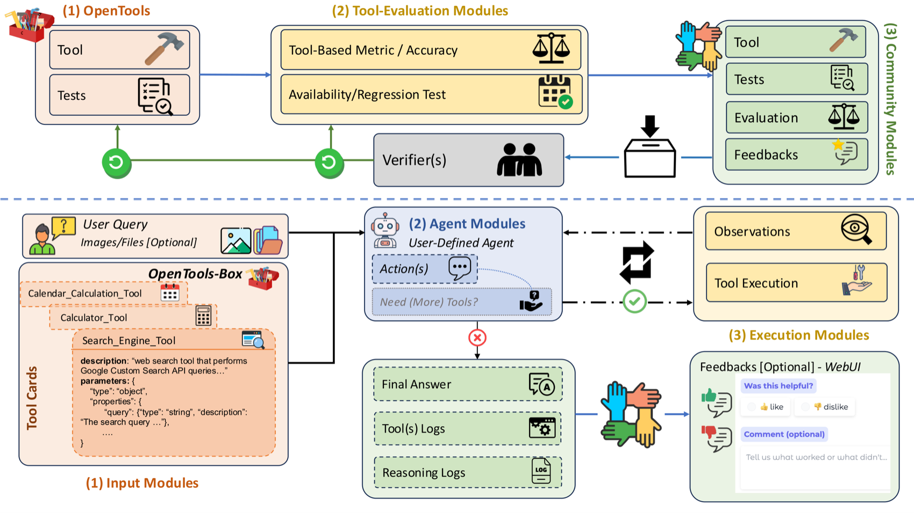
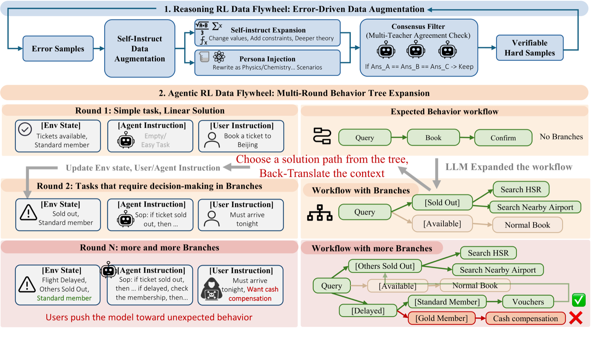
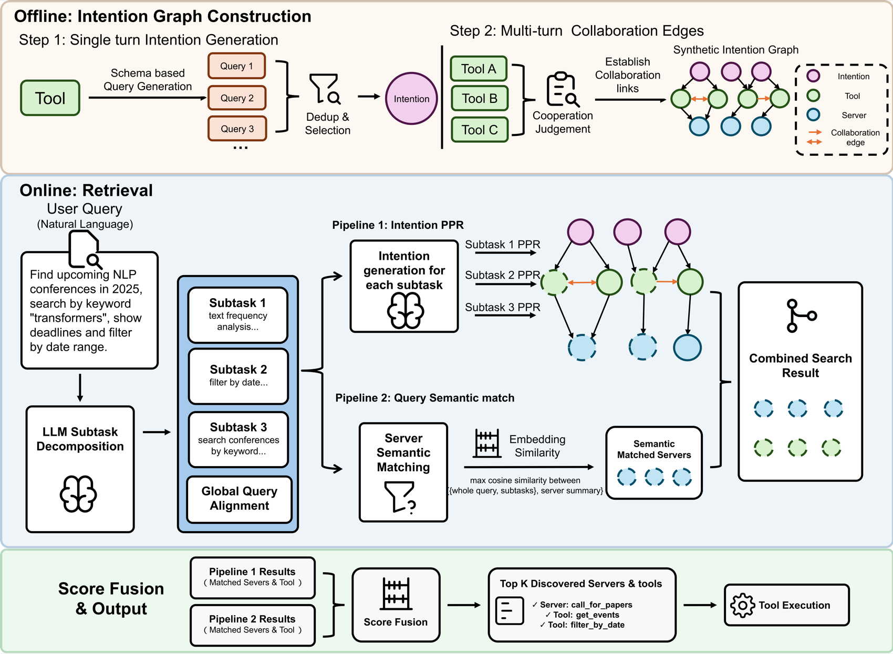
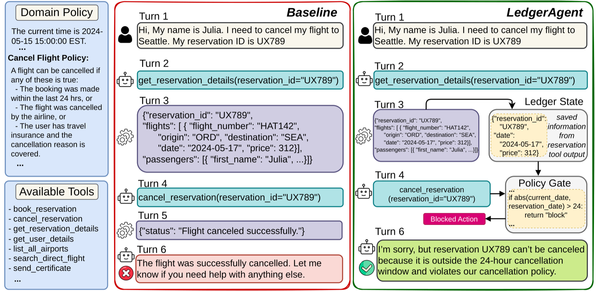

# 3.6 Paper Reading: Frontier Advances in Tool Learning

> 🎯 **Learning Objectives**: Deeply understand how self-supervised learning solves the challenge of "when should AI use tools," and master the self-training approach of Function Calling.

> 📖 *"The best way to predict the future is to invent it."*  
> *"Teaching LLMs to use tools" is one of the most active directions in Agent research. This section provides an in-depth analysis of three foundational papers.*


---

## Toolformer: Teaching Models to Teach Themselves Tool Use

**Paper**: *Toolformer: Language Models Can Teach Themselves to Use Tools*  
**Published**: 2023 | [arXiv:2302.04761](https://arxiv.org/abs/2302.04761)

### Reflection: Why Not Have Humans Label Every Tool Call?

If you want to train an Agent capable of using a calculator and a search engine, the most intuitive approach is to label massive amounts of data: `User: 1+1? -> Assistant: [Call Calculator(1+1)]`. But the problem is: you can never exhaustively label every scenario where humans might need tools.

### Design Principle: Let Models Learn by "Predicting the Future"

Toolformer proposed a highly counterintuitive yet brilliant idea: **if calling a tool helps me predict the next word, then that tool is useful.**

#### 💡 Toolformer Training Loop
We automatically filter high-quality training data through the following process:

{visualizer_call: toolformer_training_loop}

### Practice Exercise: How to Build a Simplified Toolformer?

Consider this: if introducing a tool call improves the model's probability of predicting subsequent text, how should we decide whether this tool call is worth keeping?

Below is a simplified implementation. In real training, the loss difference is computed based on token-level log-probability; here we use sequence average log-probability to express the core idea:

```python
def calculate_utility(response_with_tool, response_without_tool, threshold=0.05):
    """
    Calculate the utility brought by a tool call.

    Args:
        response_with_tool: Model evaluation result after using the tool, e.g. {"avg_logprob": -0.8}
        response_without_tool: Model evaluation result without using the tool, e.g. {"avg_logprob": -1.1}
        threshold: Minimum benefit threshold to avoid misclassifying weak fluctuations as valid tool calls

    Returns:
        dict: Contains utility score and a judgment on whether to retain this tool call.
    """
    utility_score = (
        response_with_tool["avg_logprob"]
        - response_without_tool["avg_logprob"]
    )

    return {
        "utility_score": utility_score,
        "keep_tool_call": utility_score > threshold,
    }

# Example: average log-probability improves from -1.10 to -0.82 after using the tool
result = calculate_utility(
    response_with_tool={"avg_logprob": -0.82},
    response_without_tool={"avg_logprob": -1.10},
)
print(result)  # {"utility_score": 0.28, "keep_tool_call": True}
```

This example illustrates: the key insight of Toolformer is not having humans tell the model "when to call a tool," but letting the model autonomously discover valuable tool call samples through probability improvement. **When a tool call significantly improves the quality of subsequent text prediction, add this call trajectory to the training data; otherwise, discard it.**

---

## Gorilla: Precision in Large-Scale API Calls

**Paper**: *Gorilla: Large Language Model Connected with Massive APIs*  
**Published**: 2023 | [arXiv:2305.15334](https://arxiv.org/abs/2305.15334)

Toolformer focuses on "when to call tools," while Gorilla focuses on another engineering problem: **when the number of tools is very large, can the model accurately select the right API and generate correct parameters?**

### Core Problem: API Hallucination

In real-world business scenarios, an Agent faces not just one or two tools, but possibly dozens, hundreds, or even thousands of APIs. At this scale, models are prone to three types of errors:

- **Calling non-existent APIs**: Confusing function names seen in training corpora with the current system's tools.
- **Incorrect parameter structure**: Field names, types, or required fields not matching the real schema.
- **Version mismatch**: The API has been updated, but the model still calls it according to old documentation.

Gorilla's value lies in combining API documentation, retrieval, and model generation, allowing the model to first find the most relevant API documentation before generating call code or parameters based on that documentation.

### Implications for Agent Development

- **Tool documentation is part of the context**: Don't just give tool names — provide clear parameter descriptions, boundary conditions, and examples.
- **Retrieval is essential when tools are numerous**: When the number of tools exceeds the model's context budget, first retrieve relevant tools, then inject a small set of candidate tools into the context.
- **Call results need verification**: Production systems cannot blindly trust model-generated parameters; erroneous calls should be intercepted through schema validation, unit tests, or dry-run mechanisms.

Gorilla can be understood as an early representative of the later engineering pattern of "tool retrieval + Function Calling + MCP lazy loading."

---

## 📰 Latest Paper Updates

> 🗓️ This section is maintained by a daily auto-update task. Last updated: **August 4, 2026**

### [OpenTools: A Community-Driven Framework for Reliable Tool-Using Agents (2026)](https://arxiv.org/abs/2604.00137)

> 🧬 **One-Line Summary**: Unreliable tool calling isn't just the Agent's fault — the tools themselves can be wrong. OpenTools is the first to treat "tool quality itself" as a first-class citizen to govern.

**Core Problem**: Failures in tool-integrated LLMs have two sources, but previous research almost exclusively focused on one — **tool call accuracy** (whether the Agent selects the right tool, passes the right parameters) and **tool accuracy itself** (whether the tool implementation is correct, available, and free of regressions). A tool with a buggy implementation cannot be salvaged by even the smartest Agent.

**Method**: OpenTools designs two complementary workflows (see figure below). **Upper layer (Maintenance Flow)**: Community modules continuously collect new tools, test cases, and feedback; they are reviewed and accepted by verifiers (tool creators/maintainers), updating a standardized toolbox and evaluation suite; the tool evaluation module then runs standardized checks and refreshes each tool's "intrinsic reliability signal" (accuracy, availability, regression). **Lower layer (Execution Flow)**: Users input queries and select tools from OpenTools-Box; the Agent module decides and initiates calls; the execution module runs the tool and returns observations; finally, structured tool/reasoning logs are produced along with the answer. This design turns "tool quality" into a continuously evolving closed loop driven by the community.



*▲ Original OpenTools Figure (Source: Dang et al., 2026, arXiv:2604.00137)*

**Key Results**: Across four frameworks — Prompting / ReAct / OctoTools / MultiAgent — replacing the toolbox from OctoTools-T with the higher intrinsic-quality OpenTools-T resulted in consistent overall average score improvement — proving that **"improving tool quality itself" directly translates to end-to-end reliability gains**, rather than only optimizing Agent reasoning.

**Relation to This Chapter**: Directly echoes this chapter's "Tool Integration and Encapsulation" knowledge points. It is the first to elevate tool quality management to a systemic issue equally important as Agent reasoning capability, and is an important reference framework for building production-grade tool ecosystems.

---

### [Tool Attention: Dynamic Tool Gating and Lazy Loading Eliminate MCP Context Overhead (2026)](https://arxiv.org/abs/2604.21816)

> 🧬 **One-Line Summary**: Migrate "Attention is All You Need" from the token level to the tool level — only let the Schema of relevant tools enter the context, cutting MCP's "tool tax."

**Core Problem**: The MCP protocol relies on "stateless + eager Schema injection" to connect Agents with tools, stuffing all tool Schemas into the context every round, causing a hidden overhead of **10k–60k tokens/round** (what the paper calls the *MCP Tax / Tools Tax*). This not only bloats the KV Cache but can also degrade inference quality when context utilization approaches the ~70% "breakpoint."

**Method**: Proposes a **Tool Attention** middleware layer, generalizing the self-attention idea into "gated attention over tools," with three components collaborating: (i) **Intent-Schema Overlap Score (ISO Score)** — uses sentence vectors to compute similarity between user intent and each tool's Schema; (ii) **State-Aware Gating Function** — determines which tools should be "activated" based on conversation state; (iii) **Two-Stage Lazy-Load Schema Pool** — only promotes the full Schema of relevant tools from the pool to the context when truly needed.

**Key Results**: On a simulated benchmark with 6 MCP servers / 120 tools (500 tasks, 3 seeds), per-round tool tokens dropped from **47.3k to 2.4k (~−95%)**, and effective context utilization improved from 24% to 91%. (Note: The paper explicitly labels some LLM quality metrics as *projected estimates* based on token counts and public telemetry, not real LLM runs.)

**Relation to This Chapter**: Directly corresponds to this chapter's "MCP Tool Protocol" and "Context Efficiency Optimization" knowledge points, providing an implementable engineering approach for tool registration and dynamic scheduling in large-scale Agentic workflows.

---

### [AgenticQwen: Training Small Industrial-Grade Tool-Calling Models with Dual Data Flywheels (2026)](https://arxiv.org/abs/2604.21590)

> 🧬 **One-Line Summary**: Use "two data flywheels that feed each other" to automatically generate increasingly difficult training tasks, training small models into Agents capable of handling industrial-grade multi-step tool calls.

**Core Problem**: Industrial applications increasingly require Agents with multi-step reasoning and tool-use capabilities, but are constrained by cost and latency, making **small Agentic models** highly valuable. The challenge: high-quality multi-step tool call training data is scarce and difficult to manually annotate.

**Method**: AgenticQwen trains with multi-round RL on synthetic data plus a small amount of open-source data, with the core being **dual data flywheels** (see figure below): the **Reasoning Flywheel** continuously increases task difficulty through "learning from mistakes" — taking problems the model got wrong, making them harder, and feeding them back; the **Agentic Flywheel** expands linear workflows into **multi-branch behavior trees**, making training tasks reflect real-world decision complexity (branching, rollback, conditions). The two flywheels continuously and automatically generate increasingly challenging tasks, driving small models to approach large-model tool-calling capabilities.



*▲ Original AgenticQwen Figure (Source: Alibaba, 2026, arXiv:2604.21590)*

**Key Results**: The resulting small Agentic model approaches large-model performance on search and data analysis tasks; model weights and synthetic data have been open-sourced on HuggingFace.

**Relation to This Chapter**: Corresponds to this chapter's core "Function Calling and Tool Calling" knowledge points, demonstrating how to train specialized tool-calling capabilities through RL + synthetic data. It is a typical industrial practice of Section 10.8 "Agent-Specific Fine-Tuning" and [Section 11.3 "Data Flywheels"](../chapter_self_evolving/03_data_flywheel.md).

---

### [UniToolCall: A Unified Framework for Tool Call Representation, Data, and Evaluation for LLM Agents (2026)](https://arxiv.org/abs/2604.11557)

> 🧬 **One-Line Summary**: The tool learning field has been speaking "different languages" — inconsistent representations, non-standardized data, incompatible benchmarks. UniToolCall standardizes the entire pipeline from tool set construction to evaluation in one go.

**Core Problem**: Existing tool calling research suffers from three persistent issues — inconsistent interaction representations, neglect of the structural distribution of tool call trajectories, and mutually incompatible evaluation benchmarks, making results difficult to compare horizontally.

**Method**: UniToolCall is an end-to-end standardization framework (see figure below, four modules): (1) **Tool Set Construction** — collects 22k+ tools; (2) **Unified Data Synthesis Engine** — fuses 10 standardized public datasets with "structure-controlled" synthetic trajectories, building 390k+ training instances, explicitly modeling single-hop/multi-hop, single-turn/multi-turn, serial/parallel interaction patterns, and uses an **Anchor Linkage** mechanism to enforce cross-turn dependencies (making later turns truly depend on previous turn results rather than being isolated calls); (3) **Structured Integration**; (4) **Evaluation Protocol** — unifies 7 public benchmarks into the QAOA (Query-Action-Observation-Answer) format, performing fine-grained evaluation at three granularities: function call, turn, and dialogue.


*▲ Original UniToolCall Figure (Source: 2026, arXiv:2604.11557)*

**Key Results**: Under the Hybrid-20 setting with the strongest tool interference, fine-tuned **Qwen3-8B achieves 93.0% single-turn strict accuracy**, surpassing commercial models including GPT, Gemini, and Claude.

**Relation to This Chapter**: Directly addresses the data and evaluation pain points of this chapter's tool calling content, providing the latest unified evaluation benchmark for the Section 6.3 Benchmark comparison.

---

### [Reinforced Agent: Proactive Error Correction through In-Execution Tool Call Feedback (2026)](https://arxiv.org/abs/2604.27233)

> 🧬 **One-Line Summary**: Evaluation shouldn't just be a post-mortem — assign a Reviewer Agent to review tool calls before they execute, turning "post-hoc recovery" into "proactive prevention."

**Core Problem**: Tool call evaluation (tool selection, parameter accuracy, scope identification) has historically been **post-hoc** — decoupled from the running execution loop, where discovered errors can typically only be fixed through prompt tuning or retraining, **unable to correct in real time.**

**Method**: Move evaluation into the in-execution loop — a dedicated **Reviewer Agent inspects candidate tool calls before they actually execute**, establishing a clear division of labor between "Execution Agent / Review Agent." The paper evaluates three collaboration mechanisms (different feedback rounds r, different feedback models) and uses **GEPA** (see Section 11.1 on automatic prompt optimization) to automatically optimize the Reviewer's prompt, eliminating the high cost of manually writing review prompts.

**Key Results**: On BFCL single-turn scenarios, improvement of **+5.5%**; on Tau²-Bench multi-turn stateful scenarios, improvement of **+7.1%**; with GEPA automatic prompt optimization, an additional **+1.5~2.8%**.

**Relation to This Chapter**: Corresponds to this chapter's knowledge points on tool call reliability and error recovery. It is an online enhancement for existing ReAct-style tool call workflows, directly echoing Section 11.1 GEPA and Section 11.3 "Critic" topics.

---

### [To Call or Not to Call: A Unified Framework for Evaluating and Optimizing LLM Tool-Calling Decisions (2026)](https://arxiv.org/abs/2605.00737)

> 🧬 **One-Line Summary**: More tool calls aren't always better — this paper uses decision theory to decompose three criteria for "to call or not to call," and finds a systematic misalignment between what models "think they need" and what is "actually useful."

**Core Problem**: Agentic architectures make LLMs stronger with tools, but **tool calling is not always beneficial** — redundant or even harmful calls can degrade performance. Especially for tools like web search, whether external information is useful depends on whether the model's internal knowledge is sufficient and whether it can integrate potentially noisy tool returns.

**Method**: This paper draws on decision theory to propose a three-dimensional evaluation framework (see figure below) — **necessity**: whether external information is truly needed; **utility**: whether the tool genuinely brings value; **affordability**: whether the call cost is worthwhile. The analysis combines two perspectives: a normative perspective that infers true need/utility from "optimal decisions," and a perspective examining the model's own cognition. Based on this, a **lightweight estimator based on hidden states** is trained to correct decision biases.


*▲ Original paper Figure (Source: 2026, arXiv:2605.00737)*

**Key Results**: Reveals a systematic misalignment between models' "subjective perception" of tool calls and their "objective effectiveness"; the proposed estimator outperforms existing self-awareness setups across 3 tasks and 6 models.

**Relation to This Chapter**: Directly corresponds to this chapter's core decision problem of "when to call tools," providing a quantitative evaluation perspective for tool-calling framework design, and serving as an important reflection on existing tool-calling paradigms.

---

### [Trajectory-Supervised Continual Learning for Tool Calling (2026)](https://arxiv.org/abs/2605.09734)

> 🧬 **One-Line Summary**: Training data typically provides only the "final answer," not the "problem-solving process" — this paper proves that in tool learning, preserving the full call trajectory significantly improves scores and mitigates forgetting.

**Core Problem**: Most training data presents only the final product, not the process that produced it. In the quantifiable context of tool use, the question is: when a model continuously learns a sequence of new API domains, does **preserving intermediate API call trajectories** actually help?

**Method**: QLoRA fine-tuning of Llama 3.1 8B Instruct on four sequential domain blocks from API-Bank, with controlled experiments. **Condition A**: strip out historical API request/response lines, only training the model to predict the next API call; **Condition B**: retain the full trajectory context. Both are compared on final accuracy and degree of forgetting under the same continual learning setup.

**Key Results**: In a single-seed pilot, **Condition B (retained trajectory) achieves 56.9% final full call accuracy, while Condition A achieves only 39.2%** (17.7 percentage points higher), API-name accuracy is also 7.7 points higher, and forgetting of old domains is effectively mitigated; the cost is 25.1% more training tokens.

**Relation to This Chapter**: Corresponds to this chapter's "Tool Calling and Fine-Tuning" knowledge points. It is the latest empirical study on maintaining tool-calling capability in continual learning scenarios, providing practical reference for training strategies for production Agents that need to continuously expand their tool libraries.

---

### [Internalizing Tool Knowledge in Small Models via QLoRA Fine-Tuning (2026)](https://arxiv.org/abs/2605.17774)

> 🧬 **One-Line Summary**: When the tool set is fixed, why stuff the entire tool manual into the prompt every time? Better to "memorize" it into the model's weights.

**Core Problem**: Tool-calling Agents habitually stuff the full tool Schema into every prompt, even when the available tools are fixed across a large number of queries. This repetitive Schema context lengthens the input and can also make small models unreliable planners.

**Method**: Investigates whether "small models can internalize a fixed tool catalog into their weights through parameter-efficient fine-tuning, enabling structured planning at inference time without explicit tool descriptions." The core comparison is between two planning paradigms: **standard prompting** provides the user query + serialized full tool catalog d(T) on every call; the **QLoRA approach** internalizes knowledge of the fixed tool catalog into adapter weights, allowing the model to complete MCP tool planning given only the query. On the industrial asset operations benchmark **AssetOpsBench** (MCP-style tools), fine-tuning Gemma 4 E4B and Qwen3-4B with **8-bit QLoRA** on approximately 1,700 tool-use samples.

**Key Results**: Under description-independent inference, the fine-tuned small models **exceed the baseline carrying full tool catalogs** on AT-F1, server routing, and tool selection, while reducing prompt length by approximately **94.7%**; Qwen3-4B also achieves approximately 62% memory savings and 2.5x inference speedup.

**Relation to This Chapter**: Directly corresponds to this chapter's "Tool Schema Injection," "Tool Call Fine-Tuning," and "Context Overhead Optimization" knowledge points, demonstrating an alternative route beyond retrieval/lazy loading for reducing tool tax through parameter-efficient fine-tuning.

---

### [SING: Intent-Aware Proactive Tool Discovery in Large-Scale Tool Ecosystems (2026)](https://arxiv.org/abs/2606.16591)

> 🧬 **One-Line Summary**: When the MCP tool ecosystem swells to thousands, pure semantic retrieval misses the "tool collaboration chains needed for multi-step tasks" — SING uses an "intention graph" linking task intents, tools, and collaboration relationships for retrieval.

**Core Problem**: The MCP ecosystem is expanding rapidly, making scalable tool discovery increasingly difficult. Existing approaches either expose all tool Schemas (enormous context cost) or use semantic retrieval — but semantic retrieval **ignores the inter-tool functional dependencies needed for multi-step execution** (e.g., "look up a meeting" is often followed by "filter by date").

**Method**: SING (Synthetic Intention Graph) is divided into two phases: **offline graph construction + online retrieval** (see figure below). **Offline**: First, use Schema to generate candidate queries for each tool, deduplicate and select, then abstract them into "intention nodes"; next, establish "collaboration edges" between tools through collaboration judgment, forming a synthetic intention graph connecting "Intent–Tool–Server." **Online**: The user query is first decomposed into subtasks by an LLM, going through two parallel pipelines — Pipeline 1 (Intention PPR) performs personalized PageRank retrieval on the intention graph for each subtask; Pipeline 2 (Semantic Matching) computes the maximum cosine similarity between the query and server summaries — finally, scores are fused to output Top-K tools/servers for execution.



*▲ Original SING Figure (Source: 2026, arXiv:2606.16591)*

**Key Results**: On a unified corpus of 7,471 tools, Global Recall@5 improved by up to **59.8%**, downstream success rate improved by up to **28.9%**, while reducing full tool Schema exposure by up to **99.8%**.

**Relation to This Chapter**: Directly corresponds to this chapter's "Tool Retrieval and Selection" and "Large-Scale Tool Ecosystem Management" knowledge points. It is the latest breakthrough in RAG-style tool retrieval for long-horizon Agentic tasks, moving from "static tool libraries" to "dynamic tool discovery."

---

### [LedgerAgent: Structured State Tracking and Policy-Compliant Tool-Calling Agent (2026)](https://arxiv.org/abs/2606.20529)

> 🧬 **One-Line Summary**: Customer service Agents mix state and policies all together in the prompt, reconstructing everything from scratch each turn — inevitably leading to "looked up the right fact but used it wrong" or "legally valid call but policy-violating." LedgerAgent gives it an independent "ledger."

**Core Problem**: Policy-compliant tool-calling Agents in customer service domains must track task state across turns, call tools, and comply with domain policies. But existing Agents don't represent state separately — observations, tool returns, and policy instructions are all mixed into the transcript, reconstructed ad hoc at each decision step, leading to two typical failure modes: **(1) retrieved the correct record but made decisions based on stale or missing facts; (2) syntactically valid tool calls violated policies.**

**Method**: LedgerAgent introduces an independent **Ledger** at inference time (see figure below), explicitly maintaining observed task state (facts, identifiers, conditions); and before executing tool calls that "change the environment," it uses the ledger to **verify state-related policy constraints**, proactively intercepting non-compliant calls. This is equivalent to extracting the "state implicitly hidden in the prompt" into a structure that can be explicitly read, written, and checked.



*▲ Original LedgerAgent Figure (Source: 2026, arXiv:2606.20529)*

**Key Results**: Across four customer service domains and multiple open/closed-weight models, LedgerAgent achieved the largest improvements on strict multi-turn consistency metrics (repeated-run reliability).

**Relation to This Chapter**: Corresponds to this chapter's "Tool Call Reliability" and "Policy Compliance in Tool Calling" knowledge points. It is the latest engineering exploration of introducing explicit state management into the tool-calling loop — conceptually aligned with Section 11.3 SkillOpt's "external state" and Self-Evolution's "explicit state separation" ideas, directly addressing the core problems of "context drift" and "implicit state confusion" in multi-turn tool execution.

---

### [OpenAgent: Revealing the Fragility of Static Training for Tool-Use Generalization (ICML 2026)](https://arxiv.org/abs/2607.01084)

**Published**: July 1, 2026 | [arXiv:2607.01084](https://arxiv.org/abs/2607.01084)

**Core Contribution**: This paper formalizes the "Open-World Tool-Using Agent" (OpenAgent) problem, characterizing distribution shifts across four dimensions: query, action, observation, and domain. By constructing controlled sandbox environments, it systematically diagnoses the impact of various environmental shifts across four hierarchical levels — perception, interaction, reasoning, and internalization — finding that both SFT-trained and RL-trained Agents face varying degrees of performance degradation. Based on this, it proposes a Perturbation-Augmented Fine-Tuning strategy, laying the foundation for improving Agent robustness in real-world environments.

**Relation to This Chapter**: Corresponds to this chapter's "Tool Call Robustness" and "Limitations of Static Tool Training" knowledge points. As an ICML 2026 accepted work, it is the first to systematically quantify the generalization gap of statically trained Agents in open-world tool calling, carrying important engineering warning value for building reliable tool-calling systems.

---

### [Tool Manufacturing and Self-Evolving LLM Agents in Low-Latency Systems (2026)](https://arxiv.org/abs/2607.08010)

**Published**: July 9, 2026 | [arXiv:2607.08010](https://arxiv.org/abs/2607.08010)

**Core Contribution**: This paper replaces the latency waste of Agents repeatedly generating code for the same steps in production environments with a **tool manufacturing pipeline** — compiling repetitive SOP steps into verified, versioned, reusable tools before deployment. The tool maker collects execution trajectories in real environments, observes backend schemas and values, generates candidate tools, and fixes them against annotated test cases. At runtime, the Agent directly calls these tools, only falling back to code generation when necessary. After deployment in an Amazon fulfillment center alert triage system, tool calling reduced p50 latency by **42%** and end-to-end error rate by up to **53%**; versioned tools also improved auditability and exposed specification gaps and data drift.

**Relation to This Chapter**: Corresponds to this chapter's "Tool Call Reliability" and "Tool Lifecycle Management" knowledge points. It is the latest production-level empirical study of transforming code-generation Agents into a hybrid tool-manufacturing-and-calling architecture, revealing the engineering value of "compiling repeated reasoning into tools" across three dimensions: latency, reliability, and operability.

---

### [SpatialCLI: First Reason with Tools, Then Internalize Tool Capabilities (2026)](https://arxiv.org/abs/2607.27703)

**Published**: July 30, 2026 | [arXiv:2607.27703](https://arxiv.org/abs/2607.27703)

**Core Contribution**: General vision-language models (VLMs) can understand overall tasks but often miss the visual details that determine success or failure, while specialized vision models can capture details but can't translate them into task decisions — the two capabilities have a fundamental mismatch. SpatialCLI proposes a **three-stage tool-use → capability internalization** framework: (1) **Call Phase**: Expose specialized spatial vision models as tools for the VLM to call, enhancing perception; (2) **Learn Phase**: Improve tool-calling capability through cold-start SFT + Agentic RL; (3) **Internalize Phase**: Verbalize successful tool call trajectories, distilling them into the model's endogenous perception capability without tools. On MindCube, SpatialCLI raises Qwen3-VL-8B from 29.3% to **84.6%** with tools (surpassing GPT-5.6 Sol+tools at 72.1%), and retains **73.8%** after internalization without tools.

**Relation to This Chapter**: Directly corresponds to this chapter's "Tool Calling and Capability Learning" knowledge points. SpatialCLI demonstrates a fresh perspective that "tools are not just runtime invocation objects, but also capability teachers during training" — distilling successful tool-use trajectories into parameterized endogenous capabilities. It complements the already-included OpenAgent (tool generalization fragility analysis): the former diagnoses the upper bound of static training, while this paper provides a new route to break through that bound.

---
