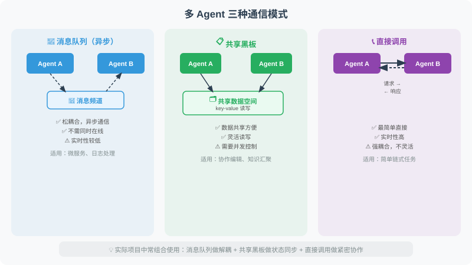
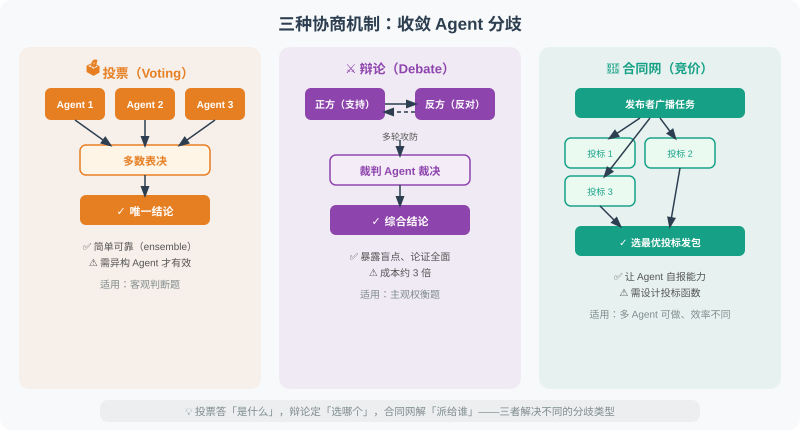

# 18.2 多 Agent 通信模式

多 Agent 系统中，Agent 间如何交换信息是核心设计决策。不同的通信模式适合不同的场景，选择错误会导致系统变得难以维护或性能低下。

本节介绍三种最常见的通信模式，并用代码演示它们的实现方式。读完本节后，你应该能根据项目需求选择合适的模式。



## 三种通信模式

### 模式一：消息队列（异步通信）

消息队列是松耦合的通信方式：发送方将消息放入"频道"，接收方从频道中取出消息。两个 Agent 不需要同时在线，也不需要知道对方的实现细节。这种模式在微服务架构中非常常见。

```python
from typing import TypedDict, Optional
from queue import Queue
import threading

# ============================
# 模式1：消息队列（异步通信）
# ============================

class MessageBus:
    """简单的消息总线，支持 Agent 间异步通信"""
    
    def __init__(self):
        self.channels: dict[str, Queue] = {}
    
    def create_channel(self, name: str):
        """创建频道"""
        self.channels[name] = Queue()
    
    def publish(self, channel: str, message: dict):
        """发布消息"""
        if channel not in self.channels:
            self.create_channel(channel)
        self.channels[channel].put(message)
    
    def subscribe(self, channel: str, timeout: float = 5.0) -> Optional[dict]:
        """订阅消息（等待）"""
        if channel not in self.channels:
            return None
        try:
            return self.channels[channel].get(timeout=timeout)
        except:
            return None

# 使用示例
bus = MessageBus()

def researcher_agent(bus: MessageBus, topic: str):
    """研究员 Agent"""
    # 执行研究
    research_result = f"关于'{topic}'的研究结果..."
    
    # 发布结果
    bus.publish("research_results", {
        "from": "researcher",
        "topic": topic,
        "result": research_result
    })

def writer_agent(bus: MessageBus):
    """写作 Agent：等待研究结果"""
    # 等待研究结果
    message = bus.subscribe("research_results", timeout=10)
    
    if message:
        content = f"基于研究：{message['result'][:50]}...，撰写文章..."
        bus.publish("articles", {
            "from": "writer",
            "content": content
        })

# 并发运行
def run_pipeline(topic: str):
    import threading
    
    t1 = threading.Thread(target=researcher_agent, args=(bus, topic))
    t2 = threading.Thread(target=writer_agent, args=(bus,))
    
    t1.start()
    t2.start()
    t1.join()
    t2.join()
    
    article = bus.subscribe("articles", timeout=15)
    return article

# ============================
# 模式2：共享状态（LangGraph 方式）
# ============================

# 共享状态是 LangGraph 的核心通信方式。
# 每个节点通过修改共享的 State 来"通信"，
# 就像团队成员在共享文档中协作一样。
# 优点：状态完全透明，可以随时检查当前进展。

from typing import TypedDict, Annotated
from langgraph.graph import StateGraph, END, START
import operator

class TeamState(TypedDict):
    """团队共享状态"""
    task: str
    research_notes: Annotated[list, operator.add]  # 可追加
    drafts: Annotated[list, operator.add]          # 可追加
    feedback: Annotated[list, operator.add]        # 可追加
    final_output: Optional[str]

# 每个节点通过修改共享 State 来"通信"
def researcher(state: TeamState) -> dict:
    """研究节点：读取任务，写入研究结果"""
    from openai import OpenAI
    client = OpenAI()
    
    response = client.chat.completions.create(
        model="gpt-4.1-mini",
        messages=[{"role": "user", "content": f"请研究：{state['task']}，给出3个要点"}],
        max_tokens=200
    )
    
    notes = response.choices[0].message.content
    return {"research_notes": [notes]}

def writer(state: TeamState) -> dict:
    """写作节点：读取研究结果，写入草稿"""
    from openai import OpenAI
    client = OpenAI()
    
    context = "\n".join(state.get("research_notes", []))
    response = client.chat.completions.create(
        model="gpt-4.1-mini",
        messages=[{"role": "user", "content": f"基于研究：{context}，写200字文章"}],
        max_tokens=300
    )
    
    draft = response.choices[0].message.content
    return {"drafts": [draft]}

def editor(state: TeamState) -> dict:
    """编辑节点：审查草稿，给出最终输出"""
    latest_draft = state.get("drafts", [""])[-1]
    final = f"【已审核】{latest_draft}"
    return {"final_output": final}

# 构建团队工作流
team_graph = StateGraph(TeamState)
team_graph.add_node("researcher", researcher)
team_graph.add_node("writer", writer)
team_graph.add_node("editor", editor)
team_graph.add_edge(START, "researcher")
team_graph.add_edge("researcher", "writer")
team_graph.add_edge("writer", "editor")
team_graph.add_edge("editor", END)

team_app = team_graph.compile()

result = team_app.invoke({
    "task": "Python 装饰器的应用",
    "research_notes": [],
    "drafts": [],
    "feedback": [],
    "final_output": None
})
print(result["final_output"][:200])

# ============================
# 模式3：直接调用（同步）
# ============================

# 最简单的模式：一个 Agent 像调用函数一样直接调用另一个 Agent。
# 适合简单的依赖关系，但因为是同步阻塞的，
# 调用链太长会影响响应速度。

class AgentNetwork:
    """Agent 网络：Agent 可以直接调用其他 Agent"""
    
    def __init__(self):
        self.agents = {}
    
    def register(self, name: str, agent_func):
        """注册 Agent"""
        self.agents[name] = agent_func
    
    def call(self, agent_name: str, message: str) -> str:
        """调用 Agent"""
        agent = self.agents.get(agent_name)
        if not agent:
            return f"Agent '{agent_name}' 不存在"
        return agent(message)

network = AgentNetwork()

def translate_agent(text: str) -> str:
    from openai import OpenAI
    client = OpenAI()
    response = client.chat.completions.create(
        model="gpt-4.1-mini",
        messages=[{"role": "user", "content": f"翻译为英文：{text}"}],
        max_tokens=100
    )
    return response.choices[0].message.content

network.register("translator", translate_agent)

# 一个 Agent 可以调用另一个
result = network.call("translator", "人工智能正在改变世界")
print(result)
```

### 模式四：协商式通信（收敛分歧）

前三种模式解决"**怎么传消息**"，但没解决"**意见不一致怎么办**"。当多个 Agent 对同一任务给出不同答案时，需要**协商机制**把分歧收敛成单一结论。生产中最常见的三种：



#### 4.1 投票（Voting）

最朴素的协商：N 个 Agent 独立作答，多数表决。适合"答案是客观唯一"的任务（如"这段代码有没有 bug"），不适合"开放性问题"（多数意见不必然正确）。

```python
def majority_vote(answers: list[str]) -> str:
    """多数表决：返回出现次数最多的答案。

    为什么用投票而非取第一个答案：单 Agent 可能出错（幻觉/偏见），
    多个独立 Agent 的多数意见在统计上更可靠（ensemble 效应）。
    前提是各 Agent 必须"独立"——同 prompt 同模型只是重复计算，不增加信息量。
    """
    from collections import Counter
    return Counter(answers).most_common(1)[0][0]

# 使用：三个代码审查 Agent 各自判断"是否通过"
verdicts = ["通过", "通过", "不通过"]
print(majority_vote(verdicts))  # → "通过"
```

> ⚠️ **投票的局限**：三个 Agent 都用同一个模型、同一段 prompt，它们的"错误"高度相关，投票不能消除系统性偏差。真正有效的投票需要**异构**——不同模型、不同视角的 prompt，甚至不同工具链。

#### 4.2 辩论（Debate）

两个 Agent 持对立立场互相反驳，最后由**裁判 Agent**裁决或综合。适合"存在真实权衡、没有标准答案"的决策（技术选型、方案取舍），能暴露单 Agent 想不到的反面论据。

```python
def debate(question: str, llm, rounds: int = 2) -> str:
    """双 Agent 辩论 + 裁判裁决。

    流程：正方立论 → 反方反驳 → ... 交替 rounds 轮 → 裁判综合双方给结论。
    为什么需要裁判：辩论双方都会"越辩越偏执"，必须有第三方不带立场地收口。
    """
    pro, con = "你全力支持这个方案，找出所有优点。", "你全力反对这个方案，找出所有风险和缺陷。"

    pro_msg = f"{pro}\n议题：{question}"
    con_msg = f"{con}\n议题：{question}"

    for _ in range(rounds):
        pro_arg = llm.invoke(pro_msg).content
        con_arg = llm.invoke(f"{con}\n议题：{question}\n正方最新论点：{pro_arg}").content
        # 把对方论点喂回，逼双方针对性地攻防，而非各说各话
        pro_msg = f"{pro}\n议题：{question}\n反方最新论点：{con_arg}"
        con_msg = f"{con}\n议题：{question}\n正方最新论点：{pro_arg}"

    # 裁判不带立场，综合双方论点做最终裁决
    verdict = llm.invoke(
        f"你是不带立场的仲裁者。议题：{question}\n\n正方：{pro_arg}\n反方：{con_arg}\n"
        f"综合双方论据，给出最终决策和理由。"
    ).content
    return verdict
```

> 💡 **辩论 vs 投票**：投票回答"**是什么**"（客观判断题），辩论回答"**该选哪个**"（主观权衡题）。两者不是替代关系，很多系统先投票筛掉明显错误的候选，再对剩余候选辩论定夺。

#### 4.3 合同网协议（Contract Net Protocol）

源自分布式系统经典协议（Smith, 1980），是"**任务竞价**"机制：任务发布者广播任务 → 各 Agent 投标（报出自己完成该任务的能力/成本）→ 发布者选中最优投标。适合"**同一个任务多个 Agent 都能做、但效率不同**"的场景。

```python
class ContractNet:
    """合同网协议：广播任务 → 收集投标 → 择优发包"""

    def __init__(self):
        self.agents: dict[str, dict] = {}  # name -> {capability, bid_fn}

    def register(self, name: str, capability: str, bid_fn):
        """注册投标 Agent。bid_fn 返回 (报价, 信心)，报价越低越优先。"""
        self.agents[name] = {"capability": capability, "bid": bid_fn}

    def award(self, task: str) -> str:
        """广播任务，选择最优投标者执行。

        为什么用"竞价"而非"固定分配"：Agent 对自己的能力/负载最清楚，
        让它们自报"我能不能做、代价多大"，比 Supervisor 拍脑袋分配更准。
        """
        bids = []
        for name, meta in self.agents.items():
            cost, confidence = meta["bid"](task)
            if confidence > 0.5:              # 信心不足的不参与投标
                bids.append((cost, name))
        if not bids:
            return "无 Agent 愿意承接该任务"
        # 选报价最低者（生产里可加权：cost 和 confidence 折中）
        _, winner = min(bids)
        return f"任务派给 {winner}"

# 使用：三个翻译 Agent 各自评估"翻译这篇技术文档"的报价
cn = ContractNet()
cn.register("en_translator", "英译", lambda t: (10, 0.9))   # 专业对口，报价低
cn.register("multi_translator", "多语种", lambda t: (30, 0.7))
cn.register("casual_translator", "通用", lambda t: (5, 0.4)) # 报价低但信心不足，被过滤
print(cn.award("翻译一篇 5000 字的深度学习论文"))  # → 任务派给 en_translator
```

## 共享状态的冲突解决

模式二（共享状态）在**并发写**时会遇到一个工程问题：两个 Agent 同时写同一个 key，谁的覆盖谁的？这就是分布式系统里的经典"**写冲突**"，多 Agent 共享状态同样绕不开。三种解法：

| 解法 | 思路 | 适用 | 对应实现 |
|------|------|------|---------|
| **Reducer 合并** | 写操作不是"覆盖"而是"合并"，由合并函数决定结果 | 追加类状态（列表、消息流） | LangGraph 的 `Annotated[list, operator.add]` |
| **单写者** | 同一时刻只有一个 Agent 能写某个 key，其余排队或读旧值 | 关键状态（当前阶段、最终结论） | 锁 / Supervisor 统一写 |
| **版本号乐观并发** | 写时带版本号，冲突时按规则重试或合并 | 需要高并发写、冲突不频繁 | 类 CRDT / 乐观锁 |

```python
# Reducer 合并的实质：LangGraph 里 Annotated[list, operator.add]
# 的意义不是"列表相加"，而是"并发写同一个 list 时，用 operator.add 合并
# 而非后写覆盖先写"——这保证了多个 Agent 的产出都能进状态、不丢失。
from typing import Annotated, TypedDict
import operator

class ConflictFreeState(TypedDict):
    # 关键：用 reducer 声明的字段，并发写时"累加"而非"覆盖"
    findings: Annotated[list, operator.add]

# 两个 Agent 并发写 findings 各返回一个列表 [A]、[B]
# 最终 state["findings"] == [A, B]，谁的都没丢。
# 反过来，若写成 findings: list（无 reducer），后写者覆盖先写者 → 丢数据。
```

> 🔑 **核心判断**：多 Agent 共享状态的第一条铁律是——**先想清楚"并发写同一字段"会发生什么**。能累加就用 reducer，必须"唯一真值"就用单写者，冲突不频繁才上乐观并发。这比选哪种图框架更重要：框架只是工具，冲突语义才是设计。

## 选择通信模式

| 模式 | 适合 | 优点 | 缺点 |
|------|------|------|------|
| **消息队列** | 松耦合、Agent 可独立扩展 | 解耦、真正的异步 | 调试困难、状态追踪复杂 |
| **共享状态** | 有明确工作流的协作 | 状态透明、易于调试 | 紧耦合、需预先定义 State |
| **直接调用** | 简单的 Agent 间依赖 | 简单直观 | 同步阻塞、耦合度高 |
| **投票** | 客观判断题（对/错、通过/驳回） | 简单、ensemble 提升可靠性 | 同质 Agent 不消除系统性偏差 |
| **辩论** | 有真实权衡的决策 | 暴露盲点、论证更全面 | 成本 3 倍（双方+裁判） |
| **合同网竞价** | 多 Agent 都能做、效率不同 | 让 Agent 自报能力、分配更准 | 需设计投标函数、可能无人应标 |

> 💡 **组合使用是常态**：真实系统很少只用一种。例如"代码审查"先用**投票**筛掉明显问题，再对争议点**辩论**定夺；"任务分发"先**合同网**竞标，执行过程走**共享状态**同步进展。

## 小结

多 Agent 通信分两层：**传输层**解决"消息怎么传"，**协商层**解决"分歧怎么收敛"。

**传输层**（三种核心模式）：
- **消息队列**：`MessageBus` 松耦合异步，适合独立扩展，调试较难
- **共享状态**：LangGraph `StateGraph` 各节点改共享 `TypedDict`，透明易调试
- **直接调用**：`AgentNetwork` 同步调用，简单直观但耦合高

**协商层**（收敛分歧）：
- **投票**：客观判断题，多数表决（需异构 Agent 才有效）
- **辩论**：主观权衡题，双方攻防 + 裁判收口
- **合同网竞价**：任务广播 + 择优发包，让 Agent 自报能力

**共享状态的工程铁律**：并发写同一字段必须先定义冲突语义——能累加用 **reducer**，需唯一真值用**单写者**，冲突不频繁才用**乐观并发**。框架只是工具，冲突语义才是设计核心。

选择通信模式时，核心考量是**耦合度**、**可观测性**和**是否需收敛分歧**三者的权衡。生产环境中，共享状态（LangGraph）因其透明性和可调试性最受欢迎，配合投票/辩论解决关键分歧。

> 📖 **想深入了解各框架的通信模式设计？** 请阅读 [18.6 论文解读：多 Agent 系统前沿研究](./06_paper_readings.md)，涵盖 MetaGPT、ChatDev、AutoGen 等框架的通信模式对比分析。
>
> 💡 **设计启发**：MetaGPT 论文中的一个重要发现是——**非结构化的自由对话会导致信息丢失和误解累积。** 让 Agent 之间传递结构化的中间产物（如 JSON、代码、文档）比传递自然语言消息更可靠。

---

*下一节：[18.3 角色分工与任务分配](./03_role_assignment.md)*
