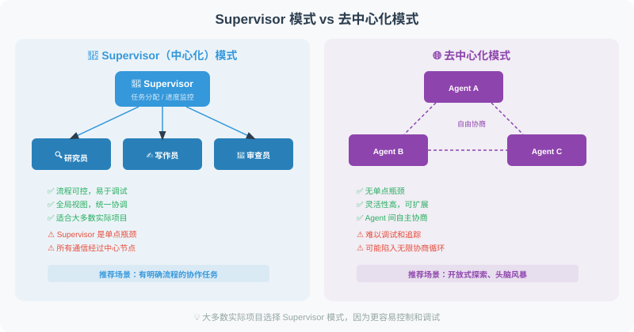
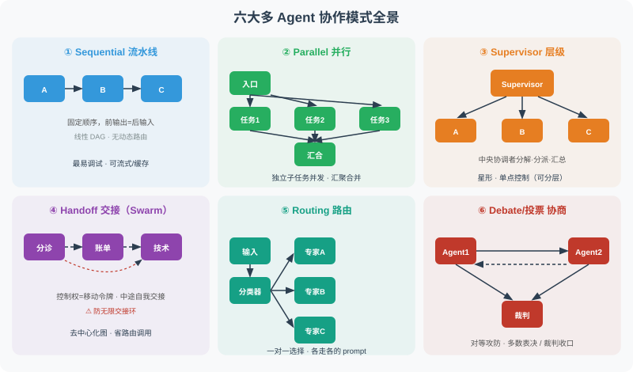

# 18.4 Supervisor 模式 vs. 去中心化模式

多 Agent 系统有一个根本性的架构决策：**谁来协调？** 是设置一个"项目经理"统一调度所有 Agent（Supervisor 模式），还是让 Agent 之间自由协商（去中心化模式）？

这两种模式各有优劣，大多数实际项目会选择 Supervisor 模式，因为它更容易控制和调试。本节通过完整的代码示例对比两种方案。



## 先看全局：六大协作模式

Supervisor vs 去中心化，其实只是多 Agent 协作模式的**两种**。2026 年生产实践中沉淀下来的协作模式共有六种，本节聚焦其中两种，其余已在本书其他位置覆盖：



| 模式 | 拓扑 | 谁来协调 | 一句话场景 | 本书位置 |
|------|------|---------|-----------|---------|
| **Sequential 流水线** | 线性 DAG | 无（固定顺序） | 阶段固定、前一阶段输出是后一阶段输入 | 18.5 实战 |
| **Parallel 并行** | 扇出-扇入 | 汇聚点合并结果 | N 个独立子任务同时跑 | 18.1 |
| **Supervisor 层级** | 星形 | 中央协调者 | 可分解任务、需统一调度 | **本节** |
| **Handoff 交接（Swarm）** | 去中心化图 | 移动令牌（谁持有对话谁决定） | 专家在流程中动态决定"该换人" | **本节** |
| **Routing 路由** | 一对一 | 分类器（规则/小模型） | 输入分属明确类别、各走各的 prompt | 18.3 动态分配 |
| **Debate/投票 协商** | 对等 | 裁判/多数 | 需收敛分歧的决策 | 18.2 |

> 💡 **核心心智模型**：这六种模式不是互斥的，而是可以**嵌套组合**的积木——一个 Supervisor 内部可以是 Parallel 扇出，一个 Handoff 链的某个环节可以再挂一个 Supervisor。架构师的工作是"按任务的真实结构选积木"，而不是"选一个模式用到黑"。

## Supervisor（中心化）模式

Supervisor 模式的工作方式类似于项目管理：一个 Supervisor Agent 负责分析任务、分配子任务、监控进度、汇总结果。所有的决策都通过 Supervisor 来协调。

下面的示例构建了一个"内容创作团队"——Supervisor 协调研究员、写作员和审查员三个子 Agent：

```python
from langgraph.graph import StateGraph, END, START
from langgraph.prebuilt import create_react_agent
from langchain_openai import ChatOpenAI
from langchain_core.tools import tool
from typing import TypedDict, Annotated, Literal
import operator

llm = ChatOpenAI(model="gpt-4.1")
# 子 Agent 用更小的模型（生产里可以换成任何实现），统一走 langchain 接口
mini_llm = ChatOpenAI(model="gpt-4.1-mini")

# ============================
# 定义各子 Agent 的工具
# 注意：这里"工具"内部又调了一次 LLM——这是把"子 Agent"包装成"工具"的教学写法，
# 生产中子 Agent 通常是独立的 ReAct agent，而非单个 @tool 函数。
# ============================

@tool
def do_research(topic: str) -> str:
    """研究专员：深度研究指定主题"""
    response = mini_llm.invoke(f"研究{topic}，给出3个核心观点")
    return response.content

@tool
def write_content(outline: str) -> str:
    """写作专员：根据大纲写内容"""
    response = mini_llm.invoke(f"根据大纲写300字文章：{outline}")
    return response.content

@tool
def review_content(content: str) -> str:
    """审查专员：检查内容质量"""
    response = mini_llm.invoke(f"评审以下内容（评分+建议）：{content[:200]}")
    return response.content

# Supervisor Agent 有所有工具的访问权
supervisor_tools = [do_research, write_content, review_content]
supervisor_agent = create_react_agent(llm, supervisor_tools)

# ============================
# Supervisor 决策逻辑
# ============================

class SupervisorState(TypedDict):
    messages: Annotated[list, operator.add]
    task: str
    research_done: bool
    content_written: bool
    review_done: bool

def supervisor(state: SupervisorState) -> dict:
    """Supervisor：统一协调所有子任务"""
    from langchain_core.messages import HumanMessage, SystemMessage
    
    context = f"""
你是任务协调者，管理一个内容创作团队。
可用工具：do_research, write_content, review_content

任务：{state['task']}
研究完成：{state.get('research_done', False)}
写作完成：{state.get('content_written', False)}
审查完成：{state.get('review_done', False)}

请分析当前进展，决定下一步：
1. 如果研究未完成 → 使用 do_research
2. 如果研究完成但写作未完成 → 使用 write_content
3. 如果写作完成但审查未完成 → 使用 review_content
4. 如果全部完成 → 总结并结束

当前消息历史（用于获取之前的输出）：
{[m.content if hasattr(m, 'content') else str(m) for m in state.get('messages', [])[-3:]]}
"""
    
    result = supervisor_agent.invoke({
        "messages": [HumanMessage(content=context)]
    })
    
    last_msg = result["messages"][-1]
    content = last_msg.content if hasattr(last_msg, 'content') else ""
    
    # 更新状态
    updates = {"messages": [last_msg]}
    if "research" in content.lower():
        updates["research_done"] = True
    if "write" in content.lower() or "文章" in content:
        updates["content_written"] = True
    if "review" in content.lower() or "评审" in content:
        updates["review_done"] = True
    
    return updates

def should_continue(state: SupervisorState) -> str:
    if state.get("review_done"):
        return "end"
    return "continue"

# 构建 Supervisor 图
graph = StateGraph(SupervisorState)
graph.add_node("supervisor", supervisor)
graph.add_edge(START, "supervisor")
graph.add_conditional_edges(
    "supervisor",
    should_continue,
    {"end": END, "continue": "supervisor"}
)

supervisor_app = graph.compile()

# 运行
result = supervisor_app.invoke({
    "messages": [],
    "task": "写一篇关于 Python 异步编程的技术文章",
    "research_done": False,
    "content_written": False,
    "review_done": False
})

print("最终状态：")
print(f"  研究完成: {result['research_done']}")
print(f"  写作完成: {result['content_written']}")
print(f"  审查完成: {result['review_done']}")
```

## 去中心化模式

与 Supervisor 模式不同，去中心化模式没有中央协调者。每个 Agent 都有自己的收件箱，通过广播或点对点消息直接与其他 Agent 通信。这种模式更像是一个自组织团队——成员之间自由讨论，自行决定谁来做什么。

优点是没有单点故障、灵活性高；缺点是协调成本大、容易出现冲突或死锁。

```python
# 去中心化：Agent 之间直接协商，没有中央协调者

class PeerToPeerNetwork:
    """点对点 Agent 网络"""
    
    def __init__(self):
        self.agents = {}
        self.message_board = {}  # 共享消息板
    
    def add_agent(self, name: str, specialization: str):
        self.agents[name] = {
            "name": name,
            "specialization": specialization,
            "inbox": [],
        }
    
    def broadcast(self, sender: str, message: str, target: str = "all"):
        """广播消息"""
        if target == "all":
            for name, agent in self.agents.items():
                if name != sender:
                    agent["inbox"].append({
                        "from": sender,
                        "message": message
                    })
        else:
            if target in self.agents:
                self.agents[target]["inbox"].append({
                    "from": sender,
                    "message": message
                })
    
    def process_inbox(self, agent_name: str) -> list[str]:
        """处理收件箱"""
        agent = self.agents[agent_name]
        messages = agent["inbox"].copy()
        agent["inbox"].clear()
        return [m["message"] for m in messages]

# 使用示例
network = PeerToPeerNetwork()
network.add_agent("research", "信息研究")
network.add_agent("writing", "内容写作")
network.add_agent("editing", "文章编辑")

# Agent 之间直接通信，自组织完成任务
# 这种模式更灵活，但也更难以控制
```

## Handoff（交接）模式：去中心化的现代实践

纯"广播 + 收件箱"的去中心化有个致命伤：**谁来决定下一步？** 广播后所有 Agent 都收到消息，却没人牵头收口，容易陷入"都在看、没人动"。2024 年底 OpenAI 的 Swarm 实验（后升级为生产级 **OpenAI Agents SDK**）给出了一种更实用的去中心化形态——**Handoff（交接）**：把"控制权"当作一个**移动的令牌**，当前持有对话的 Agent 判断"该换人了"，就通过一个**工具调用**把整个对话（含累积上下文）交接给下一个 Agent。

```python
def handoff(target_agent):
    """交接工具：当前 Agent 调用它，把控制权连同上下文转交。

    为什么把"交接"做成工具而非框架调度：让 Agent 自己决定何时交接，
    省去了 Supervisor 每一步的"路由调用"，也允许 Agent 在任务中途
    发现自己不对口时自我纠正——这是 Supervisor 做不到的（Supervisor 只在
    节点边界决策）。
    """
    def transfer(context: str) -> str:
        # 关键：交接时把累积上下文一并传过去，保证对话连贯、不丢信息
        return target_agent(context)
    transfer.__name__ = f"handoff_to_{target_agent}"
    transfer.__doc__ = f"将当前对话交接给 {target_agent} 处理"
    return transfer

# 客服场景：分诊 Agent → 账单 / 技术 / 退款 三选一
def triage_agent(context):
    """分诊：判断问题属于哪一类，然后交接给对应专家"""
    if "账单" in context or "退款" in context:
        return handoff(billing_agent)(context)
    elif "技术" in context or "报错" in context:
        return handoff(tech_agent)(context)
    return "请描述您的问题是账单、技术还是其他。"
```

Handoff 和 Supervisor 的**本质区别**：

| 维度 | Supervisor | Handoff |
|------|-----------|---------|
| 决策点 | 中央协调者在**节点边界**决策 | 当前 Agent 在**对话中途**自我决策 |
| 路由成本 | 每步都付一次 supervisor 路由调用 | 交接只是当前 Agent 循环内的一次工具调用，更省 |
| 控制流可追溯性 | 单线程、易追踪 | 变成一张交接有向图，追踪更难 |
| 典型风险 | Supervisor 误路由全局失败 | **无限交接环**（A→B→A→B）或最终答案归属不明 |

> ⚠️ **Handoff 的头号陷阱：无限交接环**。A 交给 B，B 又交给 A，循环往复烧 token。工程上必须设**交接次数上限**（如 `max_handoffs=5`），超过即强制收口。这也再次印证了 18.3 的"有界重试"思想：**任何循环都要有上界**。

## 层级监督（Supervisor-of-Supervisors）

当专家 Agent 超过约 10 个时，单个 Supervisor 的工具列表会臃肿到难以路由，此时需要**分层**：顶层 Supervisor 只路由到"子 Supervisor"（如账单、技术、工程三个子域），每个子 Supervisor 再管自己的专家池。

```text
顶层 Supervisor（ops）
├── 账单 Supervisor ── 退费 / 开票 / ...
├── 技术 Supervisor ── 排障 / 咨询 / ...
└── 工程 Supervisor ── 评审 / 部署 / ...
```

> 💡 **慎用**：层级监督**很少是正确的起点**——每一层都让"路由开销税"翻倍，也让失败归因更难。只有当专家数确超 10 个、或不同子域需要不同路由策略时才考虑。否则，扁平 Supervisor + 路由式工具选择更简单。

## 脑裂与一致性：去中心化的隐藏代价

去中心化模式最隐蔽的问题是 **split-brain（脑裂）**——两个 Agent 同时写同一份共享状态（共享文档、共享任务队列、共享 scratchpad），都以为自己是"唯一真值源"，互相覆盖对方的结果。这和分布式数据库的脑裂是同一类病。

```python
# 脑裂示例：两个 Agent 同时更新"当前进度"，后写覆盖先写
# Agent A 写 progress="已完成第1步"  →  被 Agent B 的 progress="已完成第2步" 覆盖
# 结果：第1步的成果丢了，无人察觉（因为没有冲突检测）
```

三种解法（与 18.2 的共享状态冲突解决一脉相承）：

| 解法 | 思路 | 代价 |
|------|------|------|
| **单写者** | 同一字段同一时刻只有一个 Agent 能写（Supervisor 模式天然如此） | 牺牲并行度 |
| **CRDT** | 用无冲突可复制数据结构（如计数器、OR-Set），并发写可自动合并 | 只适用于可交换操作 |
| **显式冲突规则** | 写时带版本号，冲突时按预定义规则裁决（如"以时间戳新者为准"） | 需设计裁决逻辑 |

> 🔑 **核心结论**：去中心化的"灵活"是有代价的——它把"谁说了算"这个问题从架构层推给了**状态一致性层**。如果共享状态设计不当，去中心化比 Supervisor 更容易出现"静默丢数据"。**生产建议**：除非有明确的 CRDT 或冲突规则，否则共享状态的关键字段宁可退回到单写者（Supervisor 或加锁）。

## 两种模式对比

| 维度 | Supervisor（中心化） | 去中心化 |
|------|---------------------|---------|
| 协调控制 | ✅ 易于协调和控制，全局视野 | ❌ 协调成本高，可能冲突 |
| 可靠性 | ❌ Supervisor 成为瓶颈和单点故障 | ✅ 无单点故障 |
| 灵活性 | ❌ 依赖 Supervisor 决策 | ✅ 高度灵活，自适应 |
| 调试难度 | ✅ 易于调试和监控 | ❌ 调试困难 |

**建议**：大多数生产场景 → Supervisor 模式；需要高容错性 → 去中心化；任务边界清晰 → Supervisor 更合适。

### 4.1 运行示例：一次 Supervisor 调度

假设用户给 Supervisor 任务"写一篇关于 Python 异步编程的技术文章"，整个流程的 trace 如下：

```
[supervisor] 收到任务: "写一篇关于 Python 异步编程的技术文章"
[supervisor] 检查状态: research_done=False, content_written=False, review_done=False
[supervisor] 决策: "研究未完成，先调 do_research"
[tool do_research]  返回关于 Python asyncio 的 3 个核心观点
[supervisor] 解析输出含 "research" → research_done=True
[supervisor] 检查状态: research_done=True, content_written=False
[supervisor] 决策: "研究完成但写作未完成，调 write_content"
[tool write_content]  返回 300 字文章
[supervisor] 解析输出含 "文章" → content_written=True
[supervisor] 检查状态: content_written=True, review_done=False
[supervisor] 决策: "写作完成但审查未完成，调 review_content"
[tool review_content]  返回评审意见
[supervisor] 解析输出含 "评审" → review_done=True
[supervisor] 检查状态: 全部完成
[supervisor] 决策: "全部完成 → 总结并结束" → should_continue() 返回 "end" → END

最终状态：
  研究完成: True
  写作完成: True
  审查完成: True
```

**这个 trace 的关键点**：Supervisor 在每一步都**自己决定下一步**（不是预定义流程）——这和 LangGraph 的"静态边"不同，Supervisor 模式把决策权完全交给 LLM。**优势**：任务可以灵活调整顺序（比如先审查再写作，根据审查反馈优化）；**代价**：可能陷入死循环或重复（"research_done" 这种字符串判断很容易误判——把"我研究了一下天气"也当成 research_done=True）。**生产中推荐用结构化输出（如 JSON）替代字符串匹配**。

## 小结

本节在多 Agent 六大协作模式（Sequential / Parallel / Supervisor / Handoff / Routing / Debate）的全局视角下，重点对比了两种编排范式：

- **Supervisor（中心化）模式**：中央协调者统一调度，全局视野、易协调易监控，适合任务边界清晰、需严格控流的场景。代价是 Supervisor 成单点瓶颈，且专家过多时需**层级监督**（慎用，路由税翻倍）。
- **Handoff（交接，去中心化现代形态）**：控制权作为移动令牌，当前 Agent 在对话中途自我决定交接，省去每步路由调用。代价是控制流变成有向图难追踪，且**易陷入无限交接环**——必须设交接次数上限。

**两条工程铁律**：
1. **任何循环都要有上界**——Supervisor 的状态判断、Handoff 的交接次数、去中心化的消息轮数，统统要设上限。
2. **去中心化把"谁说了算"推给了状态一致性层**——共享状态关键字段要么单写者、要么 CRDT、要么显式冲突规则，否则容易静默丢数据（脑裂）。

**实际建议**：大多数生产项目优先 Supervisor（可控可调试），仅在需要高容错、Agent 数极大、或专家需在任务中途动态交接时，才引入 Handoff/去中心化。

> 💡 **延伸阅读**：关于多 Agent 系统的专项评估方法（Agent-as-Judge、τ-bench、SWE-bench），详见 [18.6 Agent 专项评估框架](../chapter_20_evaluation/06_agent_evaluation.md)。

---

*下一节：[18.5 实战：多 Agent 软件开发团队](./05_practice_dev_team.md)*
