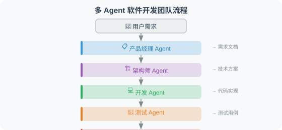

# 18.5 实战：多 Agent 软件开发团队

综合本章所有知识，构建一个多 Agent 软件开发系统，模拟真实的开发团队协作。但这一节的关键不是"把六个角色摆出来"，而是让**交付物真正落盘、验收真正可执行**。

## 系统设计

这个项目包含 6 个角色：产品经理、架构师、开发工程师、测试工程师、DevOps 工程师和文档工程师。每个角色由一个节点承担，通过**共享状态**（`DevState`）传递工作成果。

## 先说清一个常见误区

这一节在很多书里会被写成"六个角色各自调一次 LLM、各返回一段文字"。那种写法**根本不是闭环**：测试工程师节点只是让 LLM 生成一串"测试代码文本"，从不真正执行；所谓"测试通过"是 Agent 自己宣称的，没有任何客观判据。读者照抄后会以为"多 Agent 已经能交付软件"，实则连一行代码都没在磁盘上落地、没跑过一次测试。

下面给出**可运行**的版本：开发工程师把代码真正写到文件，测试工程师用 `pytest` 真正跑测试、收集返回码，测试不通过就回到开发工程师重试——这是测试驱动的闭环，产物可被独立验证。完整代码见仓库 `examples/dev_team/dev_team.py`，配套 4 个 pytest 用例。

## 设计理念

1. **专业分工**：每个 Agent 只负责自己擅长的领域。产品经理不写代码，开发工程师不写测试用例。分工让每个角色的 Prompt 更聚焦。（如果你只是要 N 个同构的"文本 Agent"，工厂函数 `create_agent_node` 这类模式依然成立；但凡是"交付软件"这类需要产物落盘与客观验收的任务，节点必须写文件、跑测试。）
2. **客观验收**：测试是否通过不靠 LLM 自述，而靠 `pytest` 的真实返回码（`test_passed = returncode == 0`）。这是整个系统可信的基础。
3. **测试驱动的闭环**：测试失败时路由回开发工程师重写，直到通过或达到最大迭代次数（防止死循环）。



> 上图是 6 角色协作的概念示意。实际图的边以代码为准：产品 → 架构 → 开发 → 测试 →（不通过则回到开发）→ 通过则 → 运维 → 文档。

## 完整实现

```python
# examples/dev_team/dev_team.py
from __future__ import annotations

import os
import subprocess
import sys
import tempfile
from functools import partial
from typing import Optional, Protocol, TypedDict

from langgraph.graph import START, END, StateGraph


class DevState(TypedDict):
    original_requirement: str
    workspace_dir: str            # 各角色把产物写到这个目录
    product_spec: Optional[str]
    technical_design: Optional[str]
    implementation: Optional[str]
    test_output: Optional[str]    # pytest 的真实输出（不是"假装通过"）
    test_passed: Optional[bool]   # 测试是否通过（客观判据）
    deployment_config: Optional[str]
    documentation: Optional[str]
    current_phase: str
    iteration: int
    max_iterations: int


class Developer(Protocol):
    """代码生成器：输入设计，输出 (源码, 测试源码)。"""
    def develop(self, design: str, requirement: str) -> tuple[str, str]: ...


class DeterministicDeveloper:
    """离线开发者：写出一份已知能通过测试的模块，保证图可跑可测。"""

    def develop(self, design: str, requirement: str) -> tuple[str, str]:
        code = (
            "def add(a: int, b: int) -> int:\n"
            "    return a + b\n"
            "\n"
            "def multiply(a: int, b: int) -> int:\n"
            "    return a * b\n"
        )
        test_code = (
            "from app import add, multiply\n"
            "\n"
            "def test_add():\n"
            "    assert add(2, 3) == 5\n"
            "    assert add(-1, 1) == 0\n"
            "\n"
            "def test_multiply():\n"
            "    assert multiply(2, 3) == 6\n"
        )
        return code, test_code


class LLMDeveloper:
    """真实开发者：调用 LLM 生成代码与测试（需注入 llm 与解析逻辑）。"""

    def __init__(self, llm):
        self.llm = llm

    def develop(self, design: str, requirement: str) -> tuple[str, str]:
        # 把 design + requirement 交给 LLM，从返回中解析出 code / test_code。
        raise NotImplementedError(
            "注入你的代码生成提示与解析；离线演示用 DeterministicDeveloper"
        )


# ---------- 节点 ----------

def product_manager(state: DevState) -> dict:
    spec = (
        f"# 产品规格\n\n需求：{state['original_requirement']}\n\n"
        "- 用户故事：作为用户，我希望进行加、减、乘运算\n"
        "- 验收标准：add / multiply 计算结果正确\n"
    )
    return {"product_spec": spec, "current_phase": "product_manager"}


def architect(state: DevState) -> dict:
    design = (
        "# 技术方案\n\n- 语言：Python\n"
        "- 模块：app.py 暴露 add / multiply\n"
        "- 测试：app_test.py 用 pytest 覆盖\n"
    )
    return {"technical_design": design, "current_phase": "architect"}


def developer(state: DevState, dev: Developer) -> dict:
    # 关键区别：开发工程师把代码真正写到磁盘，而不是只返回一段文本
    code, test_code = dev.develop(state["technical_design"], state["original_requirement"])
    ws = state["workspace_dir"]
    with open(os.path.join(ws, "app.py"), "w", encoding="utf-8") as f:
        f.write(code)
    with open(os.path.join(ws, "app_test.py"), "w", encoding="utf-8") as f:
        f.write(test_code)
    return {
        "implementation": code,
        "current_phase": "developer",
        "iteration": state.get("iteration", 0) + 1,
    }


def tester(state: DevState) -> dict:
    # 注意：这里真正运行 pytest，而不是"假装测试通过"
    ws = state["workspace_dir"]
    proc = subprocess.run(
        [sys.executable, "-m", "pytest", "app_test.py", "-q"],
        cwd=ws,
        capture_output=True,
        text=True,
    )
    return {
        "test_output": proc.stdout + proc.stderr,
        "test_passed": proc.returncode == 0,
        "current_phase": "tester",
    }


def devops(state: DevState) -> dict:
    dockerfile = (
        "FROM python:3.12-slim\nWORKDIR /app\nCOPY . .\n"
        "RUN pip install pytest\nCMD [\"python\", \"-m\", \"pytest\", \"-q\"]\n"
    )
    with open(os.path.join(state["workspace_dir"], "Dockerfile"), "w", encoding="utf-8") as f:
        f.write(dockerfile)
    return {"deployment_config": dockerfile, "current_phase": "devops"}


def docs(state: DevState) -> dict:
    readme = (
        "# 自动生成的项目\n\n由多 Agent 开发团队产出。\n\n"
        "## 测试\n\n```bash\npytest -q\n```\n"
    )
    with open(os.path.join(state["workspace_dir"], "README.md"), "w", encoding="utf-8") as f:
        f.write(readme)
    return {"documentation": readme, "current_phase": "docs"}


def route_after_test(state: DevState) -> str:
    """测试通过后交付；未通过且未达上限则回到开发重试。"""
    passed = state.get("test_passed")
    hit_cap = state.get("iteration", 0) >= state.get("max_iterations", 3)
    if passed or hit_cap:
        return "deliver"
    return "fix"


def build_graph(dev: Developer):
    g = StateGraph(DevState)
    g.add_node("product_manager", product_manager)
    g.add_node("architect", architect)
    g.add_node("developer", partial(developer, dev=dev))
    g.add_node("tester", tester)
    g.add_node("devops", devops)
    g.add_node("docs", docs)

    g.add_edge(START, "product_manager")
    g.add_edge("product_manager", "architect")
    g.add_edge("architect", "developer")
    g.add_edge("developer", "tester")
    g.add_conditional_edges("tester", route_after_test, {
        "deliver": "devops",
        "fix": "developer",
    })
    g.add_edge("devops", "docs")
    g.add_edge("docs", END)
    return g.compile()


def develop(requirement: str, dev: Optional[Developer] = None,
            workspace_dir: Optional[str] = None) -> dict:
    dev = dev or DeterministicDeveloper()
    ws = workspace_dir or tempfile.mkdtemp(prefix="devteam_")
    os.makedirs(ws, exist_ok=True)
    app = build_graph(dev)
    result = app.invoke({
        "original_requirement": requirement,
        "workspace_dir": ws,
        "product_spec": None,
        "technical_design": None,
        "implementation": None,
        "test_output": None,
        "test_passed": None,
        "deployment_config": None,
        "documentation": None,
        "current_phase": "init",
        "iteration": 0,
        "max_iterations": 3,
    })
    return dict(result)


if __name__ == "__main__":
    out = develop("用户管理系统：注册、登录、信息修改")
    print("测试通过：", out["test_passed"])
    print("产物目录：", out["workspace_dir"])
    print(out["test_output"])
```

## 如何运行

```bash
cd examples/dev_team
pip install -e .          # 安装 langgraph + pytest
pytest -v                # 4 个测试全部通过
```

配套测试（`tests/test_dev_team.py`）验证了三件事：

1. 整图离线可跑（`DeterministicDeveloper` 不调 LLM），且最终 `test_passed is True`；
2. 角色**真的写出了文件**——`app.py`、`app_test.py`、`Dockerfile`、`README.md` 都落盘，而不是只返回文本；
3. 路由逻辑正确：失败 → 回到开发重试，通过或达到上限 → 交付。

实际运行输出（`pytest -v`）：

```
tests/test_dev_team.py::test_offline_dev_team_passes_tests PASSED
tests/test_dev_team.py::test_route_fixes_on_failure PASSED
tests/test_dev_team.py::test_route_delivers_when_passed PASSED
tests/test_dev_team.py::test_route_delivers_at_cap PASSED
============================== 4 passed ==============================
```

## 接入真实 LLM

`DeterministicDeveloper` 只为让图"不依赖 API key 也能跑、也能测"。要真正用 LLM 写代码，实现 `LLMDeveloper.develop`：把 `design` + `requirement` 交给模型，从返回中解析出 `code` 与 `test_code`（建议用 `with_structured_output` 约束为 Pydantic 结构，避免正则抽 JSON 的脆弱做法，见 13.4 节）。更复杂的工程化版本（Provider 抽象、注入防护、流式 API）见本书统一底座 `reference-agent/`。

## 关于"并行"

原"六个角色"演示常声称测试、运维、文档三者"并行"。在**可信交付**里，测试必须先作为闸门跑完、通过后才做运维与文档，所以本实现让它们依次执行。若你的场景里运维/文档与代码正确性无关、可独立并行，LangGraph 的扇出（`add_edge` 到多个节点）确实能并行，但请先想清楚：并行任务是否真的不依赖上游产物的正确性。

## 小结

多 Agent 协作的核心要点：

| 要素 | 关键实践 |
|------|---------|
| 角色设计 | 专业化、边界清晰 |
| 通信机制 | 共享状态（LangGraph `StateGraph`） |
| 架构选择 | 线性 + 条件边（本例）；复杂协作可用 Supervisor（见本章前面小节） |
| 验收判据 | 客观可验证：测试靠 `pytest` 返回码，而非 Agent 自述 |
| 闭环 | 测试不通过 → 路由回开发重试（测试驱动），设最大迭代防死循环 |
| 并行执行 | 仅限真正无依赖的任务；涉及正确性的任务先做闸门 |
| 错误处理 | 失败走条件边重试，上限兜底交付 |

---

*下一章：[第19章 Agent 通信协议](../chapter_19_protocol/README.md)*
